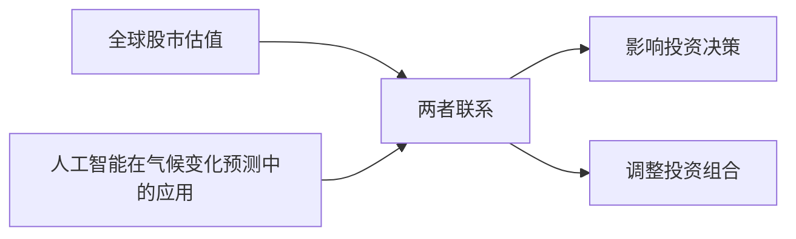

# 全球股市估值与人工智能在气候变化预测中的应用

> 关键词：全球股市估值、人工智能、气候变化预测、金融与气候关联、预测算法

> 摘要：本文聚焦于全球股市估值与人工智能在气候变化预测中的应用。首先深入探讨全球股市估值的基本原理、方法及影响因素，同时介绍人工智能在气候变化预测领域的核心概念、算法原理。接着阐述两者之间可能存在的内在联系，并通过数学模型进行量化分析。通过项目实战展示相关代码的实现与解读，分析实际应用场景。最后推荐学习资源、开发工具和相关论文，总结未来发展趋势与挑战，解答常见问题，为读者全面呈现该领域的知识体系。

## 1. 背景介绍 
### 1.1 目的和范围
本研究旨在深入探究全球股市估值的内在机制以及人工智能在气候变化预测中的应用方式，同时挖掘两者之间潜在的联系。研究范围涵盖全球主要股票市场的估值方法、影响股市估值的各种因素，以及人工智能在气候变化预测中所采用的主流算法、模型和数据处理方式。通过跨领域的研究，为金融投资者、气候研究人员和政策制定者提供有价值的参考信息。

### 1.2 预期读者
本文预期读者包括金融领域的专业人士，如股票分析师、基金经理、投资顾问等，他们可以从气候变化的角度获取新的股市估值思路；气候科学领域的研究人员和学者，能够了解人工智能在该领域的最新应用成果；政策制定者可以根据研究结果制定更加合理的金融和气候政策；此外，对金融和气候领域感兴趣的广大爱好者也能从中获得相关知识。

### 1.3 文档结构概述
本文将按照以下结构展开：首先介绍核心概念，包括全球股市估值和人工智能在气候变化预测中的基本定义和联系；接着详细阐述核心算法原理和具体操作步骤，通过Python代码进行说明；然后给出数学模型和公式，并举例说明；通过项目实战展示代码的实际应用和详细解释；分析实际应用场景；推荐相关的学习资源、开发工具和论文；最后总结未来发展趋势与挑战，解答常见问题并提供扩展阅读和参考资料。

### 1.4 术语表
#### 1.4.1 核心术语定义
- **全球股市估值**：是指对全球各个股票市场上的上市公司进行价值评估的过程，通过分析公司的财务状况、行业前景、宏观经济环境等因素，确定股票的合理价格。
- **人工智能**：是指计算机系统能够执行通常需要人类智能才能完成的任务，如学习、推理、解决问题等。在本文中主要指用于气候变化预测的人工智能技术。
- **气候变化预测**：是指利用各种科学方法和数据，对未来气候变化的趋势、强度和影响进行预估的过程。

#### 1.4.2 相关概念解释
- **市盈率（P/E）**：是指股票价格除以每股收益的比率，是衡量股票估值的常用指标之一。较高的市盈率可能表示市场对该股票的预期较高，但也可能存在泡沫。
- **深度学习**：是人工智能的一个分支，通过构建多层神经网络，让计算机自动从大量数据中学习特征和模式，在图像识别、自然语言处理和预测等领域有广泛应用。
- **气候模型**：是一种数学模型，用于描述气候系统的物理、化学和生物过程，通过输入不同的参数和情景，预测未来气候变化的情况。

#### 1.4.3 缩略词列表
- **AI**：人工智能（Artificial Intelligence）
- **ML**：机器学习（Machine Learning）
- **DL**：深度学习（Deep Learning）
- **P/E**：市盈率（Price-to-Earnings Ratio）

## 2. 核心概念与联系 
### 全球股市估值
全球股市估值是金融领域的重要课题，它关系到投资者的决策和市场的稳定。常见的股市估值方法包括市盈率法、市净率法、现金流折现法等。市盈率法是通过比较股票价格与每股收益来评估股票的相对价值；市净率法是用股票价格除以每股净资产；现金流折现法是将公司未来的现金流折现到当前，以确定公司的内在价值。

影响全球股市估值的因素众多，宏观经济因素如GDP增长率、通货膨胀率、利率等会对股市整体估值产生影响。行业发展前景也是重要因素，新兴行业通常具有较高的估值，因为市场对其未来增长预期较高。公司的财务状况，如盈利能力、偿债能力等，直接影响其股票的估值。

### 人工智能在气候变化预测中的应用
人工智能在气候变化预测中发挥着越来越重要的作用。传统的气候预测方法主要基于物理模型，但这些模型存在计算复杂度高、对数据要求严格等问题。人工智能方法可以通过学习大量的历史气候数据，挖掘数据中的潜在模式和规律，从而进行更准确的预测。

常用的人工智能算法包括机器学习算法（如决策树、支持向量机）和深度学习算法（如卷积神经网络、循环神经网络）。这些算法可以处理复杂的气候数据，如气温、降水、风速等时间序列数据，以及卫星图像等空间数据。

### 两者的联系
全球股市估值与人工智能在气候变化预测之间存在着潜在的联系。气候变化可能会对某些行业的发展产生重大影响，从而影响相关企业的股票估值。例如，随着全球对气候变化的关注度不断提高，清洁能源行业可能会迎来发展机遇，其股票估值可能会上升；而传统能源行业可能会面临挑战，股票估值可能会下降。

人工智能在气候变化预测中的应用可以为投资者提供更准确的信息，帮助他们更好地评估气候变化对股市的影响。通过分析气候变化预测数据，投资者可以调整投资组合，降低风险，提高收益。

以下是核心概念联系的Mermaid流程图：


## 3. 核心算法原理 & 具体操作步骤 
### 全球股市估值算法 - 市盈率法
市盈率法是一种简单而常用的股市估值方法。其基本原理是通过比较股票的市盈率与行业平均市盈率或市场平均市盈率，来判断股票是否被高估或低估。

Python代码实现：
```python
def pe_valuation(stock_price, earnings_per_share, industry_pe):
    """
    市盈率法股票估值
    :param stock_price: 股票当前价格
    :param earnings_per_share: 每股收益
    :param industry_pe: 行业平均市盈率
    :return: 股票估值结果
    """
    stock_pe = stock_price / earnings_per_share
    if stock_pe > industry_pe:
        return "股票被高估"
    elif stock_pe < industry_pe:
        return "股票被低估"
    else:
        return "股票估值合理"

# 示例数据
stock_price = 50
earnings_per_share = 5
industry_pe = 10

result = pe_valuation(stock_price, earnings_per_share, industry_pe)
print(result)
```
具体操作步骤：
1. 收集股票的当前价格和每股收益数据。
2. 获取行业平均市盈率数据。
3. 计算股票的市盈率。
4. 将股票市盈率与行业平均市盈率进行比较，得出估值结果。

### 人工智能在气候变化预测中的算法 - 循环神经网络（RNN）
循环神经网络是一种专门处理序列数据的神经网络，非常适合用于气候变化预测中的时间序列数据。

Python代码实现：
```python
import numpy as np
import tensorflow as tf
from tensorflow.keras.models import Sequential
from tensorflow.keras.layers import SimpleRNN, Dense

# 生成示例数据
data = np.array([i for i in range(100)])
sequence_length = 10
X = []
y = []
for i in range(len(data) - sequence_length):
    X.append(data[i:i+sequence_length])
    y.append(data[i+sequence_length])

X = np.array(X)
y = np.array(y)

# 数据预处理
X = X.reshape((X.shape[0], X.shape[1], 1))

# 构建RNN模型
model = Sequential()
model.add(SimpleRNN(units=32, input_shape=(sequence_length, 1)))
model.add(Dense(1))

# 编译模型
model.compile(optimizer='adam', loss='mse')

# 训练模型
model.fit(X, y, epochs=100, batch_size=32)

# 预测
test_input = np.array([i for i in range(100, 110)])
test_input = test_input.reshape((1, sequence_length, 1))
prediction = model.predict(test_input)
print("预测结果:", prediction)
```
具体操作步骤：
1. 收集历史气候数据，如气温、降水等时间序列数据。
2. 对数据进行预处理，包括归一化、划分训练集和测试集等。
3. 构建RNN模型，确定模型的层数、神经元数量等参数。
4. 编译模型，选择合适的优化器和损失函数。
5. 使用训练集数据对模型进行训练。
6. 使用测试集数据对模型进行评估。
7. 对未来的气候数据进行预测。

## 4. 数学模型和公式 & 详细讲解 & 举例说明 
### 全球股市估值 - 现金流折现法
现金流折现法的基本公式为：
$$V = \sum_{t=1}^{n} \frac{CF_t}{(1 + r)^t}$$
其中，$V$ 表示公司的内在价值，$CF_t$ 表示第 $t$ 期的现金流，$r$ 表示折现率，$n$ 表示预测期数。

详细讲解：该公式的核心思想是将公司未来各期的现金流按照一定的折现率折现到当前，得到公司的内在价值。折现率反映了资金的时间价值和投资风险，通常可以使用加权平均资本成本（WACC）来表示。

举例说明：假设某公司未来三年的现金流分别为 $100$ 万元、$120$ 万元、$150$ 万元，折现率为 $10\%$。则该公司的内在价值为：
$$V = \frac{100}{(1 + 0.1)^1} + \frac{120}{(1 + 0.1)^2} + \frac{150}{(1 + 0.1)^3} \approx 90.91 + 99.17 + 112.69 = 302.77 \text{（万元）}$$

### 人工智能在气候变化预测 - 线性回归模型
线性回归模型的基本公式为：
$$y = \beta_0 + \beta_1x_1 + \beta_2x_2 + \cdots + \beta_nx_n + \epsilon$$
其中，$y$ 表示因变量（如气温），$x_1, x_2, \cdots, x_n$ 表示自变量（如大气中二氧化碳浓度、太阳辐射等），$\beta_0, \beta_1, \cdots, \beta_n$ 表示回归系数，$\epsilon$ 表示误差项。

详细讲解：线性回归模型假设因变量与自变量之间存在线性关系，通过最小化误差项的平方和来估计回归系数。在气候变化预测中，可以使用历史数据来训练线性回归模型，然后根据自变量的未来值来预测因变量的未来值。

举例说明：假设我们使用大气中二氧化碳浓度（$x$）来预测气温（$y$），通过历史数据训练得到线性回归模型 $y = 0.5x + 10$。如果未来大气中二氧化碳浓度为 $400$ ppm，则预测气温为 $y = 0.5 \times 400 + 10 = 210^{\circ}C$。

## 5. 项目实战：代码实际案例和详细解释说明 
### 5.1  开发环境搭建
- **操作系统**：推荐使用Windows 10、Linux（如Ubuntu）或macOS。
- **Python版本**：建议使用Python 3.7及以上版本。
- **开发工具**：可以使用Anaconda作为Python的发行版，它包含了许多常用的科学计算库和工具。同时，可以使用PyCharm、Jupyter Notebook等作为开发环境。
- **安装必要的库**：在命令行中使用以下命令安装所需的库：
```sh
pip install numpy pandas tensorflow scikit-learn matplotlib
```

### 5.2  源代码详细实现和代码解读
以下是一个结合全球股市估值和气候变化预测的项目示例。假设我们要分析气候变化对能源行业股票估值的影响。

```python
import pandas as pd
import numpy as np
from sklearn.linear_model import LinearRegression
import matplotlib.pyplot as plt

# 读取气候变化数据和能源行业股票数据
climate_data = pd.read_csv('climate_data.csv')
stock_data = pd.read_csv('energy_stock_data.csv')

# 数据预处理
# 提取相关特征
climate_features = climate_data[['temperature', 'co2_concentration']]
stock_prices = stock_data['stock_price']

# 划分训练集和测试集
train_size = int(len(climate_features) * 0.8)
X_train = climate_features[:train_size]
y_train = stock_prices[:train_size]
X_test = climate_features[train_size:]
y_test = stock_prices[train_size:]

# 构建线性回归模型
model = LinearRegression()
model.fit(X_train, y_train)

# 模型预测
y_pred = model.predict(X_test)

# 可视化结果
plt.plot(y_test.values, label='Actual Prices')
plt.plot(y_pred, label='Predicted Prices')
plt.xlabel('Time')
plt.ylabel('Stock Price')
plt.title('Prediction of Energy Stock Prices Based on Climate Data')
plt.legend()
plt.show()

# 评估模型
from sklearn.metrics import mean_squared_error
mse = mean_squared_error(y_test, y_pred)
print("Mean Squared Error:", mse)
```
代码解读：
1. **数据读取**：使用 `pandas` 库读取气候变化数据和能源行业股票数据。
2. **数据预处理**：提取相关特征，将数据划分为训练集和测试集。
3. **模型构建**：使用 `sklearn` 库中的 `LinearRegression` 类构建线性回归模型，并使用训练集数据进行训练。
4. **模型预测**：使用训练好的模型对测试集数据进行预测。
5. **可视化结果**：使用 `matplotlib` 库将实际股票价格和预测股票价格进行可视化展示。
6. **模型评估**：使用均方误差（MSE）评估模型的性能。

### 5.3  代码解读与分析
- **数据选择**：选择与气候变化相关的特征（如气温、二氧化碳浓度）和能源行业股票价格作为研究对象，是因为气候变化可能会对能源行业的需求和供应产生影响，从而影响股票价格。
- **模型选择**：线性回归模型是一种简单而有效的模型，适用于初步探索气候变化与股票价格之间的关系。如果数据存在非线性关系，可以考虑使用更复杂的模型，如神经网络。
- **模型评估**：均方误差是一种常用的回归模型评估指标，它衡量了预测值与实际值之间的平均误差。较小的均方误差表示模型的预测性能较好。

## 6. 实际应用场景 
### 金融投资领域
投资者可以利用人工智能在气候变化预测中的成果，评估气候变化对不同行业股票估值的影响，调整投资组合。例如，对于受气候变化影响较大的行业，如农业、能源、保险等，投资者可以根据气候变化预测数据，提前布局相关股票，降低投资风险。

### 政策制定领域
政策制定者可以根据气候变化预测结果，制定相应的金融政策和气候政策。例如，对于清洁能源行业，可以出台补贴政策和税收优惠政策，促进其发展；对于高碳排放行业，可以加强监管，提高其环境成本。

### 企业战略规划领域
企业可以利用气候变化预测数据，制定自身的战略规划。例如，能源企业可以根据气候变化趋势，调整能源结构，加大对清洁能源的投资；农业企业可以根据气候变化预测，调整种植结构，提高农作物的产量和质量。

## 7. 工具和资源推荐
### 7.1 学习资源推荐
#### 7.1.1 书籍推荐
- 《金融市场学》：全面介绍金融市场的基本概念、理论和实践，对于理解全球股市估值有很大帮助。
- 《Python机器学习实战》：详细介绍Python在机器学习领域的应用，包括各种算法的实现和案例分析。
- 《气候变化科学概论》：系统阐述气候变化的基本原理、观测事实和预测方法。

#### 7.1.2 在线课程
- Coursera上的“机器学习”课程：由斯坦福大学教授Andrew Ng授课，是机器学习领域的经典课程。
- edX上的“人工智能基础”课程：介绍人工智能的基本概念、算法和应用。
- 中国大学MOOC上的“气候变化与人类社会”课程：从多个角度探讨气候变化对人类社会的影响。

#### 7.1.3 技术博客和网站
- Medium：上面有很多关于金融和人工智能的技术博客文章，作者来自全球各地的专业人士。
- Kaggle：是一个数据科学竞赛平台，上面有很多关于金融和气候数据的数据集和代码示例。
- IPCC官方网站：提供最新的气候变化研究报告和数据。

### 7.2 开发工具框架推荐
#### 7.2.1 IDE和编辑器
- PyCharm：是一款专业的Python集成开发环境，具有代码编辑、调试、版本控制等功能。
- Jupyter Notebook：是一个交互式的开发环境，适合进行数据分析和模型训练。
- Visual Studio Code：是一款轻量级的代码编辑器，支持多种编程语言，有丰富的插件。

#### 7.2.2 调试和性能分析工具
- TensorBoard：是TensorFlow的可视化工具，可以用于查看模型的训练过程、损失函数变化等。
- Py-Spy：是一个Python性能分析工具，可以帮助找出代码中的性能瓶颈。

#### 7.2.3 相关框架和库
- TensorFlow：是一个开源的深度学习框架，广泛应用于图像识别、自然语言处理和预测等领域。
- PyTorch：是另一个流行的深度学习框架，具有动态图的优势，易于使用和调试。
- Scikit-learn：是一个Python机器学习库，提供了各种机器学习算法和工具，如分类、回归、聚类等。

### 7.3 相关论文著作推荐
#### 7.3.1 经典论文
- “A Random Walk Down Wall Street”：探讨了股票市场的有效性和随机漫步理论。
- “Neural Networks for Pattern Recognition”：介绍了神经网络在模式识别中的应用。
- “The Physical Science Basis”：是IPCC第五次评估报告的第一工作组报告，全面阐述了气候变化的物理科学基础。

#### 7.3.2 最新研究成果
- 关注《Nature》、《Science》等顶级科学期刊上关于气候变化和金融领域的最新研究论文。
- 查阅相关学术数据库，如IEEE Xplore、ACM Digital Library等，获取最新的人工智能研究成果。

#### 7.3.3 应用案例分析
- 分析一些知名金融机构和科研团队在气候变化预测和股市估值方面的应用案例，了解他们的方法和经验。

## 8. 总结：未来发展趋势与挑战
### 未来发展趋势
- **跨领域融合加深**：全球股市估值和人工智能在气候变化预测的融合将更加深入，出现更多跨学科的研究和应用。例如，开发更加复杂的模型，综合考虑气候变化、金融市场和宏观经济因素。
- **数据驱动的决策**：随着数据的不断丰富和计算能力的提高，基于数据的决策将成为主流。投资者和政策制定者将更加依赖人工智能和大数据分析来评估气候变化对股市的影响。
- **技术创新**：人工智能技术将不断创新，如强化学习、生成对抗网络等可能会应用到气候变化预测和股市估值中，提高预测的准确性和效率。

### 挑战
- **数据质量和可用性**：气候变化数据和金融数据的质量和可用性是一个挑战。数据可能存在缺失、误差等问题，需要进行有效的数据清洗和预处理。
- **模型解释性**：人工智能模型通常是黑盒模型，难以解释其决策过程。在金融和气候领域，模型的解释性非常重要，需要开发可解释的人工智能模型。
- **不确定性**：气候变化和股市都存在很大的不确定性，如何在不确定性的情况下进行准确的预测和决策是一个难题。

## 9. 附录：常见问题与解答
### 问题1：如何获取准确的气候变化数据和金融数据？
解答：可以从官方机构获取气候变化数据，如IPCC、NOAA等；金融数据可以从金融数据提供商获取，如Bloomberg、Wind等。同时，也可以使用公开数据集，如Kaggle上的相关数据集。

### 问题2：人工智能模型在气候变化预测和股市估值中的准确性如何？
解答：人工智能模型的准确性受到多种因素的影响，如数据质量、模型选择、参数调整等。在实际应用中，需要不断优化模型，进行模型评估和验证，以提高模型的准确性。

### 问题3：气候变化对哪些行业的股票估值影响较大？
解答：气候变化对农业、能源、保险、旅游等行业的股票估值影响较大。例如，气候变化可能导致农作物减产，影响农业企业的利润；能源行业的需求和供应也会受到气候变化的影响；保险行业需要应对气候变化带来的自然灾害风险；旅游行业可能受到气候条件的影响。

## 10. 扩展阅读 & 参考资料
### 扩展阅读
- 《气候经济与人类未来》：探讨了气候变化对经济的影响以及应对策略。
- 《智能时代》：介绍了人工智能在各个领域的应用和发展趋势。

### 参考资料
- IPCC. Climate Change 2021: The Physical Science Basis. Contribution of Working Group I to the Sixth Assessment Report of the Intergovernmental Panel on Climate Change. Cambridge University Press.
- Goodfellow, I. J., Bengio, Y., & Courville, A. (2016). Deep Learning. MIT Press.
- Sharpe, W. F., Alexander, G. J., & Bailey, J. V. (1999). Investments. Prentice Hall.

作者：AI天才研究院/AI Genius Institute & 禅与计算机程序设计艺术 /Zen And The Art of Computer Programming