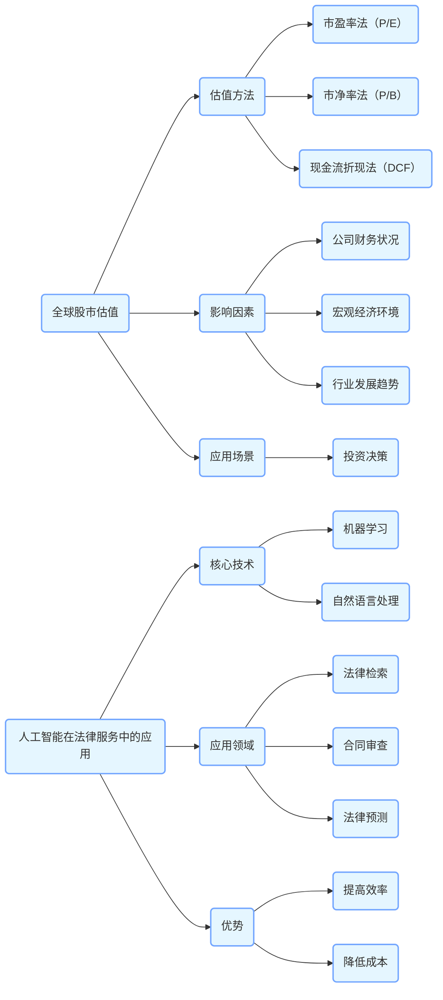

# 全球股市估值与人工智能在法律服务中的应用

> 关键词：全球股市估值、人工智能、法律服务、金融市场、法律科技

> 摘要：本文聚焦于全球股市估值与人工智能在法律服务中的应用这两个看似不相关，实则存在潜在联系的领域。首先深入探讨全球股市估值的方法、影响因素以及其在金融市场中的重要性。接着详细阐述人工智能在法律服务领域的核心概念、算法原理、数学模型等内容，并通过项目实战展示其具体应用。分析人工智能在法律服务中的实际应用场景，推荐相关的学习资源、开发工具和论文著作。最后总结两个领域的未来发展趋势与挑战，旨在为读者全面呈现这两个领域的现状与发展方向，揭示它们之间可能存在的协同关系。

## 1. 背景介绍 
### 1.1 目的和范围
本文的目的在于全面剖析全球股市估值的相关理论和实践，以及人工智能在法律服务中的应用现状和发展前景。范围涵盖全球股市估值的多种方法和影响因素，人工智能在法律服务中的各个环节，包括但不限于法律检索、合同审查、法律预测等。通过对这两个领域的研究，旨在为投资者、法律从业者以及相关研究人员提供有价值的参考信息，促进金融和法律领域的创新发展。

### 1.2 预期读者
预期读者包括金融市场的投资者、证券分析师、基金经理等专业人士，他们可以从全球股市估值的内容中获取决策依据。法律从业者，如律师、法官、法律学者等，能够从人工智能在法律服务中的应用中找到提高工作效率和质量的方法。同时，对金融和法律领域交叉研究感兴趣的研究人员、学生也能从本文中获得启发。

### 1.3 文档结构概述
本文首先介绍全球股市估值和人工智能在法律服务应用的背景信息，包括目的、预期读者和文档结构概述等。接着阐述两个领域的核心概念与联系，通过文本示意图和 Mermaid 流程图展示其架构。然后详细讲解核心算法原理和具体操作步骤，结合 Python 源代码进行说明。随后介绍相关的数学模型和公式，并举例说明。通过项目实战展示人工智能在法律服务中的具体实现和代码解读。分析实际应用场景，推荐相关的工具和资源。最后总结未来发展趋势与挑战，解答常见问题，并提供扩展阅读和参考资料。

### 1.4 术语表
#### 1.4.1 核心术语定义
- **全球股市估值**：是指对全球范围内各个股票市场上的股票价值进行评估的过程和方法，通过对公司财务状况、宏观经济环境、行业发展趋势等多种因素的分析，确定股票的合理价格。
- **人工智能**：是一门研究如何使计算机能够模拟人类智能的学科和技术，包括机器学习、自然语言处理、计算机视觉等多个领域，旨在让计算机具有感知、学习、推理和决策等能力。
- **法律服务**：是指律师、法律机构等为客户提供的各种法律相关的服务，包括法律咨询、诉讼代理、合同起草等。

#### 1.4.2 相关概念解释
- **机器学习**：是人工智能的一个重要分支，通过让计算机从数据中学习模式和规律，从而实现对未知数据的预测和分类等任务。常见的机器学习算法包括决策树、神经网络、支持向量机等。
- **自然语言处理**：是研究如何让计算机理解和处理人类语言的技术，包括文本分类、信息抽取、机器翻译等任务。在法律服务中，自然语言处理可以用于法律文本的分析和理解。
- **法律知识图谱**：是一种将法律知识以图的形式表示的技术，通过节点和边来表示法律概念、法律条文之间的关系，有助于法律信息的检索和推理。

#### 1.4.3 缩略词列表
- **AI**：Artificial Intelligence，人工智能
- **ML**：Machine Learning，机器学习
- **NLP**：Natural Language Processing，自然语言处理

## 2. 核心概念与联系 

### 全球股市估值的核心概念
全球股市估值是金融领域的重要课题，其核心目标是确定股票的内在价值，以便投资者做出合理的投资决策。常见的估值方法包括市盈率法（P/E）、市净率法（P/B）、现金流折现法（DCF）等。

- **市盈率法（P/E）**：是指股票价格与每股收益的比率，反映了投资者为获取公司每一元盈利所愿意支付的价格。市盈率越高，通常表示市场对该股票的预期越高，但也可能意味着股票被高估。
- **市净率法（P/B）**：是指股票价格与每股净资产的比率，反映了股票价格相对于公司净资产的倍数。市净率较低的股票可能被低估，但也可能反映出公司存在一些潜在问题。
- **现金流折现法（DCF）**：是通过预测公司未来的现金流，并将其折现到当前时刻，来确定公司的内在价值。该方法考虑了货币的时间价值和公司的长期发展前景，是一种较为复杂但较为准确的估值方法。

### 人工智能在法律服务中的核心概念
人工智能在法律服务中的应用主要涉及机器学习、自然语言处理等技术，旨在提高法律服务的效率和质量。

- **法律检索**：利用自然语言处理技术，让计算机能够理解用户的法律问题，并从大量的法律文本中检索出相关的法律条文、案例等信息。
- **合同审查**：通过机器学习算法，对合同文本进行分析，检查合同条款是否存在风险、漏洞等问题，并提供相应的修改建议。
- **法律预测**：利用机器学习和数据分析技术，对法律案件的结果进行预测，为律师和当事人提供决策参考。

### 两者的联系
全球股市估值和人工智能在法律服务中的应用虽然属于不同的领域，但也存在一定的联系。一方面，金融市场的稳定和发展离不开良好的法律环境，人工智能在法律服务中的应用可以提高法律的执行效率和公正性，从而促进金融市场的健康发展。另一方面，全球股市估值的结果会影响投资者的决策，进而影响企业的融资和发展，而企业的法律合规性也会对其股价产生影响。因此，人工智能在法律服务中的应用可以帮助企业更好地遵守法律法规，降低法律风险，从而提高企业的价值和股价。

### 文本示意图
```plaintext
全球股市估值
├── 估值方法
│   ├── 市盈率法（P/E）
│   ├── 市净率法（P/B）
│   └── 现金流折现法（DCF）
├── 影响因素
│   ├── 公司财务状况
│   ├── 宏观经济环境
│   └── 行业发展趋势
└── 应用场景
    └── 投资决策

人工智能在法律服务中的应用
├── 核心技术
│   ├── 机器学习
│   └── 自然语言处理
├── 应用领域
│   ├── 法律检索
│   ├── 合同审查
│   └── 法律预测
└── 优势
    ├── 提高效率
    └── 降低成本
```

### Mermaid 流程图


## 3. 核心算法原理 & 具体操作步骤 

### 全球股市估值的核心算法原理及操作步骤
#### 市盈率法（P/E）
- **原理**：市盈率法的基本原理是通过比较同行业或类似公司的市盈率，来确定目标公司的合理市盈率，然后根据目标公司的每股收益计算出股票的合理价格。计算公式为：$股票价格 = 市盈率 \times 每股收益$。
- **操作步骤**：
    1. 确定同行业或类似公司的平均市盈率。可以通过查阅金融数据库、行业研究报告等方式获取相关数据。
    2. 计算目标公司的每股收益。每股收益可以从公司的财务报表中获取。
    3. 将平均市盈率乘以目标公司的每股收益，得到股票的合理价格。

#### 市净率法（P/B）
- **原理**：市净率法的基本原理是通过比较同行业或类似公司的市净率，来确定目标公司的合理市净率，然后根据目标公司的每股净资产计算出股票的合理价格。计算公式为：$股票价格 = 市净率 \times 每股净资产$。
- **操作步骤**：
    1. 确定同行业或类似公司的平均市净率。可以通过查阅金融数据库、行业研究报告等方式获取相关数据。
    2. 计算目标公司的每股净资产。每股净资产可以从公司的财务报表中获取。
    3. 将平均市净率乘以目标公司的每股净资产，得到股票的合理价格。

#### 现金流折现法（DCF）
- **原理**：现金流折现法的基本原理是将公司未来的现金流折现到当前时刻，以确定公司的内在价值。计算公式为：$V = \sum_{t=1}^{n} \frac{CF_t}{(1 + r)^t}$，其中 $V$ 表示公司的内在价值，$CF_t$ 表示第 $t$ 期的现金流，$r$ 表示折现率，$n$ 表示预测期数。
- **操作步骤**：
    1. 预测公司未来的现金流。可以通过分析公司的历史财务数据、行业发展趋势等因素，对公司未来的现金流进行预测。
    2. 确定折现率。折现率通常可以采用加权平均资本成本（WACC），考虑了公司的股权成本和债务成本。
    3. 将未来的现金流按照折现率折现到当前时刻，得到公司的内在价值。
    4. 根据公司的总股本，计算出每股的内在价值。

### Python 代码实现
```python
# 市盈率法
def pe_valuation(pe_ratio, eps):
    """
    市盈率法计算股票价格
    :param pe_ratio: 市盈率
    :param eps: 每股收益
    :return: 股票价格
    """
    return pe_ratio * eps

# 市净率法
def pb_valuation(pb_ratio, bvps):
    """
    市净率法计算股票价格
    :param pb_ratio: 市净率
    :param bvps: 每股净资产
    :return: 股票价格
    """
    return pb_ratio * bvps

# 现金流折现法
def dcf_valuation(cash_flows, discount_rate):
    """
    现金流折现法计算公司内在价值
    :param cash_flows: 未来现金流列表
    :param discount_rate: 折现率
    :return: 公司内在价值
    """
    value = 0
    for i, cf in enumerate(cash_flows):
        value += cf / (1 + discount_rate) ** (i + 1)
    return value

# 示例数据
pe_ratio = 20
eps = 2
pb_ratio = 3
bvps = 5
cash_flows = [100, 120, 150, 180, 200]
discount_rate = 0.1

# 计算股票价格和公司内在价值
pe_price = pe_valuation(pe_ratio, eps)
pb_price = pb_valuation(pb_ratio, bvps)
dcf_value = dcf_valuation(cash_flows, discount_rate)

print(f"市盈率法计算的股票价格: {pe_price}")
print(f"市净率法计算的股票价格: {pb_price}")
print(f"现金流折现法计算的公司内在价值: {dcf_value}")
```

### 人工智能在法律服务中的核心算法原理及操作步骤
#### 法律检索
- **原理**：法律检索主要利用自然语言处理技术，包括词法分析、句法分析、语义理解等，将用户的法律问题转化为计算机能够理解的形式，然后在法律文本数据库中进行检索。常见的检索算法包括布尔检索、向量空间模型等。
- **操作步骤**：
    1. 对用户的法律问题进行预处理，包括分词、去除停用词、词干提取等操作。
    2. 将预处理后的问题表示为向量形式，可以使用词袋模型、TF-IDF 等方法。
    3. 在法律文本数据库中，将每个法律文本也表示为向量形式。
    4. 计算用户问题向量与每个法律文本向量之间的相似度，可以使用余弦相似度等方法。
    5. 根据相似度排序，返回相似度较高的法律文本。

#### 合同审查
- **原理**：合同审查主要利用机器学习算法，对合同文本进行分类、信息抽取等操作，以发现合同中的风险和漏洞。常见的机器学习算法包括决策树、支持向量机、神经网络等。
- **操作步骤**：
    1. 收集大量的合同文本数据，并进行标注，标记出合同中的风险条款、漏洞等信息。
    2. 对合同文本进行预处理，包括分词、去除停用词、词干提取等操作。
    3. 将预处理后的合同文本表示为向量形式，可以使用词袋模型、TF-IDF 等方法。
    4. 使用机器学习算法对标注数据进行训练，得到合同审查模型。
    5. 将待审查的合同文本输入到训练好的模型中，模型输出合同中的风险和漏洞信息。

#### 法律预测
- **原理**：法律预测主要利用机器学习和数据分析技术，对法律案件的结果进行预测。常见的方法包括基于历史案例的统计分析、基于机器学习模型的预测等。
- **操作步骤**：
    1. 收集大量的法律案件数据，包括案件的基本信息、当事人信息、判决结果等。
    2. 对案件数据进行预处理，包括数据清洗、特征提取等操作。
    3. 选择合适的机器学习算法，如逻辑回归、决策树、神经网络等。
    4. 使用预处理后的数据对机器学习算法进行训练，得到法律预测模型。
    5. 将待预测的案件信息输入到训练好的模型中，模型输出案件的预测结果。

### Python 代码实现（以法律检索为例）
```python
import numpy as np
from sklearn.feature_extraction.text import TfidfVectorizer
from sklearn.metrics.pairwise import cosine_similarity

# 法律文本数据库
legal_texts = [
    "根据《中华人民共和国合同法》规定，当事人应当按照约定履行自己的义务。",
    "《中华人民共和国民法总则》规定，民事主体的人身权利、财产权利以及其他合法权益受法律保护。",
    "《中华人民共和国刑法》对犯罪行为进行了明确的界定和处罚。"
]

# 用户法律问题
user_question = "合同法中关于义务履行的规定是什么？"

# 预处理和向量化
vectorizer = TfidfVectorizer()
legal_vectors = vectorizer.fit_transform(legal_texts)
question_vector = vectorizer.transform([user_question])

# 计算相似度
similarities = cosine_similarity(question_vector, legal_vectors)

# 排序并返回结果
sorted_indices = np.argsort(similarities[0])[::-1]
top_result_index = sorted_indices[0]
top_result_text = legal_texts[top_result_index]

print(f"最相关的法律文本: {top_result_text}")
```

## 4. 数学模型和公式 & 详细讲解 & 举例说明 

### 全球股市估值的数学模型和公式
#### 市盈率法（P/E）
- **公式**：$P = P/E \times EPS$，其中 $P$ 表示股票价格，$P/E$ 表示市盈率，$EPS$ 表示每股收益。
- **详细讲解**：市盈率反映了市场对公司盈利的预期。如果一个公司的市盈率较高，说明市场对该公司的未来盈利增长有较高的期望；反之，如果市盈率较低，可能表示市场对该公司的前景不太乐观。每股收益是公司净利润除以总股本得到的，反映了公司的盈利能力。
- **举例说明**：假设某公司的市盈率为 20，每股收益为 2 元，则该公司的股票价格为 $20 \times 2 = 40$ 元。

#### 市净率法（P/B）
- **公式**：$P = P/B \times BVPS$，其中 $P$ 表示股票价格，$P/B$ 表示市净率，$BVPS$ 表示每股净资产。
- **详细讲解**：市净率反映了股票价格相对于公司净资产的倍数。市净率较低的股票可能被低估，但也可能反映出公司存在一些潜在问题，如资产质量不佳、盈利能力较弱等。每股净资产是公司净资产除以总股本得到的，反映了公司的资产价值。
- **举例说明**：假设某公司的市净率为 3，每股净资产为 5 元，则该公司的股票价格为 $3 \times 5 = 15$ 元