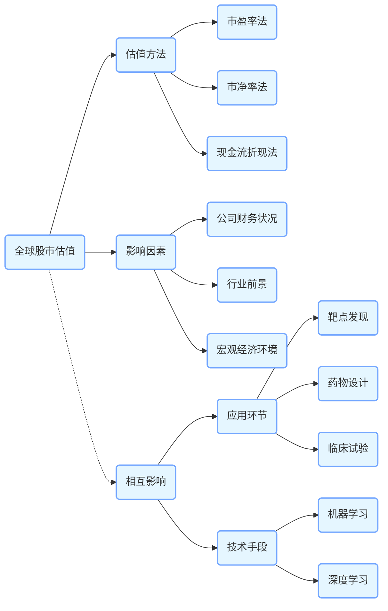

# 全球股市估值与人工智能在药物研发中的应用

> 关键词：全球股市估值、人工智能、药物研发、估值模型、研发效率

> 摘要：本文深入探讨了全球股市估值以及人工智能在药物研发中的应用。首先介绍了全球股市估值的背景知识，包括目的、预期读者、文档结构等。接着阐述了股市估值和人工智能药物研发的核心概念及联系，详细讲解了相关的核心算法原理、数学模型和公式。通过项目实战案例，展示了如何将理论应用于实际。分析了这两个领域的实际应用场景，并推荐了学习所需的工具和资源。最后总结了未来的发展趋势与挑战，解答了常见问题并提供了扩展阅读和参考资料，旨在为读者全面呈现这两个热门领域的技术与应用。

## 1. 背景介绍 
### 1.1 目的和范围
本文章的主要目的是将全球股市估值和人工智能在药物研发中的应用这两个看似不相关的领域进行深入剖析和联系。在全球股市估值方面，旨在帮助投资者、分析师等理解股市估值的原理、方法以及影响因素，从而做出更明智的投资决策。对于人工智能在药物研发中的应用，将详细介绍其如何改变传统药物研发的流程，提高研发效率和成功率。范围涵盖了全球股市的主要市场，如美国股市、欧洲股市、亚洲股市等，以及人工智能在药物研发各个环节的应用，包括靶点发现、药物设计、临床试验等。

### 1.2 预期读者
预期读者包括金融领域的投资者、股票分析师、基金经理等，他们可以从文章中获取关于全球股市估值的新方法和思路，为投资决策提供参考。同时，生物制药行业的科研人员、企业管理人员也能从中了解人工智能在药物研发中的应用现状和发展趋势，为企业的研发战略提供指导。此外，对计算机科学、人工智能和金融科技交叉领域感兴趣的学生和研究人员也可以通过本文拓宽知识面。

### 1.3 文档结构概述
本文将按照以下结构进行阐述：首先介绍相关背景知识，包括目的、读者和文档结构概述以及术语表。接着深入探讨全球股市估值和人工智能在药物研发中的核心概念及联系，并给出相应的示意图和流程图。然后详细讲解核心算法原理和具体操作步骤，通过Python代码进行展示。之后介绍相关的数学模型和公式，并举例说明。通过项目实战案例，展示如何在实际中应用这些理论。分析实际应用场景，为不同领域的读者提供借鉴。推荐学习所需的工具和资源，包括书籍、在线课程、开发工具等。最后总结未来发展趋势与挑战，解答常见问题并提供扩展阅读和参考资料。

### 1.4 术语表
#### 1.4.1 核心术语定义
- **全球股市估值**：对全球范围内各个股票市场中上市公司的价值进行评估的过程，通过各种方法和指标来确定股票的合理价格。
- **人工智能（AI）**：计算机科学的一个分支，旨在使计算机系统能够模拟人类的智能行为，如学习、推理、决策等。
- **药物研发**：从发现潜在的药物靶点开始，经过药物设计、合成、筛选、临床试验等一系列过程，最终开发出安全有效的药物的过程。
- **靶点发现**：在生物体内寻找与疾病相关的分子或细胞靶点，为药物研发提供目标。
- **药物设计**：根据靶点的结构和功能信息，设计出能够与靶点特异性结合的药物分子。

#### 1.4.2 相关概念解释
- **市盈率（P/E）**：股票价格与每股收益的比率，是常用的股市估值指标之一，反映了投资者为获取每股收益所愿意支付的价格。
- **机器学习**：人工智能的一个重要分支，通过让计算机从数据中学习模式和规律，从而实现预测和决策。
- **深度学习**：一种基于人工神经网络的机器学习方法，具有强大的特征提取和模式识别能力，在图像识别、自然语言处理等领域取得了显著成果。
- **高通量筛选**：一种快速筛选大量化合物的技术，用于发现具有潜在药物活性的化合物。

#### 1.4.3 缩略词列表
- **AI**：Artificial Intelligence（人工智能）
- **ML**：Machine Learning（机器学习）
- **DL**：Deep Learning（深度学习）
- **P/E**：Price-to-Earnings Ratio（市盈率）
- **HTS**：High-Throughput Screening（高通量筛选）

## 2. 核心概念与联系 

### 全球股市估值核心概念
全球股市估值是一个复杂的过程，涉及到对上市公司的财务状况、行业前景、宏观经济环境等多个因素的综合考虑。常见的估值方法包括市盈率法、市净率法、现金流折现法等。市盈率法是通过将股票价格除以每股收益来计算市盈率，然后与同行业或市场平均市盈率进行比较，判断股票是否被高估或低估。市净率法是将股票价格除以每股净资产，反映了股票价格相对于公司净资产的倍数。现金流折现法是通过预测公司未来的现金流，并将其折现到当前价值，从而确定公司的内在价值。

### 人工智能在药物研发中的核心概念
人工智能在药物研发中的应用主要集中在靶点发现、药物设计、临床试验等环节。在靶点发现方面，人工智能可以通过分析大量的生物数据，如基因序列、蛋白质结构等，寻找与疾病相关的潜在靶点。在药物设计方面，人工智能可以利用机器学习和深度学习算法，根据靶点的结构和功能信息，设计出具有潜在活性的药物分子。在临床试验方面，人工智能可以帮助优化试验设计，提高试验效率和成功率。

### 两者的联系
全球股市估值和人工智能在药物研发中的应用之间存在着一定的联系。一方面，人工智能在药物研发中的应用可以提高药物研发的效率和成功率，从而增加生物制药企业的盈利能力和市场竞争力，进而影响其在股市中的估值。另一方面，股市的估值情况也可以反映市场对人工智能在药物研发领域应用的预期和信心。如果市场对人工智能在药物研发中的应用前景看好，那么相关生物制药企业的股票可能会受到投资者的追捧，估值也会相应提高。

### 文本示意图
```plaintext
全球股市估值
|-- 估值方法
|   |-- 市盈率法
|   |-- 市净率法
|   |-- 现金流折现法
|-- 影响因素
|   |-- 公司财务状况
|   |-- 行业前景
|   |-- 宏观经济环境

人工智能在药物研发中的应用
|-- 应用环节
|   |-- 靶点发现
|   |-- 药物设计
|   |-- 临床试验
|-- 技术手段
|   |-- 机器学习
|   |-- 深度学习
```

### Mermaid 流程图


## 3. 核心算法原理 & 具体操作步骤 

### 全球股市估值的核心算法原理及 Python 实现

#### 市盈率法
市盈率法的核心原理是通过比较股票的市盈率与同行业或市场平均市盈率来判断股票的估值情况。计算公式为：

$$P/E = \frac{股价}{每股收益}$$

以下是一个简单的 Python 代码示例，用于计算某股票的市盈率并与同行业平均市盈率进行比较：

```python
# 某股票的股价
stock_price = 50
# 某股票的每股收益
earnings_per_share = 2
# 同行业平均市盈率
industry_pe = 20

# 计算该股票的市盈率
stock_pe = stock_price / earnings_per_share

if stock_pe > industry_pe:
    print("该股票可能被高估")
elif stock_pe < industry_pe:
    print("该股票可能被低估")
else:
    print("该股票估值合理")
```

#### 现金流折现法
现金流折现法的核心原理是将公司未来的现金流折现到当前价值，从而确定公司的内在价值。计算公式为：

$$V = \sum_{t=1}^{n} \frac{CF_t}{(1 + r)^t}$$

其中，$V$ 表示公司的内在价值，$CF_t$ 表示第 $t$ 期的现金流，$r$ 表示折现率，$n$ 表示预测期数。

以下是一个简单的 Python 代码示例，用于计算公司的内在价值：

```python
# 预测的未来各期现金流
cash_flows = [100, 120, 150, 180, 200]
# 折现率
discount_rate = 0.1

# 计算公司的内在价值
intrinsic_value = 0
for i, cf in enumerate(cash_flows):
    intrinsic_value += cf / ((1 + discount_rate) ** (i + 1))

print("公司的内在价值为:", intrinsic_value)
```

### 人工智能在药物研发中的核心算法原理及 Python 实现

#### 机器学习在靶点发现中的应用
在靶点发现中，机器学习可以用于分析生物数据，寻找与疾病相关的潜在靶点。以基因表达数据为例，我们可以使用支持向量机（SVM）算法进行分类，判断某个基因是否与疾病相关。

以下是一个简单的 Python 代码示例，使用 `scikit-learn` 库实现 SVM 分类：

```python
from sklearn import datasets
from sklearn.model_selection import train_test_split
from sklearn.svm import SVC
from sklearn.metrics import accuracy_score

# 加载示例数据集
iris = datasets.load_iris()
X = iris.data
y = iris.target

# 划分训练集和测试集
X_train, X_test, y_train, y_test = train_test_split(X, y, test_size=0.3, random_state=42)

# 创建 SVM 分类器
clf = SVC(kernel='linear')

# 训练模型
clf.fit(X_train, y_train)

# 预测
y_pred = clf.predict(X_test)

# 计算准确率
accuracy = accuracy_score(y_test, y_pred)
print("模型准确率:", accuracy)
```

#### 深度学习在药物设计中的应用
在药物设计中，深度学习可以用于生成具有潜在活性的药物分子。以生成对抗网络（GAN）为例，我们可以使用 GAN 生成新的药物分子结构。

以下是一个简单的 Python 代码示例，使用 `PyTorch` 库实现一个简单的 GAN：

```python
import torch
import torch.nn as nn
import torch.optim as optim

# 定义生成器
class Generator(nn.Module):
    def __init__(self, input_size, output_size):
        super(Generator, self).__init__()
        self.fc = nn.Linear(input_size, output_size)

    def forward(self, x):
        return self.fc(x)

# 定义判别器
class Discriminator(nn.Module):
    def __init__(self, input_size):
        super(Discriminator, self).__init__()
        self.fc = nn.Linear(input_size, 1)
        self.sigmoid = nn.Sigmoid()

    def forward(self, x):
        return self.sigmoid(self.fc(x))

# 初始化生成器和判别器
input_size = 100
output_size = 10
generator = Generator(input_size, output_size)
discriminator = Discriminator(output_size)

# 定义损失函数和优化器
criterion = nn.BCELoss()
g_optimizer = optim.Adam(generator.parameters(), lr=0.001)
d_optimizer = optim.Adam(discriminator.parameters(), lr=0.001)

# 训练过程
num_epochs = 100
for epoch in range(num_epochs):
    # 训练判别器
    d_optimizer.zero_grad()
    real_data = torch.randn(10, output_size)
    real_labels = torch.ones(10, 1)
    fake_data = generator(torch.randn(10, input_size))
    fake_labels = torch.zeros(10, 1)

    real_output = discriminator(real_data)
    real_loss = criterion(real_output, real_labels)

    fake_output = discriminator(fake_data.detach())
    fake_loss = criterion(fake_output, fake_labels)

    d_loss = real_loss + fake_loss
    d_loss.backward()
    d_optimizer.step()

    # 训练生成器
    g_optimizer.zero_grad()
    fake_output = discriminator(fake_data)
    g_loss = criterion(fake_output, real_labels)
    g_loss.backward()
    g_optimizer.step()

    if (epoch + 1) % 10 == 0:
        print(f'Epoch [{epoch+1}/{num_epochs}], D_loss: {d_loss.item():.4f}, G_loss: {g_loss.item():.4f}')
```

## 4. 数学模型和公式 & 详细讲解 & 举例说明 

### 全球股市估值的数学模型和公式

#### 市盈率法
市盈率法的数学模型为：

$$P/E = \frac{P}{EPS}$$

其中，$P$ 表示股票价格，$EPS$ 表示每股收益。

例如，某股票的价格为 50 元，每股收益为 2 元，则该股票的市盈率为：

$$P/E = \frac{50}{2} = 25$$

如果同行业平均市盈率为 20，则该股票的市盈率高于同行业平均水平，可能被高估。

#### 市净率法
市净率法的数学模型为：

$$P/B = \frac{P}{BVPS}$$

其中，$P$ 表示股票价格，$BVPS$ 表示每股净资产。

例如，某股票的价格为 50 元，每股净资产为 10 元，则该股票的市净率为：

$$P/B = \frac{50}{10} = 5$$

如果同行业平均市净率为 3，则该股票的市净率高于同行业平均水平，可能被高估。

#### 现金流折现法
现金流折现法的数学模型为：

$$V = \sum_{t=1}^{n} \frac{CF_t}{(1 + r)^t}$$

其中，$V$ 表示公司的内在价值，$CF_t$ 表示第 $t$ 期的现金流，$r$ 表示折现率，$n$ 表示预测期数。

例如，某公司未来 5 年的现金流分别为 100 万元、120 万元、150 万元、180 万元、200 万元，折现率为 10%，则该公司的内在价值为：

$$V = \frac{100}{(1 + 0.1)^1} + \frac{120}{(1 + 0.1)^2} + \frac{150}{(1 + 0.1)^3} + \frac{180}{(1 + 0.1)^4} + \frac{200}{(1 + 0.1)^5} \approx 567.43$$（万元）

### 人工智能在药物研发中的数学模型和公式

#### 机器学习中的损失函数
在机器学习中，损失函数用于衡量模型预测值与真实值之间的差异。以支持向量机（SVM）为例，其损失函数为：

$$L(w, b) = \frac{1}{2} \|w\|^2 + C \sum_{i=1}^{n} \max(0, 1 - y_i(w^T x_i + b))$$

其中，$w$ 是权重向量，$b$ 是偏置项，$x_i$ 是样本数据，$y_i$ 是样本标签，$C$ 是惩罚参数。

#### 深度学习中的反向传播算法
在深度学习中，反向传播算法用于更新神经网络的参数，以最小化损失函数。以一个简单的两层神经网络为例，其反向传播算法的数学推导如下：

设输入层到隐藏层的权重矩阵为 $W_1$，隐藏层到输出层的权重矩阵为 $W_2$，输入数据为 $x$，真实标签为 $y$，输出层的激活函数为 $\sigma$。

首先，计算前向传播：

$$z_1 = W_1 x$$
$$a_1 = \sigma(z_1)$$
$$z_2 = W_2 a_1$$
$$a_2 = \sigma(z_2)$$

然后，计算损失函数：

$$L = \frac{1}{2} \|a_2 - y\|^2$$

接着，计算反向传播：

$$\delta_2 = (a_2 - y) \odot \sigma'(z_2)$$
$$\delta_1 = (W_2^T \delta_2) \odot \sigma'(z_1)$$

最后，更新权重：

$$W_2 = W_2 - \alpha \delta_2 a_1^T$$
$$W_1 = W_1 - \alpha \delta_1 x^T$$

其中，$\alpha$ 是学习率，$\odot$ 表示逐元素相乘。

## 5. 项目实战：代码实际案例和详细解释说明 

### 5.1  开发环境搭建
#### 全球股市估值项目
- **Python 环境**：建议使用 Python 3.7 及以上版本，可以通过 Anaconda 或官方网站进行安装。
- **必要库**：安装 `pandas`、`numpy` 用于数据处理，`matplotlib` 用于数据可视化。可以使用以下命令进行安装：
```bash
pip install pandas numpy matplotlib
```

#### 人工智能在药物研发项目
- **Python 环境**：同样建议使用 Python 3.7 及以上版本。
- **必要库**：安装 `scikit-learn` 用于机器学习，`torch` 用于深度学习。可以使用以下命令进行安装：
```bash
pip install scikit-learn torch
```

### 5.2  源代码详细实现和代码解读

#### 全球股市估值项目
以下是一个使用 Python 进行简单股市估值分析的代码示例：

```python
import pandas as pd
import numpy as np
import matplotlib.pyplot as plt

# 模拟股票数据
data = {
    '股票代码': ['000001', '000002', '000003'],
    '股价': [50, 60, 70],
    '每股收益': [2, 3, 4]
}

df = pd.DataFrame(data)

# 计算市盈率
df['市盈率'] = df['股价'] / df['每股收益']

# 绘制市盈率柱状图
plt.bar(df['股票代码'], df['市盈率'])
plt.xlabel('股票代码')
plt.ylabel('市盈率')
plt.title('股票市盈率分析')
plt.show()

# 假设同行业平均市盈率为 20
industry_pe = 20
df['估值情况'] = np.where(df['市盈率'] > industry_pe, '高估', '低估')

print(df)
```

**代码解读**：
1. 首先，使用 `pandas` 库创建一个包含股票代码、股价和每股收益的 DataFrame。
2. 然后，计算每只股票的市盈率，并将结果添加到 DataFrame 中。
3. 使用 `matplotlib` 库绘制市盈率的柱状图，直观展示各股票的市盈率情况。
4. 假设同行业平均市盈率为 20，使用 `np.where` 函数判断每只股票是被高估还是低估，并将结果添加到 DataFrame 中。
5. 最后，打印出包含估值情况的 DataFrame。

#### 人工智能在药物研发项目
以下是一个使用机器学习进行基因表达数据分类的代码示例：

```python
from sklearn import datasets
from sklearn.model_selection import train_test_split
from sklearn.svm import SVC
from sklearn.metrics import accuracy_score

# 加载示例数据集
iris = datasets.load_iris()
X = iris.data
y = iris.target

# 划分训练集和测试集
X_train, X_test, y_train, y_test = train_test_split(X, y, test_size=0.3, random_state=42)

# 创建 SVM 分类器
clf = SVC(kernel='linear')

# 训练模型
clf.fit(X_train, y_train)

# 预测
y_pred = clf.predict(X_test)

# 计算准确率
accuracy = accuracy_score(y_test, y_pred)
print("模型准确率:", accuracy)
```

**代码解读**：
1. 使用 `sklearn` 库的 `datasets.load_iris` 函数加载鸢尾花数据集，该数据集包含了不同种类鸢尾花的特征数据和对应的标签。
2. 使用 `train_test_split` 函数将数据集划分为训练集和测试集，测试集占比为 30%。
3. 创建一个线性核的 SVM 分类器。
4. 使用训练集数据对 SVM 分类器进行训练。
5. 使用训练好的模型对测试集数据进行预测。
6. 使用 `accuracy_score` 函数计算模型的准确率，并打印结果。

### 5.3  代码解读与分析

#### 全球股市估值项目
- **数据处理**：使用 `pandas` 库可以方便地处理和分析股票数据，计算市盈率等指标。
- **可视化**：使用 `matplotlib` 库绘制柱状图可以直观地展示股票的市盈率情况，帮助投资者快速了解各股票的估值水平。
- **估值判断**：通过与同行业平均市盈率进行比较，可以简单地判断股票是被高估还是低估，但实际应用中还需要考虑更多因素。

#### 人工智能在药物研发项目
- **数据划分**：将数据集划分为训练集和测试集是为了评估模型的泛化能力，避免过拟合。
- **模型选择**：选择 SVM 分类器是因为它在处理小数据集和高维数据时具有较好的性能。
- **模型评估**：使用准确率作为评估指标可以直观地了解模型的分类性能，但在实际应用中还可以考虑其他指标，如召回率、F1 值等。

## 6. 实际应用场景 

### 全球股市估值的实际应用场景
- **投资决策**：投资者可以根据股市估值情况，选择被低估的股票进行投资，以获取更高的收益。例如，当某只股票的市盈率低于同行业平均水平时，投资者可能认为该股票具有投资价值。
- **风险管理**：金融机构可以通过对股市估值的监测，评估市场风险，制定相应的风险管理策略。例如，当股市整体估值过高时，金融机构可以减少股票投资比例，增加债券等其他资产的投资。
- **市场分析**：股票分析师可以通过对股市估值的研究，分析市场趋势和行业动态，为投资者提供专业的投资建议。例如，分析师可以比较不同行业的估值水平，找出具有潜力的行业进行重点研究。

### 人工智能在药物研发中的实际应用场景
- **靶点发现**：制药公司可以利用人工智能技术分析大量的生物数据，快速准确地发现与疾病相关的潜在靶点，为药物研发提供新的方向。例如，通过分析基因序列数据，发现与癌症相关的基因突变，从而确定潜在的药物靶点。
- **药物设计**：人工智能可以根据靶点的结构和功能信息，设计出具有潜在活性的药物分子，提高药物研发的效率和成功率。例如，使用深度学习算法生成新的药物分子结构，并通过虚拟筛选技术筛选出具有潜在活性的分子。
- **临床试验优化**：人工智能可以帮助优化临床试验设计，提高试验效率和成功率。例如，通过分析患者的基因数据和临床信息，筛选出最适合参加临床试验的患者，减少试验时间和成本。

## 7. 工具和资源推荐

### 7.1 学习资源推荐
#### 7.1.1 书籍推荐
- 《证券分析》（Security Analysis）：由本杰明·格雷厄姆（Benjamin Graham）和戴维·多德（David Dodd）所著，是价值投资领域的经典之作，详细介绍了股市估值的方法和原则。
- 《人工智能：一种现代的方法》（Artificial Intelligence: A Modern Approach）：由斯图尔特·罗素（Stuart Russell）和彼得·诺维格（Peter Norvig）所著，是人工智能领域的权威教材，涵盖了机器学习、深度学习等多个方面的内容。
- 《深度学习》（Deep Learning）：由伊恩·古德费洛（Ian Goodfellow）、约书亚·本吉奥（Yoshua Bengio）和亚伦·库维尔（Aaron Courville）所著，是深度学习领域的经典教材，详细介绍了深度学习的原理和应用。

#### 7.1.2 在线课程
- Coursera 上的“机器学习”（Machine Learning）课程：由吴恩达（Andrew Ng）教授授课，是机器学习领域的经典课程，涵盖了机器学习的基本概念、算法和应用。
- edX 上的“人工智能基础”（Introduction to Artificial Intelligence）课程：由麻省理工学院（MIT）的教授授课，介绍了人工智能的基本概念、技术和应用。
- Kaggle 上的“深度学习微课程”（Deep Learning Micro-Course）：提供了深度学习的基础知识和实践项目，适合初学者快速入门。

#### 7.1.3 技术博客和网站
- Medium：是一个知名的技术博客平台，上面有很多关于股市估值和人工智能的文章和教程。
- Towards Data Science：专注于数据科学和人工智能领域的技术博客，提供了很多高质量的文章和案例分析。
- Seeking Alpha：是一个金融分析网站，提供了全球股市的实时数据、分析报告和投资建议。

### 7.2 开发工具框架推荐
#### 7.2.1 IDE和编辑器
- PyCharm：是一款专门为 Python 开发设计的集成开发环境（IDE），具有强大的代码编辑、调试和项目管理功能。
- Jupyter Notebook：是一个交互式的开发环境，适合进行数据探索、模型训练和可视化等工作。
- Visual Studio Code：是一款轻量级的代码编辑器，支持多种编程语言，具有丰富的插件生态系统。

#### 7.2.2 调试和性能分析工具
- PySnooper：是一个简单易用的 Python 调试工具，可以自动记录函数的调用过程和变量的值，方便调试代码。
- TensorBoard：是 TensorFlow 提供的一个可视化工具，可以用于监控模型的训练过程、分析模型的性能等。
- cProfile：是 Python 标准库中的一个性能分析工具，可以帮助开发者找出代码中的性能瓶颈。

#### 7.2.3 相关框架和库
- Pandas：是一个用于数据处理和分析的 Python 库，提供了高效的数据结构和数据操作方法。
- NumPy：是一个用于科学计算的 Python 库，提供了高效的数组操作和数学函数。
- Scikit-learn：是一个用于机器学习的 Python 库，提供了丰富的机器学习算法和工具。
- PyTorch：是一个开源的深度学习框架，具有动态图和易于使用的特点，适合进行深度学习模型的开发和训练。

### 7.3 相关论文著作推荐
#### 7.3.1 经典论文
- Fama, E. F., & French, K. R. (1992). The cross-section of expected stock returns. The Journal of Finance, 47(2), 427-465. 该论文提出了著名的 Fama-French 三因子模型，用于解释股票收益率的横截面差异。
- LeCun, Y., Bengio, Y., & Hinton, G. (2015). Deep learning. Nature, 521(7553), 436-444. 该论文是深度学习领域的经典综述文章，介绍了深度学习的发展历程、原理和应用。
- Silver, D., Huang, A., Maddison, C. J., Guez, A., Sifre, L., van den Driessche, G.,... & Dieleman, S. (2016). Mastering the game of Go with deep neural networks and tree search. Nature, 529(7587), 484-489. 该论文介绍了 AlphaGo 的实现原理，展示了深度学习在复杂游戏中的强大应用。

#### 7.3.2 最新研究成果
- 关注顶级学术会议和期刊，如 NeurIPS（神经信息处理系统大会）、ICML（国际机器学习会议）、JAMA（美国医学会杂志）等，这些会议和期刊会发表关于股市估值和人工智能在药物研发领域的最新研究成果。

#### 7.3.3 应用案例分析
- 一些知名的金融机构和制药公司会发布关于股市估值和人工智能药物研发的应用案例分析报告，可以通过它们的官方网站或相关行业媒体获取这些报告。

## 8. 总结：未来发展趋势与挑战

### 全球股市估值的未来发展趋势与挑战
#### 发展趋势
- **智能化**：随着人工智能技术的发展，股市估值将越来越智能化。机器学习和深度学习算法可以处理大量的金融数据，挖掘数据中的潜在规律，提高估值的准确性和效率。
- **全球化**：全球股市的联系越来越紧密，投资者需要考虑全球经济和政治因素对股市估值的影响。未来，股市估值将更加注重全球化视角，综合考虑不同国家和地区的市场情况。
- **多元化**：传统的股市估值方法主要基于财务指标，未来将更加多元化。除了财务指标，还将考虑非财务指标，如环境、社会和治理（ESG）因素，以更全面地评估公司的价值。

#### 挑战
- **数据质量**：股市估值需要大量的金融数据，数据的质量直接影响估值的准确性。然而，金融数据往往存在噪声、缺失值等问题，如何处理这些数据是一个挑战。
- **模型复杂度**：随着股市估值模型的不断发展，模型的复杂度也在增加。复杂的模型可能会导致过拟合问题，降低模型的泛化能力。
- **市场不确定性**：股市是一个复杂的系统，受到多种因素的影响，如宏观经济环境、政策变化、突发事件等。这些因素的不确定性增加了股市估值的难度。

### 人工智能在药物研发中的未来发展趋势与挑战
#### 发展趋势
- **多组学数据整合**：未来，人工智能将更多地整合多组学数据，如基因组学、转录组学、蛋白质组学等，以更全面地了解疾病的发生机制和药物的作用靶点。
- **虚拟临床试验**：人工智能可以模拟临床试验的过程，减少实际临床试验的时间和成本。未来，虚拟临床试验将成为药物研发的重要手段。
- **个性化药物研发**：随着精准医学的发展，人工智能将帮助实现个性化药物研发，根据患者的基因信息和临床特征，为患者提供个性化的治疗方案。

#### 挑战
- **数据隐私和安全**：药物研发涉及大量的患者数据，这些数据包含了患者的隐私信息。如何保护数据的隐私和安全是一个重要的挑战。
- **模型可解释性**：深度学习模型往往是黑箱模型，难以解释其决策过程。在药物研发中，模型的可解释性至关重要，因为医生和监管机构需要了解模型的决策依据。
- **技术转化**：将人工智能技术从实验室转化为实际的药物研发产品是一个挑战。需要解决技术的可靠性、稳定性和可扩展性等问题。

## 9. 附录：常见问题与解答

### 全球股市估值相关问题
#### 问：市盈率法适用于所有行业吗？
答：市盈率法并不适用于所有行业。一些新兴行业，如科技行业，由于其发展速度快、盈利不稳定，市盈率可能较高，不能简单地用市盈率法进行估值。而一些传统行业，如公用事业行业，盈利相对稳定，市盈率法可能更适用。

#### 问：现金流折现法中的折现率如何确定？
答：折现率的确定需要考虑多个因素，如市场利率、公司的风险水平等。一般来说，可以使用资本资产定价模型（CAPM）来确定折现率，公式为：$r = R_f + \beta (R_m - R_f)$，其中 $r$ 是折现率，$R_f$ 是无风险利率，$\beta$ 是公司的贝塔系数，$R_m$ 是市场收益率。

### 人工智能在药物研发相关问题
#### 问：人工智能在药物研发中能完全替代人类吗？
答：不能。虽然人工智能在药物研发中可以发挥重要作用，如提高研发效率、发现潜在靶点等，但人类的专业知识和经验仍然是不可或缺的。在药物研发的过程中，需要人类进行判断和决策，如选择合适的药物靶点、评估药物的安全性和有效性等。

#### 问：如何评估人工智能在药物研发中的效果？
答：可以从多个方面评估人工智能在药物研发中的效果，如研发时间的缩短、研发成本的降低、药物成功率的提高等。此外，还可以通过对比人工智能模型的预测结果与实际实验结果的一致性来评估模型的性能。

## 10. 扩展阅读 & 参考资料
### 扩展阅读
- 《聪明的投资者》（The Intelligent Investor）：由本杰明·格雷厄姆（Benjamin Graham）所著，进一步阐述了价值投资的理念和方法。
- 《人工智能时代的医疗革命》：介绍了人工智能在医疗领域的应用现状和未来发展趋势。

### 参考资料
- Fama, E. F., & French, K. R. (1992). The cross-section of expected stock returns. The Journal of Finance, 47(2), 427-465.
- LeCun, Y., Bengio, Y., & Hinton, G. (2015). Deep learning. Nature, 521(7553), 436-444.
- Silver, D., Huang, A., Maddison, C. J., Guez, A., Sifre, L., van den Driessche, G.,... & Dieleman, S. (2016). Mastering the game of Go with deep neural networks and tree search. Nature, 529(7587), 484-489.

作者：AI天才研究院/AI Genius Institute & 禅与计算机程序设计艺术 /Zen And The Art of Computer Programming