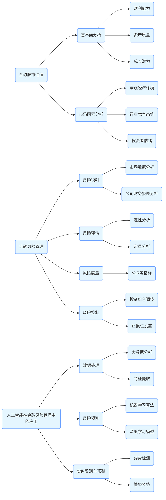

# 全球股市估值与人工智能在金融风险管理中的应用

> 关键词：全球股市估值、人工智能、金融风险管理、量化分析、机器学习算法

> 摘要：本文深入探讨了全球股市估值的原理和方法，以及人工智能在金融风险管理中的具体应用。首先介绍了股市估值的重要性和常见方法，接着阐述了人工智能技术如机器学习、深度学习等在金融数据处理、风险预测与评估方面的优势和作用。通过详细的算法原理、数学模型和实际案例分析，展示了如何利用人工智能提升金融风险管理的效率和准确性。最后对该领域的未来发展趋势进行了展望，并分析了可能面临的挑战。

## 1. 背景介绍 
### 1.1 目的和范围
本文章旨在全面剖析全球股市估值的理论与实践，同时深入探讨人工智能在金融风险管理中的具体应用。通过对全球股市估值方法的研究，帮助投资者和金融从业者更好地理解股票市场的价值，为投资决策提供依据。而聚焦于人工智能在金融风险管理中的应用，则是为了揭示如何利用先进的技术手段提升金融机构识别、评估和应对风险的能力，降低潜在的损失。文章的范围涵盖了全球主要股票市场的估值情况，以及多种人工智能技术在金融风险各个环节的应用。

### 1.2 预期读者
本文预期读者主要包括金融领域的从业者，如股票分析师、投资经理、风险管理专家等，他们可以从文章中获取关于股市估值和人工智能在金融风险管理应用的最新知识和方法，以优化自己的工作流程和决策。同时，对于对金融市场和人工智能技术感兴趣的学者和学生，本文也提供了一个系统的学习和研究参考，有助于他们深入了解这两个领域的交叉融合。

### 1.3 文档结构概述
本文将按照以下结构展开：首先介绍全球股市估值和人工智能在金融风险管理应用的相关背景知识，包括术语定义和概念解释。接着阐述核心概念与联系，通过文本示意图和Mermaid流程图展示股市估值与金融风险管理之间的关系以及人工智能在其中的作用。然后详细讲解核心算法原理和具体操作步骤，结合Python源代码进行说明。随后介绍相关的数学模型和公式，并举例说明其应用。在项目实战部分，将展示代码实际案例并进行详细解释。之后探讨实际应用场景，推荐相关的工具和资源。最后对未来发展趋势与挑战进行总结，并提供常见问题解答和扩展阅读参考资料。

### 1.4 术语表
#### 1.4.1 核心术语定义
- **全球股市估值**：指对全球范围内各个股票市场中上市公司股票价值的评估过程，通过多种方法和指标来确定股票的合理价格。
- **金融风险管理**：金融机构或投资者识别、评估、度量和控制金融风险的过程，旨在降低风险暴露，保障资产安全和稳定收益。
- **人工智能**：计算机科学的一个分支，旨在使机器能够模拟人类的智能行为，包括学习、推理、决策等能力。
- **机器学习**：人工智能的一个重要领域，通过算法让计算机从数据中自动学习模式和规律，无需明确的编程指令。
- **深度学习**：一种基于人工神经网络的机器学习方法，具有多层结构，能够自动从大量数据中提取复杂的特征和模式。

#### 1.4.2 相关概念解释
- **股票估值方法**：常见的有市盈率法（P/E）、市净率法（P/B）、现金流折现法（DCF）等。市盈率法是通过公司的每股收益与市场价格的比率来评估股票价值；市净率法是用股票价格与每股净资产的比率来衡量；现金流折现法是将公司未来的现金流折现到当前来确定股票的内在价值。
- **金融风险类型**：包括市场风险、信用风险、流动性风险等。市场风险是由于市场因素如股票价格波动、利率变化等导致的风险；信用风险是指交易对手违约的可能性；流动性风险是指资产无法及时以合理价格变现的风险。
- **人工智能算法应用**：在金融风险管理中，人工智能算法可用于风险预测、异常检测、投资组合优化等。例如，通过机器学习算法对历史金融数据进行分析，预测未来市场走势和风险水平。

#### 1.4.3 缩略词列表
- **P/E**：Price-to-Earnings Ratio，市盈率
- **P/B**：Price-to-Book Ratio，市净率
- **DCF**：Discounted Cash Flow，现金流折现法
- **AI**：Artificial Intelligence，人工智能
- **ML**：Machine Learning，机器学习
- **DL**：Deep Learning，深度学习

## 2. 核心概念与联系 

### 全球股市估值原理
全球股市估值是基于对上市公司基本面和市场因素的综合分析来确定股票的合理价值。从基本面来看，公司的盈利能力、资产质量、成长潜力等是重要的考量因素。例如，一家具有高盈利能力和稳定增长的公司，其股票往往具有较高的估值。市场因素则包括宏观经济环境、行业竞争态势、投资者情绪等。在经济繁荣时期，市场整体估值通常较高；而在行业竞争激烈的情况下，公司的估值可能会受到一定影响。

### 金融风险管理架构
金融风险管理是一个系统的过程，包括风险识别、风险评估、风险度量和风险控制等环节。风险识别是发现潜在风险的过程，通过对市场数据、公司财务报表等进行分析，找出可能影响金融资产价值的因素。风险评估是对识别出的风险进行定性和定量的分析，确定风险的大小和可能性。风险度量则是使用具体的指标和模型来衡量风险的程度，如VaR（Value at Risk）等。风险控制是根据风险评估和度量的结果，采取相应的措施来降低风险，如调整投资组合、设置止损点等。

### 人工智能在金融风险管理中的作用
人工智能技术在金融风险管理中具有重要作用。首先，它可以处理大量复杂的金融数据，包括股票价格、交易量、宏观经济指标等。通过机器学习和深度学习算法，能够从这些数据中挖掘出潜在的模式和规律，帮助金融从业者更好地理解市场动态和风险特征。其次，人工智能可以提高风险预测的准确性。传统的风险预测方法往往依赖于简单的统计模型和经验判断，而人工智能算法能够考虑更多的因素和复杂的关系，从而更准确地预测未来的风险水平。此外，人工智能还可以实现实时监测和预警，及时发现异常情况并采取措施，降低风险损失。

### 文本示意图
```plaintext
全球股市估值
|-- 基本面分析
|   |-- 盈利能力
|   |-- 资产质量
|   |-- 成长潜力
|-- 市场因素分析
|   |-- 宏观经济环境
|   |-- 行业竞争态势
|   |-- 投资者情绪

金融风险管理
|-- 风险识别
|   |-- 市场数据分析
|   |-- 公司财务报表分析
|-- 风险评估
|   |-- 定性分析
|   |-- 定量分析
|-- 风险度量
|   |-- VaR等指标
|-- 风险控制
|   |-- 投资组合调整
|   |-- 止损点设置

人工智能在金融风险管理中的应用
|-- 数据处理
|   |-- 大数据分析
|   |-- 特征提取
|-- 风险预测
|   |-- 机器学习算法
|   |-- 深度学习模型
|-- 实时监测与预警
|   |-- 异常检测
|   |-- 警报系统
```

### Mermaid流程图


## 3. 核心算法原理 & 具体操作步骤 

### 机器学习算法在风险预测中的应用 - 以线性回归为例
线性回归是一种简单而常用的机器学习算法，用于建立自变量和因变量之间的线性关系。在金融风险管理中，可以使用线性回归来预测股票价格或风险指标。

#### 算法原理
线性回归的基本模型可以表示为：
$$y = \theta_0 + \theta_1x_1 + \theta_2x_2 + \cdots + \theta_nx_n + \epsilon$$
其中，$y$ 是因变量，$x_1, x_2, \cdots, x_n$ 是自变量，$\theta_0, \theta_1, \cdots, \theta_n$ 是模型的参数，$\epsilon$ 是误差项。目标是通过最小化误差项的平方和来估计参数 $\theta$。

#### Python源代码实现
```python
import numpy as np
from sklearn.linear_model import LinearRegression

# 生成示例数据
X = np.array([[1], [2], [3], [4], [5]])
y = np.array([2, 4, 6, 8, 10])

# 创建线性回归模型
model = LinearRegression()

# 拟合模型
model.fit(X, y)

# 预测新数据
new_X = np.array([[6]])
prediction = model.predict(new_X)

print("预测结果:", prediction)
```

#### 具体操作步骤
1. **数据准备**：收集相关的金融数据，如股票价格、宏观经济指标等，并进行清洗和预处理。
2. **特征选择**：选择与因变量相关的自变量作为特征。
3. **模型训练**：使用训练数据对线性回归模型进行拟合，估计模型参数。
4. **模型评估**：使用测试数据评估模型的性能，如计算均方误差（MSE）、决定系数（$R^2$）等。
5. **预测应用**：使用训练好的模型对新的数据进行预测。

### 深度学习算法在异常检测中的应用 - 以自编码器为例
自编码器是一种无监督学习的深度学习模型，用于学习数据的低维表示。在金融风险管理中，可以使用自编码器来检测异常交易行为或市场异常波动。

#### 算法原理
自编码器由编码器和解码器两部分组成。编码器将输入数据压缩成低维表示，解码器将低维表示重构为原始数据。通过比较原始数据和重构数据的差异，可以判断数据是否异常。

#### Python源代码实现
```python
import numpy as np
import tensorflow as tf
from tensorflow.keras.layers import Input, Dense
from tensorflow.keras.models import Model

# 生成示例数据
X = np.random.randn(100, 10)

# 定义自编码器模型
input_layer = Input(shape=(10,))
encoded = Dense(5, activation='relu')(input_layer)
decoded = Dense(10, activation='linear')(encoded)

autoencoder = Model(input_layer, decoded)

# 编译模型
autoencoder.compile(optimizer='adam', loss='mse')

# 训练模型
autoencoder.fit(X, X, epochs=10, batch_size=32)

# 计算重构误差
reconstructions = autoencoder.predict(X)
mse = np.mean(np.power(X - reconstructions, 2), axis=1)

# 设置阈值进行异常检测
threshold = np.mean(mse) + np.std(mse)
anomalies = mse > threshold

print("异常数据索引:", np.where(anomalies)[0])
```

#### 具体操作步骤
1. **数据准备**：收集金融交易数据或市场数据，并进行标准化处理。
2. **模型构建**：定义自编码器的结构，包括编码器和解码器的层数和神经元数量。
3. **模型训练**：使用正常数据对自编码器进行训练，学习数据的正常模式。
4. **异常检测**：计算新数据的重构误差，根据预设的阈值判断数据是否异常。
5. **结果分析**：对检测出的异常数据进行进一步分析，确定异常的原因和影响。

## 4. 数学模型和公式 & 详细讲解 & 举例说明 

### 市盈率（P/E）模型
#### 公式
$$P/E = \frac{股价}{每股收益}$$

#### 详细讲解
市盈率是衡量股票估值的常用指标之一，它反映了投资者为获取公司每一元盈利所愿意支付的价格。一般来说，市盈率越高，说明市场对公司的未来盈利预期越高，但也可能意味着股票被高估。不同行业的市盈率水平可能存在较大差异，因此在使用市盈率进行估值时，需要与同行业的其他公司进行比较。

#### 举例说明
假设某公司的股价为50元，每股收益为2元，则该公司的市盈率为：
$$P/E = \frac{50}{2} = 25$$
这意味着投资者为获取该公司每一元盈利愿意支付25元。如果同行业的平均市盈率为20，那么该公司的股票可能被高估。

### 现金流折现法（DCF）模型
#### 公式
$$V = \sum_{t=1}^{n} \frac{FCF_t}{(1 + r)^t} + \frac{TV}{(1 + r)^n}$$
其中，$V$ 是公司的内在价值，$FCF_t$ 是第 $t$ 期的自由现金流，$r$ 是折现率，$TV$ 是终值，$n$ 是预测期数。

#### 详细讲解
现金流折现法是一种基于公司未来现金流的估值方法，它认为公司的价值等于其未来所有现金流的现值之和。自由现金流是指公司在满足了运营和投资需求后剩余的现金流量，折现率反映了投资者对投资风险的要求。终值是指预测期结束后公司的价值，通常采用永续增长模型进行估算。

#### 举例说明
假设某公司预计未来三年的自由现金流分别为100万元、120万元和150万元，折现率为10%，预测期结束后公司的终值为2000万元。则该公司的内在价值为：
$$V = \frac{100}{(1 + 0.1)^1} + \frac{120}{(1 + 0.1)^2} + \frac{150}{(1 + 0.1)^3} + \frac{2000}{(1 + 0.1)^3}$$
$$V \approx 90.91 + 99.17 + 112.70 + 1502.63 = 1705.41$$（万元）

### 风险价值（VaR）模型
#### 公式
在正态分布假设下，$VaR = \mu - z_{\alpha}\sigma$
其中，$\mu$ 是投资组合的预期收益率，$\sigma$ 是投资组合收益率的标准差，$z_{\alpha}$ 是对应置信水平 $\alpha$ 的标准正态分布分位数。

#### 详细讲解
风险价值是一种常用的风险度量指标，它表示在一定的置信水平和时间范围内，投资组合可能遭受的最大损失。例如，在95%的置信水平下，VaR值为100万元意味着在未来一段时间内，投资组合有95%的可能性损失不超过100万元。

#### 举例说明
假设某投资组合的预期收益率为5%，收益率的标准差为10%，置信水平为95%，对应的标准正态分布分位数 $z_{0.95} = 1.645$。则该投资组合的VaR值为：
$$VaR = 0.05 - 1.645 \times 0.1 = -0.1145$$
这意味着在95%的置信水平下，该投资组合可能遭受的最大损失为11.45%。

## 5. 项目实战：代码实际案例和详细解释说明 

### 5.1  开发环境搭建
#### 操作系统
建议使用Linux或Windows操作系统，确保系统具备稳定的网络连接和足够的磁盘空间。

#### Python环境
安装Python 3.7及以上版本，可以使用Anaconda进行Python环境的管理。Anaconda包含了许多常用的科学计算库，如NumPy、Pandas、Scikit-learn等。

#### 开发工具
推荐使用Jupyter Notebook或PyCharm作为开发工具。Jupyter Notebook适合进行交互式的代码编写和数据分析，而PyCharm则提供了强大的代码编辑和调试功能。

#### 安装必要的库
在命令行中使用以下命令安装所需的库：
```bash
pip install numpy pandas scikit-learn tensorflow keras yfinance
```
其中，`yfinance` 库用于获取股票市场数据。

### 5.2  源代码详细实现和代码解读
#### 数据获取与预处理
```python
import yfinance as yf
import pandas as pd
import numpy as np

# 获取股票数据
ticker = 'AAPL'
start_date = '2020-01-01'
end_date = '2023-01-01'
data = yf.download(ticker, start=start_date, end=end_date)

# 计算收益率
data['Return'] = data['Close'].pct_change()
data = data.dropna()

# 数据标准化
from sklearn.preprocessing import StandardScaler
scaler = StandardScaler()
scaled_data = scaler.fit_transform(data[['Return']])
```
代码解读：
- 使用 `yfinance` 库获取苹果公司（AAPL）从2020年1月1日到2023年1月1日的股票数据。
- 计算每日收益率，并去除缺失值。
- 使用 `StandardScaler` 对收益率数据进行标准化处理，使数据具有零均值和单位方差。

#### 风险预测模型 - 线性回归
```python
from sklearn.model_selection import train_test_split
from sklearn.linear_model import LinearRegression

# 准备特征和标签
X = scaled_data[:-1]
y = scaled_data[1:]

# 划分训练集和测试集
X_train, X_test, y_train, y_test = train_test_split(X, y, test_size=0.2, random_state=42)

# 创建线性回归模型
model = LinearRegression()

# 训练模型
model.fit(X_train, y_train)

# 预测
y_pred = model.predict(X_test)

# 评估模型
from sklearn.metrics import mean_squared_error
mse = mean_squared_error(y_test, y_pred)
print("均方误差:", mse)
```
代码解读：
- 将标准化后的数据划分为特征 `X` 和标签 `y`，其中 `X` 是前一天的收益率，`y` 是当天的收益率。
- 使用 `train_test_split` 函数将数据划分为训练集和测试集，测试集占比为20%。
- 创建线性回归模型并进行训练。
- 使用测试集进行预测，并计算均方误差来评估模型的性能。

#### 异常检测模型 - 自编码器
```python
import tensorflow as tf
from tensorflow.keras.layers import Input, Dense
from tensorflow.keras.models import Model

# 定义自编码器模型
input_layer = Input(shape=(1,))
encoded = Dense(1, activation='relu')(input_layer)
decoded = Dense(1, activation='linear')(encoded)

autoencoder = Model(input_layer, decoded)

# 编译模型
autoencoder.compile(optimizer='adam', loss='mse')

# 训练模型
autoencoder.fit(scaled_data, scaled_data, epochs=10, batch_size=32)

# 计算重构误差
reconstructions = autoencoder.predict(scaled_data)
mse = np.mean(np.power(scaled_data - reconstructions, 2), axis=1)

# 设置阈值进行异常检测
threshold = np.mean(mse) + np.std(mse)
anomalies = mse > threshold

print("异常数据索引:", np.where(anomalies)[0])
```
代码解读：
- 定义一个简单的自编码器模型，输入层和输出层的维度为1，中间层为1个神经元。
- 编译模型并使用标准化后的数据进行训练。
- 计算数据的重构误差，并根据阈值判断数据是否异常。

### 5.3  代码解读与分析
#### 数据获取与预处理
通过 `yfinance` 库可以方便地获取股票市场数据，计算收益率可以反映股票价格的变化情况。数据标准化可以使不同特征具有相同的尺度，有助于提高模型的训练效果。

#### 风险预测模型 - 线性回归
线性回归模型假设自变量和因变量之间存在线性关系，通过最小化误差平方和来估计模型参数。在本案例中，使用前一天的收益率来预测当天的收益率，均方误差可以衡量模型的预测准确性。

#### 异常检测模型 - 自编码器
自编码器通过学习数据的正常模式，将输入数据重构为原始数据。重构误差较大的数据可能被认为是异常数据。通过设置合适的阈值，可以有效地检测出异常交易行为或市场异常波动。

## 6. 实际应用场景 
### 投资决策
投资者可以利用全球股市估值方法来评估不同股票的价值，选择被低估的股票进行投资。同时，人工智能技术可以帮助投资者进行风险预测和评估，优化投资组合，降低投资风险。例如，通过机器学习算法分析历史数据，预测股票价格的走势和波动情况，从而做出更明智的投资决策。

### 金融机构风险管理
银行、证券、保险等金融机构需要对各种金融风险进行管理。人工智能在金融风险管理中的应用可以帮助金融机构更准确地识别和评估风险，及时采取措施进行风险控制。例如，使用深度学习模型对客户的信用风险进行评估，预防信用违约事件的发生；通过实时监测和预警系统，及时发现市场异常波动，调整投资策略。

### 监管机构监督
监管机构需要对金融市场进行监督，维护市场的稳定和公平。人工智能技术可以帮助监管机构提高监管效率和准确性。例如，通过大数据分析和机器学习算法，监测金融机构的交易行为，发现潜在的违规行为和风险隐患；对金融市场的系统性风险进行评估和预警，采取相应的监管措施。

## 7. 工具和资源推荐
### 7.1 学习资源推荐
#### 7.1.1 书籍推荐
- 《金融市场与金融机构》：全面介绍了金融市场和金融机构的基本概念、运作机制和风险管理方法。
- 《机器学习》：由周志华教授编写，是机器学习领域的经典教材，涵盖了各种机器学习算法的原理和应用。
- 《深度学习》：由Ian Goodfellow、Yoshua Bengio和Aaron Courville编写，是深度学习领域的权威著作，深入介绍了深度学习的理论和实践。

#### 7.1.2 在线课程
- Coursera上的“机器学习”课程：由Andrew Ng教授授课，是学习机器学习的经典课程，内容丰富，讲解详细。
- edX上的“深度学习”课程：由麻省理工学院（MIT）的教授授课，系统介绍了深度学习的核心概念和算法。
- Udemy上的“金融数据分析与机器学习”课程：结合金融领域的实际案例，讲解如何使用机器学习算法进行金融数据分析和风险管理。

#### 7.1.3 技术博客和网站
- Towards Data Science：是一个专注于数据科学和机器学习的技术博客，上面有许多优秀的文章和教程。
- Kaggle：是一个数据科学竞赛平台，上面有大量的金融数据集和相关的分析代码，可以学习其他数据科学家的经验和方法。
- QuantNet：是一个量化金融社区，提供了丰富的金融量化分析资源和交流平台。

### 7.2 开发工具框架推荐
#### 7.2.1 IDE和编辑器
- Jupyter Notebook：适合进行交互式的代码编写和数据分析，支持多种编程语言，方便进行模型调试和可视化展示。
- PyCharm：是一款专业的Python集成开发环境，提供了强大的代码编辑、调试和项目管理功能。
- Visual Studio Code：是一款轻量级的代码编辑器，支持多种编程语言和插件扩展，具有良好的用户体验。

#### 7.2.2 调试和性能分析工具
- TensorBoard：是TensorFlow提供的可视化工具，可以用于可视化模型的训练过程、性能指标和网络结构。
- PyTorch Profiler：是PyTorch提供的性能分析工具，可以帮助开发者找出代码中的性能瓶颈，优化代码性能。
- Scikit-learn的GridSearchCV：可以用于模型的超参数调优，通过网格搜索的方式找到最优的超参数组合。

#### 7.2.3 相关框架和库
- TensorFlow：是一个开源的深度学习框架，提供了丰富的工具和接口，支持多种深度学习模型的开发和训练。
- PyTorch：是另一个流行的深度学习框架，具有动态图机制，易于使用和调试，在学术界和工业界都有广泛的应用。
- Scikit-learn：是一个简单而强大的机器学习库，提供了各种机器学习算法和工具，适用于数据预处理、模型选择和评估等任务。

### 7.3 相关论文著作推荐
#### 7.3.1 经典论文
- Fama, E. F., & French, K. R. (1992). The cross-section of expected stock returns. Journal of Finance, 47(2), 427-465. 该论文提出了著名的Fama-French三因子模型，用于解释股票收益率的差异。
- Markowitz, H. M. (1952). Portfolio selection. The Journal of Finance, 7(1), 77-91. 该论文是现代投资组合理论的奠基之作，提出了均值-方差模型，用于优化投资组合。

#### 7.3.2 最新研究成果
- Vaswani, A., Shazeer, N., Parmar, N., Uszkoreit, J., Jones, L., Gomez, A. N.,... & Polosukhin, I. (2017). Attention is all you need. Advances in neural information processing systems, 5998-6008. 该论文提出了Transformer模型，在自然语言处理和金融时间序列分析等领域取得了显著的成果。
- Gu, S., Kelly, B., & Xiu, D. (2020). Empirical asset pricing via machine learning. Review of Financial Studies, 33(5), 2223-2273. 该论文探讨了机器学习在实证资产定价中的应用，提出了一些新的方法和模型。

#### 7.3.3 应用案例分析
- Lopez de Prado, M. (2018). Advances in financial machine learning. John Wiley & Sons. 该书通过大量的实际案例，介绍了机器学习在金融领域的应用，包括风险管理、投资组合优化、交易策略设计等方面。

## 8. 总结：未来发展趋势与挑战
### 未来发展趋势
#### 融合多源数据
未来，人工智能在金融风险管理中的应用将更加注重融合多源数据，包括股票市场数据、宏观经济数据、社交媒体数据等。通过综合分析这些数据，可以更全面地了解市场动态和风险特征，提高风险预测的准确性。

#### 强化学习的应用
强化学习是一种通过智能体与环境进行交互来学习最优策略的机器学习方法。在金融风险管理中，强化学习可以用于优化投资组合、制定交易策略等。未来，强化学习有望在金融领域得到更广泛的应用。

#### 可解释人工智能
随着人工智能在金融领域的应用越来越广泛，可解释性成为一个重要的问题。金融从业者和监管机构需要了解人工智能模型的决策过程和依据，以便更好地评估风险和进行监管。因此，可解释人工智能将成为未来的一个研究热点。

### 挑战
#### 数据质量和隐私问题
金融数据通常具有高维度、噪声大、隐私性强等特点，数据质量和隐私问题是人工智能在金融风险管理中应用的一大挑战。如何保证数据的准确性和完整性，同时保护数据的隐私和安全，是需要解决的关键问题。

#### 模型复杂度和可解释性
一些先进的人工智能模型，如深度学习模型，通常具有较高的复杂度，难以理解和解释。在金融风险管理中，模型的可解释性非常重要，因为决策者需要了解模型的决策依据。如何在提高模型性能的同时，保证模型的可解释性，是一个亟待解决的问题。

#### 技术人才短缺
人工智能在金融风险管理中的应用需要既懂金融又懂技术的复合型人才。目前，这类人才相对短缺，限制了人工智能技术在金融领域的推广和应用。如何培养和吸引更多的复合型人才，是金融行业面临的一个挑战。

## 9. 附录：常见问题与解答
### 问题1：如何选择合适的股市估值方法？
解答：选择合适的股市估值方法需要考虑多个因素，如公司的行业特点、发展阶段、财务状况等。对于盈利稳定的成熟公司，可以使用市盈率法进行估值；对于资产密集型的公司，市净率法可能更合适；对于具有较高成长潜力的公司，现金流折现法可以更好地反映其未来价值。同时，还可以结合多种估值方法进行综合评估。

### 问题2：人工智能模型在金融风险管理中的准确性如何保证？
解答：为了保证人工智能模型在金融风险管理中的准确性，可以采取以下措施：一是使用高质量的数据进行训练，包括数据清洗、预处理和特征工程等；二是选择合适的模型结构和算法，根据问题的特点和数据的分布进行模型选择和调优；三是进行模型评估和验证，使用交叉验证、测试集等方法评估模型的性能，并进行模型的持续监控和更新。

### 问题3：人工智能在金融风险管理中的应用是否会取代人类决策？
解答：人工智能在金融风险管理中的应用可以提供更准确的风险预测和评估，但不会完全取代人类决策。人类具有丰富的经验、判断力和创造力，能够考虑到更多的因素和情境。人工智能可以作为人类决策的辅助工具，帮助人类更好地理解风险和做出决策。

## 10. 扩展阅读 & 参考资料
### 扩展阅读
- 《智能金融：科技重塑金融未来》：介绍了人工智能、区块链等新兴技术在金融领域的应用和发展趋势。
- 《大数据金融》：探讨了大数据在金融领域的应用，包括风险评估、信贷决策、市场预测等方面。

### 参考资料
- Yahoo Finance：提供全球股市的实时行情和历史数据。
- World Bank：提供宏观经济数据和金融统计信息。
- arXiv：是一个预印本平台，上面有许多关于人工智能和金融领域的最新研究论文。

作者：AI天才研究院/AI Genius Institute & 禅与计算机程序设计艺术 /Zen And The Art of Computer Programming