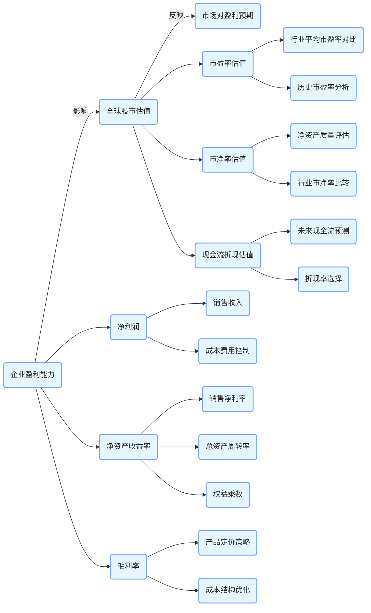

# 全球股市估值与企业盈利能力的关联

> 关键词：全球股市估值、企业盈利能力、关联分析、财务指标、市场表现

> 摘要：本文旨在深入探讨全球股市估值与企业盈利能力之间的关联。通过对相关核心概念的阐述、算法原理的分析、数学模型的构建，结合实际案例和应用场景进行研究。首先介绍了研究的背景、目的、预期读者和文档结构，接着详细讲解了核心概念、算法原理、数学模型等内容，然后通过项目实战展示了代码实现和分析过程。还探讨了该关联在实际中的应用场景，推荐了学习资源、开发工具和相关论文。最后总结了未来发展趋势与挑战，并对常见问题进行了解答，为投资者和研究者提供了全面而深入的参考。

## 1. 背景介绍 
### 1.1 目的和范围
本研究的主要目的是揭示全球股市估值与企业盈利能力之间的内在联系。通过对全球不同地区、不同行业的股市数据以及企业财务数据的分析，明确两者之间的定量关系和影响机制。研究范围涵盖了全球主要证券市场，包括纽约证券交易所、伦敦证券交易所、东京证券交易所等，涉及金融、科技、制造业等多个重要行业。旨在为投资者提供决策依据，帮助他们更好地评估股票价值，同时也为企业管理者提供参考，使其了解自身盈利能力对股市估值的影响，从而制定合理的经营策略。

### 1.2 预期读者
本文预期读者主要包括专业投资者、金融分析师、企业管理者、学术研究人员以及对金融市场和企业财务感兴趣的爱好者。专业投资者可以借助本文的研究成果优化投资组合，提高投资回报率；金融分析师能够通过更深入的分析为客户提供准确的投资建议；企业管理者可以根据研究结果调整经营战略，提升企业的市场价值；学术研究人员可以在此基础上开展进一步的理论和实证研究；而普通爱好者则可以通过本文了解股市估值和企业盈利能力的基本原理和关联。

### 1.3 文档结构概述
本文共分为十个部分。第一部分为背景介绍，阐述了研究的目的、范围、预期读者和文档结构；第二部分介绍核心概念与联系，包括股市估值和企业盈利能力的定义、原理以及它们之间的关系，并通过文本示意图和 Mermaid 流程图进行直观展示；第三部分讲解核心算法原理和具体操作步骤，使用 Python 代码详细阐述如何进行相关数据的处理和分析；第四部分构建数学模型和公式，详细讲解其含义并举例说明；第五部分通过项目实战，介绍开发环境搭建、源代码实现和代码解读；第六部分探讨实际应用场景；第七部分推荐学习资源、开发工具和相关论文；第八部分总结未来发展趋势与挑战；第九部分为附录，解答常见问题；第十部分提供扩展阅读和参考资料。

### 1.4 术语表
#### 1.4.1 核心术语定义
- **股市估值**：是指对股票市场中上市公司股票价值的评估。它反映了市场参与者对公司未来现金流和风险的预期，常用的估值指标包括市盈率（P/E）、市净率（P/B）、市销率（P/S）等。
- **企业盈利能力**：指企业在一定时期内赚取利润的能力。它是企业经营业绩的重要体现，主要通过一些财务指标来衡量，如净利润、净资产收益率（ROE）、毛利率等。
- **市盈率（P/E）**：是股票价格与每股收益的比率，反映了投资者为获取每一元净利润所愿意支付的价格。计算公式为：$P/E = \frac{股票价格}{每股收益}$。
- **净资产收益率（ROE）**：是净利润与平均净资产的比率，衡量了企业运用自有资本的效率。计算公式为：$ROE = \frac{净利润}{平均净资产} \times 100\%$。

#### 1.4.2 相关概念解释
- **现金流折现模型（DCF）**：是一种基于未来现金流的估值方法，它将企业未来预期的现金流按照一定的折现率折现到当前，从而得到企业的内在价值。该模型的核心思想是，资产的价值等于其未来产生的现金流的现值之和。
- **杜邦分析体系**：是一种用于分析企业盈利能力和股东权益回报水平的方法，它通过将净资产收益率分解为多个因素的乘积，揭示了影响企业盈利能力的各个方面，包括销售净利率、总资产周转率和权益乘数等。

#### 1.4.3 缩略词列表
- **P/E**：市盈率（Price-to-Earnings Ratio）
- **P/B**：市净率（Price-to-Book Ratio）
- **P/S**：市销率（Price-to-Sales Ratio）
- **ROE**：净资产收益率（Return on Equity）
- **DCF**：现金流折现模型（Discounted Cash Flow）

## 2. 核心概念与联系 
### 核心概念原理
#### 股市估值原理
股市估值是投资者对上市公司未来价值的预期体现。其基本原理是基于对公司未来现金流的预测和对风险的评估。不同的估值方法从不同角度来衡量股票的价值。例如，市盈率法是通过比较同行业或市场平均水平的市盈率，来判断股票价格是否合理。如果一家公司的市盈率低于行业平均水平，可能意味着该股票被低估，具有投资价值；反之，则可能被高估。

市净率法主要关注公司的净资产，反映了市场对公司净资产的定价。市净率较低的公司，可能表示其股价相对于净资产较为便宜，但也可能暗示公司存在一些潜在问题，如盈利能力不佳或资产质量较差。

现金流折现模型则是一种更为复杂和理论化的估值方法，它考虑了公司未来所有现金流的时间价值和风险因素。通过预测公司未来的自由现金流，并选择合适的折现率将其折现到当前，得到公司的内在价值。

#### 企业盈利能力原理
企业盈利能力是企业经营管理水平的综合体现。其核心在于企业能否有效地利用各种资源，创造出超过成本的收益。净利润是衡量企业盈利能力的最直接指标，它反映了企业在扣除所有成本和费用后所剩余的利润。

净资产收益率则从股东权益的角度衡量企业的盈利能力，它反映了企业运用自有资本获取收益的效率。较高的净资产收益率表明企业能够有效地利用股东投入的资金，为股东创造更多的价值。

毛利率则体现了企业产品或服务的盈利能力，它是销售收入减去销售成本后的余额与销售收入的比率。毛利率较高的企业，通常具有更强的市场竞争力和成本控制能力。

### 核心概念架构的文本示意图
```plaintext
全球股市估值
├── 市盈率估值
│   ├── 行业平均市盈率对比
│   ├── 历史市盈率分析
├── 市净率估值
│   ├── 净资产质量评估
│   ├── 行业市净率比较
├── 现金流折现估值
│   ├── 未来现金流预测
│   ├── 折现率选择

企业盈利能力
├── 净利润
│   ├── 销售收入
│   ├── 成本费用控制
├── 净资产收益率
│   ├── 销售净利率
│   ├── 总资产周转率
│   ├── 权益乘数
├── 毛利率
│   ├── 产品定价策略
│   ├── 成本结构优化

关联关系
├── 盈利能力影响估值
│   ├── 高盈利提升估值
│   ├── 低盈利降低估值
├── 估值反映市场对盈利预期
│   ├── 高估值蕴含高盈利预期
│   ├── 低估值暗示低盈利预期
```

### Mermaid 流程图


## 3. 核心算法原理 & 具体操作步骤 
### 核心算法原理
在分析全球股市估值与企业盈利能力的关联时，我们主要使用回归分析算法。回归分析是一种用于研究变量之间定量关系的统计方法。我们将企业盈利能力指标（如净利润、净资产收益率等）作为自变量，股市估值指标（如市盈率、市净率等）作为因变量，建立回归模型，以探究两者之间的线性或非线性关系。

### Python 代码实现步骤
```python
import pandas as pd
import numpy as np
import statsmodels.api as sm
from sklearn.model_selection import train_test_split

# 步骤 1: 数据加载
# 假设我们有一个包含股市估值和企业盈利能力数据的 CSV 文件
data = pd.read_csv('stock_data.csv')

# 步骤 2: 数据预处理
# 选择自变量（企业盈利能力指标）和因变量（股市估值指标）
X = data[['net_profit', 'roe']]  # 自变量：净利润和净资产收益率
y = data['pe_ratio']  # 因变量：市盈率

# 处理缺失值
X = X.fillna(X.mean())
y = y.fillna(y.mean())

# 步骤 3: 划分训练集和测试集
X_train, X_test, y_train, y_test = train_test_split(X, y, test_size=0.2, random_state=42)

# 步骤 4: 模型训练
# 添加常数项
X_train = sm.add_constant(X_train)

# 建立线性回归模型
model = sm.OLS(y_train, X_train)
results = model.fit()

# 步骤 5: 模型评估
# 在测试集上进行预测
X_test = sm.add_constant(X_test)
y_pred = results.predict(X_test)

# 计算均方误差
mse = np.mean((y_pred - y_test) ** 2)
print(f"均方误差: {mse}")

# 步骤 6: 查看回归结果
print(results.summary())
```
### 代码解释
1. **数据加载**：使用 `pandas` 库的 `read_csv` 函数从 CSV 文件中读取数据。
2. **数据预处理**：选择需要的自变量和因变量，并处理数据中的缺失值，这里使用均值填充法。
3. **划分训练集和测试集**：使用 `sklearn` 库的 `train_test_split` 函数将数据划分为训练集和测试集，测试集占比为 20%。
4. **模型训练**：使用 `statsmodels` 库的 `OLS` 函数建立线性回归模型，并使用训练集数据进行拟合。
5. **模型评估**：在测试集上进行预测，并计算均方误差，以评估模型的预测性能。
6. **查看回归结果**：使用 `results.summary()` 函数查看回归模型的详细结果，包括回归系数、显著性水平等。

## 4. 数学模型和公式 & 详细讲解 & 举例说明 
### 线性回归模型
线性回归模型是一种常用的用于描述自变量和因变量之间线性关系的数学模型。在我们的研究中，假设股市估值指标 $y$ 与企业盈利能力指标 $x_1, x_2, \cdots, x_n$ 之间存在线性关系，可以表示为：
$$y = \beta_0 + \beta_1x_1 + \beta_2x_2 + \cdots + \beta_nx_n + \epsilon$$
其中，$y$ 是因变量（股市估值指标，如市盈率），$x_1, x_2, \cdots, x_n$ 是自变量（企业盈利能力指标，如净利润、净资产收益率等），$\beta_0$ 是截距项，$\beta_1, \beta_2, \cdots, \beta_n$ 是回归系数，$\epsilon$ 是误差项，服从均值为 0 的正态分布。

### 回归系数的估计
回归系数 $\beta_0, \beta_1, \beta_2, \cdots, \beta_n$ 的估计通常使用最小二乘法。最小二乘法的目标是使实际观测值 $y_i$ 与模型预测值 $\hat{y}_i$ 之间的误差平方和最小，即：
$$\min_{\beta_0, \beta_1, \cdots, \beta_n} \sum_{i=1}^{m} (y_i - \hat{y}_i)^2 = \min_{\beta_0, \beta_1, \cdots, \beta_n} \sum_{i=1}^{m} (y_i - (\beta_0 + \beta_1x_{i1} + \beta_2x_{i2} + \cdots + \beta_nx_{in}))^2$$
通过求解上述最小化问题，可以得到回归系数的估计值 $\hat{\beta}_0, \hat{\beta}_1, \hat{\beta}_2, \cdots, \hat{\beta}_n$。

### 举例说明
假设我们有以下数据：

| 净利润（万元） | 净资产收益率（%） | 市盈率 |
| --- | --- | --- |
| 100 | 10 | 20 |
| 200 | 15 | 25 |
| 300 | 20 | 30 |
| 400 | 25 | 35 |
| 500 | 30 | 40 |

我们使用 Python 代码进行线性回归分析：
```python
import numpy as np
import statsmodels.api as sm

# 自变量
X = np.array([[100, 10], [200, 15], [300, 20], [400, 25], [500, 30]])
# 因变量
y = np.array([20, 25, 30, 35, 40])

# 添加常数项
X = sm.add_constant(X)

# 建立线性回归模型
model = sm.OLS(y, X)
results = model.fit()

# 查看回归结果
print(results.summary())
```
运行上述代码后，我们可以得到回归系数的估计值以及模型的统计信息。回归系数表示自变量对因变量的影响程度。例如，如果净利润的回归系数为正，说明净利润的增加会导致市盈率的上升，反映了企业盈利能力对股市估值的正向影响。

## 5. 项目实战：代码实际案例和详细解释说明 
### 5.1  开发环境搭建
#### 操作系统
本项目可以在 Windows、Linux 或 macOS 操作系统上进行开发。建议使用较新的操作系统版本，以确保兼容性和性能。

#### Python 环境
安装 Python 3.7 及以上版本。可以从 Python 官方网站（https://www.python.org/downloads/） 下载并安装适合你操作系统的 Python 版本。

#### 依赖库安装
使用 `pip` 命令安装项目所需的依赖库：
```sh
pip install pandas numpy statsmodels scikit-learn
```

### 5.2  源代码详细实现和代码解读
```python
import pandas as pd
import numpy as np
import statsmodels.api as sm
from sklearn.model_selection import train_test_split

# 步骤 1: 数据加载
def load_data(file_path):
    data = pd.read_csv(file_path)
    return data

# 步骤 2: 数据预处理
def preprocess_data(data):
    # 选择自变量和因变量
    X = data[['net_profit', 'roe']]
    y = data['pe_ratio']
    
    # 处理缺失值
    X = X.fillna(X.mean())
    y = y.fillna(y.mean())
    
    return X, y

# 步骤 3: 划分训练集和测试集
def split_data(X, y):
    X_train, X_test, y_train, y_test = train_test_split(X, y, test_size=0.2, random_state=42)
    return X_train, X_test, y_train, y_test

# 步骤 4: 模型训练
def train_model(X_train, y_train):
    # 添加常数项
    X_train = sm.add_constant(X_train)
    
    # 建立线性回归模型
    model = sm.OLS(y_train, X_train)
    results = model.fit()
    
    return results

# 步骤 5: 模型评估
def evaluate_model(results, X_test, y_test):
    # 在测试集上进行预测
    X_test = sm.add_constant(X_test)
    y_pred = results.predict(X_test)
    
    # 计算均方误差
    mse = np.mean((y_pred - y_test) ** 2)
    print(f"均方误差: {mse}")
    
    return mse

# 主函数
def main():
    file_path = 'stock_data.csv'
    data = load_data(file_path)
    X, y = preprocess_data(data)
    X_train, X_test, y_train, y_test = split_data(X, y)
    results = train_model(X_train, y_train)
    mse = evaluate_model(results, X_test, y_test)
    
    # 查看回归结果
    print(results.summary())

if __name__ == "__main__":
    main()
```
### 代码解读与分析
1. **数据加载函数 `load_data`**：使用 `pandas` 的 `read_csv` 函数从 CSV 文件中读取数据。
2. **数据预处理函数 `preprocess_data`**：选择自变量（净利润和净资产收益率）和因变量（市盈率），并处理数据中的缺失值，使用均值填充法。
3. **数据划分函数 `split_data`**：使用 `sklearn` 的 `train_test_split` 函数将数据划分为训练集和测试集，测试集占比为 20%。
4. **模型训练函数 `train_model`**：使用 `statsmodels` 的 `OLS` 函数建立线性回归模型，并使用训练集数据进行拟合。
5. **模型评估函数 `evaluate_model`**：在测试集上进行预测，并计算均方误差，以评估模型的预测性能。
6. **主函数 `main`**：调用上述函数完成数据加载、预处理、划分、训练和评估的整个流程，并输出回归结果。

通过对代码的分析，我们可以看到，该项目通过线性回归模型探究了企业盈利能力指标（净利润和净资产收益率）与股市估值指标（市盈率）之间的关系。模型的均方误差可以反映模型的预测准确性，回归结果中的回归系数可以帮助我们了解自变量对因变量的影响程度。

## 6. 实际应用场景 
### 投资者决策
对于投资者来说，了解全球股市估值与企业盈利能力的关联可以帮助他们做出更明智的投资决策。当投资者发现一家企业的盈利能力较强，但股市估值相对较低时，可能意味着该股票被低估，具有投资价值。投资者可以通过分析企业的财务报表，计算盈利能力指标，并结合市场上的估值指标进行比较，筛选出潜在的投资标的。

例如，投资者在研究科技行业时，发现某家科技公司的净资产收益率持续高于行业平均水平，但市盈率却低于行业均值。这可能表明该公司的股票价格没有充分反映其盈利能力，投资者可以考虑买入该股票。

### 企业战略规划
企业管理者可以利用这种关联来制定战略规划。如果企业的盈利能力较强，但股市估值不高，管理者可以分析原因，可能是市场对企业的未来发展预期不足。此时，企业可以加强市场推广，提高品牌知名度，向市场传递积极的信息，以提升股市估值。

反之，如果企业的股市估值过高，但盈利能力没有相应提升，管理者需要警惕市场泡沫的风险。企业可以加大研发投入，提高产品质量和市场竞争力，以确保盈利能力能够支撑股市估值。

### 金融监管
金融监管机构可以通过监测全球股市估值与企业盈利能力的关联，及时发现市场异常情况。如果发现大量企业的股市估值与盈利能力严重背离，可能意味着市场存在泡沫或操纵行为。监管机构可以采取相应的措施，如加强信息披露要求、加强对违规行为的打击力度等，以维护市场的稳定和健康发展。

### 宏观经济分析
宏观经济分析师可以利用这种关联来评估整个经济的健康状况。当股市估值普遍较高，但企业盈利能力没有同步提升时，可能预示着经济存在过热风险。相反，如果股市估值较低，但企业盈利能力较强，可能意味着市场信心不足，需要政府采取相应的宏观经济政策来刺激市场。

## 7. 工具和资源推荐
### 7.1 学习资源推荐
#### 7.1.1 书籍推荐
- 《证券分析》（Security Analysis）：由本杰明·格雷厄姆（Benjamin Graham）和戴维·多德（David Dodd）所著，被誉为投资界的圣经。该书详细介绍了股票估值的基本方法和原则，以及如何分析企业的财务报表和盈利能力。
- 《聪明的投资者》（The Intelligent Investor）：同样是本杰明·格雷厄姆的经典著作，强调了价值投资的理念，帮助投资者建立正确的投资思维和方法。
- 《财务报表分析与证券定价》（Financial Statement Analysis and Security Valuation）：作者是斯蒂芬·佩因曼（Stephen Penman），该书深入探讨了如何通过分析企业的财务报表来评估股票价值，以及财务报表信息与股市估值之间的关系。

#### 7.1.2 在线课程
- Coursera 上的“投资学原理”（Principles of Investing）课程：由宾夕法尼亚大学的教授授课，介绍了投资的基本概念、股票估值方法和投资组合管理等内容。
- edX 上的“财务报表分析”（Financial Statement Analysis）课程：帮助学习者掌握财务报表分析的基本方法和技巧，以及如何运用财务数据评估企业的盈利能力和风险。

#### 7.1.3 技术博客和网站
- Seeking Alpha（https://seekingalpha.com/）：一个专注于金融市场分析和投资建议的网站，提供了大量关于股票估值、企业盈利能力分析的文章和研究报告。
- Investopedia（https://www.investopedia.com/）：是一个权威的金融知识学习网站，包含了丰富的金融术语解释、投资策略分析和市场动态报道。

### 7.2 开发工具框架推荐
#### 7.2.1 IDE和编辑器
- PyCharm：是一款专门为 Python 开发设计的集成开发环境（IDE），具有强大的代码编辑、调试和项目管理功能，适合专业开发者使用。
- Jupyter Notebook：是一个交互式的开发环境，支持 Python 代码的编写、运行和可视化展示，非常适合数据探索和分析。

#### 7.2.2 调试和性能分析工具
- PDB：是 Python 自带的调试工具，可以帮助开发者逐行调试代码，查找程序中的错误。
- cProfile：是 Python 的性能分析工具，可以分析代码的运行时间和函数调用次数，帮助开发者优化代码性能。

#### 7.2.3 相关框架和库
- Pandas：是一个强大的数据处理和分析库，提供了丰富的数据结构和数据操作方法，适合处理和分析金融数据。
- NumPy：是 Python 的数值计算库，提供了高效的数组操作和数学函数，是许多数据分析和机器学习库的基础。
- Statsmodels：是一个用于统计建模和数据分析的 Python 库，提供了多种统计模型和分析方法，如线性回归、逻辑回归等。

### 7.3 相关论文著作推荐
#### 7.3.1 经典论文
- Fama, E. F., & French, K. R. (1992). The cross-section of expected stock returns. The Journal of Finance, 47(2), 427-465. 该论文提出了著名的 Fama-French 三因子模型，用于解释股票回报率的差异，对股票估值和投资组合理论产生了深远影响。
- Sharpe, W. F. (1964). Capital asset prices: A theory of market equilibrium under conditions of risk. The Journal of Finance, 19(3), 425-442. 这篇论文提出了资本资产定价模型（CAPM），为资产定价和风险评估提供了重要的理论基础。

#### 7.3.2 最新研究成果
- 可以通过学术数据库如 Google Scholar、Web of Science 等搜索关于全球股市估值与企业盈利能力关联的最新研究论文。这些论文通常会采用新的研究方法和数据，探讨该领域的前沿问题。

#### 7.3.3 应用案例分析
- 一些金融研究机构和咨询公司会发布关于股市估值和企业盈利能力分析的应用案例报告。这些报告结合实际案例，详细介绍了如何运用相关理论和方法进行投资决策和企业战略规划，可以为读者提供实际操作的参考。

## 8. 总结：未来发展趋势与挑战
### 未来发展趋势
#### 数据驱动的分析方法不断发展
随着大数据技术和人工智能的不断进步，未来在分析全球股市估值与企业盈利能力的关联时，将更多地依赖于海量的金融数据和先进的数据分析技术。例如，机器学习算法可以挖掘数据中的潜在模式和规律，提高预测的准确性和可靠性。

#### 跨市场和跨行业的综合分析
全球金融市场的一体化程度越来越高，不同市场和行业之间的联系日益紧密。未来的研究将更加注重跨市场和跨行业的综合分析，考虑全球经济环境、政策变化等因素对股市估值和企业盈利能力的影响。

#### 可持续发展因素的纳入
随着社会对可持续发展的关注度不断提高，未来的股市估值和企业盈利能力分析将越来越多地考虑环境、社会和治理（ESG）因素。企业的可持续发展能力将成为影响股市估值的重要因素之一。

### 挑战
#### 数据质量和可靠性
金融数据的质量和可靠性是进行准确分析的基础。然而，数据来源的多样性和数据的不完整性可能会影响分析结果的准确性。此外，数据的时效性也是一个挑战，因为金融市场变化迅速，及时获取准确的数据对于分析至关重要。

#### 市场不确定性和复杂性
全球金融市场充满了不确定性和复杂性，受到宏观经济政策、地缘政治、自然灾害等多种因素的影响。这些因素的变化可能导致股市估值和企业盈利能力的波动，增加了分析和预测的难度。

#### 模型的局限性
目前使用的分析模型和方法都存在一定的局限性。例如，线性回归模型假设自变量和因变量之间存在线性关系，但实际情况可能更为复杂。因此，需要不断改进和完善分析模型，以适应不断变化的市场环境。

## 9. 附录：常见问题与解答
### 问题 1：如何选择合适的股市估值指标？
解答：选择合适的股市估值指标需要考虑多个因素。市盈率适用于盈利稳定的企业，能够反映市场对企业未来盈利的预期；市净率适用于资产价值较为重要的企业，如金融行业；现金流折现模型则更适合对未来现金流有较为明确预测的企业。在实际应用中，可以结合多个估值指标进行综合分析。

### 问题 2：企业盈利能力指标之间有什么关系？
解答：净利润是企业盈利能力的最直接体现，净资产收益率反映了企业运用自有资本的效率，毛利率体现了企业产品或服务的盈利能力。一般来说，较高的毛利率可以为净利润和净资产收益率的提升提供基础，但还需要考虑企业的成本控制、资产运营效率等因素。

### 问题 3：回归分析模型的结果如何解释？
解答：回归分析模型的结果主要包括回归系数和显著性水平。回归系数表示自变量对因变量的影响程度，正的回归系数表示自变量的增加会导致因变量的增加，负的回归系数则相反。显著性水平用于判断回归系数是否显著不为 0，如果显著性水平小于设定的阈值（通常为 0.05），则说明该自变量对因变量有显著影响。

### 问题 4：如何提高模型的预测准确性？
解答：可以从以下几个方面提高模型的预测准确性：一是增加数据量，更多的数据可以提供更丰富的信息，减少模型的偏差；二是选择合适的自变量，去除无关或冗余的变量，提高模型的解释能力；三是尝试不同的模型和算法，如非线性回归模型、机器学习算法等，以更好地拟合数据。

## 10. 扩展阅读 & 参考资料
### 扩展阅读
- 《金融炼金术》（The Alchemy of Finance）：乔治·索罗斯（George Soros）的著作，探讨了金融市场的反身性原理，对理解股市估值和市场波动有一定的启示。
- 《漫步华尔街》（A Random Walk Down Wall Street）：作者是伯顿·马尔基尔（Burton Malkiel），该书介绍了有效市场假说和随机漫步理论，帮助读者了解股票市场的运行机制。

### 参考资料
- 相关金融数据库，如 Bloomberg、Wind 等，提供了丰富的金融数据和研究报告。
- 各国证券交易所的官方网站，如纽约证券交易所（https://www.nyse.com/）、伦敦证券交易所（https://www.londonstockexchange.com/）等，提供了上市公司的财务报表和市场数据。

作者：AI天才研究院/AI Genius Institute & 禅与计算机程序设计艺术 /Zen And The Art of Computer Programming