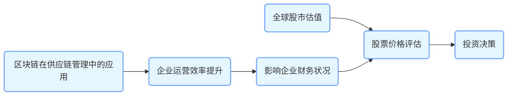

# 全球股市估值与区块链在供应链管理中的应用

> 关键词：全球股市估值、区块链、供应链管理、金融市场、分布式账本、投资决策

> 摘要：本文聚焦于全球股市估值与区块链在供应链管理中的应用这两个重要领域。首先深入探讨全球股市估值的多种方法、影响因素以及其在投资决策中的关键作用；接着详细阐述区块链技术的原理、特点，以及其如何在供应链管理中发挥优化作用，包括提高透明度、增强信任、降低成本等方面。通过结合理论分析、算法原理、数学模型和实际案例，为读者全面呈现这两个领域的核心内容和相互联系，并探讨其未来发展趋势与面临的挑战，旨在为相关领域的研究者、从业者和投资者提供有价值的参考。

## 1. 背景介绍 
### 1.1 目的和范围
本文章的目的在于深入剖析全球股市估值的方法、影响因素以及实际应用，同时探讨区块链技术在供应链管理中的原理、优势和具体应用场景。通过对这两个领域的研究，揭示它们之间可能存在的联系和相互影响，为投资者、企业管理者和相关研究人员提供全面的知识和决策依据。文章的范围涵盖全球股市估值的主要理论和实践方法，区块链技术的基本概念和核心算法，以及区块链在供应链管理中的典型应用案例和实施步骤。

### 1.2 预期读者
本文预期读者包括金融领域的投资者、分析师、基金经理，供应链管理行业的企业管理者、物流专家，以及对金融市场和区块链技术感兴趣的研究人员和学生。这些读者可能希望了解全球股市估值的方法和技巧，以便做出更明智的投资决策；也可能关注区块链技术在供应链管理中的应用，以寻求优化供应链流程、提高运营效率的解决方案。

### 1.3 文档结构概述
本文将按照以下结构进行组织：首先介绍全球股市估值和区块链在供应链管理中的背景知识，包括目的、预期读者和文档结构概述；接着阐述全球股市估值和区块链技术的核心概念和相互联系，通过文本示意图和 Mermaid 流程图进行直观展示；然后详细讲解全球股市估值的核心算法原理和具体操作步骤，以及区块链技术在供应链管理中的应用原理和实施步骤，同时给出相应的 Python 源代码示例；之后介绍相关的数学模型和公式，并通过具体例子进行说明；再通过实际项目案例展示全球股市估值和区块链在供应链管理中的应用，包括开发环境搭建、源代码实现和代码解读；接着探讨这两个领域的实际应用场景；随后推荐相关的学习资源、开发工具框架和论文著作；最后总结全球股市估值和区块链在供应链管理中的未来发展趋势与挑战，并提供常见问题解答和扩展阅读参考资料。

### 1.4 术语表
#### 1.4.1 核心术语定义
- **全球股市估值**：是指对全球范围内各个股票市场上的上市公司股票价值进行评估的过程，旨在确定股票的合理价格，为投资决策提供参考。
- **区块链**：是一种分布式账本技术，通过去中心化、不可篡改、共识机制等特点，实现数据的安全存储和传输，确保交易的透明性和可信度。
- **供应链管理**：是指对供应链中的物流、信息流和资金流进行计划、组织、协调和控制的过程，以实现供应链的高效运作和价值最大化。
- **市盈率（P/E）**：是指股票价格与每股收益的比率，反映了投资者为获取公司每一元盈利所愿意支付的价格。
- **市净率（P/B）**：是指股票价格与每股净资产的比率，反映了股票价格相对于公司净资产的倍数。

#### 1.4.2 相关概念解释
- **分布式账本**：是一种去中心化的数据库，多个节点共同维护同一个账本，数据在各个节点之间同步更新，确保数据的一致性和不可篡改。
- **智能合约**：是一种基于区块链技术的自动化合约，通过代码实现合约条款的自动执行，无需第三方中介，提高交易效率和可信度。
- **供应链金融**：是指金融机构为供应链中的企业提供融资服务，基于供应链中的真实交易背景和核心企业的信用，为上下游企业提供资金支持。

#### 1.4.3 缩略词列表
- **P/E**：市盈率（Price-to-Earnings Ratio）
- **P/B**：市净率（Price-to-Book Ratio）
- **BTC**：比特币（Bitcoin）
- **ETH**：以太坊（Ethereum）
- **IoT**：物联网（Internet of Things）

## 2. 核心概念与联系 

### 全球股市估值核心概念
全球股市估值是金融领域的重要课题，它是对股票内在价值的评估过程。其核心目标是帮助投资者判断股票价格是否合理，从而做出明智的投资决策。常见的估值方法包括绝对估值法和相对估值法。绝对估值法是通过对公司未来现金流的折现来计算股票的内在价值，例如现金流折现模型（DCF）。相对估值法则是通过比较同行业或类似公司的估值指标来评估股票的价值，如市盈率（P/E）、市净率（P/B）等。

### 区块链在供应链管理中的核心概念
区块链是一种分布式账本技术，它由多个节点组成，每个节点都保存着完整的账本数据。区块链的核心特点包括去中心化、不可篡改、共识机制和智能合约。在供应链管理中，区块链可以实现供应链信息的透明化和可追溯性。通过将供应链中的各个环节信息记录在区块链上，如原材料采购、生产加工、物流运输、销售等，所有参与者都可以实时查看和验证这些信息，从而提高供应链的效率和可信度。

### 两者的联系
全球股市估值和区块链在供应链管理中的应用看似属于不同领域，但实际上存在着一定的联系。一方面，区块链技术在供应链管理中的应用可以提升企业的运营效率和竞争力，从而影响企业的财务状况和未来发展前景，进而对其股票估值产生影响。例如，采用区块链技术的企业可能会降低成本、提高供应链的透明度和可靠性，这些因素都可能反映在企业的盈利和市场价值上。另一方面，投资者在进行全球股市估值时，也会关注企业是否采用了先进的技术，如区块链技术，以评估企业的创新能力和未来发展潜力。

### 文本示意图
```plaintext
全球股市估值 <-- 企业财务状况、市场环境、行业竞争等因素 --> 股票价格评估 --> 投资决策
                                                         |
                                                         v
区块链在供应链管理中的应用 <-- 提高透明度、增强信任、降低成本等优势 --> 企业运营效率提升 --> 影响企业财务状况
```

### Mermaid 流程图


## 3. 核心算法原理 & 具体操作步骤 

### 全球股市估值核心算法原理及 Python 实现

#### 市盈率（P/E）估值法
市盈率估值法是一种相对估值法，它通过比较同行业或类似公司的市盈率来评估股票的价值。计算公式为：

$$P = EPS \times P/E$$

其中，$P$ 表示股票价格，$EPS$ 表示每股收益，$P/E$ 表示市盈率。

以下是使用 Python 实现市盈率估值法的示例代码：
```python
def pe_valuation(eps, pe_ratio):
    """
    使用市盈率估值法计算股票价格
    :param eps: 每股收益
    :param pe_ratio: 市盈率
    :return: 股票价格
    """
    price = eps * pe_ratio
    return price

# 示例数据
eps = 2.5  # 每股收益
pe_ratio = 15  # 市盈率

# 计算股票价格
stock_price = pe_valuation(eps, pe_ratio)
print(f"使用市盈率估值法计算的股票价格为: {stock_price}")
```

#### 现金流折现模型（DCF）
现金流折现模型是一种绝对估值法，它通过预测公司未来的现金流，并将其折现到当前时刻来计算股票的内在价值。计算公式为：

$$V = \sum_{t=1}^{n} \frac{CF_t}{(1 + r)^t} + \frac{TV}{(1 + r)^n}$$

其中，$V$ 表示股票的内在价值，$CF_t$ 表示第 $t$ 期的现金流，$r$ 表示折现率，$TV$ 表示终值，$n$ 表示预测期数。

以下是使用 Python 实现现金流折现模型的示例代码：
```python
def dcf_valuation(cash_flows, discount_rate, terminal_value):
    """
    使用现金流折现模型计算股票的内在价值
    :param cash_flows: 未来各期的现金流列表
    :param discount_rate: 折现率
    :param terminal_value: 终值
    :return: 股票的内在价值
    """
    n = len(cash_flows)
    present_value = 0
    for t in range(n):
        present_value += cash_flows[t] / ((1 + discount_rate) ** (t + 1))
    present_value += terminal_value / ((1 + discount_rate) ** n)
    return present_value

# 示例数据
cash_flows = [100, 120, 150, 180, 200]  # 未来 5 期的现金流
discount_rate = 0.1  # 折现率
terminal_value = 1000  # 终值

# 计算股票的内在价值
intrinsic_value = dcf_valuation(cash_flows, discount_rate, terminal_value)
print(f"使用现金流折现模型计算的股票内在价值为: {intrinsic_value}")
```

### 区块链在供应链管理中的核心算法原理及 Python 实现

#### 哈希算法
哈希算法是区块链的核心算法之一，它可以将任意长度的数据转换为固定长度的哈希值。哈希算法具有不可逆性和唯一性，即相同的输入会产生相同的输出，不同的输入会产生不同的输出。常见的哈希算法包括 SHA-256、MD5 等。

以下是使用 Python 实现 SHA-256 哈希算法的示例代码：
```python
import hashlib

def sha256_hash(data):
    """
    使用 SHA-256 哈希算法计算数据的哈希值
    :param data: 输入数据
    :return: 哈希值
    """
    data_bytes = data.encode('utf-8')
    hash_object = hashlib.sha256(data_bytes)
    hash_hex = hash_object.hexdigest()
    return hash_hex

# 示例数据
data = "Hello, Blockchain!"

# 计算哈希值
hash_value = sha256_hash(data)
print(f"数据的 SHA-256 哈希值为: {hash_value}")
```

#### 共识机制 - 工作量证明（PoW）
工作量证明是一种常见的区块链共识机制，它要求节点通过计算复杂的哈希难题来证明自己的工作量。只有第一个找到正确哈希值的节点才能将新的区块添加到区块链上，并获得相应的奖励。

以下是一个简化的工作量证明示例代码：
```python
import hashlib
import time

def proof_of_work(block, difficulty=4):
    """
    实现工作量证明机制
    :param block: 区块数据
    :param difficulty: 难度系数
    :return: 找到的有效哈希值和随机数
    """
    nonce = 0
    while True:
        data = str(block) + str(nonce)
        hash_hex = sha256_hash(data)
        if hash_hex[:difficulty] == '0' * difficulty:
            return hash_hex, nonce
        nonce += 1

# 示例区块数据
block = {
    "index": 1,
    "timestamp": time.time(),
    "data": "Transaction data",
    "previous_hash": "0" * 64
}

# 执行工作量证明
valid_hash, nonce = proof_of_work(block)
print(f"找到的有效哈希值为: {valid_hash}")
print(f"随机数为: {nonce}")
```

## 4. 数学模型和公式 & 详细讲解 & 举例说明 

### 全球股市估值的数学模型和公式

#### 市盈率（P/E）估值法
如前文所述，市盈率估值法的公式为：

$$P = EPS \times P/E$$

其中，$P$ 表示股票价格，$EPS$ 表示每股收益，$P/E$ 表示市盈率。

详细讲解：市盈率是衡量股票估值的常用指标之一，它反映了投资者为获取公司每一元盈利所愿意支付的价格。一般来说，市盈率越高，说明投资者对公司的未来发展前景越看好，但也可能意味着股票价格被高估；反之，市盈率越低，说明股票可能被低估。

举例说明：假设某公司的每股收益为 $3$ 元，同行业类似公司的平均市盈率为 $20$ 倍。则根据市盈率估值法，该公司股票的合理价格为：

$$P = 3 \times 20 = 60$$（元）

#### 市净率（P/B）估值法
市净率估值法的公式为：

$$P = BVPS \times P/B$$

其中，$P$ 表示股票价格，$BVPS$ 表示每股净资产，$P/B$ 表示市净率。

详细讲解：市净率反映了股票价格相对于公司净资产的倍数。市净率较低的股票可能被低估，具有一定的投资价值；而市净率较高的股票可能存在泡沫。

举例说明：假设某公司的每股净资产为 $10$ 元，同行业类似公司的平均市净率为 $2$ 倍。则根据市净率估值法，该公司股票的合理价格为：

$$P = 10 \times 2 = 20$$（元）

#### 现金流折现模型（DCF）
现金流折现模型的公式为：

$$V = \sum_{t=1}^{n} \frac{CF_t}{(1 + r)^t} + \frac{TV}{(1 + r)^n}$$

其中，$V$ 表示股票的内在价值，$CF_t$ 表示第 $t$ 期的现金流，$r$ 表示折现率，$TV$ 表示终值，$n$ 表示预测期数。

详细讲解：现金流折现模型的核心思想是将公司未来的现金流折现到当前时刻，以反映其真实的价值。预测期数 $n$ 通常根据公司的发展阶段和行业特点来确定；折现率 $r$ 反映了资金的时间价值和投资风险，一般可以使用加权平均资本成本（WACC）来表示；终值 $TV$ 是指预测期结束后公司的价值，可以使用永续增长模型或其他方法来计算。

举例说明：假设某公司未来 $5$ 年的现金流分别为 $100$ 万元、$120$ 万元、$150$ 万元、$180$ 万元和 $200$ 万元，折现率为 $10\%$，预测期结束后的终值为 $1000$ 万元。则根据现金流折现模型，该公司股票的内在价值为：

$$
\begin{align*}
V &= \frac{100}{(1 + 0.1)^1} + \frac{120}{(1 + 0.1)^2} + \frac{150}{(1 + 0.1)^3} + \frac{180}{(1 + 0.1)^4} + \frac{200}{(1 + 0.1)^5} + \frac{1000}{(1 + 0.1)^5}\\
&= \frac{100}{1.1} + \frac{120}{1.21} + \frac{150}{1.331} + \frac{180}{1.4641} + \frac{200}{1.61051} + \frac{1000}{1.61051}\\
&\approx 90.91 + 99.17 + 112.69 + 122.94 + 124.18 + 620.92\\
&\approx 1170.81
\end{align*}
$$

### 区块链在供应链管理中的数学模型和公式

#### 哈希算法
哈希算法的数学原理基于密码学中的哈希函数。哈希函数 $H$ 满足以下性质：

1. **确定性**：对于相同的输入 $x$，哈希函数 $H(x)$ 总是产生相同的输出。
2. **高效性**：计算哈希值的过程应该是高效的，即在合理的时间内完成。
3. **抗碰撞性**：很难找到两个不同的输入 $x_1$ 和 $x_2$，使得 $H(x_1) = H(x_2)$。

常见的哈希函数如 SHA-256 满足这些性质，它将任意长度的输入数据转换为 256 位的哈希值。

#### 工作量证明（PoW）
工作量证明的难度系数 $d$ 决定了找到有效哈希值的难度。在比特币中，难度系数是动态调整的，以保证平均每 10 分钟产生一个新的区块。难度系数 $d$ 与目标哈希值 $T$ 之间的关系可以表示为：

$$T = \frac{2^{256}}{d}$$

其中，$2^{256}$ 是 SHA-256 哈希值的最大值。节点需要找到一个随机数 $n$，使得区块数据和随机数的哈希值小于目标哈希值 $T$，即：

$$H(block + n) < T$$

举例说明：假设难度系数 $d = 1000$，则目标哈希值为：

$$T = \frac{2^{256}}{1000} \approx 1.1579209 \times 10^{77}$$

节点需要不断尝试不同的随机数 $n$，直到找到一个满足 $H(block + n) < T$ 的随机数为止。

## 5. 项目实战：代码实际案例和详细解释说明 

### 5.1  开发环境搭建

#### 全球股市估值项目
对于全球股市估值项目，我们可以使用 Python 进行开发。以下是搭建开发环境的步骤：

1. **安装 Python**：从 Python 官方网站（https://www.python.org/downloads/）下载并安装 Python 3.x 版本。
2. **安装必要的库**：使用 `pip` 命令安装以下库：
    - `pandas`：用于数据处理和分析。
    - `numpy`：用于数值计算。
    - `matplotlib`：用于数据可视化。

```bash
pip install pandas numpy matplotlib
```

#### 区块链在供应链管理中的应用项目
对于区块链在供应链管理中的应用项目，我们可以使用 Python 和以太坊平台进行开发。以下是搭建开发环境的步骤：

1. **安装 Python**：同全球股市估值项目。
2. **安装必要的库**：使用 `pip` 命令安装以下库：
    - `web3.py`：用于与以太坊区块链进行交互。
    - `py-solc-x`：用于编译 Solidity 智能合约。

```bash
pip install web3 py-solc-x
```

3. **安装以太坊客户端**：可以选择安装 Ganache，它是一个本地以太坊开发环境，用于测试和开发智能合约。从 Ganache 官方网站（https://trufflesuite.com/ganache/）下载并安装 Ganache。

### 5.2  源代码详细实现和代码解读

#### 全球股市估值项目
以下是一个简单的全球股市估值项目示例，使用市盈率估值法对股票进行估值：

```python
import pandas as pd

# 读取股票数据
def read_stock_data(file_path):
    data = pd.read_csv(file_path)
    return data

# 计算每股收益
def calculate_eps(data):
    net_income = data['Net Income']
    shares_outstanding = data['Shares Outstanding']
    eps = net_income / shares_outstanding
    return eps

# 市盈率估值法
def pe_valuation(eps, pe_ratio):
    price = eps * pe_ratio
    return price

# 主函数
def main():
    file_path = 'stock_data.csv'
    data = read_stock_data(file_path)
    eps = calculate_eps(data)
    pe_ratio = 15  # 假设市盈率为 15
    stock_prices = pe_valuation(eps, pe_ratio)
    print("股票估值结果：")
    print(stock_prices)

if __name__ == "__main__":
    main()
```

代码解读：
1. `read_stock_data` 函数：用于读取包含股票财务数据的 CSV 文件，并返回一个 `pandas` 数据框。
2. `calculate_eps` 函数：根据公司的净利润和流通股数量计算每股收益。
3. `pe_valuation` 函数：使用市盈率估值法计算股票价格。
4. `main` 函数：主函数，调用上述函数完成股票估值，并输出结果。

#### 区块链在供应链管理中的应用项目
以下是一个简单的区块链在供应链管理中的应用项目示例，实现一个简单的供应链智能合约：

```python
from web3 import Web3
from solcx import compile_standard
import json

# 连接到 Ganache 本地以太坊节点
w3 = Web3(Web3.HTTPProvider('http://127.0.0.1:7545'))
chain_id = 1337
my_address = "0xYourAddress"
private_key = "0xYourPrivateKey"

# 定义 Solidity 智能合约代码
contract_source_code = """
pragma solidity ^0.8.0;

contract SupplyChain {
    struct Product {
        string name;
        string origin;
        uint256 timestamp;
    }

    mapping(uint256 => Product) public products;
    uint256 public productCount;

    function addProduct(string memory _name, string memory _origin) public {
        productCount++;
        products[productCount] = Product(_name, _origin, block.timestamp);
    }

    function getProduct(uint256 _id) public view returns (string memory, string memory, uint256) {
        Product memory product = products[_id];
        return (product.name, product.origin, product.timestamp);
    }
}
"""

# 编译智能合约
compiled_sol = compile_standard(
    {
        "language": "Solidity",
        "sources": {
            "SupplyChain.sol": {
                "content": contract_source_code
            }
        },
        "settings": {
            "outputSelection": {
                "*": {
                    "*": ["abi", "metadata", "evm.bytecode", "evm.sourceMap"]
                }
            }
        }
    },
    solc_version="0.8.0"
)

# 获取合约的 ABI 和字节码
abi = json.loads(compiled_sol['contracts']['SupplyChain.sol']['SupplyChain']['metadata'])['output']['abi']
bytecode = compiled_sol['contracts']['SupplyChain.sol']['SupplyChain']['evm']['bytecode']['object']

# 创建合约对象
SupplyChain = w3.eth.contract(abi=abi, bytecode=bytecode)

# 部署合约
nonce = w3.eth.getTransactionCount(my_address)
transaction = SupplyChain.constructor().buildTransaction({
    'chainId': chain_id,
    'gas': 2000000,
    'gasPrice': w3.eth.gas_price,
    'nonce': nonce
})
signed_txn = w3.eth.account.sign_transaction(transaction, private_key=private_key)
tx_hash = w3.eth.send_raw_transaction(signed_txn.rawTransaction)
tx_receipt = w3.eth.wait_for_transaction_receipt(tx_hash)

# 获取合约地址
contract_address = tx_receipt.contractAddress
print(f"合约部署成功，合约地址为: {contract_address}")

# 与合约进行交互
supply_chain_contract = w3.eth.contract(address=contract_address, abi=abi)

# 添加产品
nonce = w3.eth.getTransactionCount(my_address)
tx = supply_chain_contract.functions.addProduct("Apple", "USA").buildTransaction({
    'chainId': chain_id,
    'gas': 2000000,
    'gasPrice': w3.eth.gas_price,
    'nonce': nonce
})
signed_txn = w3.eth.account.sign_transaction(tx, private_key=private_key)
tx_hash = w3.eth.send_raw_transaction(signed_txn.rawTransaction)
tx_receipt = w3.eth.wait_for_transaction_receipt(tx_hash)

# 获取产品信息
product_info = supply_chain_contract.functions.getProduct(1).call()
print("产品信息：")
print(f"名称: {product_info[0]}")
print(f"产地: {product_info[1]}")
print(f"时间戳: {product_info[2]}")
```

代码解读：
1. **连接到以太坊节点**：使用 `web3.py` 库连接到 Ganache 本地以太坊节点。
2. **定义智能合约代码**：使用 Solidity 语言定义一个简单的供应链智能合约，包含产品信息的存储和查询功能。
3. **编译智能合约**：使用 `py-solc-x` 库编译 Solidity 智能合约，获取合约的 ABI 和字节码。
4. **部署合约**：创建合约对象，构建部署交易，签名并发送交易，等待交易确认，获取合约地址。
5. **与合约进行交互**：创建合约实例，调用合约的 `addProduct` 函数添加产品信息，调用 `getProduct` 函数查询产品信息。

### 5.3  代码解读与分析

#### 全球股市估值项目
该项目的主要功能是使用市盈率估值法对股票进行估值。通过读取股票财务数据，计算每股收益，然后根据给定的市盈率计算股票价格。代码结构清晰，易于理解和扩展。可以进一步优化的地方包括：
- 支持更多的估值方法，如现金流折现模型、市净率估值法等。
- 从更可靠的数据源获取股票财务数据，如金融数据接口。
- 增加数据可视化功能，直观展示股票估值结果。

#### 区块链在供应链管理中的应用项目
该项目实现了一个简单的供应链智能合约，用于记录和查询产品信息。通过与以太坊区块链进行交互，实现了产品信息的安全存储和可追溯性。代码的主要步骤包括连接到以太坊节点、编译智能合约、部署合约和与合约进行交互。可以进一步优化的地方包括：
- 增加更多的供应链环节信息，如物流运输、质量检测等。
- 实现智能合约的权限管理，确保只有授权人员可以添加和修改产品信息。
- 与物联网设备集成，实时获取产品的状态信息。

## 6. 实际应用场景 

### 全球股市估值的实际应用场景

#### 投资决策
投资者在进行股票投资时，需要对股票的价值进行评估，以判断股票是否被低估或高估。全球股市估值方法可以帮助投资者确定股票的合理价格，从而做出明智的投资决策。例如，投资者可以通过比较不同股票的市盈率、市净率等估值指标，选择具有投资价值的股票。

#### 风险管理
金融机构和投资者在进行投资组合管理时，需要对投资组合的风险进行评估和控制。全球股市估值可以帮助投资者了解不同股票的估值水平，从而合理配置资产，降低投资组合的风险。例如，当市场整体估值较高时，投资者可以适当减少股票投资比例，增加债券等固定收益类资产的投资比例。

#### 企业并购
在企业并购过程中，需要对目标企业的价值进行评估，以确定合理的收购价格。全球股市估值方法可以为企业并购提供参考依据，帮助并购方和被并购方达成公平合理的交易价格。例如，并购方可以使用现金流折现模型对目标企业的未来现金流进行预测，从而确定目标企业的内在价值。

### 区块链在供应链管理中的实际应用场景

#### 供应链金融
区块链技术可以实现供应链中各参与方之间的信息共享和信任传递，为供应链金融提供更加可靠的基础。通过将供应链中的交易信息记录在区块链上，金融机构可以实时了解企业的经营状况和交易背景，从而为企业提供更加精准的融资服务。例如，核心企业可以将其对供应商的应付账款信息记录在区块链上，供应商可以将这些应收账款进行质押融资，金融机构可以根据区块链上的信息快速审批贷款。

#### 产品追溯
区块链技术的不可篡改和可追溯性特点使得它非常适合用于产品追溯。通过将产品的原材料采购、生产加工、物流运输、销售等环节信息记录在区块链上，消费者可以通过扫描产品上的二维码等方式查询产品的全生命周期信息，从而确保产品的质量和安全。例如，在食品供应链中，消费者可以通过区块链查询食品的产地、生产日期、加工工艺、运输过程等信息，放心购买食品。

#### 供应链协同
区块链技术可以实现供应链中各参与方之间的实时信息共享和协同工作，提高供应链的整体效率。通过将供应链中的生产计划、库存信息、物流信息等记录在区块链上，各参与方可以实时了解供应链的动态变化，及时调整生产和配送计划，减少库存积压和缺货现象。例如，制造商可以根据区块链上的销售信息及时调整生产计划，供应商可以根据制造商的需求及时供应原材料。

## 7. 工具和资源推荐

### 7.1 学习资源推荐

#### 7.1.1 书籍推荐
- 《证券分析》（Security Analysis）：本杰明·格雷厄姆（Benjamin Graham）和大卫·多德（David Dodd）著，被誉为投资领域的圣经，详细介绍了股票估值的基本方法和理论。
- 《区块链：技术驱动金融》（Blockchain: The Technology Driving the Next Internet Revolution）：阿尔文德·纳拉亚南（Arvind Narayanan）等著，全面介绍了区块链技术的原理、应用和发展趋势。
- 《供应链管理：战略、规划与运营》（Supply Chain Management: Strategy, Planning, and Operation）：苏尼尔·乔普拉（Sunil Chopra）和彼得·迈因德尔（Peter Meindl）著，系统阐述了供应链管理的基本概念、方法和实践。

#### 7.1.2 在线课程
- Coursera 上的“Financial Markets”：由耶鲁大学教授罗伯特·席勒（Robert Shiller）主讲，介绍了金融市场的基本原理和投资策略。
- edX 上的“Blockchain and Money”：由麻省理工学院教授加文·伍德（Gavin Wood）主讲，深入讲解了区块链技术和数字货币的相关知识。
- Udemy 上的“Supply Chain Management Fundamentals”：介绍了供应链管理的基础知识和实践技能。

#### 7.1.3 技术博客和网站
- 雪球（https://xueqiu.com/）：国内知名的金融投资社区，提供股票估值分析、市场行情、投资策略等内容。
- 巴比特（https://www.8btc.com/）：国内领先的区块链媒体，提供区块链技术、行业动态、项目分析等内容。
- 物流沙龙（https://www.logclub.com/）：专注于供应链物流领域的资讯平台，提供供应链管理的最新趋势和实践案例。

### 7.2 开发工具框架推荐

#### 7.2.1 IDE和编辑器
- PyCharm：一款专业的 Python 集成开发环境，提供代码编辑、调试、版本控制等功能，适合开发全球股市估值和区块链应用项目。
- Visual Studio Code：一款轻量级的代码编辑器，支持多种编程语言和插件扩展，可用于编写 Solidity 智能合约和 Python 代码。
- Remix：一个基于网页的 Solidity 智能合约开发环境，提供代码编辑、编译、部署和调试等功能，适合初学者快速上手。

#### 7.2.2 调试和性能分析工具
- Ganache：一个本地以太坊开发环境，用于测试和开发智能合约。它可以模拟以太坊区块链的运行环境，方便开发者进行调试和测试。
- Truffle：一个以太坊开发框架，提供项目初始化、合约编译、部署、测试等功能，简化了智能合约的开发流程。
- Web3.py 调试器：可以用于调试与以太坊区块链交互的 Python 代码，帮助开发者定位和解决问题。

#### 7.2.3 相关框架和库
- Pandas：Python 中用于数据处理和分析的库，提供了丰富的数据结构和函数，可用于处理股票财务数据和供应链数据。
- Numpy：Python 中用于数值计算的库，提供了高效的数组和矩阵运算功能，可用于实现股票估值算法和区块链算法。
- Web3.py：Python 中用于与以太坊区块链进行交互的库，提供了方便的 API 接口，可用于部署和调用智能合约。

### 7.3 相关论文著作推荐

#### 7.3.1 经典论文
- “The Theory of Investment Value”：约翰·伯尔·威廉姆斯（John Burr Williams）著，提出了现金流折现模型的基本思想，对股票估值理论的发展产生了深远影响。
- “Bitcoin: A Peer-to-Peer Electronic Cash System”：中本聪（Satoshi Nakamoto）著，介绍了比特币的概念和技术原理，开创了区块链技术的先河。
- “The Bullwhip Effect in Supply Chains”：Hau L. Lee 等著，研究了供应链中的牛鞭效应问题，提出了相应的解决方法。

#### 7.3.2 最新研究成果
- 在金融领域，关于人工智能和机器学习在股市估值中的应用研究逐渐增多，如使用深度学习模型预测股票价格和风险。
- 在区块链领域，关于区块链的可扩展性、隐私保护和跨链技术的研究成为热点，以推动区块链技术在更多领域的应用。
- 在供应链管理领域，关于区块链与物联网、大数据等技术的融合应用研究不断涌现，以提高供应链的智能化水平。

#### 7.3.3 应用案例分析
- IBM Food Trust：一个基于区块链技术的食品供应链追溯平台，通过将食品供应链中的各参与方连接起来，实现了食品的全生命周期追溯，提高了食品的质量和安全。
- Ripple：一个基于区块链技术的跨境支付平台，通过使用区块链技术实现了快速、低成本的跨境支付，解决了传统跨境支付中存在的效率低、成本高的问题。
- Maersk 和 IBM 合作的 TradeLens：一个基于区块链技术的全球贸易数字化平台，通过将航运、港口、海关等供应链环节的信息整合到区块链上，提高了全球贸易的效率和透明度。

## 8. 总结：未来发展趋势与挑战

### 全球股市估值的未来发展趋势与挑战

#### 未来发展趋势
- **智能化**：随着人工智能和机器学习技术的不断发展，股市估值将越来越智能化。通过使用深度学习模型等技术，可以更准确地预测股票价格和风险，为投资者提供更精准的投资建议。
- **全球化**：全球股市的联系日益紧密，投资者越来越关注全球范围内的投资机会。未来，股市估值将更加注重全球市场的分析和比较，考虑不同国家和地区的经济、政治和文化因素。
- **多元化**：除了传统的估值方法，如市盈率、市净率、现金流折现模型等，未来还将出现更多的多元化估值方法。例如，考虑企业的创新能力、社会责任等因素的估值方法将逐渐受到关注。

#### 挑战
- **数据质量和可靠性**：股市估值需要大量的财务数据和市场数据，数据的质量和可靠性直接影响估值结果的准确性。然而，数据的获取和处理过程中可能存在误差和虚假信息，这给股市估值带来了挑战。
- **市场不确定性**：股市市场受到多种因素的影响，如宏观经济环境、政策变化、行业竞争等，市场不确定性较大。准确预测这些因素的变化对股票价格的影响是股市估值面临的一大挑战。
- **模型的局限性**：现有的股市估值模型大多基于一定的假设和理论，存在一定的局限性。在实际应用中，这些模型可能无法完全反映市场的复杂情况，导致估值结果与实际情况存在偏差。

### 区块链在供应链管理中的未来发展趋势与挑战

#### 未来发展趋势
- **广泛应用**：随着区块链技术的不断成熟和完善，它将在供应链管理中得到更广泛的应用。除了供应链金融、产品追溯和供应链协同等领域，区块链还将应用于供应链的更多环节，如采购管理、生产计划、质量管理等。
- **与其他技术融合**：区块链将与物联网、大数据、人工智能等技术深度融合，实现供应链的智能化和数字化转型。例如，通过物联网设备实时获取产品的状态信息，并将其记录在区块链上，结合大数据分析和人工智能算法，实现供应链的智能决策和优化。
- **标准化和规范化**：为了促进区块链在供应链管理中的应用，未来将出台更多的行业标准和规范。这些标准和规范将统一区块链技术的应用接口和数据格式，提高区块链系统的互操作性和兼容性。

#### 挑战
- **技术性能**：区块链技术目前还存在性能瓶颈，如交易处理速度慢、存储成本高、可扩展性差等问题。这些问题限制了区块链在大规模供应链管理中的应用，需要进一步改进和优化。
- **法律法规**：区块链技术的应用涉及到法律法规的问题，如数据隐私保护、智能合约的法律效力等。目前，相关的法律法规还不够完善，需要政府和监管机构加强立法和监管，为区块链技术的应用提供良好的法律环境。
- **行业认知和接受度**：尽管区块链技术具有很多优势，但在供应链管理行业中，对区块链技术的认知和接受度还不够高。一些企业对区块链技术的安全性和可靠性存在疑虑，需要加强宣传和推广，提高行业对区块链技术的认知和接受度。

## 9. 附录：常见问题与解答

### 全球股市估值相关问题

#### 问：市盈率估值法有哪些局限性？
答：市盈率估值法的局限性主要包括：一是没有考虑公司的未来增长潜力，仅基于当前的盈利水平进行估值；二是不同行业的市盈率水平差异较大，不能简单地进行比较；三是市盈率受市场情绪和宏观经济环境的影响较大，可能会出现估值偏差。

#### 问：现金流折现模型中的折现率如何确定？
答：折现率通常可以使用加权平均资本成本（WACC）来表示。WACC 的计算公式为：

$$WACC = E/V \times Re + D/V \times Rd \times (1 - Tc)$$

其中，$E$ 表示股权价值，$V$ 表示企业总价值，$Re$ 表示股权成本，$D$ 表示债务价值，$Rd$ 表示债务成本，$Tc$ 表示企业所得税税率。股权成本可以使用资本资产定价模型（CAPM）来计算，债务成本可以根据企业的贷款利率来确定。

### 区块链在供应链管理中的应用相关问题

#### 问：区块链技术如何保证供应链信息的安全性？
答：区块链技术通过以下方式保证供应链信息的安全性：一是去中心化的架构，数据存储在多个节点上，不存在单点故障，降低了数据被篡改的风险；二是哈希算法和加密技术，对数据进行加密处理，确保数据的完整性和保密性；三是共识机制，只有经过多数节点验证的交易才能被添加到区块链上，保证了交易的真实性和合法性。

#### 问：区块链在供应链管理中的应用成本高吗？
答：区块链在供应链管理中的应用成本主要包括技术开发成本、硬件设备成本、维护成本等。目前，由于区块链技术还处于发展阶段，相关的技术和设备成本相对较高。但是，随着技术的不断成熟和应用规模的扩大，成本有望逐渐降低。同时，区块链技术可以提高供应链的效率和透明度，降低运营成本和风险，从长期来看，具有较高的投资回报率。

## 10. 扩展阅读 & 参考资料

### 扩展阅读
- 《金融炼金术》（The Alchemy of Finance）：乔治·索罗斯（George Soros）著，介绍了作者的投资哲学和市场分析方法。
- 《区块链革命：比特币底层技术如何改变货币、商业和世界》（The Blockchain Revolution: How the Technology Behind Bitcoin Is Changing Money, Business, and the World）：唐·塔普斯科特（Don Tapscott）和亚力克斯·塔普斯科特（Alex Tapscott）著，探讨了区块链技术对各个行业的影响和变革。
- 《供应链架构师：从战略到运营》（Supply Chain Architecture: From Strategy to Operations）：马克·A·戈德斯坦（Mark A. Goldstein）著，介绍了供应链架构设计的方法和实践。

### 参考资料
- Yahoo Finance（https://finance.yahoo.com/）：提供全球股市的行情数据和财务信息。
- CoinMarketCap（https://coinmarketcap.com/）：提供数字货币的市场行情和相关信息。
- Gartner（https://www.gartner.com/）：全球著名的信息技术研究和咨询公司，提供供应链管理和区块链技术的研究报告和分析。

作者：AI天才研究院/AI Genius Institute & 禅与计算机程序设计艺术 /Zen And The Art of Computer Programming