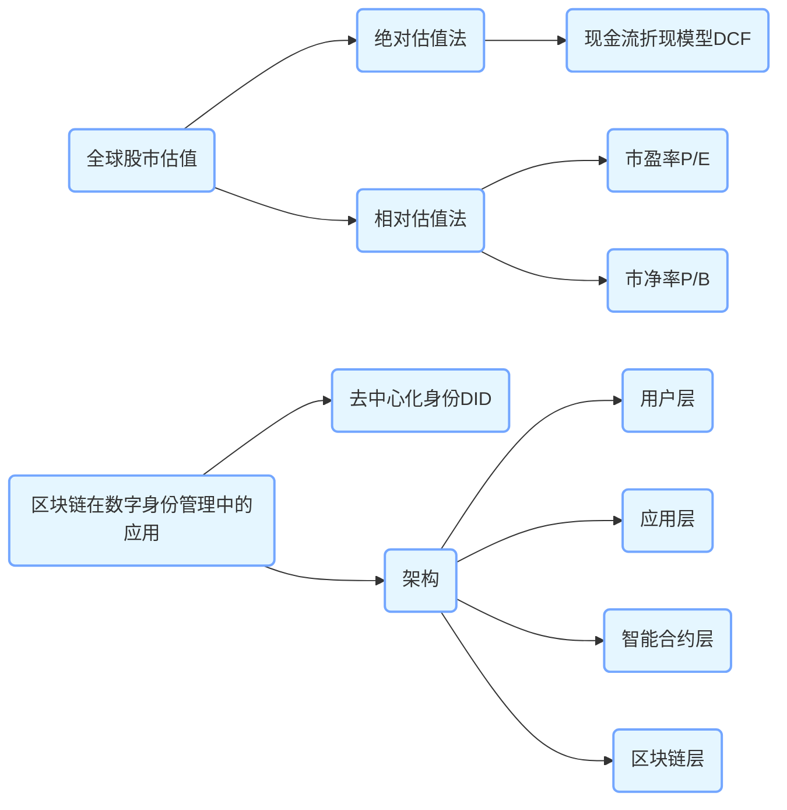

# 全球股市估值与区块链在数字身份管理中的应用

> 关键词：全球股市估值、区块链、数字身份管理、金融市场、数据安全

> 摘要：本文旨在深入探讨全球股市估值以及区块链在数字身份管理中的应用。首先详细介绍全球股市估值的相关背景知识，包括其目的、范围、预期读者等内容，并对核心概念进行阐述。接着分析区块链在数字身份管理中的原理和优势，通过Python代码展示相关算法原理和操作步骤。同时给出数学模型和公式，并结合实际案例进行详细说明。在项目实战部分，搭建开发环境，实现并解读相关代码。探讨全球股市估值和区块链数字身份管理的实际应用场景，推荐相关的学习资源、开发工具框架和论文著作。最后总结未来发展趋势与挑战，解答常见问题，并提供扩展阅读和参考资料。

## 1. 背景介绍 
### 1.1 目的和范围
全球股市估值对于投资者、金融机构和政策制定者来说至关重要。准确的股市估值可以帮助投资者做出合理的投资决策，金融机构评估风险和资产配置，政策制定者监测金融市场的稳定性。本文的目的是全面分析全球股市估值的方法和影响因素，为相关人员提供有价值的参考。

同时，随着数字化时代的发展，数字身份管理面临着诸多挑战，如数据泄露、身份盗用等。区块链技术因其去中心化、不可篡改等特性，为数字身份管理提供了新的解决方案。本文将探讨区块链在数字身份管理中的应用原理、优势和实际案例，范围涵盖全球股市和数字身份管理领域的相关技术和应用。

### 1.2 预期读者
本文的预期读者包括金融领域的投资者、分析师、基金经理，计算机科学领域的开发者、研究人员，以及对全球股市和区块链技术感兴趣的普通读者。无论是专业人士寻求深入的技术分析，还是初学者希望了解相关领域的基础知识，都能从本文中获得有价值的信息。

### 1.3 文档结构概述
本文将按照以下结构进行阐述：首先介绍全球股市估值和区块链在数字身份管理中的背景知识，包括目的、范围、预期读者等。接着深入分析核心概念，展示其原理和架构，并通过Mermaid流程图进行可视化。详细讲解核心算法原理和具体操作步骤，结合Python代码进行说明。给出相关的数学模型和公式，并举例说明。通过项目实战部分，搭建开发环境，实现代码并进行解读。探讨实际应用场景，推荐相关的学习资源、开发工具框架和论文著作。最后总结未来发展趋势与挑战，解答常见问题，并提供扩展阅读和参考资料。

### 1.4 术语表
#### 1.4.1 核心术语定义
- **全球股市估值**：对全球范围内各个股票市场中上市公司的价值进行评估的过程，通过各种方法和指标来确定股票的合理价格。
- **区块链**：一种分布式账本技术，由多个节点共同维护，数据以区块的形式按时间顺序链接，具有去中心化、不可篡改、可追溯等特点。
- **数字身份管理**：对个人或组织在数字世界中的身份信息进行创建、存储、验证和管理的过程，确保身份信息的安全性和真实性。
- **市盈率（P/E）**：股票价格与每股收益的比率，是衡量股票估值的常用指标之一。
- **市净率（P/B）**：股票价格与每股净资产的比率，反映了股票的市场价值与账面价值之间的关系。

#### 1.4.2 相关概念解释
- **分布式账本**：多个节点同时保存相同的账本数据，每个节点都可以独立验证和记录交易信息，提高了数据的安全性和可靠性。
- **智能合约**：一种自动执行的合约，其条款以代码的形式编写，存储在区块链上，当满足预设条件时自动执行，无需第三方干预。
- **哈希算法**：一种将任意长度的数据转换为固定长度哈希值的算法，哈希值具有唯一性和不可逆性，常用于数据的完整性验证和加密。

#### 1.4.3 缩略词列表
- **P/E**：Price-to-Earnings Ratio，市盈率
- **P/B**：Price-to-Book Ratio，市净率
- **NFT**：Non-Fungible Token，非同质化代币
- **DID**：Decentralized Identifier，去中心化标识符

## 2. 核心概念与联系 

### 全球股市估值核心概念
全球股市估值是对股票市场中上市公司价值的评估，主要目的是确定股票的合理价格，为投资决策提供依据。常见的估值方法包括绝对估值法和相对估值法。

绝对估值法是通过对公司未来现金流的预测，折现到当前时刻来计算公司的内在价值。常用的模型有现金流折现模型（DCF），公式为：

$$V = \sum_{t=1}^{n} \frac{FCF_t}{(1 + r)^t}$$

其中，$V$ 表示公司的内在价值，$FCF_t$ 表示第 $t$ 期的自由现金流，$r$ 表示折现率，$n$ 表示预测期数。

相对估值法是通过比较同行业或类似公司的估值指标，来评估目标公司的价值。常用的指标有市盈率（P/E）、市净率（P/B）等。

### 区块链在数字身份管理中的核心概念
区块链在数字身份管理中的核心概念是去中心化身份（DID）。DID是一种由用户自己控制的数字身份标识，不依赖于任何中心化机构。用户可以通过区块链技术创建、存储和管理自己的DID，并使用智能合约来实现身份验证和授权。

区块链数字身份管理的架构包括用户层、应用层、智能合约层和区块链层。用户层是数字身份的所有者，通过应用层与区块链进行交互。应用层提供各种数字身份管理的应用程序，如身份验证、授权管理等。智能合约层负责实现身份验证和授权的逻辑，确保身份信息的安全性和真实性。区块链层是底层的分布式账本，存储用户的身份信息和交易记录。

### 核心概念的联系
全球股市估值和区块链在数字身份管理看似是两个不同的领域，但实际上存在一定的联系。在金融市场中，投资者需要对上市公司的价值进行准确评估，而上市公司的价值与公司的治理结构、信息透明度等因素密切相关。区块链在数字身份管理中的应用可以提高公司信息的安全性和透明度，减少信息不对称，从而有助于更准确地进行股市估值。

例如，通过区块链技术实现的数字身份管理可以确保公司股东和管理层的身份信息真实可靠，防止身份盗用和欺诈行为。同时，区块链上的交易记录可以提供更全面、准确的公司财务信息，为投资者提供更可靠的估值依据。

### 文本示意图
```plaintext
全球股市估值
├── 绝对估值法
│   └── 现金流折现模型（DCF）
├── 相对估值法
│   ├── 市盈率（P/E）
│   └── 市净率（P/B）

区块链在数字身份管理中的应用
├── 去中心化身份（DID）
├── 架构
│   ├── 用户层
│   ├── 应用层
│   ├── 智能合约层
│   └── 区块链层
```

### Mermaid流程图


## 3. 核心算法原理 & 具体操作步骤 

### 全球股市估值算法原理及Python实现

#### 现金流折现模型（DCF）原理
现金流折现模型（DCF）是一种基于公司未来现金流预测的绝对估值方法。其核心思想是将公司未来各期的自由现金流折现到当前时刻，得到公司的内在价值。

#### Python代码实现
```python
def dcf_valuation(fcf, growth_rate, discount_rate, years):
    """
    现金流折现模型计算公司内在价值
    :param fcf: 初始自由现金流
    :param growth_rate: 自由现金流增长率
    :param discount_rate: 折现率
    :param years: 预测期数
    :return: 公司内在价值
    """
    value = 0
    for t in range(1, years + 1):
        future_fcf = fcf * (1 + growth_rate) ** t
        discounted_fcf = future_fcf / ((1 + discount_rate) ** t)
        value += discounted_fcf
    return value

# 示例参数
initial_fcf = 100  # 初始自由现金流为100
growth_rate = 0.05  # 自由现金流增长率为5%
discount_rate = 0.1  # 折现率为10%
years = 5  # 预测期数为5年

company_value = dcf_valuation(initial_fcf, growth_rate, discount_rate, years)
print(f"公司内在价值: {company_value}")
```

#### 代码解释
上述代码定义了一个 `dcf_valuation` 函数，接受初始自由现金流、自由现金流增长率、折现率和预测期数作为参数。在函数内部，通过循环计算未来各期的自由现金流，并将其折现到当前时刻，最后将各期折现后的自由现金流相加得到公司的内在价值。

### 区块链数字身份管理算法原理及Python实现

#### 哈希算法原理
哈希算法是区块链技术中的核心算法之一，用于确保数据的完整性和安全性。哈希算法将任意长度的数据转换为固定长度的哈希值，相同的输入数据总是产生相同的哈希值，不同的输入数据产生的哈希值几乎不可能相同。

#### Python代码实现
```python
import hashlib

def hash_data(data):
    """
    对数据进行哈希处理
    :param data: 输入数据
    :return: 哈希值
    """
    data_bytes = str(data).encode('utf-8')
    hash_object = hashlib.sha256(data_bytes)
    hash_value = hash_object.hexdigest()
    return hash_value

# 示例数据
data = "Hello, World!"
hash_result = hash_data(data)
print(f"数据: {data}")
print(f"哈希值: {hash_result}")
```

#### 代码解释
上述代码使用Python的 `hashlib` 库实现了SHA-256哈希算法。定义了一个 `hash_data` 函数，接受输入数据作为参数，将数据转换为字节类型，然后使用 `hashlib.sha256` 函数计算哈希值，最后返回十六进制表示的哈希值。

## 4. 数学模型和公式 & 详细讲解 & 举例说明 

### 全球股市估值数学模型和公式

#### 市盈率（P/E）模型
市盈率（P/E）是股票价格与每股收益的比率，公式为：

$$P/E = \frac{Price}{EPS}$$

其中，$Price$ 表示股票价格，$EPS$ 表示每股收益。

#### 详细讲解
市盈率反映了投资者为获取每股收益所愿意支付的价格。一般来说，市盈率越高，说明投资者对公司的未来盈利预期越高，但也可能意味着股票被高估；市盈率越低，说明股票可能被低估。

#### 举例说明
假设某公司的股票价格为50元，每股收益为5元，则该公司的市盈率为：

$$P/E = \frac{50}{5} = 10$$

这意味着投资者为获取该公司每股1元的收益，愿意支付10元的价格。

#### 市净率（P/B）模型
市净率（P/B）是股票价格与每股净资产的比率，公式为：

$$P/B = \frac{Price}{BVPS}$$

其中，$Price$ 表示股票价格，$BVPS$ 表示每股净资产。

#### 详细讲解
市净率反映了股票的市场价值与账面价值之间的关系。市净率小于1时，说明股票的市场价值低于账面价值，可能被低估；市净率大于1时，说明股票的市场价值高于账面价值，可能被高估。

#### 举例说明
假设某公司的股票价格为20元，每股净资产为15元，则该公司的市净率为：

$$P/B = \frac{20}{15} \approx 1.33$$

这意味着该公司股票的市场价值是其账面价值的1.33倍。

### 区块链数字身份管理数学模型和公式

#### 哈希函数的数学性质
哈希函数 $H(x)$ 具有以下数学性质：

- **确定性**：对于相同的输入 $x$，哈希函数总是返回相同的哈希值 $H(x)$。
- **高效性**：计算哈希值的时间复杂度是常数级的，即 $O(1)$。
- **抗碰撞性**：找到两个不同的输入 $x_1$ 和 $x_2$，使得 $H(x_1) = H(x_2)$ 在计算上是不可行的。

#### 详细讲解
确定性确保了数据的完整性验证，因为如果数据发生了变化，其哈希值也会发生变化。高效性使得哈希函数可以快速计算，适用于大规模数据的处理。抗碰撞性保证了哈希值的唯一性，防止攻击者通过构造相同哈希值的数据进行欺诈。

#### 举例说明
假设我们有两个数据 $x_1 = "Hello"$ 和 $x_2 = "World"$，使用SHA-256哈希函数计算它们的哈希值：

```python
import hashlib

x1 = "Hello"
x2 = "World"

hash_x1 = hashlib.sha256(x1.encode('utf-8')).hexdigest()
hash_x2 = hashlib.sha256(x2.encode('utf-8')).hexdigest()

print(f"x1的哈希值: {hash_x1}")
print(f"x2的哈希值: {hash_x2}")
```

可以看到，即使 $x_1$ 和 $x_2$ 只有一个字符不同，它们的哈希值也完全不同。

## 5. 项目实战：代码实际案例和详细解释说明 

### 5.1  开发环境搭建

#### 全球股市估值项目开发环境
- **编程语言**：Python 3.x
- **开发工具**：Jupyter Notebook 或 PyCharm
- **所需库**：`pandas`、`numpy`、`matplotlib`

安装所需库的命令如下：
```sh
pip install pandas numpy matplotlib
```

#### 区块链数字身份管理项目开发环境
- **编程语言**：Python 3.x
- **开发工具**：Jupyter Notebook 或 PyCharm
- **所需库**：`web3`、`eth_account`

安装所需库的命令如下：
```sh
pip install web3 eth_account
```

### 5.2  源代码详细实现和代码解读

#### 全球股市估值项目代码实现
```python
import pandas as pd
import numpy as np
import matplotlib.pyplot as plt

# 模拟获取某公司的财务数据
data = {
    'Year': [2018, 2019, 2020, 2021, 2022],
    'EPS': [1.2, 1.5, 1.8, 2.0, 2.2],
    'BVPS': [8, 9, 10, 11, 12]
}
df = pd.DataFrame(data)

# 计算市盈率和市净率
df['P/E'] = df['EPS'].apply(lambda x: 15)  # 假设市盈率为15
df['P/B'] = df['BVPS'].apply(lambda x: 2)  # 假设市净率为2

# 计算股票价格
df['Price_PE'] = df['EPS'] * df['P/E']
df['Price_PB'] = df['BVPS'] * df['P/B']

# 绘制股票价格走势图
plt.figure(figsize=(10, 6))
plt.plot(df['Year'], df['Price_PE'], label='Price based on P/E')
plt.plot(df['Year'], df['Price_PB'], label='Price based on P/B')
plt.xlabel('Year')
plt.ylabel('Stock Price')
plt.title('Stock Price Estimation based on P/E and P/B')
plt.legend()
plt.grid(True)
plt.show()
```

#### 代码解读
上述代码首先使用 `pandas` 库创建了一个包含某公司财务数据的DataFrame，包括年份、每股收益（EPS）和每股净资产（BVPS）。然后假设市盈率为15，市净率为2，计算了基于市盈率和市净率的股票价格。最后使用 `matplotlib` 库绘制了股票价格的走势图。

#### 区块链数字身份管理项目代码实现
```python
from web3 import Web3
from eth_account import Account

# 连接到以太坊测试网络
w3 = Web3(Web3.HTTPProvider('https://rinkeby.infura.io/v3/YOUR_INFURA_PROJECT_ID'))

# 检查连接是否成功
if w3.isConnected():
    print("Connected to the Ethereum network")
else:
    print("Failed to connect to the Ethereum network")

# 创建一个新的以太坊账户
account = Account.create()
private_key = account.key.hex()
address = account.address

print(f"Private Key: {private_key}")
print(f"Address: {address}")

# 对身份信息进行哈希处理
identity_info = "John Doe, 123 Main St, New York"
hash_identity = w3.sha3(text=identity_info).hex()
print(f"Hash of Identity Information: {hash_identity}")
```

#### 代码解读
上述代码使用 `web3` 库连接到以太坊测试网络（Rinkeby），并检查连接是否成功。然后使用 `eth_account` 库创建了一个新的以太坊账户，获取了账户的私钥和地址。最后对身份信息进行哈希处理，使用 `web3.sha3` 函数计算哈希值。

### 5.3  代码解读与分析

#### 全球股市估值项目代码分析
通过模拟公司的财务数据，我们可以使用市盈率和市净率方法来估算股票价格。代码中的假设市盈率和市净率是为了简化计算，实际应用中需要根据市场情况和公司的具体情况进行调整。绘制股票价格走势图可以直观地观察股票价格的变化趋势，帮助投资者做出决策。

#### 区块链数字身份管理项目代码分析
连接到以太坊测试网络是为了在实际应用前进行测试和验证。创建以太坊账户可以为用户提供一个唯一的数字身份标识，私钥用于签名和验证身份，地址用于接收和发送交易。对身份信息进行哈希处理可以确保信息的安全性和完整性，防止信息被篡改。

## 6. 实际应用场景 

### 全球股市估值的实际应用场景
- **投资决策**：投资者可以根据全球股市估值的结果，选择被低估的股票进行投资，以获取更高的收益。例如，通过比较不同公司的市盈率和市净率，选择具有较低估值的公司进行投资。
- **资产配置**：金融机构可以根据全球股市估值的情况，合理配置资产，降低投资风险。例如，当股市估值过高时，减少股票投资比例，增加债券等其他资产的投资比例。
- **政策制定**：政策制定者可以通过监测全球股市估值的变化，制定相应的政策来维护金融市场的稳定。例如，当股市估值过高时，出台相关政策抑制股市泡沫。

### 区块链在数字身份管理中的实际应用场景
- **金融服务**：在金融服务领域，区块链数字身份管理可以用于客户身份验证、反洗钱和反恐融资等方面。例如，银行可以通过区块链技术验证客户的身份信息，确保客户信息的真实性和安全性。
- **医疗保健**：在医疗保健领域，区块链数字身份管理可以用于患者身份管理、医疗数据共享等方面。例如，患者可以通过区块链技术控制自己的医疗数据，授权医疗机构访问和使用这些数据。
- **政府服务**：在政府服务领域，区块链数字身份管理可以用于电子政务、社会保障等方面。例如，政府可以通过区块链技术为公民提供唯一的数字身份标识，方便公民办理各种政务服务。

## 7. 工具和资源推荐
### 7.1 学习资源推荐
#### 7.1.1 书籍推荐
- 《聪明的投资者》（The Intelligent Investor）：本杰明·格雷厄姆（Benjamin Graham）著，是价值投资领域的经典著作，介绍了股票投资的基本原理和方法。
- 《区块链：技术驱动金融》（Blockchain: Blueprint for a New Economy）：阿尔文德·纳拉亚南（Arvind Narayanan）等著，详细介绍了区块链技术的原理、应用和发展趋势。
- 《Python数据分析实战》（Python for Data Analysis）：韦斯·麦金尼（Wes McKinney）著，介绍了使用Python进行数据分析的方法和技巧，适合初学者学习。

#### 7.1.2 在线课程
- Coursera上的“Financial Markets”：由耶鲁大学教授罗伯特·席勒（Robert Shiller）授课，介绍了金融市场的基本原理和投资策略。
- edX上的“Blockchain and Cryptocurrency Technologies”：由普林斯顿大学教授阿尔文德·纳拉亚南（Arvind Narayanan）授课，详细讲解了区块链和加密货币技术。
- Udemy上的“Python for Data Science and Machine Learning Bootcamp”：介绍了使用Python进行数据科学和机器学习的方法和技巧，适合初学者学习。

#### 7.1.3 技术博客和网站
- Medium：是一个技术博客平台，上面有很多关于全球股市估值和区块链技术的文章。
- CoinDesk：是一个专注于区块链和加密货币领域的新闻网站，提供最新的行业动态和技术分析。
- Seeking Alpha：是一个金融市场分析网站，提供全球股市估值的分析和预测。

### 7.2 开发工具框架推荐
#### 7.2.1 IDE和编辑器
- PyCharm：是一款专门为Python开发设计的集成开发环境（IDE），提供了丰富的功能和工具，适合专业开发者使用。
- Jupyter Notebook：是一个交互式的开发环境，支持Python、R等多种编程语言，适合数据分析和机器学习的开发。
- Visual Studio Code：是一款轻量级的代码编辑器，支持多种编程语言和插件，适合初学者和快速开发。

#### 7.2.2 调试和性能分析工具
- pdb：是Python自带的调试工具，可以帮助开发者定位和解决代码中的问题。
- cProfile：是Python的性能分析工具，可以分析代码的运行时间和函数调用次数，帮助开发者优化代码性能。
- Chrome DevTools：是一款浏览器调试工具，可以用于调试Web应用程序，分析网页性能。

#### 7.2.3 相关框架和库
- pandas：是一个用于数据分析和处理的Python库，提供了高效的数据结构和数据分析工具。
- numpy：是一个用于科学计算的Python库，提供了高效的数组和矩阵运算功能。
- web3.py：是一个用于与以太坊区块链交互的Python库，提供了丰富的API和工具。

### 7.3 相关论文著作推荐
#### 7.3.1 经典论文
- "The Capital Asset Pricing Model: Theory and Evidence"：由尤金·法玛（Eugene F. Fama）和肯尼斯·弗伦奇（Kenneth R. French）发表，介绍了资本资产定价模型的理论和实证研究。
- "Bitcoin: A Peer-to-Peer Electronic Cash System"：由中本聪（Satoshi Nakamoto）发表，是比特币的创世论文，介绍了比特币的原理和实现方法。
- "Ethereum: A Next-Generation Smart Contract and Decentralized Application Platform"：由维塔利克·布特林（Vitalik Buterin）发表，介绍了以太坊的原理和应用场景。

#### 7.3.2 最新研究成果
- 可以关注顶级学术期刊如《Journal of Finance》、《Management Science》等，以及区块链领域的学术会议如IEEE Blockchain、ACM CCS等，获取全球股市估值和区块链技术的最新研究成果。

#### 7.3.3 应用案例分析
- 可以参考一些金融机构和科技公司的研究报告和案例分析，了解全球股市估值和区块链在数字身份管理中的实际应用案例。例如，摩根大通、IBM等公司都有相关的研究和应用案例。

## 8. 总结：未来发展趋势与挑战

### 全球股市估值的未来发展趋势与挑战
#### 未来发展趋势
- **数据驱动的估值方法**：随着大数据和人工智能技术的发展，未来的全球股市估值将越来越依赖于数据驱动的方法。通过分析大量的财务数据、市场数据和社交媒体数据等，可以更准确地评估股票的价值。
- **跨市场估值**：全球金融市场的一体化程度越来越高，未来的全球股市估值将更加注重跨市场的比较和分析。投资者需要考虑不同国家和地区的经济环境、政策法规等因素，进行更全面的估值。
- **可持续发展因素的纳入**：随着社会对可持续发展的关注度不断提高，未来的全球股市估值将越来越多地考虑公司的环境、社会和治理（ESG）因素。具有良好ESG表现的公司可能会获得更高的估值。

#### 挑战
- **数据质量和可靠性**：数据驱动的估值方法依赖于大量的数据，但数据的质量和可靠性是一个挑战。数据可能存在误差、缺失或被篡改的情况，需要进行严格的数据清洗和验证。
- **市场不确定性**：全球金融市场充满了不确定性，如经济衰退、政治动荡、自然灾害等。这些不确定性因素会影响股票的价格和估值，增加了估值的难度。
- **模型的局限性**：现有的估值模型都有一定的局限性，无法完全准确地反映股票的真实价值。未来需要不断改进和完善估值模型，提高估值的准确性。

### 区块链在数字身份管理中的未来发展趋势与挑战
#### 未来发展趋势
- **广泛应用**：随着区块链技术的不断成熟和发展，区块链在数字身份管理中的应用将越来越广泛。除了金融、医疗、政府等领域，还将应用于教育、社交等更多领域。
- **标准化和互操作性**：为了实现不同区块链系统之间的数字身份信息共享和互操作，未来需要制定统一的标准和规范。标准化和互操作性将促进区块链数字身份管理的发展。
- **与其他技术的融合**：区块链将与人工智能、物联网等其他技术进行融合，创造出更多的创新应用。例如，结合人工智能技术可以实现更智能的身份验证和授权管理。

#### 挑战
- **性能和可扩展性**：区块链技术的性能和可扩展性是一个挑战。目前，区块链的交易处理速度较慢，无法满足大规模应用的需求。未来需要不断改进区块链技术，提高其性能和可扩展性。
- **法律法规和监管**：区块链在数字身份管理中的应用涉及到个人隐私和数据安全等问题，需要制定相应的法律法规和监管政策。法律法规和监管的不完善可能会限制区块链数字身份管理的发展。
- **用户接受度**：区块链数字身份管理是一种全新的概念，用户对其接受度可能较低。需要加强用户教育和宣传，提高用户对区块链数字身份管理的认识和信任。

## 9. 附录：常见问题与解答

### 全球股市估值常见问题解答
- **问**：市盈率和市净率哪个更重要？
**答**：市盈率和市净率都是常用的估值指标，它们各有优缺点，不能简单地说哪个更重要。市盈率更侧重于公司的盈利情况，市净率更侧重于公司的资产情况。在实际应用中，需要综合考虑这两个指标以及其他因素，如公司的行业地位、发展前景等。
- **问**：现金流折现模型中的折现率如何确定？
**答**：折现率的确定是现金流折现模型中的一个关键问题。折现率通常反映了投资者对投资的风险要求和机会成本。一般来说，可以使用资本资产定价模型（CAPM）来确定折现率，公式为：$r = R_f + \beta \times (R_m - R_f)$，其中 $r$ 表示折现率，$R_f$ 表示无风险利率，$\beta$ 表示股票的贝塔系数，$R_m$ 表示市场收益率。

### 区块链在数字身份管理中常见问题解答
- **问**：区块链数字身份管理如何保证用户隐私？
**答**：区块链数字身份管理通过加密技术和去中心化的特点来保证用户隐私。用户的身份信息可以进行加密存储，只有用户自己掌握私钥才能解密和使用这些信息。同时，区块链的去中心化特点使得没有任何一个中心化机构能够控制和访问用户的身份信息。
- **问**：区块链数字身份管理的安全性如何？
**答**：区块链数字身份管理具有较高的安全性。区块链的不可篡改和可追溯性使得身份信息一旦记录在区块链上，就无法被篡改和删除。同时，哈希算法和数字签名技术可以确保身份信息的完整性和真实性。

## 10. 扩展阅读 & 参考资料

### 扩展阅读
- 《金融炼金术》（The Alchemy of Finance）：乔治·索罗斯（George Soros）著，介绍了金融市场的运作机制和投资策略。
- 《区块链革命》（The Blockchain Revolution）：唐·塔普斯科特（Don Tapscott）和亚力克斯·塔普斯科特（Alex Tapscott）著，探讨了区块链技术对社会和经济的影响。
- 《Python机器学习实战》（Machine Learning in Action）：彼得·哈灵顿（Peter Harrington）著，介绍了使用Python进行机器学习的方法和实践。

### 参考资料
- Yahoo Finance：提供全球股市的实时行情和财务数据。
- CoinMarketCap：提供加密货币的市场数据和价格信息。
- Ethereum.org：以太坊官方网站，提供以太坊的技术文档和开发资源。

作者：AI天才研究院/AI Genius Institute & 禅与计算机程序设计艺术 /Zen And The Art of Computer Programming