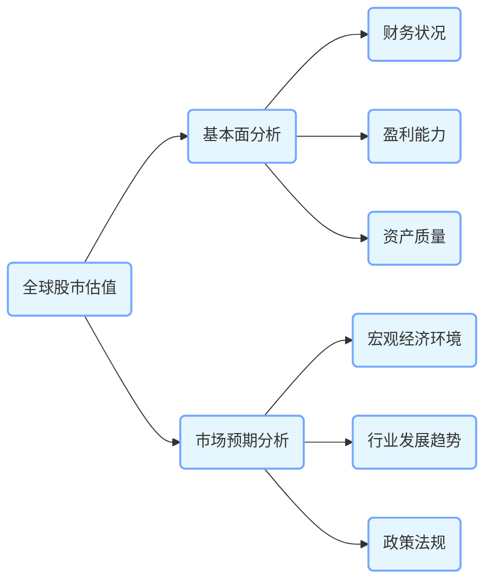
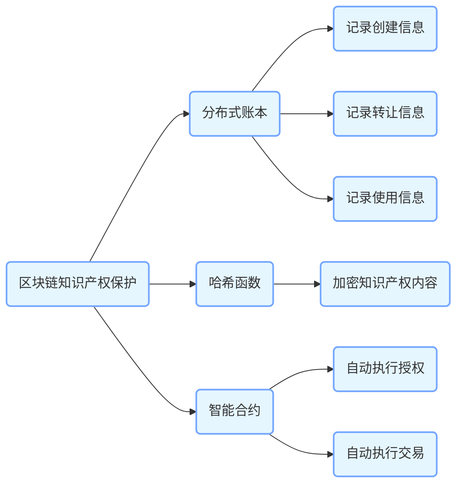

# 全球股市估值与区块链在知识产权保护中的应用

> 关键词：全球股市估值、区块链、知识产权保护、估值方法、分布式账本

> 摘要：本文深入探讨了全球股市估值的方法与原理，以及区块链技术在知识产权保护领域的应用。首先介绍了全球股市估值的背景知识，包括目的、预期读者、文档结构和相关术语。接着阐述了股市估值和区块链知识产权保护的核心概念及其联系，分析了核心算法原理并给出Python代码示例。通过数学模型和公式详细讲解了估值和区块链相关的计算方法。在项目实战部分，给出了代码实际案例及详细解释。还探讨了两者的实际应用场景，推荐了学习资源、开发工具框架和相关论文著作。最后总结了未来发展趋势与挑战，并提供了常见问题解答和扩展阅读参考资料。

## 1. 背景介绍 
### 1.1 目的和范围
全球股市估值是金融领域的重要研究课题，准确的估值有助于投资者做出合理的投资决策，帮助企业了解自身在市场中的价值定位。同时，随着数字经济的发展，知识产权保护面临着诸多挑战，区块链技术以其去中心化、不可篡改等特性为知识产权保护提供了新的解决方案。本文旨在系统地介绍全球股市估值的方法和区块链在知识产权保护中的应用原理、技术实现以及实际案例，为相关领域的研究者、投资者和从业者提供全面的参考。

### 1.2 预期读者
本文预期读者包括金融投资领域的专业人士，如股票分析师、基金经理等，他们可以从文中获取更深入的股市估值方法和思路；区块链技术开发者和研究者，能够了解区块链在知识产权保护中的具体应用场景和技术实现；知识产权所有者和相关法律从业者，可借助本文了解如何利用区块链技术加强知识产权保护；以及对金融和区块链技术感兴趣的广大爱好者，通过阅读本文可以建立起对这两个领域的基本认识。

### 1.3 文档结构概述
本文首先介绍全球股市估值和区块链在知识产权保护应用的背景知识，包括目的、读者对象和术语解释。接着阐述核心概念及其联系，通过示意图和流程图展示其原理和架构。然后详细讲解核心算法原理和具体操作步骤，给出Python代码示例。再用数学模型和公式进一步解释相关概念，并举例说明。在项目实战部分，给出代码实际案例并进行详细解读。之后探讨两者的实际应用场景，推荐学习资源、开发工具框架和相关论文著作。最后总结未来发展趋势与挑战，提供常见问题解答和扩展阅读参考资料。

### 1.4 术语表
#### 1.4.1 核心术语定义
- **全球股市估值**：对全球范围内各个股票市场上的上市公司的价值进行评估的过程，旨在确定股票的合理价格，为投资决策提供依据。
- **区块链**：一种分布式账本技术，通过去中心化、共识机制、加密算法等手段，实现数据的不可篡改和分布式存储，保证数据的安全性和可信度。
- **知识产权保护**：通过法律、技术等手段，对知识产权所有者的合法权益进行保护，防止他人未经授权的使用、复制和传播。
- **市盈率（P/E）**：股票价格除以每股收益的比率，反映了市场对公司未来盈利的预期。
- **分布式账本**：一种在多个节点之间共享、复制和同步的数据库，每个节点都保存有完整的数据副本，确保数据的一致性和可靠性。

#### 1.4.2 相关概念解释
- **股票市场有效性**：指股票市场能够迅速、准确地反映所有相关信息，使得股票价格能够合理地反映公司的内在价值。
- **智能合约**：一种基于区块链技术的自动执行合约，当满足预设条件时，合约会自动执行，无需第三方干预。
- **哈希函数**：一种将任意长度的输入数据转换为固定长度输出的函数，具有不可逆性和唯一性，常用于数据的加密和验证。

#### 1.4.3 缩略词列表
- **P/E**：市盈率（Price-to-Earnings Ratio）
- **NFT**：非同质化代币（Non-Fungible Token）
- **PoW**：工作量证明（Proof of Work）
- **PoS**：权益证明（Proof of Stake）

## 2. 核心概念与联系 

### 全球股市估值核心概念
全球股市估值主要基于公司的基本面和市场预期。基本面包括公司的财务状况、盈利能力、资产质量等，常用的估值方法有市盈率法、市净率法、现金流折现法等。市场预期则受到宏观经济环境、行业发展趋势、政策法规等因素的影响。

#### 示意图


### 区块链在知识产权保护中的核心概念
区块链通过分布式账本记录知识产权的创建、转让、使用等信息，利用哈希函数对知识产权内容进行加密，确保其不可篡改。智能合约可以自动执行知识产权的授权和交易，提高交易效率和透明度。

#### 示意图


### 两者的联系
虽然全球股市估值和区块链在知识产权保护看似是两个不同的领域，但实际上存在一定的联系。一方面，拥有良好知识产权保护的企业，其创新能力和市场竞争力更强，可能在股市中获得更高的估值。另一方面，区块链技术的发展也为金融市场带来了新的机遇和挑战，可能影响股市的估值体系。

## 3. 核心算法原理 & 具体操作步骤 

### 全球股市估值核心算法 - 市盈率法
市盈率法是一种常用的股市估值方法，其原理是通过比较公司的市盈率与行业平均市盈率或市场整体市盈率，来判断公司股票的估值是否合理。

#### 算法原理
市盈率（P/E）的计算公式为：$P/E = \frac{股票价格}{每股收益}$

通过计算公司的市盈率，并与同行业其他公司的市盈率进行比较，如果公司的市盈率低于行业平均市盈率，则认为该股票可能被低估；反之，则可能被高估。

#### Python代码实现
```python
# 定义市盈率计算函数
def calculate_pe(stock_price, earnings_per_share):
    if earnings_per_share == 0:
        return None
    return stock_price / earnings_per_share

# 示例数据
stock_price = 50
earnings_per_share = 5

# 计算市盈率
pe_ratio = calculate_pe(stock_price, earnings_per_share)
print(f"该股票的市盈率为: {pe_ratio}")
```

### 区块链在知识产权保护中的核心算法 - 哈希函数
哈希函数是区块链技术的核心之一，用于对知识产权内容进行加密和验证。常用的哈希函数有SHA-256等。

#### 算法原理
哈希函数将任意长度的输入数据转换为固定长度的输出，输出的哈希值具有唯一性和不可逆性。当知识产权内容发生变化时，其哈希值也会发生变化，从而可以通过比较哈希值来验证知识产权的完整性。

#### Python代码实现
```python
import hashlib

# 定义哈希计算函数
def calculate_hash(data):
    if isinstance(data, str):
        data = data.encode()
    hash_object = hashlib.sha256(data)
    return hash_object.hexdigest()

# 示例知识产权内容
ip_content = "This is a sample intellectual property content."

# 计算哈希值
hash_value = calculate_hash(ip_content)
print(f"该知识产权内容的哈希值为: {hash_value}")
```

## 4. 数学模型和公式 & 详细讲解 & 举例说明 

### 全球股市估值 - 现金流折现法
现金流折现法是一种基于公司未来现金流的估值方法，其基本原理是将公司未来的现金流按照一定的折现率折现到当前时刻，从而得到公司的内在价值。

#### 数学模型和公式
假设公司在未来 $n$ 年的现金流分别为 $CF_1, CF_2, \cdots, CF_n$，折现率为 $r$，则公司的内在价值 $V$ 可以表示为：

$$V = \sum_{i=1}^{n} \frac{CF_i}{(1 + r)^i} + \frac{TV}{(1 + r)^n}$$

其中，$TV$ 为公司在第 $n$ 年末的终值，可以通过永续增长模型计算：

$$TV = \frac{CF_n(1 + g)}{r - g}$$

其中，$g$ 为公司的永续增长率。

#### 详细讲解
现金流折现法的关键在于准确预测公司未来的现金流和选择合适的折现率。未来现金流的预测需要考虑公司的业务模式、市场前景、竞争状况等因素。折现率则反映了投资者对投资风险的要求，通常可以使用资本资产定价模型（CAPM）来确定。

#### 举例说明
假设某公司预计未来 3 年的现金流分别为 100 万元、120 万元和 150 万元，折现率为 10%，永续增长率为 3%。则该公司的内在价值计算如下：

1. 计算前 3 年现金流的现值：
    - $PV_1 = \frac{100}{(1 + 0.1)^1} = 90.91$（万元）
    - $PV_2 = \frac{120}{(1 + 0.1)^2} = 99.17$（万元）
    - $PV_3 = \frac{150}{(1 + 0.1)^3} = 112.69$（万元）

2. 计算第 3 年末的终值：
    - $TV = \frac{150(1 + 0.03)}{0.1 - 0.03} = 2207.14$（万元）

3. 计算终值的现值：
    - $PV_{TV} = \frac{2207.14}{(1 + 0.1)^3} = 1659.09$（万元）

4. 计算公司的内在价值：
    - $V = 90.91 + 99.17 + 112.69 + 1659.09 = 1961.86$（万元）

### 区块链在知识产权保护中的数学模型 - 哈希碰撞概率
哈希碰撞是指两个不同的输入数据经过哈希函数计算后得到相同的哈希值。哈希碰撞概率是衡量哈希函数安全性的重要指标。

#### 数学模型和公式
假设哈希函数的输出长度为 $n$ 位，则可能的哈希值总数为 $2^n$。根据生日悖论，当进行 $k$ 次哈希计算时，发生哈希碰撞的概率 $P$ 可以近似表示为：

$$P \approx 1 - e^{-\frac{k(k - 1)}{2^{n + 1}}}$$

#### 详细讲解
哈希碰撞概率随着哈希函数输出长度的增加而减小，随着哈希计算次数的增加而增加。为了保证哈希函数的安全性，通常需要选择输出长度足够长的哈希函数，以降低哈希碰撞的概率。

#### 举例说明
以 SHA-256 哈希函数为例，其输出长度为 256 位。假设进行 $10^9$ 次哈希计算，则发生哈希碰撞的概率为：

$$P \approx 1 - e^{-\frac{10^9(10^9 - 1)}{2^{257}}} \approx 0$$

可以看出，在实际应用中，SHA-256 哈希函数发生哈希碰撞的概率非常小，具有较高的安全性。

## 5. 项目实战：代码实际案例和详细解释说明 

### 5.1  开发环境搭建
#### 全球股市估值项目
- **编程语言**：Python 3.x
- **开发工具**：PyCharm 或 Jupyter Notebook
- **所需库**：pandas、numpy、yfinance 等

安装所需库的命令如下：
```sh
pip install pandas numpy yfinance
```

#### 区块链知识产权保护项目
- **编程语言**：Python 3.x
- **开发工具**：PyCharm 或 Jupyter Notebook
- **所需库**：web3、ethereum-tester 等

安装所需库的命令如下：
```sh
pip install web3 ethereum-tester
```

### 5.2  源代码详细实现和代码解读
#### 全球股市估值项目
```python
import yfinance as yf
import pandas as pd

# 定义股票代码
stock_symbol = "AAPL"

# 获取股票数据
stock_data = yf.download(stock_symbol, start="2020-01-01", end="2023-12-31")

# 计算每股收益（假设已知）
earnings_per_share = 5

# 计算市盈率
stock_price = stock_data['Close'][-1]
pe_ratio = stock_price / earnings_per_share

print(f"{stock_symbol} 的当前市盈率为: {pe_ratio}")
```

**代码解读**：
1. 导入所需的库，`yfinance` 用于获取股票数据，`pandas` 用于数据处理。
2. 定义股票代码，这里以苹果公司（AAPL）为例。
3. 使用 `yfinance` 的 `download` 方法获取指定时间段内的股票数据。
4. 假设已知每股收益，计算当前股票价格与每股收益的比值，得到市盈率。
5. 打印出该股票的当前市盈率。

#### 区块链知识产权保护项目
```python
from web3 import Web3

# 连接到以太坊测试网络
w3 = Web3(Web3.HTTPProvider('http://127.0.0.1:8545'))

# 检查连接是否成功
if w3.is_connected():
    print("已连接到以太坊网络")
else:
    print("连接失败")

# 定义知识产权内容
ip_content = "This is a sample intellectual property content."

# 计算哈希值
hash_value = Web3.keccak(text=ip_content).hex()

# 定义智能合约地址和 ABI
contract_address = "0x1234567890abcdef1234567890abcdef12345678"
contract_abi = [
    {
        "name": "storeIPHash",
        "type": "function",
        "inputs": [
            {
                "name": "ipHash",
                "type": "bytes32"
            }
        ],
        "outputs": [],
        "stateMutability": "nonpayable"
    }
]

# 获取智能合约实例
contract = w3.eth.contract(address=contract_address, abi=contract_abi)

# 调用智能合约方法存储哈希值
tx_hash = contract.functions.storeIPHash(hash_value).transact()

# 等待交易确认
tx_receipt = w3.eth.wait_for_transaction_receipt(tx_hash)

print(f"知识产权哈希值已存储，交易哈希: {tx_receipt.transactionHash.hex()}")
```

**代码解读**：
1. 导入 `Web3` 库，用于与以太坊网络进行交互。
2. 连接到以太坊测试网络，检查连接是否成功。
3. 定义知识产权内容，并使用 `Web3.keccak` 方法计算其哈希值。
4. 定义智能合约的地址和 ABI（应用二进制接口）。
5. 获取智能合约实例。
6. 调用智能合约的 `storeIPHash` 方法，将知识产权哈希值存储到区块链上。
7. 等待交易确认，并打印交易哈希。

### 5.3  代码解读与分析
#### 全球股市估值项目
- 该项目通过 `yfinance` 库方便地获取股票数据，计算市盈率的方法简单直观。但需要注意的是，每股收益的假设可能与实际情况存在偏差，在实际应用中需要通过财务报表等渠道获取准确的每股收益数据。
- 可以进一步扩展该项目，例如计算多个股票的市盈率并进行比较，或者结合其他估值方法进行综合分析。

#### 区块链知识产权保护项目
- 该项目展示了如何使用 `web3` 库与以太坊智能合约进行交互，将知识产权哈希值存储到区块链上。需要确保以太坊测试网络正常运行，并且智能合约的地址和 ABI 正确。
- 可以进一步完善该项目，例如添加查询知识产权哈希值的功能，或者实现智能合约的授权和交易逻辑。

## 6. 实际应用场景 
### 全球股市估值的应用场景
- **投资决策**：投资者可以通过对全球股市的估值分析，选择被低估的股票进行投资，以获取更高的收益。例如，当某只股票的市盈率低于行业平均水平时，可能意味着该股票具有投资价值。
- **企业并购**：在企业并购过程中，需要对目标企业进行估值，以确定合理的收购价格。股市估值方法可以为企业并购提供重要的参考依据。
- **宏观经济分析**：全球股市估值的变化可以反映宏观经济的走势。当股市整体估值较高时，可能意味着经济处于繁荣阶段；反之，则可能意味着经济面临下行压力。

### 区块链在知识产权保护中的应用场景
- **版权保护**：创作者可以将作品的哈希值存储到区块链上，当发生版权纠纷时，可以通过区块链上的记录证明作品的创作时间和所有权。例如，摄影师可以将拍摄的照片的哈希值上传到区块链，防止他人未经授权使用。
- **专利保护**：专利申请人可以在区块链上记录专利申请的相关信息，包括申请时间、技术方案等，提高专利申请的透明度和可信度。同时，区块链上的智能合约可以自动执行专利授权和许可交易。
- **商标保护**：商标所有者可以将商标的相关信息存储到区块链上，防止商标被恶意抢注和侵权。区块链的不可篡改特性可以为商标保护提供有力的证据支持。

## 7. 工具和资源推荐
### 7.1 学习资源推荐
#### 7.1.1 书籍推荐
- 《证券分析》（Security Analysis）：本杰明·格雷厄姆（Benjamin Graham）和戴维·多德（David Dodd）著，被誉为价值投资的圣经，详细介绍了股票估值的基本方法和原则。
- 《区块链：技术驱动金融》（Blockchain: The New Economics of Trust）：阿尔文德·纳拉亚南（Arvind Narayanan）等著，全面介绍了区块链技术的原理、应用和发展趋势。
- 《Python 金融数据分析实战》：通过实际案例介绍了如何使用 Python 进行金融数据的获取、处理和分析，对股市估值项目有很大的帮助。

#### 7.1.2 在线课程
- Coursera 上的“Financial Markets”：由耶鲁大学教授罗伯特·席勒（Robert Shiller）授课，介绍了金融市场的基本原理和估值方法。
- edX 上的“Blockchain and Bitcoin Technologies”：由普林斯顿大学教授讲授，深入讲解了区块链和比特币的技术原理和应用。
- 网易云课堂上的“Python 数据分析实战”：适合初学者学习 Python 在数据分析领域的应用，包括股市估值数据的处理。

#### 7.1.3 技术博客和网站
- 雪球网：提供丰富的股市分析和估值信息，是投资者交流和学习的重要平台。
- 巴比特：专注于区块链技术的资讯和技术分享，有很多关于区块链在知识产权保护应用的案例和分析。
- Medium 上的区块链和金融相关博客：可以关注一些知名博主的文章，获取最新的技术动态和研究成果。

### 7.2 开发工具框架推荐
#### 7.2.1 IDE和编辑器
- PyCharm：功能强大的 Python 集成开发环境，提供代码编辑、调试、版本控制等一系列功能，适合开发股市估值和区块链项目。
- Visual Studio Code：轻量级的代码编辑器，支持多种编程语言和插件扩展，可用于快速开发和调试。
- Remix：专门用于以太坊智能合约开发的在线编辑器，提供语法高亮、编译、部署等功能，方便开发者进行智能合约的开发和测试。

#### 7.2.2 调试和性能分析工具
- PDB：Python 自带的调试工具，可以帮助开发者定位代码中的问题和错误。
- Ganache：以太坊测试网络工具，提供本地的以太坊环境，方便开发者进行智能合约的开发和测试，同时可以查看交易记录和账户余额等信息。
- Web3.py 调试工具：`web3.py` 库提供了一些调试方法和工具，例如打印交易信息、查看合约状态等，有助于开发者调试区块链项目。

#### 7.2.3 相关框架和库
- Pandas：强大的 Python 数据处理库，可用于股市数据的清洗、分析和可视化。
- NumPy：提供高效的数值计算功能，在股市估值的数学计算中发挥重要作用。
- Web3.py：用于与以太坊区块链进行交互的 Python 库，支持智能合约的部署、调用和事件监听等功能。

### 7.3 相关论文著作推荐
#### 7.3.1 经典论文
- “The Arbitrage Pricing Theory of Capital Asset Pricing”：斯蒂芬·罗斯（Stephen Ross）提出的套利定价理论，为股市估值提供了一种新的思路和方法。
- “Bitcoin: A Peer-to-Peer Electronic Cash System”：中本聪（Satoshi Nakamoto）发表的比特币白皮书，奠定了区块链技术的基础。
- “The Blockchain Economy: A Game Theoretical Perspective”：从博弈论的角度分析了区块链经济的运行机制和价值创造。

#### 7.3.2 最新研究成果
- 关注顶级学术期刊如《Journal of Financial Economics》《Management Science》等上发表的关于股市估值和区块链技术的研究论文，了解最新的研究动态和方法。
- 参加国际学术会议如 ACM SIGKDD、IEEE ICDM 等，获取关于区块链和金融领域的最新研究成果。

#### 7.3.3 应用案例分析
- 研究一些知名企业在股市估值和区块链知识产权保护方面的应用案例，例如苹果公司的估值分析、阿里巴巴在区块链版权保护方面的实践等，从中学习经验和教训。

## 8. 总结：未来发展趋势与挑战
### 全球股市估值的未来发展趋势与挑战
#### 发展趋势
- **智能化估值**：随着人工智能和机器学习技术的发展，股市估值将越来越智能化。通过构建复杂的模型和算法，可以更准确地预测公司的未来现金流和市场表现。
- **全球化估值**：全球金融市场的一体化趋势不断加强，股市估值将更加注重全球范围内的比较和分析。投资者需要考虑不同国家和地区的宏观经济环境、政策法规等因素。
- **多因素估值**：传统的股市估值方法主要基于财务指标，未来将更多地考虑非财务因素，如公司的创新能力、社会责任等，以更全面地评估公司的价值。

#### 挑战
- **数据质量和可靠性**：股市估值需要大量的历史数据和实时数据，但数据的质量和可靠性可能存在问题。不准确或不完整的数据可能导致估值结果的偏差。
- **市场不确定性**：股市受到宏观经济、政策法规、突发事件等多种因素的影响，市场不确定性增加，给估值带来了更大的挑战。
- **模型的局限性**：现有的股市估值模型都存在一定的局限性，无法完全准确地反映市场的复杂性和不确定性。需要不断改进和完善估值模型。

### 区块链在知识产权保护中的未来发展趋势与挑战
#### 发展趋势
- **广泛应用**：随着区块链技术的不断成熟和普及，其在知识产权保护领域的应用将越来越广泛。除了版权、专利和商标保护外，还可能应用于商业秘密、地理标志等领域。
- **与其他技术融合**：区块链将与人工智能、物联网、大数据等技术深度融合，为知识产权保护提供更强大的技术支持。例如，通过物联网设备实时监测知识产权的使用情况，并将数据记录到区块链上。
- **标准化和规范化**：为了促进区块链在知识产权保护领域的健康发展，需要建立统一的标准和规范。例如，制定区块链知识产权保护的技术标准、业务流程标准等。

#### 挑战
- **技术性能问题**：区块链技术的性能问题，如交易处理速度慢、存储成本高，仍然是制约其在知识产权保护领域大规模应用的主要障碍。需要不断改进和优化区块链技术。
- **法律和监管问题**：区块链在知识产权保护领域的应用涉及到法律和监管的空白。需要制定相应的法律法规，明确区块链上知识产权的归属、保护和侵权责任等问题。
- **用户认知和接受度**：由于区块链技术相对复杂，用户对其认知和接受度较低。需要加强宣传和推广，提高用户对区块链知识产权保护的认识和信任。

## 9. 附录：常见问题与解答
### 全球股市估值相关问题
#### 问：市盈率法有哪些局限性？
答：市盈率法的局限性主要包括：一是没有考虑公司的未来增长潜力，对于高成长型公司可能会低估其价值；二是不同行业的市盈率水平差异较大，直接比较可能会得出不准确的结论；三是市盈率受市场情绪和短期波动的影响较大，不能完全反映公司的内在价值。

#### 问：现金流折现法中折现率如何确定？
答：折现率可以使用资本资产定价模型（CAPM）来确定，公式为 $r = R_f + \beta (R_m - R_f)$，其中 $R_f$ 为无风险利率，$\beta$ 为股票的贝塔系数，反映了股票相对于市场的波动程度，$R_m$ 为市场平均收益率。无风险利率可以参考国债收益率，贝塔系数可以通过历史数据计算或从金融数据提供商处获取，市场平均收益率可以根据历史市场表现进行估算。

### 区块链在知识产权保护相关问题
#### 问：区块链上的知识产权信息可以被篡改吗？
答：理论上，由于区块链的去中心化和不可篡改特性，一旦知识产权信息被记录到区块链上，就很难被篡改。但在实际应用中，如果攻击者控制了超过 51% 的区块链节点（即 51% 攻击），就有可能篡改区块链上的数据。不过，这种攻击的成本非常高，在大型区块链网络中几乎不可能实现。

#### 问：智能合约在知识产权保护中有哪些优势？
答：智能合约在知识产权保护中的优势主要包括：一是自动执行，当满足预设条件时，合约会自动执行，无需第三方干预，提高了交易效率；二是透明度高，智能合约的代码和执行过程都是公开透明的，各方可以随时查看和监督；三是不可篡改，智能合约的执行结果一旦记录到区块链上，就无法被篡改，保证了交易的安全性和可信度。

## 10. 扩展阅读 & 参考资料
### 扩展阅读
- 《金融炼金术》（The Alchemy of Finance）：乔治·索罗斯（George Soros）著，介绍了作者的投资哲学和市场分析方法，对股市估值有一定的启示。
- 《区块链革命：比特币底层技术如何改变货币、商业和世界》（The Blockchain Revolution: How the Technology Behind Bitcoin Is Changing Money, Business, and the World）：唐·塔普斯科特（Don Tapscott）和亚力克斯·塔普斯科特（Alex Tapscott）著，深入探讨了区块链技术对各个行业的影响和变革。

### 参考资料
- Yahoo Finance：提供全球股市的实时数据和历史数据，是获取股票信息的重要来源。
- Ethereum.org：以太坊官方网站，提供以太坊区块链的技术文档、开发工具和社区资源。
- World Intellectual Property Organization (WIPO)：世界知识产权组织官方网站，提供知识产权保护的相关法律法规、政策文件和案例分析。

作者：AI天才研究院/AI Genius Institute & 禅与计算机程序设计艺术 /Zen And The Art of Computer Programming