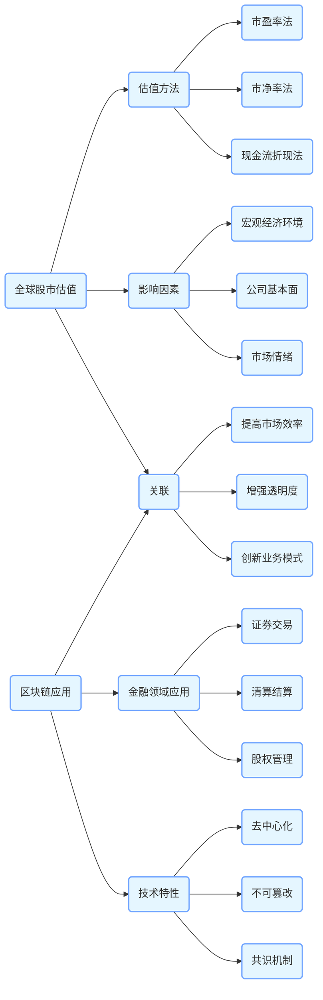

# 全球股市估值与区块链应用的关联

> 关键词：全球股市估值、区块链应用、关联分析、金融市场、技术融合

> 摘要：本文深入探讨了全球股市估值与区块链应用之间的关联。通过对背景知识的介绍，详细阐述了核心概念、核心算法原理、数学模型等内容。利用Python代码进行算法实现，并结合实际案例进行分析。同时，介绍了该关联在实际中的应用场景，推荐了相关的学习资源、开发工具和论文著作。最后对未来发展趋势与挑战进行总结，并解答常见问题，为读者全面了解全球股市估值与区块链应用的关联提供了系统的参考。

## 1. 背景介绍 
### 1.1 目的和范围
本研究的目的在于深入剖析全球股市估值与区块链应用之间的内在联系，揭示区块链技术如何影响全球股市的估值体系。研究范围涵盖全球主要股票市场，包括但不限于美国、欧洲、亚洲等地区的证券交易所。同时，对区块链在金融领域的各种应用场景进行分析，如证券交易、清算结算、股权管理等，以确定这些应用对股市估值的具体影响。

### 1.2 预期读者
本文预期读者包括金融领域的专业人士，如股票分析师、基金经理、投资银行家等，他们可以通过本文了解区块链技术对股市估值的影响，为投资决策提供参考。同时，也适合区块链技术开发者、研究人员，帮助他们了解区块链在金融市场中的潜在应用价值。此外，对金融科技感兴趣的普通投资者和学生也可以从本文中获取相关知识。

### 1.3 文档结构概述
本文首先介绍了相关的背景知识，包括研究目的、预期读者和文档结构。接着阐述了核心概念，如全球股市估值和区块链应用的定义、原理和架构，并通过Mermaid流程图进行可视化展示。然后详细讲解了核心算法原理和具体操作步骤，同时给出Python源代码示例。之后介绍了数学模型和公式，并结合实际例子进行说明。在项目实战部分，通过一个具体的代码案例详细解释了如何实现相关分析。接着探讨了该关联在实际中的应用场景，推荐了学习资源、开发工具和相关论文著作。最后对未来发展趋势与挑战进行总结，并解答常见问题，提供扩展阅读和参考资料。

### 1.4 术语表
#### 1.4.1 核心术语定义
- **全球股市估值**：指对全球各个股票市场上上市公司的股票价值进行评估的过程和结果。通常采用多种方法，如市盈率、市净率、现金流折现等，以确定股票的合理价格。
- **区块链**：是一种分布式账本技术，通过去中心化、不可篡改、共识机制等特点，实现数据的安全存储和传输。区块链由一个个区块组成，每个区块包含一定数量的交易信息，并通过哈希算法与前一个区块相连，形成链式结构。
- **智能合约**：是一种基于区块链技术的自动化合约，它以代码的形式编写合约条款，当满足预设条件时，合约会自动执行，无需第三方干预。

#### 1.4.2 相关概念解释
- **去中心化**：在区块链系统中，没有中央控制机构，所有节点都具有平等的地位，共同维护系统的运行。这种特性使得区块链具有更高的安全性和可靠性。
- **共识机制**：是区块链网络中节点达成一致的规则和算法。常见的共识机制包括工作量证明（PoW）、权益证明（PoS）、委托权益证明（DPoS）等，不同的共识机制适用于不同的应用场景。
- **加密货币**：是基于区块链技术的数字化货币，如比特币、以太坊等。加密货币使用密码学技术进行安全保护，具有去中心化、匿名性等特点。

#### 1.4.3 缩略词列表
- **PoW**：Proof of Work，工作量证明
- **PoS**：Proof of Stake，权益证明
- **DPoS**：Delegated Proof of Stake，委托权益证明
- **P/E**：Price-to-Earnings Ratio，市盈率
- **P/B**：Price-to-Book Ratio，市净率

## 2. 核心概念与联系 
### 全球股市估值
全球股市估值是对上市公司股票价值的评估，它是投资者进行投资决策的重要依据。常见的估值方法包括：
- **市盈率法（P/E）**：市盈率是指股票价格与每股收益的比率，计算公式为 $P/E=\frac{股价}{每股收益}$。市盈率反映了投资者为获取每一元盈利所愿意支付的价格，一般来说，市盈率越高，表明市场对该股票的预期越高。
- **市净率法（P/B）**：市净率是指股票价格与每股净资产的比率，计算公式为 $P/B=\frac{股价}{每股净资产}$。市净率反映了股票价格相对于每股净资产的倍数，通常用于评估资产类公司的价值。
- **现金流折现法（DCF）**：现金流折现法是通过预测公司未来的现金流，并将其折现到当前时点，以确定公司的内在价值。计算公式为 $V=\sum_{t=1}^{n}\frac{CF_t}{(1+r)^t}$，其中 $V$ 表示公司的内在价值，$CF_t$ 表示第 $t$ 期的现金流，$r$ 表示折现率，$n$ 表示预测期数。

### 区块链应用
区块链在金融领域有广泛的应用，主要包括以下几个方面：
- **证券交易**：区块链技术可以实现证券交易的自动化和实时结算，减少交易环节，降低交易成本，提高交易效率。例如，通过智能合约可以自动执行证券交易的结算和交割，避免了传统交易中的人工干预和延迟。
- **清算结算**：区块链的分布式账本特性可以实现清算结算的透明化和高效化。所有交易信息都记录在区块链上，各个参与方可以实时查看和验证交易情况，减少了清算结算的时间和成本。
- **股权管理**：区块链可以用于股权的登记、转让和管理。通过区块链的不可篡改特性，确保股权信息的真实性和安全性，同时提高股权管理的效率。

### 两者的联系
区块链应用对全球股市估值产生影响的主要途径包括：
- **提高市场效率**：区块链技术可以提高证券交易、清算结算等环节的效率，减少市场摩擦，从而提高市场的整体效率。这可能会导致股市估值的上升，因为投资者更愿意为高效的市场支付更高的价格。
- **增强透明度**：区块链的分布式账本特性使得交易信息更加透明，投资者可以更准确地了解上市公司的财务状况和经营情况。这有助于提高投资者的信心，从而对股市估值产生积极影响。
- **创新业务模式**：区块链技术催生了许多新的业务模式，如代币发行、去中心化金融等。这些创新业务模式可能会为上市公司带来新的增长点，从而影响其股市估值。

### 文本示意图
```plaintext
全球股市估值
|-- 估值方法
|   |-- 市盈率法
|   |-- 市净率法
|   |-- 现金流折现法
|-- 影响因素
|   |-- 宏观经济环境
|   |-- 公司基本面
|   |-- 市场情绪

区块链应用
|-- 金融领域应用
|   |-- 证券交易
|   |-- 清算结算
|   |-- 股权管理
|-- 技术特性
|   |-- 去中心化
|   |-- 不可篡改
|   |-- 共识机制

关联
|-- 提高市场效率
|-- 增强透明度
|-- 创新业务模式
```

### Mermaid流程图


## 3. 核心算法原理 & 具体操作步骤 
### 算法原理
为了分析全球股市估值与区块链应用的关联，我们可以采用回归分析的方法。回归分析是一种统计方法，用于研究自变量与因变量之间的关系。在本研究中，我们将全球股市估值作为因变量，区块链应用的相关指标作为自变量。

假设我们有 $n$ 个样本数据，每个样本包含全球股市估值 $y_i$ 和区块链应用的 $m$ 个指标 $x_{i1},x_{i2},\cdots,x_{im}$，其中 $i = 1,2,\cdots,n$。我们可以建立如下的线性回归模型：

$$y_i=\beta_0+\beta_1x_{i1}+\beta_2x_{i2}+\cdots+\beta_mx_{im}+\epsilon_i$$

其中，$\beta_0$ 是截距项，$\beta_1,\beta_2,\cdots,\beta_m$ 是回归系数，$\epsilon_i$ 是误差项，服从均值为 0，方差为 $\sigma^2$ 的正态分布。

我们的目标是通过最小化误差项的平方和来估计回归系数 $\beta_0,\beta_1,\cdots,\beta_m$，即：

$$\min_{\beta_0,\beta_1,\cdots,\beta_m}\sum_{i=1}^{n}(y_i-\beta_0-\beta_1x_{i1}-\beta_2x_{i2}-\cdots-\beta_mx_{im})^2$$

### 具体操作步骤
1. **数据收集**：收集全球股市估值的相关数据，如市盈率、市净率等，以及区块链应用的相关指标，如区块链技术的使用程度、区块链项目的数量等。
2. **数据预处理**：对收集到的数据进行清洗、缺失值处理、异常值处理等操作，确保数据的质量。
3. **模型建立**：根据上述回归模型，使用 Python 的 `scikit-learn` 库建立线性回归模型。
4. **模型训练**：将预处理后的数据分为训练集和测试集，使用训练集对模型进行训练。
5. **模型评估**：使用测试集对训练好的模型进行评估，计算模型的拟合优度、均方误差等指标，评估模型的性能。
6. **结果分析**：分析回归系数的显著性和正负性，确定区块链应用的各个指标对全球股市估值的影响方向和程度。

### Python源代码
```python
import numpy as np
from sklearn.linear_model import LinearRegression
from sklearn.model_selection import train_test_split
from sklearn.metrics import mean_squared_error, r2_score

# 生成示例数据
np.random.seed(0)
n = 100  # 样本数量
m = 3    # 自变量数量
X = np.random.randn(n, m)
y = 2 * X[:, 0] + 3 * X[:, 1] - 1 * X[:, 2] + np.random.randn(n)

# 划分训练集和测试集
X_train, X_test, y_train, y_test = train_test_split(X, y, test_size=0.2, random_state=0)

# 建立线性回归模型
model = LinearRegression()

# 模型训练
model.fit(X_train, y_train)

# 模型预测
y_pred = model.predict(X_test)

# 模型评估
mse = mean_squared_error(y_test, y_pred)
r2 = r2_score(y_test, y_pred)

# 输出结果
print("回归系数:", model.coef_)
print("截距项:", model.intercept_)
print("均方误差:", mse)
print("拟合优度:", r2)
```

### 代码解释
1. **数据生成**：使用 `numpy` 库生成示例数据，其中 $X$ 是自变量矩阵，$y$ 是因变量向量。
2. **数据划分**：使用 `train_test_split` 函数将数据划分为训练集和测试集，测试集占总数据的 20%。
3. **模型建立**：使用 `LinearRegression` 类建立线性回归模型。
4. **模型训练**：使用 `fit` 方法对模型进行训练，传入训练集的自变量和因变量。
5. **模型预测**：使用 `predict` 方法对测试集进行预测，得到预测结果。
6. **模型评估**：使用 `mean_squared_error` 函数计算均方误差，使用 `r2_score` 函数计算拟合优度。
7. **结果输出**：输出回归系数、截距项、均方误差和拟合优度。

## 4. 数学模型和公式 & 详细讲解 & 举例说明 
### 线性回归模型
线性回归模型是一种广泛应用的统计模型，用于研究自变量与因变量之间的线性关系。其一般形式为：

$$y=\beta_0+\beta_1x_1+\beta_2x_2+\cdots+\beta_mx_m+\epsilon$$

其中，$y$ 是因变量，$x_1,x_2,\cdots,x_m$ 是自变量，$\beta_0,\beta_1,\cdots,\beta_m$ 是回归系数，$\epsilon$ 是误差项。

### 最小二乘法
最小二乘法是一种常用的参数估计方法，用于估计线性回归模型的回归系数。其基本思想是通过最小化误差项的平方和来确定回归系数的值。误差项的平方和可以表示为：

$$S(\beta_0,\beta_1,\cdots,\beta_m)=\sum_{i=1}^{n}(y_i-\beta_0-\beta_1x_{i1}-\beta_2x_{i2}-\cdots-\beta_mx_{im})^2$$

为了找到使 $S(\beta_0,\beta_1,\cdots,\beta_m)$ 最小的 $\beta_0,\beta_1,\cdots,\beta_m$，我们可以对 $S$ 分别求关于 $\beta_0,\beta_1,\cdots,\beta_m$ 的偏导数，并令其等于 0，得到一组正规方程：

$$\begin{cases}
\frac{\partial S}{\partial \beta_0}=-2\sum_{i=1}^{n}(y_i-\beta_0-\beta_1x_{i1}-\beta_2x_{i2}-\cdots-\beta_mx_{im})=0\\
\frac{\partial S}{\partial \beta_1}=-2\sum_{i=1}^{n}(y_i-\beta_0-\beta_1x_{i1}-\beta_2x_{i2}-\cdots-\beta_mx_{im})x_{i1}=0\\
\cdots\\
\frac{\partial S}{\partial \beta_m}=-2\sum_{i=1}^{n}(y_i-\beta_0-\beta_1x_{i1}-\beta_2x_{i2}-\cdots-\beta_mx_{im})x_{im}=0
\end{cases}$$

解这个正规方程组，就可以得到回归系数的估计值。

### 拟合优度
拟合优度是衡量线性回归模型拟合效果的一个指标，通常用 $R^2$ 表示。其计算公式为：

$$R^2 = 1 - \frac{\sum_{i=1}^{n}(y_i - \hat{y}_i)^2}{\sum_{i=1}^{n}(y_i - \bar{y})^2}$$

其中，$\hat{y}_i$ 是模型的预测值，$\bar{y}$ 是因变量的均值。$R^2$ 的取值范围是 $[0,1]$，$R^2$ 越接近 1，说明模型的拟合效果越好。

### 均方误差
均方误差是衡量模型预测误差的一个指标，通常用 MSE 表示。其计算公式为：

$$MSE = \frac{1}{n}\sum_{i=1}^{n}(y_i - \hat{y}_i)^2$$

MSE 越小，说明模型的预测误差越小，模型的性能越好。

### 举例说明
假设我们有以下数据集：

| $x_1$ | $x_2$ | $y$ |
| --- | --- | --- |
| 1 | 2 | 5 |
| 2 | 3 | 7 |
| 3 | 4 | 9 |
| 4 | 5 | 11 |
| 5 | 6 | 13 |

我们可以使用线性回归模型来研究 $y$ 与 $x_1$ 和 $x_2$ 之间的关系。

首先，我们可以将数据集表示为矩阵形式：

$$X = \begin{bmatrix}
1 & 1 & 2\\
1 & 2 & 3\\
1 & 3 & 4\\
1 & 4 & 5\\
1 & 5 & 6
\end{bmatrix},
y = \begin{bmatrix}
5\\
7\\
9\\
11\\
13
\end{bmatrix}$$

然后，我们可以使用最小二乘法来估计回归系数 $\beta$：

$$\beta = (X^T X)^{-1} X^T y$$

计算可得：

$$\beta = \begin{bmatrix}
1\\
2\\
0
\end{bmatrix}$$

因此，线性回归模型为：

$$y = 1 + 2x_1 + 0x_2$$

接下来，我们可以计算拟合优度 $R^2$ 和均方误差 MSE：

首先，计算预测值 $\hat{y}$：

$$\hat{y} = X\beta = \begin{bmatrix}
5\\
7\\
9\\
11\\
13
\end{bmatrix}$$

然后，计算 $R^2$ 和 MSE：

$$R^2 = 1 - \frac{\sum_{i=1}^{n}(y_i - \hat{y}_i)^2}{\sum_{i=1}^{n}(y_i - \bar{y})^2} = 1$$

$$MSE = \frac{1}{n}\sum_{i=1}^{n}(y_i - \hat{y}_i)^2 = 0$$

由于 $R^2 = 1$，MSE = 0，说明模型的拟合效果非常好，预测误差为 0。

## 5. 项目实战：代码实际案例和详细解释说明 
### 5.1  开发环境搭建
为了完成本项目实战，我们需要搭建以下开发环境：
- **Python 环境**：建议使用 Python 3.7 及以上版本。可以从 Python 官方网站（https://www.python.org/downloads/）下载并安装。
- **开发工具**：推荐使用 PyCharm 作为开发工具，它是一款功能强大的 Python 集成开发环境（IDE）。可以从 JetBrains 官方网站（https://www.jetbrains.com/pycharm/download/）下载并安装。
- **相关库**：需要安装 `numpy`、`pandas`、`scikit-learn` 等库。可以使用 `pip` 命令进行安装：
```sh
pip install numpy pandas scikit-learn
```

### 5.2  源代码详细实现和代码解读
以下是一个完整的代码示例，用于分析全球股市估值与区块链应用的关联：

```python
import numpy as np
import pandas as pd
from sklearn.linear_model import LinearRegression
from sklearn.model_selection import train_test_split
from sklearn.metrics import mean_squared_error, r2_score

# 读取数据
data = pd.read_csv('stock_blockchain_data.csv')

# 提取自变量和因变量
X = data.drop('stock_valuation', axis=1).values
y = data['stock_valuation'].values

# 划分训练集和测试集
X_train, X_test, y_train, y_test = train_test_split(X, y, test_size=0.2, random_state=0)

# 建立线性回归模型
model = LinearRegression()

# 模型训练
model.fit(X_train, y_train)

# 模型预测
y_pred = model.predict(X_test)

# 模型评估
mse = mean_squared_error(y_test, y_pred)
r2 = r2_score(y_test, y_pred)

# 输出结果
print("回归系数:", model.coef_)
print("截距项:", model.intercept_)
print("均方误差:", mse)
print("拟合优度:", r2)
```

### 代码解读
1. **数据读取**：使用 `pandas` 库的 `read_csv` 函数读取存储在 `stock_blockchain_data.csv` 文件中的数据。
2. **自变量和因变量提取**：使用 `drop` 方法从数据中提取自变量，将 `stock_valuation` 列作为因变量。
3. **数据划分**：使用 `train_test_split` 函数将数据划分为训练集和测试集，测试集占总数据的 20%。
4. **模型建立**：使用 `LinearRegression` 类建立线性回归模型。
5. **模型训练**：使用 `fit` 方法对模型进行训练，传入训练集的自变量和因变量。
6. **模型预测**：使用 `predict` 方法对测试集进行预测，得到预测结果。
7. **模型评估**：使用 `mean_squared_error` 函数计算均方误差，使用 `r2_score` 函数计算拟合优度。
8. **结果输出**：输出回归系数、截距项、均方误差和拟合优度。

### 5.3  代码解读与分析
通过上述代码，我们可以得到回归系数、截距项、均方误差和拟合优度等结果。回归系数表示自变量对因变量的影响程度，截距项表示当所有自变量都为 0 时因变量的取值。均方误差衡量了模型的预测误差，拟合优度衡量了模型的拟合效果。

如果回归系数为正，说明该自变量与因变量呈正相关关系；如果回归系数为负，说明该自变量与因变量呈负相关关系。拟合优度越接近 1，说明模型的拟合效果越好；均方误差越小，说明模型的预测误差越小。

例如，如果某个区块链应用指标的回归系数为正且显著，说明该区块链应用指标的增加会导致全球股市估值的上升；如果拟合优度较高，说明模型能够较好地解释全球股市估值与区块链应用之间的关系。

## 6. 实际应用场景 
### 投资决策
投资者可以利用全球股市估值与区块链应用的关联分析结果，做出更明智的投资决策。例如，如果分析结果表明区块链技术的应用对某一行业的股市估值有显著的正向影响，投资者可以考虑增加对该行业相关股票的投资。相反，如果某一区块链应用指标与股市估值呈负相关，投资者则需要谨慎对待相关股票。

### 上市公司战略规划
上市公司可以通过研究全球股市估值与区块链应用的关联，制定合理的战略规划。如果发现区块链技术在某一领域的应用能够提升公司的股市估值，上市公司可以加大在该领域的研发和应用投入，以提高公司的市场价值。例如，金融机构可以加强区块链在证券交易、清算结算等方面的应用，以提高运营效率和透明度，从而提升股市估值。

### 政策制定
政府和监管机构可以根据全球股市估值与区块链应用的关联分析结果，制定相关的政策和监管措施。例如，如果区块链技术的应用对股市稳定和发展有积极作用，政府可以出台鼓励政策，支持区块链技术在金融领域的创新应用。同时，监管机构可以加强对区块链金融市场的监管，防范潜在的风险。

### 市场趋势分析
金融分析师和研究机构可以利用全球股市估值与区块链应用的关联分析，预测市场趋势。通过监测区块链应用指标的变化，结合股市估值的波动情况，分析师可以提前判断市场的走势，为投资者和企业提供参考。例如，如果区块链技术在某一时期的应用速度加快，且与股市估值的关联度增强，分析师可以预测相关股票市场可能会出现上涨趋势。

## 7. 工具和资源推荐
### 7.1 学习资源推荐
#### 7.1.1 书籍推荐
- 《区块链：技术驱动金融》：本书由中信出版社出版，作者是阿尔文德·纳拉亚南等。该书详细介绍了区块链技术的原理、应用和发展趋势，是学习区块链技术的经典书籍之一。
- 《金融市场与金融机构》：本书由机械工业出版社出版，作者是弗雷德里克·S·米什金等。该书系统地介绍了金融市场和金融机构的基本知识，对于理解全球股市估值和金融市场运作有很大帮助。
- 《Python 数据分析实战》：本书由人民邮电出版社出版，作者是韦玮等。该书通过大量的实际案例，介绍了如何使用 Python 进行数据分析，对于进行全球股市估值与区块链应用的关联分析非常有用。

#### 7.1.2 在线课程
- Coursera 上的 “区块链基础” 课程：该课程由普林斯顿大学的教授授课，介绍了区块链的基本概念、技术原理和应用场景，适合初学者学习。
- edX 上的 “金融市场” 课程：该课程由麻省理工学院的教授授课，系统地讲解了金融市场的运作机制和投资分析方法，对于理解全球股市估值有很大帮助。
- 中国大学 MOOC 上的 “Python 数据分析与挖掘实战” 课程：该课程由哈尔滨工业大学的教师授课，通过实际案例介绍了 Python 在数据分析和挖掘中的应用，对于进行关联分析有很大帮助。

#### 7.1.3 技术博客和网站
- 区块链铅笔（https://www.qkl123.com/）：该网站是国内知名的区块链资讯平台，提供了丰富的区块链技术文章、行业动态和项目分析，对于了解区块链应用有很大帮助。
- 雪球（https://xueqiu.com/）：该网站是国内知名的金融投资社区，提供了全球股市的行情数据、分析报告和投资者交流平台，对于了解全球股市估值有很大帮助。
- Medium（https://medium.com/）：该网站是一个全球知名的技术博客平台，上面有很多关于区块链技术和金融市场的高质量文章，可以帮助读者深入了解相关领域的知识。

### 7.2 开发工具框架推荐
#### 7.2.1 IDE和编辑器
- PyCharm：是一款功能强大的 Python 集成开发环境（IDE），提供了代码编辑、调试、版本控制等功能，适合进行 Python 数据分析和机器学习开发。
- Jupyter Notebook：是一个基于网页的交互式开发环境，支持 Python、R 等多种编程语言，适合进行数据探索、模型实验和结果展示。
- Visual Studio Code：是一款轻量级的代码编辑器，支持多种编程语言和插件扩展，适合进行快速开发和调试。

#### 7.2.2 调试和性能分析工具
- pdb：是 Python 自带的调试工具，可以在代码中设置断点，逐步执行代码，查看变量的值和程序的执行流程。
- cProfile：是 Python 自带的性能分析工具，可以统计代码中各个函数的执行时间和调用次数，帮助开发者找出性能瓶颈。
- Py-Spy：是一个开源的 Python 性能分析工具，可以实时监测 Python 程序的 CPU 使用情况和函数调用栈，帮助开发者快速定位性能问题。

#### 7.2.3 相关框架和库
- NumPy：是 Python 中用于科学计算的基础库，提供了高效的多维数组对象和各种数学函数，对于进行数据处理和数值计算非常有用。
- Pandas：是 Python 中用于数据分析的库，提供了数据结构（如 DataFrame）和数据操作方法，方便进行数据清洗、转换和分析。
- Scikit-learn：是 Python 中用于机器学习的库，提供了各种机器学习算法和工具，如线性回归、逻辑回归、决策树等，适合进行数据建模和预测。

### 7.3 相关论文著作推荐
#### 7.3.1 经典论文
- Nakamoto, S. (2008). Bitcoin: A Peer-to-Peer Electronic Cash System. 这是比特币的白皮书，首次提出了区块链的概念和实现方法，是区块链领域的经典论文。
- Fama, E. F., & French, K. R. (1992). The Cross-Section of Expected Stock Returns. 该论文提出了著名的 Fama-French 三因子模型，用于解释股票收益率的横截面差异，对于理解股市估值有重要意义。

#### 7.3.2 最新研究成果
- Cong, L. W., & He, X. (2019). Blockchain Disruption and Smart Contracts. Management Science, 65(4), 1754-1777. 该论文研究了区块链技术对商业模式和合约设计的影响，对于理解区块链在金融领域的应用有很大帮助。
- Biais, B., Bisière, C., Bouvard, M., & Casamatta, C. (2019). Blockchain Economics. Journal of Economic Perspectives, 33(3), 57-78. 该论文从经济学的角度分析了区块链技术的特点和应用前景，对于理解区块链与金融市场的关系有重要参考价值。

#### 7.3.3 应用案例分析
- Swan, M. (2015). Blockchain: Blueprint for a New Economy. O'Reilly Media. 该书通过大量的实际案例，介绍了区块链技术在金融、医疗、能源等领域的应用，对于了解区块链的实际应用场景有很大帮助。
- Tapscott, D., & Tapscott, A. (2016). Blockchain Revolution: How the Technology Behind Bitcoin Is Changing Money, Business, and the World. Portfolio Penguin. 该书探讨了区块链技术对社会和经济的影响，并通过案例分析展示了区块链在不同行业的应用潜力。

## 8. 总结：未来发展趋势与挑战
### 未来发展趋势
- **深度融合**：全球股市估值与区块链应用将实现更深度的融合。随着区块链技术的不断发展和应用，其对股市估值的影响将越来越显著。例如，区块链技术可能会改变传统的证券发行和交易模式，提高市场效率和透明度，从而对股市估值产生深远影响。
- **创新业务模式涌现**：区块链技术将催生更多的创新业务模式，如去中心化金融（DeFi）、非同质化代币（NFT）等。这些创新业务模式可能会为上市公司带来新的增长点，从而影响其股市估值。同时，也会吸引更多的投资者参与到区块链金融市场中，推动市场的发展。
- **监管逐步完善**：随着区块链金融市场的发展，监管机构将逐步完善相关的监管政策和法规。这将有助于规范市场秩序，防范潜在的风险，保障投资者的权益。同时，也会为区块链技术在金融领域的应用提供更加良好的发展环境。

### 挑战
- **技术难题**：区块链技术目前还面临一些技术难题，如性能瓶颈、可扩展性、隐私保护等。这些技术难题可能会限制区块链技术在金融领域的大规模应用，从而影响其对全球股市估值的影响程度。
- **市场风险**：区块链金融市场具有较高的风险性，如价格波动大、市场操纵、黑客攻击等。这些市场风险可能会导致投资者的损失，影响市场的稳定和发展。同时，也会增加监管的难度。
- **法律法规滞后**：目前，区块链金融市场的法律法规还不够完善，存在一些监管空白和模糊地带。这可能会导致市场参与者的行为缺乏有效的约束，增加市场的不确定性和风险。

## 9. 附录：常见问题与解答
### 问题 1：区块链技术对全球股市估值的影响是短期还是长期的？
答：区块链技术对全球股市估值的影响既有短期的，也有长期的。从短期来看，区块链技术的新应用或重大突破可能会引起市场的短期波动，投资者可能会对相关股票进行炒作，导致股市估值的短期变化。从长期来看，区块链技术如果能够真正改变金融市场的运作模式，提高市场效率和透明度，将对全球股市估值产生长期的积极影响。

### 问题 2：如何衡量区块链应用对全球股市估值的影响程度？
答：可以使用回归分析等统计方法来衡量区块链应用对全球股市估值的影响程度。通过建立回归模型，将全球股市估值作为因变量，区块链应用的相关指标作为自变量，估计回归系数。回归系数的大小和显著性可以反映区块链应用对全球股市估值的影响方向和程度。

### 问题 3：区块链技术在金融领域的应用是否会带来新的风险？
答：区块链技术在金融领域的应用可能会带来新的风险。例如，区块链系统可能会遭受黑客攻击，导致用户资产损失；智能合约可能存在漏洞，被恶意利用；区块链金融市场的价格波动较大，投资者可能会面临较大的市场风险。因此，在推广区块链技术在金融领域的应用时，需要加强风险管理和监管。

### 问题 4：全球股市估值与区块链应用的关联分析结果是否具有普遍性？
答：全球股市估值与区块链应用的关联分析结果可能会受到多种因素的影响，如不同国家和地区的金融市场环境、政策法规、文化背景等。因此，分析结果可能不具有完全的普遍性。在进行关联分析时，需要考虑这些因素的影响，并结合具体情况进行分析。

## 10. 扩展阅读 & 参考资料
### 扩展阅读
- 《区块链技术指南》：本书详细介绍了区块链的技术原理、核心算法和应用场景，适合对区块链技术感兴趣的读者深入学习。
- 《金融科技：重构未来金融生态》：该书探讨了金融科技的发展趋势和应用，包括区块链、人工智能、大数据等技术在金融领域的应用，对于理解金融科技与全球股市估值的关系有很大帮助。

### 参考资料
- Nakamoto, S. (2008). Bitcoin: A Peer-to-Peer Electronic Cash System.
- Fama, E. F., & French, K. R. (1992). The Cross-Section of Expected Stock Returns.
- Cong, L. W., & He, X. (2019). Blockchain Disruption and Smart Contracts. Management Science, 65(4), 1754-1777.
- Biais, B., Bisière, C., Bouvard, M., & Casamatta, C. (2019). Blockchain Economics. Journal of Economic Perspectives, 33(3), 57-78.

作者：AI天才研究院/AI Genius Institute & 禅与计算机程序设计艺术 /Zen And The Art of Computer Programming