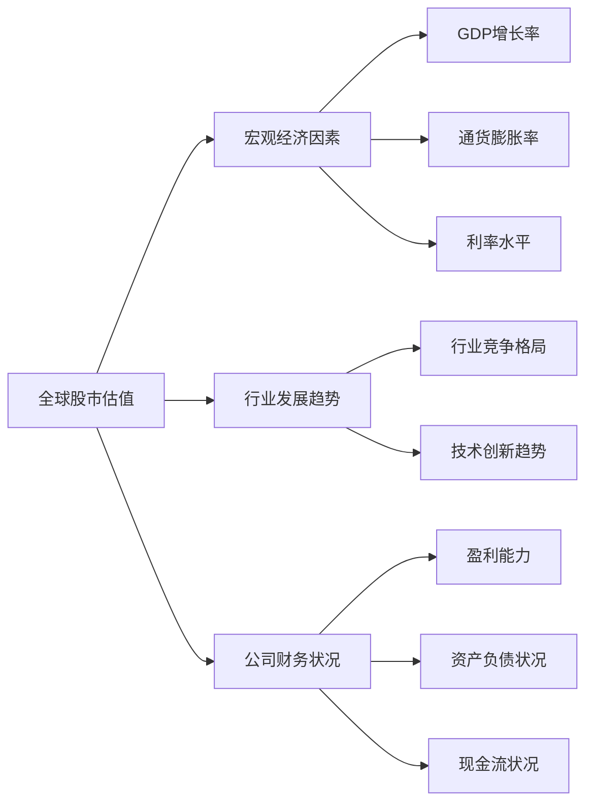
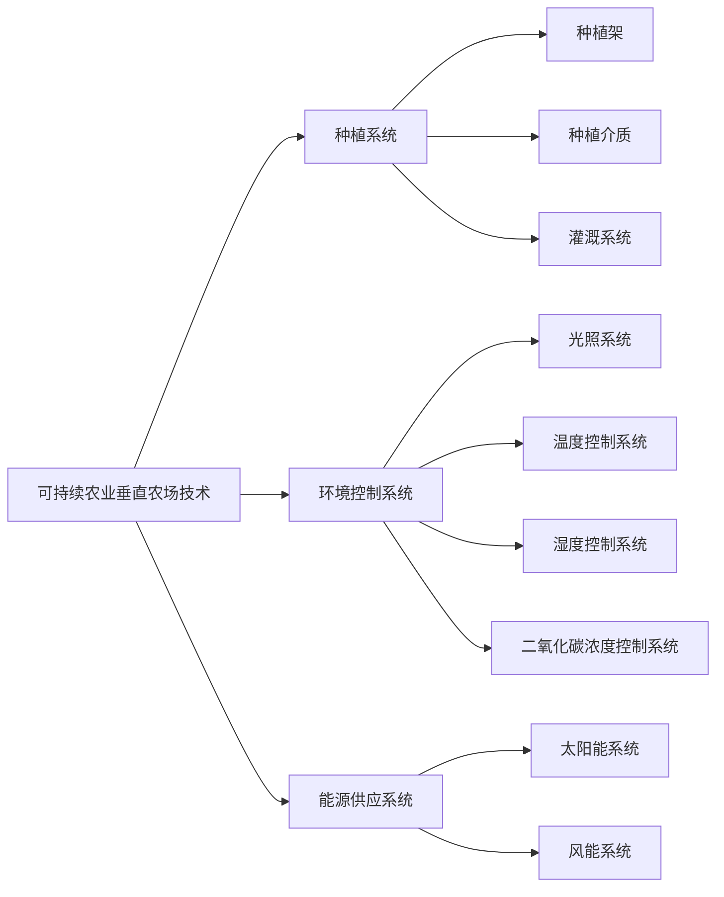

# 全球股市估值与可持续农业垂直农场技术的关系

> 关键词：全球股市估值、可持续农业、垂直农场技术、市场关联、投资趋势

> 摘要：本文深入探讨了全球股市估值与可持续农业垂直农场技术之间的关系。首先介绍了研究的背景、目的、预期读者和文档结构等内容。接着阐述了核心概念，包括全球股市估值和可持续农业垂直农场技术的原理及架构，并给出了相应的示意图和流程图。详细讲解了相关的核心算法原理，用Python代码进行了说明，还介绍了涉及的数学模型和公式。通过项目实战案例，展示了代码实现和解读。分析了该技术在实际中的应用场景，推荐了学习资源、开发工具框架和相关论文著作。最后总结了未来发展趋势与挑战，提供了常见问题解答和扩展阅读参考资料，旨在为投资者、农业从业者和技术研究者等提供全面的参考。

## 1. 背景介绍 
### 1.1 目的和范围
本研究的主要目的是探究全球股市估值与可持续农业垂直农场技术之间的内在联系。通过分析两者之间的关系，为投资者、农业从业者和政策制定者提供决策依据。具体范围包括全球主要股票市场的估值指标，如市盈率、市净率等，以及可持续农业垂直农场技术的发展现状、趋势和影响因素。我们将研究不同地区、不同行业的股市表现与垂直农场技术的相关性，以揭示潜在的投资机会和市场风险。

### 1.2 预期读者
本文的预期读者包括但不限于以下几类人群：
- 投资者：希望了解可持续农业垂直农场技术对股市的影响，以便做出更明智的投资决策。
- 农业从业者：关注垂直农场技术的发展趋势，以及如何通过资本市场获取资金支持和拓展业务。
- 政策制定者：需要了解股市与农业技术创新之间的关系，制定相关政策促进可持续农业的发展。
- 学术研究者：对跨领域的研究感兴趣，希望深入探讨股市估值与农业技术之间的理论和实证关系。

### 1.3 文档结构概述
本文将按照以下结构进行组织：
- 核心概念与联系：介绍全球股市估值和可持续农业垂直农场技术的核心概念，以及它们之间的联系。
- 核心算法原理 & 具体操作步骤：阐述用于分析两者关系的核心算法原理，并给出具体的操作步骤。
- 数学模型和公式 & 详细讲解 & 举例说明：介绍相关的数学模型和公式，并通过具体例子进行详细讲解。
- 项目实战：代码实际案例和详细解释说明：通过实际项目案例，展示如何运用相关技术和算法进行分析。
- 实际应用场景：分析全球股市估值与可持续农业垂直农场技术关系在实际中的应用场景。
- 工具和资源推荐：推荐学习资源、开发工具框架和相关论文著作。
- 总结：未来发展趋势与挑战：总结研究成果，展望未来发展趋势，并分析可能面临的挑战。
- 附录：常见问题与解答：提供常见问题的解答，帮助读者更好地理解文章内容。
- 扩展阅读 & 参考资料：提供扩展阅读的建议和相关参考资料。

### 1.4 术语表
#### 1.4.1 核心术语定义
- 全球股市估值：指对全球范围内股票市场的整体价值进行评估的过程和结果，常用的估值指标包括市盈率（P/E）、市净率（P/B）等。
- 可持续农业：指在满足当代人对农产品需求的同时，不损害后代人满足其需求能力的农业生产方式，强调生态、经济和社会的可持续性。
- 垂直农场技术：一种在垂直空间上进行农业生产的技术，通过多层种植和环境控制，实现高效、可持续的农业生产。

#### 1.4.2 相关概念解释
- 市盈率（P/E）：是指股票价格与每股收益的比率，反映了投资者为获取每一元收益所愿意支付的价格。
- 市净率（P/B）：是指股票价格与每股净资产的比率，反映了股票的市场价值与账面价值之间的关系。
- 环境控制：在垂直农场中，通过调节光照、温度、湿度、二氧化碳浓度等环境因素，为植物生长创造最优条件。

#### 1.4.3 缩略词列表
- P/E：市盈率（Price-to-Earnings Ratio）
- P/B：市净率（Price-to-Book Ratio）
- LED：发光二极管（Light Emitting Diode）

## 2. 核心概念与联系 

### 全球股市估值的原理和架构
全球股市估值是一个复杂的过程，涉及到多个因素的综合考虑。其基本原理是通过对股票市场中各个上市公司的财务状况、盈利能力、发展前景等进行评估，从而确定整个股票市场的价值。常见的估值方法包括相对估值法和绝对估值法。

相对估值法是通过比较同行业或类似公司的估值指标，如市盈率、市净率等，来评估目标公司的价值。例如，如果某行业的平均市盈率为20倍，而某家公司的市盈率为15倍，则该公司可能被认为是低估的。

绝对估值法是通过对公司未来的现金流进行折现，来计算公司的内在价值。常用的绝对估值模型包括股息折现模型（DDM）和自由现金流折现模型（FCFF）。

以下是全球股市估值的架构示意图：



### 可持续农业垂直农场技术的原理和架构
可持续农业垂直农场技术的核心原理是在有限的空间内，通过多层种植和环境控制，实现高效、可持续的农业生产。其主要架构包括种植系统、环境控制系统和能源供应系统。

种植系统是垂直农场的核心部分，包括种植架、种植介质和灌溉系统等。种植架通常采用多层结构，以提高空间利用率。种植介质可以是土壤、水培或气培等，根据不同的作物需求进行选择。灌溉系统则负责为植物提供水分和养分。

环境控制系统用于调节垂直农场内的光照、温度、湿度、二氧化碳浓度等环境因素，为植物生长创造最优条件。光照系统通常采用LED灯，具有节能、高效的特点。温度和湿度控制系统可以通过空调、加湿器和除湿器等设备进行调节。二氧化碳浓度控制系统则可以通过增加或减少二氧化碳的供应来调节植物的光合作用。

能源供应系统为垂直农场提供所需的能源，包括电力、热能和光能等。为了实现可持续发展，垂直农场通常采用可再生能源，如太阳能、风能等。

以下是可持续农业垂直农场技术的架构示意图：



### 全球股市估值与可持续农业垂直农场技术的联系
全球股市估值与可持续农业垂直农场技术之间存在着密切的联系。一方面，可持续农业垂直农场技术的发展会影响相关上市公司的业绩和前景，从而影响股市估值。例如，随着垂直农场技术的不断进步，相关企业的生产成本可能会降低，产量和质量可能会提高，从而提高企业的盈利能力和市场竞争力，进而推动股价上涨。

另一方面，全球股市估值的变化也会影响可持续农业垂直农场技术的发展。如果股市估值上升，相关企业的融资成本可能会降低，从而更容易获得资金支持，加大对垂直农场技术的研发和推广投入。反之，如果股市估值下降，企业的融资难度可能会增加，从而影响垂直农场技术的发展速度。

## 3. 核心算法原理 & 具体操作步骤 

### 核心算法原理
为了分析全球股市估值与可持续农业垂直农场技术之间的关系，我们可以采用多元线性回归模型。多元线性回归模型是一种用于分析多个自变量与一个因变量之间线性关系的统计方法。在本研究中，我们将全球股市估值作为因变量，将可持续农业垂直农场技术的发展指标作为自变量。

多元线性回归模型的一般形式为：

$$Y = \beta_0 + \beta_1X_1 + \beta_2X_2 + \cdots + \beta_nX_n + \epsilon$$

其中，$Y$ 是因变量，即全球股市估值；$X_1, X_2, \cdots, X_n$ 是自变量，即可持续农业垂直农场技术的发展指标；$\beta_0, \beta_1, \beta_2, \cdots, \beta_n$ 是回归系数；$\epsilon$ 是误差项。

### 具体操作步骤
以下是使用Python实现多元线性回归模型的具体操作步骤：

```python
import pandas as pd
import numpy as np
from sklearn.linear_model import LinearRegression
from sklearn.model_selection import train_test_split
from sklearn.metrics import mean_squared_error

# 步骤1：数据准备
# 假设我们已经有了全球股市估值和可持续农业垂直农场技术发展指标的数据
# 数据存储在一个CSV文件中，第一列是全球股市估值，其余列是可持续农业垂直农场技术发展指标
data = pd.read_csv('data.csv')
X = data.iloc[:, 1:]  # 自变量
y = data.iloc[:, 0]   # 因变量

# 步骤2：数据划分
# 将数据划分为训练集和测试集，比例为80%训练集，20%测试集
X_train, X_test, y_train, y_test = train_test_split(X, y, test_size=0.2, random_state=42)

# 步骤3：模型训练
# 创建线性回归模型
model = LinearRegression()
# 训练模型
model.fit(X_train, y_train)

# 步骤4：模型预测
# 在测试集上进行预测
y_pred = model.predict(X_test)

# 步骤5：模型评估
# 计算均方误差
mse = mean_squared_error(y_test, y_pred)
print(f"均方误差: {mse}")

# 步骤6：查看回归系数
print(f"回归系数: {model.coef_}")
print(f"截距: {model.intercept_}")
```

### 代码解释
- 数据准备：使用 `pandas` 库读取存储在CSV文件中的数据，并将自变量和因变量分别存储在 `X` 和 `y` 中。
- 数据划分：使用 `sklearn` 库的 `train_test_split` 函数将数据划分为训练集和测试集。
- 模型训练：使用 `sklearn` 库的 `LinearRegression` 类创建线性回归模型，并使用训练集数据进行训练。
- 模型预测：使用训练好的模型在测试集上进行预测。
- 模型评估：使用 `sklearn` 库的 `mean_squared_error` 函数计算预测结果的均方误差，评估模型的性能。
- 查看回归系数：通过模型的 `coef_` 属性和 `intercept_` 属性查看回归系数和截距。

## 4. 数学模型和公式 & 详细讲解 & 举例说明 

### 多元线性回归模型的数学推导
多元线性回归模型的目标是找到一组回归系数 $\beta_0, \beta_1, \beta_2, \cdots, \beta_n$，使得预测值与真实值之间的误差平方和最小。误差平方和的表达式为：

$$S(\beta) = \sum_{i=1}^{m}(y_i - \hat{y}_i)^2 = \sum_{i=1}^{m}(y_i - \beta_0 - \beta_1x_{i1} - \beta_2x_{i2} - \cdots - \beta_nx_{in})^2$$

其中，$m$ 是样本数量，$y_i$ 是第 $i$ 个样本的真实值，$\hat{y}_i$ 是第 $i$ 个样本的预测值，$x_{i1}, x_{i2}, \cdots, x_{in}$ 是第 $i$ 个样本的自变量值。

为了找到使 $S(\beta)$ 最小的回归系数，我们可以对 $S(\beta)$ 分别求关于 $\beta_0, \beta_1, \beta_2, \cdots, \beta_n$ 的偏导数，并令其等于0，得到一组正规方程：

$$\begin{cases}
\frac{\partial S(\beta)}{\partial \beta_0} = -2\sum_{i=1}^{m}(y_i - \beta_0 - \beta_1x_{i1} - \beta_2x_{i2} - \cdots - \beta_nx_{in}) = 0 \\
\frac{\partial S(\beta)}{\partial \beta_1} = -2\sum_{i=1}^{m}(y_i - \beta_0 - \beta_1x_{i1} - \beta_2x_{i2} - \cdots - \beta_nx_{in})x_{i1} = 0 \\
\frac{\partial S(\beta)}{\partial \beta_2} = -2\sum_{i=1}^{m}(y_i - \beta_0 - \beta_1x_{i1} - \beta_2x_{i2} - \cdots - \beta_nx_{in})x_{i2} = 0 \\
\cdots \\
\frac{\partial S(\beta)}{\partial \beta_n} = -2\sum_{i=1}^{m}(y_i - \beta_0 - \beta_1x_{i1} - \beta_2x_{i2} - \cdots - \beta_nx_{in})x_{in} = 0
\end{cases}$$

解这个正规方程组，就可以得到回归系数 $\beta_0, \beta_1, \beta_2, \cdots, \beta_n$ 的最优解。

### 举例说明
假设我们有以下数据：

| 全球股市估值 ($Y$) | 垂直农场技术研发投入 ($X_1$) | 垂直农场种植面积 ($X_2$) |
| --- | --- | --- |
| 100 | 10 | 20 |
| 120 | 15 | 25 |
| 130 | 20 | 30 |
| 150 | 25 | 35 |
| 160 | 30 | 40 |

我们可以使用上述的多元线性回归模型来分析全球股市估值与垂直农场技术研发投入和种植面积之间的关系。

```python
import numpy as np
from sklearn.linear_model import LinearRegression

# 数据准备
X = np.array([[10, 20], [15, 25], [20, 30], [25, 35], [30, 40]])
y = np.array([100, 120, 130, 150, 160])

# 创建线性回归模型
model = LinearRegression()
# 训练模型
model.fit(X, y)

# 查看回归系数
print(f"回归系数: {model.coef_}")
print(f"截距: {model.intercept_}")

# 预测新数据
new_X = np.array([[35, 45]])
prediction = model.predict(new_X)
print(f"预测值: {prediction}")
```

在这个例子中，我们通过多元线性回归模型得到了回归系数和截距，并且可以使用模型对新的数据进行预测。

## 5. 项目实战：代码实际案例和详细解释说明 

### 5.1  开发环境搭建
为了运行本项目的代码，我们需要搭建以下开发环境：
- Python 3.x：建议使用 Python 3.7 及以上版本。
- 开发工具：可以使用 Jupyter Notebook、PyCharm 等开发工具。
- 相关库：需要安装 `pandas`、`numpy`、`sklearn` 等库。可以使用以下命令进行安装：

```bash
pip install pandas numpy scikit-learn
```

### 5.2  源代码详细实现和代码解读
以下是一个完整的项目实战代码示例，用于分析全球股市估值与可持续农业垂直农场技术之间的关系：

```python
import pandas as pd
import numpy as np
from sklearn.linear_model import LinearRegression
from sklearn.model_selection import train_test_split
from sklearn.metrics import mean_squared_error
import matplotlib.pyplot as plt

# 步骤1：数据准备
# 假设我们已经有了全球股市估值和可持续农业垂直农场技术发展指标的数据
# 数据存储在一个CSV文件中，第一列是全球股市估值，其余列是可持续农业垂直农场技术发展指标
data = pd.read_csv('data.csv')
X = data.iloc[:, 1:]  # 自变量
y = data.iloc[:, 0]   # 因变量

# 步骤2：数据划分
# 将数据划分为训练集和测试集，比例为80%训练集，20%测试集
X_train, X_test, y_train, y_test = train_test_split(X, y, test_size=0.2, random_state=42)

# 步骤3：模型训练
# 创建线性回归模型
model = LinearRegression()
# 训练模型
model.fit(X_train, y_train)

# 步骤4：模型预测
# 在测试集上进行预测
y_pred = model.predict(X_test)

# 步骤5：模型评估
# 计算均方误差
mse = mean_squared_error(y_test, y_pred)
print(f"均方误差: {mse}")

# 步骤6：查看回归系数
print(f"回归系数: {model.coef_}")
print(f"截距: {model.intercept_}")

# 步骤7：可视化结果
plt.scatter(y_test, y_pred)
plt.xlabel('真实值')
plt.ylabel('预测值')
plt.title('真实值 vs 预测值')
plt.show()
```

### 代码解读与分析
- 数据准备：使用 `pandas` 库读取存储在CSV文件中的数据，并将自变量和因变量分别存储在 `X` 和 `y` 中。
- 数据划分：使用 `sklearn` 库的 `train_test_split` 函数将数据划分为训练集和测试集，比例为80%训练集，20%测试集。
- 模型训练：使用 `sklearn` 库的 `LinearRegression` 类创建线性回归模型，并使用训练集数据进行训练。
- 模型预测：使用训练好的模型在测试集上进行预测。
- 模型评估：使用 `sklearn` 库的 `mean_squared_error` 函数计算预测结果的均方误差，评估模型的性能。
- 查看回归系数：通过模型的 `coef_` 属性和 `intercept_` 属性查看回归系数和截距。
- 可视化结果：使用 `matplotlib` 库绘制真实值与预测值的散点图，直观地展示模型的预测效果。

## 6. 实际应用场景 
### 投资决策
投资者可以通过分析全球股市估值与可持续农业垂直农场技术之间的关系，来制定投资策略。如果发现可持续农业垂直农场技术的发展对股市估值有积极的影响，投资者可以考虑增加对相关上市公司的投资。例如，如果某家公司在垂直农场技术研发和应用方面具有领先优势，且股市估值相对较低，那么该公司可能具有投资价值。

### 农业企业战略规划
农业企业可以根据股市估值的变化来调整自身的战略规划。如果股市估值上升，企业可以考虑通过股权融资等方式获取资金，加大对垂直农场技术的研发和推广投入，扩大生产规模。反之，如果股市估值下降，企业可以采取保守的战略，控制成本，提高运营效率。

### 政策制定
政策制定者可以通过研究全球股市估值与可持续农业垂直农场技术之间的关系，制定相关政策促进可持续农业的发展。例如，政府可以出台税收优惠政策、补贴政策等，鼓励企业加大对垂直农场技术的研发和应用，提高农业的可持续发展能力。同时，政府也可以通过监管措施，引导资本市场对可持续农业领域的投资，促进股市估值与农业技术创新的良性互动。

## 7. 工具和资源推荐
### 7.1 学习资源推荐
#### 7.1.1 书籍推荐
- 《计量经济学导论》：介绍了计量经济学的基本理论和方法，对于理解多元线性回归模型等统计方法有很大帮助。
- 《机器学习实战》：通过实际案例介绍了机器学习的各种算法和应用，对于使用Python进行数据分析和建模有很好的指导作用。
- 《农业可持续发展概论》：系统地介绍了农业可持续发展的概念、理论和实践，有助于了解可持续农业的发展趋势和技术需求。

#### 7.1.2 在线课程
- Coursera上的“计量经济学基础”课程：由知名教授授课，讲解了计量经济学的基本概念和方法。
- edX上的“机器学习入门”课程：提供了机器学习的基础知识和实践操作，适合初学者学习。
- 中国大学MOOC上的“可持续农业技术”课程：介绍了可持续农业的相关技术和应用，对于了解垂直农场技术有很大帮助。

#### 7.1.3 技术博客和网站
- 博客园：有很多技术开发者分享的数据分析和机器学习相关的文章，对于学习和实践有很大的参考价值。
- 知乎：有很多关于股市投资、农业技术等方面的讨论和分享，可以获取到不同的观点和信息。
- Kaggle：一个数据科学竞赛平台，上面有很多关于数据分析和建模的案例和代码，可以学习到先进的技术和方法。

### 7.2 开发工具框架推荐
#### 7.2.1 IDE和编辑器
- Jupyter Notebook：一个交互式的开发环境，适合进行数据分析和模型实验，可以实时查看代码运行结果。
- PyCharm：一款专业的Python集成开发环境，提供了丰富的代码编辑、调试和管理功能。
- Visual Studio Code：一款轻量级的代码编辑器，支持多种编程语言，有很多实用的插件可以扩展功能。

#### 7.2.2 调试和性能分析工具
- Py-Spy：一个用于分析Python程序性能的工具，可以查看函数调用时间、CPU使用率等信息。
- IPython：一个增强版的Python交互式解释器，提供了强大的调试功能，如断点调试、变量查看等。
- Memory Profiler：一个用于分析Python程序内存使用情况的工具，可以帮助发现内存泄漏等问题。

#### 7.2.3 相关框架和库
- Pandas：一个用于数据处理和分析的Python库，提供了高效的数据结构和数据操作方法。
- NumPy：一个用于科学计算的Python库，提供了多维数组和数学函数等功能。
- Scikit-learn：一个用于机器学习的Python库，提供了各种机器学习算法和工具，如分类、回归、聚类等。

### 7.3 相关论文著作推荐
#### 7.3.1 经典论文
- “A Contribution to the Theory of Economic Growth” by Robert M. Solow：该论文提出了新古典增长模型，对于理解经济增长和股市估值的关系有重要意义。
- “The Capital Asset Pricing Model: Theory and Evidence” by Eugene F. Fama and Kenneth R. French：该论文介绍了资本资产定价模型，是金融领域的经典论文之一。
- “Vertical Farming: A Solution for Sustainable Urban Agriculture?” by Dickson Despommier：该论文探讨了垂直农场技术在可持续城市农业中的应用前景和挑战。

#### 7.3.2 最新研究成果
- 可以通过学术数据库，如IEEE Xplore、ACM Digital Library、ScienceDirect等，搜索关于全球股市估值与可持续农业垂直农场技术关系的最新研究成果。

#### 7.3.3 应用案例分析
- 可以参考一些商业杂志和财经媒体的报道，了解可持续农业垂直农场技术在实际应用中的案例和经验教训，如《哈佛商业评论》、《财经》等。

## 8. 总结：未来发展趋势与挑战
### 未来发展趋势
- 技术创新加速：随着科技的不断进步，可持续农业垂直农场技术将不断创新和完善。例如，新型的光照技术、环境控制技术和种植技术将不断涌现，提高垂直农场的生产效率和质量。
- 市场需求增长：随着人们对食品安全和可持续发展的关注度不断提高，对可持续农业产品的需求将不断增长。这将推动垂直农场技术的市场需求，促进相关企业的发展。
- 产业融合加深：可持续农业垂直农场技术将与其他产业，如信息技术、能源技术等深度融合。例如，通过物联网技术实现垂直农场的智能化管理，通过可再生能源技术解决垂直农场的能源供应问题。

### 挑战
- 技术成本较高：目前，可持续农业垂直农场技术的成本仍然较高，包括设备投资、能源消耗等方面。这限制了该技术的大规模推广和应用。
- 市场认知不足：由于可持续农业垂直农场技术是一种新兴技术，市场对其认知度和接受度还不够高。消费者对垂直农场产品的品质和安全性存在疑虑，这也影响了该技术的市场发展。
- 政策支持不够：虽然一些国家和地区已经出台了相关政策支持可持续农业的发展，但对于垂直农场技术的政策支持还不够完善。缺乏有效的政策引导和扶持，将影响企业的研发和推广积极性。

## 9. 附录：常见问题与解答
### 问题1：多元线性回归模型的假设条件有哪些？
答：多元线性回归模型的假设条件包括：
- 线性关系：自变量与因变量之间存在线性关系。
- 独立性：观测值之间相互独立。
- 同方差性：误差项的方差在所有观测值中是恒定的。
- 正态性：误差项服从正态分布。

### 问题2：如何判断多元线性回归模型的拟合效果？
答：可以通过以下指标来判断多元线性回归模型的拟合效果：
- 决定系数 ($R^2$)：表示模型对数据的拟合程度，取值范围在0到1之间，越接近1表示拟合效果越好。
- 均方误差 (MSE)：表示预测值与真实值之间的平均误差平方，值越小表示拟合效果越好。
- 残差分析：通过分析残差的分布情况，判断模型是否满足假设条件。

### 问题3：可持续农业垂直农场技术的发展对环境有哪些影响？
答：可持续农业垂直农场技术的发展对环境有以下积极影响：
- 节约土地资源：垂直农场可以在有限的空间内进行农业生产，减少对土地的需求。
- 节约水资源：垂直农场采用精准灌溉技术，可以大大减少水资源的浪费。
- 减少农药使用：垂直农场的封闭环境可以有效减少病虫害的发生，从而减少农药的使用。

## 10. 扩展阅读 & 参考资料
### 扩展阅读
- 《智能农业：从理论到实践》：介绍了智能农业的概念、技术和应用，对于了解农业领域的新技术有很大帮助。
- 《金融市场与金融机构》：系统地介绍了金融市场和金融机构的基本知识，对于理解股市估值和投资决策有重要意义。
- 《创新者的窘境》：探讨了企业在面对技术创新时的挑战和机遇，对于农业企业的战略规划有一定的启示作用。

### 参考资料
- 相关学术论文和研究报告：可以通过学术数据库和专业网站查找关于全球股市估值与可持续农业垂直农场技术关系的学术论文和研究报告。
- 行业统计数据：可以参考国际组织、政府部门和行业协会发布的关于股市估值、农业生产等方面的统计数据。
- 企业年报和公告：可以查看相关上市公司的年报和公告，了解企业的经营状况和发展战略。

作者：AI天才研究院/AI Genius Institute & 禅与计算机程序设计艺术 /Zen And The Art of Computer Programming