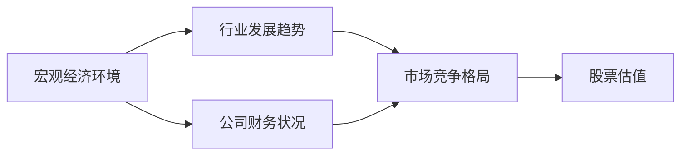
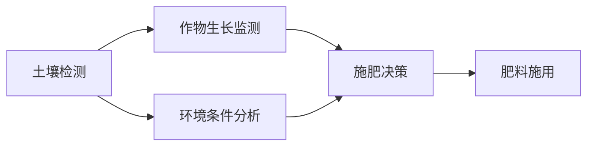

# 全球股市估值与可持续农业精准施肥技术的关系

> 关键词：全球股市估值、可持续农业、精准施肥技术、经济影响、农业发展、市场关联、环境效益

> 摘要：本文旨在深入探讨全球股市估值与可持续农业精准施肥技术之间的关系。通过对相关核心概念的阐述、算法原理的分析、数学模型的构建以及项目实战案例的研究，揭示两者之间潜在的联系和相互影响。同时，分析实际应用场景，推荐相关工具和资源，总结未来发展趋势与挑战，为进一步的研究和实践提供参考。

## 1. 背景介绍 
### 1.1 目的和范围
本研究的目的在于全面探究全球股市估值与可持续农业精准施肥技术之间的内在联系。全球股市估值反映了金融市场对各类企业和行业的预期和评价，而可持续农业精准施肥技术则是农业领域实现高效、环保和可持续发展的关键手段。研究范围涵盖了全球股市的主要板块和农业领域中精准施肥技术的各个环节，包括技术原理、应用实践、经济影响等方面。

### 1.2 预期读者
本文预期读者包括金融领域的投资者、分析师、研究人员，农业领域的科研人员、从业者，以及对经济与农业交叉领域感兴趣的学者和爱好者。通过阅读本文，读者可以了解到全球股市与可持续农业精准施肥技术之间的关联，为投资决策、农业发展规划和学术研究提供有价值的参考。

### 1.3 文档结构概述
本文共分为十个部分。首先介绍背景信息，包括目的、预期读者和文档结构概述等。接着阐述核心概念与联系，分析核心算法原理和具体操作步骤，构建数学模型并进行详细讲解和举例说明。然后通过项目实战展示代码实际案例和详细解释。随后探讨实际应用场景，推荐相关工具和资源。最后总结未来发展趋势与挑战，提供常见问题与解答和扩展阅读及参考资料。

### 1.4 术语表
#### 1.4.1 核心术语定义
- **全球股市估值**：指对全球范围内股票市场中各类股票价值的评估，通常基于公司的财务状况、盈利能力、市场前景等因素进行综合判断。
- **可持续农业**：是一种能够满足当代人对农产品需求，同时不损害后代人满足其需求能力的农业生产方式，强调生态、经济和社会的可持续性。
- **精准施肥技术**：根据土壤肥力、作物需求和环境条件等因素，精确地确定肥料的种类、用量和施用时间，以提高肥料利用效率，减少环境污染的农业技术。

#### 1.4.2 相关概念解释
- **金融市场**：是资金融通的场所，包括股票市场、债券市场、外汇市场等，是经济活动的重要组成部分。
- **农业生产效率**：指农业生产过程中投入与产出的比率，反映了农业生产的效益和水平。
- **环境效益**：指人类活动对环境产生的有益影响，如减少污染、保护生态等。

#### 1.4.3 缩略词列表
- **GDP**：国内生产总值（Gross Domestic Product）
- **GIS**：地理信息系统（Geographic Information System）
- **GPS**：全球定位系统（Global Positioning System）

## 2. 核心概念与联系 

### 2.1 全球股市估值的原理和架构
全球股市估值是一个复杂的过程，涉及多个因素和方法。其基本原理是通过对公司的财务报表、市场数据、行业趋势等进行分析，评估公司的内在价值和市场前景，从而确定股票的合理价格。常见的估值方法包括市盈率法、市净率法、现金流折现法等。

全球股市估值的架构可以用以下示意图表示：



### 2.2 可持续农业精准施肥技术的原理和架构
可持续农业精准施肥技术的核心原理是根据土壤肥力、作物需求和环境条件等因素，精确地确定肥料的种类、用量和施用时间，以实现农业生产的高效、环保和可持续发展。该技术通常包括土壤检测、作物生长监测、施肥决策和肥料施用等环节。

可持续农业精准施肥技术的架构可以用以下示意图表示：



### 2.3 两者之间的联系
全球股市估值与可持续农业精准施肥技术之间存在着多方面的联系。一方面，可持续农业精准施肥技术的发展和应用可以提高农业生产效率，增加农产品产量和质量，从而对相关农业企业的盈利能力产生积极影响，进而影响全球股市中农业板块的估值。另一方面，全球股市的走势和投资者的预期也会影响农业企业的融资能力和发展战略，从而对可持续农业精准施肥技术的研发和推广产生影响。

两者之间的联系可以用以下示意图表示：


## 3. 核心算法原理 & 具体操作步骤 

### 3.1 全球股市估值算法原理
以现金流折现法为例，该算法的基本原理是将公司未来的现金流按照一定的折现率折现到当前，从而得到公司的内在价值。具体步骤如下：
1. 预测公司未来的现金流：根据公司的历史财务数据、行业发展趋势和市场前景等因素，预测公司未来若干年的自由现金流。
2. 确定折现率：折现率反映了投资者对公司未来现金流的风险预期，通常根据市场利率、公司的风险水平等因素确定。
3. 计算现值：将预测的未来现金流按照折现率折现到当前，得到公司的内在价值。

以下是用 Python 实现现金流折现法的示例代码：

```python
def discounted_cash_flow(free_cash_flows, discount_rate):
    present_value = 0
    for i, cash_flow in enumerate(free_cash_flows):
        present_value += cash_flow / (1 + discount_rate) ** (i + 1)
    return present_value

# 示例数据
free_cash_flows = [100, 120, 150, 180, 200]
discount_rate = 0.1

# 计算现值
intrinsic_value = discounted_cash_flow(free_cash_flows, discount_rate)
print("公司的内在价值为:", intrinsic_value)
```

### 3.2 可持续农业精准施肥技术算法原理
以基于土壤养分平衡的施肥决策算法为例，该算法的基本原理是根据土壤养分含量、作物养分需求和肥料养分利用率等因素，计算出合理的肥料施用量。具体步骤如下：
1. 土壤检测：采集土壤样本，分析土壤中的养分含量，如氮、磷、钾等。
2. 确定作物养分需求：根据作物的品种、生长阶段和产量目标，确定作物对各种养分的需求量。
3. 计算肥料施用量：根据土壤养分含量、作物养分需求和肥料养分利用率等因素，计算出合理的肥料施用量。

以下是用 Python 实现基于土壤养分平衡的施肥决策算法的示例代码：

```python
def fertilization_decision(soil_n, soil_p, soil_k, crop_n_demand, crop_p_demand, crop_k_demand, fertilizer_n_efficiency, fertilizer_p_efficiency, fertilizer_k_efficiency):
    n_fertilizer_needed = (crop_n_demand - soil_n) / fertilizer_n_efficiency
    p_fertilizer_needed = (crop_p_demand - soil_p) / fertilizer_p_efficiency
    k_fertilizer_needed = (crop_k_demand - soil_k) / fertilizer_k_efficiency
    return n_fertilizer_needed, p_fertilizer_needed, k_fertilizer_needed

# 示例数据
soil_n = 50
soil_p = 30
soil_k = 40
crop_n_demand = 100
crop_p_demand = 60
crop_k_demand = 80
fertilizer_n_efficiency = 0.8
fertilizer_p_efficiency = 0.7
fertilizer_k_efficiency = 0.8

# 计算肥料施用量
n_fertilizer, p_fertilizer, k_fertilizer = fertilization_decision(soil_n, soil_p, soil_k, crop_n_demand, crop_p_demand, crop_k_demand, fertilizer_n_efficiency, fertilizer_p_efficiency, fertilizer_k_efficiency)
print("氮肥施用量为:", n_fertilizer)
print("磷肥施用量为:", p_fertilizer)
print("钾肥施用量为:", k_fertilizer)
```

### 3.3 两者之间联系的算法实现
为了实现全球股市估值与可持续农业精准施肥技术之间联系的算法，我们可以构建一个综合模型，将两者的因素纳入考虑。具体步骤如下：
1. 建立农业企业的财务模型：根据农业企业的生产规模、成本结构、市场价格等因素，建立农业企业的财务模型，预测其未来的现金流。
2. 考虑可持续农业精准施肥技术的影响：将可持续农业精准施肥技术对农业生产效率、成本和环境效益的影响纳入财务模型，调整农业企业的未来现金流预测。
3. 计算全球股市中农业板块的估值：根据调整后的农业企业未来现金流预测，使用现金流折现法等估值方法，计算全球股市中农业板块的估值。

以下是一个简化的示例代码：

```python
# 农业企业财务模型
def agricultural_enterprise_financial_model(production_scale, cost_structure, market_price, precision_fertilization_impact):
    revenue = production_scale * market_price
    cost = sum(cost_structure) * (1 - precision_fertilization_impact)
    profit = revenue - cost
    free_cash_flow = profit * 0.8  # 假设自由现金流为利润的 80%
    return free_cash_flow

# 全球股市中农业板块的估值
def agricultural_stock_valuation(free_cash_flows, discount_rate):
    intrinsic_value = discounted_cash_flow(free_cash_flows, discount_rate)
    return intrinsic_value

# 示例数据
production_scale = 1000
cost_structure = [500, 300, 200]
market_price = 2
precision_fertilization_impact = 0.2
discount_rate = 0.1
free_cash_flows = []

# 模拟未来 5 年的自由现金流
for i in range(5):
    free_cash_flow = agricultural_enterprise_financial_model(production_scale, cost_structure, market_price, precision_fertilization_impact)
    free_cash_flows.append(free_cash_flow)
    production_scale *= 1.1  # 假设生产规模每年增长 10%

# 计算全球股市中农业板块的估值
valuation = agricultural_stock_valuation(free_cash_flows, discount_rate)
print("全球股市中农业板块的估值为:", valuation)
```

## 4. 数学模型和公式 & 详细讲解 & 举例说明 

### 4.1 全球股市估值的数学模型和公式
现金流折现法的数学模型可以用以下公式表示：

$$V = \sum_{t=1}^{n} \frac{FCF_t}{(1 + r)^t}$$

其中，$V$ 表示公司的内在价值，$FCF_t$ 表示第 $t$ 年的自由现金流，$r$ 表示折现率，$n$ 表示预测的年数。

举例说明：假设某公司未来 5 年的自由现金流分别为 100 万元、120 万元、150 万元、180 万元和 200 万元，折现率为 10%，则该公司的内在价值为：

$$V = \frac{100}{(1 + 0.1)^1} + \frac{120}{(1 + 0.1)^2} + \frac{150}{(1 + 0.1)^3} + \frac{180}{(1 + 0.1)^4} + \frac{200}{(1 + 0.1)^5} \approx 579.46 \text{（万元）}$$

### 4.2 可持续农业精准施肥技术的数学模型和公式
基于土壤养分平衡的施肥决策算法的数学模型可以用以下公式表示：

$$F_i = \frac{C_i - S_i}{E_i}$$

其中，$F_i$ 表示第 $i$ 种肥料的施用量，$C_i$ 表示作物对第 $i$ 种养分的需求量，$S_i$ 表示土壤中第 $i$ 种养分的含量，$E_i$ 表示第 $i$ 种肥料的养分利用率。

举例说明：假设土壤中氮、磷、钾的含量分别为 50 千克/公顷、30 千克/公顷和 40 千克/公顷，作物对氮、磷、钾的需求量分别为 100 千克/公顷、60 千克/公顷和 80 千克/公顷，氮肥、磷肥、钾肥的养分利用率分别为 80%、70%和 80%，则氮肥、磷肥、钾肥的施用量分别为：

$$F_{N} = \frac{100 - 50}{0.8} = 62.5 \text{（千克/公顷）}$$
$$F_{P} = \frac{60 - 30}{0.7} \approx 42.86 \text{（千克/公顷）}$$
$$F_{K} = \frac{80 - 40}{0.8} = 50 \text{（千克/公顷）}$$

### 4.3 两者之间联系的数学模型和公式
为了建立全球股市估值与可持续农业精准施肥技术之间联系的数学模型，我们可以将可持续农业精准施肥技术对农业企业的影响纳入现金流折现法的模型中。假设可持续农业精准施肥技术对农业企业的成本降低率为 $\alpha$，则调整后的自由现金流可以表示为：

$$FCF_t' = FCF_t \times (1 - \alpha)$$

其中，$FCF_t'$ 表示调整后的第 $t$ 年的自由现金流，$FCF_t$ 表示未调整的第 $t$ 年的自由现金流。

调整后的公司内在价值可以表示为：

$$V' = \sum_{t=1}^{n} \frac{FCF_t'}{(1 + r)^t} = \sum_{t=1}^{n} \frac{FCF_t \times (1 - \alpha)}{(1 + r)^t}$$

举例说明：假设某公司未调整的未来 5 年的自由现金流分别为 100 万元、120 万元、150 万元、180 万元和 200 万元，折现率为 10%，可持续农业精准施肥技术对该公司的成本降低率为 20%，则调整后的公司内在价值为：

$$V' = \sum_{t=1}^{5} \frac{FCF_t \times (1 - 0.2)}{(1 + 0.1)^t} = \frac{100 \times 0.8}{(1 + 0.1)^1} + \frac{120 \times 0.8}{(1 + 0.1)^2} + \frac{150 \times 0.8}{(1 + 0.1)^3} + \frac{180 \times 0.8}{(1 + 0.1)^4} + \frac{200 \times 0.8}{(1 + 0.1)^5} \approx 463.57 \text{（万元）}$$

## 5. 项目实战：代码实际案例和详细解释说明 

### 5.1  开发环境搭建
本项目的开发环境主要包括 Python 编程语言和相关的库。以下是具体的搭建步骤：
1. 安装 Python：从 Python 官方网站（https://www.python.org/downloads/）下载并安装 Python 3.x 版本。
2. 安装必要的库：使用 pip 命令安装所需的库，如 numpy、pandas 等。

```bash
pip install numpy pandas
```

### 5.2  源代码详细实现和代码解读
以下是一个完整的项目实战代码示例，包括全球股市估值、可持续农业精准施肥技术和两者之间联系的实现：

```python
import numpy as np
import pandas as pd

# 全球股市估值 - 现金流折现法
def discounted_cash_flow(free_cash_flows, discount_rate):
    present_value = 0
    for i, cash_flow in enumerate(free_cash_flows):
        present_value += cash_flow / (1 + discount_rate) ** (i + 1)
    return present_value

# 可持续农业精准施肥技术 - 基于土壤养分平衡的施肥决策算法
def fertilization_decision(soil_n, soil_p, soil_k, crop_n_demand, crop_p_demand, crop_k_demand, fertilizer_n_efficiency, fertilizer_p_efficiency, fertilizer_k_efficiency):
    n_fertilizer_needed = (crop_n_demand - soil_n) / fertilizer_n_efficiency
    p_fertilizer_needed =