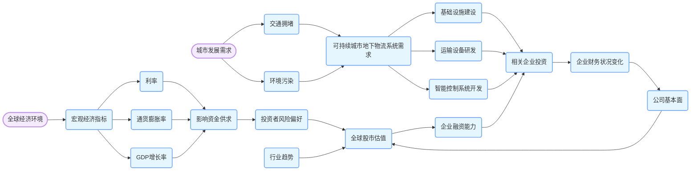

# 全球股市估值与可持续城市地下物流系统的关联

> 关键词：全球股市估值、可持续城市地下物流系统、经济影响、物流创新、市场趋势、基础设施建设、可持续发展

> 摘要：本文旨在深入探讨全球股市估值与可持续城市地下物流系统之间的关联。通过对两者核心概念、原理的剖析，结合数学模型、实际案例以及应用场景的分析，揭示它们相互影响的内在机制。同时，提供相关的工具和资源推荐，对未来发展趋势与挑战进行总结，为相关领域的研究和实践提供全面而深入的参考。

## 1. 背景介绍 
### 1.1 目的和范围
本研究的主要目的是全面分析全球股市估值与可持续城市地下物流系统之间的潜在联系。一方面，全球股市估值反映了金融市场对各类企业和行业的预期和评价，是经济运行的重要指标；另一方面，可持续城市地下物流系统作为新兴的物流模式，对城市的经济、环境和社会发展具有深远影响。研究将涵盖两者的基本概念、相互作用机制、实际应用案例以及未来发展趋势等方面，旨在为投资者、城市规划者和政策制定者提供有价值的决策依据。

### 1.2 预期读者
本文的预期读者包括金融领域的投资者、分析师、研究人员，城市规划与物流领域的专业人士，以及关注可持续发展和城市基础设施建设的政策制定者和学者。

### 1.3 文档结构概述
本文将首先介绍相关的背景知识和核心概念，包括全球股市估值的基本原理和可持续城市地下物流系统的架构。接着，详细阐述两者之间的关联机制，包括核心算法原理和数学模型。通过实际项目案例分析，进一步说明这种关联在实际中的体现。然后，探讨其实际应用场景，推荐相关的工具和资源。最后，总结未来发展趋势与挑战，并提供常见问题解答和扩展阅读参考资料。

### 1.4 术语表
#### 1.4.1 核心术语定义
- **全球股市估值**：指对全球范围内股票市场中各类股票价值的评估，通常基于公司的财务状况、盈利能力、市场前景等因素，采用多种估值方法进行计算。
- **可持续城市地下物流系统**：是一种在城市地下空间建设的，利用自动化技术和清洁能源，实现货物高效、环保运输的物流系统。

#### 1.4.2 相关概念解释
- **股市波动**：指股票市场价格在一定时期内的涨跌变化，受到宏观经济环境、公司业绩、政策法规等多种因素的影响。
- **物流效率**：指物流系统在单位时间内完成的货物运输量和服务质量，是衡量物流系统性能的重要指标。

#### 1.4.3 缩略词列表
- **GDP**：国内生产总值（Gross Domestic Product）
- **ROE**：净资产收益率（Return on Equity）
- **AGV**：自动导引车（Automated Guided Vehicle）

## 2. 核心概念与联系 
### 2.1 全球股市估值的核心概念
全球股市估值是金融市场中的重要环节，它基于多种因素对股票的内在价值进行评估。常见的估值方法包括市盈率法（P/E）、市净率法（P/B）、现金流折现法（DCF）等。市盈率法是通过将股票价格除以每股收益来计算，反映了市场对公司盈利能力的预期。市净率法则是将股票价格除以每股净资产，衡量了股票的相对估值水平。现金流折现法是通过预测公司未来的现金流，并将其折现到当前价值，以确定股票的内在价值。

### 2.2 可持续城市地下物流系统的核心概念
可持续城市地下物流系统是一种创新的物流解决方案，旨在解决城市地面交通拥堵、环境污染等问题。该系统通常包括地下隧道、自动化运输设备（如AGV）、货物存储设施和智能控制系统等组成部分。通过利用地下空间，实现货物的快速、高效、环保运输，减少对地面交通的依赖。

### 2.3 两者的联系
全球股市估值与可持续城市地下物流系统之间存在着密切的联系。一方面，可持续城市地下物流系统的建设和发展需要大量的资金投入，这将影响相关企业的财务状况和市场前景，进而影响其股票估值。另一方面，股市估值的变化也会影响企业的融资能力和投资决策，从而对可持续城市地下物流系统的发展产生影响。例如，如果股市对物流行业的预期较好，相关企业的股票估值上升，企业将更容易获得融资，从而加大对地下物流系统的投资。

### 2.4 核心概念原理和架构的文本示意图
全球股市估值受到宏观经济环境、公司基本面、行业趋势等多种因素的影响。宏观经济环境包括GDP增长率、通货膨胀率、利率等，这些因素会影响整个市场的资金供求和投资者的风险偏好。公司基本面包括财务状况、盈利能力、市场份额等，是股票估值的重要依据。行业趋势则反映了特定行业的发展前景和竞争格局。

可持续城市地下物流系统的架构包括基础设施层、运输设备层、控制管理层和应用服务层。基础设施层包括地下隧道、货物存储设施等；运输设备层包括AGV、输送带等自动化运输设备；控制管理层负责对整个系统的运行进行监控和调度；应用服务层则为用户提供货物运输、仓储、配送等服务。

### 2.5 Mermaid 流程图


## 3. 核心算法原理 & 具体操作步骤 
### 3.1 全球股市估值的核心算法原理
#### 3.1.1 市盈率法（P/E）
市盈率法是一种简单而常用的股票估值方法，其计算公式为：
```python
def pe_ratio(stock_price, earnings_per_share):
    """
    计算市盈率
    :param stock_price: 股票价格
    :param earnings_per_share: 每股收益
    :return: 市盈率
    """
    if earnings_per_share == 0:
        return None
    return stock_price / earnings_per_share
```
#### 3.1.2 市净率法（P/B）
市净率法通过比较股票价格和每股净资产来评估股票的估值，其计算公式为：
```python
def pb_ratio(stock_price, book_value_per_share):
    """
    计算市净率
    :param stock_price: 股票价格
    :param book_value_per_share: 每股净资产
    :return: 市净率
    """
    if book_value_per_share == 0:
        return None
    return stock_price / book_value_per_share
```
#### 3.1.3 现金流折现法（DCF）
现金流折现法是一种基于未来现金流预测的估值方法，其基本原理是将公司未来的现金流折现到当前价值。具体步骤如下：
1. 预测公司未来的自由现金流。
2. 确定折现率，通常采用加权平均资本成本（WACC）。
3. 将未来的自由现金流折现到当前价值。
4. 计算公司的内在价值。

```python
import numpy as np

def dcf_valuation(free_cash_flows, discount_rate):
    """
    现金流折现法估值
    :param free_cash_flows: 未来自由现金流列表
    :param discount_rate: 折现率
    :return: 公司内在价值
    """
    present_values = []
    for i, cash_flow in enumerate(free_cash_flows):
        present_value = cash_flow / (1 + discount_rate) ** (i + 1)
        present_values.append(present_value)
    return np.sum(present_values)
```

### 3.2 可持续城市地下物流系统的核心算法原理
#### 3.2.1 路径规划算法
路径规划算法是地下物流系统中的关键算法，其目的是为货物运输找到最优路径。常见的路径规划算法包括Dijkstra算法、A*算法等。以下是Dijkstra算法的Python实现：
```python
import heapq

def dijkstra(graph, start):
    """
    Dijkstra算法实现
    :param graph: 图的邻接表表示
    :param start: 起点
    :return: 最短路径距离字典
    """
    distances = {node: float('inf') for node in graph}
    distances[start] = 0
    priority_queue = [(0, start)]

    while priority_queue:
        current_distance, current_node = heapq.heappop(priority_queue)

        if current_distance > distances[current_node]:
            continue

        for neighbor, weight in graph[current_node].items():
            distance = current_distance + weight

            if distance < distances[neighbor]:
                distances[neighbor] = distance
                heapq.heappush(priority_queue, (distance, neighbor))

    return distances
```
#### 3.2.2 库存管理算法
库存管理算法用于优化地下物流系统中的货物存储和补货策略。常见的库存管理算法包括经济订货量（EOQ）模型、安全库存模型等。以下是经济订货量模型的Python实现：
```python
import math

def economic_order_quantity(demand_rate, ordering_cost, holding_cost):
    """
    经济订货量模型
    :param demand_rate: 需求率
    :param ordering_cost: 每次订货成本
    :param holding_cost: 单位货物持有成本
    :return: 经济订货量
    """
    return math.sqrt((2 * demand_rate * ordering_cost) / holding_cost)
```

### 3.3 具体操作步骤
#### 3.3.1 全球股市估值的操作步骤
1. 收集公司的财务数据，包括每股收益、每股净资产、自由现金流等。
2. 根据不同的估值方法，选择合适的参数。
3. 使用相应的算法计算股票的估值。
4. 分析估值结果，与市场价格进行比较，判断股票的投资价值。

#### 3.3.2 可持续城市地下物流系统的操作步骤
1. 进行城市需求分析，确定地下物流系统的规模和功能需求。
2. 设计地下物流系统的架构，包括基础设施、运输设备和控制系统。
3. 采用路径规划算法和库存管理算法，优化系统的运行效率。
4. 进行系统的建设和调试，确保系统的正常运行。

## 4. 数学模型和公式 & 详细讲解 & 举例说明 
### 4.1 全球股市估值的数学模型和公式
#### 4.1.1 市盈率法（P/E）
市盈率（P/E）的计算公式为：
$$P/E = \frac{股票价格}{每股收益}$$
市盈率反映了市场对公司盈利能力的预期。例如，某公司的股票价格为50元，每股收益为5元，则该公司的市盈率为：
$$P/E = \frac{50}{5} = 10$$
这意味着投资者愿意为该公司每1元的收益支付10元的价格。

#### 4.1.2 市净率法（P/B）
市净率（P/B）的计算公式为：
$$P/B = \frac{股票价格}{每股净资产}$$
市净率衡量了股票的相对估值水平。例如，某公司的股票价格为30元，每股净资产为10元，则该公司的市净率为：
$$P/B = \frac{30}{10} = 3$$
这表明该公司的股票价格是其每股净资产的3倍。

#### 4.1.3 现金流折现法（DCF）
现金流折现法的基本公式为：
$$V = \sum_{t=1}^{n} \frac{FCF_t}{(1 + r)^t}$$
其中，$V$ 表示公司的内在价值，$FCF_t$ 表示第 $t$ 期的自由现金流，$r$ 表示折现率，$n$ 表示预测期数。

例如，某公司未来3年的自由现金流分别为100万元、120万元和150万元，折现率为10%，则该公司的内在价值为：
$$V = \frac{100}{(1 + 0.1)^1} + \frac{120}{(1 + 0.1)^2} + \frac{150}{(1 + 0.1)^3} \approx 295.34$$（万元）

### 4.2 可持续城市地下物流系统的数学模型和公式
#### 4.2.1 路径规划算法（Dijkstra算法）
Dijkstra算法的核心思想是通过不断更新节点的最短路径距离，找到从起点到其他节点的最短路径。其数学模型可以表示为：
设图 $G = (V, E)$，其中 $V$ 是节点集合，$E$ 是边集合。对于每条边 $(u, v) \in E$，有一个权重 $w(u, v)$ 表示从节点 $u$ 到节点 $v$ 的距离。设 $d(s, v)$ 表示从起点 $s$ 到节点 $v$ 的最短路径距离。

初始化：$d(s, s) = 0$，对于 $v \neq s$，$d(s, v) = \infty$。

迭代更新：对于每个节点 $u$，如果 $d(s, u) + w(u, v) < d(s, v)$，则更新 $d(s, v) = d(s, u) + w(u, v)$。

#### 4.2.2 库存管理算法（经济订货量模型）
经济订货量（EOQ）模型的计算公式为：
$$EOQ = \sqrt{\frac{2DS}{H}}$$
其中，$D$ 表示年需求率，$S$ 表示每次订货成本，$H$ 表示单位货物的年持有成本。

例如，某企业的年需求率为1000件，每次订货成本为50元，单位货物的年持有成本为10元，则该企业的经济订货量为：
$$EOQ = \sqrt{\frac{2 \times 1000 \times 50}{10}} = 100$$（件）

## 5. 项目实战：代码实际案例和详细解释说明 
### 5.1  开发环境搭建
#### 5.1.1 安装Python
首先，需要安装Python开发环境。可以从Python官方网站（https://www.python.org/downloads/） 下载适合自己操作系统的Python版本，并按照安装向导进行安装。

#### 5.1.2 安装必要的库
在进行股市估值和地下物流系统算法实现时，可能需要使用一些Python库，如 `numpy`、`pandas` 等。可以使用以下命令进行安装：
```sh
pip install numpy pandas
```

### 5.2  源代码详细实现和代码解读
#### 5.2.1 全球股市估值案例
```python
import pandas as pd

# 模拟公司财务数据
data = {
    '股票价格': [50, 60, 70],
    '每股收益': [5, 6, 7],
    '每股净资产': [10, 12, 14]
}
df = pd.DataFrame(data)

# 计算市盈率和市净率
df['市盈率'] = df['股票价格'] / df['每股收益']
df['市净率'] = df['股票价格'] / df['每股净资产']

print(df)
```
代码解读：
1. 首先，使用 `pandas` 库创建一个包含股票价格、每股收益和每股净资产的DataFrame。
2. 然后，通过简单的除法运算计算市盈率和市净率，并将结果添加到DataFrame中。
3. 最后，打印出包含估值结果的DataFrame。

#### 5.2.2 可持续城市地下物流系统案例
```python
# 定义图的邻接表表示
graph = {
    'A': {'B': 1, 'C': 4},
    'B': {'A': 1, 'C': 2, 'D': 5},
    'C': {'A': 4, 'B': 2, 'D': 1},
    'D': {'B': 5, 'C': 1}
}

# 使用Dijkstra算法计算最短路径
start = 'A'
distances = dijkstra(graph, start)

print(distances)
```
代码解读：
1. 首先，定义一个图的邻接表表示，其中每个节点对应一个字典，字典的键是