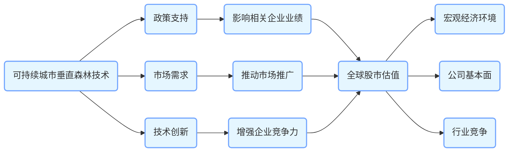

# 全球股市估值与可持续城市垂直森林技术的关系

> 关键词：全球股市估值、可持续城市、垂直森林技术、市场关联、生态经济

> 摘要：本文旨在深入探讨全球股市估值与可持续城市垂直森林技术之间的内在关系。通过对相关核心概念的阐释、算法原理的分析、数学模型的构建，结合实际案例和应用场景的研究，揭示两者之间相互影响的机制。同时，提供学习资源、开发工具和相关论文的推荐，为进一步研究和实践提供参考。最后对未来发展趋势和挑战进行总结，并解答常见问题，帮助读者全面理解这一复杂而又具有前瞻性的领域。

## 1. 背景介绍 
### 1.1 目的和范围
本研究的目的在于剖析全球股市估值与可持续城市垂直森林技术之间的潜在联系。全球股市估值反映了金融市场对各类资产的综合评估，而可持续城市垂直森林技术作为一种创新的城市发展解决方案，具有重要的生态和经济意义。研究范围涵盖了全球主要股市的相关数据，以及垂直森林技术在不同城市的应用案例，旨在找出两者之间的定量和定性关系。

### 1.2 预期读者
本文预期读者包括金融分析师、城市规划师、环保专家、科研人员以及对金融市场和可持续发展感兴趣的人士。这些读者将从不同角度受益于本文的研究成果，如金融分析师可借助对垂直森林技术影响的理解优化股市估值模型，城市规划师可参考股市反应制定更合理的城市发展策略。

### 1.3 文档结构概述
本文首先介绍相关背景知识，包括目的、读者群体和文档结构。接着阐述核心概念及其联系，展示相应的原理和架构示意图。然后详细讲解核心算法原理和具体操作步骤，并给出Python源代码。之后构建数学模型和公式，通过举例说明其应用。再通过实际项目案例进行详细分析，包括开发环境搭建、源代码实现和解读。随后探讨实际应用场景，推荐相关工具和资源，最后总结未来发展趋势与挑战，解答常见问题并提供扩展阅读和参考资料。

### 1.4 术语表
#### 1.4.1 核心术语定义
- **全球股市估值**：指对全球范围内各个股票市场上所有上市公司股票价值的综合评估，通常通过各种估值模型和指标来衡量，如市盈率（P/E）、市净率（P/B）等。
- **可持续城市**：是指在经济、社会和环境三个方面实现平衡发展的城市，能够满足当代人的需求而不损害后代人满足其自身需求的能力。
- **垂直森林技术**：一种将植物种植与建筑结构相结合的创新技术，通过在建筑物的外立面、屋顶等部位种植大量植物，形成类似森林的生态系统，具有改善空气质量、调节气候、减少噪音等多种生态功能。

#### 1.4.2 相关概念解释
- **生态经济**：是指在生态系统承载能力范围内，运用生态经济学原理和系统工程方法改变生产和消费方式，挖掘一切可以利用的资源潜力，发展一些经济发达、生态高效的产业，建设体制合理、社会和谐的文化以及生态健康、景观适宜的环境。
- **绿色金融**：是指为支持环境改善、应对气候变化和资源节约高效利用的经济活动，即对环保、节能、清洁能源、绿色交通、绿色建筑等领域的项目投融资、项目运营、风险管理等所提供的金融服务。

#### 1.4.3 缩略词列表
- **P/E**：市盈率（Price-to-Earnings Ratio）
- **P/B**：市净率（Price-to-Book Ratio）
- **GDP**：国内生产总值（Gross Domestic Product）

## 2. 核心概念与联系 
### 核心概念原理
#### 全球股市估值原理
全球股市估值是基于对上市公司未来盈利能力和风险的预期。常用的估值方法包括绝对估值法和相对估值法。绝对估值法如现金流折现模型（DCF），通过预测公司未来的现金流并折现到当前来确定股票的内在价值。相对估值法则是通过与同行业或类似公司的估值指标进行比较，如市盈率、市净率等。

#### 可持续城市垂直森林技术原理
垂直森林技术的核心是利用植物的生态功能来改善城市环境。植物通过光合作用吸收二氧化碳，释放氧气，净化空气；同时，植物的蒸腾作用可以调节空气湿度，降低城市热岛效应。此外，垂直森林还可以为城市提供生物栖息地，增加生物多样性。

### 架构的文本示意图
全球股市估值受到多种因素的影响，包括宏观经济环境、公司基本面、行业竞争等。而可持续城市垂直森林技术的发展也受到政策支持、技术创新、市场需求等因素的制约。两者之间的联系主要通过以下几个途径实现：
- **政策导向**：政府对可持续发展的重视可能会出台相关政策鼓励垂直森林技术的应用，这可能会影响相关企业的业绩，进而影响股市估值。
- **市场需求**：消费者对绿色环保产品和服务的需求增加，可能会推动垂直森林技术的市场推广，相关企业的市场份额扩大，从而影响股市表现。
- **技术创新**：垂直森林技术的不断创新可能会降低成本，提高效率，增强相关企业的竞争力，对股市估值产生积极影响。

### Mermaid 流程图


## 3. 核心算法原理 & 具体操作步骤 
### 核心算法原理
为了分析全球股市估值与可持续城市垂直森林技术之间的关系，我们可以采用多元线性回归模型。该模型的基本原理是通过建立一个因变量（全球股市估值）与多个自变量（如垂直森林技术相关指标、宏观经济指标等）之间的线性关系，来预测和解释因变量的变化。

### 具体操作步骤
#### 数据收集
收集全球主要股市的估值数据，如市盈率、市净率等；同时收集垂直森林技术相关数据，如垂直森林项目的数量、面积、投资规模等；以及宏观经济数据，如GDP增长率、通货膨胀率等。

#### 数据预处理
对收集到的数据进行清洗、整理和标准化处理，以消除数据中的噪声和异常值，确保数据的质量和可比性。

#### 模型建立
根据多元线性回归模型的原理，建立因变量和自变量之间的线性方程：
$$Y = \beta_0 + \beta_1X_1 + \beta_2X_2 + \cdots + \beta_nX_n + \epsilon$$
其中，$Y$ 表示全球股市估值，$X_1, X_2, \cdots, X_n$ 表示自变量，$\beta_0, \beta_1, \beta_2, \cdots, \beta_n$ 表示回归系数，$\epsilon$ 表示误差项。

#### 模型训练
使用收集到的数据对建立的模型进行训练，通过最小化误差项的平方和来估计回归系数的值。

#### 模型评估
使用评估指标（如均方误差、决定系数等）对训练好的模型进行评估，判断模型的拟合效果和预测能力。

### Python源代码实现
```python
import pandas as pd
import numpy as np
from sklearn.linear_model import LinearRegression
from sklearn.model_selection import train_test_split
from sklearn.metrics import mean_squared_error, r2_score

# 数据收集和预处理
# 假设已经收集到了相关数据，并存储在一个CSV文件中
data = pd.read_csv('stock_valuation_and_vertical_forest.csv')
X = data.drop('stock_valuation', axis=1)  # 自变量
y = data['stock_valuation']  # 因变量

# 数据划分
X_train, X_test, y_train, y_test = train_test_split(X, y, test_size=0.2, random_state=42)

# 模型建立
model = LinearRegression()

# 模型训练
model.fit(X_train, y_train)

# 模型预测
y_pred = model.predict(X_test)

# 模型评估
mse = mean_squared_error(y_test, y_pred)
r2 = r2_score(y_test, y_pred)

print(f"均方误差: {mse}")
print(f"决定系数: {r2}")
```

## 4. 数学模型和公式 & 详细讲解 & 举例说明 
### 数学模型和公式
#### 多元线性回归模型
如前所述，多元线性回归模型的一般形式为：
$$Y = \beta_0 + \beta_1X_1 + \beta_2X_2 + \cdots + \beta_nX_n + \epsilon$$
其中，$Y$ 是因变量，$X_1, X_2, \cdots, X_n$ 是自变量，$\beta_0$ 是截距项，$\beta_1, \beta_2, \cdots, \beta_n$ 是回归系数，$\epsilon$ 是误差项。回归系数 $\beta_i$ 表示在其他自变量保持不变的情况下，自变量 $X_i$ 每增加一个单位，因变量 $Y$ 的平均变化量。

#### 最小二乘法估计
为了估计回归系数的值，我们通常采用最小二乘法。最小二乘法的目标是使误差项的平方和最小，即：
$$\min_{\beta_0, \beta_1, \cdots, \beta_n} \sum_{i=1}^{m} (y_i - \hat{y}_i)^2$$
其中，$y_i$ 是实际观测值，$\hat{y}_i$ 是模型预测值，$m$ 是样本数量。

### 详细讲解
#### 多元线性回归模型的假设
- 线性关系：因变量和自变量之间存在线性关系。
- 独立性：误差项之间相互独立。
- 同方差性：误差项的方差在所有观测值上是相同的。
- 正态性：误差项服从正态分布。

#### 最小二乘法的求解
通过对误差项的平方和求偏导数，并令其等于零，可以得到回归系数的估计值。具体求解过程可以使用矩阵运算来实现：
$$\hat{\beta} = (X^T X)^{-1} X^T y$$
其中，$\hat{\beta}$ 是回归系数的估计值，$X$ 是自变量矩阵，$y$ 是因变量向量。

### 举例说明
假设我们有以下数据：
| 垂直森林项目数量 ($X_1$) | GDP增长率 ($X_2$) | 股市估值 ($Y$) |
| --- | --- | --- |
| 10 | 2% | 100 |
| 20 | 3% | 120 |
| 30 | 4% | 140 |
| 40 | 5% | 160 |
| 50 | 6% | 180 |

我们可以使用上述数据来建立多元线性回归模型，并估计回归系数。
```python
import numpy as np
from sklearn.linear_model import LinearRegression

# 自变量矩阵
X = np.array([[10, 0.02], [20, 0.03], [30, 0.04], [40, 0.05], [50, 0.06]])
# 因变量向量
y = np.array([100, 120, 140, 160, 180])

# 模型建立
model = LinearRegression()

# 模型训练
model.fit(X, y)

# 回归系数
print(f"截距项: {model.intercept_}")
print(f"回归系数: {model.coef_}")
```
运行上述代码，我们可以得到回归系数的估计值，从而可以预测不同垂直森林项目数量和GDP增长率下的股市估值。

## 5. 项目实战：代码实际案例和详细解释说明 
### 5.1  开发环境搭建
#### 操作系统
可以选择Windows、Linux或macOS等主流操作系统。

#### 编程语言
使用Python作为开发语言，因为Python具有丰富的科学计算和数据分析库，非常适合进行数据处理和模型建立。

#### 开发工具
推荐使用Anaconda作为Python的集成开发环境，它包含了常用的科学计算库和工具。同时，可以使用Jupyter Notebook进行代码的编写和调试，它具有交互式的编程环境，方便进行数据探索和模型验证。

#### 安装必要的库
在Anaconda环境中，可以使用以下命令安装必要的库：
```bash
pip install pandas numpy scikit-learn matplotlib
```

### 5.2  源代码详细实现和代码解读
#### 数据收集和预处理
```python
import pandas as pd
import numpy as np

# 读取数据
data = pd.read_csv('stock_valuation_and_vertical_forest.csv')

# 查看数据基本信息
print(data.info())

# 处理缺失值
data = data.dropna()

# 数据标准化
from sklearn.preprocessing import StandardScaler
scaler = StandardScaler()
X = data.drop('stock_valuation', axis=1)
y = data['stock_valuation']
X_scaled = scaler.fit_transform(X)
```
代码解读：首先使用 `pandas` 库读取存储在CSV文件中的数据，然后查看数据的基本信息，检查是否存在缺失值。如果存在缺失值，则使用 `dropna()` 方法删除包含缺失值的行。最后，使用 `StandardScaler` 对自变量进行标准化处理，以消除不同变量之间的量纲差异。

#### 模型建立和训练
```python
from sklearn.linear_model import LinearRegression
from sklearn.model_selection import train_test_split

# 数据划分
X_train, X_test, y_train, y_test = train_test_split(X_scaled, y, test_size=0.2, random_state=42)

# 模型建立
model = LinearRegression()

# 模型训练
model.fit(X_train, y_train)
```
代码解读：使用 `train_test_split` 函数将数据划分为训练集和测试集，其中测试集占总数据的20%。然后使用 `LinearRegression` 建立多元线性回归模型，并使用训练集数据对模型进行训练。

#### 模型预测和评估
```python
from sklearn.metrics import mean_squared_error, r2_score

# 模型预测
y_pred = model.predict(X_test)

# 模型评估
mse = mean_squared_error(y_test, y_pred)
r2 = r2_score(y_test, y_pred)

print(f"均方误差: {mse}")
print(f"决定系数: {r2}")
```
代码解读：使用训练好的模型对测试集数据进行预测，得到预测值 `y_pred`。然后使用 `mean_squared_error` 和 `r2_score` 函数分别计算均方误差和决定系数，评估模型的拟合效果和预测能力。

### 5.3  代码解读与分析
#### 数据预处理的重要性
数据预处理是数据分析和建模的重要步骤，它可以提高数据的质量和可用性，减少噪声和异常值的影响，从而提高模型的准确性和稳定性。在本案例中，我们对数据进行了缺失值处理和标准化处理，确保了数据的质量和可比性。

#### 模型评估指标的意义
均方误差（MSE）衡量了模型预测值与实际观测值之间的平均误差平方，MSE越小，说明模型的预测效果越好。决定系数（$R^2$）表示模型对数据的拟合程度，取值范围在0到1之间，$R^2$ 越接近1，说明模型对数据的拟合效果越好。

#### 模型的局限性
多元线性回归模型假设因变量和自变量之间存在线性关系，这在实际应用中可能并不总是成立。此外，模型的预测能力还受到数据质量、样本数量和特征选择等因素的影响。因此，在实际应用中，需要根据具体情况选择合适的模型，并对模型进行不断的优化和改进。

## 6. 实际应用场景 
### 金融投资领域
投资者可以通过分析全球股市估值与可持续城市垂直森林技术之间的关系，调整投资组合。例如，如果预测垂直森林技术相关企业的业绩将因政策支持和市场需求的增加而提升，投资者可以增加对这些企业股票的投资。同时，金融机构也可以开发与可持续发展相关的金融产品，如绿色基金、绿色债券等，为投资者提供更多的投资选择。

### 城市规划领域
城市规划师可以根据股市对垂直森林技术的反应，制定更合理的城市发展策略。如果股市对垂直森林项目的关注度较高，说明市场对这种可持续发展模式的认可，城市规划师可以加大在城市中推广垂直森林技术的力度，建设更多的垂直森林建筑，改善城市环境，提高城市的竞争力。

### 企业战略决策领域
相关企业可以根据股市估值和市场需求的变化，调整自身的发展战略。例如，建筑企业可以加大在垂直森林技术研发和应用方面的投入，提高自身的技术水平和市场份额；环保企业可以提供更多与垂直森林技术相关的服务，如植物养护、环境监测等。

## 7. 工具和资源推荐
### 7.1 学习资源推荐
#### 7.1.1 书籍推荐
- 《金融市场学》：介绍了金融市场的基本原理和运行机制，对于理解全球股市估值有很大的帮助。
- 《可持续城市发展：理论与实践》：详细阐述了可持续城市的发展理念和实践案例，包括垂直森林技术的应用。
- 《Python数据分析实战》：提供了使用Python进行数据分析和建模的详细教程，适合初学者学习。

#### 7.1.2 在线课程
- Coursera上的“金融市场分析”课程：由知名大学教授授课，系统介绍了金融市场分析的方法和工具。
- edX上的“可持续城市设计”课程：讲解了可持续城市设计的原则和技术，包括垂直森林技术的设计和应用。
- 慕课网上的“Python数据分析入门”课程：适合零基础的学习者，通过实际案例学习Python数据分析的基本操作。

#### 7.1.3 技术博客和网站
- 雪球网：提供了丰富的股市分析和投资策略，是投资者交流和学习的重要平台。
- 世界资源研究所（WRI）官网：发布了大量关于可持续城市发展的研究报告和案例，对于了解垂直森林技术的应用有很大的帮助。
- 博客园：有很多技术博主分享Python数据分析和机器学习的经验和技巧，是学习技术的好去处。

### 7.2 开发工具框架推荐
#### 7.2.1 IDE和编辑器
- PyCharm：一款专业的Python集成开发环境，具有强大的代码编辑、调试和项目管理功能。
- Jupyter Notebook：交互式的编程环境，适合进行数据探索和模型验证，方便分享和展示代码和结果。
- Visual Studio Code：轻量级的代码编辑器，支持多种编程语言和插件扩展，可用于Python开发。

#### 7.2.2 调试和性能分析工具
- PySnooper：一个简单易用的Python调试工具，可以自动记录函数的调用过程和变量的值，方便调试代码。
- cProfile：Python内置的性能分析工具，可以分析代码的运行时间和函数调用次数，找出性能瓶颈。
- Memory Profiler：用于分析Python代码的内存使用情况，帮助优化内存占用。

#### 7.2.3 相关框架和库
- Pandas：用于数据处理和分析的Python库，提供了高效的数据结构和数据操作方法。
- NumPy：Python的数值计算库，提供了多维数组和矩阵运算的功能，是许多科学计算库的基础。
- Scikit-learn：机器学习库，提供了丰富的机器学习算法和工具，可用于数据挖掘、数据分析和预测建模。

### 7.3 相关论文著作推荐
#### 7.3.1 经典论文
- "The Capital Asset Pricing Model: Theory and Evidence"：介绍了资本资产定价模型（CAPM）的理论和实证研究，对于理解股市估值有重要的参考价值。
- "Sustainable Urban Development: Concepts and Strategies"：阐述了可持续城市发展的概念和策略，是可持续城市研究领域的经典论文。
- "Vertical Forest: A New Approach to Urban Greening"：介绍了垂直森林技术的原理和应用，为垂直森林技术的研究和实践提供了理论支持。

#### 7.3.2 最新研究成果
- "The Impact of Green Building on Stock Market Performance"：研究了绿色建筑对股市表现的影响，为分析全球股市估值与可持续城市技术之间的关系提供了新的视角。
- "Advances in Vertical Forest Technology: A Review"：总结了垂直森林技术的最新研究进展和应用案例，对于了解垂直森林技术的发展趋势有很大的帮助。
- "Sustainable Finance and the Transition to a Low-Carbon Economy"：探讨了可持续金融在推动低碳经济转型中的作用，与全球股市估值和可持续城市发展密切相关。

#### 7.3.3 应用案例分析
- "The Case of the Bosco Verticale in Milan: A Successful Example of Vertical Forest"：分析了米兰垂直森林项目的成功经验和启示，为其他城市推广垂直森林技术提供了参考。
- "The Impact of Vertical Forest on Urban Microclimate: A Case Study in Singapore"：通过新加坡的案例研究，探讨了垂直森林对城市微气候的影响，为城市规划和设计提供了科学依据。
- "Investment Analysis of Green Building Projects: A Case Study in China"：以中国的绿色建筑项目为例，进行了投资分析，对于投资者和企业决策有一定的参考价值。

## 8. 总结：未来发展趋势与挑战
### 未来发展趋势
#### 股市与可持续技术的关联增强
随着全球对可持续发展的关注度不断提高，股市将更加关注可持续城市垂直森林技术等绿色产业的发展。相关企业的业绩和市场表现将对股市估值产生更大的影响，两者之间的关联将更加紧密。

#### 技术创新推动行业发展
垂直森林技术将不断创新和完善，如植物品种的优化、种植技术的改进、智能化管理系统的应用等。这些技术创新将降低垂直森林项目的成本，提高其生态效益和经济效益，推动行业的快速发展。

#### 政策支持力度加大
政府将出台更多的政策支持可持续城市发展，包括对垂直森林技术的研发、推广和应用给予补贴和优惠政策。这将为垂直森林技术的发展提供良好的政策环境，促进其在全球范围内的普及。

### 挑战
#### 技术难题待解决
虽然垂直森林技术已经取得了一定的进展，但仍然面临一些技术难题，如植物的养护和管理、建筑结构的安全性和稳定性等。需要进一步加强技术研发，解决这些技术难题，确保垂直森林项目的长期稳定运行。

#### 成本较高
垂直森林项目的建设和运营成本相对较高，包括植物采购、种植、养护、建筑结构改造等方面的费用。这在一定程度上限制了垂直森林技术的推广和应用。需要通过技术创新和规模效应降低成本，提高项目的经济性。

#### 市场认知不足
目前，市场对垂直森林技术的认知度和接受度还不够高，部分投资者和消费者对其生态效益和经济效益缺乏了解。需要加强宣传和推广，提高市场对垂直森林技术的认知度和接受度，促进市场需求的增长。

## 9. 附录：常见问题与解答
### 问题1：全球股市估值与可持续城市垂直森林技术之间的关系是否具有普遍性？
解答：这种关系在一定程度上具有普遍性，但也受到不同地区的政策环境、市场需求、经济发展水平等因素的影响。在一些对可持续发展重视程度较高、市场机制较为完善的地区，两者之间的关系可能更为明显；而在一些发展中国家或地区，可能由于技术水平、资金投入等方面的限制，这种关系相对较弱。

### 问题2：如何衡量垂直森林技术对股市估值的影响程度？
解答：可以通过建立定量模型，如多元线性回归模型，来分析垂直森林技术相关指标（如项目数量、投资规模等）与股市估值之间的关系，从而衡量其影响程度。同时，还可以结合定性分析，如政策导向、市场预期等因素，综合评估垂直森林技术对股市估值的影响。

### 问题3：垂直森林技术在实际应用中面临哪些风险？
解答：垂直森林技术在实际应用中面临的风险主要包括技术风险、经济风险和环境风险。技术风险如植物病虫害防治、建筑结构安全等；经济风险如项目成本过高、投资回报周期长等；环境风险如植物引入可能带来的生物入侵等。需要在项目实施前进行充分的风险评估和管理，采取相应的措施降低风险。

## 10. 扩展阅读 & 参考资料
### 扩展阅读
- 《绿色金融与可持续发展》：深入探讨了绿色金融在可持续发展中的作用和实践，与本文研究的全球股市估值和可持续城市垂直森林技术密切相关。
- 《城市生态规划与设计》：介绍了城市生态规划的理论和方法，包括垂直森林技术在城市生态规划中的应用。
- 《金融科技与投资决策》：讲解了金融科技在投资决策中的应用，为分析全球股市估值提供了新的视角和方法。

### 参考资料
- 相关股票市场数据库，如Wind、Bloomberg等，提供了全球股市估值的相关数据。
- 国际可持续发展组织发布的报告，如联合国环境规划署（UNEP）的报告，提供了可持续城市发展的相关数据和研究成果。
- 学术期刊和会议论文，如《Journal of Financial Economics》、《Urban Forestry & Urban Greening》等，提供了关于股市估值和垂直森林技术的最新研究进展。

作者：AI天才研究院/AI Genius Institute & 禅与计算机程序设计艺术 /Zen And The Art of Computer Programming