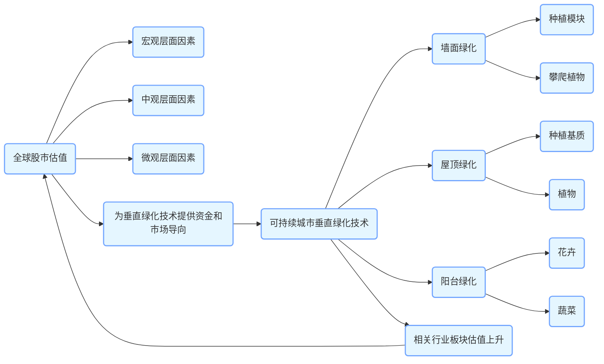

# 全球股市估值与可持续城市垂直绿化技术的关联

> 关键词：全球股市估值、可持续城市、垂直绿化技术、经济关联、环境影响、投资趋势、市场动态

> 摘要：本文旨在深入探讨全球股市估值与可持续城市垂直绿化技术之间的内在关联。通过对核心概念的阐释、相关算法原理的分析、数学模型的构建，结合项目实战案例，揭示两者在经济、环境和市场等多方面的相互作用。研究发现，垂直绿化技术的发展不仅对城市环境产生积极影响，还在一定程度上影响着相关行业的股市表现。同时，股市的估值变化也会为垂直绿化技术的研发和推广提供资金支持和市场导向。文章还介绍了该领域的实际应用场景、推荐了相关的学习资源和开发工具，并对未来的发展趋势和挑战进行了展望。

## 1. 背景介绍 

### 1.1 目的和范围
本研究的主要目的是全面分析全球股市估值与可持续城市垂直绿化技术之间的关联。具体范围包括探讨垂直绿化技术的发展对股市中相关行业板块估值的影响，以及股市资金流向和市场预期如何作用于垂直绿化技术的研发、推广和应用。通过研究，为投资者、城市规划者和技术开发者提供有价值的参考，促进经济发展与城市环境可持续性的协同共进。

### 1.2 预期读者
本文的预期读者包括金融投资领域的专业人士，如股票分析师、基金经理、投资者等，他们可以从文中了解到新兴的垂直绿化技术对股市的潜在影响，为投资决策提供依据。同时，城市规划师、环保专家和相关技术开发者也能从中获取经济层面的信息，以更好地推动垂直绿化技术在城市中的应用和发展。此外，对可持续发展和金融市场交叉领域感兴趣的学者和研究人员也可将本文作为研究参考。

### 1.3 文档结构概述
本文将按照以下结构展开：首先介绍核心概念，包括全球股市估值和可持续城市垂直绿化技术的定义、原理和架构；接着阐述核心算法原理和具体操作步骤，使用 Python 代码进行详细说明；然后构建数学模型并进行公式推导和举例说明；通过项目实战案例，展示两者关联在实际中的体现；分析实际应用场景，探讨该关联在不同领域的应用价值；推荐相关的学习资源、开发工具和论文著作；最后总结未来发展趋势与挑战，并提供常见问题解答和扩展阅读参考资料。

### 1.4 术语表
#### 1.4.1 核心术语定义
- **全球股市估值**：指对全球范围内股票市场中各类股票的价值评估，通常基于公司的财务状况、盈利能力、市场前景等因素，通过各种估值方法计算得出股票的合理价格。
- **可持续城市**：是指在经济、社会和环境等方面实现平衡发展，能够满足当代人需求而不损害后代人满足其需求能力的城市。
- **垂直绿化技术**：是一种利用建筑物垂直面进行绿化的技术，通过在墙面、屋顶、阳台等垂直空间种植植物，达到增加城市绿化面积、改善城市生态环境的目的。

#### 1.4.2 相关概念解释
- **股市板块**：是对股票市场中具有相似特征或行业属性的股票进行分类的概念，如房地产板块、环保板块等。垂直绿化技术相关的股市板块主要涉及园林景观、建筑材料、环保科技等行业。
- **环境效益**：指垂直绿化技术在改善城市空气质量、降低噪音、调节气温等方面所带来的环境改善效果，这些效益可以间接影响城市的经济发展和居民生活质量。
- **投资回报率（ROI）**：是指投资所获得的收益与投资成本之间的比率，用于衡量投资的盈利能力。在垂直绿化技术项目中，投资回报率可以反映项目的经济可行性和吸引力。

#### 1.4.3 缩略词列表
- **ROI**：Return on Investment，投资回报率
- **GDP**：Gross Domestic Product，国内生产总值
- **ESG**：Environmental, Social and Governance，环境、社会和公司治理

## 2. 核心概念与联系 

### 2.1 全球股市估值的原理和架构
全球股市估值是一个复杂的过程，涉及多个因素和方法。其基本原理是通过对公司的基本面分析和市场预期来评估股票的内在价值。常见的估值方法包括市盈率法（P/E）、市净率法（P/B）、现金流折现法（DCF）等。

市盈率法是最常用的估值方法之一，其计算公式为：$P/E = \frac{股价}{每股收益}$。该方法通过比较公司的市盈率与同行业其他公司或市场平均水平，来判断股票是否被高估或低估。

市净率法是通过比较公司的市值与净资产的比率来评估股票价值，计算公式为：$P/B = \frac{股价}{每股净资产}$。市净率较低的股票通常被认为具有较高的投资价值。

现金流折现法是一种较为复杂的估值方法，它通过预测公司未来的现金流，并将其折现到当前价值来评估股票的内在价值。其基本公式为：$V = \sum_{t=1}^{n} \frac{CF_t}{(1 + r)^t}$，其中 $V$ 表示股票的内在价值，$CF_t$ 表示第 $t$ 期的现金流，$r$ 表示折现率，$n$ 表示预测期数。

全球股市估值的架构可以分为宏观、中观和微观三个层面。宏观层面主要考虑全球经济形势、货币政策、政治环境等因素对股市的整体影响；中观层面关注行业发展趋势、市场竞争格局等因素对特定行业板块的影响；微观层面则聚焦于公司的财务状况、经营管理、创新能力等因素对单个股票的影响。

### 2.2 可持续城市垂直绿化技术的原理和架构
可持续城市垂直绿化技术的核心原理是利用植物的生长特性和生态功能，在城市的垂直空间中构建绿色生态系统。该技术主要包括墙面绿化、屋顶绿化、阳台绿化等多种形式。

墙面绿化是通过在建筑物墙面上安装种植模块或攀爬植物，使植物沿着墙面生长，形成绿色的墙面景观。墙面绿化可以有效降低墙面温度，减少建筑物的能耗，同时还能吸收空气中的有害物质，改善空气质量。

屋顶绿化是在建筑物屋顶上铺设种植基质和植物，形成屋顶花园。屋顶绿化可以增加城市的绿化面积，缓解城市热岛效应，同时还能起到防水、隔热、降噪等作用。

阳台绿化是在建筑物的阳台、窗台等空间种植花卉、蔬菜等植物，为居民提供一个绿色的休闲空间。阳台绿化可以美化城市景观，改善居民的生活环境。

可持续城市垂直绿化技术的架构主要包括植物选择、种植系统设计、灌溉与施肥管理、维护与监测等环节。在植物选择方面，需要根据当地的气候条件、土壤质量和建筑物的朝向等因素，选择适合垂直绿化的植物品种。种植系统设计需要考虑植物的生长空间、排水和通风等问题，确保植物能够健康生长。灌溉与施肥管理需要根据植物的生长需求，合理安排灌溉和施肥的时间和量。维护与监测需要定期对垂直绿化系统进行检查和维护，及时发现和解决问题。

### 2.3 两者之间的联系
全球股市估值与可持续城市垂直绿化技术之间存在着密切的联系。一方面，垂直绿化技术的发展会对股市中相关行业板块的估值产生影响。随着人们对城市环境质量的关注度不断提高，垂直绿化技术的市场需求也在逐渐增加。这将带动园林景观、建筑材料、环保科技等相关行业的发展，从而提高这些行业板块的估值。例如，从事垂直绿化工程设计和施工的企业，其业绩可能会随着市场需求的增加而增长，进而推动其股价上涨。

另一方面，股市的估值变化也会为垂直绿化技术的研发和推广提供资金支持和市场导向。当股市中相关行业板块的估值上升时，企业的融资能力会增强，能够吸引更多的资金投入到垂直绿化技术的研发和推广中。同时，股市的市场预期也会影响企业的战略决策，促使企业加大对垂直绿化技术的投入，以满足市场需求和提高竞争力。

### 2.4 核心概念的文本示意图
```plaintext
全球股市估值
|--宏观层面（全球经济形势、货币政策、政治环境）
|--中观层面（行业发展趋势、市场竞争格局）
|--微观层面（公司财务状况、经营管理、创新能力）

可持续城市垂直绿化技术
|--墙面绿化
|   |--种植模块
|   |--攀爬植物
|--屋顶绿化
|   |--种植基质
|   |--植物
|--阳台绿化
|   |--花卉
|   |--蔬菜

两者联系
|--垂直绿化技术发展 -> 相关行业板块估值上升
|--股市估值变化 -> 为垂直绿化技术提供资金和市场导向
```

### 2.5 Mermaid 流程图


## 3. 核心算法原理 & 具体操作步骤 

### 3.1 股市估值算法原理
在股市估值中，现金流折现法是一种较为常用且复杂的方法，下面我们使用 Python 代码来详细阐述其原理和具体操作步骤。

现金流折现法的核心思想是将公司未来的现金流折现到当前价值，以评估股票的内在价值。具体步骤如下：
1. 预测公司未来的现金流。
2. 确定折现率。
3. 将未来的现金流折现到当前价值。
4. 计算股票的内在价值。

以下是一个简单的 Python 代码示例：
```python
def dcf_valuation(cash_flows, discount_rate):
    """
    现金流折现法估值函数
    :param cash_flows: 未来各期的现金流列表
    :param discount_rate: 折现率
    :return: 股票的内在价值
    """
    present_value = 0
    for i, cash_flow in enumerate(cash_flows):
        present_value += cash_flow / ((1 + discount_rate) ** (i + 1))
    return present_value

# 示例数据
cash_flows = [100, 120, 150, 180, 200]  # 未来 5 年的现金流
discount_rate = 0.1  # 折现率为 10%

# 计算股票的内在价值
intrinsic_value = dcf_valuation(cash_flows, discount_rate)
print(f"股票的内在价值为: {intrinsic_value}")
```
### 3.2 垂直绿化技术成本效益分析算法原理
垂直绿化技术的成本效益分析对于评估项目的可行性和经济价值非常重要。成本效益分析主要包括计算项目的总成本和总效益，并通过比较两者来判断项目是否值得投资。

总成本包括初始建设成本和运营维护成本。初始建设成本主要包括植物采购、种植系统安装、施工费用等；运营维护成本主要包括灌溉、施肥、修剪、病虫害防治等费用。

总效益包括环境效益和经济效益。环境效益主要包括改善空气质量、降低噪音、调节气温等方面的价值；经济效益主要包括增加房产价值、降低能源消耗等方面的价值。

以下是一个简单的 Python 代码示例，用于计算垂直绿化项目的净现值（NPV）：
```python
def npv(costs, benefits, discount_rate):
    """
    净现值计算函数
    :param costs: 各期的成本列表
    :param benefits: 各期的效益列表
    :param discount_rate: 折现率
    :return: 净现值
    """
    net_cash_flows = [b - c for b, c in zip(benefits, costs)]
    present_value = 0
    for i, cash_flow in enumerate(net_cash_flows):
        present_value += cash_flow / ((1 + discount_rate) ** (i + 1))
    return present_value

# 示例数据
costs = [10000, 2000, 2000, 2000, 2000]  # 初始建设成本和未来 4 年的运营维护成本
benefits = [0, 3000, 4000, 5000, 6000]  # 未来 4 年的效益
discount_rate = 0.1  # 折现率为 10%

# 计算净现值
npv_value = npv(costs, benefits, discount_rate)
print(f"垂直绿化项目的净现值为: {npv_value}")
```
### 3.3 两者关联分析算法原理
为了分析全球股市估值与可持续城市垂直绿化技术之间的关联，我们可以采用回归分析的方法。回归分析是一种统计方法，用于研究自变量与因变量之间的关系。

在这个问题中，我们可以将股市中相关行业板块的估值作为因变量，将垂直绿化技术的市场规模、发展速度等因素作为自变量，建立回归模型进行分析。

以下是一个简单的 Python 代码示例，使用 `scikit-learn` 库进行线性回归分析：
```python
import numpy as np
from sklearn.linear_model import LinearRegression

# 示例数据
# 垂直绿化技术的市场规模（自变量）
x = np.array([100, 200, 300, 400, 500]).reshape(-1, 1)
# 股市中相关行业板块的估值（因变量）
y = np.array([200, 400, 600, 800, 1000])

# 创建线性回归模型
model = LinearRegression()

# 拟合模型
model.fit(x, y)

# 预测
new_x = np.array([600]).reshape(-1, 1)
predicted_y = model.predict(new_x)
print(f"当垂直绿化技术市场规模为 600 时，相关行业板块的估值预测为: {predicted_y[0]}")
```

## 4. 数学模型和公式 & 详细讲解 & 举例说明 

### 4.1 股市估值数学模型
#### 4.1.1 市盈率法
市盈率法的基本公式为：$P/E = \frac{股价}{每股收益}$，变形可得：$股价 = P/E \times 每股收益$。

例如，某公司的每股收益为 2 元，行业平均市盈率为 20 倍，则该公司的股价理论上应为：$2 \times 20 = 40$ 元。

#### 4.1.2 市净率法
市净率法的基本公式为：$P/B = \frac{股价}{每股净资产}$，变形可得：$股价 = P/B \times 每股净资产$。

例如，某公司的每股净资产为 5 元，行业平均市净率为 3 倍，则该公司的股价理论上应为：$5 \times 3 = 15$ 元。

#### 4.1.3 现金流折现法
现金流折现法的基本公式为：$V = \sum_{t=1}^{n} \frac{CF_t}{(1 + r)^t}$，其中 $V$ 表示股票的内在价值，$CF_t$ 表示第 $t$ 期的现金流，$r$ 表示折现率，$n$ 表示预测期数。

例如，某公司未来 3 年的现金流分别为 100 万元、120 万元、150 万元，折现率为 10%，则该公司股票的内在价值为：
$$
\begin{align*}
V &= \frac{100}{(1 + 0.1)^1} + \frac{120}{(1 + 0.1)^2} + \frac{150}{(1 + 0.1)^3}\\
&= \frac{100}{1.1} + \frac{120}{1.21} + \frac{150}{1.331}\\
&\approx 90.91 + 99.17 + 112.69\\
&= 302.77 \text{（万元）}
\end{align*}
$$

### 4.2 垂直绿化技术成本效益分析数学模型
#### 4.2.1 总成本模型
总成本 $C$ 包括初始建设成本 $C_0$ 和运营维护成本 $C_m$，可以表示为：$C = C_0 + \sum_{t=1}^{n} C_{m_t}$，其中 $C_{m_t}$ 表示第 $t$ 期的运营维护成本，$n$ 表示项目的运营期数。

例如，某垂直绿化项目的初始建设成本为 10 万元，未来 5 年的运营维护成本分别为 1 万元、1.2 万元、1.5 万元、1.8 万元、2 万元，则该项目的总成本为：
$C = 10 + 1 + 1.2 + 1.5 + 1.8 + 2 = 17.5$（万元）

#### 4.2.2 总效益模型
总效益 $B$ 包括环境效益 $B_e$ 和经济效益 $B_c$，可以表示为：$B = B_e + B_c$。

环境效益和经济效益的计算较为复杂，通常需要根据具体的评估指标和方法进行量化。例如，环境效益可以通过减少空气污染、降低噪音等方面的价值来衡量；经济效益可以通过增加房产价值、降低能源消耗等方面的价值来衡量。

#### 4.2.3 净现值模型
净现值 $NPV$ 的计算公式为：$NPV = \sum_{t=0}^{n} \frac{B_t - C_t}{(1 + r)^t}$，其中 $B_t$ 表示第 $t$ 期的效益，$C_t$ 表示第 $t$ 期的成本，$r$ 表示折现率，$n$ 表示项目的运营期数。

例如，某垂直绿化项目的初始建设成本为 10 万元，未来 3 年的运营维护成本分别为 1 万元、1.2 万元、1.5 万元，未来 3 年的效益分别为 3 万元、4 万元、5 万元，折现率为 10%，则该项目的净现值为：
$$
\begin{align*}
NPV &= \frac{3 - 10}{(1 + 0.1)^0} + \frac{4 - 1}{(1 + 0.1)^1} + \frac{5 - 1.2}{(1 + 0.1)^2} + \frac{0 - 1.5}{(1 + 0.1)^3}\\
&= -7 + \frac{3}{1.1} + \frac{3.8}{1.21} + \frac{-1.5}{1.331}\\
&\approx -7 + 2.73 + 3.14 - 1.13\\
&= -2.26 \text{（万元）}
\end{align*}
$$
由于净现值为负数，说明该项目在当前的折现率下可能不具有经济可行性。

### 4.3 两者关联分析数学模型
#### 4.3.1 线性回归模型
线性回归模型的基本公式为：$y = \beta_0 + \beta_1 x + \epsilon$，其中 $y$ 表示因变量（股市中相关行业板块的估值），$x$ 表示自变量（垂直绿化技术的市场规模等因素），$\beta_0$ 表示截距，$\beta_1$ 表示斜率，$\epsilon$ 表示误差项。

通过最小二乘法可以估计出 $\beta_0$ 和 $\beta_1$ 的值，从而得到回归方程。例如，根据前面的 Python 代码示例，我们得到的回归方程为：$y = 0 + 2x$，这意味着垂直绿化技术的市场规模每增加 1 个单位，股市中相关行业板块的估值将增加 2 个单位。

## 5. 项目实战：代码实际案例和详细解释说明 

### 5.1  开发环境搭建
#### 5.1.1 安装 Python
首先，需要安装 Python 编程语言。可以从 Python 官方网站（https://www.python.org/downloads/）下载适合自己操作系统的 Python 版本，并按照安装向导进行安装。

#### 5.1.2 安装必要的库
在进行股市估值和垂直绿化技术成本效益分析等计算时，需要使用一些 Python 库，如 `numpy`、`pandas`、`scikit-learn` 等。可以使用 `pip` 命令来安装这些库：
```sh
pip install numpy pandas scikit-learn
```

### 5.2  源代码详细实现和代码解读
#### 5.2.1 股市估值代码实现
```python
import numpy as np

def dcf_valuation(cash_flows, discount_rate):
    """
    现金流折现法估值函数
    :param cash_flows: 未来各期的现金流列表
    :param discount_rate: 折现率
    :return: 股票的内在价值
    """
    present_value = 0
    for i, cash_flow in enumerate(cash_flows):
        present_value += cash_flow / ((1 + discount_rate) ** (i + 1))
    return present_value

# 示例数据
cash_flows = [100, 120, 150, 180, 200]  # 未来 5 年的现金流
discount_rate = 0.1  # 折现率为 10%

# 计算股票的内在价值
intrinsic_value = dcf_valuation(cash_flows, discount_rate)
print(f"股票的内在价值为: {intrinsic_value}")
```
代码解读：
- `dcf_valuation` 函数接受两个参数：`cash_flows` 表示未来各期的现金流列表，`discount_rate` 表示折现率。
- 在函数内部，使用 `for` 循环遍历现金流列表，将每期的现金流折现到当前价值，并累加到 `present_value` 中。
- 最后返回股票的内在价值。

#### 5.2.2 垂直绿化技术成本效益分析代码实现
```python
def npv(costs, benefits, discount_rate):
    """
    净现值计算函数
    :param costs: 各期的成本列表
    :param benefits: 各期的效益列表
    :param discount_rate: 折现率
    :return: 净现值
    """
    net_cash_flows = [b - c for b, c in zip(benefits, costs)]
    present_value = 0
    for i, cash_flow in enumerate(net_cash_flows):
        present_value += cash_flow / ((1 + discount_rate) ** (i + 1))
    return present_value

# 示例数据
costs = [10000, 2000, 2000, 2000, 2000]  # 初始建设成本和未来 4 年的运营维护成本
benefits = [0, 3000, 4000, 5000, 6000]  # 未来 4 年的效益
discount_rate = 0.1  # 折现率为 10%

# 计算净现值
npv_value = npv(costs, benefits, discount_rate)
print(f"垂直绿化项目的净现值为: {npv_value}")
```
代码解读：
- `npv` 函数接受三个参数：`costs` 表示各期的成本列表，`benefits` 表示各期的效益列表，`discount_rate` 表示折现率。
- 在函数内部，首先计算各期的净现金流，然后使用 `for` 循环将净现金流折现到当前价值，并累加到 `present_value` 中。
- 最后返回净现值。

#### 5.2.3 两者关联分析代码实现
```python
import numpy as np
from sklearn.linear_model import LinearRegression

# 示例数据
# 垂直绿化技术的市场规模（自变量）
x = np.array([100, 200, 300, 400, 500]).reshape(-1, 1)
# 股市中相关行业板块的估值（因变量）
y = np.array([200, 400, 600, 800, 1000])

# 创建线性回归模型
model = LinearRegression()

# 拟合模型
model.fit(x, y)

# 预测
new_x = np.array([600]).reshape(-1, 1)
predicted_y = model.predict(new_x)
print(f"当垂直绿化技术市场规模为 600 时，相关行业板块的估值预测为: {predicted_y[0]}")
```
代码解读：
- 首先导入 `numpy` 和 `scikit-learn` 库中的 `LinearRegression` 类。
- 定义自变量 `x` 和因变量 `y`，并将 `x` 转换为二维数组。
- 创建 `LinearRegression` 模型对象。
- 使用 `fit` 方法拟合模型。
- 使用 `predict` 方法进行预测，并输出预测结果。

### 5.3  代码解读与分析
#### 5.3.1 股市估值代码分析
现金流折现法是一种基于未来现金流预测的估值方法，其优点是考虑了资金的时间价值，能够更准确地评估股票的内在价值。但该方法的缺点是需要对未来现金流进行准确预测，而未来现金流受到多种因素的影响，预测难度较大。

#### 5.3.2 垂直绿化技术成本效益分析代码分析
净现值法是一种常用的投资决策方法，通过比较项目的净现值与零的大小来判断项目是否值得投资。净现值大于零表示项目具有经济可行性，净现值小于零表示项目不具有经济可行性。该方法的优点是考虑了资金的时间价值和项目的整个生命周期，能够更全面地评估项目的经济效益。

#### 5.3.3 两者关联分析代码分析
线性回归分析是一种简单而有效的统计方法，用于研究自变量与因变量之间的线性关系。通过线性回归分析，可以得到自变量对因变量的影响程度，从而为投资决策和技术发展提供参考。但线性回归分析也有一定的局限性，例如假设自变量与因变量之间存在线性关系，可能无法准确反映实际情况。

## 6. 实际应用场景 
### 6.1 金融投资领域
在金融投资领域，全球股市估值与可持续城市垂直绿化技术的关联可以为投资者提供新的投资机会和决策依据。投资者可以关注股市中与垂直绿化技术相关的行业板块，如园林景观、建筑材料、环保科技等，通过分析垂直绿化技术的发展趋势和市场前景，来评估这些行业板块的投资价值。例如，如果预测垂直绿化技术的市场需求将大幅增长，那么相关行业的企业业绩可能会随之提升，其股价也可能会上涨，投资者可以考虑买入这些股票。

### 6.2 城市规划与建设领域
在城市规划与建设领域，了解全球股市估值与可持续城市垂直绿化技术的关联可以帮助城市规划者更好地推动城市的可持续发展。城市规划者可以根据股市中相关行业的发展情况，合理安排垂直绿化项目的建设规模和布局。例如，如果股市中垂直绿化相关行业的估值上升，说明市场对该技术的认可度较高，城市规划者可以加大对垂直绿化项目的投资，提高城市的绿化覆盖率和环境质量。

### 6.3 环保与可持续发展领域
在环保与可持续发展领域，垂直绿化技术的应用可以有效改善城市的生态环境，减少空气污染、降低噪音、调节气温等。而全球股市估值与垂直绿化技术的关联可以为环保项目的融资和推广提供支持。当股市中相关行业的估值上升时，企业的融资能力增强，能够吸引更多的资金投入到垂直绿化技术的研发和应用中，从而推动环保事业的发展。

### 6.4 房地产领域
在房地产领域，垂直绿化技术可以提升房产的价值和吸引力。具有垂直绿化景观的建筑物通常更受消费者青睐，能够提高房产的销售价格和租金水平。同时，全球股市估值与垂直绿化技术的关联也会影响房地产开发商的决策。如果股市中相关行业的估值上升，房地产开发商可能会更愿意在项目中应用垂直绿化技术，以提高项目的竞争力和附加值。

## 7. 工具和资源推荐
### 7.1 学习资源推荐
#### 7.1.1 书籍推荐
- 《证券分析》（Security Analysis）：由本杰明·格雷厄姆（Benjamin Graham）和戴维·多德（David Dodd）所著，是价值投资领域的经典著作，详细介绍了股票估值的方法和理论。
- 《城市绿化与生态修复》：系统介绍了城市绿化的各种技术和方法，包括垂直绿化技术，以及城市绿化对生态环境的影响和作用。
- 《可持续发展经济学》：探讨了经济发展与环境保护之间的关系，以及如何实现可持续发展的目标，对于理解全球股市估值与可持续城市垂直绿化技术的关联具有重要的参考价值。

#### 7.1.2 在线课程
- Coursera 平台上的“金融市场”（Financial Markets）课程：由耶鲁大学教授罗伯特·席勒（Robert Shiller）主讲，介绍了金融市场的基本原理和运行机制，包括股票估值的方法和技巧。
- edX 平台上的“城市可持续发展”（Urban Sustainability）课程：提供了城市可持续发展的理论和实践知识，包括垂直绿化技术在城市中的应用和发展。
- Udemy 平台上的“Python 数据分析实战”（Python Data Analysis实战）课程：学习如何使用 Python 进行数据分析和建模，对于进行股市估值和垂直绿化技术成本效益分析等计算非常有帮助。

#### 7.1.3 技术博客和网站
- Seeking Alpha：是一个知名的金融投资博客网站，提供了大量关于股票估值、市场分析和投资策略的文章和研究报告。
- GreenBiz：专注于可持续发展和环保领域的新闻和资讯，涵盖了垂直绿化技术、城市可持续发展等方面的内容。
- Stack Overflow：是一个程序员社区，提供了丰富的编程知识和解决方案，对于解决在编写股市估值和垂直绿化技术相关代码时遇到的问题非常有帮助。

### 7.2 开发工具框架推荐
#### 7.2.1 IDE和编辑器
- PyCharm：是一款专业的 Python 集成开发环境（IDE），提供了丰富的代码编辑、调试和项目管理功能，适合进行股市估值和垂直绿化技术相关代码的开发。
- Jupyter Notebook：是一个交互式的开发环境，支持 Python 等多种编程语言，非常适合进行数据分析和可视化，对于展示和分享股市估值和垂直绿化技术成本效益分析的结果很有帮助。
- Visual Studio Code：是一款轻量级的代码编辑器，支持多种编程语言和插件扩展，具有良好的代码编辑和调试功能，也可以用于开发股市估值和垂直绿化技术相关代码。

#### 7.2.2 调试和性能分析工具
- pdb：是 Python 内置的调试工具，可以帮助开发者在代码运行过程中进行调试和排查问题。
- cProfile：是 Python 标准库中的性能分析工具，可以分析代码的运行时间和函数调用情况，帮助开发者优化代码性能。
- Py-Spy：是一个用于分析 Python 程序性能的工具，可以实时监控 Python 程序的运行情况，找出性能瓶颈。

#### 7.2.3 相关框架和库
- numpy：是 Python 中用于科学计算的基础库，提供了高效的数组操作和数学函数，对于进行股市估值和垂直绿化技术成本效益分析等计算非常有用。
- pandas：是 Python 中用于数据处理和分析的库，提供了丰富的数据结构和数据操作方法，方便进行数据的读取、清洗和分析。
- scikit-learn：是 Python 中用于机器学习的库，提供了各种机器学习算法和工具，如线性回归、决策树、支持向量机等，可用于进行股市估值和垂直绿化技术关联分析等建模任务。

### 7.3 相关论文著作推荐
#### 7.3.1 经典论文
- 《有效市场假说》（Efficient Market Hypothesis）：由尤金·法玛（Eugene F. Fama）所著，探讨了股票市场的有效性问题，对于理解股市估值的原理和机制具有重要的参考价值。
- 《城市生态系统中的垂直绿化：现状与展望》（Vertical Greening in Urban Ecosystems: Current Status and Future Prospects）：介绍了垂直绿化技术在城市生态系统中的应用现状和发展趋势，分析了垂直绿化技术对城市环境和生态的影响。
- 《可持续发展与金融市场》（Sustainable Development and Financial Markets）：研究了可持续发展与金融市场之间的关系，探讨了金融市场如何支持可持续发展项目的融资和发展。

#### 7.3.2 最新研究成果
- 关注国际知名学术期刊，如《金融研究评论》（Review of Financial Studies）、《城市规划国际》（Urban Planning International）、《环境科学与技术》（Environmental Science & Technology）等，这些期刊会发表关于股市估值、城市可持续发展和垂直绿化技术等方面的最新研究成果。
- 参加相关的学术会议，如国际金融年会（Annual Meeting of the American Finance Association）、世界城市论坛（World Urban Forum）等，与国内外的专家学者交流和分享最新的研究进展。

#### 7.3.3 应用案例分析
- 可以查阅一些关于垂直绿化技术在实际项目中应用的案例分析报告，了解垂直绿化技术的实施过程、成本效益和环境影响等方面的情况。例如，一些城市的大型商业建筑、住宅小区或公共设施的垂直绿化项目案例。
- 关注一些知名企业在垂直绿化技术研发和应用方面的实践经验，如一些园林景观公司、建筑设计公司或环保科技企业的成功案例，从中学习他们的技术创新和商业模式。

## 8. 总结：未来发展趋势与挑战
### 8.1 未来发展趋势
#### 8.1.1 市场需求增长
随着人们对城市环境质量的关注度不断提高，可持续城市垂直绿化技术的市场需求将持续增长。政府和企业将加大对垂直绿化项目的投资，推动城市绿化覆盖率的提高和生态环境的改善。

#### 8.1.2 技术创新加速
未来，垂直绿化技术将不断创新和发展。新的植物品种、种植系统和灌溉技术将不断涌现，提高垂直绿化的效率和效果。同时，智能化和自动化技术也将应用于垂直绿化系统的管理和维护，降低运营成本。

#### 8.1.3 产业融合加深
全球股市估值与可持续城市垂直绿化技术的关联将更加紧密，产业融合将进一步加深。股市中的相关行业板块将受益于垂直绿化技术的发展，而股市的资金流向和市场预期也将为垂直绿化技术的研发和推广提供更多的支持。

#### 8.1.4 国际合作加强
在全球可持续发展的背景下，各国将加强在垂直绿化技术领域的国际合作。分享技术经验、开展联合研究和项目合作，共同推动垂直绿化技术的发展和应用。

### 8.2 挑战
#### 8.2.1 技术难题
垂直绿化技术在实际应用中还面临一些技术难题，如植物的适应性、种植系统的稳定性、灌溉和施肥的精准控制等。解决这些技术难题需要加大研发投入和技术创新。

#### 8.2.2 成本较高
目前，垂直绿化项目的建设和运营成本相对较高，限制了其大规模推广和应用。降低成本需要优化种植系统设计、提高植物成活率、采用节能环保的技术和设备等。

#### 8.2.3 市场认知不足
部分投资者和消费者对垂直绿化技术的认识和了解还不够，对其经济效益和环境效益的评估存在偏差。加强市场宣传和教育，提高市场认知度，是推动垂直绿化技术发展的重要任务。

#### 8.2.4 政策支持不够
虽然一些地方政府已经出台了相关的政策支持垂直绿化项目的建设，但整体上政策支持力度还不够。需要进一步完善政策体系，提供更多的财政补贴、税收优惠和技术支持，促进垂直绿化技术的发展。

## 9. 附录：常见问题与解答
### 9.1 股市估值方法有哪些局限性？
股市估值方法虽然可以为投资者提供一定的参考，但都存在一定的局限性。例如，市盈率法没有考虑公司的未来增长潜力和风险因素；市净率法没有考虑公司的无形资产价值；现金流折现法需要对未来现金流进行准确预测，而未来现金流受到多种因素的影响，预测难度较大。

### 9.2 垂直绿化技术的环境效益如何量化？
垂直绿化技术的环境效益量化是一个复杂的问题，目前还没有统一的标准和方法。一般可以从改善空气质量、降低噪音、调节气温等方面进行评估，通过监测和分析相关指标的变化来量化环境效益。例如，可以通过测量空气中污染物的浓度变化来评估垂直绿化对空气质量的改善效果。

### 9.3 如何判断一个垂直绿化项目是否值得投资？
可以通过成本效益分析来判断一个垂直绿化项目是否值得投资。计算项目的总成本和总效益，并通过比较两者来评估项目的经济可行性。常用的评估指标包括净现值、内部收益率、投资回收期等。如果项目的净现值大于零、内部收益率大于折现率、投资回收期小于预期回收期，则说明项目具有经济可行性。

### 9.4 全球股市估值与可持续城市垂直绿化技术的关联是否稳定？
全球股市估值与可持续城市垂直绿化技术的关联受到多种因素的影响，如经济形势、政策环境、市场情绪等，因此这种关联并不是稳定不变的。在不同的市场环境和发展阶段，两者的关联程度和方向可能会有所不同。投资者和决策者需要密切关注市场动态，及时调整投资策略和决策方案。

## 10. 扩展阅读 & 参考资料
### 10.1 扩展阅读
- 《聪明的投资者》（The Intelligent Investor）：由本杰明·格雷厄姆所著，是价值投资领域的经典之作，对于理解股票投资的本质和方法具有重要的启示作用。
- 《绿色建筑：设计与评估》（Green Building: Design and Evaluation）：介绍了绿色建筑的设计理念、技术和评估方法，包括垂直绿化技术在绿色建筑中的应用。
- 《金融炼金术》（The Alchemy of Finance）：由乔治·索罗斯（George Soros）所著，探讨了金融市场的运行机制和投资者的心理行为，对于理解股市估值和市场波动具有一定的参考价值。

### 10.2 参考资料
- 世界银行发布的《全球经济展望》（Global Economic Prospects）报告，提供了全球经济形势和发展趋势的相关数据和分析。
- 国际金融协会（Institute of International Finance）发布的金融市场研究报告，涵盖了全球股市估值、投资趋势等方面的内容。
- 国际绿色建筑与可持续发展协会（World Green Building Council）发布的关于城市可持续发展和垂直绿化技术的研究报告和标准规范。

作者：AI天才研究院/AI Genius Institute & 禅与计算机程序设计艺术 /Zen And The Art of Computer Programming