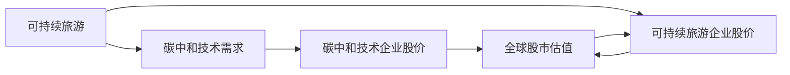

# 全球股市估值与可持续旅游碳中和技术的关联

> 关键词：全球股市估值、可持续旅游、碳中和技术、关联分析、经济影响

> 摘要：本文旨在深入探讨全球股市估值与可持续旅游碳中和技术之间的关联。通过对相关核心概念的阐述、算法原理的分析、数学模型的构建以及实际案例的研究，揭示两者之间的内在联系和相互影响。首先介绍了研究的背景、目的、预期读者和文档结构等内容；接着阐述了核心概念及其联系，包括全球股市估值、可持续旅游和碳中和技术的原理与架构；然后详细讲解了核心算法原理和具体操作步骤，并给出了相应的 Python 代码；随后建立了数学模型和公式进行详细讲解与举例说明；通过项目实战，展示了代码实际案例并进行详细解释；分析了实际应用场景；推荐了相关的学习资源、开发工具框架和论文著作；最后总结了未来发展趋势与挑战，并对常见问题进行了解答。

## 1. 背景介绍 
### 1.1 目的和范围
本研究的主要目的是全面剖析全球股市估值与可持续旅游碳中和技术之间的复杂关联。随着全球对环境保护和可持续发展的关注度不断提高，可持续旅游碳中和技术成为旅游业发展的重要方向。同时，股市作为经济的重要晴雨表，其估值受到众多因素的影响。了解两者之间的关联，有助于投资者更好地把握市场动态，企业制定合理的发展战略，政府出台有效的政策措施。研究范围涵盖全球股市，包括主要的股票市场如纽约证券交易所、伦敦证券交易所、东京证券交易所等，以及可持续旅游碳中和技术在全球范围内的应用和发展情况。

### 1.2 预期读者
本文的预期读者包括金融领域的投资者、分析师、基金经理，旅游行业的企业管理者、从业者，环保领域的研究人员、政策制定者，以及对可持续发展和金融市场感兴趣的学者和爱好者。

### 1.3 文档结构概述
本文共分为十个部分。第一部分为背景介绍，阐述研究的目的、范围、预期读者和文档结构；第二部分介绍核心概念与联系，包括全球股市估值、可持续旅游和碳中和技术的原理和架构，并给出相应的示意图和流程图；第三部分讲解核心算法原理和具体操作步骤，通过 Python 代码进行详细阐述；第四部分建立数学模型和公式，进行详细讲解并举例说明；第五部分通过项目实战，展示代码实际案例并进行详细解释；第六部分分析实际应用场景；第七部分推荐相关的学习资源、开发工具框架和论文著作；第八部分总结未来发展趋势与挑战；第九部分为附录，解答常见问题；第十部分提供扩展阅读和参考资料。

### 1.4 术语表
#### 1.4.1 核心术语定义
- **全球股市估值**：指对全球范围内各个股票市场中上市公司的价值进行评估的过程和结果。通常采用市盈率、市净率等指标来衡量。
- **可持续旅游**：在满足游客需求的同时，保护自然环境、文化遗产和社会经济的可持续发展的旅游模式。它强调旅游活动与环境保护、社会文化和经济发展的协调统一。
- **碳中和技术**：通过各种手段减少或消除碳排放，使碳排放与碳吸收达到平衡的技术。包括能源替代、节能减排、碳捕获与封存等技术。

#### 1.4.2 相关概念解释
- **股票市场**：是股票发行和交易的场所，是企业筹集资金和投资者进行投资的重要平台。
- **旅游业**：是一个综合性的产业，包括旅游交通、旅游住宿、旅游餐饮、旅游购物、旅游娱乐等多个领域。
- **碳排放**：指人类活动（如能源消耗、工业生产、交通运输等）向大气中排放的二氧化碳等温室气体的量。

#### 1.4.3 缩略词列表
- **PE**：市盈率（Price-to-Earnings Ratio）
- **PB**：市净率（Price-to-Book Ratio）
- **CCUS**：碳捕获、利用与封存（Carbon Capture, Utilization and Storage）

## 2. 核心概念与联系 

### 全球股市估值原理
全球股市估值是一个复杂的过程，受到多种因素的影响。其基本原理是通过对上市公司的财务状况、盈利能力、行业前景等进行分析，来评估其股票的内在价值。常用的估值方法包括市盈率法、市净率法、现金流折现法等。

市盈率（PE）是指股票价格与每股收益的比率，计算公式为：$PE = \frac{P}{E}$，其中 $P$ 为股票价格，$E$ 为每股收益。市盈率反映了投资者为获取公司每一元盈利所愿意支付的价格。一般来说，市盈率越高，表明市场对该公司的未来盈利预期越高。

市净率（PB）是指股票价格与每股净资产的比率，计算公式为：$PB = \frac{P}{B}$，其中 $P$ 为股票价格，$B$ 为每股净资产。市净率反映了股票价格相对于公司净资产的倍数。一般来说，市净率越低，表明股票的投资价值越高。

### 可持续旅游原理
可持续旅游强调旅游活动与环境保护、社会文化和经济发展的协调统一。其核心目标是在满足游客需求的同时，保护自然环境和文化遗产，促进当地经济的可持续发展。可持续旅游的实现需要从多个方面入手，包括旅游资源的合理开发与利用、旅游设施的节能减排、旅游活动的环境教育等。

### 碳中和技术原理
碳中和技术旨在减少或消除碳排放，使碳排放与碳吸收达到平衡。主要包括以下几种技术：
- **能源替代技术**：用清洁能源（如太阳能、风能、水能等）替代传统的化石能源，减少碳排放。
- **节能减排技术**：通过提高能源利用效率、优化生产工艺等方式，减少能源消耗和碳排放。
- **碳捕获与封存技术（CCUS）**：将工业生产和能源利用过程中产生的二氧化碳捕获、分离并封存到地下或海洋中，防止其排放到大气中。

### 核心概念联系示意图


该示意图展示了全球股市估值、可持续旅游和碳中和技术之间的相互关系。可持续旅游的发展会影响相关企业的经营状况和股价，进而影响全球股市估值；同时，可持续旅游的发展也会带动碳中和技术的需求，从而影响碳中和技术企业的股价，最终对全球股市估值产生影响。

## 3. 核心算法原理 & 具体操作步骤 

### 核心算法原理
为了分析全球股市估值与可持续旅游碳中和技术的关联，我们可以采用多元线性回归算法。多元线性回归是一种用于建立因变量与多个自变量之间线性关系的统计方法。在本研究中，我们将全球股市估值作为因变量，将可持续旅游相关指标（如旅游收入、游客数量等）和碳中和技术相关指标（如碳排放减少量、清洁能源使用比例等）作为自变量，建立多元线性回归模型。

多元线性回归模型的一般形式为：$y = \beta_0 + \beta_1x_1 + \beta_2x_2 + \cdots + \beta_nx_n + \epsilon$，其中 $y$ 为因变量，$x_1, x_2, \cdots, x_n$ 为自变量，$\beta_0, \beta_1, \beta_2, \cdots, \beta_n$ 为回归系数，$\epsilon$ 为误差项。

### 具体操作步骤
1. **数据收集**：收集全球股市估值数据、可持续旅游相关数据和碳中和技术相关数据。数据来源可以包括金融数据库、旅游统计机构、环保部门等。
2. **数据预处理**：对收集到的数据进行清洗、缺失值处理、异常值处理等操作，确保数据的质量。
3. **特征选择**：从收集到的数据中选择与全球股市估值、可持续旅游和碳中和技术相关的特征作为自变量。
4. **模型训练**：使用多元线性回归算法对数据进行训练，得到回归系数。
5. **模型评估**：使用评估指标（如均方误差、决定系数等）对训练好的模型进行评估，判断模型的拟合效果。
6. **结果分析**：根据回归系数和评估结果，分析全球股市估值与可持续旅游碳中和技术之间的关联。

### Python 代码实现
```python
import pandas as pd
from sklearn.linear_model import LinearRegression
from sklearn.model_selection import train_test_split
from sklearn.metrics import mean_squared_error, r2_score

# 读取数据
data = pd.read_csv('data.csv')

# 分离自变量和因变量
X = data[['tourism_income', 'carbon_reduction', 'clean_energy_ratio']]
y = data['stock_market_valuation']

# 划分训练集和测试集
X_train, X_test, y_train, y_test = train_test_split(X, y, test_size=0.2, random_state=42)

# 创建线性回归模型
model = LinearRegression()

# 训练模型
model.fit(X_train, y_train)

# 预测
y_pred = model.predict(X_test)

# 评估模型
mse = mean_squared_error(y_test, y_pred)
r2 = r2_score(y_test, y_pred)

print(f"均方误差: {mse}")
print(f"决定系数: {r2}")

# 输出回归系数
print(f"回归系数: {model.coef_}")
print(f"截距: {model.intercept_}")
```

## 4. 数学模型和公式 & 详细讲解 & 举例说明 

### 数学模型
我们建立的多元线性回归模型为：$y = \beta_0 + \beta_1x_1 + \beta_2x_2 + \beta_3x_3 + \epsilon$，其中 $y$ 为全球股市估值，$x_1$ 为可持续旅游收入，$x_2$ 为碳排放减少量，$x_3$ 为清洁能源使用比例，$\beta_0$ 为截距，$\beta_1, \beta_2, \beta_3$ 为回归系数，$\epsilon$ 为误差项。

### 公式详细讲解
- **回归系数**：回归系数 $\beta_1, \beta_2, \beta_3$ 表示自变量对因变量的影响程度。例如，$\beta_1$ 表示在其他自变量不变的情况下，可持续旅游收入每增加一个单位，全球股市估值的平均变化量。
- **截距**：截距 $\beta_0$ 表示当所有自变量都为 0 时，全球股市估值的预测值。
- **误差项**：误差项 $\epsilon$ 表示模型无法解释的随机误差。

### 举例说明
假设我们通过训练得到的回归系数为 $\beta_0 = 100$，$\beta_1 = 0.5$，$\beta_2 = 1.2$，$\beta_3 = 0.8$。当可持续旅游收入为 200，碳排放减少量为 50，清洁能源使用比例为 30% 时，全球股市估值的预测值为：

$y = 100 + 0.5\times200 + 1.2\times50 + 0.8\times30$
$= 100 + 100 + 60 + 24$
$= 284$

这意味着在给定的可持续旅游收入、碳排放减少量和清洁能源使用比例的情况下，我们预测全球股市估值为 284。

## 5. 项目实战：代码实际案例和详细解释说明 

### 5.1  开发环境搭建
为了运行上述 Python 代码，我们需要搭建以下开发环境：
- **Python 环境**：建议使用 Python 3.7 及以上版本。
- **开发工具**：可以使用 PyCharm、Jupyter Notebook 等开发工具。
- **相关库**：需要安装 pandas、scikit-learn 等库。可以使用以下命令进行安装：
```sh
pip install pandas scikit-learn
```

### 5.2  源代码详细实现和代码解读
```python
import pandas as pd
from sklearn.linear_model import LinearRegression
from sklearn.model_selection import train_test_split
from sklearn.metrics import mean_squared_error, r2_score

# 读取数据
data = pd.read_csv('data.csv')

# 分离自变量和因变量
X = data[['tourism_income', 'carbon_reduction', 'clean_energy_ratio']]
y = data['stock_market_valuation']

# 划分训练集和测试集
X_train, X_test, y_train, y_test = train_test_split(X, y, test_size=0.2, random_state=42)

# 创建线性回归模型
model = LinearRegression()

# 训练模型
model.fit(X_train, y_train)

# 预测
y_pred = model.predict(X_test)

# 评估模型
mse = mean_squared_error(y_test, y_pred)
r2 = r2_score(y_test, y_pred)

print(f"均方误差: {mse}")
print(f"决定系数: {r2}")

# 输出回归系数
print(f"回归系数: {model.coef_}")
print(f"截距: {model.intercept_}")
```

代码解读：
1. **导入库**：导入 pandas 用于数据处理，scikit-learn 中的 LinearRegression 用于建立线性回归模型，train_test_split 用于划分训练集和测试集，mean_squared_error 和 r2_score 用于评估模型。
2. **读取数据**：使用 pandas 的 read_csv 函数读取存储在 data.csv 文件中的数据。
3. **分离自变量和因变量**：从数据中选择可持续旅游收入、碳排放减少量和清洁能源使用比例作为自变量，全球股市估值作为因变量。
4. **划分训练集和测试集**：使用 train_test_split 函数将数据划分为训练集和测试集，其中测试集占总数据的 20%。
5. **创建线性回归模型**：使用 LinearRegression 类创建一个线性回归模型。
6. **训练模型**：使用训练集数据对模型进行训练。
7. **预测**：使用训练好的模型对测试集数据进行预测。
8. **评估模型**：使用均方误差和决定系数评估模型的拟合效果。
9. **输出回归系数和截距**：输出模型的回归系数和截距，以便分析自变量对因变量的影响程度。

### 5.3  代码解读与分析
- **均方误差（MSE）**：均方误差是预测值与真实值之间误差的平方的平均值。均方误差越小，说明模型的预测效果越好。
- **决定系数（$R^2$）**：决定系数表示模型对数据的拟合程度，取值范围为 0 到 1。$R^2$ 越接近 1，说明模型对数据的拟合效果越好。
- **回归系数**：回归系数表示自变量对因变量的影响程度。正的回归系数表示自变量与因变量呈正相关，负的回归系数表示自变量与因变量呈负相关。

通过分析均方误差、决定系数和回归系数，我们可以判断模型的拟合效果和自变量对因变量的影响程度，从而深入了解全球股市估值与可持续旅游碳中和技术之间的关联。

## 6. 实际应用场景 
### 投资者决策
投资者可以根据全球股市估值与可持续旅游碳中和技术的关联，调整投资组合。例如，如果发现可持续旅游和碳中和技术的发展对股市估值有积极影响，投资者可以增加对相关企业股票的投资。同时，投资者还可以关注可持续旅游和碳中和技术领域的新兴企业，寻找潜在的投资机会。

### 旅游企业战略规划
旅游企业可以根据可持续旅游碳中和技术的发展趋势，制定合理的战略规划。例如，企业可以加大对节能减排技术的投入，提高旅游设施的能源利用效率，以降低碳排放；可以开发更多的可持续旅游产品，满足消费者对环保旅游的需求；可以加强与碳中和技术企业的合作，共同推动可持续旅游的发展。

### 政府政策制定
政府可以根据全球股市估值与可持续旅游碳中和技术的关联，制定相关的政策措施。例如，政府可以出台税收优惠政策，鼓励企业投资可持续旅游和碳中和技术领域；可以加大对环保科研的投入，推动碳中和技术的创新和应用；可以加强对旅游行业的监管，规范旅游企业的碳排放行为。

## 7. 工具和资源推荐
### 7.1 学习资源推荐
#### 7.1.1 书籍推荐
- 《金融市场学》：全面介绍了金融市场的基本概念、理论和实践，对于理解全球股市估值有很大帮助。
- 《可持续旅游发展》：系统阐述了可持续旅游的理论和实践，是旅游行业从业者和研究者的重要参考书籍。
- 《碳中和技术与应用》：详细介绍了碳中和技术的原理、方法和应用案例，对于了解碳中和技术有很大帮助。

#### 7.1.2 在线课程
- Coursera 上的“金融市场分析”课程：由知名教授授课，讲解了金融市场的分析方法和工具。
- edX 上的“可持续旅游管理”课程：介绍了可持续旅游的管理理念和方法。
- Udemy 上的“碳中和技术入门”课程：适合初学者了解碳中和技术的基本概念和应用。

#### 7.1.3 技术博客和网站
- 金融界网站：提供全球股市的实时行情、分析报告等信息。
- 世界旅游组织官网：发布可持续旅游的最新政策、研究成果等信息。
- 碳中和技术网：专注于碳中和技术的研究和应用，提供相关的技术文章、案例分析等内容。

### 7.2 开发工具框架推荐
#### 7.2.1 IDE和编辑器
- PyCharm：功能强大的 Python 集成开发环境，适合开发 Python 数据分析和机器学习项目。
- Jupyter Notebook：交互式的开发环境，方便进行数据探索和模型实验。

#### 7.2.2 调试和性能分析工具
- pdb：Python 自带的调试工具，用于调试 Python 代码。
- Scikit-learn 的 GridSearchCV：用于模型参数调优，提高模型的性能。

#### 7.2.3 相关框架和库
- Pandas：用于数据处理和分析，提供了丰富的数据结构和数据操作方法。
- Scikit-learn：用于机器学习，提供了各种机器学习算法和工具。
- Matplotlib：用于数据可视化，可绘制各种图表和图形。

### 7.3 相关论文著作推荐
#### 7.3.1 经典论文
- 《The Relationship between Stock Market Valuation and Sustainable Development》：探讨了股市估值与可持续发展之间的关系。
- 《Sustainable Tourism and Carbon Neutrality: A Review》：对可持续旅游和碳中和的研究进行了综述。
- 《Carbon Capture and Storage Technologies: Current Status and Future Prospects》：介绍了碳捕获与封存技术的现状和未来发展前景。

#### 7.3.2 最新研究成果
- 《The Impact of Sustainable Tourism on Stock Market Performance》：研究了可持续旅游对股市表现的影响。
- 《Advances in Carbon Neutrality Technologies for the Tourism Industry》：介绍了旅游业碳中和技术的最新进展。

#### 7.3.3 应用案例分析
- 《Case Studies of Sustainable Tourism Development in Different Regions》：分析了不同地区可持续旅游发展的案例。
- 《Carbon Neutrality Practices in Tourism Enterprises: A Case Study》：以某旅游企业为例，介绍了企业的碳中和实践。

## 8. 总结：未来发展趋势与挑战
### 未来发展趋势
- **可持续旅游和碳中和技术的融合将更加深入**：随着环保意识的提高和技术的不断进步，可持续旅游和碳中和技术将更加紧密地结合在一起。旅游企业将更加注重节能减排和环境保护，采用更多的碳中和技术来降低碳排放。
- **全球股市对可持续旅游碳中和技术的关注度将不断提高**：投资者将更加关注可持续旅游和碳中和技术领域的企业，相关企业的股价可能会受到更多的青睐。同时，股市也将成为推动可持续旅游碳中和技术发展的重要资金来源。
- **政府政策的支持力度将不断加大**：为了实现可持续发展目标，政府将出台更多的政策措施来支持可持续旅游和碳中和技术的发展。例如，加大对环保科研的投入、给予企业税收优惠等。

### 挑战
- **技术创新难度较大**：碳中和技术目前还处于发展阶段，存在技术成本高、效率低等问题。要实现大规模的应用和推广，需要不断进行技术创新和突破。
- **企业实施成本较高**：旅游企业要实现可持续发展和碳中和目标，需要投入大量的资金进行技术改造和设备更新。这对于一些中小企业来说，可能会面临较大的经济压力。
- **数据收集和分析难度较大**：要准确分析全球股市估值与可持续旅游碳中和技术的关联，需要收集大量的相关数据，并进行有效的分析和处理。但目前相关数据的收集和整合还存在一定的困难。

## 9. 附录：常见问题与解答
### 问题 1：如何收集全球股市估值、可持续旅游和碳中和技术相关的数据？
答：可以通过金融数据库（如 Bloomberg、Wind 等）收集全球股市估值数据；通过旅游统计机构（如世界旅游组织、国家旅游局等）收集可持续旅游相关数据；通过环保部门、科研机构等收集碳中和技术相关数据。

### 问题 2：多元线性回归模型的假设条件有哪些？
答：多元线性回归模型的假设条件包括：线性关系、独立性、正态性、同方差性。即自变量与因变量之间存在线性关系，误差项之间相互独立，误差项服从正态分布，误差项的方差恒定。

### 问题 3：如何判断模型的拟合效果？
答：可以使用均方误差、决定系数等评估指标来判断模型的拟合效果。均方误差越小，决定系数越接近 1，说明模型的拟合效果越好。

### 问题 4：可持续旅游和碳中和技术的发展对股市估值的影响是长期的还是短期的？
答：可持续旅游和碳中和技术的发展对股市估值的影响既有短期的也有长期的。从短期来看，相关政策的出台、企业的重大决策等可能会引起股市的短期波动；从长期来看，可持续旅游和碳中和技术的发展将推动旅游行业和相关产业的可持续发展，从而对股市估值产生长期的积极影响。

## 10. 扩展阅读 & 参考资料
- 《金融经济学》
- 《旅游市场营销学》
- 《气候变化经济学》
- Bloomberg 金融数据库
- 世界旅游组织官方报告
- 国际能源署关于碳中和技术的研究报告

作者：AI天才研究院/AI Genius Institute & 禅与计算机程序设计艺术 /Zen And The Art of Computer Programming