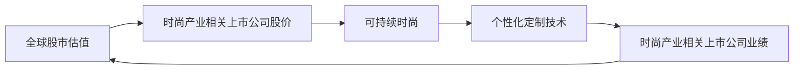

# 全球股市估值与可持续时尚个性化定制技术的关联

> 关键词：全球股市估值、可持续时尚、个性化定制技术、关联分析、市场趋势

> 摘要：本文旨在深入探讨全球股市估值与可持续时尚个性化定制技术之间的关联。通过对相关核心概念的阐述、算法原理的分析、数学模型的构建，结合实际项目案例和应用场景，揭示两者之间潜在的相互影响和作用机制。同时，提供学习资源、开发工具和相关论文的推荐，对未来发展趋势与挑战进行总结，并解答常见问题，为读者全面理解这一复杂的跨领域关系提供有价值的参考。

## 1. 背景介绍 
### 1.1 目的和范围
本研究的主要目的是探究全球股市估值与可持续时尚个性化定制技术之间的内在联系。随着全球经济的发展和消费者意识的转变，可持续时尚和个性化定制技术在时尚产业中日益重要，而股市作为经济的重要晴雨表，其估值受到多种因素的影响。本研究将涵盖全球范围内的股市数据以及可持续时尚个性化定制技术的发展情况，分析两者之间的相关性和相互作用。

### 1.2 预期读者
本文的预期读者包括金融分析师、时尚产业从业者、科技爱好者、投资者以及对跨领域研究感兴趣的学者。对于金融分析师和投资者来说，了解两者之间的关联有助于更准确地评估股市走势和投资机会；时尚产业从业者可以从中获取关于技术发展对市场影响的信息，以制定更合理的发展战略；科技爱好者可以了解到新兴技术在传统产业中的应用；学者则可以将本文作为进一步研究的参考。

### 1.3 文档结构概述
本文将首先介绍相关的核心概念和它们之间的联系，通过文本示意图和 Mermaid 流程图进行直观展示。接着详细阐述核心算法原理和具体操作步骤，并用 Python 源代码进行说明。然后构建数学模型和公式，结合具体例子进行讲解。在项目实战部分，将展示代码实际案例并进行详细解释。之后探讨实际应用场景，推荐相关的学习资源、开发工具和论文著作。最后总结未来发展趋势与挑战，解答常见问题，并提供扩展阅读和参考资料。

### 1.4 术语表
#### 1.4.1 核心术语定义
- **全球股市估值**：指对全球范围内各个股票市场中上市公司股票价值的评估，通常通过各种估值指标如市盈率、市净率等进行衡量。
- **可持续时尚**：强调在时尚产业的生产、消费和处理过程中，充分考虑环境、社会和经济的可持续性，包括使用环保材料、采用可持续生产工艺、关注劳动者权益等。
- **个性化定制技术**：利用先进的信息技术和制造技术，根据消费者的个性化需求，为其提供定制化的产品或服务的技术。

#### 1.4.2 相关概念解释
- **股市波动**：指股票市场价格在一定时间内的上下变动，受到宏观经济因素、行业发展、公司业绩等多种因素的影响。
- **时尚产业供应链**：包括原材料采购、生产制造、物流配送、销售等环节，可持续时尚要求在整个供应链中实现可持续发展。
- **大数据分析**：通过对大量数据的收集、整理和分析，发现数据中的规律和趋势，为决策提供支持，在可持续时尚个性化定制技术中可用于了解消费者需求。

#### 1.4.3 缩略词列表
- **PE**：市盈率（Price-to-Earnings Ratio）
- **PB**：市净率（Price-to-Book Ratio）
- **AI**：人工智能（Artificial Intelligence）
- **IoT**：物联网（Internet of Things）

## 2. 核心概念与联系 
### 核心概念原理
#### 全球股市估值原理
全球股市估值是基于对上市公司未来盈利能力和资产价值的预期。常用的估值方法包括绝对估值法和相对估值法。绝对估值法如现金流折现模型（DCF），通过预测公司未来的现金流量，并将其折现到当前时点来计算股票的内在价值。相对估值法如市盈率法和市净率法，通过与同行业或市场平均水平进行比较来评估股票的相对价值。

#### 可持续时尚原理
可持续时尚的核心是在时尚产业中实现环境、社会和经济的可持续发展。从环境角度来看，要减少对自然资源的消耗，降低环境污染，例如使用可再生材料、推广循环利用等。从社会角度来看，要保障劳动者的权益，促进公平贸易。从经济角度来看，要实现产业的长期稳定发展，提高企业的竞争力。

#### 个性化定制技术原理
个性化定制技术主要基于信息技术和制造技术的融合。通过收集消费者的个性化需求数据，如尺寸、喜好、设计要求等，利用人工智能和大数据分析技术对这些数据进行处理和分析，然后根据分析结果进行产品设计和生产。在制造过程中，采用先进的制造技术如 3D 打印、智能制造等，实现产品的定制化生产。

### 架构的文本示意图
```plaintext
全球股市估值
    |
    | 受到宏观经济、行业发展等因素影响
    |
    v
时尚产业相关上市公司股价
    |
    | 与可持续时尚发展相关
    |
    v
可持续时尚
    |
    | 推动个性化定制技术需求
    |
    v
个性化定制技术
    |
    | 影响时尚产业竞争力和发展前景
    |
    v
时尚产业相关上市公司业绩
    |
    | 反馈到全球股市估值
    |
    v
全球股市估值
```

### Mermaid 流程图


## 3. 核心算法原理 & 具体操作步骤 
### 核心算法原理
为了分析全球股市估值与可持续时尚个性化定制技术之间的关联，我们可以采用多元线性回归分析方法。多元线性回归是一种统计方法，用于建立一个因变量与多个自变量之间的线性关系。在本研究中，我们将全球股市估值作为因变量，将与可持续时尚和个性化定制技术相关的指标作为自变量。

### Python 源代码实现
```python
import numpy as np
import pandas as pd
from sklearn.linear_model import LinearRegression

# 假设我们有以下数据
# 全球股市估值数据
stock_valuation = np.array([100, 110, 120, 130, 140])
# 可持续时尚发展指标（例如环保材料使用率）
sustainable_fashion_index = np.array([0.2, 0.3, 0.4, 0.5, 0.6])
# 个性化定制技术应用指标（例如定制订单占比）
customization_technology_index = np.array([0.1, 0.2, 0.3, 0.4, 0.5])

# 构建自变量矩阵
X = np.column_stack((sustainable_fashion_index, customization_technology_index))
# 因变量
y = stock_valuation

# 创建线性回归模型
model = LinearRegression()
# 拟合模型
model.fit(X, y)

# 输出模型系数和截距
print("模型系数：", model.coef_)
print("模型截距：", model.intercept_)

# 预测新数据
new_X = np.array([[0.7, 0.6]])
prediction = model.predict(new_X)
print("预测的全球股市估值：", prediction)
```

### 具体操作步骤
1. **数据收集**：收集全球股市估值数据、可持续时尚发展指标和个性化定制技术应用指标的数据。这些数据可以从金融数据库、行业报告、市场调研等渠道获取。
2. **数据预处理**：对收集到的数据进行清洗、整理和标准化处理，以确保数据的质量和一致性。
3. **模型构建**：使用多元线性回归模型，将全球股市估值作为因变量，可持续时尚发展指标和个性化定制技术应用指标作为自变量。
4. **模型训练**：使用训练数据对模型进行训练，得到模型的系数和截距。
5. **模型评估**：使用测试数据对模型进行评估，评估指标可以包括均方误差、决定系数等。
6. **预测和分析**：使用训练好的模型对新数据进行预测，并分析可持续时尚和个性化定制技术对全球股市估值的影响。

## 4. 数学模型和公式 & 详细讲解 & 举例说明 
### 数学模型
多元线性回归模型的数学表达式为：
$$y = \beta_0 + \beta_1x_1 + \beta_2x_2 + \epsilon$$
其中，$y$ 是因变量（全球股市估值），$x_1$ 和 $x_2$ 分别是自变量（可持续时尚发展指标和个性化定制技术应用指标），$\beta_0$ 是截距，$\beta_1$ 和 $\beta_2$ 是回归系数，$\epsilon$ 是误差项。

### 公式详细讲解
- **截距 $\beta_0$**：表示当自变量 $x_1$ 和 $x_2$ 都为 0 时，因变量 $y$ 的取值。在本研究中，它可以理解为在没有可持续时尚和个性化定制技术影响的情况下，全球股市的基本估值。
- **回归系数 $\beta_1$ 和 $\beta_2$**：分别表示自变量 $x_1$ 和 $x_2$ 对因变量 $y$ 的影响程度。如果 $\beta_1$ 为正，表示可持续时尚发展指标的增加会导致全球股市估值的上升；如果 $\beta_1$ 为负，则表示相反的关系。同理，$\beta_2$ 反映了个性化定制技术应用指标对全球股市估值的影响。
- **误差项 $\epsilon$**：表示模型无法解释的部分，包括随机因素和未考虑到的变量的影响。

### 举例说明
假设我们通过数据分析得到回归系数 $\beta_0 = 50$，$\beta_1 = 20$，$\beta_2 = 30$。这意味着当可持续时尚发展指标和个性化定制技术应用指标都为 0 时，全球股市的基本估值为 50。如果可持续时尚发展指标增加 1 个单位，全球股市估值将增加 20 个单位；如果个性化定制技术应用指标增加 1 个单位，全球股市估值将增加 30 个单位。

假设当前可持续时尚发展指标为 0.5，个性化定制技术应用指标为 0.4，则根据模型预测的全球股市估值为：
$$y = 50 + 20\times0.5 + 30\times0.4 = 50 + 10 + 12 = 72$$

## 5. 项目实战：代码实际案例和详细解释说明 
### 5.1  开发环境搭建
#### 安装 Python
首先，需要安装 Python 编程语言。可以从 Python 官方网站（https://www.python.org/downloads/）下载适合自己操作系统的 Python 安装包，并按照安装向导进行安装。

#### 安装必要的库
在安装好 Python 后，需要安装一些必要的库，如 NumPy、Pandas、Scikit-learn 等。可以使用以下命令进行安装：
```sh
pip install numpy pandas scikit-learn
```

### 5.2  源代码详细实现和代码解读
```python
import numpy as np
import pandas as pd
from sklearn.linear_model import LinearRegression
from sklearn.model_selection import train_test_split
from sklearn.metrics import mean_squared_error, r2_score

# 模拟数据生成
np.random.seed(42)
n_samples = 100
# 可持续时尚发展指标
sustainable_fashion = np.random.rand(n_samples)
# 个性化定制技术应用指标
customization_technology = np.random.rand(n_samples)
# 全球股市估值
stock_valuation = 50 + 20 * sustainable_fashion + 30 * customization_technology + np.random.randn(n_samples)

# 构建数据集
data = pd.DataFrame({
    'sustainable_fashion': sustainable_fashion,
    'customization_technology': customization_technology,
    'stock_valuation': stock_valuation
})

# 划分训练集和测试集
X = data[['sustainable_fashion', 'customization_technology']]
y = data['stock_valuation']
X_train, X_test, y_train, y_test = train_test_split(X, y, test_size=0.2, random_state=42)

# 创建线性回归模型
model = LinearRegression()
# 拟合模型
model.fit(X_train, y_train)

# 预测
y_pred = model.predict(X_test)

# 模型评估
mse = mean_squared_error(y_test, y_pred)
r2 = r2_score(y_test, y_pred)

print("均方误差：", mse)
print("决定系数：", r2)

# 输出模型系数和截距
print("模型系数：", model.coef_)
print("模型截距：", model.intercept_)
```

### 代码解读与分析
1. **数据生成**：使用 `np.random.rand()` 函数生成模拟的可持续时尚发展指标和个性化定制技术应用指标数据，然后根据多元线性回归模型生成全球股市估值数据。
2. **数据集构建**：使用 Pandas 的 `DataFrame` 构建数据集，将自变量和因变量组合在一起。
3. **数据划分**：使用 `train_test_split()` 函数将数据集划分为训练集和测试集，测试集占比为 20%。
4. **模型训练**：创建线性回归模型并使用训练集数据进行训练。
5. **模型预测**：使用训练好的模型对测试集数据进行预测。
6. **模型评估**：使用均方误差（MSE）和决定系数（$R^2$）对模型进行评估。均方误差衡量了预测值与真实值之间的平均误差，决定系数表示模型对数据的拟合程度，取值范围为 0 到 1，越接近 1 表示拟合效果越好。
7. **输出结果**：输出模型的系数、截距、均方误差和决定系数。

## 6. 实际应用场景 
### 金融投资领域
投资者可以根据可持续时尚和个性化定制技术的发展趋势，调整对时尚产业相关上市公司的投资策略。如果可持续时尚和个性化定制技术发展前景良好，可能会增加对相关股票的投资；反之，则可能减少投资。同时，通过分析两者与全球股市估值的关联，投资者可以更准确地评估股票的价值，降低投资风险。

### 时尚产业决策
时尚企业可以根据全球股市估值的变化，了解市场对可持续时尚和个性化定制技术的认可程度。如果股市估值上升，说明市场对企业在可持续发展和个性化定制方面的努力给予了肯定，企业可以加大在这些方面的投入；反之，企业则需要重新审视自己的发展战略。

### 政策制定
政府和相关监管机构可以根据全球股市估值与可持续时尚个性化定制技术的关联，制定相应的政策。例如，出台鼓励可持续时尚发展的政策，支持企业开展个性化定制业务，以促进时尚产业的可持续发展和提升国家的经济竞争力。

## 7. 工具和资源推荐
### 7.1 学习资源推荐
#### 7.1.1 书籍推荐
- 《金融市场学》：全面介绍了金融市场的基本概念、运行机制和分析方法，有助于读者深入理解全球股市估值的原理和影响因素。
- 《可持续时尚：理论与实践》：详细阐述了可持续时尚的概念、发展现状和实践案例，为读者提供了关于可持续时尚的全面知识。
- 《Python 数据分析实战》：通过实际案例介绍了 Python 在数据分析中的应用，包括数据处理、模型构建和可视化等方面，对于使用 Python 进行相关研究具有重要的参考价值。

#### 7.1.2 在线课程
- Coursera 上的“金融市场分析”课程：由知名教授授课，系统讲解了金融市场的分析方法和工具，帮助学习者掌握股市估值的技巧。
- edX 上的“可持续时尚创新”课程：介绍了可持续时尚的创新模式和实践经验，引导学习者关注时尚产业的可持续发展。
- 网易云课堂上的“Python 数据分析入门”课程：适合初学者学习 Python 数据分析的基础知识和技能。

#### 7.1.3 技术博客和网站
- 金融界网站：提供全球股市的实时行情、分析报告和财经新闻，是了解股市动态的重要渠道。
- 可持续时尚论坛：汇集了全球可持续时尚领域的专家和从业者，分享最新的研究成果和实践经验。
- 掘金社区：有大量关于 Python 数据分析和机器学习的技术文章，对于学习相关技术有很大的帮助。

### 7.2 开发工具框架推荐
#### 7.2.1 IDE和编辑器
- PyCharm：一款功能强大的 Python 集成开发环境，提供代码编辑、调试、版本控制等功能，适合专业的 Python 开发者。
- Jupyter Notebook：一种交互式的开发环境，支持代码、文本、图像等多种形式的展示，非常适合数据分析和机器学习的实验和演示。

#### 7.2.2 调试和性能分析工具
- PDB：Python 自带的调试工具，可以帮助开发者定位代码中的问题。
- cProfile：Python 的性能分析工具，可以分析代码的运行时间和资源消耗情况，帮助开发者优化代码性能。

#### 7.2.3 相关框架和库
- NumPy：Python 的数值计算库，提供了高效的数组操作和数学函数，是数据分析和机器学习的基础库。
- Pandas：用于数据处理和分析的库，提供了强大的数据结构和数据操作功能，方便对数据进行清洗、整理和分析。
- Scikit-learn：Python 的机器学习库，提供了丰富的机器学习算法和工具，包括线性回归、决策树、神经网络等，可用于构建和训练机器学习模型。

### 7.3 相关论文著作推荐
#### 7.3.1 经典论文
- “The Relationship between Stock Market Valuation and Industry Innovation”：研究了股市估值与产业创新之间的关系，为本文研究全球股市估值与可持续时尚个性化定制技术的关联提供了理论基础。
- “Sustainable Fashion: A Review of the Literature”：对可持续时尚领域的研究进行了全面的综述，介绍了可持续时尚的发展现状、挑战和未来趋势。

#### 7.3.2 最新研究成果
- 一些顶级学术期刊如《Journal of Financial Economics》《Journal of Sustainable Fashion》等上发表的关于股市估值、可持续时尚和个性化定制技术的最新研究论文，反映了该领域的前沿动态。

#### 7.3.3 应用案例分析
- 一些知名咨询公司如麦肯锡、波士顿咨询等发布的关于时尚产业可持续发展和个性化定制的报告，包含了大量的实际应用案例和分析，对于理解实际应用场景具有重要的参考价值。

## 8. 总结：未来发展趋势与挑战
### 未来发展趋势
- **技术融合加速**：可持续时尚个性化定制技术将与人工智能、物联网、区块链等新兴技术深度融合，实现更高效、更智能的生产和服务模式。例如，利用物联网技术实现对时尚产品生产过程的实时监控和管理，利用区块链技术实现对产品供应链的追溯和管理。
- **市场需求增长**：随着消费者环保意识和个性化需求的不断提高，可持续时尚个性化定制产品的市场需求将持续增长。这将推动时尚企业加大在可持续发展和个性化定制方面的投入，促进产业的升级和转型。
- **全球合作加强**：可持续时尚和个性化定制是全球性的问题，需要全球各国和企业的共同努力。未来，各国之间将加强在技术研发、标准制定、市场推广等方面的合作，共同推动可持续时尚个性化定制技术的发展。

### 挑战
- **技术难题**：虽然可持续时尚个性化定制技术取得了一定的进展，但仍然面临一些技术难题，如环保材料的研发和应用、个性化定制生产的效率和成本控制等。解决这些技术难题需要大量的研发投入和技术创新。
- **市场接受度**：消费者对可持续时尚个性化定制产品的接受度还需要进一步提高。一方面，消费者对环保产品的认知和信任度有待加强；另一方面，个性化定制产品的价格相对较高，可能会限制一部分消费者的购买意愿。
- **政策法规不完善**：目前，关于可持续时尚和个性化定制的政策法规还不够完善，缺乏统一的标准和规范。这给企业的发展带来了一定的不确定性，也影响了市场的健康发展。

## 9. 附录：常见问题与解答
### 问题 1：全球股市估值与可持续时尚个性化定制技术之间的关联是如何建立的？
答：全球股市估值受到宏观经济、行业发展、公司业绩等多种因素的影响。可持续时尚和个性化定制技术的发展会影响时尚产业相关上市公司的业绩和竞争力，进而影响其股价和股市估值。通过收集相关数据，采用多元线性回归等统计方法，可以建立两者之间的关联模型。

### 问题 2：如何衡量可持续时尚和个性化定制技术的发展程度？
答：可以从多个方面衡量可持续时尚的发展程度，如环保材料的使用率、生产过程中的能源消耗和污染物排放、企业的社会责任履行情况等。个性化定制技术的发展程度可以通过定制订单占比、个性化设计的效率和质量、生产过程的柔性化程度等指标来衡量。

### 问题 3：可持续时尚个性化定制技术对时尚产业的影响有哪些？
答：可持续时尚个性化定制技术可以提高时尚产业的竞争力和可持续发展能力。一方面，它可以满足消费者日益增长的个性化需求，提高消费者的满意度和忠诚度；另一方面，它可以促进时尚产业的绿色发展，减少对环境的影响，实现经济、社会和环境的协调发展。

### 问题 4：如何利用全球股市估值与可持续时尚个性化定制技术的关联进行投资决策？
答：投资者可以关注可持续时尚和个性化定制技术的发展趋势，分析相关上市公司的业绩和竞争力。如果发现某个上市公司在可持续发展和个性化定制方面具有优势，且股市估值相对较低，可以考虑增加对该股票的投资。同时，投资者也需要注意市场风险，合理配置资产。

## 10. 扩展阅读 & 参考资料
### 扩展阅读
- 《时尚产业的数字化转型》：介绍了时尚产业在数字化时代的转型趋势和实践案例，对于理解可持续时尚个性化定制技术在时尚产业中的应用具有重要的参考价值。
- 《金融科技与资本市场》：探讨了金融科技在资本市场中的应用和影响，为进一步研究全球股市估值与新兴技术的关联提供了新的视角。

### 参考资料
- 金融数据库，如 Wind 资讯、Bloomberg 等，提供了全球股市的历史数据和实时行情。
- 行业报告，如时尚产业协会发布的年度报告、咨询公司发布的市场研究报告等，提供了关于可持续时尚和个性化定制技术的发展现状和趋势的信息。
- 学术期刊和会议论文，如《Journal of Financial Economics》《Journal of Sustainable Fashion》等，提供了该领域的最新研究成果和理论基础。

作者：AI天才研究院/AI Genius Institute & 禅与计算机程序设计艺术 /Zen And The Art of Computer Programming