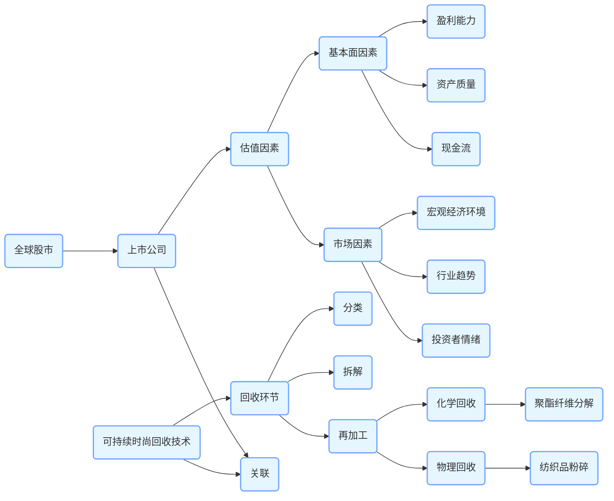

# 全球股市估值与可持续时尚回收技术的关联

> 关键词：全球股市估值、可持续时尚回收技术、市场关联、经济影响、行业发展

> 摘要：本文旨在深入探讨全球股市估值与可持续时尚回收技术之间的关联。首先介绍相关背景信息，明确研究目的、范围、预期读者和文档结构。接着阐述核心概念及其联系，包括全球股市估值和可持续时尚回收技术的原理与架构。详细讲解核心算法原理和具体操作步骤，并运用数学模型和公式进行分析。通过项目实战案例展示代码实现和解读。分析该关联在实际中的应用场景，推荐相关学习资源、开发工具和论文著作。最后总结未来发展趋势与挑战，解答常见问题，并提供扩展阅读和参考资料。

## 1. 背景介绍 
### 1.1 目的和范围
本研究的主要目的是揭示全球股市估值与可持续时尚回收技术之间的内在联系。通过对这两个看似不同领域的研究，为投资者、时尚行业从业者以及政策制定者提供有价值的见解。范围涵盖全球主要股票市场以及可持续时尚回收技术的各个方面，包括技术发展现状、市场规模、行业趋势等。

### 1.2 预期读者
预期读者包括金融投资者，他们希望通过了解这种关联来优化投资组合；时尚行业的专业人士，如设计师、制造商和零售商，有助于他们把握行业发展方向；政策制定者，可为制定相关政策提供参考；以及对可持续发展和金融市场感兴趣的研究人员和学者。

### 1.3 文档结构概述
本文首先介绍背景信息，为后续研究奠定基础。接着阐述核心概念和联系，让读者对相关内容有清晰的认识。详细讲解核心算法原理和具体操作步骤，以及数学模型和公式。通过项目实战案例展示实际应用。分析实际应用场景，推荐相关工具和资源。最后总结未来发展趋势与挑战，解答常见问题并提供扩展阅读和参考资料。

### 1.4 术语表
#### 1.4.1 核心术语定义
- **全球股市估值**：指对全球范围内股票市场中上市公司的价值进行评估，通常通过各种估值方法，如市盈率、市净率等，来衡量股票的相对价值。
- **可持续时尚回收技术**：是指将废弃的时尚产品进行回收、再利用和再生的一系列技术和方法，旨在减少时尚行业对环境的影响，实现资源的可持续利用。

#### 1.4.2 相关概念解释
- **市盈率（P/E Ratio）**：是指股票价格除以每股收益的比率，反映了市场对公司未来盈利的预期。
- **市净率（P/B Ratio）**：是指股票价格除以每股净资产的比率，用于衡量公司的账面价值与市场价值之间的关系。
- **循环经济**：是一种以资源的高效利用和循环利用为核心，以“减量化、再利用、资源化”为原则，以低消耗、低排放、高效率为基本特征的经济发展模式。

#### 1.4.3 缩略词列表
- **P/E**：市盈率（Price-to-Earnings Ratio）
- **P/B**：市净率（Price-to-Book Ratio）
- **ESG**：环境、社会和治理（Environmental, Social and Governance）

## 2. 核心概念与联系 
### 核心概念原理
#### 全球股市估值原理
全球股市估值是基于多种因素对上市公司的价值进行评估。其中，基本面因素包括公司的盈利能力、资产质量、现金流等；市场因素包括宏观经济环境、行业趋势、投资者情绪等。常用的估值方法有绝对估值法和相对估值法。绝对估值法如现金流折现法（DCF），通过预测公司未来的现金流并折现到当前来计算公司的内在价值；相对估值法如市盈率法、市净率法等，通过与同行业或可比公司的估值指标进行比较来评估公司的价值。

#### 可持续时尚回收技术原理
可持续时尚回收技术主要基于循环经济的理念，通过对废弃时尚产品的分类、拆解、再加工等环节，将其转化为可再利用的原材料或新产品。例如，化学回收技术可以将废弃的聚酯纤维分解为单体，再重新合成新的聚酯纤维；物理回收技术可以将废弃的纺织品进行粉碎、梳理，制成新的纤维材料。

### 架构示意图


### 核心概念联系
全球股市估值与可持续时尚回收技术之间存在着多方面的联系。一方面，可持续时尚回收技术的发展会影响时尚行业上市公司的业绩和前景，从而影响其股市估值。例如，采用先进回收技术的公司可能降低生产成本、提高资源利用效率，增强市场竞争力，进而提升其股票价值。另一方面，股市估值也会影响可持续时尚回收技术的发展。如果市场对具有可持续发展概念的时尚公司给予较高的估值，会吸引更多的资金投入到可持续时尚回收技术的研发和应用中，推动技术的进步。

## 3. 核心算法原理 & 具体操作步骤 
### 核心算法原理
在分析全球股市估值与可持续时尚回收技术的关联时，可以采用多元线性回归模型。该模型的基本原理是通过建立因变量（如时尚行业上市公司的股市估值）与多个自变量（如可持续时尚回收技术的应用程度、公司的财务指标等）之间的线性关系，来分析自变量对因变量的影响程度。

多元线性回归模型的一般形式为：

$$Y = \beta_0 + \beta_1X_1 + \beta_2X_2 + \cdots + \beta_nX_n + \epsilon$$

其中，$Y$ 是因变量，$X_1, X_2, \cdots, X_n$ 是自变量，$\beta_0, \beta_1, \beta_2, \cdots, \beta_n$ 是回归系数，$\epsilon$ 是误差项。

### 具体操作步骤
#### 数据收集
收集全球时尚行业上市公司的股市估值数据，如市盈率、市净率等；可持续时尚回收技术的相关数据，如回收利用率、技术研发投入等；以及公司的财务指标数据，如营业收入、净利润等。

#### 数据预处理
对收集到的数据进行清洗、整理和标准化处理，以消除数据中的异常值和量纲影响。

#### 模型建立
使用 Python 的 `statsmodels` 库建立多元线性回归模型，并进行参数估计。

```python
import pandas as pd
import statsmodels.api as sm

# 假设 data 是包含因变量和自变量的数据框
data = pd.read_csv('fashion_data.csv')

# 分离因变量和自变量
X = data[['recycling_rate', 'R&D_investment', 'revenue', 'net_profit']]
y = data['PE_ratio']

# 添加常数项
X = sm.add_constant(X)

# 建立多元线性回归模型
model = sm.OLS(y, X).fit()

# 输出模型结果
print(model.summary())
```

#### 模型评估
通过计算模型的拟合优度（$R^2$）、调整拟合优度（Adjusted $R^2$）、F 检验值等指标，评估模型的拟合效果和显著性。

#### 结果分析
根据模型的回归系数和显著性水平，分析可持续时尚回收技术的应用程度和公司的财务指标对股市估值的影响方向和程度。

## 4. 数学模型和公式 & 详细讲解 & 举例说明 
### 多元线性回归模型
#### 详细讲解
多元线性回归模型是一种常用的统计分析方法，用于研究一个因变量与多个自变量之间的线性关系。在本研究中，我们使用多元线性回归模型来分析可持续时尚回收技术的应用程度和公司的财务指标对时尚行业上市公司股市估值的影响。

模型的参数 $\beta_0, \beta_1, \beta_2, \cdots, \beta_n$ 可以通过最小二乘法进行估计，使得模型的残差平方和最小。残差平方和的计算公式为：

$$RSS = \sum_{i=1}^{m}(y_i - \hat{y}_i)^2$$

其中，$y_i$ 是实际观测值，$\hat{y}_i$ 是模型的预测值。

#### 举例说明
假设我们收集了 100 家时尚行业上市公司的数据，包括市盈率（$Y$）、回收利用率（$X_1$）、技术研发投入（$X_2$）、营业收入（$X_3$）和净利润（$X_4$）。通过建立多元线性回归模型，得到如下结果：

$$\hat{Y} = 10 + 2X_1 + 1.5X_2 + 0.01X_3 + 0.2X_4$$

这意味着，在其他因素不变的情况下，回收利用率每提高 1 个单位，市盈率平均增加 2 个单位；技术研发投入每增加 1 个单位，市盈率平均增加 1.5 个单位；营业收入每增加 1 个单位，市盈率平均增加 0.01 个单位；净利润每增加 1 个单位，市盈率平均增加 0.2 个单位。

### 拟合优度（$R^2$）
#### 详细讲解
拟合优度（$R^2$）是衡量回归模型拟合效果的一个重要指标，它表示因变量的变异中可以由自变量解释的比例。$R^2$ 的取值范围在 0 到 1 之间，$R^2$ 越接近 1，说明模型的拟合效果越好。

$R^2$ 的计算公式为：

$$R^2 = 1 - \frac{RSS}{TSS}$$

其中，$RSS$ 是残差平方和，$TSS$ 是总离差平方和，计算公式为：

$$TSS = \sum_{i=1}^{m}(y_i - \bar{y})^2$$

#### 举例说明
假设我们的多元线性回归模型的 $R^2$ 值为 0.8，这意味着因变量（市盈率）的 80% 的变异可以由自变量（回收利用率、技术研发投入、营业收入和净利润）来解释，说明模型的拟合效果较好。

### 调整拟合优度（Adjusted $R^2$）
#### 详细讲解
调整拟合优度（Adjusted $R^2$）是对 $R^2$ 的一种修正，它考虑了模型中自变量的个数。当模型中加入过多的自变量时，$R^2$ 可能会虚高，而 Adjusted $R^2$ 可以避免这种情况。

Adjusted $R^2$ 的计算公式为：

$$Adjusted\ R^2 = 1 - \frac{(1 - R^2)(m - 1)}{m - n - 1}$$

其中，$m$ 是样本数量，$n$ 是自变量的个数。

#### 举例说明
假设我们的多元线性回归模型有 100 个样本，4 个自变量，$R^2$ 值为 0.8。则 Adjusted $R^2$ 的计算如下：

$$Adjusted\ R^2 = 1 - \frac{(1 - 0.8)(100 - 1)}{100 - 4 - 1} \approx 0.78$$

这表明，考虑了自变量的个数后，模型的拟合效果略有下降。

## 5. 项目实战：代码实际案例和详细解释说明 
### 5.1  开发环境搭建
#### 安装 Python
首先，需要安装 Python 编程语言。可以从 Python 官方网站（https://www.python.org/downloads/）下载适合自己操作系统的 Python 版本，并按照安装向导进行安装。

#### 安装必要的库
在项目中，我们需要使用 `pandas`、`statsmodels` 等库。可以使用以下命令进行安装：

```sh
pip install pandas statsmodels
```

### 5.2  源代码详细实现和代码解读
```python
import pandas as pd
import statsmodels.api as sm

# 读取数据
data = pd.read_csv('fashion_data.csv')

# 分离因变量和自变量
X = data[['recycling_rate', 'R&D_investment', 'revenue', 'net_profit']]
y = data['PE_ratio']

# 添加常数项
X = sm.add_constant(X)

# 建立多元线性回归模型
model = sm.OLS(y, X).fit()

# 输出模型结果
print(model.summary())
```

#### 代码解读
1. **导入必要的库**：导入 `pandas` 用于数据处理，`statsmodels.api` 用于建立和拟合多元线性回归模型。
2. **读取数据**：使用 `pandas` 的 `read_csv` 函数读取存储在 `fashion_data.csv` 文件中的数据。
3. **分离因变量和自变量**：将数据集中的市盈率（`PE_ratio`）作为因变量，回收利用率（`recycling_rate`）、技术研发投入（`R&D_investment`）、营业收入（`revenue`）和净利润（`net_profit`）作为自变量。
4. **添加常数项**：在自变量矩阵中添加常数项，以便模型可以估计截距项。
5. **建立多元线性回归模型**：使用 `statsmodels` 的 `OLS` 函数建立普通最小二乘回归模型，并使用 `fit` 方法进行拟合。
6. **输出模型结果**：使用 `summary` 方法输出模型的详细结果，包括回归系数、拟合优度、F 检验值等。

### 5.3  代码解读与分析
#### 回归系数分析
通过模型的回归系数，可以分析自变量对因变量的影响方向和程度。例如，如果回收利用率的回归系数为正，说明回收利用率的提高会导致市盈率的增加；如果回归系数为负，则说明回收利用率的提高会导致市盈率的降低。

#### 显著性分析
模型结果中的 `P>|t|` 列表示回归系数的显著性水平。如果 `P>|t|` 的值小于 0.05，则说明该自变量对因变量的影响是显著的；否则，说明该自变量对因变量的影响不显著。

#### 拟合优度分析
模型结果中的 `R-squared` 和 `Adj. R-squared` 分别表示拟合优度和调整拟合优度。可以通过这两个指标评估模型的拟合效果，拟合优度越高，说明模型对数据的拟合效果越好。

## 6. 实际应用场景 
### 投资决策
投资者可以通过分析全球股市估值与可持续时尚回收技术的关联，来选择具有投资价值的时尚行业上市公司。如果一家公司在可持续时尚回收技术方面有较大的投入和较好的应用效果，并且其股市估值相对较低，那么该公司可能具有较大的投资潜力。

### 行业发展战略制定
时尚行业的企业可以根据股市估值对可持续时尚回收技术的反馈，制定合理的发展战略。例如，如果市场对采用可持续时尚回收技术的公司给予较高的估值，企业可以加大在这方面的研发和应用投入，以提升自身的市场竞争力。

### 政策制定
政策制定者可以通过了解全球股市估值与可持续时尚回收技术的关联，制定相关政策来推动可持续时尚行业的发展。例如，对采用先进回收技术的企业给予税收优惠、财政补贴等政策支持，以鼓励企业加大在可持续发展方面的投入。

### 消费者教育
通过宣传全球股市估值与可持续时尚回收技术的关联，可以提高消费者对可持续时尚的认识和关注度。消费者在购买时尚产品时，可以更加倾向于选择采用可持续回收技术的品牌，从而推动整个时尚行业向可持续方向发展。

## 7. 工具和资源推荐
### 7.1 学习资源推荐
#### 7.1.1 书籍推荐
- 《金融市场与金融机构》：全面介绍了金融市场的基本概念、运行机制和金融机构的业务活动，有助于读者了解全球股市的基本情况。
- 《可持续时尚：从理念到实践》：深入探讨了可持续时尚的发展趋势、技术应用和商业模式，为读者提供了可持续时尚回收技术的相关知识。
- 《多元统计分析》：详细讲解了多元线性回归等统计分析方法的原理和应用，对于理解和分析全球股市估值与可持续时尚回收技术的关联具有重要的参考价值。

#### 7.1.2 在线课程
- Coursera 上的“金融市场”课程：由知名教授授课，系统介绍了金融市场的理论和实践，包括股市估值的方法和技巧。
- edX 上的“可持续时尚创新”课程：提供了可持续时尚回收技术的最新研究成果和实践案例，帮助学员了解该领域的发展动态。
- Udemy 上的“Python 数据分析实战”课程：通过实际案例讲解 Python 在数据分析中的应用，包括数据处理、模型建立和结果分析等方面，对于进行相关数据分析具有重要的帮助。

#### 7.1.3 技术博客和网站
- Seeking Alpha：提供全球股市的分析和评论，包括时尚行业上市公司的估值分析和投资建议。
- Fashion Revolution：专注于可持续时尚的研究和推广，提供可持续时尚回收技术的最新消息和行业动态。
- Towards Data Science：分享数据科学和机器学习的技术文章和案例，对于学习和应用多元线性回归模型进行数据分析具有一定的参考价值。

### 7.2 开发工具框架推荐
#### 7.2.1 IDE和编辑器
- PyCharm：一款功能强大的 Python 集成开发环境，提供代码编辑、调试、版本控制等功能，适合进行数据分析和模型开发。
- Jupyter Notebook：一种交互式的开发环境，支持 Python、R 等多种编程语言，方便进行数据探索、模型建立和结果展示。
- Visual Studio Code：一款轻量级的代码编辑器，支持多种编程语言和插件扩展，可用于编写和调试 Python 代码。

#### 7.2.2 调试和性能分析工具
- pdb：Python 自带的调试工具，可以帮助开发者逐行调试代码，查找和解决代码中的问题。
- cProfile：Python 的性能分析工具，可以分析代码的运行时间和函数调用情况，帮助开发者优化代码性能。
- Spyder：一款集成了调试和性能分析功能的 Python 开发环境，适合初学者使用。

#### 7.2.3 相关框架和库
- pandas：Python 的数据处理库，提供了高效的数据结构和数据操作方法，用于数据清洗、整理和分析。
- statsmodels：Python 的统计分析库，支持多种统计模型的建立和拟合，包括多元线性回归模型。
- scikit-learn：Python 的机器学习库，提供了丰富的机器学习算法和工具，可用于数据建模和预测。

### 7.3 相关论文著作推荐
#### 7.3.1 经典论文
- "The Capital Asset Pricing Model: Theory and Evidence"：该论文系统阐述了资本资产定价模型（CAPM）的理论和实证研究，对于理解股市估值的基本原理具有重要的参考价值。
- "Sustainable Fashion: A Review of the Literature"：对可持续时尚领域的研究进行了全面的综述，包括可持续时尚回收技术的发展现状和趋势。
- "Multiple Regression Analysis: Applications"：详细介绍了多元线性回归分析的应用方法和案例，为进行相关数据分析提供了理论支持。

#### 7.3.2 最新研究成果
- 关注国际知名学术期刊，如《Journal of Financial Economics》、《Sustainable Production and Consumption》等，获取全球股市估值和可持续时尚回收技术领域的最新研究成果。
- 参加相关的学术会议和研讨会，与国内外的专家学者交流和分享最新的研究进展。

#### 7.3.3 应用案例分析
- 研究国内外时尚行业上市公司的年报和财务报告，了解它们在可持续时尚回收技术方面的应用情况和对股市估值的影响。
- 分析成功的可持续时尚品牌案例，如 Patagonia、Eileen Fisher 等，学习它们在可持续发展和市场竞争方面的经验和做法。

## 8. 总结：未来发展趋势与挑战
### 未来发展趋势
#### 市场关注度提升
随着消费者对可持续发展的关注度不断提高，市场对具有可持续时尚回收技术的企业将给予更多的关注和认可。这将促使更多的时尚行业上市公司加大在这方面的投入，推动可持续时尚回收技术的广泛应用。

#### 技术创新加速
为了满足市场需求和提高资源利用效率，可持续时尚回收技术将不断创新和发展。例如，新型的化学回收技术和生物降解材料的研发将为时尚行业的可持续发展提供更多的解决方案。

#### 行业整合加剧
在可持续发展的趋势下，时尚行业将面临整合和洗牌。具有先进回收技术和可持续发展理念的企业将更具竞争力，而那些忽视可持续发展的企业可能会被市场淘汰。

### 挑战
#### 技术成本高
目前，可持续时尚回收技术的研发和应用成本较高，这限制了其在行业内的广泛推广。企业需要在技术创新和成本控制之间找到平衡，以提高技术的经济性和可行性。

#### 标准和规范不完善
可持续时尚回收技术的标准和规范还不够完善，这导致市场上的产品质量参差不齐。建立统一的标准和规范，加强市场监管，是推动可持续时尚回收技术健康发展的关键。

#### 消费者认知不足
虽然消费者对可持续发展的关注度有所提高，但对可持续时尚回收技术的认知仍然不足。需要加强消费者教育，提高消费者对可持续时尚产品的认知和购买意愿。

## 9. 附录：常见问题与解答
### 问题 1：全球股市估值与可持续时尚回收技术之间的关联是否具有普遍性？
答：全球股市估值与可持续时尚回收技术之间的关联在一定程度上具有普遍性，但也受到不同地区、不同市场和不同行业的影响。在一些对可持续发展较为重视的地区和市场，这种关联可能更为明显；而在一些对可持续发展关注度较低的地区和市场，这种关联可能相对较弱。

### 问题 2：如何衡量可持续时尚回收技术的应用程度？
答：可以从多个方面衡量可持续时尚回收技术的应用程度，如回收利用率、技术研发投入、产品中回收材料的比例等。回收利用率是指回收的废弃时尚产品占总废弃时尚产品的比例；技术研发投入是指企业在可持续时尚回收技术研发方面的资金投入；产品中回收材料的比例是指产品中使用的回收材料占总材料的比例。

### 问题 3：多元线性回归模型是否是分析全球股市估值与可持续时尚回收技术关联的最佳方法？
答：多元线性回归模型是一种常用的分析方法，但不一定是最佳方法。具体选择哪种方法需要根据数据的特点和研究的目的来决定。除了多元线性回归模型外，还可以使用其他方法，如时间序列分析、机器学习算法等。

### 问题 4：可持续时尚回收技术的发展对时尚行业的就业有何影响？
答：可持续时尚回收技术的发展将对时尚行业的就业产生多方面的影响。一方面，技术的发展将创造新的就业机会，如回收技术研发、回收环节的操作和管理等；另一方面，一些传统的生产环节可能会受到影响，导致部分就业岗位的减少。总体而言，可持续时尚回收技术的发展将推动时尚行业的就业结构发生变化。

## 10. 扩展阅读 & 参考资料
### 扩展阅读
- 《循环经济：从理论到实践》：深入探讨了循环经济的理论和实践，为理解可持续时尚回收技术的发展提供了更广阔的视角。
- 《金融科技与金融创新》：介绍了金融科技在金融市场中的应用和创新，对于了解股市估值的新方法和技术具有一定的参考价值。
- 《时尚产业经济学》：系统阐述了时尚产业的经济规律和发展趋势，有助于读者更好地理解时尚行业上市公司的股市估值。

### 参考资料
- 相关的财经新闻网站和数据库，如 Bloomberg、Reuters 等，提供了全球股市的实时数据和分析报告。
- 时尚行业的行业报告和研究机构的研究成果，如 McKinsey & Company、Bain & Company 等，提供了可持续时尚回收技术的市场规模、发展趋势等方面的信息。
- 学术期刊和会议论文，如《Journal of Financial Economics》、《Sustainable Production and Consumption》等，提供了全球股市估值和可持续时尚回收技术领域的最新研究成果。

作者：AI天才研究院/AI Genius Institute & 禅与计算机程序设计艺术 /Zen And The Art of Computer Programming