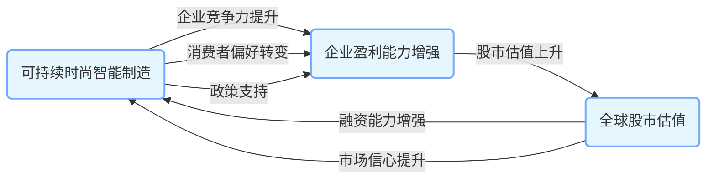

# 全球股市估值与可持续时尚智能制造的关联

> 关键词：全球股市估值、可持续时尚、智能制造、关联分析、经济影响

> 摘要：本文旨在深入探讨全球股市估值与可持续时尚智能制造之间的关联。通过对相关核心概念的阐述、算法原理的分析、数学模型的构建，结合实际案例进行研究。详细介绍了可持续时尚智能制造的发展现状和对全球股市估值的影响机制，分析了两者之间的相互作用关系。同时提供了项目实战案例、实际应用场景分析以及相关工具和资源推荐，最后对未来发展趋势与挑战进行了总结，并给出常见问题解答和扩展阅读参考资料，为相关领域的研究和实践提供全面且深入的指导。

## 1. 背景介绍 
### 1.1 目的和范围
本研究的主要目的是揭示全球股市估值与可持续时尚智能制造之间的内在关联。全球股市估值反映了整个股票市场的价值水平，受到众多宏观和微观因素的影响。而可持续时尚智能制造作为新兴的产业模式，融合了可持续发展理念、时尚设计和先进的制造技术，正逐渐改变着传统时尚产业的格局。本研究将探讨可持续时尚智能制造的发展如何影响全球股市中相关企业的估值，以及股市估值的变化又如何反馈到可持续时尚智能制造的发展中。研究范围涵盖了全球主要股票市场以及在可持续时尚智能制造领域具有代表性的企业。

### 1.2 预期读者
本文预期读者包括金融分析师、股票投资者、时尚产业从业者、智能制造专家、学术研究人员以及对经济和产业发展感兴趣的人士。金融分析师和股票投资者可以通过本文了解可持续时尚智能制造对股市估值的影响，为投资决策提供参考；时尚产业从业者和智能制造专家可以从中获取关于产业发展与金融市场互动的信息，以制定更合理的企业战略；学术研究人员可以将本文作为进一步深入研究的基础；而对经济和产业发展感兴趣的人士则可以通过本文了解这两个看似不同领域之间的紧密联系。

### 1.3 文档结构概述
本文首先对相关的核心概念进行介绍，明确全球股市估值、可持续时尚和智能制造的定义和内涵，并展示它们之间的联系。接着阐述核心算法原理和具体操作步骤，通过 Python 代码详细说明如何进行相关分析。然后建立数学模型和公式，对两者的关联进行量化分析，并举例说明。之后通过项目实战案例，展示如何在实际中应用相关理论和方法。再介绍可持续时尚智能制造在实际中的应用场景，以及推荐相关的学习资源、开发工具和研究论文。最后总结未来发展趋势与挑战，解答常见问题，并提供扩展阅读和参考资料。

### 1.4 术语表
#### 1.4.1 核心术语定义
- **全球股市估值**：指对全球范围内各个股票市场中上市公司股票价值的总体评估。通常通过一些指标来衡量，如市盈率（P/E）、市净率（P/B）等，反映了市场对上市公司未来盈利能力和资产价值的预期。
- **可持续时尚**：是一种在时尚产业中追求环境、社会和经济可持续发展的理念和实践。它包括使用环保材料、采用可持续的生产方式、关注劳工权益等方面，旨在减少时尚产业对环境的负面影响，促进社会公平和经济的长期稳定发展。
- **智能制造**：是一种基于新一代信息技术，贯穿于设计、生产、管理、服务等制造活动各个环节，具有信息深度自感知、智慧优化自决策、精准控制自执行等功能的先进制造过程、系统与模式的总称。在可持续时尚领域，智能制造可以提高生产效率、降低成本、实现个性化定制等。

#### 1.4.2 相关概念解释
- **市盈率（P/E）**：是指股票价格除以每股收益（EPS）的比率。它反映了市场对公司盈利能力的预期，较高的市盈率通常意味着市场对公司未来的盈利增长有较高的期望。
- **市净率（P/B）**：是指股票价格与每股净资产的比率。它衡量了市场对公司净资产的估值，市净率大于 1 表示市场对公司的估值高于其净资产价值。
- **循环经济**：是可持续时尚中的一个重要概念，它强调资源的循环利用和减少废弃物的产生。在时尚产业中，循环经济可以通过回收利用旧衣物、使用再生材料等方式实现。

#### 1.4.3 缩略词列表
- **P/E**：Price-to-Earnings Ratio，市盈率
- **P/B**：Price-to-Book Ratio，市净率
- **AI**：Artificial Intelligence，人工智能
- **IoT**：Internet of Things，物联网

## 2. 核心概念与联系 
### 核心概念原理
#### 全球股市估值
全球股市估值是基于市场参与者对上市公司未来现金流的预期。投资者通过分析公司的财务报表、行业前景、宏观经济环境等因素，来评估公司的价值。股市估值的变化反映了市场对公司盈利能力和风险的重新评估。例如，当市场预期某公司未来盈利将大幅增长时，其股票价格可能会上涨，市盈率也会相应提高。

#### 可持续时尚
可持续时尚的原理在于平衡时尚产业的经济利益与环境和社会影响。它要求在整个时尚产业链中，从原材料采购、生产制造到销售和消费，都要遵循可持续发展的原则。例如，使用有机棉、再生聚酯纤维等环保材料，减少化学染料的使用，提高能源效率，保障工人的合理权益等。

#### 智能制造
智能制造的核心原理是利用信息技术实现生产过程的自动化、智能化和网络化。通过传感器、物联网、大数据分析和人工智能等技术，实现生产设备的实时监控和优化控制，提高生产效率和产品质量。例如，在时尚制造中，智能制造可以实现服装的个性化定制，根据消费者的身体尺寸和喜好进行精准生产。

### 架构的文本示意图
全球股市估值与可持续时尚智能制造之间存在着复杂的相互关系。可持续时尚智能制造的发展可以通过多种途径影响全球股市估值：
- **企业竞争力提升**：采用可持续时尚智能制造模式的企业，由于其环保、高效的生产方式，可能会降低成本、提高产品质量，从而增强市场竞争力。这将使企业的盈利能力提高，进而提升其在股市中的估值。
- **消费者偏好转变**：随着消费者环保意识的增强，对可持续时尚产品的需求不断增加。生产可持续时尚产品的企业将更容易获得消费者的青睐，销售额和利润有望增长，推动股市估值上升。
- **政策支持**：政府对可持续发展的重视和相关政策的出台，将为可持续时尚智能制造企业提供更多的发展机会和优惠政策。这将改善企业的经营环境，提高其市场预期，对股市估值产生积极影响。

反之，全球股市估值的变化也会影响可持续时尚智能制造的发展：
- **融资能力**：股市估值较高的企业更容易通过股权融资获得资金，用于研发和扩大生产规模，从而推动可持续时尚智能制造技术的创新和应用。
- **市场信心**：股市的整体表现和相关企业的估值变化会影响市场参与者的信心。如果股市对可持续时尚智能制造企业的估值较高，将吸引更多的投资者和资源进入该领域，促进产业的发展。

### Mermaid 流程图


## 3. 核心算法原理 & 具体操作步骤 
### 核心算法原理
为了分析全球股市估值与可持续时尚智能制造之间的关联，我们可以采用多元线性回归模型。该模型可以帮助我们量化可持续时尚智能制造相关因素对股市估值的影响程度。

多元线性回归模型的一般形式为：
$$Y = \beta_0 + \beta_1X_1 + \beta_2X_2 + \cdots + \beta_nX_n + \epsilon$$
其中，$Y$ 是因变量，即全球股市估值（例如市盈率）；$X_1, X_2, \cdots, X_n$ 是自变量，代表可持续时尚智能制造的相关因素，如企业的环保投入、智能制造技术的应用程度等；$\beta_0$ 是截距项，$\beta_1, \beta_2, \cdots, \beta_n$ 是回归系数，反映了自变量对因变量的影响程度；$\epsilon$ 是误差项，代表模型无法解释的随机因素。

### 具体操作步骤
#### 数据收集
收集全球股市中与可持续时尚智能制造相关企业的财务数据和业务数据。财务数据包括市盈率、市净率、营业收入、净利润等；业务数据包括环保投入金额、智能制造技术的应用指标（如自动化生产设备的占比）等。

#### 数据预处理
对收集到的数据进行清洗和整理，处理缺失值和异常值。可以采用均值填充、中位数填充等方法处理缺失值，通过箱线图等方法识别和处理异常值。

#### 模型建立
使用 Python 的 `statsmodels` 库建立多元线性回归模型。以下是示例代码：
```python
import pandas as pd
import statsmodels.api as sm

# 假设 data 是包含因变量和自变量的数据框
# Y 是因变量（股市估值），X 是自变量（可持续时尚智能制造相关因素）
data = pd.read_csv('data.csv')
Y = data['PE_ratio']  # 假设市盈率作为因变量
X = data[['environmental_investment', 'smart_manufacturing_ratio']]  # 假设环保投入和智能制造比例作为自变量

# 添加常数项
X = sm.add_constant(X)

# 建立模型
model = sm.OLS(Y, X).fit()

# 查看模型结果
print(model.summary())
```

#### 模型评估
通过查看回归模型的统计指标，如 $R^2$ 值、调整 $R^2$ 值、F 统计量、P 值等，评估模型的拟合优度和显著性。$R^2$ 值越接近 1，说明模型对数据的拟合程度越好；P 值小于 0.05 表示自变量对因变量有显著影响。

#### 结果分析
根据回归系数的正负和大小，分析可持续时尚智能制造相关因素对全球股市估值的影响方向和程度。正的回归系数表示该因素与股市估值呈正相关，负的回归系数表示呈负相关。

## 4. 数学模型和公式 & 详细讲解 & 举例说明 
### 数学模型
如前所述，我们使用多元线性回归模型来分析全球股市估值与可持续时尚智能制造之间的关联。模型的一般形式为：
$$Y = \beta_0 + \beta_1X_1 + \beta_2X_2 + \cdots + \beta_nX_n + \epsilon$$
其中，$Y$ 代表全球股市估值，$X_i$ 代表第 $i$ 个可持续时尚智能制造相关因素，$\beta_i$ 是对应的回归系数，$\epsilon$ 是误差项。

### 详细讲解
- **截距项 $\beta_0$**：表示当所有自变量都为 0 时，因变量 $Y$ 的取值。在实际应用中，它可能没有明确的经济意义，但在模型中起到调整的作用。
- **回归系数 $\beta_i$**：衡量了自变量 $X_i$ 对因变量 $Y$ 的影响程度。例如，如果 $\beta_1$ 表示环保投入对股市估值的影响系数，$\beta_1 > 0$ 说明环保投入的增加会导致股市估值上升，$\beta_1 < 0$ 则表示相反的关系。
- **误差项 $\epsilon$**：反映了模型无法解释的随机因素。这些因素可能包括市场的突发波动、宏观经济政策的意外变化等。

### 举例说明
假设我们有以下数据：
| 企业编号 | 市盈率（$Y$） | 环保投入（$X_1$，单位：万元） | 智能制造比例（$X_2$） |
| ---- | ---- | ---- | ---- |
| 1 | 20 | 100 | 0.3 |
| 2 | 25 | 150 | 0.4 |
| 3 | 30 | 200 | 0.5 |
| 4 | 35 | 250 | 0.6 |
| 5 | 40 | 300 | 0.7 |

使用 Python 代码建立多元线性回归模型：
```python
import pandas as pd
import statsmodels.api as sm

data = {
    'PE_ratio': [20, 25, 30, 35, 40],
    'environmental_investment': [100, 150, 200, 250, 300],
    'smart_manufacturing_ratio': [0.3, 0.4, 0.5, 0.6, 0.7]
}
df = pd.DataFrame(data)

Y = df['PE_ratio']
X = df[['environmental_investment', 'smart_manufacturing_ratio']]
X = sm.add_constant(X)

model = sm.OLS(Y, X).fit()
print(model.summary())
```

运行上述代码后，我们可以得到回归系数 $\beta_0$、$\beta_1$ 和 $\beta_2$ 的估计值。假设 $\beta_1 = 0.1$，$\beta_2 = 10$，这意味着在其他因素不变的情况下，环保投入每增加 1 万元，市盈率将增加 0.1；智能制造比例每提高 1%，市盈率将增加 10。

## 5. 项目实战：代码实际案例和详细解释说明 
### 5.1  开发环境搭建
#### 操作系统
可以选择 Windows、Linux 或 macOS 操作系统，根据个人习惯和实际需求进行选择。

#### Python 环境
安装 Python 3.7 及以上版本。可以从 Python 官方网站（https://www.python.org/downloads/）下载安装包进行安装。

#### 安装必要的库
使用 `pip` 命令安装以下必要的 Python 库：
```sh
pip install pandas statsmodels numpy matplotlib
```
- `pandas`：用于数据处理和分析。
- `statsmodels`：用于建立和评估回归模型。
- `numpy`：用于数值计算。
- `matplotlib`：用于数据可视化。

### 5.2  源代码详细实现和代码解读
以下是一个完整的项目实战代码示例，用于分析全球股市估值与可持续时尚智能制造之间的关联：
```python
import pandas as pd
import statsmodels.api as sm
import numpy as np
import matplotlib.pyplot as plt

# 读取数据
data = pd.read_csv('sustainable_fashion_stock.csv')

# 数据预处理
# 处理缺失值，使用均值填充
data.fillna(data.mean(), inplace=True)

# 提取因变量和自变量
Y = data['PE_ratio']
X = data[['environmental_investment', 'smart_manufacturing_ratio', 'sales_growth']]

# 添加常数项
X = sm.add_constant(X)

# 建立多元线性回归模型
model = sm.OLS(Y, X).fit()

# 查看模型结果
print(model.summary())

# 可视化预测结果
y_pred = model.predict(X)
plt.scatter(Y, y_pred)
plt.xlabel('Actual PE Ratio')
plt.ylabel('Predicted PE Ratio')
plt.title('Actual vs Predicted PE Ratio')
plt.show()
```

### 代码解读与分析
- **数据读取**：使用 `pandas` 的 `read_csv` 函数读取存储在 `sustainable_fashion_stock.csv` 文件中的数据。
- **数据预处理**：使用 `fillna` 方法处理缺失值，将缺失值用该列的均值进行填充。
- **提取因变量和自变量**：将市盈率（`PE_ratio`）作为因变量，环保投入（`environmental_investment`）、智能制造比例（`smart_manufacturing_ratio`）和销售增长率（`sales_growth`）作为自变量。
- **添加常数项**：使用 `sm.add_constant` 函数为自变量添加常数项，以便进行回归分析。
- **建立模型**：使用 `sm.OLS` 函数建立普通最小二乘回归模型，并使用 `fit` 方法拟合数据。
- **查看模型结果**：使用 `summary` 方法查看回归模型的详细统计信息，包括回归系数、$R^2$ 值、P 值等。
- **可视化预测结果**：使用 `matplotlib` 库绘制实际市盈率和预测市盈率的散点图，直观地展示模型的预测效果。

## 6. 实际应用场景 
### 投资决策
投资者可以利用全球股市估值与可持续时尚智能制造之间的关联，做出更明智的投资决策。例如，当发现某可持续时尚智能制造企业的环保投入和智能制造技术应用程度不断提高，而其股市估值相对较低时，可能意味着该企业具有较大的投资潜力。投资者可以通过分析相关数据和模型，筛选出具有投资价值的企业。

### 企业战略规划
可持续时尚智能制造企业可以根据股市估值的反馈，调整自身的战略规划。如果股市对环保投入和智能制造技术应用程度较高的企业给予较高的估值，企业可以加大在这些方面的投入，以提升自身的市场竞争力和股市估值。同时，企业还可以根据市场需求和投资者的预期，优化产品设计和生产流程，实现可持续发展。

### 政策制定
政府和监管机构可以通过研究全球股市估值与可持续时尚智能制造之间的关联，制定相关的政策和法规。例如，为了促进可持续时尚智能制造的发展，可以出台税收优惠政策、补贴政策等，鼓励企业加大环保投入和智能制造技术的应用。同时，加强对企业的监管，确保其在可持续发展方面的承诺得到落实。

### 行业研究
学术研究人员和行业分析师可以通过对全球股市估值与可持续时尚智能制造的关联进行深入研究，了解行业的发展趋势和规律。这有助于预测行业的未来发展方向，为企业和投资者提供参考。例如，研究可以发现可持续时尚智能制造的发展对不同地区和不同规模企业的影响差异，为企业制定差异化的发展战略提供依据。

## 7. 工具和资源推荐
### 7.1 学习资源推荐
#### 7.1.1 书籍推荐
- 《可持续时尚：理论与实践》：本书全面介绍了可持续时尚的概念、原则和实践方法，包括环保材料的应用、可持续生产流程、循环经济等方面的内容。
- 《智能制造：从理念到实践》：深入探讨了智能制造的技术原理、应用案例和发展趋势，对理解可持续时尚智能制造中的技术应用有很大帮助。
- 《金融市场分析与投资策略》：涵盖了股市估值的基本理论和方法，以及如何进行投资分析和决策，为研究全球股市估值与可持续时尚智能制造的关联提供了金融方面的知识基础。

#### 7.1.2 在线课程
- Coursera 上的“可持续发展与时尚产业”课程：由知名高校的教授授课，介绍了可持续时尚的发展现状和未来趋势，以及相关的政策和实践。
- edX 上的“智能制造技术与应用”课程：系统讲解了智能制造的关键技术，如物联网、大数据、人工智能等在制造业中的应用。
- Udemy 上的“股市投资分析实战”课程：通过实际案例，教授如何进行股市估值分析和投资决策。

#### 7.1.3 技术博客和网站
- GreenBiz：提供了关于可持续发展和绿色商业的最新资讯和研究报告，包括可持续时尚领域的动态。
- IndustryWeek：专注于制造业的发展和创新，有很多关于智能制造的技术文章和案例分析。
- Seeking Alpha：是一个金融分析和投资研究的平台，有大量关于股市估值和投资策略的文章和讨论。

### 7.2 开发工具框架推荐
#### 7.2.1 IDE和编辑器
- PyCharm：是一款专业的 Python 集成开发环境，具有代码编辑、调试、版本控制等功能，适合开发数据分析和机器学习项目。
- Jupyter Notebook：是一个交互式的开发环境，支持 Python、R 等多种编程语言，方便进行数据探索和模型开发。
- Visual Studio Code：是一款轻量级的代码编辑器，支持多种编程语言和插件扩展，可用于快速编写和调试代码。

#### 7.2.2 调试和性能分析工具
- `pdb`：是 Python 内置的调试工具，可以在代码中设置断点，逐步执行代码，查看变量的值和程序的执行流程。
- `cProfile`：用于分析 Python 代码的性能，找出代码中的瓶颈部分，以便进行优化。
- `memory_profiler`：可以监控 Python 程序的内存使用情况，帮助发现内存泄漏等问题。

#### 7.2.3 相关框架和库
- `pandas`：是 Python 中用于数据处理和分析的核心库，提供了高效的数据结构和数据操作方法。
- `statsmodels`：用于建立和评估统计模型，包括线性回归、逻辑回归等多种模型。
- `scikit-learn`：是一个强大的机器学习库，提供了各种机器学习算法和工具，可用于数据挖掘和预测分析。

### 7.3 相关论文著作推荐
#### 7.3.1 经典论文
- "Sustainable Fashion: An Exploration of Consumer Perceptions and Preferences"：探讨了消费者对可持续时尚的认知和偏好，为可持续时尚产业的发展提供了市场需求方面的理论支持。
- "The Impact of Smart Manufacturing on Firm Performance: Evidence from the Manufacturing Industry"：研究了智能制造对企业绩效的影响，为可持续时尚智能制造企业的战略决策提供了参考。
- "Stock Market Valuation and Corporate Social Responsibility: A Meta - analysis"：通过元分析的方法，研究了股市估值与企业社会责任之间的关系，对理解可持续时尚智能制造与股市估值的关联有一定的借鉴意义。

#### 7.3.2 最新研究成果
- 关注顶级学术期刊如《Journal of Sustainable Fashion and Textiles》、《Manufacturing & Service Operations Management》等，这些期刊会发表关于可持续时尚和智能制造的最新研究成果。
- 参加相关的学术会议，如国际可持续时尚研讨会、智能制造国际会议等，了解行业内的前沿研究动态。

#### 7.3.3 应用案例分析
- 一些知名企业的可持续时尚智能制造实践案例，如 Patagonia 的环保生产模式、Adidas 的智能工厂建设等，可以通过企业的官方网站、行业报告等渠道获取详细信息。这些案例可以为其他企业提供借鉴和启示。

## 8. 总结：未来发展趋势与挑战
### 未来发展趋势
#### 融合发展加速
可持续时尚与智能制造的融合将进一步加速。随着技术的不断进步，智能制造技术将在可持续时尚产业中得到更广泛的应用，如 3D 打印技术可以实现服装的个性化定制，减少浪费；物联网技术可以实现对供应链的实时监控，提高资源利用效率。同时，可持续发展理念也将贯穿于智能制造的全过程，推动制造业向绿色、环保方向发展。

#### 数字化转型深入
全球股市估值与可持续时尚智能制造的关联将更加紧密地与数字化转型相结合。通过大数据分析、人工智能等技术，可以更准确地评估可持续时尚智能制造企业的价值，为投资者提供更科学的决策依据。同时，企业也可以利用数字化技术优化生产流程、提升管理效率，增强自身的市场竞争力。

#### 消费者影响力增强
消费者对可持续时尚的认知和需求将不断提高，他们将更加关注产品的环保性能和社会责任。这将促使企业更加注重可持续发展，加大在环保和社会责任方面的投入。消费者的选择将对股市估值产生更大的影响，推动可持续时尚智能制造企业的发展。

### 挑战
#### 技术创新压力
可持续时尚智能制造需要不断的技术创新来支持其发展。然而，技术创新面临着研发成本高、人才短缺等问题。企业需要投入大量的资金和人力进行技术研发，同时还需要与高校、科研机构合作，培养和引进相关的专业人才。

#### 标准和认证体系不完善
目前，可持续时尚和智能制造领域的标准和认证体系还不够完善。不同的企业和机构可能采用不同的标准和方法来评估可持续发展和智能制造水平，这给投资者和消费者带来了困惑。建立统一的标准和认证体系是推动行业健康发展的关键。

#### 市场波动风险
全球股市估值受到宏观经济环境、政策变化等多种因素的影响，存在一定的市场波动风险。可持续时尚智能制造企业也不例外，其股市估值可能会随着市场的波动而发生变化。企业需要加强风险管理，提高自身的抗风险能力。

## 9. 附录：常见问题与解答
### 问题 1：如何衡量可持续时尚智能制造企业的可持续发展水平？
解答：可以从多个方面来衡量，如环保材料的使用比例、能源消耗和碳排放情况、生产过程中的废弃物处理、劳工权益保障等。一些国际组织和机构也提供了相关的评估指标和标准，如全球报告倡议组织（GRI）的可持续发展报告标准。

### 问题 2：可持续时尚智能制造对企业成本有什么影响？
解答：短期内，采用可持续时尚智能制造模式可能会增加企业的成本，如环保材料的采购成本、智能制造设备的投资成本等。但从长期来看，通过提高生产效率、降低能源消耗、减少废弃物处理成本等方式，企业可以实现成本的降低。同时，可持续发展的形象也有助于企业提高市场竞争力，增加销售额和利润。

### 问题 3：如何判断股市估值的变化是由可持续时尚智能制造因素引起的？
解答：可以通过建立多元线性回归模型等方法，控制其他可能影响股市估值的因素，如宏观经济环境、行业竞争状况等，来分析可持续时尚智能制造相关因素对股市估值的影响。同时，结合企业的实际业务情况和市场动态进行综合判断。

### 问题 4：政府在推动可持续时尚智能制造发展中可以发挥什么作用？
解答：政府可以出台相关的政策和法规，如税收优惠政策、补贴政策、环保标准等，鼓励企业加大在可持续时尚智能制造方面的投入。同时，政府还可以加强对企业的监管，确保其在可持续发展方面的承诺得到落实。此外，政府还可以支持相关的科研和教育项目，培养专业人才，推动技术创新。

## 10. 扩展阅读 & 参考资料
### 扩展阅读
- 《循环经济：从理论到实践》：深入介绍了循环经济的概念和应用，对理解可持续时尚中的循环经济模式有很大帮助。
- 《人工智能与制造业融合发展》：探讨了人工智能技术在制造业中的应用和发展趋势，为可持续时尚智能制造中的技术应用提供了更广阔的视野。
- 《金融科技前沿》：介绍了金融科技的最新发展和应用，包括大数据分析、区块链等技术在股市估值和投资决策中的应用。

### 参考资料
- 各证券交易所的官方网站，提供了全球股市的相关数据和信息。
- 可持续时尚和智能制造领域的行业报告和研究机构发布的报告，如麦肯锡、波士顿咨询等公司的报告。
- 相关的学术数据库，如 IEEE Xplore、ACM Digital Library 等，可获取最新的学术研究成果。

作者：AI天才研究院/AI Genius Institute & 禅与计算机程序设计艺术 /Zen And The Art of Computer Programming