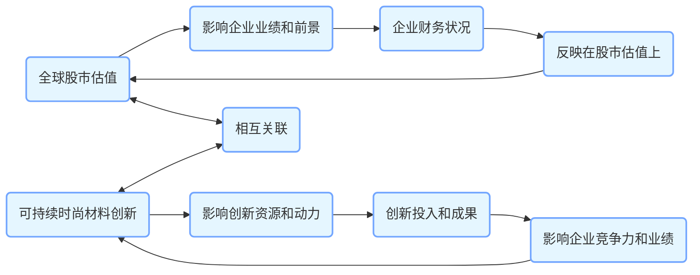

# 全球股市估值与可持续时尚材料创新的关联

> 关键词：全球股市估值、可持续时尚材料、创新、关联、金融市场、时尚产业

> 摘要：本文旨在深入探讨全球股市估值与可持续时尚材料创新之间的内在关联。通过对相关核心概念的阐述、算法原理的分析、数学模型的构建以及实际案例的研究，揭示两者相互影响的机制。一方面，可持续时尚材料创新为时尚产业带来新的发展机遇，影响企业的竞争力和业绩，进而反映在股市估值上；另一方面，股市估值的变化也能为可持续时尚材料创新提供资金支持和市场导向。文章还探讨了其实际应用场景，推荐了相关的工具和资源，并对未来发展趋势与挑战进行了总结。

## 1. 背景介绍 
### 1.1 目的和范围
本研究的目的在于全面剖析全球股市估值与可持续时尚材料创新之间的关系。范围涵盖全球金融市场以及时尚产业中与可持续材料创新相关的各个环节。通过对不同地区、不同规模的股市和时尚企业的研究，试图找出两者之间普遍存在的规律和特殊情况。

### 1.2 预期读者
本文预期读者包括金融领域的投资者、分析师、研究人员，时尚产业的从业者、设计师、企业管理者，以及对可持续发展和跨领域研究感兴趣的学者和爱好者。

### 1.3 文档结构概述
本文首先介绍背景信息，包括目的、预期读者和文档结构。接着阐述核心概念与联系，通过文本示意图和 Mermaid 流程图展示其内在逻辑。然后详细讲解核心算法原理和具体操作步骤，并用 Python 代码进行说明。之后构建数学模型和公式，结合举例进行详细讲解。再通过项目实战展示代码实际案例和详细解释。随后探讨实际应用场景，推荐相关的工具和资源。最后总结未来发展趋势与挑战，提供常见问题与解答以及扩展阅读和参考资料。

### 1.4 术语表
#### 1.4.1 核心术语定义
- **全球股市估值**：指全球范围内各个股票市场中上市公司的总市值以及股票价格的综合评估，反映了市场对企业未来盈利能力和发展前景的预期。
- **可持续时尚材料**：是指在其整个生命周期内，对环境、社会和经济具有积极影响，能够减少资源消耗、降低环境污染、保障社会公平的时尚材料。
- **创新**：在本文中，指的是在可持续时尚材料的研发、生产、应用等方面采用新的技术、方法、理念，以实现更好的可持续发展效果。

#### 1.4.2 相关概念解释
- **金融市场**：是资金融通的市场，包括股票市场、债券市场、期货市场等。股票市场是金融市场的重要组成部分，企业通过发行股票筹集资金，投资者通过买卖股票获取收益。
- **时尚产业**：是一个综合性的产业，包括服装设计、生产、销售、品牌推广等多个环节。可持续时尚是时尚产业发展的一个重要方向，强调在满足消费者需求的同时，减少对环境和社会的负面影响。

#### 1.4.3 缩略词列表
- **ESG**：Environmental, Social and Governance，环境、社会和治理，是衡量企业可持续发展表现的重要指标。

## 2. 核心概念与联系 

### 核心概念原理
全球股市估值是金融市场对企业价值的一种评估方式。企业的业绩、发展前景、市场竞争力等因素都会影响其股市估值。而可持续时尚材料创新是时尚产业为了实现可持续发展而进行的技术和理念的革新。当时尚企业成功进行可持续时尚材料创新时，可能会带来多方面的好处。例如，提高产品的环保性能和品质，满足消费者对可持续产品的需求，从而增加市场份额和销售额；同时，也有助于提升企业的品牌形象和社会责任感，增强企业的长期竞争力。这些积极影响会反映在企业的财务报表上，进而影响股市对该企业的估值。

反过来，股市估值的变化也会对可持续时尚材料创新产生影响。当股市对时尚企业的估值较高时，企业可以通过增发股票等方式筹集更多的资金，这些资金可以用于研发和推广可持续时尚材料。此外，高估值也会吸引更多的投资者和合作伙伴，为企业的创新提供更多的资源和支持。

### 架构的文本示意图
```plaintext
全球股市估值 <----> 可持续时尚材料创新
    |                          |
    | 影响企业业绩和前景      | 影响创新资源和动力
    |                          |
    V                          V
企业财务状况               创新投入和成果
    |                          |
    | 反映在股市估值上        | 影响企业竞争力和业绩
    |                          |
    V                          V
全球股市估值 <----> 可持续时尚材料创新
```

### Mermaid 流程图


## 3. 核心算法原理 & 具体操作步骤 

### 算法原理
我们可以通过建立一个基于回归分析的模型来研究全球股市估值与可持续时尚材料创新之间的关系。回归分析是一种统计方法，用于研究自变量和因变量之间的线性关系。在这个问题中，我们可以将可持续时尚材料创新的相关指标作为自变量，全球股市估值的相关指标作为因变量。

### 具体操作步骤
1. **数据收集**：收集全球股市中时尚企业的相关数据，包括股票价格、市值、财务报表等，以及可持续时尚材料创新的相关数据，如创新投入、创新成果等。
2. **数据预处理**：对收集到的数据进行清洗、整理和标准化，去除异常值和缺失值，确保数据的质量。
3. **变量选择**：选择合适的自变量和因变量。自变量可以包括可持续时尚材料创新的投入金额、创新项目数量等，因变量可以是股票价格的变化率、市值的增长率等。
4. **模型建立**：使用回归分析方法建立模型，估计自变量和因变量之间的关系。
5. **模型评估**：使用各种评估指标，如 R² 值、均方误差等，评估模型的拟合程度和预测能力。
6. **结果分析**：根据模型的结果，分析可持续时尚材料创新对全球股市估值的影响程度和方向。

### Python 源代码实现
```python
import pandas as pd
import numpy as np
from sklearn.linear_model import LinearRegression
from sklearn.model_selection import train_test_split
from sklearn.metrics import mean_squared_error, r2_score

# 数据收集和预处理
# 假设我们已经收集到了相关数据，并存储在一个 CSV 文件中
data = pd.read_csv('fashion_stock_data.csv')

# 提取自变量和因变量
X = data[['innovation_investment', 'innovation_projects']]  # 自变量
y = data['stock_price_growth_rate']  # 因变量

# 数据划分
X_train, X_test, y_train, y_test = train_test_split(X, y, test_size=0.2, random_state=42)

# 模型建立
model = LinearRegression()
model.fit(X_train, y_train)

# 模型预测
y_pred = model.predict(X_test)

# 模型评估
mse = mean_squared_error(y_test, y_pred)
r2 = r2_score(y_test, y_pred)

print(f"均方误差: {mse}")
print(f"R² 值: {r2}")

# 结果分析
coefficients = model.coef_
intercept = model.intercept_
print(f"回归系数: {coefficients}")
print(f"截距: {intercept}")
```

## 4. 数学模型和公式 & 详细讲解 & 举例说明 

### 数学模型
我们建立的线性回归模型可以表示为：

$$y = \beta_0 + \beta_1x_1 + \beta_2x_2 + \epsilon$$

其中，$y$ 是因变量（全球股市估值的相关指标，如股票价格的变化率），$x_1$ 和 $x_2$ 是自变量（可持续时尚材料创新的相关指标，如创新投入、创新项目数量），$\beta_0$ 是截距，$\beta_1$ 和 $\beta_2$ 是回归系数，$\epsilon$ 是误差项。

### 详细讲解
- **截距 $\beta_0$**：表示当所有自变量都为 0 时，因变量的取值。在实际应用中，它可能没有实际的物理意义，但在模型中起到了调整的作用。
- **回归系数 $\beta_1$ 和 $\beta_2$**：表示自变量对因变量的影响程度。如果 $\beta_1$ 为正，说明创新投入的增加会导致股票价格变化率的上升；如果 $\beta_1$ 为负，则说明创新投入的增加会导致股票价格变化率的下降。
- **误差项 $\epsilon$**：表示模型无法解释的部分，可能是由于数据的噪声、未考虑到的因素等引起的。

### 举例说明
假设我们通过回归分析得到的模型为：

$$y = 0.05 + 0.02x_1 + 0.03x_2$$

其中，$y$ 是股票价格的变化率，$x_1$ 是创新投入（单位：万元），$x_2$ 是创新项目数量。

如果一家时尚企业的创新投入为 100 万元，创新项目数量为 5 个，那么根据这个模型，我们可以预测该企业股票价格的变化率为：

$$y = 0.05 + 0.02 \times 100 + 0.03 \times 5 = 2.2$$

即该企业股票价格的变化率为 2.2%。

## 5. 项目实战：代码实际案例和详细解释说明 

### 5.1  开发环境搭建
1. **安装 Python**：可以从 Python 官方网站（https://www.python.org/downloads/）下载并安装 Python 3.x 版本。
2. **安装必要的库**：使用 pip 命令安装所需的库，如 pandas、numpy、scikit-learn 等。
```sh
pip install pandas numpy scikit-learn
```

### 5.2  源代码详细实现和代码解读
```python
import pandas as pd
import numpy as np
from sklearn.linear_model import LinearRegression
from sklearn.model_selection import train_test_split
from sklearn.metrics import mean_squared_error, r2_score

# 数据收集和预处理
# 假设我们已经收集到了相关数据，并存储在一个 CSV 文件中
data = pd.read_csv('fashion_stock_data.csv')

# 提取自变量和因变量
X = data[['innovation_investment', 'innovation_projects']]  # 自变量
y = data['stock_price_growth_rate']  # 因变量

# 数据划分
X_train, X_test, y_train, y_test = train_test_split(X, y, test_size=0.2, random_state=42)

# 模型建立
model = LinearRegression()
model.fit(X_train, y_train)

# 模型预测
y_pred = model.predict(X_test)

# 模型评估
mse = mean_squared_error(y_test, y_pred)
r2 = r2_score(y_test, y_pred)

print(f"均方误差: {mse}")
print(f"R² 值: {r2}")

# 结果分析
coefficients = model.coef_
intercept = model.intercept_
print(f"回归系数: {coefficients}")
print(f"截距: {intercept}")
```

### 代码解读
1. **数据收集和预处理**：使用 `pandas` 库的 `read_csv` 函数读取存储在 CSV 文件中的数据。
2. **提取自变量和因变量**：从数据中提取出可持续时尚材料创新的相关指标作为自变量，全球股市估值的相关指标作为因变量。
3. **数据划分**：使用 `sklearn` 库的 `train_test_split` 函数将数据划分为训练集和测试集，其中测试集占总数据的 20%。
4. **模型建立**：使用 `sklearn` 库的 `LinearRegression` 类建立线性回归模型，并使用训练集数据进行拟合。
5. **模型预测**：使用训练好的模型对测试集数据进行预测。
6. **模型评估**：使用 `sklearn` 库的 `mean_squared_error` 和 `r2_score` 函数计算均方误差和 R² 值，评估模型的拟合程度和预测能力。
7. **结果分析**：输出回归系数和截距，分析可持续时尚材料创新对全球股市估值的影响程度和方向。

### 5.3  代码解读与分析
- **均方误差（MSE）**：衡量了模型预测值与真实值之间的平均误差。MSE 值越小，说明模型的预测能力越强。
- **R² 值**：表示模型对数据的拟合程度，取值范围为 0 到 1。R² 值越接近 1，说明模型对数据的拟合程度越好。
- **回归系数**：表示自变量对因变量的影响程度。正的回归系数表示自变量的增加会导致因变量的增加，负的回归系数表示自变量的增加会导致因变量的减少。

## 6. 实际应用场景 
### 投资者决策
投资者可以通过分析可持续时尚材料创新与全球股市估值之间的关系，选择具有创新潜力的时尚企业进行投资。例如，如果一家时尚企业在可持续时尚材料创新方面投入较大，且取得了一定的成果，那么该企业的股票可能具有较高的投资价值。

### 时尚企业战略规划
时尚企业可以根据股市估值的变化来调整自身的可持续时尚材料创新战略。如果股市对可持续时尚材料创新给予较高的估值，企业可以加大创新投入，提高产品的可持续性，以提升企业的市场竞争力和股市估值。

### 政策制定
政府和相关监管机构可以通过研究可持续时尚材料创新与全球股市估值之间的关系，制定相关政策来鼓励企业进行可持续时尚材料创新。例如，给予创新企业税收优惠、财政补贴等支持，促进时尚产业的可持续发展。

## 7. 工具和资源推荐
### 7.1 学习资源推荐
#### 7.1.1 书籍推荐
- 《金融市场与金融机构》：全面介绍了金融市场的基本原理和金融机构的运作方式，有助于读者了解全球股市估值的相关知识。
- 《可持续时尚：从理论到实践》：深入探讨了可持续时尚的概念、发展趋势和实践方法，为读者提供了可持续时尚材料创新的理论基础。

#### 7.1.2 在线课程
- Coursera 上的“金融市场分析”课程：系统地介绍了金融市场的分析方法和工具，帮助读者掌握股市估值的分析技巧。
- edX 上的“可持续时尚创新”课程：讲解了可持续时尚材料创新的最新技术和案例，为读者提供了实践指导。

#### 7.1.3 技术博客和网站
- Seeking Alpha：提供了全球股市的分析和评论，帮助读者了解股市动态和企业估值情况。
- Fashion Revolution：关注可持续时尚的发展，分享了可持续时尚材料创新的最新成果和行业趋势。

### 7.2 开发工具框架推荐
#### 7.2.1 IDE和编辑器
- PyCharm：一款功能强大的 Python 集成开发环境，提供了代码编辑、调试、版本控制等功能，方便开发者进行数据分析和模型开发。
- Jupyter Notebook：一种交互式的开发环境，适合进行数据探索和模型验证，能够直观地展示代码和结果。

#### 7.2.2 调试和性能分析工具
- PDB：Python 自带的调试工具，用于调试 Python 代码，帮助开发者定位和解决问题。
- cProfile：Python 的性能分析工具，用于分析代码的运行时间和性能瓶颈，帮助开发者优化代码。

#### 7.2.3 相关框架和库
- Pandas：用于数据处理和分析的 Python 库，提供了高效的数据结构和数据操作方法。
- NumPy：用于科学计算的 Python 库，提供了高效的数组操作和数学函数。
- Scikit-learn：用于机器学习的 Python 库，提供了各种机器学习算法和工具，方便开发者进行模型建立和评估。

### 7.3 相关论文著作推荐
#### 7.3.1 经典论文
- “The Impact of Corporate Social Responsibility on Stock Returns: Evidence from the Fashion Industry”：研究了企业社会责任（包括可持续时尚材料创新）对股票回报的影响。
- “Sustainable Fashion Materials: A Review of Current Trends and Future Directions”：对可持续时尚材料的现状和未来发展方向进行了综述。

#### 7.3.2 最新研究成果
- 关注学术数据库，如 IEEE Xplore、ACM Digital Library 等，获取关于全球股市估值和可持续时尚材料创新的最新研究论文。

#### 7.3.3 应用案例分析
- 阅读相关的行业报告和案例分析，了解时尚企业在可持续时尚材料创新方面的实践经验和成功案例。

## 8. 总结：未来发展趋势与挑战
### 未来发展趋势
- **创新加速**：随着消费者对可持续时尚的需求不断增加，时尚企业将加大在可持续时尚材料创新方面的投入，创新速度将加快。
- **数字化转型**：数字化技术将在可持续时尚材料创新中发挥重要作用，如通过大数据分析消费者需求、使用 3D 打印技术制造