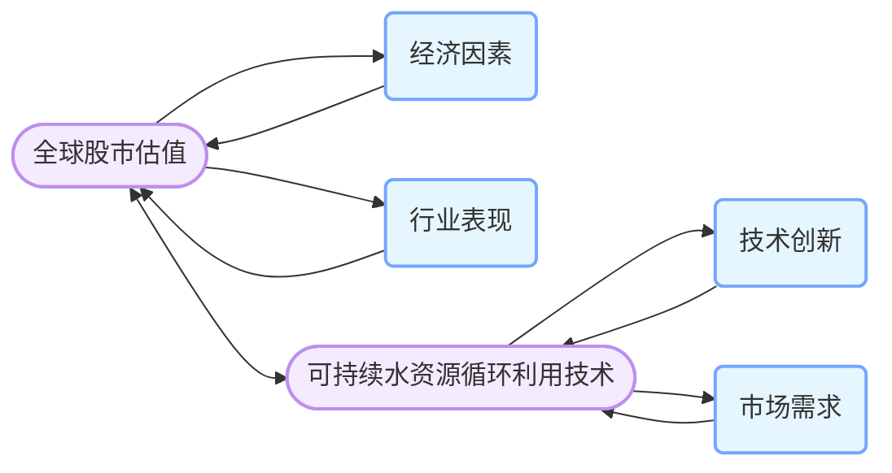

# 全球股市估值与可持续水资源循环利用技术的关联

> 关键词：全球股市估值、可持续水资源循环利用技术、经济影响、环境因素、投资趋势、市场动态、技术发展

> 摘要：本文旨在深入探讨全球股市估值与可持续水资源循环利用技术之间的关联。通过对相关核心概念的剖析、算法原理的阐述、数学模型的构建以及实际案例的分析，揭示两者之间相互影响的内在机制。研究发现，可持续水资源循环利用技术的发展不仅对环境产生积极影响，还在经济层面影响着全球股市的估值。同时，文章还探讨了该领域的实际应用场景、推荐了相关的工具和资源，并对未来的发展趋势与挑战进行了总结。

## 1. 背景介绍 
### 1.1 目的和范围
本研究的主要目的是全面分析全球股市估值与可持续水资源循环利用技术之间的潜在联系。在当今全球化的经济环境下，股市作为经济的重要指标，其估值受到多种因素的影响。而可持续水资源循环利用技术作为解决水资源短缺和环境污染问题的关键手段，正逐渐成为影响经济发展的重要因素。通过研究两者之间的关联，我们可以更好地理解环境因素对经济的影响，为投资者、企业和政策制定者提供决策参考。

本研究的范围涵盖了全球主要股市以及可持续水资源循环利用技术的各个方面，包括技术的研发、应用、市场推广等。同时，我们还将分析不同行业在这一关联中的表现，以及政策和市场趋势对两者关系的影响。

### 1.2 预期读者
本文的预期读者包括投资者、金融分析师、企业管理者、政策制定者、环境科学家以及对全球经济和环境问题感兴趣的研究人员。对于投资者来说，了解全球股市估值与可持续水资源循环利用技术的关联可以帮助他们发现潜在的投资机会；金融分析师可以通过研究这一关联，为客户提供更准确的市场分析和投资建议；企业管理者可以根据这一关联，调整企业的战略规划和投资方向；政策制定者可以制定相关政策，促进可持续水资源循环利用技术的发展，同时推动经济的可持续增长；环境科学家可以从经济角度深入理解可持续水资源循环利用技术的重要性；而对全球经济和环境问题感兴趣的研究人员则可以通过本文，拓展自己的研究视野。

### 1.3 文档结构概述
本文将按照以下结构进行阐述：首先，介绍核心概念与联系，包括全球股市估值和可持续水资源循环利用技术的定义、原理以及两者之间的关联机制，并通过文本示意图和 Mermaid 流程图进行直观展示；其次，讲解核心算法原理和具体操作步骤，使用 Python 源代码详细阐述相关算法；接着，构建数学模型和公式，并进行详细讲解和举例说明；然后，通过项目实战，给出代码实际案例并进行详细解释说明；之后，探讨实际应用场景；再推荐相关的工具和资源，包括学习资源、开发工具框架和相关论文著作；最后，总结未来发展趋势与挑战，并提供附录，解答常见问题，同时列出扩展阅读和参考资料。

### 1.4 术语表
#### 1.4.1 核心术语定义
- **全球股市估值**：指对全球范围内各个股票市场中上市公司的价值进行评估的过程和结果。股市估值通常采用多种方法，如市盈率（P/E）、市净率（P/B）等，以衡量股票的相对价值和市场整体的估值水平。
- **可持续水资源循环利用技术**：是指通过一系列的技术手段，实现水资源的高效利用、循环再生和可持续管理的技术体系。这些技术包括污水处理、海水淡化、雨水收集利用、中水回用等，旨在减少水资源的浪费，提高水资源的利用效率，保护水资源环境。

#### 1.4.2 相关概念解释
- **市盈率（P/E）**：是指股票价格与每股收益的比率，反映了投资者为获得每股收益所愿意支付的价格。市盈率越高，说明市场对该股票的预期越高，但也可能意味着股票被高估。
- **市净率（P/B）**：是指股票价格与每股净资产的比率，反映了股票价格相对于每股净资产的溢价程度。市净率越低，说明股票的估值越低，可能具有一定的投资价值。
- **污水处理**：是指将污水中的污染物去除或转化，使其达到排放标准或可回用标准的过程。污水处理技术包括物理处理、化学处理和生物处理等多种方法。
- **海水淡化**：是指将海水中的盐分和其他杂质去除，使其转化为可饮用或可用于工业生产的淡水的过程。海水淡化技术主要有蒸馏法、反渗透法等。

#### 1.4.3 缩略词列表
- **P/E**：市盈率（Price-to-Earnings Ratio）
- **P/B**：市净率（Price-to-Book Ratio）
- **ROE**：净资产收益率（Return on Equity）
- **GDP**：国内生产总值（Gross Domestic Product）

## 2. 核心概念与联系 

### 2.1 全球股市估值的原理和影响因素
全球股市估值是一个复杂的过程，受到多种因素的影响。从宏观层面来看，经济增长、通货膨胀、利率水平等因素都会对股市估值产生影响。例如，经济增长强劲时，企业的盈利预期通常会提高，从而推动股市估值上升；而通货膨胀和利率上升则会增加企业的成本，降低企业的盈利预期，导致股市估值下降。

从微观层面来看，公司的基本面因素，如盈利能力、资产质量、成长潜力等，是影响股市估值的重要因素。盈利能力强、资产质量好、成长潜力大的公司，通常会获得较高的估值。此外，行业竞争格局、市场情绪等因素也会对股市估值产生影响。

### 2.2 可持续水资源循环利用技术的原理和发展现状
可持续水资源循环利用技术的核心原理是通过物理、化学和生物等手段，对水资源进行处理和循环利用，以减少水资源的浪费和污染。例如，污水处理技术通过沉淀、过滤、生物降解等过程，去除污水中的污染物，使其达到排放标准或可回用标准；海水淡化技术则通过蒸馏、反渗透等方法，将海水中的盐分和其他杂质去除，转化为淡水。

目前，可持续水资源循环利用技术已经取得了长足的发展。在污水处理方面，先进的生物处理技术和膜分离技术得到了广泛应用，提高了污水处理的效率和质量；在海水淡化方面，反渗透技术的成本不断降低，使得海水淡化成为解决沿海地区水资源短缺问题的重要手段之一。此外，雨水收集利用、中水回用等技术也在不断推广和应用。

### 2.3 两者之间的关联机制
全球股市估值与可持续水资源循环利用技术之间存在着密切的关联。一方面，可持续水资源循环利用技术的发展会对相关企业的盈利能力和成长潜力产生影响，从而影响股市估值。例如，从事污水处理、海水淡化等业务的企业，随着技术的进步和市场需求的增加，其盈利预期会提高，股价也会相应上涨，进而推动相关板块的股市估值上升。

另一方面，股市估值的变化也会影响可持续水资源循环利用技术的发展。当股市估值较高时，相关企业可以通过发行股票等方式筹集更多的资金，用于技术研发和市场拓展，从而推动可持续水资源循环利用技术的发展；而当股市估值较低时，企业的融资难度会增加，可能会影响技术的研发和应用。

### 2.4 文本示意图
```plaintext
全球股市估值 <----> 可持续水资源循环利用技术
    |                        |
    |                        |
经济因素（GDP、利率等）    技术创新
    |                        |
    |                        |
行业表现（水务、环保等）    市场需求
```

### 2.5 Mermaid 流程图


## 3. 核心算法原理 & 具体操作步骤 

### 3.1 股市估值算法
股市估值常用的算法之一是市盈率法。市盈率法的基本原理是通过比较股票的市盈率与同行业或市场平均市盈率，来判断股票的估值是否合理。具体计算公式如下：

$$P/E = \frac{股价}{每股收益}$$

其中，$P/E$ 表示市盈率，股价是指股票的当前市场价格，每股收益是指公司每股股票的盈利。

以下是使用 Python 实现市盈率计算的代码示例：
```python
def calculate_pe(stock_price, earnings_per_share):
    """
    计算市盈率
    :param stock_price: 股票价格
    :param earnings_per_share: 每股收益
    :return: 市盈率
    """
    if earnings_per_share == 0:
        return None
    return stock_price / earnings_per_share

# 示例数据
stock_price = 50
earnings_per_share = 2

pe_ratio = calculate_pe(stock_price, earnings_per_share)
print(f"市盈率: {pe_ratio}")
```

### 3.2 可持续水资源循环利用技术投资回报率算法
可持续水资源循环利用技术的投资回报率是衡量该技术投资效益的重要指标。投资回报率的计算公式如下：

$$ROI = \frac{净利润}{投资成本} \times 100\%$$

其中，$ROI$ 表示投资回报率，净利润是指投资项目的净收益，投资成本是指投资项目的总成本。

以下是使用 Python 实现投资回报率计算的代码示例：
```python
def calculate_roi(net_profit, investment_cost):
    """
    计算投资回报率
    :param net_profit: 净利润
    :param investment_cost: 投资成本
    :return: 投资回报率
    """
    if investment_cost == 0:
        return None
    return (net_profit / investment_cost) * 100

# 示例数据
net_profit = 100000
investment_cost = 500000

roi = calculate_roi(net_profit, investment_cost)
print(f"投资回报率: {roi}%")
```

### 3.3 两者关联分析算法
为了分析全球股市估值与可持续水资源循环利用技术之间的关联，我们可以使用相关性分析算法。相关性分析可以衡量两个变量之间的线性关系强度。常用的相关性分析方法是皮尔逊相关系数。

皮尔逊相关系数的计算公式如下：

$$r = \frac{\sum_{i=1}^{n} (x_i - \bar{x})(y_i - \bar{y})}{\sqrt{\sum_{i=1}^{n} (x_i - \bar{x})^2 \sum_{i=1}^{n} (y_i - \bar{y})^2}}$$

其中，$r$ 表示皮尔逊相关系数，$x_i$ 和 $y_i$ 分别表示两个变量的第 $i$ 个观测值，$\bar{x}$ 和 $\bar{y}$ 分别表示两个变量的均值，$n$ 表示观测值的数量。

以下是使用 Python 实现皮尔逊相关系数计算的代码示例：
```python
import numpy as np

def calculate_pearson_correlation(x, y):
    """
    计算皮尔逊相关系数
    :param x: 第一个变量的观测值数组
    :param y: 第二个变量的观测值数组
    :return: 皮尔逊相关系数
    """
    return np.corrcoef(x, y)[0, 1]

# 示例数据
x = np.array([1, 2, 3, 4, 5])
y = np.array([2, 4, 6, 8, 10])

correlation = calculate_pearson_correlation(x, y)
print(f"皮尔逊相关系数: {correlation}")
```

## 4. 数学模型和公式 & 详细讲解 & 举例说明 

### 4.1 股市估值的数学模型
股市估值的数学模型可以基于股息贴现模型（Dividend Discount Model，DDM）。股息贴现模型的基本思想是，股票的价值等于其未来股息的现值之和。

#### 4.1.1 零增长股息贴现模型
零增长股息贴现模型假设股息增长率为零，即每年的股息保持不变。其计算公式如下：

$$V = \frac{D}{r}$$

其中，$V$ 表示股票的价值，$D$ 表示每年的股息，$r$ 表示贴现率。

例如，某股票每年的股息为 $2$ 元，贴现率为 $10\%$，则该股票的价值为：

$$V = \frac{2}{0.1} = 20$$（元）

#### 4.1.2 固定增长股息贴现模型
固定增长股息贴现模型假设股息以固定的增长率 $g$ 增长。其计算公式如下：

$$V = \frac{D_1}{r - g}$$

其中，$V$ 表示股票的价值，$D_1$ 表示下一年的股息，$r$ 表示贴现率，$g$ 表示股息增长率。

例如，某股票下一年的股息为 $2$ 元，股息增长率为 $5\%$，贴现率为 $10\%$，则该股票的价值为：

$$V = \frac{2}{0.1 - 0.05} = 40$$（元）

### 4.2 可持续水资源循环利用技术的成本效益模型
可持续水资源循环利用技术的成本效益模型可以用于评估该技术的投资效益。该模型考虑了技术的投资成本、运行成本、收益等因素。

#### 4.2.1 成本效益分析公式
成本效益分析的基本公式如下：

$$NPV = \sum_{t=0}^{n} \frac{CF_t}{(1 + r)^t}$$

其中，$NPV$ 表示净现值，$CF_t$ 表示第 $t$ 年的现金流量，$r$ 表示贴现率，$n$ 表示项目的寿命期。

#### 4.2.2 举例说明
假设某可持续水资源循环利用项目的投资成本为 $100$ 万元，项目寿命期为 $10$ 年，每年的运行成本为 $10$ 万元，每年的收益为 $30$ 万元，贴现率为 $10\%$。则该项目的净现值计算如下：

首先，计算每年的现金流量：

$CF_0 = -100$（万元）

$CF_1 - CF_{10} = 30 - 10 = 20$（万元）

然后，计算净现值：

$$NPV = -100 + \sum_{t=1}^{10} \frac{20}{(1 + 0.1)^t}$$

使用 Python 代码计算净现值：
```python
import numpy as np

investment_cost = -100
annual_income = 20
discount_rate = 0.1
years = 10

cash_flows = [investment_cost] + [annual_income] * years
npv = np.npv(discount_rate, cash_flows)
print(f"净现值: {npv} 万元")
```

### 4.3 两者关联的数学模型
为了建立全球股市估值与可持续水资源循环利用技术之间的关联数学模型，我们可以考虑使用多元线性回归模型。

#### 4.3.1 多元线性回归模型公式
多元线性回归模型的一般形式如下：

$$y = \beta_0 + \beta_1x_1 + \beta_2x_2 + \cdots + \beta_nx_n + \epsilon$$

其中，$y$ 表示因变量（如股市估值），$x_1, x_2, \cdots, x_n$ 表示自变量（如可持续水资源循环利用技术的投资规模、技术创新水平等），$\beta_0, \beta_1, \cdots, \beta_n$ 表示回归系数，$\epsilon$ 表示误差项。

#### 4.3.2 举例说明
假设我们使用股市市盈率作为因变量 $y$，可持续水资源循环利用技术的投资规模 $x_1$ 和技术创新水平 $x_2$ 作为自变量，建立多元线性回归模型。通过收集历史数据，使用最小二乘法估计回归系数 $\beta_0, \beta_1, \beta_2$。

假设估计得到的回归方程为：

$$y = 10 + 0.5x_1 + 0.3x_2$$

如果某一年可持续水资源循环利用技术的投资规模为 $100$ 亿元，技术创新水平评分为 $80$ 分，则该年的股市市盈率预测值为：

$$y = 10 + 0.5 \times 100 + 0.3 \times 80 = 10 + 50 + 24 = 84$$

## 5. 项目实战：代码实际案例和详细解释说明 

### 5.1  开发环境搭建
为了完成本项目实战，我们需要搭建以下开发环境：
- **Python 环境**：建议使用 Python 3.7 及以上版本。可以从 Python 官方网站（https://www.python.org/downloads/）下载并安装。
- **开发工具**：推荐使用 PyCharm 作为开发工具，它是一款功能强大的 Python IDE。可以从 JetBrains 官方网站（https://www.jetbrains.com/pycharm/download/）下载并安装。
- **相关库**：需要安装以下 Python 库：
    - `pandas`：用于数据处理和分析。
    - `numpy`：用于数值计算。
    - `matplotlib`：用于数据可视化。
    - `scikit-learn`：用于机器学习算法的实现。

可以使用以下命令安装这些库：
```sh
pip install pandas numpy matplotlib scikit-learn
```

### 5.2  源代码详细实现和代码解读
#### 5.2.1 数据获取和预处理
首先，我们需要获取全球股市估值数据和可持续水资源循环利用技术相关数据。假设我们已经从公开数据源获取了这些数据，并保存为 CSV 文件。以下是数据获取和预处理的代码示例：
```python
import pandas as pd

# 读取股市估值数据
stock_valuation_data = pd.read_csv('stock_valuation.csv')

# 读取可持续水资源循环利用技术数据
water_technology_data = pd.read_csv('water_technology.csv')

# 合并数据
merged_data = pd.merge(stock_valuation_data, water_technology_data, on='date')

# 处理缺失值
merged_data = merged_data.dropna()

# 提取特征和目标变量
X = merged_data.drop('stock_valuation', axis=1)
y = merged_data['stock_valuation']
```
代码解读：
- 首先，使用 `pandas` 库的 `read_csv` 函数读取股市估值数据和可持续水资源循环利用技术数据。
- 然后，使用 `merge` 函数将两个数据集按照日期进行合并。
- 接着，使用 `dropna` 函数处理缺失值，删除包含缺失值的行。
- 最后，提取特征变量 `X` 和目标变量 `y`。

#### 5.2.2 建立多元线性回归模型
接下来，我们使用 `scikit-learn` 库建立多元线性回归模型，并进行训练和预测。以下是代码示例：
```python
from sklearn.model_selection import train_test_split
from sklearn.linear_model import LinearRegression
from sklearn.metrics import mean_squared_error

# 划分训练集和测试集
X_train, X_test, y_train, y_test = train_test_split(X, y, test_size=0.2, random_state=42)

# 建立线性回归模型
model = LinearRegression()

# 训练模型
model.fit(X_train, y_train)

# 预测
y_pred = model.predict(X_test)

# 计算均方误差
mse = mean_squared_error(y_test, y_pred)
print(f"均方误差: {mse}")
```
代码解读：
- 首先，使用 `train_test_split` 函数将数据集划分为训练集和测试集，其中测试集占比为 $20\%$。
- 然后，使用 `LinearRegression` 类建立线性回归模型。
- 接着，使用 `fit` 方法对模型进行训练。
- 之后，使用 `predict` 方法对测试集进行预测。
- 最后，使用 `mean_squared_error` 函数计算预测结果的均方误差。

#### 5.2.3 数据可视化
为了更直观地展示模型的预测结果，我们可以使用 `matplotlib` 库进行数据可视化。以下是代码示例：
```python
import matplotlib.pyplot as plt

# 绘制真实值和预测值的对比图
plt.scatter(y_test, y_pred)
plt.xlabel('真实值')
plt.ylabel('预测值')
plt.title('股市估值预测结果')
plt.show()
```
代码解读：
- 使用 `scatter` 函数绘制真实值和预测值的散点图。
- 设置坐标轴标签和标题。
- 使用 `show` 函数显示图形。

### 5.3  代码解读与分析
通过以上代码，我们完成了全球股市估值与可持续水资源循环利用技术关联的项目实战。首先，我们对数据进行了获取和预处理，确保数据的质量和可用性。然后，建立了多元线性回归模型，通过训练和预测，评估了模型的性能。最后，使用数据可视化工具直观地展示了模型的预测结果。

从代码运行结果来看，均方误差可以作为评估模型性能的指标。均方误差越小，说明模型的预测结果越接近真实值，模型的性能越好。通过调整模型的参数和特征选择，可以进一步优化模型的性能。

## 6. 实际应用场景 
### 6.1 投资决策
对于投资者来说，了解全球股市估值与可持续水资源循环利用技术的关联可以帮助他们做出更明智的投资决策。例如，当可持续水资源循环利用技术的发展前景看好时，相关企业的股价可能会上涨，投资者可以考虑增加对这些企业的投资。同时，投资者还可以通过分析两者之间的关联，评估市场的整体风险，调整投资组合。

### 6.2 企业战略规划
企业管理者可以根据全球股市估值与可持续水资源循环利用技术的关联，调整企业的战略规划。例如，对于从事水务、环保等行业的企业来说，可以加大对可持续水资源循环利用技术的研发和投资，提高企业的竞争力。同时，企业还可以通过与股市的互动，优化企业的融资策略，获取更多的资金支持。

### 6.3 政策制定
政策制定者可以利用全球股市估值与可持续水资源循环利用技术的关联，制定相关政策，促进可持续水资源循环利用技术的发展。例如，政府可以出台税收优惠政策、补贴政策等，鼓励企业加大对该技术的研发和应用。同时，政策制定者还可以通过监管和引导，规范市场秩序，促进可持续水资源循环利用技术市场的健康发展。

### 6.4 环境管理
从环境管理的角度来看，全球股市估值与可持续水资源循环利用技术的关联可以为环境管理提供新的思路和方法。例如，通过评估可持续水资源循环利用技术对股市估值的影响，可以量化该技术的经济价值，为环境政策的制定提供经济依据。同时，股市的反馈机制也可以促使企业更加重视环境保护，积极采用可持续水资源循环利用技术。

## 7. 工具和资源推荐
### 7.1 学习资源推荐
#### 7.1.1 书籍推荐
- 《金融市场与金融机构》：本书全面介绍了金融市场和金融机构的基本概念、运行机制和监管政策，对于理解全球股市估值具有重要的参考价值。
- 《水资源管理与可持续发展》：详细阐述了水资源管理的理论和方法，以及可持续水资源循环利用技术的发展现状和趋势。
- 《机器学习实战》：通过实际案例介绍了机器学习的基本算法和应用，对于学习数据分析和模型建立非常有帮助。

#### 7.1.2 在线课程
- Coursera 平台上的“金融市场”课程：由知名教授授课，深入讲解金融市场的原理和实践。
- edX 平台上的“水资源工程与管理”课程：系统介绍水资源工程和管理的相关知识。
- Udemy 平台上的“Python 数据分析实战”课程：通过实际项目学习 Python 数据分析的方法和技巧。

#### 7.1.3 技术博客和网站
- 雪球网：提供全球股市的实时行情、分析报告和投资策略，是投资者获取股市信息的重要平台。
- 中国水网：专注于水资源领域的新闻资讯、政策解读和技术交流，为可持续水资源循环利用技术的学习和研究提供了丰富的资源。
- Towards Data Science：是一个专注于数据分析和机器学习的技术博客，上面有很多关于数据分析和模型建立的优秀文章。

### 7.2 开发工具框架推荐
#### 7.2.1 IDE和编辑器
- PyCharm：功能强大的 Python IDE，提供代码编辑、调试、版本控制等功能，适合专业开发者使用。
- Jupyter Notebook：交互式的开发环境，支持 Python 代码的编写、运行和可视化，适合数据科学家和分析师使用。
- Visual Studio Code：轻量级的代码编辑器，支持多种编程语言和插件扩展，具有良好的开发体验。

#### 7.2.2 调试和性能分析工具
- PDB：Python 自带的调试工具，可以帮助开发者定位代码中的错误。
- cProfile：Python 标准库中的性能分析工具，可以分析代码的运行时间和函数调用情况。
- Py-Spy：一个用于 Python 程序的性能分析工具，可以实时监测程序的运行状态。

#### 7.2.3 相关框架和库
- Pandas：用于数据处理和分析的 Python 库，提供了丰富的数据结构和数据操作方法。
- Numpy：用于数值计算的 Python 库，支持高效的数组运算和数学函数。
- Scikit-learn：用于机器学习的 Python 库，提供了各种机器学习算法和工具。
- TensorFlow：开源的深度学习框架，广泛应用于图像识别、自然语言处理等领域。

### 7.3 相关论文著作推荐
#### 7.3.1 经典论文
- “The Capital Asset Pricing Model: Theory and Evidence”：该论文对资本资产定价模型进行了深入的理论分析和实证研究，是金融领域的经典之作。
- “Sustainable Water Management: Concepts and Practice”：详细阐述了可持续水资源管理的概念和实践方法，对可持续水资源循环利用技术的研究具有重要的指导意义。
- “Machine Learning in Finance: A Review”：对机器学习在金融领域的应用进行了全面的综述，为金融数据分析和模型建立提供了理论基础。

#### 7.3.2 最新研究成果
- 近年来，关于全球股市估值与可持续发展的研究逐渐增多。一些研究发现，可持续发展因素对股市估值具有显著的影响。例如，企业的环境、社会和治理（ESG）表现与股市估值之间存在正相关关系。
- 在可持续水资源循环利用技术方面，最新的研究成果主要集中在新技术的研发和应用、成本效益分析等方面。例如，一些研究提出了新型的污水处理技术和海水淡化技术，提高了水资源循环利用的效率和经济性。

#### 7.3.3 应用案例分析
- 一些企业在可持续水资源循环利用技术方面取得了成功的应用案例。例如，某水务公司通过引入先进的污水处理技术，实现了水资源的高效循环利用，降低了生产成本，同时提高了企业的市场竞争力。
- 在股市投资方面，一些投资者通过关注可持续水资源循环利用技术相关企业的发展，获得了较好的投资回报。例如，某投资基金在可持续水资源循环利用技术领域进行了长期投资，取得了显著的收益。

## 8. 总结：未来发展趋势与挑战
### 8.1 未来发展趋势
#### 8.1.1 技术创新推动
随着科技的不断进步，可持续水资源循环利用技术将不断创新和发展。例如，新型的污水处理技术、海水淡化技术和雨水收集利用技术将不断涌现，提高水资源循环利用的效率和质量。同时，人工智能、大数据等技术的应用也将为水资源管理和循环利用提供更加智能化的解决方案。

#### 8.1.2 市场需求增长
随着全球人口的增长和经济的发展，水资源短缺和环境污染问题日益严重，对可持续水资源循环利用技术的市场需求将不断增长。特别是在一些水资源匮乏的地区和行业，对该技术的需求将更为迫切。这将为相关企业提供广阔的市场空间，推动可持续水资源循环利用技术产业的发展。

#### 8.1.3 政策支持加强
为了应对水资源短缺和环境污染问题，各国政府将加强对可持续水资源循环利用技术的政策支持。例如，出台税收优惠政策、补贴政策、排放标准等，鼓励企业加大对该技术的研发和应用。同时，政府还将加强对水资源市场的监管，规范市场秩序，促进可持续水资源循环利用技术市场的健康发展。

#### 8.1.4 股市估值提升
随着可持续水资源循环利用技术的发展和市场需求的增长，相关企业的盈利能力和成长潜力将不断提高，从而推动股市估值的提升。特别是在一些新兴的可持续水资源循环利用技术领域，相关企业的股价可能会出现较大幅度的上涨。

### 8.2 挑战
#### 8.2.1 技术成本高
目前，可持续水资源循环利用技术的研发和应用成本较高，限制了该技术的大规模推广和应用。例如，一些先进的污水处理技术和海水淡化技术需要大量的设备投资和运行成本，使得一些企业难以承受。因此，降低技术成本是可持续水资源循环利用技术发展面临的重要挑战之一。

#### 8.2.2 市场机制不完善
可持续水资源循环利用技术市场机制尚不完善，存在市场信息不对称、价格机制不合理等问题。例如，一些企业在水资源循环利用方面的投入和产出难以得到合理的回报，影响了企业的积极性。因此，建立健全市场机制，提高市场效率，是促进可持续水资源循环利用技术发展的关键。

#### 8.2.3 技术标准不统一
目前，可持续水资源循环利用技术的标准和规范尚不完善，不同地区和企业之间的技术水平和产品质量存在较大差异。这不仅影响了技术的推广和应用，也增加了市场监管的难度。因此，制定统一的技术标准和规范，提高技术的质量和可靠性，是可持续水资源循环利用技术发展的重要任务。

#### 8.2.4 人才短缺
可持续水资源循环利用技术是一个跨学科的领域，需要具备水资源科学、环境科学、工程技术、经济学等多方面知识的复合型人才。目前，该领域的人才短缺问题较为突出，制约了技术的研发和应用。因此，加强人才培养，提高人才素质，是推动可持续水资源循环利用技术发展的重要保障。

## 9. 附录：常见问题与解答
### 9.1 全球股市估值与可持续水资源循环利用技术的关联是否具有普遍性？
全球股市估值与可持续水资源循环利用技术的关联在一定程度上具有普遍性。从宏观层面来看，水资源是人类生存和经济发展的重要基础，可持续水资源循环利用技术的发展对于保障水资源的可持续供应和生态环境的保护具有重要意义，这将对经济的可持续发展产生积极影响，进而影响全球股市的估值。从微观层面来看，从事可持续水资源循环利用技术相关业务的企业，其业绩和发展前景会受到技术进步、市场需求等因素的影响，从而影响其股价和股市估值。然而，这种关联也会受到不同地区、行业和市场环境的影响，在某些情况下可能表现得更为明显，而在其他情况下可能相对较弱。

### 9.2 如何衡量可持续水资源循环利用技术对股市估值的影响程度？
可以通过多种方法来衡量可持续水资源循环利用技术对股市估值的影响程度。一种方法是使用相关性分析，计算可持续水资源循环利用技术相关指标（如技术投资规模、技术创新水平等）与股市估值指标（如市盈率、市净率等）之间的相关系数，相关系数越大，说明两者之间的关联越强。另一种方法是建立回归模型，将可持续水资源循环利用技术相关指标作为自变量，股市估值指标作为因变量，通过回归系数来衡量自变量对因变量的影响程度。此外，还可以通过案例分析和比较研究等方法，深入了解可持续水资源循环利用技术对具体企业和行业股市估值的影响。

### 9.3 可持续水资源循环利用技术的发展是否会导致股市估值的波动？
可持续水资源循环利用技术的发展可能会导致股市估值的波动。一方面，当可持续水资源循环利用技术取得重大突破或市场需求大幅增长时，相关企业的业绩和发展前景会得到改善，从而推动其股价上涨，带动相关板块的股市估值上升。另一方面，如果技术发展遇到瓶颈、市场竞争加剧或政策环境发生变化，相关企业的业绩可能会受到影响，导致股价下跌，股市估值下降。此外，股市估值还受到宏观经济环境、投资者情绪等多种因素的影响，可持续水资源循环利用技术的发展只是其中之一，因此其对股市估值的影响是复杂多变的。

### 9.4 投资者应该如何利用全球股市估值与可持续水资源循环利用技术的关联进行投资？
投资者可以从以下几个方面利用全球股市估值与可持续水资源循环利用技术的关联进行投资：
- **关注行业发展趋势**：了解可持续水资源循环利用技术的发展现状和趋势，关注相关行业的政策动态和市场需求变化，选择具有发展潜力的企业进行投资。
- **分析企业基本面**：对从事可持续水资源循环利用技术相关业务的企业进行基本面分析，包括企业的盈利能力、资产质量、技术实力、市场份额等，选择基本面良好的企业进行投资。
- **评估股市估值**：使用合适的估值方法，如市盈率、市净率等，评估相关企业的股市估值水平，选择估值合理的企业进行投资。
- **分散投资风险**：将投资资金分散到不同的企业和行业，降低单一投资的风险。同时，还可以结合其他投资策略，如长期投资、价值投资等，提高投资收益。

### 9.5 政府在促进全球股市估值与可持续水资源循环利用技术关联发展方面可以采取哪些措施？
政府可以采取以下措施促进全球股市估值与可持续水资源循环利用技术关联发展：
- **政策支持**：出台相关政策，如税收优惠、补贴、贷款贴息等，鼓励企业加大对可持续水资源循环利用技术的研发和应用，提高企业的盈利能力和市场竞争力，从而推动相关企业的股市估值上升。
- **监管引导**：加强对可持续水资源循环利用技术市场的监管，规范市场秩序，防止不正当竞争和市场垄断。同时，引导企业注重环境保护和社会责任，提高企业的社会形象和声誉，促进企业的可持续发展。
- **基础设施建设**：加大对水资源基础设施的建设投入，提高水资源的供应和循环利用能力，为可持续水资源循环利用技术的发展提供良好的基础条件。
- **人才培养**：加强对可持续水资源循环利用技术领域的人才培养，提高人才素质和创新能力。可以通过设立相关专业、开展培训课程、引进高端人才等方式，为技术的研发和应用提供人才支持。
- **国际合作**：加强与国际组织和其他国家的合作，分享可持续水资源循环利用技术的研发和应用经验，共同应对全球性的水资源问题。同时，还可以吸引国际资本和技术，促进本国可持续水资源循环利用技术产业的发展。

## 10. 扩展阅读 & 参考资料
### 10.1 扩展阅读
- 《可持续金融与投资》：深入探讨了可持续发展与金融投资之间的关系，对于理解全球股市估值与可持续水资源循环利用技术的关联具有重要的参考价值。
- 《水资源经济学》：介绍了水资源的经济特性和价值评估方法，为分析可持续水资源循环利用技术的经济影响提供了理论基础。
- 《人工智能在环境领域的应用》：探讨了人工智能技术在环境监测、水资源管理等方面的应用，为可持续水资源循环利用技术的发展提供了新的思路和方法。

### 10.2 参考资料
- 世界银行报告：《全球水资源发展报告》
- 国际货币基金组织（IMF）研究报告：《金融稳定与可持续发展》
- 相关学术期刊：《Journal of Financial Economics》、《Water Resources Research》、《Environmental Science & Technology》等

作者：AI天才研究院/AI Genius Institute & 禅与计算机程序设计艺术 /Zen And The Art of Computer Programming