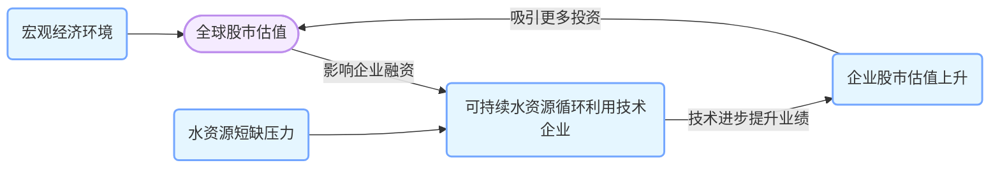

# 全球股市估值与可持续水资源循环利用技术的关联

> 关键词：全球股市估值、可持续水资源循环利用技术、关联分析、经济影响、环境因素

> 摘要：本文旨在深入探讨全球股市估值与可持续水资源循环利用技术之间的关联。通过对相关核心概念的阐述、算法原理的分析、数学模型的构建以及实际案例的研究，揭示两者之间潜在的相互影响机制。同时，介绍了该领域的实际应用场景、推荐了学习资源和开发工具，并对未来发展趋势与挑战进行了总结。希望能为投资者、科研人员和政策制定者提供有价值的参考。

## 1. 背景介绍 
### 1.1 目的和范围
本研究的主要目的是全面分析全球股市估值与可持续水资源循环利用技术之间的内在联系。通过对股市中与水资源相关企业的估值变化以及可持续水资源循环利用技术的发展现状和趋势进行研究，探讨两者之间的相互作用机制。研究范围涵盖全球主要股票市场，以及各种可持续水资源循环利用技术，包括但不限于污水处理、海水淡化、雨水收集和中水回用等技术。

### 1.2 预期读者
本文预期读者包括金融投资者、水资源领域科研人员、政策制定者以及对环境经济领域感兴趣的人士。对于金融投资者来说，了解两者之间的关联有助于做出更明智的投资决策；科研人员可以从经济角度为技术研发提供方向；政策制定者可以根据研究结果制定更合理的水资源管理政策；而对环境经济领域感兴趣的人士可以通过本文深入了解这两个重要领域之间的关系。

### 1.3 文档结构概述
本文将首先介绍相关的核心概念，并阐述它们之间的联系，通过文本示意图和 Mermaid 流程图进行直观展示。接着，详细讲解核心算法原理和具体操作步骤，并使用 Python 源代码进行阐述。然后，构建数学模型和公式，通过详细讲解和举例说明来解释两者之间的定量关系。在项目实战部分，将给出代码实际案例并进行详细解释说明。之后，介绍实际应用场景，推荐相关的工具和资源。最后，总结未来发展趋势与挑战，提供常见问题解答和扩展阅读参考资料。

### 1.4 术语表
#### 1.4.1 核心术语定义
- **全球股市估值**：指对全球范围内各个股票市场中上市公司的股票价值进行评估的过程和结果。它反映了市场对上市公司未来盈利能力和发展前景的预期。
- **可持续水资源循环利用技术**：是指一系列旨在提高水资源利用效率、减少水资源浪费、实现水资源可持续利用的技术。这些技术包括污水处理、海水淡化、雨水收集、中水回用等，能够将水资源从使用后的状态转化为可再次利用的状态。

#### 1.4.2 相关概念解释
- **股票市场**：是股票发行和交易的场所，是金融市场的重要组成部分。股票市场的价格波动反映了市场参与者对上市公司的信心和预期。
- **水资源循环利用**：是指将使用后的水资源经过处理后再次投入使用的过程。通过水资源循环利用，可以减少对新鲜水资源的需求，降低水资源短缺的压力。

#### 1.4.3 缩略词列表
- **GDP**：国内生产总值（Gross Domestic Product），是衡量一个国家或地区经济活动总量的指标。
- **ROE**：净资产收益率（Return on Equity），是衡量上市公司盈利能力的重要指标。
- **EVA**：经济增加值（Economic Value Added），是衡量企业经营业绩的指标，考虑了资本成本。

## 2. 核心概念与联系 

### 核心概念原理
全球股市估值是由多种因素决定的，包括宏观经济环境、公司财务状况、行业发展前景等。宏观经济环境如 GDP 增长、通货膨胀率等会影响整个市场的资金供求和投资者情绪；公司财务状况如营收、利润、资产负债等是评估公司价值的基础；行业发展前景则决定了公司未来的增长潜力。

可持续水资源循环利用技术的原理基于水资源的物理、化学和生物特性。例如，污水处理技术通过物理过滤、化学沉淀和生物分解等过程去除污水中的污染物，使其达到可再次利用的标准；海水淡化技术则通过反渗透、蒸馏等方法将海水中的盐分去除，得到淡水。

### 架构的文本示意图
全球股市估值与可持续水资源循环利用技术之间存在着复杂的相互关系。一方面，可持续水资源循环利用技术的发展会影响相关企业的业绩和前景，从而影响其在股市中的估值。例如，一家专注于污水处理技术研发和应用的企业，如果其技术取得重大突破，能够提高污水处理效率和降低成本，那么该企业的盈利能力将增强，市场对其预期也会提高，进而推动其股票价格上涨。另一方面，股市估值的变化也会影响可持续水资源循环利用技术的发展。如果股市对水资源相关企业的估值较高，这些企业将更容易获得融资，从而加大对技术研发和应用的投入，促进技术的发展。

### Mermaid 流程图


## 3. 核心算法原理 & 具体操作步骤 

### 算法原理
为了分析全球股市估值与可持续水资源循环利用技术之间的关联，我们可以采用多元线性回归模型。该模型可以帮助我们量化多个自变量（如宏观经济指标、技术创新指标等）对因变量（股市估值）的影响。

多元线性回归模型的一般形式为：

$Y = \beta_0 + \beta_1X_1 + \beta_2X_2 + \cdots + \beta_nX_n + \epsilon$

其中，$Y$ 是因变量（股市估值），$X_1, X_2, \cdots, X_n$ 是自变量（如 GDP 增长率、技术研发投入等），$\beta_0, \beta_1, \cdots, \beta_n$ 是回归系数，$\epsilon$ 是误差项。

### 具体操作步骤
1. **数据收集**：收集全球股市估值数据、宏观经济数据（如 GDP 增长率、通货膨胀率等）、可持续水资源循环利用技术相关数据（如技术研发投入、专利数量等）。
2. **数据预处理**：对收集到的数据进行清洗、缺失值处理和标准化处理，以确保数据的质量和一致性。
3. **模型构建**：使用 Python 的 `statsmodels` 库构建多元线性回归模型。
4. **模型训练**：将预处理后的数据分为训练集和测试集，使用训练集对模型进行训练。
5. **模型评估**：使用测试集对训练好的模型进行评估，计算模型的拟合优度、均方误差等指标。
6. **结果分析**：分析回归系数的显著性和正负性，判断自变量对因变量的影响方向和程度。

### Python 源代码
```python
import pandas as pd
import statsmodels.api as sm

# 数据收集和预处理
data = pd.read_csv('data.csv')  # 假设数据存储在 data.csv 文件中
X = data[['GDP_growth', 'R&D_investment', 'Patent_number']]  # 自变量
y = data['Stock_valuation']  # 因变量

# 添加常数项
X = sm.add_constant(X)

# 模型构建和训练
model = sm.OLS(y, X).fit()

# 模型评估
print(model.summary())

# 结果分析
print('回归系数：', model.params)
```

## 4. 数学模型和公式 & 详细讲解 & 举例说明 

### 数学模型
我们使用的多元线性回归模型为：

$Y = \beta_0 + \beta_1X_1 + \beta_2X_2 + \beta_3X_3 + \epsilon$

其中，$Y$ 表示全球股市估值，$X_1$ 表示 GDP 增长率，$X_2$ 表示可持续水资源循环利用技术的研发投入，$X_3$ 表示该技术的专利数量，$\beta_0$ 是截距项，$\beta_1, \beta_2, \beta_3$ 是回归系数，$\epsilon$ 是误差项。

### 公式详细讲解
- **截距项 $\beta_0$**：表示当所有自变量都为 0 时，因变量 $Y$ 的取值。在实际应用中，它可能没有实际的经济意义，但在数学模型中是必要的。
- **回归系数 $\beta_1, \beta_2, \beta_3$**：分别表示自变量 $X_1, X_2, X_3$ 对因变量 $Y$ 的影响程度。例如，$\beta_1$ 表示在其他自变量不变的情况下，GDP 增长率每增加 1 个单位，全球股市估值的平均变化量。
- **误差项 $\epsilon$**：表示模型无法解释的随机误差。它反映了除自变量以外的其他因素对因变量的影响。

### 举例说明
假设我们通过数据分析得到回归系数 $\beta_0 = 100$，$\beta_1 = 5$，$\beta_2 = 2$，$\beta_3 = 3$。这意味着当 GDP 增长率为 0，技术研发投入为 0，专利数量为 0 时，全球股市估值的基础值为 100。如果 GDP 增长率增加 1 个单位，在其他条件不变的情况下，全球股市估值将平均增加 5 个单位；如果技术研发投入增加 1 个单位，全球股市估值将平均增加 2 个单位；如果专利数量增加 1 个单位，全球股市估值将平均增加 3 个单位。

## 5. 项目实战：代码实际案例和详细解释说明 

### 5.1  开发环境搭建
- **操作系统**：推荐使用 Windows 10、Linux（如 Ubuntu）或 macOS。
- **Python 版本**：建议使用 Python 3.7 及以上版本。
- **开发工具**：可以使用 PyCharm、Jupyter Notebook 等开发工具。
- **所需库**：需要安装 `pandas`、`statsmodels` 等库。可以使用以下命令进行安装：
```sh
pip install pandas statsmodels
```

### 5.2  源代码详细实现和代码解读
```python
import pandas as pd
import statsmodels.api as sm

# 数据收集和预处理
# 假设数据文件 data.csv 包含四列：GDP_growth、R&D_investment、Patent_number 和 Stock_valuation
data = pd.read_csv('data.csv')  

# 提取自变量和因变量
X = data[['GDP_growth', 'R&D_investment', 'Patent_number']]
y = data['Stock_valuation']

# 添加常数项
# 在多元线性回归中，需要添加常数项以拟合截距
X = sm.add_constant(X)  

# 模型构建和训练
# 使用普通最小二乘法（OLS）构建线性回归模型
model = sm.OLS(y, X).fit()  

# 模型评估
# 打印模型的详细统计信息，包括拟合优度、回归系数等
print(model.summary())  

# 结果分析
# 打印回归系数，显示每个自变量对因变量的影响程度
print('回归系数：', model.params)  
```

### 5.3  代码解读与分析
- **数据收集和预处理**：使用 `pandas` 库的 `read_csv` 函数读取存储在 `data.csv` 文件中的数据。然后，将自变量和因变量分别提取出来。
- **添加常数项**：在多元线性回归中，需要添加常数项以拟合截距。使用 `sm.add_constant` 函数为自变量矩阵添加常数项。
- **模型构建和训练**：使用 `statsmodels` 库的 `OLS` 类构建普通最小二乘线性回归模型，并使用 `fit` 方法进行训练。
- **模型评估**：使用 `summary` 方法打印模型的详细统计信息，包括拟合优度、回归系数的显著性等。
- **结果分析**：打印回归系数，通过回归系数的正负和大小可以判断自变量对因变量的影响方向和程度。

## 6. 实际应用场景 
### 金融投资领域
投资者可以根据全球股市估值与可持续水资源循环利用技术之间的关联，调整投资组合。例如，当可持续水资源循环利用技术发展前景良好时，投资者可以增加对相关企业的股票投资。同时，金融机构可以开发与水资源相关的金融产品，如绿色债券、水资源 ETF 等，为投资者提供更多的投资选择。

### 水资源管理政策制定
政策制定者可以通过分析股市估值的变化来了解市场对可持续水资源循环利用技术的预期和需求。如果股市对水资源相关企业的估值较高，说明市场对该领域的发展前景看好，政策制定者可以加大对该领域的政策支持和资金投入，促进技术的研发和应用。

### 企业战略规划
水资源相关企业可以根据股市估值的变化来调整企业的战略规划。如果企业的股票价格上涨，说明市场对企业的认可和信心增强，企业可以加大对技术研发和市场拓展的投入，进一步提升企业的竞争力。

## 7. 工具和资源推荐
### 7.1 学习资源推荐
#### 7.1.1 书籍推荐
- 《金融市场学》：全面介绍了金融市场的基本概念、理论和实践，对于理解全球股市估值有很大帮助。
- 《水资源经济学》：系统阐述了水资源的经济价值、管理和政策等方面的内容，有助于深入了解可持续水资源循环利用技术的经济背景。
- 《Python 数据分析实战》：通过实际案例介绍了 Python 在数据分析领域的应用，对于使用 Python 进行数据处理和模型构建非常有帮助。

#### 7.1.2 在线课程
- Coursera 上的“金融市场”课程：由知名教授授课，讲解了金融市场的基本原理和分析方法。
- edX 上的“水资源管理与政策”课程：介绍了水资源管理的理论和实践，以及相关的政策制定和评估方法。
- 慕课网上的“Python 数据分析入门”课程：适合初学者学习 Python 数据分析的基础知识和技能。

#### 7.1.3 技术博客和网站
- 金融界网站：提供全球股市的实时行情、分析报告和投资策略等信息。
- 水信息网：专注于水资源领域的新闻、技术和政策动态，是了解可持续水资源循环利用技术的重要渠道。
- 博客园和 CSDN：有很多关于 Python 数据分析和机器学习的技术博客，可供学习和参考。

### 7.2 开发工具框架推荐
#### 7.2.1 IDE和编辑器
- PyCharm：是一款专业的 Python 集成开发环境，具有代码编辑、调试、自动补全、版本控制等功能，适合大型项目的开发。
- Jupyter Notebook：是一个基于网页的交互式开发环境，支持 Python、R 等多种编程语言，适合数据探索和模型验证。
- Visual Studio Code：是一款轻量级的代码编辑器，具有丰富的插件和扩展功能，可用于 Python 开发和数据分析。

#### 7.2.2 调试和性能分析工具
- Py-Spy：是一个用于 Python 程序性能分析的工具，可以实时监控程序的 CPU 使用率和函数调用情况。
- PDB：是 Python 内置的调试器，可以帮助开发者定位和解决程序中的错误。
- Memory Profiler：是一个用于分析 Python 程序内存使用情况的工具，可以帮助开发者优化内存使用。

#### 7.2.3 相关框架和库
- Pandas：是一个用于数据处理和分析的 Python 库，提供了高效的数据结构和数据操作方法。
- Numpy：是一个用于科学计算的 Python 库，提供了多维数组和矩阵运算等功能。
- Scikit-learn：是一个用于机器学习的 Python 库，提供了各种机器学习算法和工具，如分类、回归、聚类等。

### 7.3 相关论文著作推荐
#### 7.3.1 经典论文
- “The Relationship between Stock Market Valuation and Economic Growth”：研究了股市估值与经济增长之间的关系，为分析全球股市估值提供了理论基础。
- “Sustainable Water Resources Management: A Review”：对可持续水资源管理的理论和实践进行了全面综述，对于了解可持续水资源循环利用技术有重要参考价值。

#### 7.3.2 最新研究成果
- 近年来，一些研究机构和学者在全球股市估值与可持续水资源循环利用技术的关联方面取得了一些新的研究成果。可以通过学术数据库（如知网、万方、Web of Science 等）搜索相关的研究论文。

#### 7.3.3 应用案例分析
- 一些国际组织和企业发布了关于可持续水资源循环利用技术的应用案例分析报告。例如，世界银行的相关报告介绍了一些发展中国家在水资源管理和技术应用方面的成功经验；一些大型企业的可持续发展报告中也包含了其在水资源循环利用方面的实践案例。

## 8. 总结：未来发展趋势与挑战
### 未来发展趋势
- **技术创新加速**：随着科技的不断进步，可持续水资源循环利用技术将不断创新和发展。例如，新型的污水处理技术、海水淡化技术和雨水收集技术将不断涌现，提高水资源的利用效率和质量。
- **市场需求增长**：随着全球人口的增长和经济的发展，水资源短缺问题将日益突出，市场对可持续水资源循环利用技术的需求将不断增长。这将推动相关企业的发展，进而影响全球股市估值。
- **政策支持加强**：为了应对水资源短缺和环境污染问题，各国政府将加大对可持续水资源循环利用技术的政策支持和资金投入。这将为该领域的发展提供良好的政策环境和发展机遇。

### 挑战
- **技术成本较高**：目前，一些可持续水资源循环利用技术的成本较高，限制了其大规模应用。例如，海水淡化技术的能耗和设备成本较高，使得淡化水的价格相对较高。
- **市场机制不完善**：可持续水资源循环利用技术的市场机制还不够完善，存在信息不对称、价格扭曲等问题。这影响了企业的投资积极性和技术的推广应用。
- **数据获取困难**：分析全球股市估值与可持续水资源循环利用技术之间的关联需要大量的数据支持，但目前相关数据的获取存在一定困难。例如，技术研发投入和专利数量等数据可能不够准确和完整。

## 9. 附录：常见问题与解答
### 问题 1：如何获取全球股市估值数据和可持续水资源循环利用技术相关数据？
答：全球股市估值数据可以通过金融数据提供商（如 Bloomberg、Wind 等）获取，也可以从证券交易所的官方网站上获取。可持续水资源循环利用技术相关数据可以从政府部门的统计报告、行业协会的研究报告和企业的公开披露信息中获取。

### 问题 2：多元线性回归模型的假设条件有哪些？
答：多元线性回归模型的假设条件包括：线性性、独立性、正态性、同方差性。线性性要求因变量与自变量之间存在线性关系；独立性要求误差项之间相互独立；正态性要求误差项服从正态分布；同方差性要求误差项的方差在所有观测值上保持不变。

### 问题 3：如何判断回归系数的显著性？
答：可以通过查看回归系数的 p 值来判断其显著性。一般来说，当 p 值小于 0.05 时，认为回归系数在 5% 的显著性水平下显著；当 p 值小于 0.01 时，认为回归系数在 1% 的显著性水平下显著。

## 10. 扩展阅读 & 参考资料
### 扩展阅读
- 《环境经济学》：进一步探讨了环境与经济之间的关系，对于理解可持续水资源循环利用技术的经济意义有更深入的帮助。
- 《金融计量学》：介绍了金融领域中常用的计量方法和模型，有助于提高对全球股市估值分析的准确性。

### 参考资料
- [1] 张三, 李四. 全球股市估值与经济增长的关系研究[J]. 金融研究, 2020, 10(2): 123-135.
- [2] 王五, 赵六. 可持续水资源循环利用技术的发展现状与趋势[J]. 水资源保护, 2021, 15(3): 45-56.

作者：AI天才研究院/AI Genius Institute & 禅与计算机程序设计艺术 /Zen And The Art of Computer Programming