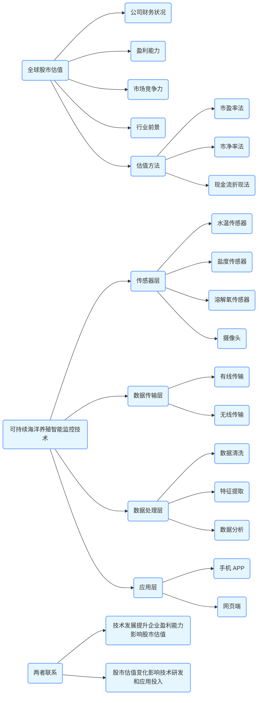

# 全球股市估值与可持续海洋养殖智能监控技术的关系

> 关键词：全球股市估值、可持续海洋养殖、智能监控技术、市场影响、行业关联

> 摘要：本文旨在深入探讨全球股市估值与可持续海洋养殖智能监控技术之间的关系。通过对背景知识的介绍，明确研究的目的、范围以及预期读者。详细阐述核心概念，包括全球股市估值的原理、可持续海洋养殖智能监控技术的架构等，并结合数学模型和公式进行分析。同时，给出实际的项目实战案例，展示代码实现及解读。分析该技术在实际应用中的场景，推荐相关的工具和资源。最后总结未来发展趋势与挑战，解答常见问题并提供扩展阅读和参考资料，全面揭示两者之间的内在联系。

## 1. 背景介绍 
### 1.1 目的和范围
本研究的目的在于揭示全球股市估值与可持续海洋养殖智能监控技术之间的内在联系和相互影响。通过对全球股市估值的分析，了解金融市场对海洋养殖行业的预期和评估；同时，研究可持续海洋养殖智能监控技术的发展现状、趋势以及其对海洋养殖行业的推动作用。范围涵盖全球股市中与海洋养殖相关的企业，以及可持续海洋养殖智能监控技术的各个方面，包括技术原理、应用场景、市场影响等。

### 1.2 预期读者
本文预期读者包括金融分析师、海洋养殖行业从业者、技术开发者、科研人员以及对金融市场和新兴技术感兴趣的人士。金融分析师可以从本文中获取关于海洋养殖行业在股市中的表现和潜在价值的信息；海洋养殖行业从业者能够了解智能监控技术对行业发展的重要性和应用前景；技术开发者可以借鉴相关技术原理和代码实现；科研人员可以在此基础上开展进一步的研究；而普通读者可以通过本文了解到金融市场和新兴技术之间的有趣联系。

### 1.3 文档结构概述
本文将按照以下结构进行阐述：首先介绍背景知识，包括研究目的、预期读者和文档结构概述等；接着详细讲解核心概念，包括全球股市估值和可持续海洋养殖智能监控技术的原理和架构；然后分析核心算法原理和具体操作步骤，并给出数学模型和公式；通过项目实战展示代码实现和解读；探讨实际应用场景；推荐相关的工具和资源；总结未来发展趋势与挑战；解答常见问题；最后提供扩展阅读和参考资料。

### 1.4 术语表
#### 1.4.1 核心术语定义
- **全球股市估值**：是指对全球范围内股票市场中上市公司的价值进行评估和计算的过程。通过对公司的财务状况、盈利能力、市场竞争力等因素的分析，确定股票的合理价格和市场价值。
- **可持续海洋养殖**：是指在满足当前海洋养殖需求的同时，不损害未来世代满足其自身需求的能力的养殖方式。注重环境保护、资源合理利用和生态平衡。
- **智能监控技术**：利用先进的传感器、通信技术和数据分析算法，对海洋养殖环境、养殖生物的生长状况等进行实时监测和分析的技术。

#### 1.4.2 相关概念解释
- **股市波动**：股票市场价格在一定时期内的上下变动现象，受到多种因素的影响，如宏观经济环境、公司业绩、政策法规等。
- **海洋养殖环境参数**：包括水温、盐度、溶解氧、酸碱度等，这些参数对养殖生物的生长和健康至关重要。
- **数据分析算法**：用于处理和分析监控数据的数学方法，如机器学习算法、统计分析方法等。

#### 1.4.3 缩略词列表
- **AI**：Artificial Intelligence，人工智能
- **IoT**：Internet of Things，物联网
- **ML**：Machine Learning，机器学习

## 2. 核心概念与联系 
### 全球股市估值原理
全球股市估值是一个复杂的过程，涉及多个因素的综合考虑。其核心原理是基于公司的未来现金流折现模型，即通过预测公司未来的现金流入和流出，将其折现到当前时间点，得到公司的内在价值。具体公式为：

$$V = \sum_{t=1}^{n} \frac{CF_t}{(1 + r)^t}$$

其中，$V$ 表示公司的内在价值，$CF_t$ 表示第 $t$ 期的现金流量，$r$ 表示折现率，$n$ 表示预测期数。

在实际应用中，还会考虑公司的盈利能力、市场竞争力、行业前景等因素。常用的估值方法包括市盈率法、市净率法、现金流折现法等。

### 可持续海洋养殖智能监控技术架构
可持续海洋养殖智能监控技术架构主要包括传感器层、数据传输层、数据处理层和应用层。

#### 传感器层
传感器层是整个监控系统的基础，负责实时采集海洋养殖环境参数和养殖生物的生长状况等数据。常用的传感器包括水温传感器、盐度传感器、溶解氧传感器、摄像头等。

#### 数据传输层
数据传输层负责将传感器采集到的数据传输到数据处理中心。常用的传输方式包括有线传输和无线传输，如以太网、Wi-Fi、LoRa 等。

#### 数据处理层
数据处理层是整个监控系统的核心，负责对采集到的数据进行处理和分析。主要包括数据清洗、特征提取、数据分析等步骤。常用的数据分析算法包括机器学习算法、统计分析方法等。

#### 应用层
应用层是整个监控系统的最终体现，负责将数据分析结果以直观的方式展示给用户，并提供相应的决策支持。常用的应用方式包括手机 APP、网页端等。

### 两者之间的联系
全球股市估值与可持续海洋养殖智能监控技术之间存在着密切的联系。一方面，可持续海洋养殖智能监控技术的发展可以提高海洋养殖的效率和质量，降低养殖成本，从而提升海洋养殖企业的盈利能力和市场竞争力，进而影响全球股市中海洋养殖相关企业的估值。另一方面，全球股市估值的变化也会影响投资者对海洋养殖行业的信心和投资意愿，从而影响可持续海洋养殖智能监控技术的研发和应用投入。

### 文本示意图
```plaintext
全球股市估值
|
|-- 公司财务状况
|-- 盈利能力
|-- 市场竞争力
|-- 行业前景
|
|-- 估值方法（市盈率法、市净率法、现金流折现法等）

可持续海洋养殖智能监控技术
|
|-- 传感器层（水温传感器、盐度传感器、溶解氧传感器、摄像头等）
|-- 数据传输层（有线传输、无线传输）
|-- 数据处理层（数据清洗、特征提取、数据分析）
|-- 应用层（手机 APP、网页端）

两者联系
|
|-- 技术发展提升企业盈利能力，影响股市估值
|-- 股市估值变化影响技术研发和应用投入
```

### Mermaid 流程图


## 3. 核心算法原理 & 具体操作步骤 
### 核心算法原理
在可持续海洋养殖智能监控技术中，常用的核心算法包括机器学习算法和统计分析方法。下面以机器学习算法中的决策树算法为例，介绍其原理。

决策树算法是一种基于树结构进行决策的算法，它通过对数据的特征进行分析和划分，构建一棵决策树。在决策树中，每个内部节点表示一个特征上的测试，每个分支表示一个测试输出，每个叶节点表示一个类别或值。

决策树算法的核心是如何选择最优的特征进行划分。常用的方法包括信息增益、信息增益率、基尼指数等。以信息增益为例，其计算公式为：

$$IG(D, A) = Ent(D) - \sum_{v=1}^{V} \frac{|D^v|}{|D|} Ent(D^v)$$

其中，$IG(D, A)$ 表示特征 $A$ 对数据集 $D$ 的信息增益，$Ent(D)$ 表示数据集 $D$ 的信息熵，$|D^v|$ 表示数据集 $D$ 中特征 $A$ 取值为 $v$ 的样本数，$|D|$ 表示数据集 $D$ 的样本总数，$Ent(D^v)$ 表示数据集 $D^v$ 的信息熵。

### 具体操作步骤
#### 数据准备
首先，需要收集海洋养殖环境参数和养殖生物的生长状况等数据，并进行清洗和预处理。数据清洗包括去除噪声数据、处理缺失值等；数据预处理包括数据标准化、特征提取等。

#### 模型训练
使用准备好的数据对决策树模型进行训练。在训练过程中，需要选择合适的特征和划分方法，构建最优的决策树。

#### 模型评估
使用测试数据对训练好的决策树模型进行评估，计算模型的准确率、召回率、F1 值等指标，评估模型的性能。

#### 模型应用
将训练好的决策树模型应用到实际的海洋养殖智能监控系统中，对海洋养殖环境参数和养殖生物的生长状况进行实时监测和分析，提供相应的决策支持。

### Python 源代码实现
```python
import pandas as pd
from sklearn.model_selection import train_test_split
from sklearn.tree import DecisionTreeClassifier
from sklearn.metrics import accuracy_score

# 读取数据
data = pd.read_csv('ocean_farming_data.csv')

# 划分特征和标签
X = data.drop('label', axis=1)
y = data['label']

# 划分训练集和测试集
X_train, X_test, y_train, y_test = train_test_split(X, y, test_size=0.2, random_state=42)

# 创建决策树模型
model = DecisionTreeClassifier()

# 训练模型
model.fit(X_train, y_train)

# 预测
y_pred = model.predict(X_test)

# 评估模型
accuracy = accuracy_score(y_test, y_pred)
print(f"模型准确率: {accuracy}")
```

## 4. 数学模型和公式 & 详细讲解 & 举例说明 
### 全球股市估值数学模型
如前文所述，全球股市估值常用的数学模型是现金流折现模型，公式为：

$$V = \sum_{t=1}^{n} \frac{CF_t}{(1 + r)^t}$$

详细讲解：
- $V$ 表示公司的内在价值，即公司股票的合理价格。
- $CF_t$ 表示第 $t$ 期的现金流量，是公司在第 $t$ 期的现金流入减去现金流出后的净额。
- $r$ 表示折现率，反映了投资者对资金时间价值和风险的要求。折现率越高，说明投资者对风险的要求越高，公司的内在价值越低。
- $n$ 表示预测期数，通常根据公司的发展阶段和行业特点来确定。

举例说明：假设一家海洋养殖企业预计未来 3 年的现金流量分别为 100 万元、120 万元和 150 万元，折现率为 10%，则该公司的内在价值为：

$$V = \frac{100}{(1 + 0.1)^1} + \frac{120}{(1 + 0.1)^2} + \frac{150}{(1 + 0.1)^3} \approx 295.42 \text{（万元）}$$

### 决策树算法数学模型
决策树算法中常用的信息增益公式为：

$$IG(D, A) = Ent(D) - \sum_{v=1}^{V} \frac{|D^v|}{|D|} Ent(D^v)$$

详细讲解：
- $IG(D, A)$ 表示特征 $A$ 对数据集 $D$ 的信息增益，信息增益越大，说明特征 $A$ 对数据集 $D$ 的划分能力越强。
- $Ent(D)$ 表示数据集 $D$ 的信息熵，反映了数据集 $D$ 的不确定性。信息熵越大，说明数据集 $D$ 的不确定性越大。信息熵的计算公式为：

$$Ent(D) = - \sum_{k=1}^{K} p_k \log_2 p_k$$

其中，$p_k$ 表示数据集 $D$ 中第 $k$ 类样本的比例，$K$ 表示数据集 $D$ 的类别数。

- $|D^v|$ 表示数据集 $D$ 中特征 $A$ 取值为 $v$ 的样本数，$|D|$ 表示数据集 $D$ 的样本总数。
- $Ent(D^v)$ 表示数据集 $D^v$ 的信息熵，即数据集 $D$ 中特征 $A$ 取值为 $v$ 的样本的信息熵。

举例说明：假设有一个数据集 $D$ 包含 10 个样本，分为 2 类，其中第 1 类有 6 个样本，第 2 类有 4 个样本。特征 $A$ 有 2 个取值，$v_1$ 和 $v_2$，其中取值为 $v_1$ 的样本有 4 个，属于第 1 类的有 3 个，属于第 2 类的有 1 个；取值为 $v_2$ 的样本有 6 个，属于第 1 类的有 3 个，属于第 2 类的有 3 个。则数据集 $D$ 的信息熵为：

$$Ent(D) = - \frac{6}{10} \log_2 \frac{6}{10} - \frac{4}{10} \log_2 \frac{4}{10} \approx 0.971$$

特征 $A$ 取值为 $v_1$ 的样本的信息熵为：

$$Ent(D^{v_1}) = - \frac{3}{4} \log_2 \frac{3}{4} - \frac{1}{4} \log_2 \frac{1}{4} \approx 0.811$$

特征 $A$ 取值为 $v_2$ 的样本的信息熵为：

$$Ent(D^{v_2}) = - \frac{3}{6} \log_2 \frac{3}{6} - \frac{3}{6} \log_2 \frac{3}{6} = 1$$

则特征 $A$ 对数据集 $D$ 的信息增益为：

$$IG(D, A) = 0.971 - \frac{4}{10} \times 0.811 - \frac{6}{10} \times 1 \approx 0.046$$

## 5. 项目实战：代码实际案例和详细解释说明 
### 5.1  开发环境搭建
#### 安装 Python
首先，需要安装 Python 环境。可以从 Python 官方网站（https://www.python.org/downloads/）下载适合自己操作系统的 Python 安装包，并按照安装向导进行安装。

#### 安装必要的库
在项目中，需要使用到一些 Python 库，如 pandas、scikit-learn 等。可以使用 pip 命令进行安装：

```sh
pip install pandas scikit-learn
```

### 5.2  源代码详细实现和代码解读
```python
import pandas as pd
from sklearn.model_selection import train_test_split
from sklearn.tree import DecisionTreeClassifier
from sklearn.metrics import accuracy_score

# 读取数据
data = pd.read_csv('ocean_farming_data.csv')

# 代码解读：使用 pandas 库的 read_csv 函数读取海洋养殖数据文件。
# 'ocean_farming_data.csv' 是数据文件的路径，需要根据实际情况进行修改。

# 划分特征和标签
X = data.drop('label', axis=1)
y = data['label']

# 代码解读：将数据集中的特征和标签进行划分。
# 'label' 是数据集中的标签列名，需要根据实际情况进行修改。
# X 是特征矩阵，y 是标签向量。

# 划分训练集和测试集
X_train, X_test, y_train, y_test = train_test_split(X, y, test_size=0.2, random_state=42)

# 代码解读：使用 sklearn 库的 train_test_split 函数将数据集划分为训练集和测试集。
# test_size=0.2 表示将 20% 的数据作为测试集，80% 的数据作为训练集。
# random_state=42 是随机种子，保证每次划分的结果相同。

# 创建决策树模型
model = DecisionTreeClassifier()

# 代码解读：使用 sklearn 库的 DecisionTreeClassifier 类创建一个决策树分类器模型。

# 训练模型
model.fit(X_train, y_train)

# 代码解读：使用训练集数据对决策树模型进行训练。

# 预测
y_pred = model.predict(X_test)

# 代码解读：使用训练好的决策树模型对测试集数据进行预测。

# 评估模型
accuracy = accuracy_score(y_test, y_pred)
print(f"模型准确率: {accuracy}")

# 代码解读：使用 sklearn 库的 accuracy_score 函数计算模型的准确率，并将结果打印输出。
```

### 5.3  代码解读与分析
通过上述代码，我们实现了一个基于决策树算法的海洋养殖数据分类模型。具体步骤包括数据读取、特征和标签划分、训练集和测试集划分、模型创建、模型训练、模型预测和模型评估。

代码的核心是使用决策树算法对海洋养殖数据进行分类，通过计算模型的准确率来评估模型的性能。在实际应用中，可以根据需要调整决策树模型的参数，如树的深度、最小样本数等，以提高模型的性能。

## 6. 实际应用场景 
### 股市投资决策
投资者可以通过分析可持续海洋养殖智能监控技术的发展趋势和应用情况，评估海洋养殖企业的发展潜力和市场竞争力，从而做出更明智的股市投资决策。例如，如果某家海洋养殖企业积极采用智能监控技术，提高了养殖效率和质量，降低了养殖成本，那么该企业的盈利能力和市场竞争力可能会增强，其股票的估值也可能会上升。

### 海洋养殖企业管理
海洋养殖企业可以利用智能监控技术实时监测海洋养殖环境参数和养殖生物的生长状况，及时发现问题并采取相应的措施，提高养殖效率和质量。例如，当监测到水温过高或溶解氧过低时，企业可以及时调整养殖设备，保证养殖生物的健康生长。同时，企业还可以通过对监控数据的分析，优化养殖方案，降低养殖成本。

### 政府监管
政府部门可以利用智能监控技术对海洋养殖行业进行监管，确保海洋养殖活动符合环保要求和可持续发展原则。例如，政府可以通过监测海洋养殖环境参数，及时发现和处理养殖污染问题，保护海洋生态环境。同时，政府还可以通过对海洋养殖企业的监控数据进行分析，制定合理的产业政策，促进海洋养殖行业的健康发展。

## 7. 工具和资源推荐
### 7.1 学习资源推荐
#### 7.1.1 书籍推荐
- 《Python 数据分析实战》：介绍了 Python 在数据分析领域的应用，包括数据处理、数据分析、数据可视化等方面的知识和技能。
- 《机器学习实战》：通过实际案例介绍了机器学习的基本算法和应用，包括决策树、神经网络、支持向量机等。
- 《金融市场学》：系统介绍了金融市场的基本理论和实践，包括股票市场、债券市场、期货市场等。

#### 7.1.2 在线课程
- Coursera 上的《机器学习》课程：由斯坦福大学教授 Andrew Ng 授课，是机器学习领域的经典课程。
- edX 上的《Python 数据科学》课程：介绍了 Python 在数据科学领域的应用，包括数据处理、数据分析、机器学习等方面的知识和技能。
- 中国大学 MOOC 上的《金融市场学》课程：由国内知名高校教授授课，系统介绍了金融市场的基本理论和实践。

#### 7.1.3 技术博客和网站
- Medium：一个技术博客平台，上面有很多关于机器学习、数据分析、金融科技等领域的优秀文章。
- Towards Data Science：专注于数据科学领域的技术博客，提供了很多实用的数据分析和机器学习教程。
- 雪球网：一个财经社区，提供了丰富的股票市场信息和投资分析工具。

### 7.2 开发工具框架推荐
#### 7.2.1 IDE和编辑器
- PyCharm：一款专业的 Python 集成开发环境，提供了丰富的代码编辑、调试、测试等功能。
- Jupyter Notebook：一个交互式的开发环境，适合进行数据分析和机器学习实验。
- Visual Studio Code：一款轻量级的代码编辑器，支持多种编程语言，提供了丰富的插件和扩展功能。

#### 7.2.2 调试和性能分析工具
- pdb：Python 自带的调试工具，可以帮助开发者定位和解决代码中的问题。
- cProfile：Python 自带的性能分析工具，可以帮助开发者分析代码的性能瓶颈。
- TensorBoard：TensorFlow 提供的可视化工具，可以帮助开发者可视化模型的训练过程和性能指标。

#### 7.2.3 相关框架和库
- pandas：一个强大的数据处理和分析库，提供了丰富的数据结构和数据处理函数。
- scikit-learn：一个常用的机器学习库，提供了各种机器学习算法和工具，如分类、回归、聚类等。
- TensorFlow：一个开源的深度学习框架，广泛应用于图像识别、自然语言处理等领域。

### 7.3 相关论文著作推荐
#### 7.3.1 经典论文
- 《A Decision-Theoretic Generalization of On-Line Learning and an Application to Boosting》：介绍了决策树算法的基本原理和应用。
- 《Deep Residual Learning for Image Recognition》：提出了深度残差网络（ResNet），在图像识别领域取得了很好的效果。
- 《Efficient Market Hypothesis: A Review and Empirical Investigation》：对有效市场假说进行了综述和实证研究。

#### 7.3.2 最新研究成果
- 《Sustainable Aquaculture: Challenges and Opportunities》：探讨了可持续海洋养殖的挑战和机遇。
- 《Intelligent Monitoring and Control Systems for Aquaculture》：介绍了海洋养殖智能监控和控制系统的最新研究成果。
- 《The Impact of Emerging Technologies on Stock Market Valuation》：分析了新兴技术对股市估值的影响。

#### 7.3.3 应用案例分析
- 《Case Study: The Application of Intelligent Monitoring Technology in a Large-Scale Aquaculture Farm》：介绍了智能监控技术在一个大型海洋养殖农场的应用案例。
- 《Analysis of the Stock Market Performance of Aquaculture Companies with Intelligent Monitoring Technology》：分析了采用智能监控技术的海洋养殖企业的股市表现。

## 8. 总结：未来发展趋势与挑战
### 未来发展趋势
#### 技术融合
可持续海洋养殖智能监控技术将与人工智能、物联网、大数据等技术深度融合，实现更智能化、自动化的监控和管理。例如，通过人工智能算法对监控数据进行分析和预测，提前发现养殖风险并采取相应的措施；利用物联网技术实现设备的远程控制和自动化操作。

#### 产业升级
随着可持续海洋养殖智能监控技术的发展，海洋养殖行业将迎来产业升级。传统的养殖方式将逐渐被智能化、可持续化的养殖方式所取代，养殖效率和质量将得到大幅提升。同时，海洋养殖产业链也将不断完善，包括饲料生产、养殖设备制造、水产品加工等环节将更加协同发展。

#### 国际化合作
全球股市估值与可持续海洋养殖智能监控技术的发展将促进国际间的合作与交流。各国可以分享技术和经验，共同推动海洋养殖行业的可持续发展。例如，一些发达国家可以向发展中国家提供先进的智能监控技术和设备，帮助其提高海洋养殖水平；发展中国家可以向发达国家提供丰富的海洋资源和市场，实现互利共赢。

### 挑战
#### 技术成本
可持续海洋养殖智能监控技术的研发和应用需要大量的资金和技术投入，这对于一些小型海洋养殖企业来说可能是一个巨大的挑战。此外，智能监控设备的维护和更新也需要一定的成本，这将增加企业的运营成本。

#### 数据安全
可持续海洋养殖智能监控技术涉及大量的海洋养殖环境参数和养殖生物的生长状况等数据，这些数据的安全至关重要。如果数据被泄露或篡改，可能会对企业的生产和经营造成严重影响。因此，如何保障数据的安全是一个亟待解决的问题。

#### 政策法规
可持续海洋养殖智能监控技术的发展需要相应的政策法规支持。目前，相关的政策法规还不够完善，这可能会影响技术的推广和应用。例如，在数据采集、使用和共享等方面缺乏明确的规定，可能会导致企业在实际操作中面临一些困难。

## 9. 附录：常见问题与解答
### 问题 1：全球股市估值与可持续海洋养殖智能监控技术之间的联系是如何建立的？
解答：可持续海洋养殖智能监控技术的发展可以提高海洋养殖的效率和质量，降低养殖成本，从而提升海洋养殖企业的盈利能力和市场竞争力。而股市估值是基于公司的盈利能力、市场竞争力等因素进行评估的，因此技术的发展会影响海洋养殖企业的股市估值。反之，股市估值的变化也会影响投资者对海洋养殖行业的信心和投资意愿，从而影响技术的研发和应用投入。

### 问题 2：决策树算法在可持续海洋养殖智能监控技术中有什么作用？
解答：决策树算法可以对海洋养殖环境参数和养殖生物的生长状况等数据进行分析和分类，帮助企业及时发现养殖过程中的问题并采取相应的措施。例如，通过对水温、盐度、溶解氧等环境参数的分析，判断养殖生物是否处于适宜的生长环境中；通过对养殖生物的生长速度、健康状况等数据的分析，预测养殖生物的产量和质量。

### 问题 3：如何保障可持续海洋养殖智能监控技术中数据的安全？
解答：可以采取以下措施保障数据的安全：一是采用加密技术对数据进行加密处理，防止数据在传输和存储过程中被泄露；二是建立严格的访问控制机制，限制对数据的访问权限，只有授权人员才能访问和处理数据；三是定期对数据进行备份，防止数据丢失；四是加强对网络安全的防护，防止黑客攻击和恶意软件的入侵。

### 问题 4：可持续海洋养殖智能监控技术的发展对海洋生态环境有什么影响？
解答：可持续海洋养殖智能监控技术的发展有助于保护海洋生态环境。通过实时监测海洋养殖环境参数，企业可以及时发现和处理养殖污染问题，减少对海洋生态环境的破坏。同时，智能监控技术还可以帮助企业优化养殖方案，提高养殖效率，减少对海洋资源的过度开发和利用，实现海洋养殖的可持续发展。

## 10. 扩展阅读 & 参考资料
### 扩展阅读
- 《海洋经济发展报告》：提供了全球海洋经济发展的最新动态和趋势。
- 《人工智能在农业领域的应用》：介绍了人工智能在农业领域的各种应用案例和技术原理。
- 《金融科技前沿研究》：关注金融科技领域的最新研究成果和应用实践。

### 参考资料
- [1] 《Python 数据分析实战》，作者：[美] Wes McKinney，机械工业出版社
- [2] 《机器学习实战》，作者：[美] Peter Harrington，人民邮电出版社
- [3] 《金融市场学》，作者：张亦春，高等教育出版社
- [4] 《A Decision-Theoretic Generalization of On-Line Learning and an Application to Boosting》，作者：Yoav Freund，Robert E. Schapire
- [5] 《Deep Residual Learning for Image Recognition》，作者：Kaiming He，Xiangyu Zhang，Shaoqing Ren，Jian Sun
- [6] 《Efficient Market Hypothesis: A Review and Empirical Investigation》，作者：Eugene F. Fama

作者：AI天才研究院/AI Genius Institute & 禅与计算机程序设计艺术 /Zen And The Art of Computer Programming