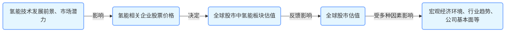

# 全球股市估值与可持续能源氢能技术的关联

> 关键词：全球股市估值、可持续能源、氢能技术、关联分析、金融市场、能源转型、投资趋势

> 摘要：本文旨在深入探讨全球股市估值与可持续能源氢能技术之间的关联。随着全球对可持续能源的关注度不断提升，氢能技术作为一种极具潜力的清洁能源解决方案，其发展态势对全球金融市场，特别是股市估值产生了不可忽视的影响。文章将从背景介绍入手，阐述相关核心概念及联系，分析核心算法原理与操作步骤，引入数学模型和公式进行详细讲解，通过项目实战案例展示两者关联在实际中的体现，探讨实际应用场景，推荐相关工具和资源，最后总结未来发展趋势与挑战，并对常见问题进行解答，为投资者、研究者和行业从业者提供全面且深入的见解。

## 1. 背景介绍 
### 1.1 目的和范围
本研究的主要目的是全面剖析全球股市估值与可持续能源氢能技术之间的内在联系。通过对两者关联的深入研究，为投资者提供决策参考，帮助他们更好地把握金融市场中与氢能技术相关的投资机会；为政策制定者提供理论依据，以便制定更有利于氢能技术发展和金融市场稳定的政策；同时也为学术界提供新的研究视角和方向。研究范围涵盖全球主要股票市场，包括但不限于美国、欧洲、亚洲等地区的股市，以及氢能技术的各个领域，如氢能生产、储存、运输和应用等。

### 1.2 预期读者
本文的预期读者主要包括金融市场投资者，他们希望通过了解氢能技术对股市估值的影响，优化投资组合，获取更高的投资回报；能源行业从业者，他们关注氢能技术的发展趋势和市场前景，以便在企业战略规划和技术研发方面做出更明智的决策；政策制定者，他们需要依据相关研究结果制定能源政策和金融监管政策；以及学术界的研究人员，他们对金融市场与能源技术的交叉领域感兴趣，希望从中获取新的研究灵感和数据支持。

### 1.3 文档结构概述
本文将按照以下结构展开：首先介绍研究的背景信息，包括目的、预期读者和文档结构概述；接着阐述全球股市估值和氢能技术的核心概念及两者之间的联系，并通过文本示意图和 Mermaid 流程图进行直观展示；然后分析核心算法原理和具体操作步骤，使用 Python 源代码详细阐述；引入数学模型和公式进行详细讲解，并举例说明；通过项目实战案例展示两者关联在实际中的体现，包括开发环境搭建、源代码详细实现和代码解读；探讨实际应用场景；推荐相关工具和资源，包括学习资源、开发工具框架和相关论文著作；最后总结未来发展趋势与挑战，解答常见问题，并提供扩展阅读和参考资料。

### 1.4 术语表
#### 1.4.1 核心术语定义
- **全球股市估值**：指对全球范围内各个股票市场中上市公司股票价值的评估，通常通过市盈率（P/E）、市净率（P/B）等指标来衡量。
- **可持续能源**：指在满足当代人能源需求的同时，不损害后代人满足其自身能源需求能力的能源，如太阳能、风能、水能和氢能等。
- **氢能技术**：涵盖了氢能的生产、储存、运输和应用等一系列技术，旨在实现氢能的高效、安全和可持续利用。
- **市盈率（P/E）**：指股票价格与每股收益的比率，反映了投资者为获取每单位收益所愿意支付的价格。
- **市净率（P/B）**：指股票价格与每股净资产的比率，反映了股票价格相对于公司净资产的倍数。

#### 1.4.2 相关概念解释
- **能源转型**：指从传统的化石能源向可持续能源的转变过程，旨在减少对化石能源的依赖，降低碳排放，实现能源的可持续发展。
- **绿色金融**：指为支持环境改善、应对气候变化和资源节约高效利用的经济活动所提供的金融服务，包括绿色信贷、绿色债券、绿色股票等。
- **氢能经济**：指以氢能为主要能源载体的经济体系，包括氢能的生产、储存、运输、应用和相关产业的发展。

#### 1.4.3 缩略词列表
- **P/E**：市盈率（Price-to-Earnings Ratio）
- **P/B**：市净率（Price-to-Book Ratio）
- **LCOE**：平准化能源成本（Levelized Cost of Energy）
- **SOFC**：固体氧化物燃料电池（Solid Oxide Fuel Cell）

## 2. 核心概念与联系 
### 核心概念原理
#### 全球股市估值原理
全球股市估值是基于市场参与者对上市公司未来盈利能力和现金流的预期。市盈率（P/E）和市净率（P/B）是常用的估值指标。市盈率反映了投资者对公司盈利增长的预期，较高的市盈率通常意味着市场对公司未来盈利增长有较高的期望；市净率则反映了公司的资产价值和市场对其的认可度。股市估值受到多种因素的影响，包括宏观经济环境、行业发展趋势、公司基本面等。

#### 氢能技术原理
氢能技术主要包括氢能的生产、储存、运输和应用四个环节。氢能的生产方法主要有化石燃料重整、水电解、生物质制氢等；储存方式包括高压气态储存、低温液态储存和固态储存等；运输方式主要有管道运输、槽车运输等；应用领域包括交通运输、分布式发电、工业供热等。氢能技术的发展目标是提高氢能的生产效率、降低成本、增强安全性和可靠性。

### 两者联系架构
全球股市估值与氢能技术之间存在着密切的联系。一方面，氢能技术的发展前景和市场潜力会影响相关企业的盈利能力和市场预期，进而影响其股票价格和股市估值。例如，当氢能技术取得重大突破，成本大幅降低，应用范围不断扩大时，市场对氢能相关企业的未来盈利预期会提高，从而推动其股票价格上涨，提升股市估值。另一方面，股市估值的变化也会影响氢能技术的发展。高估值的股市可以为氢能企业提供更多的融资渠道和资金支持，促进其技术研发和产业扩张；而低估值的股市则可能导致企业融资困难，影响技术发展的速度和规模。

### 文本示意图
```plaintext
全球股市估值 <-- 宏观经济环境、行业趋势、公司基本面等因素
               |
               | 影响
               v
氢能相关企业股票价格 <-- 氢能技术发展前景、市场潜力
               |
               | 决定
               v
全球股市中氢能板块估值
```

### Mermaid 流程图


## 3. 核心算法原理 & 具体操作步骤 
### 核心算法原理
为了分析全球股市估值与氢能技术的关联，我们可以采用多元线性回归模型。该模型的基本原理是通过建立因变量（全球股市中氢能板块估值）与多个自变量（如氢能技术研发投入、氢能应用市场规模、宏观经济指标等）之间的线性关系，来评估各个自变量对因变量的影响程度。

多元线性回归模型的一般形式为：
$$Y = \beta_0 + \beta_1X_1 + \beta_2X_2 + \cdots + \beta_nX_n + \epsilon$$
其中，$Y$ 是因变量，即全球股市中氢能板块估值；$X_1, X_2, \cdots, X_n$ 是自变量，分别代表不同的影响因素；$\beta_0$ 是截距项，$\beta_1, \beta_2, \cdots, \beta_n$ 是回归系数，反映了各个自变量对因变量的影响程度；$\epsilon$ 是误差项，代表模型无法解释的随机因素。

### 具体操作步骤
#### 数据收集
收集全球股市中氢能板块的相关数据，包括股票价格、市盈率、市净率等；收集氢能技术相关数据，如研发投入、专利数量、应用市场规模等；收集宏观经济数据，如 GDP 增长率、通货膨胀率等。数据来源可以包括金融数据库、行业报告、政府统计部门等。

#### 数据预处理
对收集到的数据进行清洗和预处理，包括去除缺失值、异常值处理、数据标准化等。数据标准化可以采用 Z-score 标准化方法，将数据转换为均值为 0，标准差为 1 的标准正态分布。

#### 模型建立
使用 Python 的 `scikit-learn` 库建立多元线性回归模型。具体步骤如下：
```python
import numpy as np
from sklearn.linear_model import LinearRegression
from sklearn.preprocessing import StandardScaler
from sklearn.model_selection import train_test_split

# 假设 X 是自变量矩阵，y 是因变量向量
# 这里需要根据实际情况替换为真实数据
X = np.random.rand(100, 3)  # 示例数据，100 个样本，3 个自变量
y = np.random.rand(100)     # 示例数据，100 个样本

# 数据标准化
scaler = StandardScaler()
X_scaled = scaler.fit_transform(X)

# 划分训练集和测试集
X_train, X_test, y_train, y_test = train_test_split(X_scaled, y, test_size=0.2, random_state=42)

# 建立线性回归模型
model = LinearRegression()
model.fit(X_train, y_train)
```

#### 模型评估
使用测试集数据对模型进行评估，常用的评估指标包括均方误差（MSE）、均方根误差（RMSE）和决定系数（$R^2$）等。
```python
from sklearn.metrics import mean_squared_error, r2_score

# 模型预测
y_pred = model.predict(X_test)

# 计算评估指标
mse = mean_squared_error(y_test, y_pred)
rmse = np.sqrt(mse)
r2 = r2_score(y_test, y_pred)

print(f"均方误差 (MSE): {mse}")
print(f"均方根误差 (RMSE): {rmse}")
print(f"决定系数 (R^2): {r2}")
```

#### 结果分析
根据模型的回归系数和评估指标，分析各个自变量对因变量的影响程度。回归系数为正表示自变量与因变量呈正相关，回归系数为负表示自变量与因变量呈负相关。决定系数 $R^2$ 越接近 1，说明模型对数据的拟合效果越好。

## 4. 数学模型和公式 & 详细讲解 & 举例说明 
### 数学模型和公式
#### 多元线性回归模型
如前文所述，多元线性回归模型的一般形式为：
$$Y = \beta_0 + \beta_1X_1 + \beta_2X_2 + \cdots + \beta_nX_n + \epsilon$$
其中，$Y$ 是因变量，$X_1, X_2, \cdots, X_n$ 是自变量，$\beta_0$ 是截距项，$\beta_1, \beta_2, \cdots, \beta_n$ 是回归系数，$\epsilon$ 是误差项。

#### 回归系数的估计
回归系数 $\beta_0, \beta_1, \beta_2, \cdots, \beta_n$ 可以通过最小二乘法进行估计。最小二乘法的目标是使观测值 $Y$ 与模型预测值 $\hat{Y}$ 之间的误差平方和最小，即：
$$\min_{\beta_0, \beta_1, \cdots, \beta_n} \sum_{i=1}^{m} (y_i - \hat{y}_i)^2$$
其中，$m$ 是样本数量，$y_i$ 是第 $i$ 个观测值，$\hat{y}_i$ 是第 $i$ 个预测值。

#### 评估指标公式
- 均方误差（MSE）：
$$MSE = \frac{1}{m} \sum_{i=1}^{m} (y_i - \hat{y}_i)^2$$
- 均方根误差（RMSE）：
$$RMSE = \sqrt{\frac{1}{m} \sum_{i=1}^{m} (y_i - \hat{y}_i)^2}$$
- 决定系数（$R^2$）：
$$R^2 = 1 - \frac{\sum_{i=1}^{m} (y_i - \hat{y}_i)^2}{\sum_{i=1}^{m} (y_i - \bar{y})^2}$$
其中，$\bar{y}$ 是 $y$ 的均值。

### 详细讲解
多元线性回归模型通过建立因变量与多个自变量之间的线性关系，来分析各个自变量对因变量的影响程度。回归系数的估计是通过最小二乘法实现的，它使得模型的预测值与观测值之间的误差平方和最小。评估指标用于衡量模型的拟合效果，均方误差和均方根误差反映了模型预测值与观测值之间的平均误差，决定系数则表示模型能够解释因变量变化的比例。

### 举例说明
假设我们要分析全球股市中氢能板块估值（$Y$）与氢能技术研发投入（$X_1$）、氢能应用市场规模（$X_2$）和 GDP 增长率（$X_3$）之间的关系。我们收集了 100 个样本数据，并使用上述多元线性回归模型进行分析。经过数据预处理和模型训练，得到回归系数 $\beta_0 = 10$，$\beta_1 = 0.5$，$\beta_2 = 0.3$，$\beta_3 = 0.2$。这意味着，在其他因素不变的情况下，氢能技术研发投入每增加 1 个单位，全球股市中氢能板块估值将增加 0.5 个单位；氢能应用市场规模每增加 1 个单位，估值将增加 0.3 个单位；GDP 增长率每增加 1 个百分点，估值将增加 0.2 个单位。

假设在某一时期，氢能技术研发投入为 20 个单位，氢能应用市场规模为 30 个单位，GDP 增长率为 3%，则根据模型预测的全球股市中氢能板块估值为：
$$Y = 10 + 0.5 \times 20 + 0.3 \times 30 + 0.2 \times 3 = 10 + 10 + 9 + 0.6 = 29.6$$

通过计算评估指标，我们发现均方误差为 2.5，均方根误差为 1.58，决定系数为 0.8。这表明模型对数据的拟合效果较好，能够解释 80% 的因变量变化。

## 5. 项目实战：代码实际案例和详细解释说明 
### 5.1  开发环境搭建
#### 安装 Python
首先，确保你已经安装了 Python 环境。建议使用 Python 3.7 及以上版本，可以从 Python 官方网站（https://www.python.org/downloads/）下载并安装。

#### 安装必要的库
使用 `pip` 命令安装所需的 Python 库，包括 `pandas`、`numpy`、`scikit-learn` 等。
```bash
pip install pandas numpy scikit-learn
```

#### 数据准备
收集全球股市中氢能板块的相关数据，包括股票价格、市盈率、市净率等；收集氢能技术相关数据，如研发投入、专利数量、应用市场规模等；收集宏观经济数据，如 GDP 增长率、通货膨胀率等。将数据保存为 CSV 文件，例如 `hydrogen_stock_data.csv`。

### 5.2  源代码详细实现和代码解读
```python
import pandas as pd
import numpy as np
from sklearn.linear_model import LinearRegression
from sklearn.preprocessing import StandardScaler
from sklearn.model_selection import train_test_split
from sklearn.metrics import mean_squared_error, r2_score

# 读取数据
data = pd.read_csv('hydrogen_stock_data.csv')

# 提取自变量和因变量
X = data.drop('hydrogen_stock_valuation', axis=1).values
y = data['hydrogen_stock_valuation'].values

# 数据标准化
scaler = StandardScaler()
X_scaled = scaler.fit_transform(X)

# 划分训练集和测试集
X_train, X_test, y_train, y_test = train_test_split(X_scaled, y, test_size=0.2, random_state=42)

# 建立线性回归模型
model = LinearRegression()
model.fit(X_train, y_train)

# 模型预测
y_pred = model.predict(X_test)

# 计算评估指标
mse = mean_squared_error(y_test, y_pred)
rmse = np.sqrt(mse)
r2 = r2_score(y_test, y_pred)

# 输出结果
print(f"回归系数: {model.coef_}")
print(f"截距项: {model.intercept_}")
print(f"均方误差 (MSE): {mse}")
print(f"均方根误差 (RMSE): {rmse}")
print(f"决定系数 (R^2): {r2}")
```

### 代码解读与分析
#### 数据读取
使用 `pandas` 库的 `read_csv` 函数读取保存为 CSV 文件的数据。

#### 自变量和因变量提取
使用 `drop` 方法从数据中提取自变量矩阵 `X`，并使用 `values` 属性将其转换为 NumPy 数组；使用 `[]` 方法提取因变量向量 `y`，并同样转换为 NumPy 数组。

#### 数据标准化
使用 `StandardScaler` 类对自变量矩阵 `X` 进行标准化处理，将其转换为均值为 0，标准差为 1 的标准正态分布。

#### 训练集和测试集划分
使用 `train_test_split` 函数将数据划分为训练集和测试集，测试集占总数据的 20%。

#### 模型建立和训练
使用 `LinearRegression` 类建立线性回归模型，并使用训练集数据对模型进行训练。

#### 模型预测和评估
使用训练好的模型对测试集数据进行预测，并计算均方误差、均方根误差和决定系数等评估指标。

#### 结果输出
输出回归系数、截距项和评估指标，以便分析各个自变量对因变量的影响程度和模型的拟合效果。

## 6. 实际应用场景 
### 投资决策
投资者可以通过分析全球股市估值与氢能技术的关联，选择具有潜力的氢能相关股票进行投资。当氢能技术取得重大突破，市场对氢能相关企业的未来盈利预期提高时，投资者可以增加对这些企业股票的持仓；反之，当氢能技术发展遇到瓶颈，市场预期下降时，投资者可以减少持仓或进行避险操作。

### 企业战略规划
氢能企业可以根据股市估值的变化调整自身的战略规划。当股市对氢能板块给予高估值时，企业可以通过增发股票、发行债券等方式筹集更多资金，加大技术研发和产业扩张的力度；当股市估值较低时，企业可以优化内部管理，降低成本，提高运营效率，等待市场机会。

### 政策制定
政策制定者可以根据全球股市估值与氢能技术的关联，制定更有利于氢能技术发展和金融市场稳定的政策。例如，政府可以出台税收优惠、补贴等政策，鼓励企业加大对氢能技术的研发投入；同时，加强对金融市场的监管，防范因氢能技术发展不确定性带来的金融风险。

### 行业研究
学术界和研究机构可以通过研究全球股市估值与氢能技术的关联，深入了解金融市场与能源技术之间的相互作用机制，为能源转型和可持续发展提供理论支持和决策建议。

## 7. 工具和资源推荐
### 7.1 学习资源推荐
#### 7.1.1 书籍推荐
- 《金融市场学》：全面介绍金融市场的基本概念、理论和实践，为理解全球股市估值提供基础。
- 《氢能技术原理与应用》：详细阐述氢能技术的各个方面，包括生产、储存、运输和应用等。
- 《多元统计分析》：深入讲解多元线性回归等统计方法，为分析两者关联提供理论支持。

#### 7.1.2 在线课程
- Coursera 上的“金融市场”课程：由知名教授授课，系统介绍金融市场的知识和分析方法。
- edX 上的“氢能与燃料电池技术”课程：提供氢能技术的前沿知识和实践案例。
- 中国大学 MOOC 上的“应用统计学”课程：帮助学习者掌握多元线性回归等统计分析方法。

#### 7.1.3 技术博客和网站
- Seeking Alpha：提供全球股市的分析和评论，包括氢能板块的相关信息。
- Hydrogen Council：专注于氢能技术的发展和推广，提供行业动态和研究报告。
- Investing.com：提供金融市场的实时数据和分析工具，方便投资者进行研究和决策。

### 7.2 开发工具框架推荐
#### 7.2.1 IDE和编辑器
- PyCharm：功能强大的 Python 集成开发环境，提供代码编辑、调试、版本控制等功能。
- Jupyter Notebook：交互式的开发环境，适合进行数据分析和模型实验。
- Visual Studio Code：轻量级的代码编辑器，支持多种编程语言和插件扩展。

#### 7.2.2 调试和性能分析工具
- `pdb`：Python 自带的调试工具，用于调试 Python 代码。
- `cProfile`：Python 标准库中的性能分析工具，用于分析代码的运行时间和性能瓶颈。
- TensorBoard：用于可视化深度学习模型的训练过程和性能指标，也可用于分析多元线性回归模型的训练情况。

#### 7.2.3 相关框架和库
- `pandas`：用于数据处理和分析，提供高效的数据结构和数据操作方法。
- `numpy`：用于科学计算，提供多维数组和数学函数等功能。
- `scikit-learn`：用于机器学习和统计分析，提供多元线性回归等多种模型和算法。

### 7.3 相关论文著作推荐
#### 7.3.1 经典论文
- “The Relationship between Energy Technology and Financial Markets”：探讨了能源技术与金融市场之间的相互关系，为研究全球股市估值与氢能技术的关联提供了理论基础。
- “Hydrogen Energy: A Sustainable Solution for the Future”：全面介绍了氢能技术的发展现状和前景，分析了其在能源转型中的重要作用。
- “Multivariate Linear Regression Analysis in Financial Research”：详细阐述了多元线性回归在金融研究中的应用方法和技巧。

#### 7.3.2 最新研究成果
- 关注《Nature Energy》、《Journal of Power Sources》等学术期刊，获取氢能技术和金融市场领域的最新研究成果。
- 参加国际能源会议和金融学术会议，了解行业前沿动态和研究进展。

#### 7.3.3 应用案例分析
- 研究国内外氢能企业的上市案例和股票表现，分析氢能技术发展对企业股市估值的影响。
- 关注政府出台的氢能政策和金融支持措施，分析其对氢能产业和股市估值的推动作用。

## 8. 总结：未来发展趋势与挑战
### 未来发展趋势
#### 氢能技术持续进步
随着科技的不断发展，氢能技术将不断取得突破，成本将进一步降低，应用范围将不断扩大。例如，水电解制氢技术的效率将不断提高，固态储氢技术将更加成熟，氢能在交通运输、分布式发电等领域的应用将更加广泛。

#### 全球股市对氢能板块关注度提升
随着全球对可持续能源的关注度不断提高，投资者对氢能相关企业的兴趣也将不断增加。全球股市中氢能板块的估值有望继续上升，相关企业的融资渠道将更加畅通，有利于氢能技术的研发和产业扩张。

#### 金融与氢能深度融合
未来，金融市场将与氢能产业深度融合，出现更多的绿色金融产品和服务，如氢能产业基金、氢能债券等。同时，金融科技的发展也将为氢能产业的融资和风险管理提供更加高效的解决方案。

### 挑战
#### 技术瓶颈
尽管氢能技术取得了一定的进展，但仍然面临着一些技术瓶颈，如氢能生产成本高、储存和运输难度大等。这些技术问题需要进一步的研发和创新来解决。

#### 市场不确定性
氢能市场的发展受到多种因素的影响，如政策法规、市场需求、竞争态势等。市场的不确定性增加了氢能企业的经营风险，也给股市估值带来了一定的波动。

#### 金融风险
由于氢能技术的发展具有一定的不确定性，投资者对氢能相关企业的预期也存在较大差异。这可能导致股市估值的过度波动，增加金融市场的风险。同时，氢能企业的融资难度也可能因市场不确定性而增加。

## 9. 附录：常见问题与解答
### 问题 1：全球股市估值与氢能技术的关联是否稳定？
解答：全球股市估值与氢能技术的关联受到多种因素的影响，包括宏观经济环境、政策法规、技术发展等。因此，这种关联并不是稳定不变的。在不同的时期和市场条件下，两者的关联程度可能会有所不同。例如，当宏观经济形势向好，政府出台支持氢能技术发展的政策时，两者的关联可能会更加紧密；反之，当宏观经济形势不佳，市场对氢能技术的预期下降时，关联程度可能会减弱。

### 问题 2：如何判断氢能技术的发展对股市估值的影响是短期还是长期的？
解答：判断氢能技术的发展对股市估值的影响是短期还是长期的，可以从以下几个方面进行分析：
- **技术突破的性质**：如果是短期的技术改进或阶段性成果，可能对股市估值产生短期的影响；如果是具有革命性的技术突破，可能会对股市估值产生长期的影响。
- **市场需求和应用前景**：如果氢能技术的应用市场短期内难以打开，对股市估值的影响可能是短期的；如果应用市场具有广阔的前景，且随着时间的推移不断扩大，对股市估值的影响可能是长期的。
- **政策支持的持续性**：如果政府的政策支持是短期的，对股市估值的影响可能是短期的；如果政策支持具有持续性和稳定性，对股市估值的影响可能是长期的。

### 问题 3：投资者如何利用全球股市估值与氢能技术的关联进行投资决策？
解答：投资者可以从以下几个方面利用两者的关联进行投资决策：
- **关注氢能技术的发展动态**：及时了解氢能技术的研发进展、应用案例和市场前景，评估其对相关企业盈利能力的影响。
- **分析股市估值的变化**：通过分析市盈率、市净率等估值指标，判断股市对氢能相关企业的预期。当估值较低且氢能技术发展前景良好时，可能是投资的机会；当估值过高且技术发展遇到瓶颈时，可能需要谨慎投资。
- **分散投资**：由于氢能技术的发展具有一定的不确定性，投资者可以通过分散投资的方式降低风险。可以选择投资不同类型的氢能企业，包括生产企业、研发企业和应用企业等。
- **结合宏观经济和政策因素**：考虑宏观经济环境和政策法规对氢能技术和股市估值的影响。例如，当宏观经济形势向好，政府出台支持氢能技术发展的政策时，可以适当增加对氢能相关股票的投资。

## 10. 扩展阅读 & 参考资料
### 扩展阅读
- 《可再生能源经济学》：深入探讨可再生能源的经济特性和市场机制，为理解氢能技术的经济价值提供参考。
- 《金融科技与绿色金融》：介绍金融科技在绿色金融领域的应用，为金融与氢能的融合发展提供思路。
- 《能源转型的全球趋势》：分析全球能源转型的趋势和挑战，了解氢能技术在能源转型中的地位和作用。

### 参考资料
- 国际能源署（IEA）发布的《氢能市场报告》。
- 彭博新能源财经（BNEF）发布的《氢能技术展望》。
- 相关金融数据库，如 Bloomberg、Wind 等提供的全球股市数据。

作者：AI天才研究院/AI Genius Institute & 禅与计算机程序设计艺术 /Zen And The Art of Computer Programming