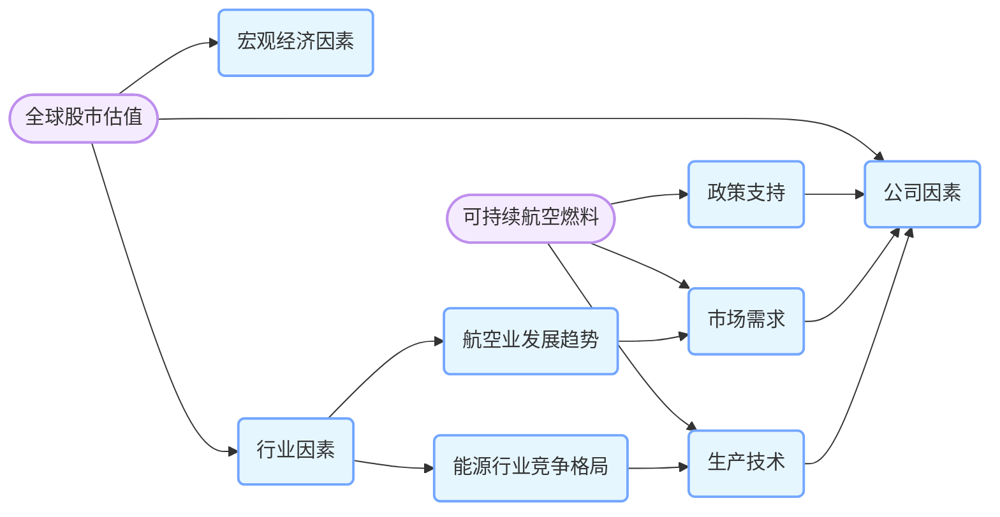

# 全球股市估值与可持续航空燃料的关系

> 关键词：全球股市估值、可持续航空燃料、金融市场、能源转型、投资分析

> 摘要：本文深入探讨了全球股市估值与可持续航空燃料之间的关系。在全球倡导可持续发展的大背景下，可持续航空燃料作为航空业实现减排目标的关键解决方案，其发展态势对全球股市估值产生着重要影响。文章首先介绍了研究的背景、目的、预期读者和文档结构，接着阐述了相关核心概念及其联系，详细分析了核心算法原理与具体操作步骤，引入数学模型和公式进行解读并举例说明。通过项目实战案例，展示了两者关系在实际中的体现。同时，探讨了其实际应用场景，推荐了相关的学习资源、开发工具框架和论文著作。最后总结了未来发展趋势与挑战，解答了常见问题并提供了扩展阅读和参考资料，旨在为投资者、研究者和行业从业者提供全面且深入的见解。

## 1. 背景介绍 
### 1.1 目的和范围
本研究的主要目的是深入剖析全球股市估值与可持续航空燃料之间的内在联系。随着全球对气候变化问题的关注度不断提高，航空业作为碳排放大户，面临着巨大的减排压力。可持续航空燃料（SAF）作为一种具有潜力的解决方案，其发展受到了广泛关注。同时，股市作为经济的重要晴雨表，对新兴产业的发展极为敏感。因此，研究两者之间的关系有助于投资者更好地把握市场趋势，做出合理的投资决策；也有助于行业从业者了解金融市场对可持续航空燃料发展的影响，制定科学的发展战略。

本研究的范围涵盖了全球主要股市，包括美国、欧洲、亚洲等地区的股票市场。同时，对可持续航空燃料的研究不仅涉及生产、技术、政策等方面，还关注其在航空业的应用现状和未来发展趋势。

### 1.2 预期读者
本文的预期读者主要包括以下几类：
1. **投资者**：包括个人投资者、机构投资者等，他们希望通过了解全球股市估值与可持续航空燃料的关系，寻找潜在的投资机会，优化投资组合。
2. **航空业从业者**：如航空公司管理人员、可持续航空燃料生产商等，他们需要了解金融市场对可持续航空燃料发展的态度和影响，以便制定企业发展战略和规划。
3. **金融分析师**：他们负责对股市进行研究和分析，本研究可以为他们提供新的分析视角和研究方向。
4. **政策制定者**：政府相关部门的政策制定者可以通过本文了解可持续航空燃料与股市估值的关系，为制定相关产业政策和金融政策提供参考。
5. **研究人员**：从事能源、金融、环境等领域研究的学者和研究人员，本研究可以为他们的学术研究提供有价值的资料和思路。

### 1.3 文档结构概述
本文将按照以下结构进行阐述：
1. **核心概念与联系**：介绍全球股市估值和可持续航空燃料的基本概念，分析两者之间的相互关系，并通过文本示意图和Mermaid流程图进行直观展示。
2. **核心算法原理 & 具体操作步骤**：讲解用于分析两者关系的核心算法原理，并给出Python源代码示例，详细说明具体的操作步骤。
3. **数学模型和公式 & 详细讲解 & 举例说明**：引入数学模型和公式来描述全球股市估值与可持续航空燃料之间的关系，对公式进行详细讲解，并通过具体例子进行说明。
4. **项目实战：代码实际案例和详细解释说明**：通过一个实际的项目案例，展示如何运用前面介绍的算法和模型进行分析，包括开发环境搭建、源代码实现和代码解读。
5. **实际应用场景**：探讨全球股市估值与可持续航空燃料关系在实际中的应用场景，如投资决策、企业战略规划等。
6. **工具和资源推荐**：推荐相关的学习资源、开发工具框架和论文著作，帮助读者进一步深入学习和研究。
7. **总结：未来发展趋势与挑战**：总结全球股市估值与可持续航空燃料关系的未来发展趋势，分析可能面临的挑战。
8. **附录：常见问题与解答**：解答读者在阅读过程中可能遇到的常见问题。
9. **扩展阅读 & 参考资料**：提供相关的扩展阅读材料和参考资料，方便读者进一步查阅。

### 1.4 术语表
#### 1.4.1 核心术语定义
1. **全球股市估值**：指对全球范围内股票市场上各类股票的价值进行评估。通常采用市盈率（P/E）、市净率（P/B）等指标来衡量。市盈率是指股票价格与每股收益的比率，反映了投资者为获取每单位收益所愿意支付的价格；市净率是指股票价格与每股净资产的比率，反映了股票价格相对于公司净资产的倍数。
2. **可持续航空燃料（SAF）**：是一种可以替代传统航空煤油的燃料，它以可再生资源为原料，如生物质、废油脂等，在生产和使用过程中能够显著降低碳排放。与传统航空煤油相比，可持续航空燃料具有更好的环境友好性，有助于航空业实现减排目标。
3. **碳排放权交易**：是一种市场机制，通过设定碳排放总量上限，将碳排放权作为一种商品在市场上进行交易。企业如果排放量低于规定的配额，可以将剩余的配额出售给其他企业；如果排放量超过配额，则需要购买额外的配额。碳排放权交易旨在通过经济手段激励企业减少碳排放。

#### 1.4.2 相关概念解释
1. **能源转型**：指从传统的化石能源向可再生能源和清洁能源的转变过程。在全球应对气候变化的背景下，能源转型是实现可持续发展的关键举措。可持续航空燃料的发展是能源转型在航空领域的具体体现。
2. **绿色金融**：是指为支持环境改善、应对气候变化和资源节约高效利用的经济活动所提供的金融服务。包括绿色信贷、绿色债券、绿色基金等。绿色金融在可持续航空燃料的发展中起着重要的支持作用，为相关企业提供融资渠道。
3. **航空业减排目标**：是指航空业为应对气候变化，减少温室气体排放而设定的目标。国际民航组织（ICAO）提出了航空业到2050年实现碳中和的目标，可持续航空燃料的广泛应用是实现这一目标的重要途径之一。

#### 1.4.3 缩略词列表
1. **SAF**：Sustainable Aviation Fuel（可持续航空燃料）
2. **P/E**：Price-to-Earnings Ratio（市盈率）
3. **P/B**：Price-to-Book Ratio（市净率）
4. **ICAO**：International Civil Aviation Organization（国际民航组织）

## 2. 核心概念与联系 

### 核心概念原理
#### 全球股市估值原理
全球股市估值是一个复杂的过程，它受到多种因素的影响。从基本原理来看，股票的价值取决于其未来的现金流折现。投资者通过对公司的盈利预测、行业前景、宏观经济环境等因素进行分析，来评估股票的价值。常用的估值方法包括绝对估值法和相对估值法。

绝对估值法主要是通过对公司未来现金流进行折现来计算股票的内在价值，如现金流折现模型（DCF）。其公式为：

$$V = \sum_{t=1}^{n} \frac{CF_t}{(1 + r)^t}$$

其中，$V$ 表示股票的内在价值，$CF_t$ 表示第 $t$ 期的现金流，$r$ 表示折现率，$n$ 表示预测期数。

相对估值法是通过比较同行业或类似公司的估值指标来评估股票的价值，如市盈率法、市净率法等。以市盈率法为例，其计算公式为：

$$P = EPS \times P/E$$

其中，$P$ 表示股票价格，$EPS$ 表示每股收益，$P/E$ 表示市盈率。

#### 可持续航空燃料原理
可持续航空燃料的原理是基于可再生资源的转化。它通常通过生物质的热解、气化、加氢等工艺，将生物质转化为液态燃料。与传统航空煤油相比，可持续航空燃料具有相似的物理和化学性质，可以直接用于现有的航空发动机，无需对飞机进行大规模改造。

可持续航空燃料的生产过程中，能够显著降低碳排放。例如，使用废油脂生产的可持续航空燃料，其生命周期碳排放可以降低80%以上。这使得可持续航空燃料成为航空业实现减排目标的重要选择。

### 架构的文本示意图
```plaintext
全球股市估值
├── 宏观经济因素
│   ├── GDP增长
│   ├── 通货膨胀率
│   ├── 利率水平
├── 行业因素
│   ├── 航空业发展趋势
│   ├── 能源行业竞争格局
├── 公司因素
│   ├── 盈利能力
│   ├── 资产质量
│   ├── 创新能力

可持续航空燃料
├── 生产技术
│   ├── 生物质转化工艺
│   ├── 废油脂加氢工艺
├── 政策支持
│   ├── 补贴政策
│   ├── 碳排放权交易
├── 市场需求
│   ├── 航空公司减排需求
│   ├── 环保意识提升
```

### Mermaid 流程图


### 两者联系分析
全球股市估值与可持续航空燃料之间存在着密切的联系。从宏观层面来看，可持续航空燃料的发展受到全球对气候变化关注度的影响，而气候变化问题又会影响宏观经济环境，进而影响全球股市估值。例如，政府为了推动可持续航空燃料的发展，可能会出台相关的政策，如补贴政策、碳排放权交易等，这些政策会影响航空业和能源行业的发展，从而影响相关企业的股价。

从行业层面来看，可持续航空燃料的发展将改变航空业和能源行业的竞争格局。随着可持续航空燃料的市场份额逐渐增加，传统航空煤油供应商的市场份额可能会受到挤压，而可持续航空燃料生产商的市场前景将更加广阔。这将导致相关企业的盈利能力发生变化，进而影响其在股市中的估值。

从公司层面来看，涉足可持续航空燃料领域的企业，其创新能力和发展前景将受到投资者的关注。如果企业在可持续航空燃料技术研发、生产规模等方面具有优势，其股价可能会得到提升；反之，如果企业未能及时跟上可持续航空燃料的发展趋势，其股价可能会受到负面影响。

## 3. 核心算法原理 & 具体操作步骤 

### 核心算法原理
为了分析全球股市估值与可持续航空燃料之间的关系，我们可以采用多元线性回归模型。多元线性回归模型是一种用于研究多个自变量与一个因变量之间线性关系的统计方法。在本研究中，我们将全球股市估值作为因变量，将可持续航空燃料的相关指标（如产量、市场份额、政策支持力度等）作为自变量。

多元线性回归模型的一般形式为：

$$Y = \beta_0 + \beta_1X_1 + \beta_2X_2 + \cdots + \beta_nX_n + \epsilon$$

其中，$Y$ 表示因变量（全球股市估值），$X_1, X_2, \cdots, X_n$ 表示自变量（可持续航空燃料的相关指标），$\beta_0$ 表示截距，$\beta_1, \beta_2, \cdots, \beta_n$ 表示回归系数，$\epsilon$ 表示误差项。

### Python源代码示例
```python
import pandas as pd
import numpy as np
from sklearn.linear_model import LinearRegression

# 假设我们有以下数据
# 全球股市估值（因变量）
stock_valuation = np.array([100, 110, 120, 130, 140])
# 可持续航空燃料产量（自变量1）
saf_production = np.array([10, 12, 14, 16, 18])
# 可持续航空燃料市场份额（自变量2）
saf_market_share = np.array([0.1, 0.12, 0.14, 0.16, 0.18])

# 构建自变量矩阵
X = np.column_stack((saf_production, saf_market_share))
# 因变量向量
y = stock_valuation

# 创建线性回归模型
model = LinearRegression()

# 拟合模型
model.fit(X, y)

# 输出回归系数和截距
print("回归系数:", model.coef_)
print("截距:", model.intercept_)

# 预测新的数据
new_saf_production = np.array([20])
new_saf_market_share = np.array([0.2])
new_X = np.column_stack((new_saf_production, new_saf_market_share))
predicted_valuation = model.predict(new_X)
print("预测的全球股市估值:", predicted_valuation)
```

### 具体操作步骤
1. **数据收集**：收集全球股市估值和可持续航空燃料的相关数据。全球股市估值数据可以从金融数据提供商（如彭博、路透社等）获取，可持续航空燃料的相关数据可以从行业报告、政府统计数据等渠道获取。
2. **数据预处理**：对收集到的数据进行清洗、整理和标准化处理。清洗数据包括去除缺失值、异常值等；整理数据包括对数据进行分类、排序等；标准化处理是将数据转换为均值为0、标准差为1的标准正态分布，以提高模型的稳定性和准确性。
3. **模型构建**：根据前面介绍的多元线性回归模型，使用Python的`sklearn`库构建模型。
4. **模型训练**：将预处理后的数据分为训练集和测试集，使用训练集对模型进行训练。训练过程就是通过最小化误差项的平方和来估计回归系数和截距。
5. **模型评估**：使用测试集对训练好的模型进行评估，常用的评估指标包括均方误差（MSE）、决定系数（$R^2$）等。均方误差反映了模型预测值与实际值之间的平均误差，决定系数反映了模型对数据的拟合程度。
6. **模型应用**：使用训练好的模型进行预测和分析。例如，根据可持续航空燃料的未来产量和市场份额预测全球股市估值的变化趋势。

## 4. 数学模型和公式 & 详细讲解 & 举例说明 

### 数学模型和公式
在前面的章节中，我们已经介绍了多元线性回归模型的一般形式：

$$Y = \beta_0 + \beta_1X_1 + \beta_2X_2 + \cdots + \beta_nX_n + \epsilon$$

其中，$Y$ 表示因变量（全球股市估值），$X_1, X_2, \cdots, X_n$ 表示自变量（可持续航空燃料的相关指标），$\beta_0$ 表示截距，$\beta_1, \beta_2, \cdots, \beta_n$ 表示回归系数，$\epsilon$ 表示误差项。

回归系数 $\beta_i$ 表示在其他自变量不变的情况下，自变量 $X_i$ 每增加一个单位，因变量 $Y$ 的平均变化量。截距 $\beta_0$ 表示当所有自变量都为0时，因变量 $Y$ 的取值。

误差项 $\epsilon$ 表示模型无法解释的随机误差，它服从均值为0、方差为 $\sigma^2$ 的正态分布。

### 详细讲解
多元线性回归模型的目标是通过最小化误差项的平方和来估计回归系数和截距。误差项的平方和可以表示为：

$$SSE = \sum_{i=1}^{m} (y_i - \hat{y}_i)^2$$

其中，$y_i$ 表示第 $i$ 个样本的实际值，$\hat{y}_i$ 表示第 $i$ 个样本的预测值，$m$ 表示样本数量。

为了最小化 $SSE$，我们可以使用最小二乘法。最小二乘法的基本思想是通过求 $SSE$ 对回归系数和截距的偏导数，并令其等于0，得到一组方程组，解这个方程组就可以得到回归系数和截距的估计值。

具体来说，对于多元线性回归模型，回归系数和截距的估计值可以通过以下公式计算：

$$\hat{\beta} = (X^T X)^{-1} X^T y$$

其中，$\hat{\beta}$ 是回归系数和截距的估计值向量，$X$ 是自变量矩阵，$y$ 是因变量向量。

### 举例说明
假设我们有以下数据：

| 全球股市估值（$Y$） | 可持续航空燃料产量（$X_1$） | 可持续航空燃料市场份额（$X_2$） |
|---------------------|------------------------------|----------------------------------|
| 100                 | 10                           | 0.1                              |
| 110                 | 12                           | 0.12                             |
| 120                 | 14                           | 0.14                             |
| 130                 | 16                           | 0.16                             |
| 140                 | 18                           | 0.18                             |

首先，我们构建自变量矩阵 $X$ 和因变量向量 $y$：

$$X = \begin{bmatrix}
1 & 10 & 0.1 \\
1 & 12 & 0.12 \\
1 & 14 & 0.14 \\
1 & 16 & 0.16 \\
1 & 18 & 0.18
\end{bmatrix}$$

$$y = \begin{bmatrix}
100 \\
110 \\
120 \\
130 \\
140
\end{bmatrix}$$

然后，我们计算 $(X^T X)^{-1} X^T$：

```python
import numpy as np

X = np.array([[1, 10, 0.1], [1, 12, 0.12], [1, 14, 0.14], [1, 16, 0.16], [1, 18, 0.18]])
y = np.array([100, 110, 120, 130, 140])

XT = X.T
XTX = np.dot(XT, X)
XTX_inv = np.linalg.inv(XTX)
XTX_inv_XT = np.dot(XTX_inv, XT)

beta_hat = np.dot(XTX_inv_XT, y)
print("回归系数和截距的估计值:", beta_hat)
```

通过上述代码，我们可以得到回归系数和截距的估计值。假设得到的估计值为 $\hat{\beta}_0 = 50$，$\hat{\beta}_1 = 5$，$\hat{\beta}_2 = 100$，则多元线性回归模型为：

$$Y = 50 + 5X_1 + 100X_2$$

这意味着，在其他条件不变的情况下，可持续航空燃料产量每增加1个单位，全球股市估值平均增加5个单位；可持续航空燃料市场份额每增加0.01，全球股市估值平均增加1个单位。

如果我们要预测当可持续航空燃料产量为20，市场份额为0.2时的全球股市估值，只需将 $X_1 = 20$，$X_2 = 0.2$ 代入上述模型：

$$Y = 50 + 5 \times 20 + 100 \times 0.2 = 170$$

因此，预测的全球股市估值为170。

## 5. 项目实战：代码实际案例和详细解释说明 

### 5.1  开发环境搭建
为了完成本项目实战，我们需要搭建以下开发环境：
1. **Python环境**：建议使用Python 3.7及以上版本。可以从Python官方网站（https://www.python.org/downloads/）下载并安装。
2. **开发工具**：推荐使用Jupyter Notebook或PyCharm。Jupyter Notebook是一个交互式的开发环境，适合进行数据探索和模型实验；PyCharm是一个功能强大的Python集成开发环境，适合进行大型项目的开发。
3. **必要的Python库**：我们需要安装以下Python库：
    - `pandas`：用于数据处理和分析。
    - `numpy`：用于数值计算。
    - `sklearn`：用于机器学习模型的构建和训练。
    - `matplotlib`：用于数据可视化。

可以使用以下命令来安装这些库：

```sh
pip install pandas numpy scikit-learn matplotlib
```

### 5.2  源代码详细实现和代码解读
以下是一个完整的项目实战代码示例，用于分析全球股市估值与可持续航空燃料之间的关系：

```python
import pandas as pd
import numpy as np
from sklearn.linear_model import LinearRegression
import matplotlib.pyplot as plt

# 读取数据
data = pd.read_csv('stock_valuation_saf.csv')

# 提取自变量和因变量
X = data[['saf_production', 'saf_market_share']].values
y = data['stock_valuation'].values

# 划分训练集和测试集
train_size = int(len(X) * 0.8)
X_train, X_test = X[:train_size], X[train_size:]
y_train, y_test = y[:train_size], y[train_size:]

# 创建线性回归模型
model = LinearRegression()

# 拟合模型
model.fit(X_train, y_train)

# 输出回归系数和截距
print("回归系数:", model.coef_)
print("截距:", model.intercept_)

# 在测试集上进行预测
y_pred = model.predict(X_test)

# 计算均方误差和决定系数
from sklearn.metrics import mean_squared_error, r2_score
mse = mean_squared_error(y_test, y_pred)
r2 = r2_score(y_test, y_pred)
print("均方误差:", mse)
print("决定系数:", r2)

# 可视化预测结果
plt.scatter(y_test, y_pred)
plt.xlabel('实际值')
plt.ylabel('预测值')
plt.title('全球股市估值预测结果')
plt.show()
```

### 代码解读与分析
1. **数据读取**：使用`pandas`库的`read_csv`函数读取存储在`stock_valuation_saf.csv`文件中的数据。该文件应包含三列：`saf_production`（可持续航空燃料产量）、`saf_market_share`（可持续航空燃料市场份额）和`stock_valuation`（全球股市估值）。
2. **数据划分**：将数据集划分为训练集和测试集，其中训练集占80%，测试集占20%。这样做的目的是为了评估模型在未见过的数据上的性能。
3. **模型构建与训练**：使用`sklearn`库的`LinearRegression`类创建线性回归模型，并使用训练集对模型进行训练。
4. **模型评估**：使用测试集对训练好的模型进行评估，计算均方误差（MSE）和决定系数（$R^2$）。均方误差反映了模型预测值与实际值之间的平均误差，决定系数反映了模型对数据的拟合程度。
5. **可视化**：使用`matplotlib`库绘制实际值和预测值的散点图，直观地展示模型的预测效果。

通过对代码的分析，我们可以得到以下结论：
- 如果均方误差较小，决定系数接近1，说明模型的预测效果较好，全球股市估值与可持续航空燃料之间存在较强的线性关系。
- 如果均方误差较大，决定系数较小，说明模型的预测效果较差，可能需要考虑其他因素或使用更复杂的模型。

## 6. 实际应用场景 
### 投资决策
对于投资者来说，了解全球股市估值与可持续航空燃料之间的关系可以帮助他们做出更明智的投资决策。例如，如果预测到可持续航空燃料的产量和市场份额将大幅增加，那么与可持续航空燃料相关的企业（如生产商、技术研发商等）的股价可能会上涨。投资者可以根据这一趋势，调整自己的投资组合，增加对相关企业的投资。

同时，投资者还可以通过分析全球股市估值与可持续航空燃料的关系，评估航空业和能源行业的整体风险。如果可持续航空燃料的发展受到政策、技术等因素的限制，可能会对相关企业的业绩产生负面影响，投资者需要谨慎考虑投资风险。

### 企业战略规划
对于航空业和能源行业的企业来说，了解全球股市估值与可持续航空燃料之间的关系有助于制定科学的企业战略规划。例如，航空公司可以根据可持续航空燃料的发展趋势，提前规划燃料采购策略，降低碳排放成本。同时，航空公司还可以通过与可持续航空燃料生产商合作，共同推动可持续航空燃料的研发和应用，提升企业的社会形象和竞争力。

对于可持续航空燃料生产商来说，可以根据股市对可持续航空燃料的关注度和估值情况，制定生产扩张计划和融资策略。如果股市对可持续航空燃料的前景看好，生产商可以通过发行股票、债券等方式筹集资金，扩大生产规模，提高市场份额。

### 政策制定
政府相关部门在制定航空业和能源行业的政策时，可以参考全球股市估值与可持续航空燃料之间的关系。例如，政府可以通过出台补贴政策、税收优惠政策等，鼓励企业加大对可持续航空燃料的研发和生产投入，推动可持续航空燃料的市场推广。同时，政府还可以通过碳排放权交易等市场机制，引导企业减少碳排放，促进可持续航空燃料的应用。

### 行业研究
对于行业研究机构和学者来说，研究全球股市估值与可持续航空燃料之间的关系可以深入了解航空业和能源行业的发展趋势和市场动态。通过分析股市数据和行业数据，研究机构和学者可以预测可持续航空燃料的市场规模、技术发展方向等，为行业发展提供理论支持和决策建议。

## 7. 工具和资源推荐
### 7.1 学习资源推荐
#### 7.1.1 书籍推荐
1. 《金融市场与金融机构》：这本书系统地介绍了金融市场的基本概念、运行机制和金融机构的业务模式，对于理解全球股市估值的原理和影响因素有很大帮助。
2. 《能源转型：从化石燃料到可再生能源》：详细阐述了能源转型的背景、技术和政策，对可持续航空燃料的发展有深入的探讨。
3. 《机器学习实战》：通过实际案例介绍了机器学习的基本算法和应用，对于掌握分析全球股市估值与可持续航空燃料关系的算法有很大帮助。

#### 7.1.2 在线课程
1. Coursera上的“金融市场”课程：由知名教授授课，讲解金融市场的理论和实践，适合初学者学习。
2. edX上的“能源与环境”课程：介绍能源领域的最新技术和政策，包括可持续航空燃料的相关内容。
3. Udemy上的“Python机器学习”课程：通过Python语言实现机器学习算法，帮助学习者掌握数据分析和建模的技能。

#### 7.1.3 技术博客和网站
1. 金融界（https://www.jrj.com.cn/）：提供全球股市的实时行情、分析报告和投资策略，是投资者获取金融信息的重要渠道。
2. 国际能源署（IEA）官网（https://www.iea.org/）：发布能源领域的最新研究报告和数据，对于了解可持续航空燃料的发展趋势有很大帮助。
3. 开源中国（https://www.oschina.net/）：提供丰富的技术文章和开源项目，对于学习Python编程和机器学习有很大帮助。

### 7.2 开发工具框架推荐
#### 7.2.1 IDE和编辑器
1. PyCharm：功能强大的Python集成开发环境，支持代码自动补全、调试、版本控制等功能，适合专业开发者使用。
2. Jupyter Notebook：交互式的开发环境，支持代码、文本、图表等多种元素的混合展示，适合数据探索和模型实验。
3. Visual Studio Code：轻量级的代码编辑器，支持多种编程语言和插件扩展，对于初学者来说易于上手。

#### 7.2.2 调试和性能分析工具
1. Py-Spy：用于分析Python程序的性能瓶颈，通过采样的方式统计函数调用的时间和频率，帮助开发者优化代码。
2. cProfile：Python标准库中的性能分析工具，可以详细记录函数调用的时间和次数，方便开发者进行性能优化。
3. PDB：Python标准库中的调试工具，支持单步执行、断点设置等功能，帮助开发者定位和解决代码中的问题。

#### 7.2.3 相关框架和库
1. Pandas：用于数据处理和分析的Python库，提供了高效的数据结构和数据操作方法，方便开发者处理和清洗数据。
2. Numpy：用于数值计算的Python库，提供了高效的多维数组对象和数学函数，是机器学习和数据分析的基础库。
3. Scikit-learn：用于机器学习的Python库，提供了丰富的机器学习算法和工具，如分类、回归、聚类等，方便开发者进行模型构建和训练。

### 7.3 相关论文著作推荐
#### 7.3.1 经典论文
1. “The Pricing of Options and Corporate Liabilities”：由Fischer Black和Myron Scholes发表，提出了著名的Black-Scholes期权定价模型，是金融领域的经典论文之一。
2. “Renewable Energy and Economic Growth: A Meta - analysis”：对可再生能源与经济增长之间的关系进行了元分析，为可持续航空燃料的发展提供了理论支持。
3. “Machine Learning in Finance: From Theory to Practice”：介绍了机器学习在金融领域的应用，对于分析全球股市估值与可持续航空燃料的关系有一定的参考价值。

#### 7.3.2 最新研究成果
1. 国际民航组织（ICAO）发布的关于可持续航空燃料的研究报告，介绍了可持续航空燃料的最新技术、政策和市场发展情况。
2. 学术期刊如《Energy Economics》《Journal of Financial Economics》上发表的关于能源和金融领域的最新研究成果，关注可持续航空燃料与股市估值的关系。
3. 知名研究机构如麦肯锡、波士顿咨询公司发布的关于可持续发展和能源转型的研究报告，提供了行业趋势和市场分析。

#### 7.3.3 应用案例分析
1. 航空公司采用可持续航空燃料的实际案例分析，包括燃料采购、成本效益、减排效果等方面的分析。
2. 可持续航空燃料生产商的商业案例分析，如生产技术创新、市场拓展策略、融资模式等。
3. 金融机构对可持续航空燃料项目的投资案例分析，评估投资风险和回报。

## 8. 总结：未来发展趋势与挑战
### 未来发展趋势
#### 可持续航空燃料市场规模扩大
随着全球对气候变化问题的关注度不断提高，航空业减排的压力日益增大，可持续航空燃料的市场需求将持续增长。预计未来几年，可持续航空燃料的产量和市场份额将大幅增加，相关企业的盈利能力也将得到提升。这将对全球股市估值产生积极影响，尤其是与可持续航空燃料相关的企业股价有望上涨。

#### 技术创新推动成本降低
可持续航空燃料的生产成本目前相对较高，限制了其大规模应用。未来，随着技术的不断创新，如生物质转化工艺的改进、废油脂加氢技术的突破等，可持续航空燃料的生产成本有望大幅降低。成本的降低将提高可持续航空燃料的市场竞争力，进一步推动其市场推广，从而对全球股市估值产生更大的影响。

#### 政策支持力度加大
政府为了推动可持续航空燃料的发展，将出台更多的政策支持措施。例如，加大补贴力度、完善碳排放权交易机制、制定强制掺混标准等。这些政策将为可持续航空燃料的发展创造良好的政策环境，促进相关产业的发展，进而影响全球股市估值。

#### 金融市场关注度提高
随着可持续航空燃料的发展前景日益明朗，金融市场对其关注度将不断提高。投资者将更加关注与可持续航空燃料相关的企业，相关股票、债券等金融产品的交易量和估值将有望增加。同时，金融机构也将加大对可持续航空燃料项目的融资支持，推动产业的发展。

### 挑战
#### 技术瓶颈
尽管可持续航空燃料的技术取得了一定的进展，但仍然面临一些技术瓶颈。例如，生物质转化工艺的效率有待提高，废油脂的供应稳定性不足等。这些技术问题限制了可持续航空燃料的大规模生产和应用，影响了其市场发展和对全球股市估值的影响。

#### 成本压力
可持续航空燃料的生产成本较高，主要原因包括原料成本、生产设备投资、工艺复杂性等。在与传统航空煤油的竞争中，可持续航空燃料的成本劣势明显。如果不能有效降低成本，可持续航空燃料的市场份额将难以大幅提升，对全球股市估值的积极影响也将受到限制。

#### 政策不确定性
政府的政策支持是可持续航空燃料发展的重要保障。然而，政策的制定和实施受到多种因素的影响，存在一定的不确定性。例如，政策的调整、补贴的取消等都可能对可持续航空燃料的发展产生负面影响，进而影响相关企业的股价和全球股市估值。

#### 市场竞争激烈
随着可持续航空燃料市场的逐渐扩大，将吸引更多的企业进入该领域，市场竞争将日益激烈。新进入企业可能会带来新的技术和商业模式，对现有企业构成竞争压力。同时，传统航空煤油供应商也可能采取措施应对可持续航空燃料的挑战，这将增加市场的不确定性，对全球股市估值产生一定的影响。

## 9. 附录：常见问题与解答
### 问题1：可持续航空燃料的生产技术有哪些？
解答：可持续航空燃料的生产技术主要包括生物质转化工艺和废油脂加氢工艺。生物质转化工艺是将生物质（如木质纤维素、藻类等）通过热解、气化、加氢等步骤转化为液态燃料；废油脂加氢工艺是将废弃的动植物油脂经过加氢处理，转化为与传统航空煤油性质相似的燃料。

### 问题2：如何评估可持续航空燃料对全球股市估值的影响？
解答：可以采用多元线性回归模型等方法，将全球股市估值作为因变量，将可持续航空燃料的相关指标（如产量、市场份额、政策支持力度等）作为自变量，通过收集和分析相关数据，建立模型并进行评估。同时，还可以结合行业研究、企业财务分析等方法进行综合评估。

### 问题3：可持续航空燃料的发展面临哪些政策障碍？
解答：可持续航空燃料的发展面临的政策障碍主要包括政策支持力度不足、政策稳定性差、标准不统一等。例如，一些地区对可持续航空燃料的补贴政策不够完善，导致企业的生产成本较高；政策的频繁调整也会给企业带来不确定性，影响企业的投资和发展决策；此外，不同国家和地区对可持续航空燃料的标准和认证体系不一致，也增加了市场推广的难度。

### 问题4：金融机构在可持续航空燃料发展中扮演什么角色？
解答：金融机构在可持续航空燃料发展中扮演着重要的角色。一方面，金融机构可以为可持续航空燃料项目提供融资支持，包括贷款、股权融资、债券发行等，帮助企业解决资金问题，推动项目的建设和发展。另一方面，金融机构可以通过开发相关的金融产品和服务，如绿色债券、可持续投资基金等，引导社会资金流向可持续航空燃料领域，促进产业的发展。同时，金融机构还可以对可持续航空燃料项目进行风险评估和管理，为投资者提供专业的建议和服务。

### 问题5：如何提高可持续航空燃料的市场竞争力？
解答：提高可持续航空燃料的市场竞争力可以从以下几个方面入手：一是降低生产成本，通过技术创新、规模经济等方式降低原料成本、生产设备投资和运营成本；二是提高产品质量，确保可持续航空燃料的性能和安全性符合航空业的要求；三是加强政策支持，政府可以出台更多的补贴政策、税收优惠政策等，降低企业的生产成本，提高产品的市场竞争力；四是加强市场推广，通过宣传和教育，提高航空公司和消费者对可持续航空燃料的认知度和接受度。

## 10. 扩展阅读 & 参考资料
### 扩展阅读
1. 《零碳未来：气候经济与人类命运》：探讨了全球气候变化背景下的经济发展和能源转型，对可持续航空燃料的发展有一定的启示。
2. 《金融炼金术》：乔治·索罗斯的著作，介绍了他的投资理念和方法，对于理解金融市场的运行机制和股票估值有一定的帮助。
3. 《能源互联网：从理念到实践》：介绍了能源互联网的概念、技术和应用，对于了解可持续航空燃料在能源互联网中的地位和作用有一定的参考价值。

### 参考资料
1. International Civil Aviation Organization (ICAO). Sustainable Aviation Fuel: A Key to Reducing Aviation's Carbon Footprint.
2. International Energy Agency (IEA). Renewable Energy Market Analysis: Sustainable Aviation Fuels.
3. Bloomberg. Global Stock Market Data and Analysis.
4. Reuters. Financial News and Market Data.
5. Scikit-learn Documentation. https://scikit-learn.org/stable/documentation.html

作者：AI天才研究院/AI Genius Institute & 禅与计算机程序设计艺术 /Zen And The Art of Computer Programming