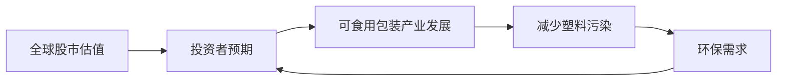

# 全球股市估值与可食用包装在减少塑料污染中的作用

> 关键词：全球股市估值、可食用包装、塑料污染、金融市场、环境保护

> 摘要：本文旨在探讨全球股市估值与可食用包装在减少塑料污染中各自的作用以及两者之间可能存在的联系。首先对全球股市估值的相关概念、影响因素进行深入分析，同时详细阐述可食用包装的原理、优势以及其在减少塑料污染方面的重要意义。接着通过数学模型和实际案例，研究股市估值与可食用包装产业发展之间的关联。最后分析可食用包装产业的实际应用场景，推荐相关学习资源和开发工具，探讨其未来发展趋势与挑战。

## 1. 背景介绍 
### 1.1 目的和范围
本研究的主要目的是深入剖析全球股市估值的机制以及可食用包装在应对塑料污染问题上的具体作用，探究两者之间潜在的经济和环境联系。研究范围涵盖全球股市的主要板块，重点关注与可食用包装相关的企业股票估值情况，同时对可食用包装的技术原理、生产应用以及在减少塑料污染方面的效果进行全面分析。

### 1.2 预期读者
本文预期读者包括金融领域的投资者、分析师，关注环境保护的科研人员、政策制定者，以及对新兴产业发展感兴趣的企业家和创业者。

### 1.3 文档结构概述
本文首先介绍全球股市估值和可食用包装的相关背景知识，包括术语定义和概念解释。接着阐述核心概念及其联系，给出原理和架构的文本示意图与 Mermaid 流程图。然后详细讲解核心算法原理和具体操作步骤，并用 Python 代码进行说明。之后介绍相关的数学模型和公式，并举例说明。通过项目实战展示代码实际案例和详细解释。分析可食用包装的实际应用场景，推荐学习资源、开发工具和相关论文著作。最后总结可食用包装产业的未来发展趋势与挑战，提供常见问题解答和扩展阅读参考资料。

### 1.4 术语表
#### 1.4.1 核心术语定义
- **全球股市估值**：指对全球范围内股票市场中上市公司的价值进行评估，通常通过各种估值方法来确定股票的合理价格。
- **可食用包装**：是一种可以直接食用的包装材料，通常由天然可食用的物质制成，在完成包装功能后可以被人体安全消化。
- **塑料污染**：指塑料制品在环境中难以降解，对土壤、水体、生物等造成的污染和破坏。

#### 1.4.2 相关概念解释
- **市盈率（P/E）**：是股票价格除以每股收益的比率，用于衡量股票的估值水平。
- **市净率（P/B）**：是股票价格与每股净资产的比率，反映了股票的市场价值与账面价值的关系。
- **生物降解**：指物质在自然环境中被微生物分解为无害物质的过程。

#### 1.4.3 缩略词列表
- **P/E**：Price-to-Earnings Ratio，市盈率
- **P/B**：Price-to-Book Ratio，市净率

## 2. 核心概念与联系 
### 全球股市估值核心概念
全球股市估值是金融领域的重要概念，它涉及到对上市公司未来盈利能力、市场竞争力、行业前景等多方面因素的综合评估。常见的估值方法包括市盈率法、市净率法、现金流折现法等。

市盈率法是通过将股票价格除以每股收益来计算市盈率，以此评估股票的相对估值水平。一般来说，市盈率越高，说明市场对该股票的预期越高，但也可能意味着股票被高估。

市净率法是用股票价格除以每股净资产，反映了股票的市场价值与账面价值的关系。市净率较低的股票可能被低估，但也可能暗示公司存在潜在问题。

现金流折现法是通过预测公司未来的现金流，并将其折现到当前时点，来确定公司的内在价值。这种方法考虑了货币的时间价值，更为准确地反映了公司的真实价值。

### 可食用包装核心概念
可食用包装是一种创新的包装解决方案，旨在减少传统塑料包装对环境的污染。它通常由天然可食用的物质制成，如淀粉、蛋白质、纤维素等。这些材料具有良好的生物降解性和可食用性，在完成包装功能后可以被人体安全消化，或者在自然环境中快速降解。

可食用包装具有多种优势，如环保、安全、可定制等。它可以有效减少塑料垃圾的产生，降低对环境的压力。同时，由于其可食用性，还可以避免包装材料与食品之间的污染问题，提高食品的安全性。

### 两者的联系
全球股市估值与可食用包装之间存在着密切的联系。随着环保意识的提高和对塑料污染问题的关注，可食用包装产业逐渐兴起。投资者对该产业的预期和信心会影响相关企业的股票估值。如果市场普遍看好可食用包装产业的发展前景，相关企业的股票价格可能会上涨，估值也会相应提高。反之，如果产业发展面临挑战或市场对其前景不乐观，股票估值可能会下降。

以下是核心概念联系的文本示意图：

全球股市估值 <---- 投资者预期 ----> 可食用包装产业发展 <---- 环保需求 ----> 减少塑料污染

以下是 Mermaid 流程图：


## 3. 核心算法原理 & 具体操作步骤 
### 全球股市估值算法原理
#### 市盈率法
市盈率法的核心原理是通过比较不同股票的市盈率来评估其相对估值水平。计算公式为：

$$P/E = \frac{股票价格}{每股收益}$$

例如，某股票的价格为 50 元，每股收益为 5 元，则其市盈率为：

$$P/E = \frac{50}{5} = 10$$

操作步骤如下：
1. 收集股票的价格和每股收益数据。
2. 计算市盈率。
3. 与同行业其他股票或市场平均市盈率进行比较，判断股票的估值水平。

以下是使用 Python 实现市盈率计算的代码：
```python
def calculate_pe(stock_price, earnings_per_share):
    if earnings_per_share == 0:
        return None
    return stock_price / earnings_per_share

# 示例数据
stock_price = 50
earnings_per_share = 5
pe_ratio = calculate_pe(stock_price, earnings_per_share)
print(f"市盈率: {pe_ratio}")
```

#### 市净率法
市净率法的原理是通过比较股票的市场价值与账面价值来评估其估值。计算公式为：

$$P/B = \frac{股票价格}{每股净资产}$$

操作步骤如下：
1. 收集股票的价格和每股净资产数据。
2. 计算市净率。
3. 与同行业其他股票或市场平均市净率进行比较，判断股票的估值水平。

以下是使用 Python 实现市净率计算的代码：
```python
def calculate_pb(stock_price, book_value_per_share):
    if book_value_per_share == 0:
        return None
    return stock_price / book_value_per_share

# 示例数据
stock_price = 50
book_value_per_share = 10
pb_ratio = calculate_pb(stock_price, book_value_per_share)
print(f"市净率: {pb_ratio}")
```

### 可食用包装产业相关算法原理
在可食用包装产业中，一个重要的指标是生物降解率。生物降解率反映了可食用包装材料在自然环境中被微生物分解的速度和程度。

生物降解率的计算公式为：

$$生物降解率 = \frac{初始质量 - 剩余质量}{初始质量} \times 100\%$$

操作步骤如下：
1. 准备一定质量的可食用包装材料样本。
2. 将样本置于特定的环境条件下（如土壤中）进行降解实验。
3. 在一定时间后，取出样本，测量剩余质量。
4. 根据公式计算生物降解率。

以下是使用 Python 实现生物降解率计算的代码：
```python
def calculate_biodegradation_rate(initial_mass, remaining_mass):
    if initial_mass == 0:
        return None
    return ((initial_mass - remaining_mass) / initial_mass) * 100

# 示例数据
initial_mass = 100
remaining_mass = 20
biodegradation_rate = calculate_biodegradation_rate(initial_mass, remaining_mass)
print(f"生物降解率: {biodegradation_rate}%")
```

## 4. 数学模型和公式 & 详细讲解 & 举例说明 
### 全球股市估值数学模型
#### 股息折现模型（DDM）
股息折现模型是一种基于股息现金流的股票估值模型。其基本原理是将股票未来的股息现金流折现到当前时点，以确定股票的内在价值。

公式为：

$$V = \sum_{t=1}^{\infty} \frac{D_t}{(1 + r)^t}$$

其中，$V$ 表示股票的内在价值，$D_t$ 表示第 $t$ 期的股息，$r$ 表示折现率。

详细讲解：该模型假设股票的价值取决于其未来股息的现值。折现率 $r$ 反映了投资者对股票投资的预期回报率，通常根据市场利率和股票的风险水平来确定。

举例说明：假设某股票预计未来每年的股息为 2 元，投资者要求的回报率为 10%。则该股票的内在价值为：

$$V = \frac{2}{1 + 0.1} + \frac{2}{(1 + 0.1)^2} + \cdots$$

这是一个无穷等比数列求和，根据等比数列求和公式 $S = \frac{a}{1 - q}$（其中 $a$ 为首项，$q$ 为公比），可得：

$$V = \frac{2}{0.1} = 20$$

#### 自由现金流折现模型（DCF）
自由现金流折现模型是一种更全面的股票估值模型，它考虑了公司的自由现金流。自由现金流是指公司在满足所有必要投资后剩余的现金流量。

公式为：

$$V = \sum_{t=1}^{n} \frac{FCF_t}{(1 + WACC)^t} + \frac{TV}{(1 + WACC)^n}$$

其中，$V$ 表示公司的内在价值，$FCF_t$ 表示第 $t$ 期的自由现金流，$WACC$ 表示加权平均资本成本，$TV$ 表示终值，$n$ 表示预测期。

详细讲解：该模型通过预测公司未来的自由现金流，并将其折现到当前时点，再加上终值，来确定公司的内在价值。加权平均资本成本 $WACC$ 反映了公司的融资成本，包括股权成本和债务成本。终值通常采用永续增长模型来计算。

举例说明：假设某公司预计未来 5 年的自由现金流分别为 100 万元、120 万元、140 万元、160 万元和 180 万元，加权平均资本成本为 10%，第 5 年后的永续增长率为 3%。则该公司的内在价值计算如下：

1. 计算前 5 年自由现金流的现值：

$$PV_1 = \frac{100}{1 + 0.1} + \frac{120}{(1 + 0.1)^2} + \frac{140}{(1 + 0.1)^3} + \frac{160}{(1 + 0.1)^4} + \frac{180}{(1 + 0.1)^5} \approx 557.83$$

2. 计算终值：

$$TV = \frac{180 \times (1 + 0.03)}{0.1 - 0.03} \approx 2648.57$$

3. 计算终值的现值：

$$PV_2 = \frac{2648.57}{(1 + 0.1)^5} \approx 1647.74$$

4. 计算公司的内在价值：

$$V = PV_1 + PV_2 \approx 557.83 + 1647.74 = 2205.57$$

### 可食用包装数学模型
#### 包装材料用量模型
在可食用包装生产中，需要根据产品的尺寸和形状来确定包装材料的用量。假设包装一个长方体形状的产品，其长、宽、高分别为 $l$、$w$、$h$，包装材料的厚度为 $t$。则包装材料的体积 $V_m$ 可以通过以下公式计算：

$$V_m = 2(lw + lh + wh)t$$

详细讲解：该公式是基于长方体的表面积公式推导而来，考虑了包装材料的厚度。通过该公式可以准确计算出包装一个产品所需的材料用量，从而合理安排生产和成本控制。

举例说明：假设产品的长为 10 厘米，宽为 5 厘米，高为 3 厘米，包装材料的厚度为 0.1 厘米。则包装材料的体积为：

$$V_m = 2(10 \times 5 + 10 \times 3 + 5 \times 3) \times 0.1 = 2(50 + 30 + 15) \times 0.1 = 19$$（立方厘米）

## 5. 项目实战：代码实际案例和详细解释说明 
### 5.1  开发环境搭建
#### 硬件环境
- 计算机：建议使用性能较好的笔记本电脑或台式机，具备至少 8GB 内存和 256GB 硬盘空间。
- 操作系统：可以选择 Windows、Mac OS 或 Linux 操作系统。

#### 软件环境
- Python 环境：安装 Python 3.7 及以上版本。可以从 Python 官方网站（https://www.python.org/downloads/）下载安装包进行安装。
- 开发工具：推荐使用 PyCharm 作为开发工具，它提供了丰富的代码编辑、调试和管理功能。可以从 JetBrains 官方网站（https://www.jetbrains.com/pycharm/download/）下载安装。
- 数据获取库：安装 `pandas` 和 `yfinance` 库，用于获取股票数据。可以使用以下命令进行安装：

```sh
pip install pandas yfinance
```

### 5.2  源代码详细实现和代码解读
#### 股票数据获取与估值计算
```python
import yfinance as yf
import pandas as pd

# 定义股票代码
ticker_symbol = 'AAPL'

# 获取股票数据
stock = yf.Ticker(ticker_symbol)
data = stock.history(period='1y')

# 计算每股收益和每股净资产
earnings_per_share = stock.info['trailingEps']
book_value_per_share = stock.info['bookValue']

# 计算市盈率和市净率
latest_close_price = data['Close'].iloc[-1]
pe_ratio = latest_close_price / earnings_per_share
pb_ratio = latest_close_price / book_value_per_share

print(f"股票代码: {ticker_symbol}")
print(f"最新收盘价: {latest_close_price}")
print(f"每股收益: {earnings_per_share}")
print(f"每股净资产: {book_value_per_share}")
print(f"市盈率: {pe_ratio}")
print(f"市净率: {pb_ratio}")
```

代码解读：
1. 导入 `yfinance` 和 `pandas` 库，用于获取股票数据和数据处理。
2. 定义股票代码 `ticker_symbol`，这里以苹果公司（AAPL）为例。
3. 使用 `yf.Ticker` 方法获取股票对象，并使用 `history` 方法获取股票的历史数据。
4. 从股票信息中获取每股收益和每股净资产。
5. 获取最新收盘价，并计算市盈率和市净率。
6. 打印相关信息。

#### 可食用包装生物降解率模拟
```python
import random

# 模拟可食用包装材料的降解过程
def simulate_biodegradation(initial_mass, num_days):
    remaining_mass = initial_mass
    for day in range(num_days):
        # 模拟每天的降解量，降解量在 1% - 5% 之间随机变化
        degradation_rate = random.uniform(0.01, 0.05)
        degradation_amount = remaining_mass * degradation_rate
        remaining_mass -= degradation_amount
    return remaining_mass

# 示例参数
initial_mass = 100
num_days = 30

# 模拟降解过程
remaining_mass = simulate_biodegradation(initial_mass, num_days)

# 计算生物降解率
biodegradation_rate = ((initial_mass - remaining_mass) / initial_mass) * 100

print(f"初始质量: {initial_mass} 克")
print(f"30 天后剩余质量: {remaining_mass} 克")
print(f"生物降解率: {biodegradation_rate}%")
```

代码解读：
1. 定义 `simulate_biodegradation` 函数，用于模拟可食用包装材料的降解过程。
2. 在函数内部，使用 `for` 循环模拟每天的降解过程，降解量在 1% - 5% 之间随机变化。
3. 输入初始质量和模拟天数，调用 `simulate_biodegradation` 函数进行模拟。
4. 计算生物降解率并打印相关信息。

### 5.3  代码解读与分析
#### 股票数据获取与估值计算代码分析
- 优点：代码简单易懂，使用 `yfinance` 库可以方便地获取股票数据，并且可以直接从股票信息中获取每股收益和每股净资产，减少了数据处理的复杂度。
- 缺点：`yfinance` 库获取的数据可能存在一定的延迟，并且数据的准确性依赖于数据源。另外，代码只计算了简单的市盈率和市净率，没有考虑更多的估值因素。

#### 可食用包装生物降解率模拟代码分析
- 优点：代码通过随机模拟的方式，简单地模拟了可食用包装材料的降解过程，具有一定的灵活性。
- 缺点：模拟的降解过程是基于随机数的，没有考虑实际的环境因素和材料特性，可能与实际情况存在较大偏差。

## 6. 实际应用场景 
### 金融投资领域
在金融投资领域，全球股市估值对于投资者的决策具有重要影响。投资者可以通过分析可食用包装相关企业的股票估值，判断其投资价值。如果某家可食用包装企业的股票估值较低，且其业务发展前景良好，投资者可能会选择买入该股票。同时，金融机构也可以根据股市估值情况，为企业提供融资建议和服务。

### 环境保护领域
可食用包装在环境保护领域具有广泛的应用前景。在食品行业，可食用包装可以直接用于包装食品，减少塑料包装的使用。例如，一些糖果、巧克力等小食品可以采用可食用包装，消费者在食用食品的同时也可以将包装一起吃掉，避免了包装垃圾的产生。在餐饮行业，可食用餐具和包装也逐渐受到关注，如可食用的纸杯、餐盘等，可以有效减少一次性塑料餐具的使用。

### 农业领域
可食用包装材料的原料通常来自于农产品，如淀粉、蛋白质等。因此，可食用包装产业的发展可以带动农业的发展。农民可以种植适合用于生产可食用包装材料的农作物，增加收入。同时，可食用包装的生产过程也可以消耗农产品的剩余物，提高资源利用率。

## 7. 工具和资源推荐
### 7.1 学习资源推荐
#### 7.1.1 书籍推荐
- 《证券分析》（Security Analysis）：由本杰明·格雷厄姆（Benjamin Graham）和戴维·多德（David Dodd）所著，是价值投资领域的经典著作，详细介绍了股票估值的方法和理论。
- 《环境科学导论》（Introduction to Environmental Science）：涵盖了环境科学的各个方面，包括塑料污染的来源、危害和治理方法，以及可食用包装等新型环保技术。
- 《Python 数据分析实战》（Python for Data Analysis）：由 Wes McKinney 所著，介绍了使用 Python 进行数据分析的方法和技巧，对于处理股票数据和可食用包装实验数据非常有帮助。

#### 7.1.2 在线课程
- Coursera 上的“金融市场”（Financial Markets）课程：由耶鲁大学教授罗伯特·席勒（Robert Shiller）讲授，深入讲解了金融市场的运作机制和股票估值方法。
- edX 上的“环境科学与可持续发展”（Environmental Science and Sustainability）课程：提供了关于环境保护和可持续发展的全面知识，包括塑料污染的解决策略。
- Udemy 上的“Python 数据科学和机器学习训练营”（Python for Data Science and Machine Learning Bootcamp）：帮助学习者掌握 Python 在数据科学和机器学习领域的应用，为处理相关数据提供技术支持。

#### 7.1.3 技术博客和网站
- Seeking Alpha：提供股票分析和投资建议，涵盖了全球股市的各种信息，对于了解可食用包装相关企业的股票估值情况非常有帮助。
- GreenBiz：专注于可持续发展和绿色商业领域，提供了大量关于可食用包装等环保技术的新闻和分析。
- Kaggle：是一个数据科学竞赛平台，上面有很多关于金融和环境数据的数据集和分析案例，可以学习到不同的数据分析方法和技巧。

### 7.2 开发工具框架推荐
#### 7.2.1 IDE和编辑器
- PyCharm：是一款专业的 Python 集成开发环境，提供了丰富的代码编辑、调试和管理功能，适合开发股票数据分析和可食用包装模拟相关的代码。
- Jupyter Notebook：是一个交互式的开发环境，支持多种编程语言，非常适合进行数据探索和可视化分析。

#### 7.2.2 调试和性能分析工具
- PDB：是 Python 自带的调试工具，可以帮助开发者在代码运行过程中进行调试，找出问题所在。
- cProfile：是 Python 的性能分析工具，可以分析代码的运行时间和资源消耗情况，帮助优化代码性能。

#### 7.2.3 相关框架和库
- Pandas：是一个强大的数据分析库，提供了数据结构和数据分析工具，方便处理股票数据和可食用包装实验数据。
- Matplotlib：是一个常用的绘图库，可以用于绘制股票走势图、生物降解率变化图等，直观展示数据。
- Scikit-learn：是一个机器学习库，可用于股票估值预测和可食用包装性能分析等方面。

### 7.3 相关论文著作推荐
#### 7.3.1 经典论文
- “The Theory of Stock Market Value” by James Tobin：提出了托宾 Q 理论，用于解释股票市场价值与企业重置成本之间的关系。
- “Plastic Pollution in the Marine Environment: A Review of the Sources, Fate and Effects of Microplastics” by Richard C. Thompson et al.：对海洋塑料污染的来源、归宿和影响进行了全面综述。

#### 7.3.2 最新研究成果
- 关于可食用包装材料的最新研究论文，如在《Journal of Food Science》《Food Hydrocolloids》等期刊上发表的文章，介绍了新型可食用包装材料的制备方法和性能。
- 关于可持续金融和绿色投资的研究成果，探讨了金融市场如何支持可食用包装等环保产业的发展。

#### 7.3.3 应用案例分析
- 一些知名企业在可食用包装方面的应用案例分析，如雀巢、可口可乐等公司在减少塑料包装方面的实践和经验。
- 金融机构对可食用包装相关企业的投资案例分析，了解其投资策略和决策过程。

## 8. 总结：未来发展趋势与挑战
### 未来发展趋势
#### 可食用包装产业发展
- 技术创新：随着科技的不断进步，可食用包装材料的性能将不断提高，如更强的阻隔性、更好的机械性能等。同时，新的制备工艺和原材料也将不断涌现，降低生产成本。
- 市场扩大：消费者对环保产品的需求不断增加，可食用包装市场将逐渐扩大。不仅在食品行业，其他行业如化妆品、药品等也可能会逐渐采用可食用包装。
- 产业整合：可食用包装产业将逐渐走向整合，大型企业可能会通过并购等方式扩大市场份额，提高产业集中度。

#### 全球股市估值与可食用包装产业的关联加强
- 投资者关注：随着可食用包装产业的发展，投资者将更加关注相关企业的股票估值。环保概念将成为影响股票估值的重要因素之一。
- 金融创新：金融机构可能会推出更多与可食用包装产业相关的金融产品，如绿色债券、可持续投资基金等，促进产业的发展。

### 挑战
#### 可食用包装产业面临的挑战
- 成本问题：目前可食用包装材料的生产成本相对较高，限制了其大规模应用。如何降低成本是产业发展面临的主要挑战之一。
- 性能限制：可食用包装材料的性能还存在一定的局限性，如阻隔性、机械性能等不如传统塑料包装。需要进一步提高材料的性能，以满足不同产品的包装需求。
- 法规标准：目前可食用包装的法规标准还不够完善，需要建立统一的标准和规范，确保产品的质量和安全性。

#### 全球股市估值面临的挑战
- 市场不确定性：全球股市受到多种因素的影响，如经济形势、政策变化、地缘政治等，市场不确定性较大。这给股票估值带来了一定的困难。
- 信息不对称：投资者在获取股票信息时可能存在信息不对称的问题，导致估值不准确。需要加强信息披露和监管，提高市场透明度。

## 9. 附录：常见问题与解答
### 全球股市估值相关问题
#### 问：市盈率和市净率哪个更重要？
答：市盈率和市净率都有其重要性，它们从不同的角度反映了股票的估值情况。市盈率主要关注公司的盈利能力，市净率则关注公司的净资产价值。在实际应用中，需要综合考虑这两个指标，同时结合其他因素进行分析。

#### 问：股票估值模型的准确性如何？
答：股票估值模型是基于一定的假设和预测建立的，其准确性受到多种因素的影响，如市场环境、公司业绩变化等。因此，股票估值模型只能作为参考，不能完全准确地预测股票的价格。

### 可食用包装相关问题
#### 问：可食用包装材料是否安全？
答：可食用包装材料通常由天然可食用的物质制成，在正常使用情况下是安全的。但是，对于某些特殊人群，如过敏体质者，可能需要注意包装材料的成分。同时，生产企业需要严格遵守相关的食品安全标准和法规，确保产品的安全性。

#### 问：可食用包装的保质期有多长？
答：可食用包装的保质期受到多种因素的影响，如包装材料的成分、储存条件等。一般来说，可食用包装的保质期相对较短，需要在一定的时间内使用。

## 10. 扩展阅读 & 参考资料
### 扩展阅读
- 《金融炼金术》（The Alchemy of Finance）：由乔治·索罗斯（George Soros）所著，探讨了金融市场的运作机制和投资者的行为模式。
- 《循环经济：从线性经济到闭环经济》（Circular Economy: From a Linear Economy to a Closed-Loop Economy）：介绍了循环经济的概念和实践，对于理解可食用包装在可持续发展中的作用具有重要意义。

### 参考资料
- Yahoo Finance：提供全球股市的实时行情和相关数据。
- 国际标准化组织（ISO）关于食品包装的标准文件。
- 相关企业的年度报告和财务报表，如可食用包装相关企业的年报。

作者：AI天才研究院/AI Genius Institute & 禅与计算机程序设计艺术 /Zen And The Art of Computer Programming