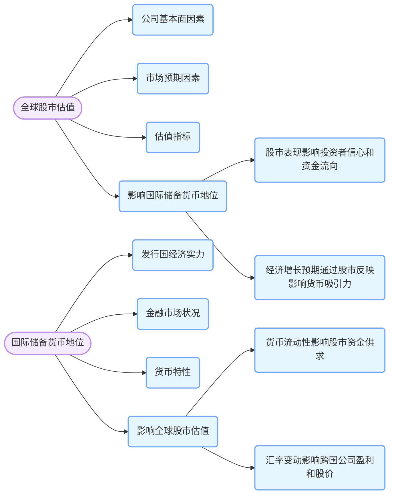

# 全球股市估值与国际储备货币地位的互动

> 关键词：全球股市估值、国际储备货币地位、互动关系、经济影响、金融市场

> 摘要：本文深入探讨了全球股市估值与国际储备货币地位之间的互动关系。首先介绍了研究的背景、目的、预期读者、文档结构及相关术语。接着阐述了核心概念及它们之间的联系，包括股市估值和国际储备货币地位的原理，并通过示意图和流程图展示。详细讲解了分析两者互动关系的核心算法原理及具体操作步骤，同时给出了相关的数学模型和公式，并举例说明。通过项目实战，搭建开发环境，实现源代码并进行解读。探讨了两者互动在实际中的应用场景，推荐了学习、开发工具及相关论文著作。最后总结了未来发展趋势与挑战，解答常见问题并提供扩展阅读和参考资料，旨在为理解全球金融市场中这一重要关系提供全面且深入的视角。

## 1. 背景介绍 
### 1.1 目的和范围
在当今全球化的金融市场中，全球股市估值和国际储备货币地位是两个至关重要的因素。全球股市估值反映了各国股票市场的整体价值水平，而国际储备货币地位则体现了一种货币在国际金融体系中的重要性和影响力。本研究的目的在于深入剖析这两者之间的互动关系，探究它们如何相互影响、相互作用，以及这种互动对全球金融市场和经济发展的影响。研究范围涵盖了主要国际储备货币（如美元、欧元、日元等）发行国的股市以及全球主要股票市场，通过对历史数据的分析和实证研究，揭示两者之间的内在联系和规律。

### 1.2 预期读者
本文预期读者包括金融市场从业者，如股票分析师、基金经理、外汇交易员等，他们可以通过本文更好地理解全球股市和国际储备货币市场的动态变化，为投资决策提供参考。同时，对于经济学研究人员和学者来说，本文提供了一个新的研究视角和实证分析方法，有助于推动相关领域的学术研究。此外，对金融市场感兴趣的普通投资者和爱好者也可以通过本文了解全球金融市场的复杂性和相互关联性。

### 1.3 文档结构概述
本文共分为十个部分。第一部分为背景介绍，阐述了研究的目的、范围、预期读者和文档结构。第二部分介绍核心概念与联系，解释全球股市估值和国际储备货币地位的概念，并展示它们之间的关系。第三部分讲解核心算法原理和具体操作步骤，通过 Python 代码实现相关算法。第四部分给出数学模型和公式，并详细讲解和举例说明。第五部分进行项目实战，包括开发环境搭建、源代码实现和代码解读。第六部分探讨实际应用场景。第七部分推荐学习、开发工具和相关论文著作。第八部分总结未来发展趋势与挑战。第九部分为附录，解答常见问题。第十部分提供扩展阅读和参考资料。

### 1.4 术语表
#### 1.4.1 核心术语定义
- **全球股市估值**：指对全球范围内各个股票市场中上市公司股票的总体价值评估，通常通过一些指标来衡量，如市盈率（P/E）、市净率（P/B）等。
- **国际储备货币地位**：一种货币在国际金融体系中被其他国家广泛持有作为外汇储备的程度和地位，反映了该货币在国际贸易、投资和金融交易中的可接受性和重要性。

#### 1.4.2 相关概念解释
- **市盈率（P/E）**：是指股票价格除以每股收益（EPS）的比率，反映了投资者为获取公司一元净利润所愿意支付的价格，是衡量股票估值的重要指标之一。
- **市净率（P/B）**：是指股票价格与每股净资产的比率，用于评估股票相对于其账面价值的高低，也是常用的股票估值指标。
- **外汇储备**：是指各国政府持有的可自由兑换货币及其他短期金融资产，主要用于国际支付、维持汇率稳定和应对外部经济冲击等。

#### 1.4.3 缩略词列表
- **P/E**：Price-to-Earnings Ratio，市盈率
- **P/B**：Price-to-Book Ratio，市净率
- **GDP**：Gross Domestic Product，国内生产总值

## 2. 核心概念与联系 
### 核心概念原理
#### 全球股市估值原理
全球股市估值是对全球股票市场中上市公司股票价值的综合评估。其原理基于对公司基本面和市场预期的分析。从公司基本面来看，包括公司的盈利能力、资产质量、现金流等因素。例如，一家盈利能力强、资产质量高的公司，其股票价值通常会较高。市场预期也是影响股市估值的重要因素，投资者对宏观经济形势、行业发展前景等的预期会影响他们对股票的出价。常用的估值指标如市盈率和市净率，市盈率反映了市场对公司未来盈利增长的预期，市净率则体现了股票价格相对于公司净资产的溢价程度。

#### 国际储备货币地位原理
一种货币成为国际储备货币需要具备多个条件。首先，发行国需要有强大的经济实力，其国内经济规模大、稳定性高，能够为货币提供坚实的经济基础。例如，美国作为全球最大的经济体，美元在国际储备货币中占据主导地位。其次，货币发行国需要有开放、发达的金融市场，便于其他国家进行货币交易和投资。此外，货币的稳定性和可自由兑换性也是关键因素，只有货币价值相对稳定且能够自由兑换，其他国家才愿意将其作为储备货币持有。

### 核心概念架构的文本示意图
```plaintext
全球股市估值
    |
    |-- 公司基本面因素（盈利能力、资产质量、现金流等）
    |-- 市场预期因素（宏观经济形势、行业前景等）
    |-- 估值指标（市盈率、市净率等）

国际储备货币地位
    |
    |-- 发行国经济实力（经济规模、稳定性等）
    |-- 金融市场状况（开放性、发达程度等）
    |-- 货币特性（稳定性、可自由兑换性等）

互动关系
    |
    |-- 国际储备货币地位影响全球股市估值
    |   |-- 货币流动性影响股市资金供求
    |   |-- 汇率变动影响跨国公司盈利和股价
    |
    |-- 全球股市估值影响国际储备货币地位
    |   |-- 股市表现影响投资者信心和资金流向
    |   |-- 经济增长预期通过股市反映影响货币吸引力
```

### Mermaid 流程图


## 3. 核心算法原理 & 具体操作步骤 
### 核心算法原理
为了分析全球股市估值与国际储备货币地位的互动关系，我们可以采用多元回归分析方法。多元回归分析是一种统计方法，用于研究一个因变量与多个自变量之间的关系。在本研究中，我们可以将全球股市估值（用市盈率或市净率等指标表示）作为因变量，将国际储备货币地位的相关指标（如该货币在全球外汇储备中的占比、汇率等）以及其他可能影响股市估值的因素（如 GDP 增长率、利率等）作为自变量。通过建立多元回归模型，我们可以估计各个自变量对因变量的影响程度和方向。

### Python 源代码实现
```python
import pandas as pd
import numpy as np
import statsmodels.api as sm

# 假设我们有以下数据
# 全球股市市盈率（因变量）
stock_pe = np.array([15, 16, 17, 18, 19])
# 国际储备货币在全球外汇储备中的占比（自变量）
reserve_currency_ratio = np.array([0.6, 0.62, 0.64, 0.66, 0.68])
# GDP 增长率（自变量）
gdp_growth = np.array([0.02, 0.025, 0.03, 0.035, 0.04])

# 构建自变量矩阵
X = np.column_stack((reserve_currency_ratio, gdp_growth))
# 添加常数项
X = sm.add_constant(X)

# 构建多元回归模型
model = sm.OLS(stock_pe, X)
# 拟合模型
results = model.fit()

# 输出回归结果
print(results.summary())
```

### 具体操作步骤
1. **数据收集**：收集全球股市估值数据（如市盈率、市净率等）、国际储备货币地位相关数据（如货币在全球外汇储备中的占比、汇率等）以及其他可能影响股市估值的因素（如 GDP 增长率、利率等）。数据可以从金融数据提供商（如 Bloomberg、Wind 等）、国际组织（如国际货币基金组织、世界银行等）和各国政府部门获取。
2. **数据预处理**：对收集到的数据进行清洗和整理，处理缺失值、异常值等问题。同时，对数据进行标准化处理，以消除不同变量之间的量纲差异。
3. **模型构建**：根据多元回归分析的原理，构建回归模型。将全球股市估值作为因变量，国际储备货币地位相关指标和其他影响因素作为自变量。
4. **模型拟合**：使用 Python 等编程语言中的统计分析库（如 statsmodels）对模型进行拟合，估计回归系数。
5. **结果分析**：分析回归结果，包括回归系数的显著性、模型的拟合优度等。判断国际储备货币地位相关指标对全球股市估值的影响程度和方向。

## 4. 数学模型和公式 & 详细讲解 & 举例说明 
### 数学模型
我们建立的多元回归模型可以表示为：

$$
Y = \beta_0 + \beta_1X_1 + \beta_2X_2 + \cdots + \beta_nX_n + \epsilon
$$

其中，$Y$ 表示全球股市估值（如市盈率），$X_1, X_2, \cdots, X_n$ 表示自变量，包括国际储备货币地位相关指标（如货币在全球外汇储备中的占比、汇率等）和其他影响因素（如 GDP 增长率、利率等），$\beta_0$ 是截距项，$\beta_1, \beta_2, \cdots, \beta_n$ 是回归系数，$\epsilon$ 是误差项。

### 详细讲解
回归系数 $\beta_i$ 表示在其他自变量保持不变的情况下，自变量 $X_i$ 每变化一个单位，因变量 $Y$ 的平均变化量。例如，如果 $\beta_1$ 表示国际储备货币在全球外汇储备中的占比的回归系数，且 $\beta_1 > 0$，则说明国际储备货币在全球外汇储备中的占比增加时，全球股市估值也会增加。

模型的拟合优度通常用 $R^2$ 来衡量，$R^2$ 的取值范围在 $0$ 到 $1$ 之间，$R^2$ 越接近 $1$，说明模型对数据的拟合程度越好。

### 举例说明
假设我们的多元回归模型为：

$$
\text{Stock PE} = \beta_0 + \beta_1\text{Reserve Ratio} + \beta_2\text{GDP Growth} + \epsilon
$$

其中，$\text{Stock PE}$ 表示全球股市市盈率，$\text{Reserve Ratio}$ 表示国际储备货币在全球外汇储备中的占比，$\text{GDP Growth}$ 表示 GDP 增长率。

通过数据拟合得到回归结果：$\beta_0 = 10$，$\beta_1 = 5$，$\beta_2 = 20$。这意味着当国际储备货币在全球外汇储备中的占比增加 $0.1$，且 GDP 增长率保持不变时，全球股市市盈率预计会增加 $5 \times 0.1 = 0.5$；当 GDP 增长率增加 $0.01$，且国际储备货币在全球外汇储备中的占比保持不变时，全球股市市盈率预计会增加 $20 \times 0.01 = 0.2$。

## 5. 项目实战：代码实际案例和详细解释说明 
### 5.1  开发环境搭建
为了完成本项目实战，我们需要搭建以下开发环境：
1. **Python 环境**：建议使用 Python 3.7 及以上版本。可以从 Python 官方网站（https://www.python.org/downloads/）下载并安装。
2. **开发工具**：推荐使用 Jupyter Notebook 或 PyCharm 等开发工具。Jupyter Notebook 可以方便地进行代码编写、运行和结果展示，PyCharm 则是一个功能强大的 Python 集成开发环境。
3. **所需库安装**：使用以下命令安装所需的 Python 库：
```sh
pip install pandas numpy statsmodels matplotlib
```

### 5.2  源代码详细实现和代码解读
```python
import pandas as pd
import numpy as np
import statsmodels.api as sm
import matplotlib.pyplot as plt

# 读取数据
data = pd.read_csv('global_stock_and_reserve.csv')

# 提取因变量和自变量
y = data['Stock_PE']  # 全球股市市盈率
X = data[['Reserve_Ratio', 'GDP_Growth']]  # 国际储备货币占比和 GDP 增长率

# 添加常数项
X = sm.add_constant(X)

# 构建多元回归模型
model = sm.OLS(y, X)

# 拟合模型
results = model.fit()

# 输出回归结果
print(results.summary())

# 绘制预测值与实际值的散点图
y_pred = results.predict(X)
plt.scatter(y, y_pred)
plt.xlabel('Actual Stock PE')
plt.ylabel('Predicted Stock PE')
plt.title('Actual vs Predicted Stock PE')
plt.show()
```

### 代码解读与分析
1. **数据读取**：使用 `pandas` 库的 `read_csv` 函数读取存储在 `global_stock_and_reserve.csv` 文件中的数据。
2. **提取因变量和自变量**：从数据中提取全球股市市盈率作为因变量 `y`，国际储备货币占比和 GDP 增长率作为自变量 `X`。
3. **添加常数项**：使用 `sm.add_constant` 函数为自变量矩阵添加常数项，以便在回归模型中包含截距项。
4. **构建和拟合模型**：使用 `sm.OLS` 函数构建多元线性回归模型，并使用 `fit` 方法拟合模型。
5. **输出回归结果**：使用 `results.summary()` 输出回归结果，包括回归系数、标准误差、$t$ 值、$p$ 值和 $R^2$ 等统计信息。
6. **绘制散点图**：使用 `matplotlib` 库绘制预测值与实际值的散点图，直观地展示模型的拟合效果。

## 6. 实际应用场景 
### 投资决策
对于全球投资者来说，了解全球股市估值与国际储备货币地位的互动关系可以帮助他们做出更明智的投资决策。例如，如果预计某国际储备货币的地位将上升，可能会导致该货币发行国的股市估值上升，投资者可以提前布局相关股票。同时，投资者也可以根据股市估值的变化来判断国际储备货币地位的潜在变化，调整外汇资产配置。

### 货币政策制定
各国央行在制定货币政策时，需要考虑全球股市估值和国际储备货币地位的影响。当国际储备货币地位发生变化时，可能会影响国内的货币供应量、汇率和通货膨胀率等。央行可以根据这种互动关系，调整货币政策工具（如利率、准备金率等），以维持经济的稳定增长和金融市场的稳定。

### 风险管理
金融机构在进行风险管理时，需要考虑全球股市估值与国际储备货币地位互动带来的风险。例如，汇率波动可能会影响跨国公司的盈利和股价，进而影响金融机构的资产质量。金融机构可以通过建立风险模型，对这种互动关系带来的风险进行评估和管理，采取相应的对冲措施。

### 国际经济合作
在国际经济合作中，全球股市估值和国际储备货币地位的互动关系也具有重要意义。各国可以通过加强合作，共同维护国际储备货币体系的稳定，促进全球股市的健康发展。例如，国际货币基金组织可以在协调各国货币政策、稳定汇率等方面发挥重要作用。

## 7. 工具和资源推荐
### 7.1 学习资源推荐
#### 7.1.1 书籍推荐
- 《金融市场与金融机构》：这本书全面介绍了金融市场的各种组成部分和金融机构的运作原理，包括股票市场、外汇市场等，有助于读者深入理解全球股市估值和国际储备货币地位的相关知识。
- 《计量经济学导论》：计量经济学是分析经济数据和建立经济模型的重要工具，这本书详细介绍了多元回归分析等计量方法，对于研究全球股市估值与国际储备货币地位的互动关系非常有帮助。

#### 7.1.2 在线课程
- Coursera 上的“金融市场”课程：由知名大学教授授课，系统地讲解了金融市场的基本概念、理论和实践，包括股市估值和外汇市场等内容。
- edX 上的“计量经济学基础”课程：提供了计量经济学的基础知识和分析方法，适合初学者学习如何运用计量方法进行经济数据分析。

#### 7.1.3 技术博客和网站
- 金融界网站：提供了丰富的金融市场资讯和数据分析，包括全球股市行情、国际储备货币数据等，是获取金融数据和信息的重要来源。
- 量化投资与机器学习博客：分享了量化投资和数据分析的相关技术和方法，对于运用数据分析全球股市估值与国际储备货币地位的互动关系有一定的参考价值。

### 7.2 开发工具框架推荐
#### 7.2.1 IDE和编辑器
- Jupyter Notebook：是一个交互式的开发环境，适合进行数据分析和模型构建。它支持代码编写、运行和结果展示，方便用户进行数据探索和可视化。
- PyCharm：是一个功能强大的 Python 集成开发环境，提供了代码编辑、调试、版本控制等功能，适合开发大型的 Python 项目。

#### 7.2.2 调试和性能分析工具
- IPython：是 Python 的交互式解释器，提供了强大的调试功能，如代码补全、语法高亮、错误提示等，有助于提高开发效率。
- cProfile：是 Python 内置的性能分析工具，可以分析代码的运行时间和函数调用情况，帮助用户找出代码中的性能瓶颈。

#### 7.2.3 相关框架和库
- Pandas：是 Python 中用于数据处理和分析的重要库，提供了高效的数据结构和数据操作方法，方便用户进行数据清洗、整理和分析。
- NumPy：是 Python 中用于科学计算的基础库，提供了高效的数组操作和数学函数，对于进行数值计算和矩阵运算非常有用。
- Statsmodels：是 Python 中用于统计分析的库，提供了多种统计模型和分析方法，如线性回归、逻辑回归等，适合用于构建和分析全球股市估值与国际储备货币地位的互动模型。

### 7.3 相关论文著作推荐
#### 7.3.1 经典论文
- “The Role of the Dollar as an International Currency”：这篇论文深入探讨了美元作为国际储备货币的地位和作用，分析了美元在国际金融体系中的影响力和挑战。
- “Stock Market Valuation and Macroeconomic Conditions”：研究了股市估值与宏观经济条件之间的关系，为理解全球股市估值的影响因素提供了重要的理论基础。

#### 7.3.2 最新研究成果
- 关注国际金融领域的顶级学术期刊，如《Journal of Finance》《Review of Financial Studies》等，这些期刊会发表关于全球股市估值和国际储备货币地位的最新研究成果。
- 国际货币基金组织（IMF）和世界银行等国际组织的研究报告，也会对全球金融市场的动态和趋势进行深入分析，包括全球股市估值和国际储备货币地位的变化。

#### 7.3.3 应用案例分析
- 一些知名金融机构（如高盛、摩根大通等）会发布关于全球股市和外汇市场的研究报告和应用案例分析，这些案例可以帮助读者更好地理解全球股市估值与国际储备货币地位的互动关系在实际中的应用。

## 8. 总结：未来发展趋势与挑战
### 未来发展趋势
#### 多元化趋势
随着全球经济格局的变化，国际储备货币体系可能会朝着多元化的方向发展。除了美元、欧元等传统国际储备货币外，人民币等新兴经济体货币的国际储备货币地位可能会逐步提升。这种多元化趋势将对全球股市估值产生影响，不同货币发行国的股市可能会受到不同程度的关注和资金流入。

#### 数字化趋势
随着金融科技的发展，数字货币可能会逐渐在国际储备货币体系中发挥作用。数字货币的出现可能会改变国际储备货币的形态和交易方式，进而影响全球股市估值。例如，数字货币的普及可能会提高金融市场的效率和透明度，促进资金的流动和配置，对股市估值产生积极影响。

#### 宏观经济环境变化影响
全球宏观经济环境的变化，如经济增长放缓、通货膨胀上升、贸易摩擦加剧等，将对全球股市估值和国际储备货币地位产生重要影响。在经济不稳定的情况下，投资者可能会更加关注资产的安全性和稳定性，导致资金流向国际储备货币和相对稳定的股市。

### 挑战
#### 金融市场波动风险
全球股市估值与国际储备货币地位的互动关系可能会加剧金融市场的波动。例如，国际储备货币地位的变化可能会导致汇率波动，进而影响跨国公司的盈利和股价，引发股市波动。同时，股市波动也可能会影响投资者对国际储备货币的信心，导致资金流动不稳定。

#### 政策协调难度
在全球经济一体化的背景下，各国货币政策和财政政策的协调难度较大。不同国家的政策目标和利益诉求可能存在差异，这可能会导致国际储备货币体系的不稳定和全球股市估值的波动。例如，一些国家为了刺激经济增长可能会采取宽松的货币政策，导致货币贬值，影响其国际储备货币地位和全球股市估值。

#### 数据质量和分析方法挑战
准确分析全球股市估值与国际储备货币地位的互动关系需要高质量的数据和先进的分析方法。然而，金融数据的获取和处理存在一定的困难，数据的准确性和完整性也可能受到影响。同时，现有的分析方法可能无法完全捕捉到两者之间复杂的互动关系，需要不断创新和改进分析方法。

## 9. 附录：常见问题与解答
### 问题 1：全球股市估值与国际储备货币地位的互动关系是单向的还是双向的？
答：这种互动关系是双向的。一方面，国际储备货币地位的变化会影响全球股市估值。例如，国际储备货币的升值可能会吸引更多的资金流入该货币发行国的股市，推动股市估值上升；汇率的波动也会影响跨国公司的盈利和股价，进而影响股市估值。另一方面，全球股市估值的变化也会影响国际储备货币地位。如果一个国家的股市表现良好，吸引了大量的国际资金流入，可能会提高该国货币的吸引力，增强其国际储备货币地位。

### 问题 2：如何衡量国际储备货币地位？
答：衡量国际储备货币地位可以从多个方面进行。常用的指标包括该货币在全球外汇储备中的占比、在国际贸易结算中的使用比例、在国际金融交易中的交易量等。此外，货币的稳定性、可自由兑换性以及发行国的经济实力和金融市场发展程度等也是影响国际储备货币地位的重要因素。

### 问题 3：全球股市估值受到哪些因素的影响？
答：全球股市估值受到多种因素的影响，包括公司基本面因素（如盈利能力、资产质量、现金流等）、市场预期因素（如宏观经济形势、行业前景等）、宏观经济政策（如货币政策、财政政策等）、国际政治局势以及全球金融市场的流动性等。国际储备货币地位的变化也是影响全球股市估值的重要因素之一。

### 问题 4：在实际应用中，如何利用全球股市估值与国际储备货币地位的互动关系进行投资决策？
答：投资者可以关注国际储备货币地位的变化趋势，以及其对不同国家和地区股市估值的影响。例如，如果预计某国际储备货币的地位将上升，可以考虑增加对该货币发行国股市的投资。同时，投资者也可以根据股市估值的变化来判断国际储备货币地位的潜在变化，调整外汇资产配置。但需要注意的是，投资决策应该综合考虑多种因素，不能仅仅依赖于这一互动关系。

## 10. 扩展阅读 & 参考资料
### 扩展阅读
- 《全球金融市场与投资策略》：进一步深入探讨了全球金融市场的运行机制和投资策略，对于理解全球股市估值和国际储备货币地位的互动关系在投资中的应用有很大帮助。
- 《国际货币体系改革研究》：研究了国际货币体系的历史演变和未来改革方向，有助于读者了解国际储备货币地位的变化趋势和影响因素。

### 参考资料
- Bloomberg 金融数据库：提供了全球金融市场的实时数据和历史数据，包括股市行情、外汇汇率等。
- 国际货币基金组织（IMF）官方网站：发布了关于国际储备货币、全球经济形势等方面的报告和数据。
- 世界银行官方网站：提供了各国的经济数据和发展报告，对于研究全球股市估值和国际储备货币地位的互动关系有重要参考价值。

作者：AI天才研究院/AI Genius Institute & 禅与计算机程序设计艺术 /Zen And The Art of Computer Programming