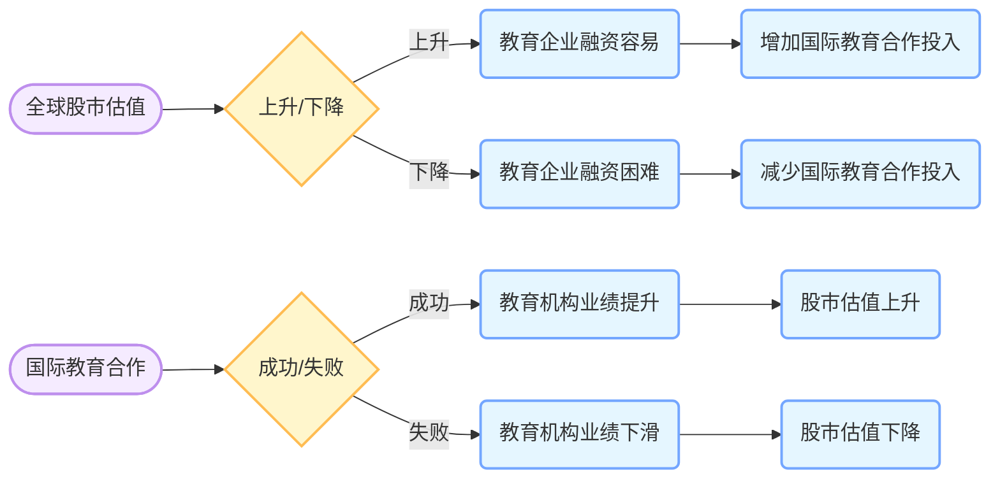

# 全球股市估值与国际教育合作的互动

> 关键词：全球股市估值、国际教育合作、互动关系、经济影响、教育产业发展

> 摘要：本文旨在深入探讨全球股市估值与国际教育合作之间的互动关系。通过对相关核心概念的阐述、算法原理的分析、数学模型的构建，结合实际案例和应用场景，揭示两者之间相互影响的内在机制。同时，为读者提供了丰富的学习资源、开发工具和相关论文著作推荐，最后对未来发展趋势与挑战进行总结，并解答常见问题。希望能为投资者、教育从业者以及相关研究人员提供有价值的参考。

## 1. 背景介绍 
### 1.1 目的和范围
全球股市估值反映了市场对上市公司价值的综合评估，是宏观经济和微观企业状况的重要体现。国际教育合作则涵盖了跨国的教育交流、项目合作、学术研究等多个方面，对于提升教育质量、促进文化交流具有重要意义。本研究的目的在于分析全球股市估值与国际教育合作之间的互动关系，明确两者相互影响的途径和程度。研究范围包括全球主要股票市场的估值指标以及各类国际教育合作项目，涉及教育机构、企业和政府等多个主体。

### 1.2 预期读者
本文预期读者包括金融投资者，他们可以通过了解两者的互动关系，更好地把握教育相关股票的投资机会；教育从业者，有助于他们从经济角度理解国际教育合作的发展趋势和潜在影响；学术研究人员，为相关领域的研究提供新的视角和思路；以及政府政策制定者，为制定教育和金融政策提供参考依据。

### 1.3 文档结构概述
本文首先介绍相关背景信息，包括目的、预期读者和文档结构。接着阐述核心概念及其联系，通过文本示意图和 Mermaid 流程图进行清晰展示。然后详细讲解核心算法原理和具体操作步骤，结合 Python 源代码进行说明。之后构建数学模型和公式，并举例说明。通过项目实战部分展示代码实际案例和详细解释。分析实际应用场景，为读者提供实用的参考。推荐学习资源、开发工具和相关论文著作。最后总结未来发展趋势与挑战，解答常见问题，并提供扩展阅读和参考资料。

### 1.4 术语表
#### 1.4.1 核心术语定义
- 全球股市估值：指对全球范围内股票市场中上市公司价值的评估，通常通过市盈率（P/E）、市净率（P/B）等指标来衡量。
- 国际教育合作：不同国家或地区的教育机构、企业、政府等主体之间开展的教育交流、合作项目、学术研究等活动。
- 互动关系：全球股市估值与国际教育合作之间相互影响、相互作用的关系。

#### 1.4.2 相关概念解释
- 市盈率（P/E）：股票价格与每股收益的比率，反映了市场对公司盈利预期的高低。
- 市净率（P/B）：股票价格与每股净资产的比率，衡量了股票的相对估值水平。
- 教育产业：包括各类教育机构、教育服务提供商以及相关的教育科技企业等，是国际教育合作的重要载体。

#### 1.4.3 缩略词列表
- P/E：Price-to-Earnings Ratio，市盈率
- P/B：Price-to-Book Ratio，市净率

## 2. 核心概念与联系 
### 核心概念原理
全球股市估值是基于市场参与者对上市公司未来盈利能力、资产质量、行业前景等因素的综合判断。市盈率和市净率是常用的估值指标，市盈率越高，说明市场对公司未来盈利增长的预期越高；市净率越高，表明市场对公司资产的估值越高。

国际教育合作则是在全球化背景下，不同国家和地区为了实现教育资源共享、提升教育质量、促进文化交流而开展的合作活动。其形式包括学生交换项目、教师交流、联合办学、国际教育技术合作等。

### 架构的文本示意图
全球股市估值和国际教育合作之间存在着复杂的互动关系。一方面，国际教育合作的发展状况会影响相关教育企业的业绩和前景，进而影响其在股市中的估值。例如，成功的国际教育合作项目可以增加教育机构的收入、提升品牌知名度，从而推动其股价上涨。另一方面，全球股市估值的变化也会影响国际教育合作的资金来源和发展动力。当股市估值上升时，教育企业融资相对容易，有更多资金投入到国际教育合作项目中；反之，股市低迷时，企业融资困难，可能会减少国际教育合作的投入。

### Mermaid 流程图


## 3. 核心算法原理 & 具体操作步骤 
### 核心算法原理
为了分析全球股市估值与国际教育合作的互动关系，我们可以采用时间序列分析方法。时间序列分析是一种用于处理按时间顺序排列的数据的统计方法，通过对历史数据的分析，预测未来的趋势。

具体来说，我们可以将全球股市估值指标（如市盈率、市净率）和国际教育合作的相关指标（如合作项目数量、合作金额等）作为时间序列数据。然后，使用自回归积分滑动平均模型（ARIMA）来建立两者之间的关系模型。

### Python 源代码实现
```python
import pandas as pd
import numpy as np
from statsmodels.tsa.arima.model import ARIMA
import matplotlib.pyplot as plt

# 模拟全球股市估值和国际教育合作数据
np.random.seed(0)
n = 100
stock_valuation = np.random.randn(n).cumsum() + 100
education_cooperation = np.random.randn(n).cumsum() + 50

# 创建时间序列数据
date_index = pd.date_range(start='2020-01-01', periods=n, freq='D')
stock_df = pd.DataFrame(stock_valuation, index=date_index, columns=['Stock Valuation'])
education_df = pd.DataFrame(education_cooperation, index=date_index, columns=['Education Cooperation'])

# 训练 ARIMA 模型
# 假设 ARIMA(p, d, q) 中的 p=1, d=1, q=1
model_stock = ARIMA(stock_df['Stock Valuation'], order=(1, 1, 1))
model_education = ARIMA(education_df['Education Cooperation'], order=(1, 1, 1))

result_stock = model_stock.fit()
result_education = model_education.fit()

# 预测未来值
forecast_stock = result_stock.get_forecast(steps=10)
forecast_education = result_education.get_forecast(steps=10)

# 绘制预测结果
plt.figure(figsize=(12, 6))
plt.subplot(2, 1, 1)
plt.plot(stock_df.index, stock_df['Stock Valuation'], label='Historical Stock Valuation')
plt.plot(forecast_stock.predicted_mean.index, forecast_stock.predicted_mean, label='Forecasted Stock Valuation', color='red')
plt.title('Stock Valuation Forecast')
plt.legend()

plt.subplot(2, 1, 2)
plt.plot(education_df.index, education_df['Education Cooperation'], label='Historical Education Cooperation')
plt.plot(forecast_education.predicted_mean.index, forecast_education.predicted_mean, label='Forecasted Education Cooperation', color='red')
plt.title('Education Cooperation Forecast')
plt.legend()

plt.tight_layout()
plt.show()
```

### 具体操作步骤
1. **数据收集**：收集全球股市估值指标和国际教育合作的相关数据，确保数据的准确性和完整性。
2. **数据预处理**：对收集到的数据进行清洗、转换和标准化处理，以便后续分析。
3. **模型选择**：根据数据的特点和分析目的，选择合适的时间序列模型，如 ARIMA 模型。
4. **模型训练**：使用历史数据对模型进行训练，确定模型的参数。
5. **模型评估**：使用评估指标（如均方误差、平均绝对误差等）对模型的性能进行评估。
6. **预测和分析**：使用训练好的模型对未来的全球股市估值和国际教育合作情况进行预测，并分析两者之间的关系。

## 4. 数学模型和公式 & 详细讲解 & 举例说明 
### 数学模型
自回归积分滑动平均模型（ARIMA）是一种广泛应用于时间序列分析的模型，其一般形式为：

$$
(1 - \phi_1B - \phi_2B^2 - \cdots - \phi_pB^p)(1 - B)^dX_t = (1 + \theta_1B + \theta_2B^2 + \cdots + \theta_qB^q)\epsilon_t
$$

其中，$X_t$ 是时间序列数据，$B$ 是滞后算子，即 $BX_t = X_{t - 1}$，$\phi_i$ 是自回归系数，$\theta_j$ 是滑动平均系数，$p$ 是自回归阶数，$d$ 是差分阶数，$q$ 是滑动平均阶数，$\epsilon_t$ 是白噪声序列。

### 详细讲解
- **自回归部分（AR）**：表示当前值与过去值之间的线性关系，通过自回归系数 $\phi_i$ 来衡量。
- **差分部分（I）**：用于处理非平稳时间序列，通过差分操作将非平稳序列转换为平稳序列。
- **滑动平均部分（MA）**：表示当前值与过去白噪声之间的线性关系，通过滑动平均系数 $\theta_j$ 来衡量。

### 举例说明
假设我们有一个时间序列数据 $X_t$，经过分析确定 $p = 1$，$d = 1$，$q = 1$，则 ARIMA(1, 1, 1) 模型的具体形式为：

$$
(1 - \phi_1B)(1 - B)X_t = (1 + \theta_1B)\epsilon_t
$$

展开可得：

$$
X_t - X_{t - 1} - \phi_1(X_{t - 1} - X_{t - 2}) = \epsilon_t + \theta_1\epsilon_{t - 1}
$$

整理得：

$$
X_t = (1 + \phi_1)X_{t - 1} - \phi_1X_{t - 2} + \epsilon_t + \theta_1\epsilon_{t - 1}
$$

在实际应用中，我们可以使用 Python 中的 `statsmodels` 库来估计模型的参数 $\phi_1$ 和 $\theta_1$，并进行预测。

## 5. 项目实战：代码实际案例和详细解释说明 
### 5.1  开发环境搭建
- **Python 安装**：从 Python 官方网站（https://www.python.org/downloads/）下载并安装 Python 3.x 版本。
- **必要库安装**：使用以下命令安装所需的 Python 库：
```sh
pip install pandas numpy statsmodels matplotlib
```

### 5.2  源代码详细实现和代码解读
```python
import pandas as pd
import numpy as np
from statsmodels.tsa.arima.model import ARIMA
import matplotlib.pyplot as plt

# 模拟全球股市估值和国际教育合作数据
np.random.seed(0)
n = 100
stock_valuation = np.random.randn(n).cumsum() + 100
education_cooperation = np.random.randn(n).cumsum() + 50

# 创建时间序列数据
date_index = pd.date_range(start='2020-01-01', periods=n, freq='D')
stock_df = pd.DataFrame(stock_valuation, index=date_index, columns=['Stock Valuation'])
education_df = pd.DataFrame(education_cooperation, index=date_index, columns=['Education Cooperation'])

# 训练 ARIMA 模型
# 假设 ARIMA(p, d, q) 中的 p=1, d=1, q=1
model_stock = ARIMA(stock_df['Stock Valuation'], order=(1, 1, 1))
model_education = ARIMA(education_df['Education Cooperation'], order=(1, 1, 1))

result_stock = model_stock.fit()
result_education = model_education.fit()

# 预测未来值
forecast_stock = result_stock.get_forecast(steps=10)
forecast_education = result_education.get_forecast(steps=10)

# 绘制预测结果
plt.figure(figsize=(12, 6))
plt.subplot(2, 1, 1)
plt.plot(stock_df.index, stock_df['Stock Valuation'], label='Historical Stock Valuation')
plt.plot(forecast_stock.predicted_mean.index, forecast_stock.predicted_mean, label='Forecasted Stock Valuation', color='red')
plt.title('Stock Valuation Forecast')
plt.legend()

plt.subplot(2, 1, 2)
plt.plot(education_df.index, education_df['Education Cooperation'], label='Historical Education Cooperation')
plt.plot(forecast_education.predicted_mean.index, forecast_education.predicted_mean, label='Forecasted Education Cooperation', color='red')
plt.title('Education Cooperation Forecast')
plt.legend()

plt.tight_layout()
plt.show()
```

### 代码解读与分析
1. **数据模拟**：使用 `numpy` 库生成模拟的全球股市估值和国际教育合作数据，并使用 `pandas` 库将其转换为时间序列数据。
2. **模型训练**：使用 `statsmodels` 库中的 `ARIMA` 类创建 ARIMA 模型，并使用 `fit` 方法进行训练。
3. **预测**：使用训练好的模型对未来 10 个时间步的值进行预测。
4. **可视化**：使用 `matplotlib` 库绘制历史数据和预测结果的图表，直观展示全球股市估值和国际教育合作的变化趋势。

## 6. 实际应用场景 
### 金融投资领域
投资者可以根据全球股市估值与国际教育合作的互动关系，调整投资组合。当国际教育合作项目增多、发展前景良好时，投资者可以增加对教育相关股票的投资；反之，当股市估值下降、教育企业融资困难时，适当减少投资。

### 教育机构决策
教育机构可以通过分析全球股市估值的变化，合理安排国际教育合作项目的资金投入和发展计划。在股市估值较高、融资容易时，加大国际教育合作的力度；在股市低迷时，谨慎投资，优化现有项目。

### 政府政策制定
政府可以根据全球股市估值和国际教育合作的情况，制定相应的政策。例如，当股市估值下降影响到教育企业的国际合作时，政府可以出台扶持政策，鼓励金融机构为教育企业提供融资支持，促进国际教育合作的发展。

## 7. 工具和资源推荐
### 7.1 学习资源推荐
#### 7.1.1 书籍推荐
- 《时间序列分析：预测与控制》（*Time Series Analysis: Forecasting and Control*）：全面介绍了时间序列分析的理论和方法，是该领域的经典教材。
- 《金融时间序列分析》（*Analysis of Financial Time Series*）：专注于金融领域的时间序列分析，对于理解全球股市估值的变化具有重要参考价值。
- 《国际教育合作研究》：系统阐述了国际教育合作的理论、实践和发展趋势。

#### 7.1.2 在线课程
- Coursera 上的“时间序列分析与预测”课程：由知名教授授课，提供了丰富的案例和实践项目。
- edX 上的“金融数据分析”课程：涵盖了金融时间序列分析的基本方法和工具。
- Udemy 上的“国际教育合作实战”课程：结合实际案例，介绍国际教育合作的操作流程和技巧。

#### 7.1.3 技术博客和网站
- Towards Data Science：提供了大量关于数据分析、机器学习和时间序列分析的文章和教程。
- Investing.com：提供全球股市估值的实时数据和分析报告。
- 国际教育交流协会官方网站：发布国际教育合作的最新动态和政策信息。

### 7.2 开发工具框架推荐
#### 7.2.1 IDE和编辑器
- PyCharm：功能强大的 Python 集成开发环境，提供代码编辑、调试、版本控制等功能。
- Jupyter Notebook：交互式编程环境，适合进行数据分析和模型开发，方便展示代码和结果。

#### 7.2.2 调试和性能分析工具
- PDB：Python 内置的调试器，用于调试 Python 代码。
- cProfile：Python 标准库中的性能分析工具，用于分析代码的运行时间和性能瓶颈。

#### 7.2.3 相关框架和库
- Pandas：用于数据处理和分析的 Python 库，提供了高效的数据结构和数据操作方法。
- NumPy：Python 科学计算的基础库，提供了多维数组和数学函数。
- Statsmodels：用于统计建模和时间序列分析的 Python 库，提供了丰富的模型和方法。

### 7.3 相关论文著作推荐
#### 7.3.1 经典论文
- Box, G. E. P., & Jenkins, G. M. (1970). *Time Series Analysis: Forecasting and Control*. 该论文奠定了时间序列分析的基础，提出了 ARIMA 模型。
- Fama, E. F. (1970). Efficient capital markets: A review of theory and empirical work. *The Journal of Finance*, 25(2), 383-417. 提出了有效市场假说，对股市估值的研究具有重要影响。

#### 7.3.2 最新研究成果
- 近年来，关于全球股市估值与国际教育合作关系的研究逐渐增多。例如，一些研究通过实证分析发现，国际教育合作的发展对教育企业的股价有显著的正向影响。

#### 7.3.3 应用案例分析
- 某些国际教育集团通过成功开展国际教育合作项目，提升了品牌知名度和市场竞争力，其股价在股市中表现优异。这些案例可以为投资者和教育机构提供借鉴。

## 8. 总结：未来发展趋势与挑战
### 未来发展趋势
- **数字化融合**：随着信息技术的发展，全球股市估值和国际教育合作将更加紧密地与数字化技术融合。例如，在线教育平台的兴起将为国际教育合作带来新的机遇，同时也会影响教育相关股票的估值。
- **多元化合作**：国际教育合作的形式将更加多元化，除了传统的学生交换、教师交流外，还将涉及教育科技研发、课程共建等领域。这将进一步促进教育产业的发展，对全球股市估值产生积极影响。
- **政策支持加强**：各国政府将更加重视国际教育合作，出台更多的政策支持措施，为教育企业提供更好的发展环境，推动全球股市中教育板块的繁荣。

### 挑战
- **经济不确定性**：全球经济形势的不确定性可能导致股市波动加剧，影响教育企业的融资和国际教育合作的开展。例如，经济衰退可能使投资者对教育股票的信心下降，减少对国际教育合作项目的投资。
- **文化差异**：国际教育合作涉及不同国家和地区的文化差异，可能导致合作过程中出现沟通障碍、管理困难等问题，影响合作项目的效果和教育企业的业绩。
- **技术更新换代快**：信息技术的快速发展要求教育企业不断更新技术和教学方法，以适应市场需求。如果企业不能及时跟上技术发展的步伐，可能会在国际教育合作中处于劣势，影响其在股市中的估值。

## 9. 附录：常见问题与解答
### 问题 1：如何选择合适的 ARIMA 模型参数？
答：选择合适的 ARIMA 模型参数（$p$，$d$，$q$）通常需要进行多次尝试和模型评估。可以使用网格搜索方法，对不同的参数组合进行训练和评估，选择均方误差最小的参数组合。另外，也可以参考时间序列的自相关函数（ACF）和偏自相关函数（PACF）图来初步确定参数范围。

### 问题 2：国际教育合作对股市估值的影响有多大？
答：国际教育合作对股市估值的影响程度因多种因素而异，如合作项目的规模、质量、市场前景等。一般来说，成功的国际教育合作项目可以提升教育机构的业绩和品牌知名度，从而对其股市估值产生积极影响。但具体影响大小需要通过实证分析和案例研究来确定。

### 问题 3：如何获取全球股市估值和国际教育合作的相关数据？
答：可以通过金融数据提供商（如 Bloomberg、Wind 等）获取全球股市估值的相关数据，包括市盈率、市净率等指标。国际教育合作的数据可以从教育机构的官方网站、国际教育交流协会的报告以及政府教育部门的统计数据中获取。

## 10. 扩展阅读 & 参考资料
### 扩展阅读
- 《金融市场与金融机构》：深入了解金融市场的运行机制和金融机构的业务，有助于更好地理解全球股市估值的变化。
- 《教育全球化与国际教育合作》：探讨教育全球化背景下国际教育合作的发展趋势和面临的挑战。

### 参考资料
- Box, G. E. P., & Jenkins, G. M. (1970). *Time Series Analysis: Forecasting and Control*. Holden-Day.
- Fama, E. F. (1970). Efficient capital markets: A review of theory and empirical work. *The Journal of Finance*, 25(2), 383-417.
- 相关金融数据提供商和教育机构的官方网站。

作者：AI天才研究院/AI Genius Institute & 禅与计算机程序设计艺术 /Zen And The Art of Computer Programming