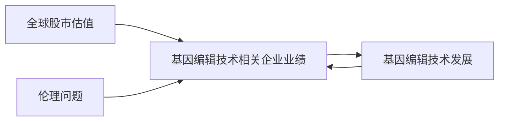

# 全球股市估值与基因编辑技术的伦理关系

> 关键词：全球股市估值、基因编辑技术、伦理关系、金融市场影响、生物技术发展

> 摘要：本文深入探讨了全球股市估值与基因编辑技术伦理之间的复杂关系。首先介绍了研究的背景、目的、预期读者等内容，接着阐述了核心概念及其联系，分析了相关算法原理与操作步骤，给出了数学模型和公式。通过项目实战案例，详细解释了代码实现和解读。探讨了实际应用场景，推荐了学习资源、开发工具框架以及相关论文著作。最后总结了未来发展趋势与挑战，并对常见问题进行了解答。旨在揭示基因编辑技术伦理问题如何影响全球股市估值，以及金融市场对基因编辑技术发展的反馈，为投资者、科研人员和政策制定者提供有价值的参考。

## 1. 背景介绍 
### 1.1 目的和范围
本研究的目的在于全面剖析全球股市估值与基因编辑技术伦理之间的内在联系。随着基因编辑技术的飞速发展，其在生物医学、农业等领域展现出巨大的应用潜力，同时也引发了一系列伦理争议。这些伦理问题不仅影响着基因编辑技术的研发和应用进程，还可能对相关企业的市场表现产生重大影响，进而波及全球股市估值。本研究将涵盖全球主要股票市场，聚焦于基因编辑技术相关企业的股价波动、行业估值变化，以及伦理因素在其中所起的作用。

### 1.2 预期读者
本文的预期读者包括金融市场投资者、生物技术领域科研人员、政策制定者以及对科技与金融交叉领域感兴趣的学者。投资者可以从本文中获取关于基因编辑技术相关股票投资的风险和机会信息；科研人员能够了解伦理问题对技术发展和市场接受度的影响；政策制定者可以依据研究结果制定合理的监管政策；学者则可将本文作为进一步研究的参考。

### 1.3 文档结构概述
本文首先介绍了研究的背景信息，包括目的、预期读者和文档结构。接着阐述了全球股市估值和基因编辑技术伦理的核心概念及其联系，通过示意图和流程图进行直观展示。然后详细讲解了相关的核心算法原理和具体操作步骤，给出了Python源代码示例。之后介绍了数学模型和公式，并通过举例进行说明。在项目实战部分，提供了开发环境搭建的指导，详细解读了源代码。随后探讨了实际应用场景，推荐了相关的学习资源、开发工具框架和论文著作。最后总结了未来发展趋势与挑战，解答了常见问题，并列出了扩展阅读和参考资料。

### 1.4 术语表
#### 1.4.1 核心术语定义
- **全球股市估值**：指对全球范围内各个股票市场中上市公司的价值进行评估，通常通过股价、市盈率、市净率等指标来衡量。
- **基因编辑技术**：是一种能够对生物体基因组特定目标基因进行修饰的技术，如CRISPR - Cas9技术。
- **伦理关系**：指基因编辑技术在研发、应用过程中所涉及的道德和伦理问题，以及这些问题与其他领域（如金融市场）之间的相互作用。

#### 1.4.2 相关概念解释
- **基因编辑技术的伦理争议**：包括人类胚胎基因编辑的道德性、基因编辑可能导致的生物多样性破坏、基因歧视等问题。
- **股市估值的影响因素**：除了公司的基本面因素（如盈利能力、资产质量等）外，还包括宏观经济环境、政策法规、市场情绪等因素。基因编辑技术的伦理问题可能通过影响相关企业的形象、研发进程和市场预期，进而影响股市估值。

#### 1.4.3 缩略词列表
- **CRISPR**：Clustered Regularly Interspaced Short Palindromic Repeats，成簇的规律间隔的短回文重复序列。
- **Cas9**：CRISPR - associated protein 9，CRISPR相关蛋白9。

## 2. 核心概念与联系 
### 核心概念原理
#### 全球股市估值原理
全球股市估值是基于市场参与者对上市公司未来盈利能力和现金流的预期。投资者通过分析公司的财务报表、行业前景、宏观经济环境等因素，对股票的价值进行评估。常见的估值方法包括市盈率法（$P/E$）、市净率法（$P/B$）、现金流折现法（DCF）等。

市盈率法是将股票价格除以每股收益，反映了投资者为获取每一元收益所愿意支付的价格。市净率法是将股票价格除以每股净资产，衡量了股票价格相对于公司净资产的倍数。现金流折现法是将公司未来的现金流按照一定的折现率折现到当前，计算出公司的内在价值。

#### 基因编辑技术原理
基因编辑技术主要是通过对生物体基因组中的特定DNA序列进行切割、插入、删除或替换，从而实现对基因功能的调控。以CRISPR - Cas9技术为例，它利用CRISPR序列产生的向导RNA（gRNA）引导Cas9蛋白到特定的DNA靶点，然后Cas9蛋白对DNA进行切割，细胞自身的DNA修复机制会对切割位点进行修复，从而实现基因编辑。

### 核心概念联系
基因编辑技术的发展和应用对相关企业的市场表现产生重要影响，进而影响全球股市估值。一方面，基因编辑技术的突破可能为企业带来巨大的商业机会，提高其盈利能力和市场竞争力，从而推动股价上涨，提升行业估值。例如，某公司成功研发出一种基于基因编辑技术的新型癌症治疗方法，可能会吸引大量投资者的关注，其股价可能会大幅上涨。

另一方面，基因编辑技术的伦理问题可能会引发社会争议和监管压力，影响企业的研发进程和市场预期，导致股价下跌，降低行业估值。例如，若某企业进行了有争议的人类胚胎基因编辑实验，可能会受到社会舆论的谴责和政府的监管限制，其股价可能会受到负面影响。

### 文本示意图
```plaintext
全球股市估值 <-- 基因编辑技术相关企业业绩 --> 基因编辑技术发展
                            |
                            v
                     伦理问题影响
```

### Mermaid流程图


## 3. 核心算法原理 & 具体操作步骤 
### 算法原理
为了分析基因编辑技术伦理问题对全球股市估值的影响，我们可以采用事件研究法。事件研究法是一种衡量某一特定事件对公司股价影响的统计方法。其基本原理是，在事件发生前后，观察公司股价的异常波动情况，通过计算异常收益率来评估事件的影响程度。

异常收益率（AR）是指实际收益率与正常收益率之间的差值。正常收益率可以通过市场模型来估计，市场模型假设股票收益率与市场收益率之间存在线性关系：

$R_{it}=\alpha_{i}+\beta_{i}R_{mt}+\epsilon_{it}$

其中，$R_{it}$ 是股票 $i$ 在 $t$ 时刻的收益率，$R_{mt}$ 是市场在 $t$ 时刻的收益率，$\alpha_{i}$ 和 $\beta_{i}$ 是待估计的参数，$\epsilon_{it}$ 是误差项。

异常收益率 $AR_{it}$ 可以表示为：

$AR_{it}=R_{it}-\hat{R}_{it}$

其中，$\hat{R}_{it}=\hat{\alpha}_{i}+\hat{\beta}_{i}R_{mt}$ 是根据市场模型估计的正常收益率。

累计异常收益率（CAR）是在事件窗口期内异常收益率的累加：

$CAR_{i}(t_{1},t_{2})=\sum_{t = t_{1}}^{t_{2}}AR_{it}$

### 具体操作步骤
#### 步骤1：数据收集
收集基因编辑技术相关企业的股票价格数据、市场指数数据（如标普500指数）以及基因编辑技术伦理事件的相关信息。

#### 步骤2：估计市场模型参数
选择一个估计窗口期（如事件发生前的一段时间），使用线性回归方法估计市场模型中的参数 $\alpha_{i}$ 和 $\beta_{i}$。

#### 步骤3：计算异常收益率
在事件窗口期内，根据估计的市场模型参数计算每只股票的异常收益率。

#### 步骤4：计算累计异常收益率
对异常收益率进行累加，得到累计异常收益率。

#### 步骤5：统计检验
使用 $t$ 检验等统计方法检验累计异常收益率是否显著不为零，以判断伦理事件是否对股价产生了显著影响。

### Python源代码实现
```python
import pandas as pd
import numpy as np
import statsmodels.api as sm
from scipy import stats

# 步骤1：数据收集
# 假设我们已经有了股票价格数据和市场指数数据
# 股票价格数据存储在一个DataFrame中，列名为 'stock_price'
# 市场指数数据存储在一个DataFrame中，列名为 'market_index'
# 事件发生日期存储在变量 'event_date' 中
# 估计窗口期为事件发生前的200天，事件窗口期为事件发生前后各10天

# 读取数据
stock_data = pd.read_csv('stock_data.csv', index_col='date', parse_dates=True)
market_data = pd.read_csv('market_data.csv', index_col='date', parse_dates=True)

# 计算收益率
stock_returns = stock_data['stock_price'].pct_change()
market_returns = market_data['market_index'].pct_change()

# 步骤2：估计市场模型参数
estimation_window = 200
event_window = 10
event_date = pd.to_datetime('2023-01-01')

estimation_start = event_date - pd.Timedelta(days=estimation_window + event_window)
estimation_end = event_date - pd.Timedelta(days=event_window + 1)

estimation_stock_returns = stock_returns.loc[estimation_start:estimation_end].dropna()
estimation_market_returns = market_returns.loc[estimation_start:estimation_end].dropna()

X = sm.add_constant(estimation_market_returns)
model = sm.OLS(estimation_stock_returns, X)
results = model.fit()

alpha = results.params[0]
beta = results.params[1]

# 步骤3：计算异常收益率
event_start = event_date - pd.Timedelta(days=event_window)
event_end = event_date + pd.Timedelta(days=event_window)

event_stock_returns = stock_returns.loc[event_start:event_end].dropna()
event_market_returns = market_returns.loc[event_start:event_end].dropna()

normal_returns = alpha + beta * event_market_returns
abnormal_returns = event_stock_returns - normal_returns

# 步骤4：计算累计异常收益率
cumulative_abnormal_returns = abnormal_returns.cumsum()

# 步骤5：统计检验
t_stat, p_value = stats.ttest_1samp(cumulative_abnormal_returns, 0)

print(f'累计异常收益率: {cumulative_abnormal_returns}')
print(f't统计量: {t_stat}')
print(f'p值: {p_value}')
```

## 4. 数学模型和公式 & 详细讲解 & 举例说明 
### 市场模型
市场模型假设股票收益率与市场收益率之间存在线性关系，其数学表达式为：

$R_{it}=\alpha_{i}+\beta_{i}R_{mt}+\epsilon_{it}$

其中，$R_{it}$ 是股票 $i$ 在 $t$ 时刻的收益率，$R_{mt}$ 是市场在 $t$ 时刻的收益率，$\alpha_{i}$ 和 $\beta_{i}$ 是待估计的参数，$\epsilon_{it}$ 是误差项。

$\alpha_{i}$ 表示股票 $i$ 的超额收益率，即当市场收益率为零时，股票 $i$ 的预期收益率。$\beta_{i}$ 表示股票 $i$ 的系统性风险，即股票 $i$ 的收益率对市场收益率变化的敏感程度。

### 异常收益率
异常收益率（AR）是指实际收益率与正常收益率之间的差值，其数学表达式为：

$AR_{it}=R_{it}-\hat{R}_{it}$

其中，$\hat{R}_{it}=\hat{\alpha}_{i}+\hat{\beta}_{i}R_{mt}$ 是根据市场模型估计的正常收益率。

异常收益率反映了事件对股票收益率的影响。如果异常收益率显著不为零，则说明事件对股票价格产生了显著影响。

### 累计异常收益率
累计异常收益率（CAR）是在事件窗口期内异常收益率的累加，其数学表达式为：

$CAR_{i}(t_{1},t_{2})=\sum_{t = t_{1}}^{t_{2}}AR_{it}$

累计异常收益率可以衡量事件在整个事件窗口期内对股票价格的综合影响。

### 举例说明
假设我们要分析某基因编辑技术企业在发生一起伦理争议事件前后的股价表现。我们收集了该企业的股票价格数据和市场指数数据，估计窗口期为事件发生前的200天，事件窗口期为事件发生前后各10天。

通过线性回归方法估计市场模型参数，得到 $\hat{\alpha}=0.001$，$\hat{\beta}=1.2$。在事件窗口期内，某一天的市场收益率为 $R_{mt}=0.01$，该企业的实际收益率为 $R_{it}=0.015$。

则正常收益率为：

$\hat{R}_{it}=\hat{\alpha}+\hat{\beta}R_{mt}=0.001 + 1.2\times0.01 = 0.013$

异常收益率为：

$AR_{it}=R_{it}-\hat{R}_{it}=0.015 - 0.013 = 0.002$

假设在事件窗口期内共有20天，每天的异常收益率分别为 $AR_{1}, AR_{2}, \cdots, AR_{20}$，则累计异常收益率为：

$CAR=\sum_{t = 1}^{20}AR_{t}$

通过计算累计异常收益率，并进行统计检验，我们可以判断该伦理争议事件是否对该企业的股价产生了显著影响。

## 5. 项目实战：代码实际案例和详细解释说明 
### 5.1  开发环境搭建
#### 安装Python
首先需要安装Python，建议使用Python 3.7及以上版本。可以从Python官方网站（https://www.python.org/downloads/）下载并安装适合自己操作系统的Python版本。

#### 安装必要的库
在项目中，我们使用了 `pandas`、`numpy`、`statsmodels` 和 `scipy` 等库。可以使用 `pip` 命令进行安装：

```sh
pip install pandas numpy statsmodels scipy
```

#### 准备数据
需要准备基因编辑技术相关企业的股票价格数据和市场指数数据。可以从金融数据提供商（如雅虎财经、万得等）获取数据，并将其保存为CSV文件。

### 5.2  源代码详细实现和代码解读
```python
import pandas as pd
import numpy as np
import statsmodels.api as sm
from scipy import stats

# 步骤1：数据收集
# 读取数据
stock_data = pd.read_csv('stock_data.csv', index_col='date', parse_dates=True)
market_data = pd.read_csv('market_data.csv', index_col='date', parse_dates=True)

# 计算收益率
stock_returns = stock_data['stock_price'].pct_change()
market_returns = market_data['market_index'].pct_change()

# 步骤2：估计市场模型参数
estimation_window = 200
event_window = 10
event_date = pd.to_datetime('2023-01-01')

estimation_start = event_date - pd.Timedelta(days=estimation_window + event_window)
estimation_end = event_date - pd.Timedelta(days=event_window + 1)

estimation_stock_returns = stock_returns.loc[estimation_start:estimation_end].dropna()
estimation_market_returns = market_returns.loc[estimation_start:estimation_end].dropna()

X = sm.add_constant(estimation_market_returns)
model = sm.OLS(estimation_stock_returns, X)
results = model.fit()

alpha = results.params[0]
beta = results.params[1]

# 步骤3：计算异常收益率
event_start = event_date - pd.Timedelta(days=event_window)
event_end = event_date + pd.Timedelta(days=event_window)

event_stock_returns = stock_returns.loc[event_start:event_end].dropna()
event_market_returns = market_returns.loc[event_start:event_end].dropna()

normal_returns = alpha + beta * event_market_returns
abnormal_returns = event_stock_returns - normal_returns

# 步骤4：计算累计异常收益率
cumulative_abnormal_returns = abnormal_returns.cumsum()

# 步骤5：统计检验
t_stat, p_value = stats.ttest_1samp(cumulative_abnormal_returns, 0)

print(f'累计异常收益率: {cumulative_abnormal_returns}')
print(f't统计量: {t_stat}')
print(f'p值: {p_value}')
```

### 代码解读与分析
#### 数据收集部分
```python
stock_data = pd.read_csv('stock_data.csv', index_col='date', parse_dates=True)
market_data = pd.read_csv('market_data.csv', index_col='date', parse_dates=True)

stock_returns = stock_data['stock_price'].pct_change()
market_returns = market_data['market_index'].pct_change()
```
这部分代码使用 `pandas` 库读取股票价格数据和市场指数数据，并计算它们的收益率。

#### 市场模型参数估计部分
```python
estimation_window = 200
event_window = 10
event_date = pd.to_datetime('2023-01-01')

estimation_start = event_date - pd.Timedelta(days=estimation_window + event_window)
estimation_end = event_date - pd.Timedelta(days=event_window + 1)

estimation_stock_returns = stock_returns.loc[estimation_start:estimation_end].dropna()
estimation_market_returns = market_returns.loc[estimation_start:estimation_end].dropna()

X = sm.add_constant(estimation_market_returns)
model = sm.OLS(estimation_stock_returns, X)
results = model.fit()

alpha = results.params[0]
beta = results.params[1]
```
这部分代码确定了估计窗口期和事件窗口期，选择估计窗口期内的数据进行线性回归，估计市场模型的参数 $\alpha$ 和 $\beta$。

#### 异常收益率计算部分
```python
event_start = event_date - pd.Timedelta(days=event_window)
event_end = event_date + pd.Timedelta(days=event_window)

event_stock_returns = stock_returns.loc[event_start:event_end].dropna()
event_market_returns = market_returns.loc[event_start:event_end].dropna()

normal_returns = alpha + beta * event_market_returns
abnormal_returns = event_stock_returns - normal_returns
```
这部分代码确定了事件窗口期，计算事件窗口期内的正常收益率和异常收益率。

#### 累计异常收益率计算部分
```python
cumulative_abnormal_returns = abnormal_returns.cumsum()
```
这部分代码对异常收益率进行累加，得到累计异常收益率。

#### 统计检验部分
```python
t_stat, p_value = stats.ttest_1samp(cumulative_abnormal_returns, 0)

print(f'累计异常收益率: {cumulative_abnormal_returns}')
print(f't统计量: {t_stat}')
print(f'p值: {p_value}')
```
这部分代码使用 `scipy` 库的 `ttest_1samp` 函数进行 $t$ 检验，判断累计异常收益率是否显著不为零。

## 6. 实际应用场景 
### 投资决策
投资者可以利用本文的研究方法和结论，在投资基因编辑技术相关企业的股票时，充分考虑伦理因素对股价的影响。当企业发生伦理争议事件时，通过分析累计异常收益率等指标，判断事件对股价的影响程度，从而做出合理的投资决策。例如，如果累计异常收益率显著为负，说明伦理事件对股价产生了负面影响，投资者可以考虑减持或卖出相关股票。

### 企业战略规划
基因编辑技术相关企业在制定战略规划时，需要重视伦理问题。企业应该加强伦理管理，避免发生伦理争议事件，以维护企业的形象和市场声誉。同时，企业可以通过积极参与伦理讨论和制定伦理准则，提高社会对基因编辑技术的接受度，为企业的发展创造良好的外部环境。

### 政策制定
政策制定者可以根据基因编辑技术伦理问题对股市估值的影响，制定相应的监管政策。一方面，要鼓励基因编辑技术的创新和发展，为相关企业提供良好的政策支持；另一方面，要加强对基因编辑技术的伦理监管，规范企业的研发和应用行为，保障公众的利益和社会的安全。

## 7. 工具和资源推荐
### 7.1 学习资源推荐
#### 7.1.1 书籍推荐
- 《金融市场学》：全面介绍了金融市场的基本概念、理论和实践，有助于读者了解股市估值的基本原理。
- 《基因编辑：改变未来的生物技术》：详细介绍了基因编辑技术的发展历程、原理和应用，以及相关的伦理问题。

#### 7.1.2 在线课程
- Coursera上的“金融市场分析”课程：提供了金融市场分析的方法和工具，包括股市估值的相关内容。
- edX上的“基因编辑技术前沿”课程：介绍了基因编辑技术的最新进展和应用，以及伦理和法律问题。

#### 7.1.3 技术博客和网站
- Seeking Alpha：提供了金融市场的分析和评论，包括对基因编辑技术相关企业的研究报告。
- Nature Biotechnology：发表了基因编辑技术领域的最新研究成果和伦理讨论文章。

### 7.2 开发工具框架推荐
#### 7.2.1 IDE和编辑器
- PyCharm：一款专业的Python集成开发环境，提供了丰富的代码编辑、调试和分析功能。
- Jupyter Notebook：一种交互式的开发环境，适合进行数据分析和模型验证。

#### 7.2.2 调试和性能分析工具
- PDB：Python自带的调试器，可以帮助开发者定位和解决代码中的问题。
- cProfile：Python的性能分析工具，可以分析代码的运行时间和资源消耗情况。

#### 7.2.3 相关框架和库
- Pandas：用于数据处理和分析的Python库，提供了丰富的数据结构和函数。
- Numpy：用于科学计算的Python库，提供了高效的数组操作和数学函数。
- Statsmodels：用于统计建模和数据分析的Python库，提供了线性回归、时间序列分析等功能。

### 7.3 相关论文著作推荐
#### 7.3.1 经典论文
- Fama, E. F., & French, K. R. (1993). Common risk factors in the returns on stocks and bonds. Journal of Financial Economics, 33(1), 3-56. 该论文提出了Fama - French三因子模型，对股市估值和资产定价理论产生了重要影响。
- Doudna, J. A., & Charpentier, E. (2014). Genome editing. The new frontier of genome engineering with CRISPR - Cas9. Science, 346(6213), 1258096. 该论文介绍了CRISPR - Cas9基因编辑技术的原理和应用，是基因编辑技术领域的经典文献。

#### 7.3.2 最新研究成果
- 关注Nature、Science、Cell等顶级学术期刊上发表的关于基因编辑技术伦理和金融市场影响的研究论文，了解最新的研究动态。

#### 7.3.3 应用案例分析
- 分析基因编辑技术相关企业的实际案例，如CRISPR Therapeutics、Editas Medicine等公司在研发、应用和市场表现方面的情况，了解伦理问题对企业的具体影响。

## 8. 总结：未来发展趋势与挑战
### 未来发展趋势
- **技术创新推动**：基因编辑技术将不断创新和发展，新的编辑工具和方法将不断涌现，为相关企业带来更多的商业机会，从而对全球股市估值产生积极影响。
- **伦理规范加强**：随着社会对基因编辑技术伦理问题的关注度不断提高，相关的伦理规范和监管政策将不断完善，有助于减少伦理争议事件的发生，稳定市场预期。
- **跨领域融合加深**：基因编辑技术将与金融、医疗、农业等领域深度融合，形成新的产业模式和商业模式，进一步拓展市场空间。

### 挑战
- **伦理争议持续**：基因编辑技术的伦理问题将长期存在，不同利益群体之间的观点分歧可能导致伦理争议不断，给企业和市场带来不确定性。
- **监管难度增大**：基因编辑技术的发展速度较快，监管政策的制定和实施可能滞后于技术的发展，增加了监管的难度。
- **市场波动加剧**：基因编辑技术相关企业的股价可能受到技术突破、伦理事件等多种因素的影响，市场波动加剧，增加了投资者的风险。

## 9. 附录：常见问题与解答
### 问题1：基因编辑技术的伦理问题主要有哪些？
基因编辑技术的伦理问题主要包括人类胚胎基因编辑的道德性、基因编辑可能导致的生物多样性破坏、基因歧视、隐私保护等问题。

### 问题2：如何判断伦理事件对股价的影响是否显著？
可以通过计算累计异常收益率，并进行统计检验（如 $t$ 检验）来判断伦理事件对股价的影响是否显著。如果累计异常收益率显著不为零，且 $p$ 值小于设定的显著性水平（如0.05），则说明伦理事件对股价产生了显著影响。

### 问题3：基因编辑技术相关企业应该如何应对伦理问题？
基因编辑技术相关企业应该加强伦理管理，建立健全伦理审查机制，确保研发和应用活动符合伦理规范。同时，企业应该积极参与伦理讨论和制定伦理准则，提高社会对基因编辑技术的接受度。

## 10. 扩展阅读 & 参考资料
### 扩展阅读
- 《基因伦理学》：深入探讨了基因技术带来的伦理问题和挑战。
- 《金融科技前沿》：介绍了金融科技领域的最新发展和应用，包括金融与生物技术的融合。

### 参考资料
- 雅虎财经、万得等金融数据提供商的网站。
- Nature、Science、Cell等学术期刊的官方网站。

作者：AI天才研究院/AI Genius Institute & 禅与计算机程序设计艺术 /Zen And The Art of Computer Programming