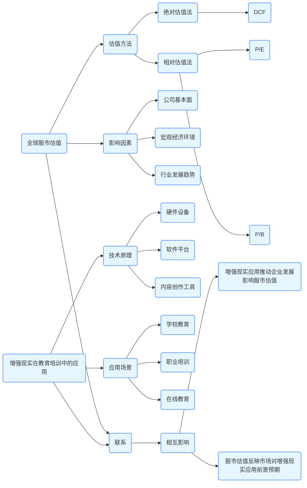

# 全球股市估值与增强现实在教育培训中的应用

> 关键词：全球股市估值、增强现实、教育培训、应用场景、投资分析

> 摘要：本文深入探讨了两个看似不相关但又在数字化时代有着潜在联系的领域，即全球股市估值和增强现实在教育培训中的应用。首先对全球股市估值的基本概念、常用方法以及影响因素进行了详细分析，同时介绍了增强现实技术的原理和特点。接着阐述了增强现实在教育培训领域的具体应用场景和优势，探讨了其对教育模式的革新作用。最后分析了全球股市中增强现实相关企业的估值情况，以及增强现实在教育培训领域应用所带来的投资机会和挑战，旨在为投资者、教育从业者和技术爱好者提供全面的信息和深入的思考。

## 1. 背景介绍 
### 1.1 目的和范围
本文的目的在于全面且深入地研究全球股市估值的方法、影响因素以及当前的市场状况，同时详细探讨增强现实技术在教育培训领域的应用场景、优势和发展趋势。通过将这两个领域结合起来分析，揭示增强现实相关企业在全球股市中的估值特点和投资价值，为投资者、教育工作者和技术爱好者提供有价值的参考。范围涵盖了全球主要股票市场的估值分析，以及增强现实技术在各类教育培训场景中的应用案例和实践经验。

### 1.2 预期读者
本文预期读者包括金融投资者，他们希望通过了解全球股市估值方法和增强现实行业的发展趋势，寻找有潜力的投资机会；教育从业者，他们关注新兴技术在教育领域的应用，希望借助增强现实技术提升教学效果和创新教育模式；技术爱好者，他们对增强现实技术的发展和应用前景感兴趣，希望深入了解其在不同领域的具体实践；以及研究人员，他们可以从本文中获取相关领域的研究资料和案例，为进一步的学术研究提供参考。

### 1.3 文档结构概述
本文将按照以下结构展开：首先介绍核心概念，包括全球股市估值和增强现实的基本定义和原理；然后详细阐述全球股市估值的算法原理和具体操作步骤，以及增强现实技术的实现原理和关键技术；接着通过数学模型和公式对全球股市估值进行分析，并举例说明；之后展示增强现实在教育培训中的实际应用案例，并进行详细解释；再探讨增强现实在教育培训领域的实际应用场景；推荐相关的学习资源、开发工具和论文著作；最后总结全球股市中增强现实相关企业的发展趋势和面临的挑战，并对常见问题进行解答，同时提供扩展阅读和参考资料。

### 1.4 术语表
#### 1.4.1 核心术语定义
- **全球股市估值**：指对全球范围内各个股票市场上的上市公司进行价值评估的过程和方法，通过分析公司的财务状况、盈利能力、市场前景等因素，确定其股票的合理价格。
- **增强现实（Augmented Reality，AR）**：是一种将虚拟信息与真实世界场景融合的技术，通过计算机图形技术和传感器技术，将虚拟的图像、视频、音频等信息叠加到现实环境中，使用户能够获得更加丰富和交互性的体验。
- **市盈率（Price - Earnings Ratio，P/E）**：是指股票价格除以每股收益（EPS）的比率，反映了投资者为获取公司每一元盈利所愿意支付的价格，是衡量股票估值的常用指标之一。
- **市净率（Price - to - Book Ratio，P/B）**：是指股票价格与每股净资产的比率，用于评估公司的市场价值与账面价值之间的关系，反映了投资者对公司资产质量和盈利能力的预期。

#### 1.4.2 相关概念解释
- **股票市场**：是股票发行和交易的场所，包括一级市场（发行市场）和二级市场（交易市场）。在股票市场中，投资者通过买卖股票来获取资本收益和股息收入。
- **财务报表分析**：是对公司财务报表（如资产负债表、利润表、现金流量表）进行分析的过程，通过计算各种财务比率和指标，评估公司的财务状况、盈利能力、偿债能力和运营效率。
- **虚拟现实（Virtual Reality，VR）**：是一种创建和体验虚拟世界的计算机技术，用户通过佩戴头戴式显示器等设备，完全沉浸在虚拟环境中，与虚拟场景进行交互。与增强现实不同，虚拟现实创造的是一个完全虚拟的世界，而增强现实是将虚拟信息与现实世界相结合。

#### 1.4.3 缩略词列表
- **AR**：Augmented Reality（增强现实）
- **VR**：Virtual Reality（虚拟现实）
- **P/E**：Price - Earnings Ratio（市盈率）
- **P/B**：Price - to - Book Ratio（市净率）
- **EPS**：Earnings Per Share（每股收益）

## 2. 核心概念与联系 
### 全球股市估值
全球股市估值是金融领域的重要课题，它对于投资者做出投资决策、评估市场风险具有重要意义。其核心目标是确定上市公司股票的内在价值，从而判断股票价格是否合理。常见的估值方法包括绝对估值法和相对估值法。绝对估值法主要有现金流贴现模型（DCF），该模型基于公司未来的现金流预测，通过一定的贴现率将未来现金流折现到当前，从而得到公司的内在价值。相对估值法包括市盈率法、市净率法等，通过与同行业其他公司或市场平均水平进行比较，来评估公司的估值水平。

### 增强现实（AR）技术
增强现实技术是一种将虚拟信息与现实世界相结合的技术。它通过摄像头、传感器等设备捕捉现实场景，然后利用计算机图形技术将虚拟的图像、视频、文字等信息叠加到现实场景中，使用户能够在现实环境中看到并与虚拟信息进行交互。增强现实技术的核心组成部分包括硬件设备（如AR眼镜、智能手机等）、软件平台（用于开发AR应用程序）和内容创作工具（用于创建虚拟信息）。

### 两者的联系
随着科技的不断发展，增强现实技术在各个领域的应用越来越广泛，其中教育培训领域是一个重要的应用场景。增强现实技术在教育培训中的应用可以提升教学效果、创新教学模式，为教育行业带来新的发展机遇。这也使得与增强现实相关的企业在全球股市中受到关注，其股票估值受到市场对增强现实技术发展前景和应用潜力的影响。投资者会根据增强现实技术在教育培训等领域的应用情况，对相关企业的未来盈利能力和市场价值进行评估，从而影响这些企业在股市中的估值。

### 文本示意图
```plaintext
全球股市估值
|-- 估值方法
|   |-- 绝对估值法（如DCF）
|   |-- 相对估值法（如P/E、P/B）
|-- 影响因素
|   |-- 公司基本面
|   |-- 宏观经济环境
|   |-- 行业发展趋势

增强现实在教育培训中的应用
|-- 技术原理
|   |-- 硬件设备
|   |-- 软件平台
|   |-- 内容创作工具
|-- 应用场景
|   |-- 学校教育
|   |-- 职业培训
|   |-- 在线教育

联系
全球股市估值与增强现实在教育培训中的应用相互影响，增强现实应用推动相关企业发展，影响股市估值；股市估值反映市场对增强现实应用前景的预期
```

### Mermaid流程图


## 3. 核心算法原理 & 具体操作步骤 
### 全球股市估值算法原理及Python实现
#### 市盈率法（P/E）
市盈率法是一种常用的相对估值方法，其原理是通过比较目标公司的市盈率与同行业其他公司或市场平均市盈率，来评估目标公司的估值水平。计算公式为：
$$P = EPS \times P/E$$
其中，$P$ 为股票价格，$EPS$ 为每股收益，$P/E$ 为市盈率。

以下是使用Python实现市盈率法估值的示例代码：
```python
def pe_valuation(eps, pe_ratio):
    """
    使用市盈率法计算股票价格
    :param eps: 每股收益
    :param pe_ratio: 市盈率
    :return: 股票价格
    """
    price = eps * pe_ratio
    return price

# 示例数据
eps = 2.5  # 每股收益
pe_ratio = 15  # 市盈率

# 计算股票价格
stock_price = pe_valuation(eps, pe_ratio)
print(f"使用市盈率法计算的股票价格为: {stock_price}")
```
#### 现金流贴现模型（DCF）
现金流贴现模型是一种绝对估值方法，其原理是将公司未来的现金流按照一定的贴现率折现到当前，从而得到公司的内在价值。假设公司未来 $n$ 年的自由现金流分别为 $FCF_1, FCF_2, \cdots, FCF_n$，第 $n$ 年后的永续增长率为 $g$，贴现率为 $r$，则公司的内在价值 $V$ 计算公式为：
$$V = \sum_{i = 1}^{n} \frac{FCF_i}{(1 + r)^i} + \frac{FCF_n(1 + g)}{(r - g)(1 + r)^n}$$

以下是使用Python实现现金流贴现模型估值的示例代码：
```python
def dcf_valuation(fcf_list, r, g):
    """
    使用现金流贴现模型计算公司内在价值
    :param fcf_list: 未来n年的自由现金流列表
    :param r: 贴现率
    :param g: 永续增长率
    :return: 公司内在价值
    """
    n = len(fcf_list)
    present_value = 0
    # 计算前n年现金流的现值
    for i in range(n):
        present_value += fcf_list[i] / ((1 + r) ** (i + 1))
    # 计算第n年后永续现金流的现值
    terminal_value = fcf_list[-1] * (1 + g) / ((r - g) * ((1 + r) ** n))
    total_value = present_value + terminal_value
    return total_value

# 示例数据
fcf_list = [100, 120, 140, 160, 180]  # 未来5年的自由现金流
r = 0.1  # 贴现率
g = 0.03  # 永续增长率

# 计算公司内在价值
company_value = dcf_valuation(fcf_list, r, g)
print(f"使用现金流贴现模型计算的公司内在价值为: {company_value}")
```

### 增强现实技术实现原理及步骤
#### 原理
增强现实技术的实现主要基于计算机视觉、传感器技术和图形渲染技术。计算机视觉用于识别和跟踪现实场景中的物体和特征，传感器技术用于获取设备的位置、姿态等信息，图形渲染技术用于将虚拟信息准确地叠加到现实场景中。

#### 具体操作步骤
1. **数据采集**：使用摄像头等设备采集现实场景的图像或视频数据。
2. **特征提取**：对采集到的图像或视频数据进行处理，提取其中的特征点和特征描述符。
3. **目标识别与跟踪**：通过匹配特征点和特征描述符，识别现实场景中的目标物体，并跟踪其位置和姿态的变化。
4. **虚拟信息生成**：根据识别和跟踪的结果，生成相应的虚拟信息，如3D模型、动画等。
5. **虚拟信息叠加**：将生成的虚拟信息准确地叠加到现实场景中，并进行实时渲染，使用户能够看到融合后的场景。

以下是一个简单的Python示例代码，使用OpenCV库实现图像特征提取和匹配：
```python
import cv2
import numpy as np

# 读取图像
img1 = cv2.imread('image1.jpg', 0)
img2 = cv2.imread('image2.jpg', 0)

# 创建SIFT对象
sift = cv2.SIFT_create()

# 检测关键点和计算描述符
kp1, des1 = sift.detectAndCompute(img1, None)
kp2, des2 = sift.detectAndCompute(img2, None)

# 创建BFMatcher对象
bf = cv2.BFMatcher()

# 匹配描述符
matches = bf.knnMatch(des1, des2, k=2)

# 应用比率测试
good_matches = []
for m, n in matches:
    if m.distance < 0.75 * n.distance:
        good_matches.append(m)

# 绘制匹配结果
img3 = cv2.drawMatches(img1, kp1, img2, kp2, good_matches, None, flags=cv2.DrawMatchesFlags_NOT_DRAW_SINGLE_POINTS)

# 显示结果
cv2.imshow('Matches', img3)
cv2.waitKey(0)
cv2.destroyAllWindows()
```

## 4. 数学模型和公式 & 详细讲解 & 举例说明 
### 全球股市估值数学模型和公式
#### 市盈率法（P/E）
如前文所述，市盈率法的计算公式为 $P = EPS \times P/E$。市盈率反映了市场对公司盈利的预期，较高的市盈率通常意味着市场对公司的未来发展前景较为乐观，愿意为其每一元盈利支付较高的价格。

**举例说明**：假设公司A的每股收益为 $EPS = 3$ 元，同行业平均市盈率为 $P/E = 20$，则根据市盈率法计算，公司A的股票价格应为 $P = 3 \times 20 = 60$ 元。如果公司A的当前股票价格为50元，则说明该股票可能被低估，具有投资价值；反之，如果当前股票价格为70元，则可能被高估。

#### 市净率法（P/B）
市净率法的计算公式为 $P = BVPS \times P/B$，其中 $P$ 为股票价格，$BVPS$ 为每股净资产，$P/B$ 为市净率。市净率反映了公司的市场价值与账面价值之间的关系，较低的市净率通常意味着公司的股票价格相对其净资产较为便宜。

**举例说明**：假设公司B的每股净资产为 $BVPS = 10$ 元，同行业平均市净率为 $P/B = 1.5$，则根据市净率法计算，公司B的股票价格应为 $P = 10 \times 1.5 = 15$ 元。

#### 现金流贴现模型（DCF）
现金流贴现模型的计算公式为 $V = \sum_{i = 1}^{n} \frac{FCF_i}{(1 + r)^i} + \frac{FCF_n(1 + g)}{(r - g)(1 + r)^n}$。其中，$FCF_i$ 为第 $i$ 年的自由现金流，$r$ 为贴现率，$g$ 为永续增长率，$n$ 为预测期数。

**举例说明**：假设公司C未来5年的自由现金流分别为 $FCF_1 = 100$ 万元，$FCF_2 = 120$ 万元，$FCF_3 = 140$ 万元，$FCF_4 = 160$ 万元，$FCF_5 = 180$ 万元，贴现率 $r = 0.1$，永续增长率 $g = 0.03$。
首先计算前5年现金流的现值：
$PV_1 = \frac{100}{(1 + 0.1)^1} \approx 90.91$ 万元
$PV_2 = \frac{120}{(1 + 0.1)^2} \approx 99.17$ 万元
$PV_3 = \frac{140}{(1 + 0.1)^3} \approx 105.18$ 万元
$PV_4 = \frac{160}{(1 + 0.1)^4} \approx 109.29$ 万元
$PV_5 = \frac{180}{(1 + 0.1)^5} \approx 111.74$ 万元
前5年现金流现值之和为 $PV_{1 - 5} = 90.91 + 99.17 + 105.18 + 109.29 + 111.74 = 516.29$ 万元。
然后计算第5年后永续现金流的现值：
$TV = \frac{180(1 + 0.03)}{(0.1 - 0.03)(1 + 0.1)^5} \approx 1624.86$ 万元。
最后，公司C的内在价值 $V = 516.29 + 1624.86 = 2141.15$ 万元。

### 增强现实技术中的数学模型和公式
#### 坐标变换
在增强现实中，需要将虚拟物体的坐标转换到现实场景的坐标系中，这涉及到坐标变换。常用的坐标变换包括平移、旋转和缩放。假设一个点在虚拟坐标系中的坐标为 $(x_v, y_v, z_v)$，经过平移向量 $(t_x, t_y, t_z)$、旋转矩阵 $R$ 和缩放因子 $s$ 变换后，在现实坐标系中的坐标 $(x_r, y_r, z_r)$ 可以通过以下公式计算：
$$
\begin{bmatrix}
x_r \\
y_r \\
z_r
\end{bmatrix}
= sR
\begin{bmatrix}
x_v \\
y_v \\
z_v
\end{bmatrix}
+
\begin{bmatrix}
t_x \\
t_y \\
t_z
\end{bmatrix}
$$

**举例说明**：假设虚拟物体上有一个点的坐标为 $(1, 2, 3)$，平移向量为 $(0.5, 0.5, 0.5)$，旋转矩阵为
$$
R = 
\begin{bmatrix}
1 & 0 & 0 \\
0 & 1 & 0 \\
0 & 0 & 1
\end{bmatrix}
$$
缩放因子 $s = 2$。则该点在现实坐标系中的坐标为：
$$
\begin{bmatrix}
x_r \\
y_r \\
z_r
\end{bmatrix}
= 2
\begin{bmatrix}
1 & 0 & 0 \\
0 & 1 & 0 \\
0 & 0 & 1
\end{bmatrix}
\begin{bmatrix}
1 \\
2 \\
3
\end{bmatrix}
+
\begin{bmatrix}
0.5 \\
0.5 \\
0.5
\end{bmatrix}
=
\begin{bmatrix}
2 \\
4 \\
6
\end{bmatrix}
+
\begin{bmatrix}
0.5 \\
0.5 \\
0.5
\end{bmatrix}
=
\begin{bmatrix}
2.5 \\
4.5 \\
6.5
\end{bmatrix}
$$

## 5. 项目实战：代码实际案例和详细解释说明 
### 5.1  开发环境搭建
#### 全球股市估值项目
- **编程语言**：Python 3.x
- **开发环境**：可以选择使用 Anaconda 进行 Python 环境管理，它集成了许多常用的科学计算库。
- **所需库**：
    - `pandas`：用于数据处理和分析。
    - `numpy`：用于数值计算。
    - `matplotlib`：用于数据可视化。

安装所需库的命令如下：
```sh
pip install pandas numpy matplotlib
```

#### 增强现实在教育培训中的应用项目
- **开发平台**：Unity 3D 或 Unreal Engine，这两个平台都提供了丰富的工具和资源，用于开发增强现实应用程序。
- **编程语言**：C#（Unity 3D）或 C++（Unreal Engine）。
- **增强现实开发套件**：Vuforia 或 ARKit（iOS）、ARCore（Android），用于实现增强现实的识别和跟踪功能。

### 5.2  源代码详细实现和代码解读
#### 全球股市估值项目
以下是一个简单的全球股市估值项目示例，使用市盈率法对多只股票进行估值，并绘制估值结果的柱状图。
```python
import pandas as pd
import numpy as np
import matplotlib.pyplot as plt

# 示例数据：股票名称、每股收益和市盈率
data = {
    'Stock Name': ['Company A', 'Company B', 'Company C', 'Company D'],
    'EPS': [2.5, 3.0, 1.8, 2.2],
    'P/E Ratio': [15, 20, 12, 18]
}

# 创建 DataFrame
df = pd.DataFrame(data)

# 计算股票价格
df['Stock Price'] = df['EPS'] * df['P/E Ratio']

# 打印结果
print(df)

# 绘制柱状图
plt.bar(df['Stock Name'], df['Stock Price'])
plt.xlabel('Stock Name')
plt.ylabel('Stock Price')
plt.title('Stock Valuation using P/E Ratio')
plt.show()
```
**代码解读**：
1. **数据定义**：使用字典 `data` 定义了股票名称、每股收益和市盈率的数据。
2. **创建 DataFrame**：使用 `pandas` 的 `DataFrame` 函数将字典数据转换为 DataFrame 对象，方便进行数据处理和分析。
3. **计算股票价格**：通过 `df['Stock Price'] = df['EPS'] * df['P/E Ratio']` 计算每只股票的价格。
4. **打印结果**：使用 `print(df)` 打印包含股票价格的 DataFrame。
5. **绘制柱状图**：使用 `matplotlib` 的 `bar` 函数绘制股票价格的柱状图，直观展示估值结果。

#### 增强现实在教育培训中的应用项目（Unity 3D + Vuforia）
以下是一个简单的 Unity 3D 项目示例，使用 Vuforia 实现图像识别和虚拟模型展示。

**步骤 1：创建 Unity 项目**
打开 Unity 3D，创建一个新的 3D 项目。

**步骤 2：导入 Vuforia 开发套件**
在 Unity 资源商店中搜索 Vuforia，下载并导入 Vuforia 开发套件。

**步骤 3：配置 Vuforia**
在 Unity 中打开 Vuforia Configuration，输入 Vuforia 开发者账号的许可证密钥。

**步骤 4：创建图像目标**
在 Vuforia 开发者门户中创建一个新的图像数据库，并上传要识别的图像。然后在 Unity 中导入该图像数据库。

**步骤 5：创建虚拟模型**
在 Unity 中创建一个 3D 模型，例如一个立方体。

**步骤 6：编写脚本**
创建一个新的 C# 脚本，例如 `ARObjectDisplay.cs`，并编写以下代码：
```csharp
using UnityEngine;
using Vuforia;

public class ARObjectDisplay : MonoBehaviour, ITrackableEventHandler
{
    private TrackableBehaviour mTrackableBehaviour;
    public GameObject arObject;

    void Start()
    {
        mTrackableBehaviour = GetComponent<TrackableBehaviour>();
        if (mTrackableBehaviour)
        {
            mTrackableBehaviour.RegisterTrackableEventHandler(this);
        }
        arObject.SetActive(false);
    }

    public void OnTrackableStateChanged(
        TrackableBehaviour.Status previousStatus,
        TrackableBehaviour.Status newStatus)
    {
        if (newStatus == TrackableBehaviour.Status.DETECTED ||
            newStatus == TrackableBehaviour.Status.TRACKED ||
            newStatus == TrackableBehaviour.Status.EXTENDED_TRACKED)
        {
            arObject.SetActive(true);
        }
        else
        {
            arObject.SetActive(false);
        }
    }
}
```
**代码解读**：
1. **脚本继承**：脚本继承自 `MonoBehaviour` 和 `ITrackableEventHandler`，用于处理图像目标的跟踪事件。
2. **初始化**：在 `Start` 方法中，获取 `TrackableBehaviour` 组件，并注册跟踪事件处理程序。同时，将虚拟模型设置为不激活状态。
3. **跟踪状态改变处理**：在 `OnTrackableStateChanged` 方法中，根据图像目标的跟踪状态，激活或停用虚拟模型。当图像目标被检测到或跟踪到时，激活虚拟模型；否则，停用虚拟模型。

### 5.3  代码解读与分析
#### 全球股市估值项目
该项目的代码实现了使用市盈率法对多只股票进行估值，并将估值结果可视化的功能。通过使用 `pandas` 进行数据处理和 `matplotlib` 进行数据可视化，代码简洁易懂，方便进行扩展和修改。例如，可以添加更多的股票数据，或者使用其他估值方法进行计算。

#### 增强现实在教育培训中的应用项目
该项目的代码实现了使用 Vuforia 进行图像识别和虚拟模型展示的功能。通过注册跟踪事件处理程序，当检测到指定的图像目标时，显示相应的虚拟模型。这种方式可以用于教育培训场景，例如在教材上添加图像目标，当学生使用手机扫描教材时，显示相关的虚拟模型，增强学习效果。

## 6. 实际应用场景 
### 全球股市估值的应用场景
#### 投资决策
投资者可以通过对全球股市中不同公司的估值分析，判断股票价格是否合理，从而做出投资决策。例如，如果一只股票的估值被低估，投资者可以考虑买入；如果被高估，则可以考虑卖出或避免买入。
#### 风险管理
金融机构和投资者可以通过对股市整体估值水平的监测，评估市场风险。当市场整体估值过高时，可能存在泡沫破裂的风险；当估值过低时，可能存在投资机会。
#### 行业分析
通过对不同行业的估值比较，分析各行业的发展前景和竞争力。例如，新兴行业的估值可能较高，反映了市场对其未来增长的预期；传统行业的估值可能相对较低。

### 增强现实在教育培训中的应用场景
#### 学校教育
- **学科教学**：在物理、化学、生物等学科教学中，使用增强现实技术可以将抽象的概念和复杂的实验过程以直观的方式展示给学生。例如，在物理课上，通过增强现实展示物体的运动轨迹和力学原理；在化学课上，模拟化学反应的过程。
- **历史文化教育**：通过增强现实技术，学生可以身临其境地感受历史事件和文化遗产。例如，在参观博物馆时，使用手机扫描展品，即可看到相关的历史背景信息和虚拟的历史场景再现。
#### 职业培训
- **技能培训**：在一些需要实际操作技能的职业培训中，如机械维修、电工培训等，增强现实技术可以提供虚拟的操作场景和指导。学员可以在虚拟环境中进行反复练习，提高操作技能。
- **安全培训**：在建筑、化工等行业的安全培训中，增强现实技术可以模拟危险场景，让学员了解安全规范和应急处理方法。
#### 在线教育
- **互动学习**：增强现实技术可以为在线教育课程增加互动性和趣味性。例如，在在线英语课程中，通过增强现实展示单词的发音和用法，让学生更加直观地学习。
- **个性化学习**：根据学生的学习进度和需求，提供个性化的增强现实学习内容。例如，为学生推荐适合他们水平的虚拟实验和案例分析。

## 7. 工具和资源推荐
### 7.1 学习资源推荐
#### 7.1.1 书籍推荐
- 《证券分析》（Security Analysis）：本杰明·格雷厄姆（Benjamin Graham）和戴维·多德（David Dodd）著，被誉为价值投资的圣经，详细介绍了股票估值的方法和理论。
- 《增强现实：原理、技术与应用》：介绍了增强现实技术的基本原理、关键技术和应用案例，适合初学者和技术爱好者阅读。
- 《Python 金融数据分析实战》：帮助读者掌握使用 Python 进行金融数据处理、分析和建模的方法，对于全球股市估值分析非常有帮助。

#### 7.1.2 在线课程
- Coursera 上的“Financial Markets”：由耶鲁大学教授罗伯特·席勒（Robert Shiller）授课，介绍了金融市场的基本原理和投资策略。
- Udemy 上的“Augmented Reality Development with Unity and Vuforia”：详细讲解了使用 Unity 3D 和 Vuforia 开发增强现实应用程序的方法和技巧。
- edX 上的“Python for Data Science”：提供了 Python 在数据科学领域的应用教程，包括数据处理、分析和可视化等方面的内容。

#### 7.1.3 技术博客和网站
- Seeking Alpha：提供全球股市的分析和评论，以及上市公司的财务数据和估值分析。
- ARPost：专注于增强现实技术的新闻、趋势和应用案例，是了解增强现实行业动态的重要平台。
- Towards Data Science：发布数据科学和机器学习领域的技术文章和教程，对于学习金融数据分析和增强现实技术的算法实现有很大帮助。

### 7.2 开发工具框架推荐
#### 7.2.1 IDE和编辑器
- PyCharm：是一款专门为 Python 开发设计的集成开发环境，提供了丰富的代码编辑、调试和分析功能，适合全球股市估值项目的开发。
- Visual Studio Code：是一款轻量级的代码编辑器，支持多种编程语言，具有丰富的插件生态系统，可用于增强现实应用程序的开发。
- Unity Hub：用于管理 Unity 3D 项目和版本，集成了 Unity 3D 编辑器，是开发增强现实应用程序的主要工具之一。

#### 7.2.2 调试和性能分析工具
- pdb：Python 自带的调试工具，可用于调试 Python 代码，定位和解决代码中的问题。
- Unity Profiler：Unity 3D 自带的性能分析工具，可用于分析增强现实应用程序的性能瓶颈，优化程序性能。
- Android Studio Profiler：用于分析 Android 应用程序的性能，可帮助开发者优化增强现实应用在 Android 设备上的性能。

#### 7.2.3 相关框架和库
- Pandas：是 Python 中用于数据处理和分析的重要库，提供了高效的数据结构和数据操作方法，适合全球股市估值项目中的数据处理。
- Numpy：是 Python 中用于数值计算的基础库，提供了高效的数组操作和数学函数，可用于金融数据分析和增强现实算法的实现。
- Vuforia：是一款专业的增强现实开发套件，提供了图像识别、目标跟踪等功能，支持多种平台和设备，广泛应用于增强现实应用程序的开发。

### 7.3 相关论文著作推荐
#### 7.3.1 经典论文
- “The Theory of Investment Value”：由约翰·伯尔·威廉姆斯（John Burr Williams）撰写，提出了现金流贴现模型的基本思想，是股票估值理论的重要文献。
- “Augmented Reality: A Literature Review”：对增强现实技术的发展历程、关键技术和应用领域进行了全面的综述，为研究增强现实技术提供了重要的参考。

#### 7.3.2 最新研究成果
- 关注顶级学术会议和期刊，如 SIGGRAPH（计算机图形学顶级会议）、IEEE Transactions on Visualization and Computer Graphics 等，获取增强现实技术的最新研究成果。
- 在金融领域，关注 Journal of Finance、Review of Financial Studies 等期刊，了解全球股市估值的最新研究方法和理论。

#### 7.3.3 应用案例分析
- 一些咨询公司和研究机构会发布增强现实在教育培训领域的应用案例分析报告，如 Gartner、IDC 等，这些报告可以帮助读者了解增强现实技术在实际应用中的效果和挑战。

## 8. 总结：未来发展趋势与挑战
### 全球股市估值的未来发展趋势与挑战
#### 发展趋势
- **数字化和智能化**：随着大数据、人工智能等技术的发展，全球股市估值将更加依赖于数字化和智能化的分析方法。例如，使用机器学习算法对大量的金融数据进行分析和预测，提高估值的准确性和效率。
- **全球化和多元化**：全球股市的互联互通日益加强，投资者将更加关注全球范围内的投资机会。同时，股市的投资品种也将更加多元化，除了传统的股票，还包括债券、基金、衍生品等。
- **绿色金融和可持续投资**：随着全球对环境保护和可持续发展的关注不断增加，绿色金融和可持续投资将成为未来股市估值的重要考虑因素。投资者将更加倾向于投资那些具有良好环境、社会和治理（ESG）表现的公司。

#### 挑战
- **数据质量和隐私问题**：数字化和智能化的估值方法需要大量的金融数据支持，但数据质量和隐私问题可能会影响估值的准确性和可靠性。例如，数据的错误、缺失和不一致性可能导致估值结果出现偏差；数据隐私问题可能会引发法律和道德风险。
- **市场不确定性和波动性**：全球股市受到宏观经济环境、政治局势、自然灾害等多种因素的影响，市场不确定性和波动性较大。这给股市估值带来了挑战，难以准确预测公司的未来业绩和市场价值。
- **新兴技术的影响**：新兴技术的发展可能会改变某些行业的竞争格局和商业模式，使得传统的估值方法不再适用。例如，人工智能、区块链等技术的应用可能会对金融科技、医疗保健等行业的估值产生重大影响。

### 增强现实在教育培训中的未来发展趋势与挑战
#### 发展趋势
- **融合化和集成化**：增强现实技术将与虚拟现实、人工智能、物联网等技术深度融合，为教育培训提供更加丰富和多样化的学习体验。例如，将增强现实与虚拟现实相结合，创造出虚实结合的学习环境；将人工智能技术应用于增强现实学习系统，实现个性化的学习推荐和辅导。
- **普及化和常态化**：随着硬件设备成本的降低和性能的提升，增强现实技术将逐渐普及到更多的教育场景中。未来，增强现实可能会成为学校教育、职业培训和在线教育的标配工具，常态化地应用于教学过程中。
- **内容创新和生态建设**：增强现实在教育培训中的应用将更加注重内容创新，开发出更多高质量、趣味性和教育性兼具的学习内容。同时，围绕增强现实教育内容的创作、分发和交流，将形成一个完整的生态系统。

#### 挑战
- **硬件设备的限制**：目前，增强现实硬件设备的性能和舒适度还存在一定的不足，如电池续航时间短、佩戴不舒适等问题，这限制了增强现实技术在教育培训中的广泛应用。
- **内容创作的难度**：开发高质量的增强现实教育内容需要专业的技术和创意，目前缺乏专业的内容创作人才和工具。同时，内容创作的成本较高，也影响了内容的丰富度和更新速度。
- **教育理念和教学方法的转变**：增强现实技术的应用需要教育工作者转变教育理念和教学方法，从传统的以教师为中心的教学模式向以学生为中心的教学模式转变。但目前部分教育工作者对新兴技术的接受程度较低，缺乏相关的培训和实践经验。

## 9. 附录：常见问题与解答
### 全球股市估值相关问题
#### Q1：不同的估值方法得出的结果差异较大，如何选择合适的估值方法？
A1：选择合适的估值方法需要考虑多个因素，包括公司的行业特点、发展阶段、财务状况等。一般来说，对于成熟的、盈利稳定的公司，市盈率法和市净率法比较适用；对于成长型公司，现金流贴现模型可能更能反映其未来的价值。同时，可以结合多种估值方法进行综合分析，以提高估值的准确性。

#### Q2：宏观经济环境对股市估值有哪些影响？
A2：宏观经济环境对股市估值有着重要的影响。经济增长、通货膨胀、利率水平等因素都会影响公司的盈利能力和市场的资金供求关系，从而影响股市估值。例如，经济增长强劲时，公司的盈利可能增加，市场对股票的需求也会上升，股市估值可能会提高；而通货膨胀上升、利率提高时，公司的融资成本增加，市场的资金供给减少，股市估值可能会下降。

### 增强现实在教育培训中应用相关问题
#### Q1：增强现实技术在教育培训中的应用是否会取代教师的作用？
A1：增强现实技术在教育培训中的应用不会取代教师的作用，而是作为一种辅助工具，帮助教师更好地开展教学活动。教师在教学过程中不仅要传授知识，还要引导学生思考、培养学生的情感和价值观等，这些是增强现实技术无法替代的。增强现实技术可以为教师提供更加丰富的教学资源和手段，提高教学效果和效率。

#### Q2：如何确保增强现实教育内容的质量和安全性？
A2：确保增强现实教育内容的质量和安全性需要从多个方面入手。首先，要建立严格的内容审核机制，对教育内容进行审核和筛选，确保内容的准确性、科学性和教育性。其次，要加强对内容创作团队的管理和培训，提高其专业素质和责任意识。此外，还要注重数据安全和隐私保护，防止学生的个人信息泄露。

## 10. 扩展阅读 & 参考资料
### 扩展阅读
- 《金融炼金术》（The Alchemy of Finance）：乔治·索罗斯（George Soros）著，探讨了金融市场的运行规律和投资者的心理因素对市场的影响。
- 《虚拟现实：从阿凡达到永生》：介绍了虚拟现实和增强现实技术的发展历程、应用领域和未来展望，适合对新兴技术感兴趣的读者阅读。

### 参考资料
- Bloomberg、Reuters 等金融数据提供商，提供全球股市的实时行情、财务数据和分析报告。
- Vuforia、ARCore、ARKit 等增强现实开发套件的官方文档和教程，是学习增强现实技术的重要参考资料。
- 各高校和研究机构的学术论文数据库，如 IEEE Xplore、ACM Digital Library 等，可获取全球股市估值和增强现实技术领域的最新研究成果。

作者：AI天才研究院/AI Genius Institute & 禅与计算机程序设计艺术 /Zen And The Art of Computer Programming