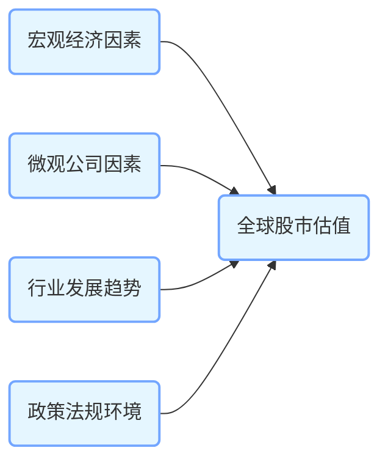
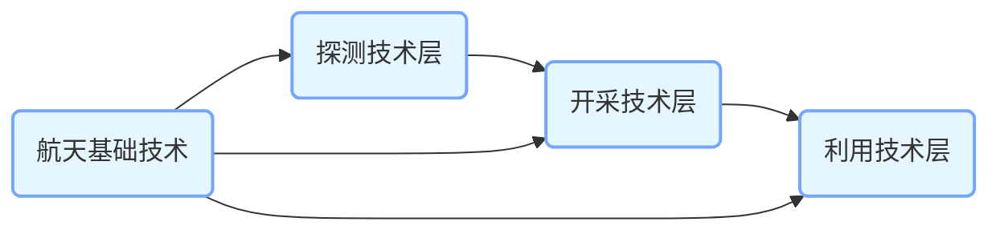
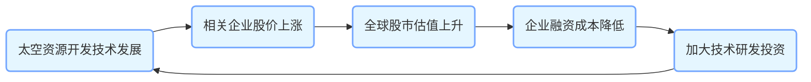

# 全球股市估值与太空资源开发技术的关系

> 关键词：全球股市估值、太空资源开发技术、金融市场、航天产业、经济影响

> 摘要：本文旨在深入探讨全球股市估值与太空资源开发技术之间的关系。通过对背景的介绍，明确研究的目的、范围以及预期读者等信息。详细阐述核心概念，包括全球股市估值和太空资源开发技术的原理与架构，并使用示意图和流程图进行直观展示。分析核心算法原理及操作步骤，结合数学模型和公式进行说明。通过项目实战案例，展示两者关系在实际中的体现。探讨实际应用场景，推荐相关的学习资源、开发工具框架以及论文著作。最后总结未来发展趋势与挑战，解答常见问题并提供扩展阅读和参考资料，帮助读者全面了解全球股市估值与太空资源开发技术之间的内在联系。

## 1. 背景介绍 
### 1.1 目的和范围
本研究的目的在于全面分析全球股市估值与太空资源开发技术之间的相互关系。具体来说，要探究太空资源开发技术的发展如何影响全球股市的估值，以及股市估值的变化又如何反馈到太空资源开发技术的研发和商业化进程中。研究范围涵盖全球主要的股票市场，包括美国、欧洲、亚洲等地区的证券交易所，以及太空资源开发领域的各类技术，如小行星采矿技术、太空太阳能发电技术等。

### 1.2 预期读者
本文预期读者包括金融市场从业者，如股票分析师、基金经理等，他们可以通过了解太空资源开发技术对股市估值的影响，优化投资策略；航天产业的科研人员和管理人员，有助于他们从金融市场的角度理解技术发展的商业前景；以及对金融和航天领域交叉研究感兴趣的学者和爱好者，为他们提供深入研究的参考。

### 1.3 文档结构概述
本文首先介绍背景信息，让读者了解研究的目的、范围和预期读者。接着阐述核心概念，包括全球股市估值和太空资源开发技术的定义、原理和架构，并通过示意图和流程图进行直观呈现。然后讲解核心算法原理和具体操作步骤，结合数学模型和公式进行详细说明。通过项目实战案例，展示两者关系在实际中的应用。探讨实际应用场景，推荐相关的学习资源、开发工具框架和论文著作。最后总结未来发展趋势与挑战，解答常见问题并提供扩展阅读和参考资料。

### 1.4 术语表
#### 1.4.1 核心术语定义
- **全球股市估值**：指对全球范围内各个股票市场上上市公司股票价值的评估，通常通过市盈率、市净率等指标来衡量。
- **太空资源开发技术**：是指用于探索、开采和利用太空资源的一系列技术，包括太空探测器技术、太空采矿技术、太空能源开发技术等。

#### 1.4.2 相关概念解释
- **市盈率（P/E）**：是指股票价格除以每股收益的比率，反映了市场对公司未来盈利的预期。
- **市净率（P/B）**：是指股票价格除以每股净资产的比率，反映了市场对公司净资产的估值。
- **小行星采矿**：是指对小行星上的矿产资源进行勘探、开采和利用的活动，这些资源可能包括金属、水等。

#### 1.4.3 缩略词列表
- **P/E**：市盈率（Price-to-Earnings Ratio）
- **P/B**：市净率（Price-to-Book Ratio）

## 2. 核心概念与联系 
### 2.1 全球股市估值的原理与架构
全球股市估值是一个复杂的过程，涉及到多个因素的综合考量。从宏观层面来看，经济增长、利率水平、通货膨胀等因素会影响整个股市的估值。例如，经济增长强劲时，企业的盈利预期通常会提高，从而推动股市估值上升；而利率上升会增加企业的融资成本，降低股市的吸引力，导致估值下降。

从微观层面来看，公司的财务状况、行业竞争力、管理水平等因素会影响单个股票的估值。例如，一家盈利能力强、市场份额高的公司，其股票的估值通常会较高。

全球股市估值的架构可以用以下示意图表示：



### 2.2 太空资源开发技术的原理与架构
太空资源开发技术是一个综合性的技术领域，涉及到多个学科的知识和技术。其核心原理是利用先进的航天技术和设备，对太空资源进行探测、开采和利用。

太空资源开发技术的架构可以分为以下几个层次：
- **探测技术层**：包括太空探测器、遥感卫星等技术，用于对太空资源进行探测和定位。
- **开采技术层**：包括太空采矿机器人、太空飞船等技术，用于对太空资源进行开采和运输。
- **利用技术层**：包括太空能源转换、太空材料加工等技术，用于对开采的太空资源进行利用和加工。

太空资源开发技术的架构可以用以下示意图表示：



### 2.3 全球股市估值与太空资源开发技术的联系
太空资源开发技术的发展会对全球股市估值产生影响。一方面，太空资源开发技术的突破和创新会带来新的商业机会和投资热点，吸引投资者的关注，从而推动相关企业的股价上涨，提高股市的估值。例如，小行星采矿技术的发展可能会催生一批专注于太空资源开发的企业，这些企业的上市会为股市带来新的活力。

另一方面，全球股市估值的变化也会影响太空资源开发技术的发展。当股市估值上升时，企业的融资成本降低，更容易获得资金支持，从而加大对太空资源开发技术的研发和投资；反之，当股市估值下降时，企业的融资难度增加，可能会减少对太空资源开发技术的投入。

全球股市估值与太空资源开发技术的联系可以用以下示意图表示：



## 3. 核心算法原理 & 具体操作步骤 
### 3.1 股市估值模型
在金融领域，常用的股市估值模型有股息贴现模型（DDM）、市盈率模型（P/E模型）等。这里以市盈率模型为例进行介绍。

市盈率模型的基本原理是通过比较公司的市盈率与同行业平均市盈率或市场整体市盈率，来判断股票的估值是否合理。计算公式为：

$P = E \times P/E$

其中，$P$ 表示股票价格，$E$ 表示每股收益，$P/E$ 表示市盈率。

以下是一个简单的Python代码示例，用于计算股票的理论价格：

```python
# 定义每股收益和市盈率
earnings_per_share = 2.0
price_to_earnings_ratio = 15

# 计算股票价格
stock_price = earnings_per_share * price_to_earnings_ratio

print(f"股票的理论价格为: {stock_price} 元")
```

### 3.2 太空资源开发技术评估模型
对于太空资源开发技术的评估，可以采用技术成熟度等级（TRL）模型。TRL模型将技术的发展分为9个等级，从基础研究到实际应用逐步推进。

以下是一个简单的Python代码示例，用于判断太空资源开发技术的成熟度等级：

```python
# 定义技术成熟度评估指标
technology_progress = 7

# 根据技术进展判断成熟度等级
if technology_progress < 3:
    trl = 1
elif technology_progress < 5:
    trl = 3
elif technology_progress < 7:
    trl = 5
elif technology_progress < 9:
    trl = 7
else:
    trl = 9

print(f"太空资源开发技术的成熟度等级为: TRL {trl}")
```

### 3.3 两者关系的量化分析步骤
1. **数据收集**：收集全球股市的相关数据，如股票价格、每股收益、市盈率等，以及太空资源开发技术的相关数据，如技术研发投入、技术成熟度等级等。
2. **数据预处理**：对收集到的数据进行清洗、整理和归一化处理，以便后续分析。
3. **建立模型**：建立全球股市估值与太空资源开发技术之间的数学模型，如回归模型、时间序列模型等。
4. **模型训练**：使用历史数据对建立的模型进行训练，调整模型参数，提高模型的准确性。
5. **模型评估**：使用测试数据对训练好的模型进行评估，计算模型的评估指标，如均方误差（MSE）、决定系数（$R^2$）等。
6. **结果分析**：根据模型的评估结果，分析全球股市估值与太空资源开发技术之间的关系，预测未来的发展趋势。

以下是一个简单的Python代码示例，用于建立全球股市估值与太空资源开发技术之间的线性回归模型：

```python
import numpy as np
from sklearn.linear_model import LinearRegression
from sklearn.model_selection import train_test_split
from sklearn.metrics import mean_squared_error, r2_score

# 生成示例数据
np.random.seed(0)
technology_progress = np.random.rand(100, 1) * 10
stock_valuation = 2 * technology_progress + 3 + np.random.randn(100, 1)

# 划分训练集和测试集
X_train, X_test, y_train, y_test = train_test_split(technology_progress, stock_valuation, test_size=0.2, random_state=0)

# 建立线性回归模型
model = LinearRegression()

# 训练模型
model.fit(X_train, y_train)

# 预测测试集数据
y_pred = model.predict(X_test)

# 计算评估指标
mse = mean_squared_error(y_test, y_pred)
r2 = r2_score(y_test, y_pred)

print(f"均方误差: {mse}")
print(f"决定系数: {r2}")
```

## 4. 数学模型和公式 & 详细讲解 & 举例说明 
### 4.1 股息贴现模型（DDM）
股息贴现模型是一种基于股票未来股息现金流的估值模型。其基本思想是将股票的价值视为未来所有股息现金流的现值之和。

#### 4.1.1 公式推导
假设股票每年支付的股息为 $D_1, D_2, \cdots, D_n$，折现率为 $r$，则股票的价值 $V$ 可以表示为：

$V = \frac{D_1}{(1 + r)^1} + \frac{D_2}{(1 + r)^2} + \cdots + \frac{D_n}{(1 + r)^n}$

如果股息以固定增长率 $g$ 增长，则上述公式可以简化为：

$V = \frac{D_1}{r - g}$

其中，$D_1$ 为下一期的股息，$r$ 为折现率，$g$ 为股息增长率。

#### 4.1.2 举例说明
假设某公司下一期的股息为 $2$ 元，折现率为 $10\%$，股息增长率为 $5\%$，则该公司股票的价值为：

$V = \frac{2}{0.1 - 0.05} = 40$（元）

### 4.2 资本资产定价模型（CAPM）
资本资产定价模型用于描述资产的预期收益率与系统性风险之间的关系。

#### 4.2.1 公式推导
资产的预期收益率 $E(R_i)$ 可以表示为：

$E(R_i) = R_f + \beta_i [E(R_m) - R_f]$

其中，$R_f$ 为无风险收益率，$\beta_i$ 为资产 $i$ 的贝塔系数，$E(R_m)$ 为市场组合的预期收益率。

#### 4.2.2 举例说明
假设无风险收益率为 $3\%$，市场组合的预期收益率为 $10\%$，某股票的贝塔系数为 $1.2$，则该股票的预期收益率为：

$E(R_i) = 3\% + 1.2 \times (10\% - 3\%) = 11.4\%$

### 4.3 太空资源开发技术的成本 - 效益模型
太空资源开发技术的成本 - 效益模型用于评估技术开发的经济效益。

#### 4.3.1 公式推导
假设太空资源开发项目的总成本为 $C$，总收益为 $B$，则项目的净现值 $NPV$ 可以表示为：

$NPV = B - C$

如果考虑资金的时间价值，则净现值的计算公式为：

$NPV = \sum_{t = 0}^{n} \frac{B_t - C_t}{(1 + r)^t}$

其中，$B_t$ 和 $C_t$ 分别为第 $t$ 期的收益和成本，$r$ 为折现率，$n$ 为项目的寿命期。

#### 4.3.2 举例说明
假设某太空资源开发项目的初始投资为 $1000$ 万元，每年的收益为 $200$ 万元，成本为 $100$ 万元，项目寿命期为 $10$ 年，折现率为 $10\%$，则该项目的净现值为：

$NPV = -1000 + \sum_{t = 1}^{10} \frac{200 - 100}{(1 + 0.1)^t} \approx -1000 + 100 \times \frac{1 - (1 + 0.1)^{-10}}{0.1} \approx 228.91$（万元）

由于净现值大于 $0$，说明该项目在经济上是可行的。

## 5. 项目实战：代码实际案例和详细解释说明 
### 5.1  开发环境搭建
在进行项目实战之前，需要搭建相应的开发环境。以下是具体的步骤：

1. **安装Python**：从Python官方网站（https://www.python.org/downloads/）下载并安装Python 3.x版本。
2. **安装必要的库**：使用pip命令安装以下必要的库：
    - `pandas`：用于数据处理和分析。
    - `numpy`：用于数值计算。
    - `matplotlib`：用于数据可视化。
    - `scikit-learn`：用于机器学习模型的构建和训练。

```bash
pip install pandas numpy matplotlib scikit-learn
```

### 5.2  源代码详细实现和代码解读
以下是一个完整的Python代码示例，用于分析全球股市估值与太空资源开发技术之间的关系：

```python
import pandas as pd
import numpy as np
import matplotlib.pyplot as plt
from sklearn.linear_model import LinearRegression
from sklearn.model_selection import train_test_split
from sklearn.metrics import mean_squared_error, r2_score

# 读取数据
data = pd.read_csv('stock_valuation_and_technology.csv')

# 提取特征和标签
X = data[['technology_progress']]
y = data['stock_valuation']

# 划分训练集和测试集
X_train, X_test, y_train, y_test = train_test_split(X, y, test_size=0.2, random_state=0)

# 建立线性回归模型
model = LinearRegression()

# 训练模型
model.fit(X_train, y_train)

# 预测测试集数据
y_pred = model.predict(X_test)

# 计算评估指标
mse = mean_squared_error(y_test, y_pred)
r2 = r2_score(y_test, y_pred)

# 输出评估结果
print(f"均方误差: {mse}")
print(f"决定系数: {r2}")

# 绘制散点图和回归直线
plt.scatter(X_test, y_test, color='blue')
plt.plot(X_test, y_pred, color='red', linewidth=2)
plt.xlabel('Technology Progress')
plt.ylabel('Stock Valuation')
plt.title('Relationship between Stock Valuation and Technology Progress')
plt.show()
```

### 5.3  代码解读与分析
1. **数据读取**：使用`pandas`库的`read_csv`函数读取包含全球股市估值和太空资源开发技术数据的CSV文件。
2. **特征和标签提取**：从数据中提取太空资源开发技术的进展作为特征`X`，全球股市估值作为标签`y`。
3. **数据集划分**：使用`train_test_split`函数将数据集划分为训练集和测试集，其中测试集占比为 $20\%$。
4. **模型建立和训练**：使用`LinearRegression`类建立线性回归模型，并使用训练集数据对模型进行训练。
5. **模型预测和评估**：使用训练好的模型对测试集数据进行预测，并计算均方误差和决定系数等评估指标。
6. **数据可视化**：使用`matplotlib`库绘制散点图和回归直线，直观展示全球股市估值与太空资源开发技术之间的关系。

通过对代码的分析，可以看出全球股市估值与太空资源开发技术之间存在一定的线性关系。均方误差越小，决定系数越接近 $1$，说明模型的拟合效果越好。

## 6. 实际应用场景 
### 6.1 投资决策
对于投资者来说，了解全球股市估值与太空资源开发技术之间的关系可以帮助他们做出更明智的投资决策。当太空资源开发技术取得重大突破时，相关企业的股价可能会上涨，投资者可以提前布局，买入这些企业的股票。例如，当小行星采矿技术取得关键进展时，专注于太空资源开发的企业可能会迎来发展机遇，其股票的投资价值也会相应提高。

### 6.2 企业战略规划
对于太空资源开发企业来说，了解股市估值的变化可以帮助他们制定合理的战略规划。当股市估值上升时，企业可以更容易地获得资金支持，加大对技术研发和市场拓展的投入；反之，当股市估值下降时，企业可以调整战略，优化资源配置，降低成本。

### 6.3 政策制定
政府部门可以根据全球股市估值与太空资源开发技术之间的关系，制定相关的政策。例如，当股市对太空资源开发技术的关注度较低时，政府可以出台一些扶持政策，如税收优惠、资金补贴等，鼓励企业加大对太空资源开发技术的研发投入，提高行业的整体竞争力。

### 6.4 行业研究
学术界和研究机构可以对全球股市估值与太空资源开发技术之间的关系进行深入研究，探索两者之间的内在规律和影响机制。这些研究成果可以为金融市场和航天产业的发展提供理论支持和决策参考。

## 7. 工具和资源推荐
### 7.1 学习资源推荐
#### 7.1.1 书籍推荐
- 《金融市场与金融机构》：这本书全面介绍了金融市场的基本概念、运行机制和金融机构的业务模式，对于理解全球股市估值有很大的帮助。
- 《太空资源开发：技术与商业前景》：详细阐述了太空资源开发的技术原理、发展现状和商业前景，是了解太空资源开发技术的重要参考书籍。
- 《机器学习实战》：通过实际案例介绍了机器学习的基本算法和应用，对于进行全球股市估值与太空资源开发技术关系的量化分析有很大的帮助。

#### 7.1.2 在线课程
- Coursera平台上的“金融市场”课程：由知名教授授课，系统讲解了金融市场的理论和实践知识。
- edX平台上的“太空探索技术”课程：介绍了太空探索的最新技术和发展趋势，对于了解太空资源开发技术有很大的帮助。
- Udemy平台上的“Python机器学习”课程：通过实际项目讲解了Python在机器学习中的应用，对于进行相关数据分析和建模有很大的帮助。

#### 7.1.3 技术博客和网站
- Seeking Alpha：提供全球股市的分析和评论，帮助投资者了解市场动态。
- SpaceNews：专注于太空领域的新闻和分析，提供太空资源开发技术的最新进展。
- Towards Data Science：分享数据科学和机器学习的最新技术和实践经验，对于进行相关研究有很大的帮助。

### 7.2 开发工具框架推荐
#### 7.2.1 IDE和编辑器
- PyCharm：是一款专业的Python集成开发环境，提供丰富的代码编辑、调试和项目管理功能。
- Jupyter Notebook：是一个交互式的开发环境，适合进行数据分析和模型开发，支持Python、R等多种编程语言。

#### 7.2.2 调试和性能分析工具
- pdb：是Python自带的调试工具，可以帮助开发者定位代码中的错误。
- cProfile：是Python的性能分析工具，可以帮助开发者找出代码中的性能瓶颈。

#### 7.2.3 相关框架和库
- pandas：是Python中用于数据处理和分析的重要库，提供了丰富的数据结构和数据操作方法。
- numpy：是Python中用于数值计算的基础库，提供了高效的数组操作和数学函数。
- scikit-learn：是Python中用于机器学习的常用库，提供了各种机器学习算法和工具。

### 7.3 相关论文著作推荐
#### 7.3.1 经典论文
- “The Capital Asset Pricing Model: Theory and Evidence”：这篇论文详细介绍了资本资产定价模型的理论和实证研究，是金融领域的经典论文之一。
- “A Review of Asteroid Mining Technologies and Concepts”：对小行星采矿技术和概念进行了全面的综述，对于了解太空资源开发技术有重要的参考价值。

#### 7.3.2 最新研究成果
- 关注《Journal of Financial Economics》、《Space Policy》等学术期刊，及时了解全球股市估值和太空资源开发技术的最新研究成果。

#### 7.3.3 应用案例分析
- 可以参考一些知名投资机构的研究报告，了解他们在全球股市估值和太空资源开发技术领域的投资策略和应用案例。

## 8. 总结：未来发展趋势与挑战
### 8.1 未来发展趋势
- **技术创新加速**：随着科技的不断进步，太空资源开发技术将不断取得突破，如更高效的太空探测器、更先进的太空采矿机器人等。这些技术的创新将推动太空资源开发产业的快速发展，从而对全球股市估值产生更大的影响。
- **商业应用拓展**：太空资源开发技术的商业应用将不断拓展，除了小行星采矿、太空太阳能发电等领域，还可能涉及太空旅游、太空制药等新兴领域。这些商业应用的拓展将为相关企业带来更多的盈利机会，提高股市的估值。
- **国际合作加强**：太空资源开发是一个全球性的挑战，需要各国之间加强合作。未来，国际间的合作将更加紧密，共同开展太空资源开发项目，分享技术和资源。这种国际合作将促进太空资源开发产业的健康发展，也将对全球股市估值产生积极的影响。

### 8.2 挑战
- **技术难题**：太空资源开发技术面临着许多技术难题，如太空环境的复杂性、资源的探测和开采难度等。解决这些技术难题需要大量的研发投入和时间，可能会影响技术的发展进度和商业应用的推广。
- **法律和政策障碍**：太空资源开发涉及到一系列的法律和政策问题，如太空资源的所有权、开发权等。目前，国际上还没有完善的法律和政策体系来规范太空资源开发活动，这可能会给企业的发展带来不确定性。
- **市场风险**：太空资源开发产业是一个新兴产业，市场风险较大。投资者对该领域的了解和认知相对较少，可能会导致市场的波动较大。此外，太空资源开发项目的投资周期长、回报不确定，也增加了市场风险。

## 9. 附录：常见问题与解答
### 9.1 全球股市估值与太空资源开发技术之间的关系是确定的吗？
全球股市估值与太空资源开发技术之间的关系不是确定的，而是受到多种因素的影响。虽然太空资源开发技术的发展会对股市估值产生影响，但其他因素，如宏观经济环境、政策法规、市场情绪等，也会对股市估值产生重要的影响。因此，不能简单地认为两者之间存在确定的关系，需要综合考虑各种因素。

### 9.2 如何评估太空资源开发技术的商业前景？
评估太空资源开发技术的商业前景需要考虑多个方面的因素，如技术的成熟度、资源的储量和质量、市场需求、成本效益等。可以通过分析相关企业的财务报表、技术研发进展、市场竞争情况等，来评估技术的商业前景。此外，还可以参考专业机构的研究报告和行业专家的意见。

### 9.3 太空资源开发技术对哪些行业的股市估值影响较大？
太空资源开发技术对航天、能源、材料等行业的股市估值影响较大。航天行业是直接参与太空资源开发的行业，技术的发展将直接推动相关企业的发展，从而影响其股市估值。能源行业可以利用太空资源开发技术，如太空太阳能发电，来获取新的能源来源，这也会对相关企业的股市估值产生影响。材料行业可以从太空资源中获取特殊的材料，提高产品的性能和质量，从而影响其股市估值。

## 10. 扩展阅读 & 参考资料
### 10.1 扩展阅读
- 《金融炼金术》：乔治·索罗斯的经典著作，探讨了金融市场的运行机制和投资者的心理。
- 《太空时代的经济》：从经济学的角度分析了太空资源开发的经济影响和发展前景。

### 10.2 参考资料
- 相关的金融市场数据可以从雅虎财经、彭博社等网站获取。
- 太空资源开发技术的相关信息可以从美国国家航空航天局（NASA）、欧洲航天局（ESA）等官方网站获取。

作者：AI天才研究院/AI Genius Institute & 禅与计算机程序设计艺术 /Zen And The Art of Computer Programming