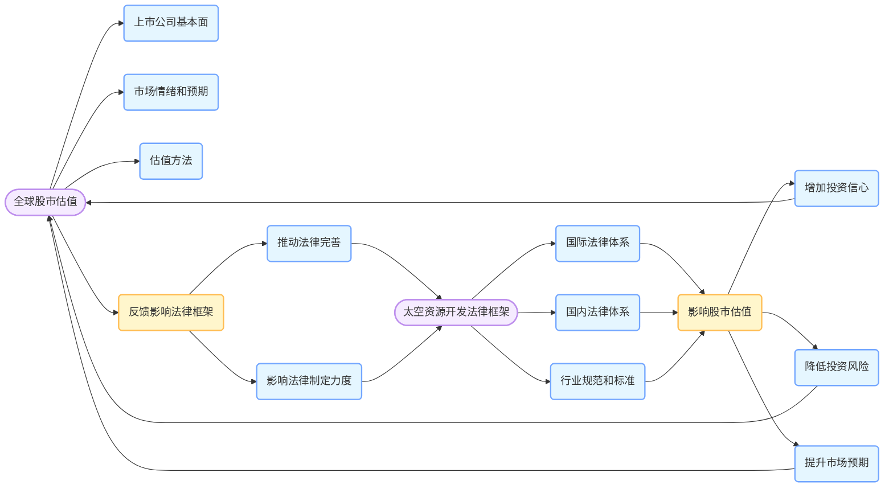

# 全球股市估值与太空资源开发法律框架的关系

> 关键词：全球股市估值、太空资源开发、法律框架、投资风险、市场预期

> 摘要：本文深入探讨了全球股市估值与太空资源开发法律框架之间的关系。随着太空探索技术的发展，太空资源开发成为具有巨大潜力的新兴领域，其法律框架的构建对全球股市估值产生了不可忽视的影响。文章首先介绍了研究的背景、目的、预期读者和文档结构，详细解释了相关术语。接着阐述了核心概念及其联系，分析了核心算法原理和具体操作步骤，并通过数学模型和公式进行了理论推导。在项目实战部分，给出了代码实际案例并进行详细解读。还探讨了实际应用场景，推荐了相关的工具和资源。最后总结了未来发展趋势与挑战，解答了常见问题，并提供了扩展阅读和参考资料，旨在为投资者、法律从业者和相关研究人员提供全面而深入的分析。

## 1. 背景介绍 
### 1.1 目的和范围
本研究旨在深入分析全球股市估值与太空资源开发法律框架之间的内在联系。随着科技的飞速发展，太空资源开发逐渐从科幻走向现实，这一新兴领域吸引了全球范围内的广泛关注和大量投资。然而，太空资源开发面临着诸多法律问题，其法律框架的完善程度直接影响着投资者的信心和市场的预期，进而对全球股市估值产生作用。本研究的范围涵盖了全球主要股票市场，以及与太空资源开发相关的国际和国内法律体系。通过对两者关系的研究，为投资者、政策制定者和相关从业者提供有价值的参考，帮助他们更好地理解市场动态和法律环境，做出合理的决策。

### 1.2 预期读者
本文的预期读者包括金融投资者，他们希望通过了解太空资源开发法律框架对股市估值的影响，优化投资组合，获取更高的投资回报；法律从业者，包括律师、法官和立法者，他们需要掌握太空资源开发领域的法律动态，为相关案件提供专业的法律意见和制定合理的法律政策；科研人员，他们致力于研究太空资源开发的各个方面，包括经济和法律层面，以推动该领域的科学发展；以及对太空探索和金融市场感兴趣的普通读者，他们希望通过本文了解这两个前沿领域的交叉点和相互作用。

### 1.3 文档结构概述
本文共分为十个部分。第一部分为背景介绍，阐述了研究的目的、范围、预期读者和文档结构，并对相关术语进行了解释。第二部分介绍了核心概念与联系，通过文本示意图和 Mermaid 流程图展示了全球股市估值和太空资源开发法律框架的原理和架构。第三部分讲解了核心算法原理和具体操作步骤，使用 Python 源代码进行详细阐述。第四部分给出了数学模型和公式，并进行详细讲解和举例说明。第五部分是项目实战，包括开发环境搭建、源代码详细实现和代码解读。第六部分探讨了实际应用场景。第七部分推荐了相关的工具和资源，包括学习资源、开发工具框架和相关论文著作。第八部分总结了未来发展趋势与挑战。第九部分是附录，解答了常见问题。第十部分提供了扩展阅读和参考资料。

### 1.4 术语表
#### 1.4.1 核心术语定义
- **全球股市估值**：指对全球范围内各个股票市场上上市公司的价值进行评估的过程和结果。通常通过各种估值方法，如市盈率、市净率、现金流折现法等，来确定股票的合理价格和市场整体的价值水平。
- **太空资源开发**：指人类对地球大气层以外的天体（如月球、小行星等）所蕴含的各种资源（如矿产资源、能源资源等）进行勘探、开采、利用和加工的一系列活动。
- **法律框架**：是指一系列法律法规、政策和制度的总和，为特定领域的活动提供规范和准则。在太空资源开发领域，法律框架包括国际条约、国内法律和行业规范等，用于界定产权、规范开发行为、保障各方权益等。

#### 1.4.2 相关概念解释
- **投资风险**：指投资者在进行投资活动时面临的各种不确定性和可能遭受损失的可能性。在太空资源开发领域，法律框架的不完善可能导致投资风险增加，例如产权不明确、法律纠纷等问题可能使投资者的利益受损。
- **市场预期**：指市场参与者对未来市场走势和相关事件的预期和判断。太空资源开发法律框架的变化会影响市场参与者的预期，进而对股市估值产生影响。如果法律框架趋于完善，市场参与者可能对太空资源开发行业的发展前景更有信心，从而提高相关股票的估值。

#### 1.4.3 缩略词列表
- **PE**：市盈率（Price - Earnings Ratio），是指股票价格除以每股收益的比率，用于衡量股票的估值水平。
- **PB**：市净率（Price - Book Ratio），是指股票价格除以每股净资产的比率，也是常用的股票估值指标之一。
- **DCF**：现金流折现法（Discounted Cash Flow），是一种通过预测未来现金流并将其折现到当前的估值方法。

## 2. 核心概念与联系 

### 核心概念原理
#### 全球股市估值原理
全球股市估值是基于对上市公司未来盈利能力和现金流的预期。常用的估值方法有相对估值法和绝对估值法。相对估值法通过比较同行业或类似公司的估值指标，如市盈率、市净率等，来确定目标公司的合理估值。绝对估值法，如现金流折现法，通过预测公司未来的现金流，并使用适当的折现率将其折现到当前，得到公司的内在价值。

#### 太空资源开发法律框架原理
太空资源开发法律框架的构建旨在解决太空资源开发过程中涉及的各种法律问题，如产权归属、环境保护、国际合作等。国际上，《外层空间条约》《月球协定》等国际条约为太空活动提供了基本的法律准则。各国也根据自身情况制定了相应的国内法律，以规范本国企业的太空资源开发活动。法律框架的完善程度直接影响着太空资源开发的可行性和商业价值。

### 架构的文本示意图
```plaintext
全球股市估值
|
|-- 上市公司基本面分析
|   |-- 盈利能力
|   |-- 现金流状况
|   |-- 资产负债表
|
|-- 市场情绪和预期
|   |-- 宏观经济环境
|   |-- 行业发展趋势
|   |-- 政策法规变化
|
|-- 估值方法
|   |-- 相对估值法（PE、PB等）
|   |-- 绝对估值法（DCF等）

太空资源开发法律框架
|
|-- 国际法律体系
|   |-- 《外层空间条约》
|   |-- 《月球协定》
|   |-- 其他国际条约和协议
|
|-- 国内法律体系
|   |-- 各国相关法律法规
|   |-- 政策支持和监管措施
|
|-- 行业规范和标准
|   |-- 技术标准
|   |-- 安全规范
|   |-- 环境标准

两者关系
|
|-- 法律框架影响股市估值
|   |-- 明确产权增加投资信心
|   |-- 规范开发降低投资风险
|   |-- 促进合作提升市场预期
|
|-- 股市估值反馈影响法律框架
|   |-- 市场需求推动法律完善
|   |-- 投资规模影响法律制定力度
```

### Mermaid 流程图


## 3. 核心算法原理 & 具体操作步骤 

### 核心算法原理
为了分析全球股市估值与太空资源开发法律框架之间的关系，我们可以采用多元线性回归模型。假设全球股市估值（用 $Y$ 表示）受到多个因素的影响，其中太空资源开发法律框架的完善程度（用 $X_1$ 表示）是一个重要因素，同时还考虑其他控制变量，如宏观经济指标（用 $X_2$ 表示）、行业发展趋势（用 $X_3$ 表示）等。多元线性回归模型的一般形式为：

$$Y = \beta_0 + \beta_1X_1 + \beta_2X_2 + \beta_3X_3 + \epsilon$$

其中，$\beta_0$ 是截距项，$\beta_1$、$\beta_2$、$\beta_3$ 是回归系数，分别表示各个自变量对因变量的影响程度，$\epsilon$ 是误差项。

### 具体操作步骤

#### 数据收集
- 收集全球主要股票市场的估值数据，如市盈率、市净率等，可以从金融数据提供商（如 Bloomberg、Wind 等）获取。
- 构建太空资源开发法律框架完善程度的指标，可以通过对国际和国内相关法律法规的数量、质量和执行情况进行评估。
- 收集宏观经济指标数据，如 GDP 增长率、通货膨胀率等，以及行业发展趋势数据，如太空资源开发行业的投资规模、技术创新成果等。

#### 数据预处理
- 对收集到的数据进行清洗，去除缺失值和异常值。
- 对数据进行标准化处理，使各个变量具有相同的量纲，便于模型的训练和比较。

#### 模型训练
- 使用 Python 中的 `scikit-learn` 库来实现多元线性回归模型。
```python
import numpy as np
import pandas as pd
from sklearn.linear_model import LinearRegression
from sklearn.preprocessing import StandardScaler

# 假设我们已经收集到了数据，并存储在一个 CSV 文件中
data = pd.read_csv('stock_valuation_data.csv')

# 分离自变量和因变量
X = data[['legal_framework', 'macro_economy', 'industry_trend']]
y = data['stock_valuation']

# 数据标准化
scaler = StandardScaler()
X_scaled = scaler.fit_transform(X)

# 创建线性回归模型
model = LinearRegression()

# 训练模型
model.fit(X_scaled, y)

# 输出回归系数和截距
print('Intercept:', model.intercept_)
print('Coefficients:', model.coef_)
```

#### 模型评估
- 使用均方误差（MSE）、决定系数（$R^2$）等指标来评估模型的性能。
```python
from sklearn.metrics import mean_squared_error, r2_score

# 预测值
y_pred = model.predict(X_scaled)

# 计算均方误差
mse = mean_squared_error(y, y_pred)

# 计算决定系数
r2 = r2_score(y, y_pred)

print('Mean Squared Error:', mse)
print('R-squared:', r2)
```

## 4. 数学模型和公式 & 详细讲解 & 举例说明 

### 多元线性回归模型公式
$$Y = \beta_0 + \beta_1X_1 + \beta_2X_2 + \beta_3X_3 + \epsilon$$

### 详细讲解
- **因变量 $Y$**：表示全球股市估值，可以用市盈率、市净率等指标来衡量。
- **自变量 $X_1$、$X_2$、$X_3$**：分别表示太空资源开发法律框架的完善程度、宏观经济指标和行业发展趋势。
- **回归系数 $\beta_1$、$\beta_2$、$\beta_3$**：表示各个自变量对因变量的影响程度。例如，$\beta_1$ 表示在其他条件不变的情况下，太空资源开发法律框架完善程度每增加一个单位，全球股市估值的变化量。
- **截距项 $\beta_0$**：表示当所有自变量都为 0 时，因变量的取值。
- **误差项 $\epsilon$**：表示模型无法解释的随机误差，服从均值为 0 的正态分布。

### 举例说明
假设我们通过数据收集和模型训练得到了以下回归方程：

$$Y = 10 + 2X_1 + 1.5X_2 + 0.8X_3 + \epsilon$$

这意味着，当太空资源开发法律框架完善程度（$X_1$）增加 1 个单位，在宏观经济指标（$X_2$）和行业发展趋势（$X_3$）不变的情况下，全球股市估值（$Y$）将增加 2 个单位；当宏观经济指标增加 1 个单位，股市估值将增加 1.5 个单位；当行业发展趋势指标增加 1 个单位，股市估值将增加 0.8 个单位。截距项 10 表示在所有自变量都为 0 时的股市估值。

## 5. 项目实战：代码实际案例和详细解释说明 

### 5.1  开发环境搭建
- **操作系统**：推荐使用 Windows、Linux 或 macOS 操作系统。
- **Python 版本**：建议使用 Python 3.7 及以上版本。
- **开发工具**：可以使用 PyCharm、Jupyter Notebook 等开发工具。
- **所需库**：安装 `pandas`、`numpy`、`scikit-learn` 等库，可以使用以下命令进行安装：
```sh
pip install pandas numpy scikit-learn
```

### 5.2  源代码详细实现和代码解读

```python
import numpy as np
import pandas as pd
from sklearn.linear_model import LinearRegression
from sklearn.preprocessing import StandardScaler
from sklearn.metrics import mean_squared_error, r2_score

# 步骤 1: 数据收集和读取
# 假设我们已经收集到了数据，并存储在一个 CSV 文件中
data = pd.read_csv('stock_valuation_data.csv')

# 步骤 2: 分离自变量和因变量
# 自变量包括太空资源开发法律框架完善程度、宏观经济指标和行业发展趋势
X = data[['legal_framework', 'macro_economy', 'industry_trend']]
# 因变量是全球股市估值
y = data['stock_valuation']

# 步骤 3: 数据标准化
# 创建 StandardScaler 对象
scaler = StandardScaler()
# 对自变量进行标准化处理
X_scaled = scaler.fit_transform(X)

# 步骤 4: 创建线性回归模型
# 创建 LinearRegression 对象
model = LinearRegression()

# 步骤 5: 训练模型
# 使用标准化后的自变量和因变量进行模型训练
model.fit(X_scaled, y)

# 步骤 6: 输出回归系数和截距
# 输出截距项
print('Intercept:', model.intercept_)
# 输出回归系数
print('Coefficients:', model.coef_)

# 步骤 7: 模型预测
# 使用训练好的模型对自变量进行预测
y_pred = model.predict(X_scaled)

# 步骤 8: 模型评估
# 计算均方误差
mse = mean_squared_error(y, y_pred)
# 计算决定系数
r2 = r2_score(y, y_pred)

# 输出评估结果
print('Mean Squared Error:', mse)
print('R-squared:', r2)
```

### 5.3  代码解读与分析
- **数据收集和读取**：使用 `pandas` 库的 `read_csv` 函数读取存储在 CSV 文件中的数据。
- **分离自变量和因变量**：从数据中提取出自变量和因变量，分别存储在 `X` 和 `y` 中。
- **数据标准化**：使用 `StandardScaler` 对自变量进行标准化处理，使各个变量具有相同的量纲，避免因变量量纲不同而影响模型的训练效果。
- **创建线性回归模型**：使用 `LinearRegression` 类创建一个线性回归模型对象。
- **模型训练**：使用 `fit` 方法对模型进行训练，将标准化后的自变量和因变量作为输入。
- **输出回归系数和截距**：通过模型的 `intercept_` 和 `coef_` 属性输出截距项和回归系数。
- **模型预测**：使用训练好的模型对自变量进行预测，得到预测值 `y_pred`。
- **模型评估**：使用 `mean_squared_error` 和 `r2_score` 函数计算均方误差和决定系数，评估模型的性能。

## 6. 实际应用场景 
### 投资决策
投资者可以通过分析太空资源开发法律框架的变化，预测相关股票的估值走势，从而做出合理的投资决策。如果法律框架趋于完善，投资者可以增加对太空资源开发相关企业的投资；反之，如果法律框架存在不确定性，投资者可以减少投资或采取避险措施。

### 政策制定
政策制定者可以根据股市估值对太空资源开发法律框架的反馈，制定更加合理的法律法规和政策。例如，如果股市估值反映出投资者对太空资源开发的信心不足，政策制定者可以加快法律框架的完善，提供更多的政策支持，以促进该领域的发展。

### 行业发展规划
太空资源开发企业可以根据法律框架和股市估值的变化，制定自身的发展战略和规划。法律框架的完善可以为企业提供更稳定的发展环境，企业可以加大投资和研发力度；股市估值的上升可以为企业提供更多的融资机会，促进企业的扩张和发展。

## 7. 工具和资源推荐
### 7.1 学习资源推荐
#### 7.1.1 书籍推荐
- 《金融市场与金融机构》：全面介绍了金融市场的基本原理和金融机构的运作机制，对于理解全球股市估值有很大帮助。
- 《太空法概论》：系统阐述了太空法的基本概念、原则和主要内容，是学习太空资源开发法律框架的重要参考书籍。
- 《计量经济学导论》：详细讲解了计量经济学的理论和方法，对于使用多元线性回归模型分析股市估值与法律框架的关系具有指导作用。

#### 7.1.2 在线课程
- Coursera 上的“Financial Markets”课程：由耶鲁大学教授罗伯特·席勒（Robert Shiller）主讲，深入探讨了金融市场的各种现象和理论。
- edX 上的“Space Law and Policy”课程：介绍了太空法的发展历程、国际条约和国内法律，以及太空资源开发的法律问题。
- Udemy 上的“Python for Data Science and Machine Learning Bootcamp”课程：帮助学习者掌握 Python 在数据科学和机器学习领域的应用，为实现相关算法提供技术支持。

#### 7.1.3 技术博客和网站
- Seeking Alpha：提供全球股市的分析和评论，投资者可以从中获取有关股市估值的最新信息和观点。
- SpaceNews：专注于太空行业的新闻和分析，涵盖了太空资源开发的各个方面，包括法律政策的动态。
- Towards Data Science：分享数据科学和机器学习领域的技术文章和案例，对于学习和应用相关算法有很大帮助。

### 7.2 开发工具框架推荐
#### 7.2.1 IDE和编辑器
- PyCharm：是一款专门为 Python 开发设计的集成开发环境，具有强大的代码编辑、调试和项目管理功能。
- Jupyter Notebook：是一个交互式的开发环境，适合进行数据分析和模型实验，支持多种编程语言，包括 Python。
- Visual Studio Code：是一款轻量级的代码编辑器，支持多种编程语言和插件扩展，具有丰富的开发工具和功能。

#### 7.2.2 调试和性能分析工具
- PDB：是 Python 自带的调试工具，可以帮助开发者在代码中设置断点、查看变量值和执行流程。
- Py-Spy：是一个性能分析工具，可以实时监测 Python 程序的运行状态和性能瓶颈，帮助开发者优化代码。
- cProfile：是 Python 标准库中的性能分析模块，可以统计程序中各个函数的执行时间和调用次数，帮助开发者找出性能瓶颈。

#### 7.2.3 相关框架和库
- Pandas：是一个用于数据处理和分析的 Python 库，提供了高效的数据结构和数据操作方法，适合处理和分析股市估值和法律框架相关的数据。
- NumPy：是 Python 中用于科学计算的基础库，提供了多维数组对象和各种数学函数，为数据分析和模型训练提供了强大的支持。
- Scikit-learn：是一个用于机器学习的 Python 库，提供了各种机器学习算法和工具，包括线性回归、决策树、神经网络等，适合用于分析股市估值与法律框架的关系。

### 7.3 相关论文著作推荐
#### 7.3.1 经典论文
- “The Pricing of Options and Corporate Liabilities” by Fischer Black and Myron Scholes：提出了著名的布莱克 - 斯科尔斯期权定价模型，为金融市场的估值和风险管理提供了重要的理论基础。
- “The Tragedy of the Commons” by Garrett Hardin：探讨了公共资源的管理问题，对于理解太空资源开发中的产权和法律问题具有启示意义。
- “Space Resources: A New Frontier for Business and Law” by John M. Logsdon：分析了太空资源开发的商业前景和法律挑战，是该领域的经典论文之一。

#### 7.3.2 最新研究成果
- 定期关注《Journal of Financial Economics》《Space Policy》等学术期刊，这些期刊发表了关于金融市场和太空资源开发的最新研究成果。
- 参加国际金融和太空领域的学术会议，如美国金融协会年会（AFA）、国际宇航大会（IAC）等，了解最新的研究动态和前沿技术。

#### 7.3.3 应用案例分析
- 分析 SpaceX、Blue Origin 等太空探索公司的发展历程和融资情况，了解太空资源开发企业在不同法律环境下的市场表现和估值变化。
- 研究各国政府在太空资源开发方面的政策和法律措施，以及这些措施对本国股市中相关企业的影响。

## 8. 总结：未来发展趋势与挑战
### 未来发展趋势
- **法律框架不断完善**：随着太空资源开发活动的日益增多，国际社会和各国政府将加强合作，制定更加完善的法律框架，明确产权归属、规范开发行为、保障各方权益，为太空资源开发提供更加稳定的法律环境。
- **股市估值受太空资源开发影响增大**：太空资源开发具有巨大的商业潜力，随着技术的不断进步和法律框架的完善，越来越多的投资者将关注这一领域，太空资源开发相关企业的股票在全球股市中的比重将逐渐增加，其估值变化对全球股市估值的影响也将越来越大。
- **技术创新推动发展**：太空探索和资源开发技术的不断创新将降低开发成本，提高开发效率，进一步激发市场的投资热情，推动太空资源开发行业的快速发展，从而对全球股市估值产生积极影响。

### 挑战
- **国际法律协调困难**：太空资源开发涉及多个国家的利益，不同国家在产权、开发规则等方面存在分歧，国际法律协调难度较大，可能导致法律框架的完善进程缓慢，影响投资者的信心和市场的发展。
- **技术风险和不确定性**：太空资源开发技术仍处于发展阶段，存在许多技术难题和不确定性，如资源勘探的准确性、开采技术的可行性等，这些风险可能导致项目失败或成本超支，影响相关企业的业绩和股市估值。
- **公众认知和接受度**：太空资源开发是一个新兴领域，公众对其了解和认知程度有限，可能存在担忧和质疑。公众的态度和接受度将影响政府的政策制定和企业的市场推广，进而对股市估值产生影响。

## 9. 附录：常见问题与解答
### 问题 1：太空资源开发法律框架的完善需要多长时间？
解答：太空资源开发法律框架的完善是一个长期的过程，受到国际政治、经济、技术等多种因素的影响。目前，国际社会已经有一些相关的条约和协议，但在具体的产权界定、开发规则等方面还存在许多争议和不确定性。预计在未来几十年内，随着太空资源开发活动的不断推进和国际合作的加强，法律框架将逐步完善，但具体时间难以准确预测。

### 问题 2：太空资源开发对全球股市估值的影响有多大？
解答：太空资源开发对全球股市估值的影响程度取决于多个因素，如法律框架的完善程度、技术发展水平、市场需求等。目前，太空资源开发相关企业在全球股市中的比重相对较小，但其发展潜力巨大。随着该领域的不断发展，其对全球股市估值的影响将逐渐增大。通过建立多元线性回归模型等方法可以对这种影响进行定量分析，但具体的影响大小还需要根据实际数据和市场情况进行评估。

### 问题 3：投资者如何应对太空资源开发法律框架的不确定性？
解答：投资者可以采取以下措施应对太空资源开发法律框架的不确定性。首先，密切关注国际和国内相关法律法规的变化，及时了解法律框架的动态。其次，分散投资，避免过度集中在太空资源开发相关企业的股票上，降低投资风险。此外，投资者还可以通过研究企业的基本面、技术实力和市场竞争力等因素，选择具有较强抗风险能力的企业进行投资。

## 10. 扩展阅读 & 参考资料
### 扩展阅读
- 《星际穿越》：这部科幻电影虽然是虚构的，但涉及到了太空探索和资源开发的一些概念和想象，可以帮助读者拓展思维，加深对太空资源开发的理解。
- 《人类的群星闪耀时》：书中讲述了人类历史上一些重要的科技突破和探索事件，其中包括太空探索的部分，读者可以从中感受到人类探索未知的勇气和决心。

### 参考资料
- 《外层空间条约》：是国际太空法的基础条约，规定了外层空间的和平利用、不得据为己有等基本原则。
- 《月球协定》：对月球和其他天体的资源开发、环境保护等方面做出了规定。
- 各国相关法律法规：如美国的《商业太空发射竞争力法案》等，这些法律法规为各国企业的太空资源开发活动提供了具体的规范和指导。

作者：AI天才研究院/AI Genius Institute & 禅与计算机程序设计艺术 /Zen And The Art of Computer Programming