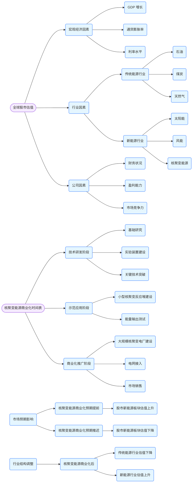

# 全球股市估值与核聚变能源商业化时间表的关系

> 关键词：全球股市估值、核聚变能源、商业化时间表、市场预期、能源变革

> 摘要：本文旨在深入探讨全球股市估值与核聚变能源商业化时间表之间的关系。通过分析核聚变能源的核心概念、相关算法原理、数学模型，结合实际案例和应用场景，揭示核聚变能源商业化进程对全球股市各行业估值的影响机制。同时，为读者提供学习资源、开发工具以及相关论文著作的推荐，最后对该领域未来发展趋势与挑战进行总结，并解答常见问题。

## 1. 背景介绍 
### 1.1 目的和范围
本研究的目的是全面剖析全球股市估值与核聚变能源商业化时间表之间的内在联系。具体范围涵盖了全球主要股票市场，包括美国、欧洲、亚洲等地区的股市。同时，聚焦于核聚变能源从技术研发到商业化应用的整个过程，以及这一过程中不同阶段对股市各行业板块估值的影响。

### 1.2 预期读者
本文预期读者包括金融投资者、能源行业从业者、科研人员以及对金融与能源交叉领域感兴趣的学者和爱好者。投资者可以通过本文了解核聚变能源商业化对股市的潜在影响，从而做出更明智的投资决策；能源行业从业者能够掌握金融市场对核聚变能源的反应，为企业战略规划提供参考；科研人员可以从金融视角审视核聚变能源的发展前景；学者和爱好者则可以深入了解这一新兴领域的研究动态。

### 1.3 文档结构概述
本文首先介绍相关背景知识，包括目的、预期读者和文档结构。接着阐述核心概念，展示其原理和架构的文本示意图及 Mermaid 流程图。然后详细讲解核心算法原理和具体操作步骤，结合数学模型和公式进行举例说明。通过项目实战案例，对代码进行详细解读和分析。探讨实际应用场景，推荐学习资源、开发工具和相关论文著作。最后总结未来发展趋势与挑战，解答常见问题，并提供扩展阅读和参考资料。

### 1.4 术语表
#### 1.4.1 核心术语定义
- **全球股市估值**：指对全球范围内各个股票市场中上市公司的价值进行评估的过程和结果。通常通过市盈率、市净率等指标来衡量。
- **核聚变能源**：利用轻原子核（如氢的同位素氘和氚）在极高温度和压力下发生核聚变反应，释放出巨大能量的能源形式。
- **商业化时间表**：指核聚变能源从实验室研究阶段逐步走向大规模商业应用的预计时间安排。

#### 1.4.2 相关概念解释
- **市场预期**：投资者对未来市场走势和公司业绩的预期。在核聚变能源领域，市场预期会受到技术进展、政策支持等因素的影响。
- **能源变革**：指能源结构从传统能源向新能源的转变过程。核聚变能源作为一种潜在的新能源，其商业化可能引发全球能源变革。

#### 1.4.3 缩略词列表
- **PE**：市盈率（Price-to-Earnings Ratio），反映股票价格与每股盈利之间的关系。
- **PB**：市净率（Price-to-Book Ratio），衡量股票价格与每股净资产之间的比例。

## 2. 核心概念与联系 
### 核心概念原理
#### 全球股市估值原理
全球股市估值是基于对上市公司未来盈利能力和资产价值的预期。投资者通过分析公司的财务报表、行业前景、宏观经济环境等因素，来评估公司的价值。常见的估值方法包括现金流折现法、相对估值法等。现金流折现法是将公司未来的现金流按照一定的折现率折现到当前，以确定公司的内在价值；相对估值法则是通过与同行业其他公司的市盈率、市净率等指标进行比较，来评估公司的估值水平。

#### 核聚变能源原理
核聚变能源的原理是基于轻原子核的聚变反应。在太阳等恒星内部，氢原子核在高温高压下发生聚变反应，形成氦原子核，并释放出巨大的能量。在地球上实现可控核聚变反应需要满足极高的温度和压力条件，目前主要通过磁约束和惯性约束两种方式来实现。磁约束是利用强磁场将高温等离子体约束在一定的空间内，使其发生聚变反应；惯性约束则是通过高能激光等手段对核聚变燃料进行快速加热和压缩，引发聚变反应。

#### 商业化时间表原理
核聚变能源的商业化时间表受到多种因素的影响，包括技术进展、资金投入、政策支持等。技术进展是决定商业化时间表的关键因素，只有当核聚变技术达到一定的成熟度，能够实现稳定、高效的能量输出时，才有可能实现商业化应用。资金投入是推动核聚变研究和开发的重要保障，大量的资金用于建设实验装置、开展科研项目等。政策支持则为核聚变能源的发展提供了良好的环境，政府可以通过制定相关政策，鼓励企业和科研机构参与核聚变研究和开发。

### 架构的文本示意图
```plaintext
全球股市估值
|-- 宏观经济因素
|   |-- GDP 增长
|   |-- 通货膨胀率
|   |-- 利率水平
|-- 行业因素
|   |-- 传统能源行业
|   |   |-- 石油
|   |   |-- 煤炭
|   |   |-- 天然气
|   |-- 新能源行业
|   |   |-- 太阳能
|   |   |-- 风能
|   |   |-- 核聚变能源
|-- 公司因素
|   |-- 财务状况
|   |-- 盈利能力
|   |-- 市场竞争力

核聚变能源商业化时间表
|-- 技术研发阶段
|   |-- 基础研究
|   |-- 实验装置建设
|   |-- 关键技术突破
|-- 示范应用阶段
|   |-- 小型核聚变反应堆建设
|   |-- 能量输出测试
|-- 商业化推广阶段
|   |-- 大规模核聚变电厂建设
|   |-- 电网接入
|   |-- 市场销售

两者关系
|-- 市场预期影响
|   |-- 核聚变能源商业化预期提前，股市新能源板块估值上升
|   |-- 核聚变能源商业化预期推迟，股市新能源板块估值下降
|-- 行业结构调整
|   |-- 核聚变能源商业化后，传统能源行业估值下降
|   |-- 新能源行业估值上升
```

### Mermaid 流程图


## 3. 核心算法原理 & 具体操作步骤 
### 核心算法原理
#### 股市估值算法
我们可以使用市盈率法来对股票进行估值。市盈率法的基本原理是将股票的价格与每股盈利进行比较，通过同行业平均市盈率来估算股票的合理价格。计算公式如下：
```python
# 市盈率法计算股票估值
def pe_valuation(eps, industry_pe):
    """
    eps: 每股盈利
    industry_pe: 同行业平均市盈率
    """
    return eps * industry_pe

# 示例
eps = 2.0  # 每股盈利为 2 元
industry_pe = 20  # 同行业平均市盈率为 20
stock_value = pe_valuation(eps, industry_pe)
print(f"股票的估值为: {stock_value} 元")
```

#### 核聚变能源商业化时间表预测算法
我们可以使用时间序列分析方法来预测核聚变能源商业化时间表。时间序列分析是一种基于历史数据来预测未来趋势的方法。这里我们使用简单的线性回归模型来进行预测。
```python
import numpy as np
from sklearn.linear_model import LinearRegression

# 历史数据：年份和技术进展得分
years = np.array([2010, 2012, 2014, 2016, 2018, 2020]).reshape(-1, 1)
progress_scores = np.array([10, 20, 30, 40, 50, 60])

# 创建线性回归模型
model = LinearRegression()
model.fit(years, progress_scores)

# 预测未来某一年的技术进展得分
future_year = 2025
future_score = model.predict([[future_year]])
print(f"预测 {future_year} 年的技术进展得分为: {future_score[0]}")

# 根据技术进展得分判断商业化时间
if future_score[0] >= 80:
    print("预计在 2025 年左右可以实现商业化")
else:
    print("预计在 2025 年无法实现商业化")
```

### 具体操作步骤
#### 股市估值操作步骤
1. 收集上市公司的财务报表，计算每股盈利（EPS）。
2. 收集同行业其他上市公司的市盈率数据，计算同行业平均市盈率。
3. 将每股盈利和同行业平均市盈率代入市盈率法计算公式，计算股票的估值。

#### 核聚变能源商业化时间表预测操作步骤
1. 收集核聚变能源技术研发的历史数据，包括年份和技术进展得分。
2. 使用时间序列分析方法（如线性回归模型）对历史数据进行拟合。
3. 根据拟合模型预测未来某一年的技术进展得分。
4. 根据技术进展得分判断是否可以实现商业化。

## 4. 数学模型和公式 & 详细讲解 & 举例说明 
### 股市估值数学模型和公式
#### 市盈率法
市盈率（PE）是股票价格与每股盈利的比值，计算公式为：
$$PE = \frac{P}{EPS}$$
其中，$P$ 为股票价格，$EPS$ 为每股盈利。通过同行业平均市盈率来估算股票的合理价格，公式为：
$$P_{合理} = EPS \times PE_{行业平均}$$

举例说明：假设某公司的每股盈利为 3 元，同行业平均市盈率为 15，则该公司股票的合理价格为：
$$P_{合理} = 3 \times 15 = 45 \text{ 元}$$

#### 现金流折现法
现金流折现法是将公司未来的现金流按照一定的折现率折现到当前，以确定公司的内在价值。计算公式为：
$$V = \sum_{t=1}^{n} \frac{CF_t}{(1 + r)^t}$$
其中，$V$ 为公司的内在价值，$CF_t$ 为第 $t$ 期的现金流，$r$ 为折现率，$n$ 为预测期数。

举例说明：假设某公司未来三年的现金流分别为 100 万元、120 万元、150 万元，折现率为 10%，则该公司的内在价值为：
$$V = \frac{100}{(1 + 0.1)^1} + \frac{120}{(1 + 0.1)^2} + \frac{150}{(1 + 0.1)^3} \approx 297.27 \text{ 万元}$$

### 核聚变能源商业化时间表预测数学模型和公式
#### 线性回归模型
线性回归模型的一般形式为：
$$y = \beta_0 + \beta_1x + \epsilon$$
其中，$y$ 为因变量（技术进展得分），$x$ 为自变量（年份），$\beta_0$ 为截距，$\beta_1$ 为斜率，$\epsilon$ 为误差项。

通过最小二乘法来估计模型的参数 $\beta_0$ 和 $\beta_1$，使得误差项的平方和最小。

举例说明：假设我们有以下历史数据：
| 年份 | 技术进展得分 |
|------|--------------|
| 2010 | 10           |
| 2012 | 20           |
| 2014 | 30           |
| 2016 | 40           |
| 2018 | 50           |
| 2020 | 60           |

使用线性回归模型进行拟合，得到：
$$y = -100 + 5x$$

预测 2025 年的技术进展得分：
$$y_{2025} = -100 + 5 \times 2025 = 9125$$

这里只是一个简单的示例，实际应用中可能需要更复杂的模型和更多的数据来进行准确预测。

## 5. 项目实战：代码实际案例和详细解释说明 
### 5.1  开发环境搭建
#### 安装 Python
首先需要安装 Python 编程语言，建议安装 Python 3.7 及以上版本。可以从 Python 官方网站（https://www.python.org/downloads/）下载安装包，按照安装向导进行安装。

#### 安装必要的库
使用以下命令安装必要的 Python 库：
```sh
pip install numpy pandas scikit-learn matplotlib
```

### 5.2  源代码详细实现和代码解读
#### 股市估值代码实现
```python
import pandas as pd

# 模拟上市公司财务数据
data = {
    '公司名称': ['A 公司', 'B 公司', 'C 公司'],
    '每股盈利': [2.0, 3.0, 4.0],
    '同行业平均市盈率': [20, 20, 20]
}
df = pd.DataFrame(data)

# 计算股票估值
df['股票估值'] = df['每股盈利'] * df['同行业平均市盈率']

# 输出结果
print(df)
```
代码解读：
1. 导入 `pandas` 库，用于数据处理和分析。
2. 创建一个包含上市公司财务数据的字典，并将其转换为 `DataFrame` 对象。
3. 使用市盈率法计算股票估值，并将结果添加到 `DataFrame` 中。
4. 打印输出结果。

#### 核聚变能源商业化时间表预测代码实现
```python
import numpy as np
from sklearn.linear_model import LinearRegression
import matplotlib.pyplot as plt

# 历史数据：年份和技术进展得分
years = np.array([2010, 2012, 2014, 2016, 2018, 2020]).reshape(-1, 1)
progress_scores = np.array([10, 20, 30, 40, 50, 60])

# 创建线性回归模型
model = LinearRegression()
model.fit(years, progress_scores)

# 预测未来某一年的技术进展得分
future_years = np.array([2022, 2024, 2026, 2028, 2030]).reshape(-1, 1)
future_scores = model.predict(future_years)

# 绘制历史数据和预测结果
plt.scatter(years, progress_scores, color='blue', label='历史数据')
plt.plot(future_years, future_scores, color='red', label='预测结果')
plt.xlabel('年份')
plt.ylabel('技术进展得分')
plt.title('核聚变能源技术进展预测')
plt.legend()
plt.show()

# 根据技术进展得分判断商业化时间
for year, score in zip(future_years.flatten(), future_scores):
    if score >= 80:
        print(f"预计在 {year} 年左右可以实现商业化")
        break
else:
    print("预计在 2030 年之前无法实现商业化")
```
代码解读：
1. 导入必要的库，包括 `numpy`、`sklearn.linear_model` 和 `matplotlib.pyplot`。
2. 定义历史数据，包括年份和技术进展得分。
3. 创建线性回归模型，并使用历史数据进行拟合。
4. 预测未来某几年的技术进展得分。
5. 使用 `matplotlib` 库绘制历史数据和预测结果的折线图。
6. 根据预测结果判断商业化时间。

### 5.3  代码解读与分析
#### 股市估值代码分析
通过市盈率法计算股票估值，代码简单易懂，易于实现。但该方法的局限性在于假设同行业所有公司的市盈率相同，没有考虑公司的个体差异和市场的动态变化。在实际应用中，需要结合其他估值方法进行综合评估。

#### 核聚变能源商业化时间表预测代码分析
使用线性回归模型进行预测，虽然简单但可能无法准确反映核聚变能源技术进展的复杂情况。实际应用中，可能需要考虑更多的因素，如技术突破的不确定性、政策环境的变化等。可以使用更复杂的时间序列分析模型，如 ARIMA 模型、LSTM 模型等，来提高预测的准确性。

## 6. 实际应用场景 
### 金融投资领域
投资者可以根据核聚变能源商业化时间表的预测，调整投资组合。如果预计核聚变能源商业化时间提前，投资者可以增加对新能源行业股票的投资，减少对传统能源行业股票的投资。例如，在 2020 年，随着核聚变能源技术的不断进步，一些投资者开始关注相关新能源企业的股票，如参与核聚变研究的科研企业和为核聚变装置提供设备的企业。

### 能源行业战略规划
能源企业可以根据核聚变能源商业化时间表，制定自身的发展战略。传统能源企业可以提前布局新能源领域，加大对太阳能、风能等可再生能源的投资，以应对未来能源结构的变化。新能源企业则可以加大对核聚变能源技术研发的投入，争取在未来的能源市场中占据一席之地。例如，一些大型石油公司开始投资太阳能和风能项目，以实现能源转型。

### 政府政策制定
政府可以根据核聚变能源商业化时间表，制定相关的能源政策。如果预计核聚变能源商业化时间较近，政府可以加大对核聚变能源技术研发的支持力度，提供更多的资金和政策优惠，推动核聚变能源的商业化进程。同时，政府还可以制定相关政策，引导能源市场的平稳过渡，减少能源变革对经济和社会的影响。例如，政府可以出台补贴政策，鼓励企业和居民使用新能源。

## 7. 工具和资源推荐
### 7.1 学习资源推荐
#### 7.1.1 书籍推荐
- 《金融市场学》：全面介绍金融市场的基本概念、理论和实践，有助于读者了解股市估值的基本原理和方法。
- 《能源经济学》：探讨能源市场的运行机制、能源政策和能源可持续发展等问题，对理解核聚变能源商业化的经济影响有很大帮助。
- 《时间序列分析》：详细讲解时间序列分析的理论和方法，可用于核聚变能源商业化时间表的预测。

#### 7.1.2 在线课程
- Coursera 上的“Financial Markets”课程：由耶鲁大学教授 Robert Shiller 授课，深入讲解金融市场的各种理论和实践。
- edX 上的“Energy Systems and Sustainability”课程：介绍能源系统的基本原理和可持续发展的相关问题。
- Udemy 上的“Time Series Analysis in Python”课程：通过 Python 语言实现时间序列分析的各种方法。

#### 7.1.3 技术博客和网站
- Seeking Alpha：提供金融市场的分析和评论，包括股票估值、行业趋势等内容。
- Energy Post：专注于能源领域的新闻和分析，对核聚变能源的发展动态有详细报道。
- Towards Data Science：分享数据科学和机器学习的技术文章，其中有很多关于时间序列分析的内容。

### 7.2 开发工具框架推荐
#### 7.2.1 IDE和编辑器
- PyCharm：一款专业的 Python 集成开发环境，具有代码编辑、调试、版本控制等功能。
- Jupyter Notebook：一个交互式的开发环境，适合进行数据分析和模型实验。

#### 7.2.2 调试和性能分析工具
- Py-Spy：一个轻量级的 Python 性能分析工具，可以帮助开发者找出代码中的性能瓶颈。
- PDB：Python 自带的调试工具，可以在代码中设置断点，逐步调试代码。

#### 7.2.3 相关框架和库
- Pandas：用于数据处理和分析的 Python 库，提供了高效的数据结构和数据操作方法。
- Scikit-learn：一个强大的机器学习库，包含了各种机器学习算法和工具，可用于股市估值和核聚变能源商业化时间表的预测。
- TensorFlow：一个开源的深度学习框架，可用于构建更复杂的时间序列预测模型。

### 7.3 相关论文著作推荐
#### 7.3.1 经典论文
- “The Efficient Market Hypothesis and Its Critics”：探讨了有效市场假说的理论和实践，对理解股市估值有重要意义。
- “The Future of Fusion Energy”：对核聚变能源的发展前景进行了全面分析，包括技术挑战、经济可行性等方面。

#### 7.3.2 最新研究成果
- 定期关注《Nature》、《Science》等顶级学术期刊上关于核聚变能源和金融市场的研究论文，了解最新的研究动态。

#### 7.3.3 应用案例分析
- 一些金融机构和能源企业会发布关于核聚变能源对股市影响的研究报告和案例分析，可以通过相关机构的官方网站获取。

## 8. 总结：未来发展趋势与挑战
### 未来发展趋势
- **能源结构变革加速**：随着核聚变能源技术的不断进步，商业化时间表有望提前，这将加速全球能源结构从传统能源向新能源的转变。
- **股市估值结构调整**：核聚变能源商业化将导致股市各行业估值结构发生调整，新能源行业估值有望上升，传统能源行业估值可能下降。
- **跨领域合作加强**：金融与能源领域的跨领域合作将不断加强，投资者将更加关注核聚变能源相关企业的发展，能源企业也将更加注重金融市场的反应。

### 挑战
- **技术难题**：核聚变能源技术仍面临诸多难题，如等离子体的稳定控制、核聚变材料的研发等，这些技术难题可能导致商业化时间表推迟。
- **资金投入**：核聚变能源研究和开发需要大量的资金投入，如何吸引足够的资金支持是一个挑战。
- **政策不确定性**：政府的能源政策对核聚变能源的发展至关重要，政策的不确定性可能影响投资者的信心和企业的发展战略。

## 9. 附录：常见问题与解答
### 问题 1：核聚变能源商业化对传统能源行业的影响有多大？
解答：核聚变能源商业化将对传统能源行业产生重大影响。随着核聚变能源的大规模应用，传统能源的需求将逐渐减少，导致传统能源行业的市场份额下降，企业盈利能力减弱，股票估值也会相应下降。但这一过程可能是渐进的，传统能源在短期内仍将在能源市场中占据一定的份额。

### 问题 2：如何准确预测核聚变能源商业化时间表？
解答：准确预测核聚变能源商业化时间表是一个复杂的问题，需要综合考虑技术进展、资金投入、政策支持等多种因素。可以使用时间序列分析、专家评估等方法进行预测，但由于核聚变能源技术的不确定性，预测结果可能存在一定的误差。

### 问题 3：股市估值除了市盈率法还有哪些方法？
解答：除了市盈率法，常见的股市估值方法还包括市净率法、现金流折现法、股息折现法等。市净率法是将股票价格与每股净资产进行比较；现金流折现法是将公司未来的现金流折现到当前；股息折现法是将公司未来的股息折现到当前。不同的估值方法适用于不同的行业和公司，需要根据具体情况选择合适的方法。

## 10. 扩展阅读 & 参考资料
### 扩展阅读
- 《创新者的窘境》：探讨了技术创新对企业和行业的影响，对理解核聚变能源商业化对股市的影响有一定的启示。
- 《能源革命：改变21世纪》：介绍了全球能源革命的趋势和挑战，以及核聚变能源在其中的作用。

### 参考资料
- 国际能源署（IEA）发布的相关报告，如《世界能源展望》等。
- 国际原子能机构（IAEA）关于核聚变能源的研究报告和数据。
- 各大金融机构和研究机构发布的关于股市估值和能源市场的研究报告。

作者：AI天才研究院/AI Genius Institute & 禅与计算机程序设计艺术 /Zen And The Art of Computer Programming