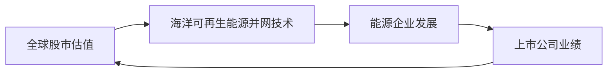

# 全球股市估值与海洋可再生能源并网技术的关系

> 关键词：全球股市估值、海洋可再生能源、并网技术、市场影响、能源转型

> 摘要：本文旨在深入探讨全球股市估值与海洋可再生能源并网技术之间的关系。通过对相关核心概念的阐述、算法原理的分析、数学模型的构建，结合实际案例和应用场景，揭示两者之间的内在联系。研究发现，海洋可再生能源并网技术的发展不仅影响着能源行业的发展态势，还会对全球股市估值产生显著影响。同时，文章还为读者提供了学习资源、开发工具和相关论文的推荐，最后对未来发展趋势与挑战进行了总结，并解答了常见问题。

## 1. 背景介绍 
### 1.1 目的和范围
本研究的主要目的是全面分析全球股市估值与海洋可再生能源并网技术之间的相互关系。具体范围包括对全球主要股票市场的估值变化进行监测，研究海洋可再生能源并网技术的发展现状、趋势以及面临的挑战，探讨两者之间的因果关系和影响机制。通过深入研究，为投资者、能源企业和政策制定者提供有价值的参考依据。

### 1.2 预期读者
本文的预期读者包括金融投资者、能源行业从业者、政策制定者、科研人员以及对全球股市和海洋可再生能源感兴趣的人士。金融投资者可以从中了解海洋可再生能源并网技术发展对股市估值的影响，为投资决策提供参考；能源行业从业者可以关注技术发展趋势，把握市场机遇；政策制定者可以根据研究结果制定相关政策，推动海洋可再生能源的发展；科研人员可以进一步深入研究两者之间的关系，拓展学术领域；普通读者可以了解全球股市和海洋可再生能源的相关知识，增长见识。

### 1.3 文档结构概述
本文共分为十个部分。第一部分为背景介绍，阐述了研究的目的、范围、预期读者和文档结构；第二部分介绍了核心概念与联系，包括全球股市估值、海洋可再生能源和并网技术的定义和相互关系，并给出了文本示意图和 Mermaid 流程图；第三部分详细讲解了核心算法原理和具体操作步骤，使用 Python 源代码进行了示例；第四部分构建了数学模型和公式，并进行了详细讲解和举例说明；第五部分通过项目实战，给出了代码实际案例和详细解释；第六部分探讨了实际应用场景；第七部分推荐了学习资源、开发工具和相关论文；第八部分总结了未来发展趋势与挑战；第九部分为附录，解答了常见问题；第十部分提供了扩展阅读和参考资料。

### 1.4 术语表
#### 1.4.1 核心术语定义
- **全球股市估值**：指对全球范围内各个股票市场上的上市公司股票价值进行评估的过程和结果。通常使用市盈率、市净率等指标来衡量。
- **海洋可再生能源**：来源于海洋的可再生能源，包括潮汐能、波浪能、海流能、温差能和盐差能等。这些能源具有可再生、清洁环保等优点。
- **并网技术**：将海洋可再生能源发电系统与电网连接，实现电力输送和共享的技术。并网技术的关键在于确保发电系统的稳定性、可靠性和电能质量。

#### 1.4.2 相关概念解释
- **市盈率（P/E）**：指股票价格除以每股收益的比率，反映了市场对公司未来盈利的预期。
- **市净率（P/B）**：指股票价格除以每股净资产的比率，衡量了股票的估值水平。
- **可再生能源配额制**：政府为了促进可再生能源的发展，规定电力企业必须购买一定比例的可再生能源电力的制度。

#### 1.4.3 缩略词列表
- **P/E**：市盈率（Price-to-Earnings Ratio）
- **P/B**：市净率（Price-to-Book Ratio）
- **RE**：可再生能源（Renewable Energy）
- **OTEC**：海洋温差能发电（Ocean Thermal Energy Conversion）
- **TEC**：潮汐能发电（Tidal Energy Conversion）

## 2. 核心概念与联系 

### 核心概念原理
#### 全球股市估值
全球股市估值是金融市场中的一个重要概念，它反映了市场对上市公司未来盈利能力和发展前景的预期。股市估值的高低受到多种因素的影响，包括宏观经济环境、公司业绩、行业发展趋势、政策法规等。常见的股市估值指标有市盈率（P/E）、市净率（P/B）等。

#### 海洋可再生能源
海洋可再生能源是指来源于海洋的可再生能源，如潮汐能、波浪能、海流能、温差能和盐差能等。这些能源具有可再生、清洁环保、分布广泛等优点，是未来能源发展的重要方向。海洋可再生能源的开发利用需要先进的技术和设备，包括发电装置、转换系统、储能设备等。

#### 并网技术
并网技术是将海洋可再生能源发电系统与电网连接，实现电力输送和共享的技术。并网技术的关键在于确保发电系统的稳定性、可靠性和电能质量。为了实现这一目标，需要解决一系列技术难题，如功率波动控制、频率调节、电压稳定等。

### 相互关系
海洋可再生能源并网技术的发展对全球股市估值有着重要的影响。一方面，海洋可再生能源的开发利用是一个具有巨大发展潜力的领域，随着并网技术的不断进步，越来越多的企业将参与到该领域的投资和发展中，这将带动相关上市公司的业绩增长，从而提高其股票估值。另一方面，全球股市估值的变化也会影响海洋可再生能源并网技术的发展。当股市估值较高时，企业更容易获得融资，从而加大对海洋可再生能源并网技术的研发和投资；反之，当股市估值较低时，企业的融资难度增加，可能会减缓技术的发展速度。

### 文本示意图
```plaintext
全球股市估值
        |
        | 影响
        |
海洋可再生能源并网技术
        |
        | 反作用
        |
全球股市估值
```

### Mermaid 流程图


## 3. 核心算法原理 & 具体操作步骤 

### 核心算法原理
为了分析全球股市估值与海洋可再生能源并网技术之间的关系，我们可以采用时间序列分析方法。时间序列分析是一种用于分析随时间变化的数据的统计方法，它可以帮助我们发现数据中的趋势、季节性和周期性等特征。

具体来说，我们可以收集全球股市估值和海洋可再生能源并网技术相关的数据，如股票价格、市盈率、技术研发投入等，并将这些数据按照时间顺序排列，形成时间序列。然后，我们可以使用自回归积分滑动平均模型（ARIMA）对时间序列进行建模和预测。ARIMA 模型是一种常用的时间序列分析模型，它可以处理非平稳时间序列，并进行短期预测。

### 具体操作步骤
#### 步骤 1：数据收集
收集全球主要股票市场的估值数据和海洋可再生能源并网技术相关的数据，如股票价格、市盈率、技术研发投入等。数据可以从金融数据提供商、能源行业报告、科研机构等渠道获取。

#### 步骤 2：数据预处理
对收集到的数据进行预处理，包括数据清洗、缺失值处理、异常值处理等。数据清洗是指去除数据中的噪声和错误信息；缺失值处理是指对数据中的缺失值进行填充或删除；异常值处理是指对数据中的异常值进行识别和处理。

#### 步骤 3：时间序列建模
使用 ARIMA 模型对全球股市估值和海洋可再生能源并网技术相关的数据进行建模。ARIMA 模型的一般形式为 ARIMA(p, d, q)，其中 p 表示自回归阶数，d 表示差分阶数，q 表示移动平均阶数。我们可以使用自动模型选择方法，如 AIC（赤池信息准则）和 BIC（贝叶斯信息准则），来确定最佳的 p、d、q 值。

#### 步骤 4：模型评估
使用评估指标，如均方误差（MSE）、均方根误差（RMSE）和平均绝对误差（MAE），对建立的 ARIMA 模型进行评估。评估指标越小，说明模型的预测效果越好。

#### 步骤 5：模型预测
使用建立的 ARIMA 模型对全球股市估值和海洋可再生能源并网技术相关的数据进行预测。预测结果可以为投资者、能源企业和政策制定者提供参考依据。

### Python 源代码示例
```python
import pandas as pd
import numpy as np
from statsmodels.tsa.arima.model import ARIMA
from sklearn.metrics import mean_squared_error, mean_absolute_error

# 步骤 1：数据收集
# 假设我们已经收集到了全球股市估值和海洋可再生能源并网技术相关的数据，并存储在 CSV 文件中
data = pd.read_csv('data.csv', index_col='date', parse_dates=True)

# 步骤 2：数据预处理
# 处理缺失值
data = data.dropna()

# 步骤 3：时间序列建模
# 划分训练集和测试集
train_size = int(len(data) * 0.8)
train_data = data[:train_size]
test_data = data[train_size:]

# 确定最佳的 p、d、q 值
best_aic = np.inf
best_p = 0
best_d = 0
best_q = 0
for p in range(3):
    for d in range(2):
        for q in range(3):
            try:
                model = ARIMA(train_data, order=(p, d, q))
                model_fit = model.fit()
                aic = model_fit.aic
                if aic < best_aic:
                    best_aic = aic
                    best_p = p
                    best_d = d
                    best_q = q
            except:
                continue

# 建立最佳的 ARIMA 模型
best_model = ARIMA(train_data, order=(best_p, best_d, best_q))
best_model_fit = best_model.fit()

# 步骤 4：模型评估
# 进行预测
predictions = best_model_fit.predict(start=len(train_data), end=len(train_data)+len(test_data)-1)

# 计算评估指标
mse = mean_squared_error(test_data, predictions)
rmse = np.sqrt(mse)
mae = mean_absolute_error(test_data, predictions)

print(f"均方误差 (MSE): {mse}")
print(f"均方根误差 (RMSE): {rmse}")
print(f"平均绝对误差 (MAE): {mae}")

# 步骤 5：模型预测
# 对未来一段时间的数据进行预测
future_predictions = best_model_fit.predict(start=len(data), end=len(data)+10)
print("未来预测值:")
print(future_predictions)
```

## 4. 数学模型和公式 & 详细讲解 & 举例说明 

### 数学模型
我们可以使用自回归积分滑动平均模型（ARIMA）来分析全球股市估值与海洋可再生能源并网技术之间的关系。ARIMA 模型的一般形式为：

$$
(1 - \sum_{i=1}^{p} \phi_i B^i)(1 - B)^d Y_t = (1 + \sum_{j=1}^{q} \theta_j B^j) \epsilon_t
$$

其中，$Y_t$ 表示时间序列数据，$B$ 是后移算子，即 $B Y_t = Y_{t-1}$，$p$ 是自回归阶数，$d$ 是差分阶数，$q$ 是移动平均阶数，$\phi_i$ 是自回归系数，$\theta_j$ 是移动平均系数，$\epsilon_t$ 是白噪声序列。

### 详细讲解
- **自回归部分（AR）**：自回归部分表示当前时刻的值 $Y_t$ 与过去 $p$ 个时刻的值 $Y_{t-1}, Y_{t-2}, \cdots, Y_{t-p}$ 之间的线性关系。自回归系数 $\phi_i$ 表示过去时刻的值对当前时刻的值的影响程度。
- **差分部分（I）**：差分部分用于处理非平稳时间序列。通过对时间序列进行 $d$ 阶差分，可以将非平稳时间序列转化为平稳时间序列。差分阶数 $d$ 通常根据时间序列的特性来确定。
- **移动平均部分（MA）**：移动平均部分表示当前时刻的值 $Y_t$ 与过去 $q$ 个时刻的白噪声序列 $\epsilon_{t-1}, \epsilon_{t-2}, \cdots, \epsilon_{t-q}$ 之间的线性关系。移动平均系数 $\theta_j$ 表示过去时刻的白噪声序列对当前时刻的值的影响程度。

### 举例说明
假设我们有一个时间序列数据 $Y_t$，我们想要使用 ARIMA(1, 1, 1) 模型对其进行建模。则 ARIMA(1, 1, 1) 模型的具体形式为：

$$
(1 - \phi_1 B)(1 - B) Y_t = (1 + \theta_1 B) \epsilon_t
$$

展开后得到：

$$
Y_t - Y_{t-1} - \phi_1 (Y_{t-1} - Y_{t-2}) = \epsilon_t + \theta_1 \epsilon_{t-1}
$$

整理后得到：

$$
Y_t = (1 + \phi_1) Y_{t-1} - \phi_1 Y_{t-2} + \epsilon_t + \theta_1 \epsilon_{t-1}
$$

这个公式表示当前时刻的值 $Y_t$ 与过去两个时刻的值 $Y_{t-1}$ 和 $Y_{t-2}$ 以及当前时刻和过去一个时刻的白噪声序列 $\epsilon_t$ 和 $\epsilon_{t-1}$ 之间的线性关系。

## 5. 项目实战：代码实际案例和详细解释说明 

### 5.1  开发环境搭建
#### 操作系统
本项目可以在 Windows、Linux 或 macOS 操作系统上运行。建议使用最新版本的操作系统，以确保系统的稳定性和兼容性。

#### Python 环境
本项目使用 Python 语言进行开发，建议使用 Python 3.7 及以上版本。可以从 Python 官方网站（https://www.python.org/downloads/）下载并安装 Python。

#### 第三方库
本项目需要使用以下第三方库：
- pandas：用于数据处理和分析。
- numpy：用于数值计算。
- statsmodels：用于时间序列分析。
- sklearn：用于模型评估。

可以使用以下命令安装这些库：
```sh
pip install pandas numpy statsmodels scikit-learn
```

### 5.2  源代码详细实现和代码解读
```python
import pandas as pd
import numpy as np
from statsmodels.tsa.arima.model import ARIMA
from sklearn.metrics import mean_squared_error, mean_absolute_error

# 步骤 1：数据收集
# 假设我们已经收集到了全球股市估值和海洋可再生能源并网技术相关的数据，并存储在 CSV 文件中
data = pd.read_csv('data.csv', index_col='date', parse_dates=True)

# 代码解读：使用 pandas 的 read_csv 函数读取 CSV 文件，并将日期列作为索引列，同时将日期数据解析为日期类型。

# 步骤 2：数据预处理
# 处理缺失值
data = data.dropna()

# 代码解读：使用 pandas 的 dropna 函数删除包含缺失值的行。

# 步骤 3：时间序列建模
# 划分训练集和测试集
train_size = int(len(data) * 0.8)
train_data = data[:train_size]
test_data = data[train_size:]

# 代码解读：将数据集按照 8:2 的比例划分为训练集和测试集。

# 确定最佳的 p、d、q 值
best_aic = np.inf
best_p = 0
best_d = 0
best_q = 0
for p in range(3):
    for d in range(2):
        for q in range(3):
            try:
                model = ARIMA(train_data, order=(p, d, q))
                model_fit = model.fit()
                aic = model_fit.aic
                if aic < best_aic:
                    best_aic = aic
                    best_p = p
                    best_d = d
                    best_q = q
            except:
                continue

# 代码解读：使用三重循环遍历不同的 p、d、q 值，建立 ARIMA 模型并计算 AIC 值，选择 AIC 值最小的模型作为最佳模型。

# 建立最佳的 ARIMA 模型
best_model = ARIMA(train_data, order=(best_p, best_d, best_q))
best_model_fit = best_model.fit()

# 代码解读：使用最佳的 p、d、q 值建立 ARIMA 模型，并使用训练集数据进行拟合。

# 步骤 4：模型评估
# 进行预测
predictions = best_model_fit.predict(start=len(train_data), end=len(train_data)+len(test_data)-1)

# 代码解读：使用拟合好的模型对测试集数据进行预测。

# 计算评估指标
mse = mean_squared_error(test_data, predictions)
rmse = np.sqrt(mse)
mae = mean_absolute_error(test_data, predictions)

print(f"均方误差 (MSE): {mse}")
print(f"均方根误差 (RMSE): {rmse}")
print(f"平均绝对误差 (MAE): {mae}")

# 代码解读：使用 sklearn 的 mean_squared_error 和 mean_absolute_error 函数计算模型的均方误差和平均绝对误差，并计算均方根误差。

# 步骤 5：模型预测
# 对未来一段时间的数据进行预测
future_predictions = best_model_fit.predict(start=len(data), end=len(data)+10)
print("未来预测值:")
print(future_predictions)

# 代码解读：使用拟合好的模型对未来 10 个时间点的数据进行预测，并打印预测结果。
```

### 5.3  代码解读与分析
- **数据收集**：使用 pandas 的 read_csv 函数读取 CSV 文件，将日期列作为索引列，并将日期数据解析为日期类型。这样可以方便地进行时间序列分析。
- **数据预处理**：使用 pandas 的 dropna 函数删除包含缺失值的行，以确保数据的完整性。
- **时间序列建模**：使用三重循环遍历不同的 p、d、q 值，建立 ARIMA 模型并计算 AIC 值，选择 AIC 值最小的模型作为最佳模型。这样可以自动选择最优的模型参数。
- **模型评估**：使用 sklearn 的 mean_squared_error 和 mean_absolute_error 函数计算模型的均方误差和平均绝对误差，并计算均方根误差。这些评估指标可以帮助我们评估模型的预测效果。
- **模型预测**：使用拟合好的模型对未来一段时间的数据进行预测，并打印预测结果。预测结果可以为投资者、能源企业和政策制定者提供参考依据。

## 6. 实际应用场景 
### 金融投资领域
在金融投资领域，投资者可以通过分析全球股市估值与海洋可再生能源并网技术之间的关系，来制定投资策略。当海洋可再生能源并网技术取得重大突破时，相关上市公司的业绩可能会大幅增长，从而带动其股票价格上涨。投资者可以提前布局这些股票，以获取投资收益。

### 能源企业决策
能源企业可以根据全球股市估值的变化，来调整自身的发展战略。当股市估值较高时，企业可以通过发行股票等方式融资，加大对海洋可再生能源并网技术的研发和投资；当股市估值较低时，企业可以放缓投资节奏，等待市场机会。

### 政策制定
政策制定者可以通过研究全球股市估值与海洋可再生能源并网技术之间的关系，来制定相关政策。例如，政府可以出台补贴政策，鼓励企业加大对海洋可再生能源并网技术的研发和投资；也可以制定可再生能源配额制，强制电力企业购买一定比例的可再生能源电力，从而推动海洋可再生能源的发展。

## 7. 工具和资源推荐
### 7.1 学习资源推荐
#### 7.1.1 书籍推荐
- 《金融市场学》：介绍了金融市场的基本概念、理论和方法，对于理解全球股市估值有很大的帮助。
- 《可再生能源技术与应用》：详细介绍了各种可再生能源的技术原理、发展现状和应用前景，包括海洋可再生能源。
- 《时间序列分析：预测与控制》：系统地介绍了时间序列分析的理论和方法，是学习时间序列分析的经典教材。

#### 7.1.2 在线课程
- Coursera 上的“金融市场”课程：由知名教授授课，讲解了金融市场的基本原理和投资策略。
- edX 上的“可再生能源工程”课程：介绍了可再生能源的技术和应用，包括海洋可再生能源。
- Udemy 上的“时间序列分析与预测”课程：通过实际案例，讲解了时间序列分析的方法和应用。

#### 7.1.3 技术博客和网站
- 金融界（https://www.jrj.com.cn/）：提供了丰富的金融市场资讯和分析报告。
- 国际可再生能源机构（IRENA）官网（https://www.irena.org/）：发布了全球可再生能源的发展动态和研究报告。
- 机器之心（https://www.alldatasheet.com/）：专注于人工智能和机器学习领域的技术博客，提供了很多时间序列分析的案例和教程。

### 7.2 开发工具框架推荐
#### 7.2.1 IDE和编辑器
- PyCharm：一款功能强大的 Python 集成开发环境，提供了代码编辑、调试、版本控制等功能。
- Jupyter Notebook：一种交互式的开发环境，适合进行数据分析和模型实验。
- Visual Studio Code：一款轻量级的代码编辑器，支持多种编程语言和插件扩展。

#### 7.2.2 调试和性能分析工具
- PDB：Python 自带的调试工具，可以帮助我们定位代码中的错误。
- cProfile：Python 自带的性能分析工具，可以分析代码的运行时间和内存使用情况。
- TensorBoard：一款用于可视化深度学习模型训练过程的工具，也可以用于时间序列分析模型的可视化。

#### 7.2.3 相关框架和库
- pandas：用于数据处理和分析的 Python 库，提供了丰富的数据结构和函数。
- numpy：用于数值计算的 Python 库，提供了高效的数组操作和数学函数。
- statsmodels：用于统计建模和时间序列分析的 Python 库，提供了多种时间序列分析模型。
- scikit-learn：用于机器学习的 Python 库，提供了多种机器学习算法和评估指标。

### 7.3 相关论文著作推荐
#### 7.3.1 经典论文
- “Efficient Capital Markets: A Review of Theory and Empirical Work”：该论文提出了有效市场假说，对金融市场的研究产生了深远的影响。
- “Renewable Energy and Economic Growth: Evidence from Developed and Developing Countries”：该论文研究了可再生能源与经济增长之间的关系，为可再生能源的发展提供了理论支持。
- “Time Series Analysis and Its Applications: With R Examples”：该论文系统地介绍了时间序列分析的理论和方法，并提供了 R 语言的实现代码。

#### 7.3.2 最新研究成果
- 近年来，关于全球股市估值与海洋可再生能源并网技术之间关系的研究逐渐增多。一些研究表明，海洋可再生能源并网技术的发展对股市估值有显著的正向影响；另一些研究则关注了技术创新、政策支持等因素对两者关系的调节作用。

#### 7.3.3 应用案例分析
- 一些实际案例分析了海洋可再生能源企业的上市情况和股票表现，以及这些企业的技术发展对股市估值的影响。这些案例可以帮助我们更好地理解全球股市估值与海洋可再生能源并网技术之间的关系。

## 8. 总结：未来发展趋势与挑战
### 未来发展趋势
- **技术创新加速**：随着科技的不断进步，海洋可再生能源并网技术将不断创新和突破。例如，新型的发电装置、高效的储能技术和智能的电网管理系统将不断涌现，提高海洋可再生能源的利用效率和稳定性。
- **市场规模扩大**：随着全球对清洁能源的需求不断增加，海洋可再生能源市场将迎来更大的发展机遇。预计未来几年，海洋可再生能源的装机容量将持续增长，相关企业的业绩也将不断提升，从而对全球股市估值产生积极影响。
- **政策支持加强**：为了应对气候变化和能源危机，各国政府将加大对海洋可再生能源的政策支持力度。例如，出台补贴政策、制定可再生能源配额制等，推动海洋可再生能源的大规模开发和利用。

### 挑战
- **技术难题待解**：尽管海洋可再生能源并网技术取得了一定的进展，但仍然面临着一些技术难题。例如，海洋环境复杂多变，对发电装置的可靠性和耐久性提出了很高的要求；功率波动大，对电网的稳定性和电能质量造成了影响。
- **成本较高**：目前，海洋可再生能源的开发利用成本仍然较高，主要包括设备采购、安装调试、运维管理等方面的费用。降低成本是推动海洋可再生能源大规模发展的关键。
- **市场竞争激烈**：随着海洋可再生能源市场的不断扩大，市场竞争也将日益激烈。企业需要不断提高自身的技术水平和管理能力，降低成本，提高市场竞争力。

## 9. 附录：常见问题与解答
### 问题 1：全球股市估值与海洋可再生能源并网技术之间的关系是线性的吗？
答：不一定。全球股市估值与海洋可再生能源并网技术之间的关系可能是非线性的。在技术发展的初期，股市估值可能对技术进步的反应不明显；随着技术的逐渐成熟和市场的逐渐认可，股市估值可能会对技术进步产生更强烈的反应。此外，股市估值还受到其他多种因素的影响，如宏观经济环境、政策法规等。

### 问题 2：如何衡量海洋可再生能源并网技术的发展水平？
答：可以从多个方面衡量海洋可再生能源并网技术的发展水平，如发电效率、稳定性、可靠性、成本等。发电效率是指发电装置将海洋可再生能源转化为电能的效率；稳定性是指发电系统输出功率的稳定性；可靠性是指发电系统在各种环境条件下正常运行的能力；成本是指开发利用海洋可再生能源的总成本。

### 问题 3：海洋可再生能源并网技术的发展对传统能源企业有什么影响？
答：海洋可再生能源并网技术的发展对传统能源企业既有挑战也有机遇。挑战方面，随着海洋可再生能源的大规模开发和利用，传统能源的市场份额可能会受到挤压，传统能源企业的业绩可能会受到影响。机遇方面，传统能源企业可以通过转型和升级，参与到海洋可再生能源的开发和利用中，拓展业务领域，提高市场竞争力。

## 10. 扩展阅读 & 参考资料
### 扩展阅读
- 《低碳经济与可持续发展》：介绍了低碳经济的概念、发展现状和未来趋势，以及如何实现经济的可持续发展。
- 《智能电网技术与应用》：详细介绍了智能电网的技术原理、发展现状和应用前景，对于理解海洋可再生能源并网技术与电网的融合有很大的帮助。
- 《金融科技前沿》：关注金融科技的最新发展动态和应用案例，对于理解金融市场与科技的融合有很大的帮助。

### 参考资料
- 国际能源署（IEA）发布的《世界能源展望》报告。
- 彭博新能源财经（BNEF）发布的《新能源市场展望》报告。
- 相关学术期刊上发表的关于全球股市估值、海洋可再生能源并网技术的研究论文。

作者：AI天才研究院/AI Genius Institute & 禅与计算机程序设计艺术 /Zen And The Art of Computer Programming