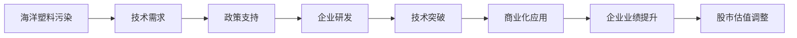

# 全球股市估值与海洋塑料降解技术的关联

> 关键词：全球股市估值、海洋塑料降解技术、环境经济、投资趋势、可持续发展

> 摘要：本文旨在深入探讨全球股市估值与海洋塑料降解技术之间的潜在关联。随着环境问题日益受到关注，海洋塑料污染成为全球焦点。海洋塑料降解技术的发展不仅关乎环境保护，还对经济领域产生影响，尤其是在全球股市的估值方面。文章将从背景介绍入手，阐述核心概念及其联系，分析相关算法原理和数学模型，通过项目实战案例进行详细说明，探讨实际应用场景，推荐相关工具和资源，最后总结未来发展趋势与挑战，并解答常见问题。

## 1. 背景介绍 
### 1.1 目的和范围
本研究的主要目的是揭示全球股市估值与海洋塑料降解技术之间的内在联系。全球股市作为经济的重要组成部分，其估值受到多种因素的影响，而环境技术的发展逐渐成为其中一个不可忽视的因素。海洋塑料降解技术作为解决海洋塑料污染问题的关键手段，其研发、应用和推广过程中涉及到的企业和行业，必然会对股市产生一定的影响。本文的研究范围涵盖了全球主要股票市场，以及与海洋塑料降解技术相关的各类企业，包括技术研发企业、材料生产企业和环保服务企业等。

### 1.2 预期读者
本文预期读者包括金融投资领域的专业人士，如股票分析师、基金经理和投资者，他们可以从本文中了解海洋塑料降解技术对股市估值的影响，为投资决策提供参考。同时，环境科学领域的研究人员和技术开发者也可以通过本文了解技术发展在经济层面的影响，促进技术与经济的更好结合。此外，政策制定者和监管机构也可以从中获取信息，制定相关政策，推动海洋塑料污染治理和股市的健康发展。

### 1.3 文档结构概述
本文首先介绍研究的背景信息，包括目的、预期读者和文档结构。接着，阐述全球股市估值和海洋塑料降解技术的核心概念及其联系，通过文本示意图和 Mermaid 流程图进行直观展示。然后，详细讲解相关的核心算法原理和具体操作步骤，并使用 Python 源代码进行阐述。之后，介绍数学模型和公式，并通过举例说明其应用。在项目实战部分，给出代码实际案例并进行详细解释。随后，探讨实际应用场景，推荐相关的工具和资源。最后，总结未来发展趋势与挑战，解答常见问题，并提供扩展阅读和参考资料。

### 1.4 术语表
#### 1.4.1 核心术语定义
- **全球股市估值**：指对全球范围内各个股票市场上上市公司股票价值的评估，通常通过各种估值方法，如市盈率、市净率等，来确定股票的合理价格范围。
- **海洋塑料降解技术**：是指用于分解和处理海洋中塑料垃圾的一系列技术手段，包括生物降解、光降解、热降解等方法，旨在减少海洋塑料污染，保护海洋生态环境。
- **环境经济**：研究环境与经济之间相互关系的学科，主要探讨如何在经济发展过程中实现环境保护，以及环境问题对经济的影响。

#### 1.4.2 相关概念解释
- **可持续发展**：既满足当代人的需求，又不损害后代人满足其需求的能力的发展模式。在股市和海洋塑料降解技术的背景下，可持续发展意味着企业在追求经济利益的同时，也要关注环境保护和社会责任，以实现长期的稳定发展。
- **绿色投资**：将资金投入到具有环保和可持续发展特征的项目和企业中，以获取经济回报的同时，推动环境改善和社会可持续发展。与海洋塑料降解技术相关的企业往往是绿色投资的重点对象。

#### 1.4.3 缩略词列表
- **PE**：市盈率（Price-to-Earnings Ratio），是股票价格除以每股收益的比率，用于衡量股票的估值水平。
- **PB**：市净率（Price-to-Book Ratio），是股票价格与每股净资产的比率，反映了股票的市场价格相对于其账面价值的倍数。

## 2. 核心概念与联系 

### 核心概念原理
#### 全球股市估值原理
全球股市估值是基于对上市公司未来盈利能力的预期。投资者通过分析公司的财务报表、行业前景、宏观经济环境等因素，运用各种估值模型来确定股票的合理价值。常见的估值模型包括现金流折现模型（DCF）、相对估值模型（如市盈率、市净率模型）等。现金流折现模型通过预测公司未来的现金流量，并将其折现到当前，以确定公司的内在价值。相对估值模型则是通过比较同行业其他公司的估值指标，来评估目标公司的价值。

#### 海洋塑料降解技术原理
海洋塑料降解技术主要基于物理、化学和生物的原理。物理降解方法通过加热、光照等物理手段，使塑料分子链断裂，从而实现降解。化学降解方法则利用化学反应，如氧化、水解等，将塑料分解为小分子物质。生物降解方法是利用微生物的代谢作用，将塑料分解为二氧化碳和水等无害物质。不同的降解技术适用于不同类型的塑料，并且在降解效率、成本和环境影响等方面存在差异。

### 架构的文本示意图
全球股市估值与海洋塑料降解技术之间的联系可以通过以下架构来表示：

海洋塑料污染问题引发了对海洋塑料降解技术的需求。政府和社会对环境保护的重视促使相关政策的出台，鼓励企业加大对海洋塑料降解技术的研发和应用。这些企业在技术研发过程中需要投入大量的资金，包括人力、物力和财力。一旦技术取得突破并实现商业化应用，企业的业绩可能会得到显著提升。投资者会根据企业的发展前景和业绩表现，调整对相关企业股票的估值，从而影响全球股市的估值。

### Mermaid 流程图


## 3. 核心算法原理 & 具体操作步骤 

### 核心算法原理
#### 股市估值算法
这里以现金流折现模型为例，介绍股市估值的算法原理。现金流折现模型的基本思想是，股票的价值等于其未来所有现金流量的现值之和。其计算公式为：

$$V = \sum_{t=1}^{n} \frac{CF_t}{(1 + r)^t}$$

其中，$V$ 表示股票的价值，$CF_t$ 表示第 $t$ 期的现金流量，$r$ 表示折现率，$n$ 表示预测期数。

#### 技术评估算法
对于海洋塑料降解技术的评估，可以采用技术成熟度等级（TRL）评估方法。TRL 是一种用于衡量技术发展阶段的指标，从 1 级（基本原理观察和报告）到 9 级（实际系统完成并通过试验验证）。评估过程需要考虑技术的可行性、可靠性、成本效益等因素。

### 具体操作步骤
#### 股市估值操作步骤
1. **预测现金流量**：分析公司的历史财务数据和行业发展趋势，预测未来各期的现金流量。
2. **确定折现率**：折现率通常由无风险利率和风险溢价组成。无风险利率可以参考国债收益率，风险溢价则根据公司的风险特征进行调整。
3. **计算现值**：将预测的现金流量按照折现率进行折现，得到各期现金流量的现值。
4. **求和得到股票价值**：将各期现金流量的现值相加，得到股票的价值。

#### 技术评估操作步骤
1. **收集技术信息**：包括技术的原理、实验数据、应用案例等。
2. **评估技术指标**：根据 TRL 评估标准，对技术的可行性、可靠性、成本效益等指标进行评估。
3. **确定技术成熟度等级**：根据评估结果，确定技术的 TRL 等级。

### Python 源代码实现
```python
import numpy as np

# 股市估值：现金流折现模型
def dcf_valuation(cash_flows, discount_rate):
    """
    计算股票的现金流折现价值
    :param cash_flows: 未来各期的现金流量列表
    :param discount_rate: 折现率
    :return: 股票的价值
    """
    n = len(cash_flows)
    present_values = []
    for t in range(n):
        pv = cash_flows[t] / ((1 + discount_rate) ** (t + 1))
        present_values.append(pv)
    return np.sum(present_values)

# 示例数据
cash_flows = [100, 120, 150, 180, 200]
discount_rate = 0.1

# 计算股票价值
stock_value = dcf_valuation(cash_flows, discount_rate)
print(f"股票的现金流折现价值为: {stock_value}")
```

## 4. 数学模型和公式 & 详细讲解 & 举例说明 

### 股市估值数学模型和公式
#### 现金流折现模型
如前文所述，现金流折现模型的公式为：

$$V = \sum_{t=1}^{n} \frac{CF_t}{(1 + r)^t}$$

详细讲解：
- $V$ 表示股票的价值，是我们要计算的目标值。
- $CF_t$ 表示第 $t$ 期的现金流量，它反映了公司在该时期的实际盈利情况。现金流量可以分为经营活动现金流量、投资活动现金流量和筹资活动现金流量等。在实际应用中，通常使用经营活动现金流量作为主要的预测指标。
- $r$ 表示折现率，它考虑了资金的时间价值和投资风险。折现率越高，未来现金流量的现值越低，股票的价值也就越低。
- $n$ 表示预测期数，通常根据公司的发展阶段和行业特点来确定。对于处于稳定发展阶段的公司，可以预测较长的时期；对于处于快速发展阶段的公司，预测期数可以相对较短。

举例说明：
假设一家公司未来 5 年的现金流量分别为 100 万元、120 万元、150 万元、180 万元和 200 万元，折现率为 10%。则该公司股票的价值为：

$$V = \frac{100}{(1 + 0.1)^1} + \frac{120}{(1 + 0.1)^2} + \frac{150}{(1 + 0.1)^3} + \frac{180}{(1 + 0.1)^4} + \frac{200}{(1 + 0.1)^5}$$

$$V \approx 90.91 + 99.17 + 112.69 + 122.94 + 124.18 = 549.89 \text{（万元）}$$

#### 市盈率模型
市盈率模型的公式为：

$$P = EPS \times PE$$

其中，$P$ 表示股票的价格，$EPS$ 表示每股收益，$PE$ 表示市盈率。

详细讲解：
- $EPS$ 是公司净利润除以总股本得到的每股盈利指标，反映了公司的盈利能力。
- $PE$ 是市场对公司盈利的预期倍数，通常根据同行业其他公司的市盈率水平和公司的发展前景来确定。

举例说明：
假设一家公司的每股收益为 2 元，同行业平均市盈率为 15 倍。则该公司股票的价格为：

$$P = 2 \times 15 = 30 \text{（元）}$$

### 技术评估数学模型和公式
#### 技术成熟度等级（TRL）评估模型
TRL 评估模型虽然没有严格的数学公式，但可以通过以下方式进行量化评估。假设我们从技术可行性、可靠性和成本效益三个方面对技术进行评估，每个方面的权重分别为 $w_1$、$w_2$ 和 $w_3$，且 $w_1 + w_2 + w_3 = 1$。每个方面的得分分别为 $s_1$、$s_2$ 和 $s_3$，则技术的综合得分 $S$ 为：

$$S = w_1s_1 + w_2s_2 + w_3s_3$$

详细讲解：
- $w_1$、$w_2$ 和 $w_3$ 表示各评估方面的重要程度，根据具体情况进行设定。例如，如果技术的可行性是最重要的因素，可以将 $w_1$ 设定为较大的值。
- $s_1$、$s_2$ 和 $s_3$ 表示各评估方面的得分，可以根据预先设定的评分标准进行打分。例如，技术可行性可以根据实验结果和理论分析进行评分，可靠性可以根据设备的运行时间和故障率进行评分，成本效益可以根据成本与效益的比值进行评分。

举例说明：
假设 $w_1 = 0.4$，$w_2 = 0.3$，$w_3 = 0.3$，$s_1 = 8$，$s_2 = 7$，$s_3 = 6$。则技术的综合得分 $S$ 为：

$$S = 0.4 \times 8 + 0.3 \times 7 + 0.3 \times 6 = 3.2 + 2.1 + 1.8 = 7.1$$

根据 TRL 评估标准，综合得分 7.1 对应的技术成熟度等级可能为 7 级（系统原型在运行环境中进行验证）。

## 5. 项目实战：代码实际案例和详细解释说明 

### 5.1  开发环境搭建
#### 硬件环境
- 计算机：建议使用性能较好的笔记本电脑或台式机，具备至少 8GB 内存和 256GB 硬盘空间。
- 处理器：Intel Core i5 及以上处理器。

#### 软件环境
- 操作系统：Windows 10、macOS 或 Linux。
- Python 环境：建议安装 Python 3.7 及以上版本。可以从 Python 官方网站（https://www.python.org/downloads/）下载安装包进行安装。
- 开发工具：推荐使用 PyCharm 或 Jupyter Notebook。PyCharm 是一款功能强大的 Python 集成开发环境，提供代码编辑、调试、版本控制等功能；Jupyter Notebook 则适合进行交互式编程和数据分析，支持代码、文本、图像等多种元素的混合展示。

#### 安装必要的 Python 库
在命令行中使用以下命令安装必要的 Python 库：
```sh
pip install numpy pandas matplotlib
```

### 5.2  源代码详细实现和代码解读
#### 项目背景
假设我们要研究一家从事海洋塑料降解技术研发的公司的股票估值。我们已经收集了该公司过去 5 年的财务数据，包括每年的净利润和现金流量，并且预测了未来 5 年的现金流量。我们将使用现金流折现模型来计算该公司股票的价值。

#### 源代码实现
```python
import numpy as np
import pandas as pd
import matplotlib.pyplot as plt

# 读取历史财务数据
financial_data = pd.read_csv('financial_data.csv')

# 提取过去 5 年的现金流量
past_cash_flows = financial_data['CashFlow'][-5:].values

# 预测未来 5 年的现金流量
# 这里简单假设未来现金流量以每年 10% 的增长率增长
future_cash_flows = []
last_cash_flow = past_cash_flows[-1]
for i in range(5):
    next_cash_flow = last_cash_flow * (1 + 0.1)
    future_cash_flows.append(next_cash_flow)
    last_cash_flow = next_cash_flow

# 合并过去和未来的现金流量
all_cash_flows = np.concatenate((past_cash_flows, future_cash_flows))

# 确定折现率
discount_rate = 0.1

# 计算股票的现金流折现价值
def dcf_valuation(cash_flows, discount_rate):
    n = len(cash_flows)
    present_values = []
    for t in range(n):
        pv = cash_flows[t] / ((1 + discount_rate) ** (t + 1))
        present_values.append(pv)
    return np.sum(present_values)

stock_value = dcf_valuation(all_cash_flows, discount_rate)

# 可视化现金流量和现值
years = np.arange(len(all_cash_flows))
present_values = []
for t in range(len(all_cash_flows)):
    pv = all_cash_flows[t] / ((1 + discount_rate) ** (t + 1))
    present_values.append(pv)

plt.figure(figsize=(10, 6))
plt.plot(years, all_cash_flows, label='Cash Flows')
plt.plot(years, present_values, label='Present Values')
plt.xlabel('Year')
plt.ylabel('Amount')
plt.title('Cash Flows and Present Values')
plt.legend()
plt.show()

print(f"该公司股票的现金流折现价值为: {stock_value}")
```

#### 代码解读
1. **读取历史财务数据**：使用 `pandas` 库的 `read_csv` 函数读取存储在 `financial_data.csv` 文件中的历史财务数据。
2. **提取过去 5 年的现金流量**：从财务数据中提取过去 5 年的现金流量数据。
3. **预测未来 5 年的现金流量**：这里简单假设未来现金流量以每年 10% 的增长率增长，通过循环计算未来 5 年的现金流量。
4. **合并过去和未来的现金流量**：将过去和未来的现金流量合并为一个数组。
5. **确定折现率**：假设折现率为 10%。
6. **计算股票的现金流折现价值**：定义 `dcf_valuation` 函数，使用现金流折现模型计算股票的价值。
7. **可视化现金流量和现值**：使用 `matplotlib` 库绘制现金流量和现值的折线图，直观展示两者的变化趋势。
8. **输出结果**：打印该公司股票的现金流折现价值。

### 5.3  代码解读与分析
#### 优点
- **数据驱动**：通过读取历史财务数据和预测未来现金流量，使股票估值更加基于实际情况。
- **可视化展示**：使用折线图直观展示现金流量和现值的变化趋势，有助于更好地理解数据和模型的结果。
- **模块化设计**：将现金流折现计算封装在 `dcf_valuation` 函数中，提高了代码的复用性和可维护性。

#### 局限性
- **预测假设简单**：未来现金流量的预测假设过于简单，仅考虑了固定的增长率，没有考虑市场变化、技术突破等因素的影响。
- **折现率确定主观性**：折现率的确定具有一定的主观性，不同的投资者可能会有不同的看法，这会影响股票估值的准确性。
- **数据质量依赖**：股票估值结果高度依赖于历史财务数据的质量和准确性，如果数据存在误差或缺失，可能会导致估值结果不准确。

## 6. 实际应用场景 
### 投资决策
投资者可以根据海洋塑料降解技术的发展趋势和相关企业的技术实力，调整投资组合。如果某家企业在海洋塑料降解技术方面取得了重大突破，其未来的盈利能力可能会显著提升，投资者可以考虑增加对该企业股票的投资。相反，如果某家企业在技术研发方面进展缓慢，面临技术淘汰的风险，投资者可以减少对该企业股票的投资。

### 企业战略规划
对于从事海洋塑料降解技术研发和应用的企业来说，了解全球股市估值与技术发展的关联，可以帮助企业制定合理的战略规划。企业可以根据股市的反馈，调整研发投入和市场推广策略，提高企业的市场竞争力和估值水平。例如，如果股市对海洋塑料降解技术的关注度较高，企业可以加大研发投入，加快技术商业化进程，以获取更多的市场份额和利润。

### 政策制定
政府和监管机构可以根据全球股市估值与海洋塑料降解技术的关联，制定相关政策，推动海洋塑料污染治理和股市的健康发展。政府可以通过财政补贴、税收优惠等政策，鼓励企业加大对海洋塑料降解技术的研发和应用。同时，加强对股市的监管，规范企业的信息披露，保护投资者的合法权益。

### 风险管理
金融机构可以将海洋塑料降解技术的发展风险纳入风险管理体系。例如，银行在为相关企业提供贷款时，可以评估企业的技术实力和市场前景，合理确定贷款额度和利率。保险公司可以开发针对海洋塑料降解技术研发和应用的保险产品，为企业提供风险保障。

## 7. 工具和资源推荐
### 7.1 学习资源推荐
#### 7.1.1 书籍推荐
- 《证券分析》（Security Analysis）：由本杰明·格雷厄姆（Benjamin Graham）和戴维·多德（David Dodd）所著，是价值投资领域的经典著作，详细介绍了股票估值的方法和原理。
- 《环境科学与工程原理》（Principles of Environmental Science and Engineering）：涵盖了环境科学和工程的基础知识，包括海洋污染治理和塑料降解技术等方面的内容。
- 《可持续金融》（Sustainable Finance）：探讨了金融与可持续发展之间的关系，介绍了绿色投资、环境风险管理等方面的理论和实践。

#### 7.1.2 在线课程
- Coursera 平台上的“投资学原理”（Principles of Investment）课程：由知名大学教授授课，系统介绍了投资学的基本理论和方法，包括股票估值、资产配置等内容。
- edX 平台上的“环境科学与可持续发展”（Environmental Science and Sustainability）课程：提供了环境科学和可持续发展的全面知识，包括海洋塑料污染问题和相关技术解决方案。
- Udemy 平台上的“Python 数据分析实战”（Python Data Analysis in Practice）课程：帮助学习者掌握 Python 在数据分析和建模方面的应用，对于进行股市估值和技术评估的数据分析非常有帮助。

#### 7.1.3 技术博客和网站
- Seeking Alpha：是一个知名的金融投资博客平台，提供了大量关于股票分析、市场评论和投资策略的文章，其中也包括对环保相关企业的分析。
- Environmental Science & Technology：美国化学会出版的环境科学领域的权威期刊网站，提供了最新的环境科学研究成果和技术进展，包括海洋塑料降解技术方面的研究。
- CleanTechnica：专注于清洁能源和环保技术的新闻和分析网站，经常报道海洋塑料降解技术的最新动态和企业发展情况。

### 7.2 开发工具框架推荐
#### 7.2.1 IDE和编辑器
- PyCharm：功能强大的 Python 集成开发环境，提供代码编辑、调试、版本控制等功能，适合专业的 Python 开发者。
- Jupyter Notebook：交互式编程环境，支持代码、文本、图像等多种元素的混合展示，非常适合进行数据分析和模型验证。
- Visual Studio Code：轻量级的代码编辑器，支持多种编程语言和插件扩展，具有丰富的开发工具和功能。

#### 7.2.2 调试和性能分析工具
- PySnooper：一个简单易用的 Python 调试工具，可以自动记录函数的执行过程和变量的值，帮助开发者快速定位问题。
- cProfile：Python 内置的性能分析工具，可以统计函数的调用次数、执行时间等信息，帮助开发者优化代码性能。
- Memory Profiler：用于分析 Python 程序内存使用情况的工具，可以帮助开发者找出内存泄漏和高内存消耗的代码部分。

#### 7.2.3 相关框架和库
- Pandas：强大的数据分析库，提供了数据结构和数据分析工具，方便进行数据处理和清洗。
- NumPy：用于科学计算的基础库，提供了高效的数组操作和数学函数，是进行数值计算和模型实现的重要工具。
- Matplotlib：常用的绘图库，可以绘制各种类型的图表，如折线图、柱状图、散点图等，用于数据可视化。

### 7.3 相关论文著作推荐
#### 7.3.1 经典论文
- “Valuation of Common Stocks”（普通股估值）：由约翰·伯尔·威廉姆斯（John Burr Williams）所著，首次提出了现金流折现模型，为股票估值理论奠定了基础。
- “The Economics of Plastic Pollution”（塑料污染的经济学）：探讨了塑料污染对经济的影响，以及治理塑料污染的经济成本和效益。
- “Biodegradation of Plastics: A Critical Review”（塑料的生物降解：批判性综述）：对塑料生物降解技术的研究进展进行了全面的综述和分析。

#### 7.3.2 最新研究成果
- 近年来，许多学术期刊上发表了关于海洋塑料降解技术和股市估值的最新研究成果。例如，《Nature》《Science》等顶级期刊上的相关研究论文，探讨了新型海洋塑料降解技术的研发和应用，以及环境因素对股市估值的影响。
- 一些研究机构和智库也发布了相关的研究报告，如麦肯锡全球研究所（McKinsey Global Institute）的《可持续金融的未来》（The Future of Sustainable Finance）报告，分析了可持续发展趋势对金融市场的影响。

#### 7.3.3 应用案例分析
- 可以参考一些实际的企业案例，了解海洋塑料降解技术企业的发展历程和股市表现。例如，一些专注于生物降解塑料研发和生产的企业，如NatureWorks、Danimer Scientific等，它们的技术创新和市场拓展对其股价产生了重要影响。
- 一些投资机构的研究报告也会对相关企业进行案例分析，如贝莱德（BlackRock）、先锋集团（Vanguard）等发布的关于绿色投资的报告，分析了环保企业的投资价值和风险。

## 8. 总结：未来发展趋势与挑战
### 未来发展趋势
#### 技术创新加速
随着科技的不断进步，海洋塑料降解技术将不断创新和发展。新型的生物降解材料、高效的降解工艺和智能化的监测设备将不断涌现，提高海洋塑料污染治理的效率和效果。

#### 市场需求增长
随着全球对环境保护的重视程度不断提高，消费者对环保产品的需求将不断增加。海洋塑料降解技术相关的产品和服务市场将迎来广阔的发展空间，如可降解塑料制品、海洋垃圾清理服务等。

#### 政策支持加强
政府和国际组织将加大对海洋塑料污染治理的政策支持力度。通过制定严格的环保法规、提供财政补贴和税收优惠等措施，鼓励企业加大对海洋塑料降解技术的研发和应用，推动行业的发展。

#### 金融市场关注增加
金融市场对海洋塑料降解技术的关注度将不断提高。绿色投资将成为一种重要的投资趋势，更多的资金将流入相关企业和项目。同时，股市对海洋塑料降解技术企业的估值也将更加合理和准确，反映企业的真实价值和发展潜力。

### 挑战
#### 技术难题
虽然海洋塑料降解技术取得了一定的进展，但仍然面临一些技术难题。例如，某些塑料的降解难度较大，需要更高的温度、压力或特定的微生物环境；降解过程中可能会产生二次污染等问题。解决这些技术难题需要进一步的研究和创新。

#### 成本较高
目前，海洋塑料降解技术的成本相对较高，限制了其大规模应用。生物降解材料的生产成本较高，降解设备的投资和运营成本也较大。降低技术成本，提高成本效益，是推动海洋塑料降解技术产业化发展的关键。

#### 市场竞争激烈
随着海洋塑料降解技术市场的不断扩大，竞争也将日益激烈。众多企业纷纷进入该领域，市场上的产品和服务同质化现象较为严重。企业需要不断提高自身的技术实力和市场竞争力，才能在激烈的市场竞争中立于不败之地。

#### 政策执行难度
虽然政府出台了一系列支持海洋塑料污染治理的政策，但政策的执行难度较大。一些地区存在监管不力、执法不严等问题，导致政策的实施效果不理想。加强政策的执行力度，确保政策的有效落实，是推动海洋塑料污染治理工作的重要保障。

## 9. 附录：常见问题与解答
### 问题 1：海洋塑料降解技术对股市估值的影响有多大？
答：海洋塑料降解技术对股市估值的影响程度取决于多个因素。如果某家企业在该技术领域取得重大突破，并且能够实现商业化应用，其业绩可能会显著提升，从而对股市估值产生积极影响。相反，如果技术研发进展缓慢或面临技术淘汰的风险，可能会导致企业估值下降。此外，市场对环境问题的关注度、政策支持力度等因素也会影响技术对股市估值的影响程度。

### 问题 2：如何评估海洋塑料降解技术的发展前景？
答：可以从以下几个方面评估海洋塑料降解技术的发展前景：
1. **技术可行性**：考察技术的原理是否科学合理，实验结果是否可靠，是否能够在实际环境中有效应用。
2. **成本效益**：分析技术的研发成本、生产成本和运营成本，以及其带来的经济效益和环境效益。如果技术成本过高，而效益不明显，其发展前景可能受到限制。
3. **市场需求**：了解市场对海洋塑料降解技术相关产品和服务的需求情况。随着全球对环境保护的重视程度不断提高，市场需求通常会呈增长趋势。
4. **政策支持**：关注政府和国际组织对海洋塑料污染治理的政策支持力度。政策的鼓励和扶持将有助于技术的研发和推广。

### 问题 3：投资海洋塑料降解技术相关企业有哪些风险？
答：投资海洋塑料降解技术相关企业存在以下风险：
1. **技术风险**：技术研发可能面临失败的风险，即使技术取得突破，也可能存在商业化应用困难的问题。
2. **市场风险**：市场需求可能不如预期，导致产品销售不畅。此外，市场竞争激烈，企业可能难以在市场中占据优势地位。
3. **政策风险**：政策的变化可能对企业的发展产生不利影响。例如，政府对环保政策的调整、补贴政策的取消等。
4. **财务风险**：企业可能面临资金短缺、盈利能力不足等财务问题，影响企业的正常运营和发展。

### 问题 4：如何选择合适的海洋塑料降解技术相关企业进行投资？
答：选择合适的海洋塑料降解技术相关企业进行投资可以从以下几个方面考虑：
1. **技术实力**：考察企业的研发团队、技术专利和研发成果，评估企业的技术创新能力和技术领先水平。
2. **市场地位**：了解企业在市场中的份额和竞争力，分析企业的产品和服务是否具有市场优势。
3. **财务状况**：分析企业的财务报表，评估企业的盈利能力、偿债能力和现金流状况。
4. **发展战略**：了解企业的发展战略和规划，判断企业是否具有明确的发展方向和目标。
5. **政策支持**：关注企业是否得到政府的政策支持，政策支持将有助于企业的发展。

## 10. 扩展阅读 & 参考资料
### 扩展阅读
- 《循环经济与塑料污染治理》：深入探讨了循环经济模式在塑料污染治理中的应用，以及如何通过经济手段推动塑料的回收和再利用。
- 《海洋生态系统保护与可持续发展》：介绍了海洋生态系统的重要性和面临的威胁，以及如何实现海洋生态系统的保护和可持续发展。
- 《金融科技与绿色金融》：探讨了金融科技在绿色金融领域的应用，以及如何通过技术创新推动绿色投资和可持续金融的发展。

### 参考资料
1. Graham, B., & Dodd, D. (1934). Security Analysis. McGraw-Hill.
2. Williams, J. B. (1938). The Theory of Investment Value. Harvard University Press.
3. Thompson, R. C., Moore, C. J., vom Saal, F. S., & Swan, S. H. (2009). Plastics, the environment and human health: current consensus and future trends. Philosophical Transactions of the Royal Society B: Biological Sciences, 364(1526), 2153-2166.
4. Andrady, A. L. (2011). Microplastics in the marine environment. Marine Pollution Bulletin, 62(8), 1596-1605.
5. Ragaert, K., Delva, L., & De Geest, B. (2017). Biodegradation of plastics: a comprehensive review. Polymer Degradation and Stability, 138, 183-197.

作者：AI天才研究院/AI Genius Institute & 禅与计算机程序设计艺术 /Zen And The Art of Computer Programming