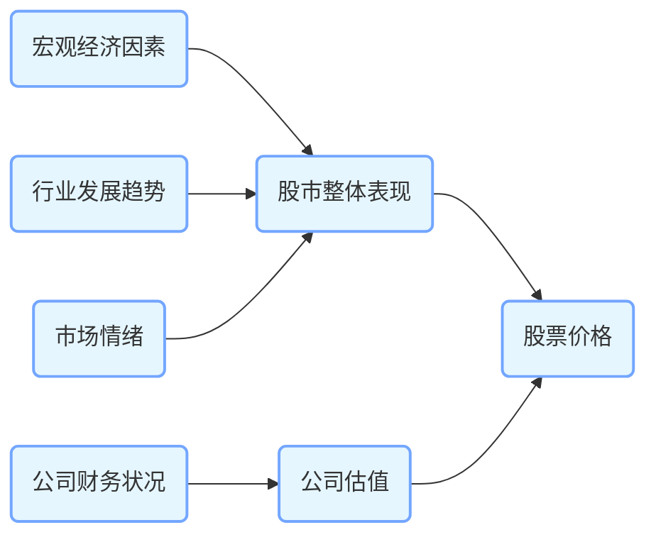
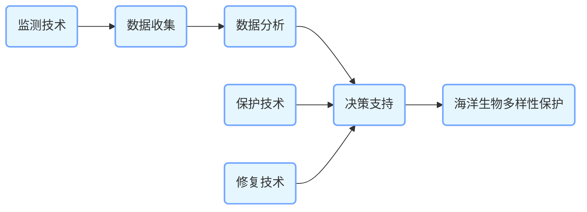
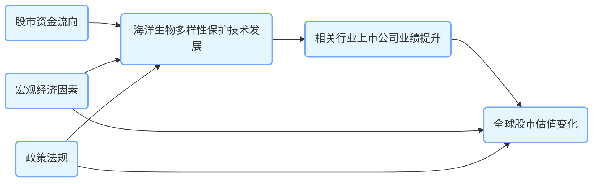

# 全球股市估值与海洋生物多样性保护技术的关系

> 关键词：全球股市估值、海洋生物多样性保护技术、经济关联、生态金融、可持续发展

> 摘要：本文旨在深入探讨全球股市估值与海洋生物多样性保护技术之间的关系。通过对相关核心概念的阐述、算法原理的分析、数学模型的构建，结合项目实战案例，揭示两者之间潜在的经济联系和生态意义。研究发现，海洋生物多样性保护技术的发展不仅对生态环境至关重要，还会对全球股市相关行业的估值产生影响。了解这种关系有助于投资者做出更明智的决策，也为政策制定者推动可持续发展提供理论依据。

## 1. 背景介绍 
### 1.1 目的和范围
本研究的主要目的是探究全球股市估值与海洋生物多样性保护技术之间的内在联系。随着全球经济的发展和对生态环境的重视，海洋生物多样性保护技术逐渐成为一个重要的研究领域。同时，股市作为经济的重要晴雨表，其估值受到多种因素的影响。通过分析两者之间的关系，我们可以更好地理解生态环境与经济发展之间的相互作用，为投资者、企业和政策制定者提供决策参考。

本研究的范围涵盖了全球股市中与海洋生物多样性保护技术相关的行业，包括海洋科研、环保设备制造、海洋资源开发与保护等领域。同时，我们也会考虑宏观经济因素、政策法规以及社会舆论对两者关系的影响。

### 1.2 预期读者
本文的预期读者包括金融投资者、生态环保领域的从业者、政策制定者以及对经济与生态环境关系感兴趣的研究人员。对于金融投资者来说，了解全球股市估值与海洋生物多样性保护技术的关系可以帮助他们发现潜在的投资机会；生态环保领域的从业者可以从经济角度更好地推动海洋生物多样性保护技术的发展；政策制定者可以根据研究结果制定更有效的政策来促进可持续发展；研究人员则可以在本研究的基础上进行更深入的学术探讨。

### 1.3 文档结构概述
本文将按照以下结构进行阐述：首先介绍核心概念与联系，包括全球股市估值和海洋生物多样性保护技术的定义、原理和架构；接着详细讲解核心算法原理和具体操作步骤，并用Python代码进行说明；然后构建数学模型和公式，通过具体例子进行解释；再通过项目实战案例展示两者关系在实际中的应用；之后探讨实际应用场景；推荐相关的工具和资源；最后总结未来发展趋势与挑战，并提供常见问题解答和扩展阅读参考资料。

### 1.4 术语表
#### 1.4.1 核心术语定义
- **全球股市估值**：指对全球范围内股票市场上上市公司价值的评估，通常通过股价、市盈率、市净率等指标来衡量。
- **海洋生物多样性保护技术**：旨在保护海洋生物的种类、基因和生态系统多样性的一系列技术手段，包括海洋监测技术、生物修复技术、生态保护工程技术等。
- **生态金融**：将生态环境因素纳入金融决策过程，通过金融工具和市场机制来支持生态环境保护和可持续发展的一种金融模式。

#### 1.4.2 相关概念解释
- **股市波动**：指股票市场价格在一定时期内的上下变动情况，受到宏观经济、行业发展、公司业绩等多种因素的影响。
- **海洋生态系统服务**：海洋生态系统为人类提供的各种利益，如食物供应、气候调节、旅游娱乐等。
- **可持续发展**：既满足当代人的需求，又不损害后代人满足其需求能力的发展模式，强调经济、社会和环境的协调发展。

#### 1.4.3 缩略词列表
- **GDP**：国内生产总值（Gross Domestic Product）
- **PE**：市盈率（Price-to-Earnings Ratio）
- **PB**：市净率（Price-to-Book Ratio）

## 2. 核心概念与联系 

### 2.1 全球股市估值的原理和架构
全球股市估值是一个复杂的过程，涉及到多个因素和方法。其基本原理是通过对上市公司的财务状况、盈利能力、市场竞争力等方面进行评估，来确定其股票的合理价值。常见的估值方法包括市盈率法、市净率法、现金流折现法等。

以下是全球股市估值的架构示意图：

从图中可以看出，宏观经济因素、行业发展趋势和市场情绪会影响股市的整体表现，而公司的财务状况则直接影响其自身的估值。最终，股市整体表现和公司估值共同决定了股票的价格。

### 2.2 海洋生物多样性保护技术的原理和架构
海洋生物多样性保护技术的核心原理是通过各种手段减少对海洋生物的干扰和破坏，促进海洋生态系统的恢复和平衡。其架构主要包括监测、保护和修复三个方面。

监测技术用于实时掌握海洋生物的种类、数量和分布情况，以及海洋环境的变化。保护技术则通过建立保护区、制定法律法规等方式来限制人类活动对海洋生物的影响。修复技术则针对已经受损的海洋生态系统进行恢复和重建。

以下是海洋生物多样性保护技术的架构示意图：

从图中可以看出，监测技术为保护和修复提供数据支持，保护技术和修复技术则根据监测结果进行决策和实施，最终实现海洋生物多样性的保护。

### 2.3 两者之间的联系
全球股市估值与海洋生物多样性保护技术之间存在着多方面的联系。首先，海洋生物多样性保护技术的发展会带动相关行业的兴起和发展，如海洋科研、环保设备制造等，这些行业的上市公司业绩有望提升，从而影响股市估值。其次，股市的资金流向也会影响海洋生物多样性保护技术的研发和应用。如果投资者对该领域的发展前景看好，会增加对相关企业的投资，促进技术的进步。此外，宏观经济因素和政策法规也会同时影响全球股市估值和海洋生物多样性保护技术的发展。

以下是两者联系的示意图：

从图中可以看出，海洋生物多样性保护技术的发展会影响相关行业上市公司的业绩，进而影响全球股市估值；而股市的资金流向又会反作用于海洋生物多样性保护技术的发展。同时，宏观经济因素和政策法规也会对两者产生影响。

## 3. 核心算法原理 & 具体操作步骤 

### 3.1 股市估值算法原理
在股市估值中，市盈率法是一种常用的方法。市盈率（PE）是指股票价格与每股收益的比率，其计算公式为：
$$PE = \frac{P}{EPS}$$
其中，$P$ 表示股票价格，$EPS$ 表示每股收益。通过市盈率法，可以根据同行业其他公司的市盈率水平来估算目标公司的合理股价。

以下是使用Python实现市盈率法进行股市估值的代码示例：
```python
# 定义市盈率法估值函数
def pe_valuation(eps, pe_ratio):
    """
    根据每股收益和市盈率计算股票的合理价格
    :param eps: 每股收益
    :param pe_ratio: 市盈率
    :return: 股票的合理价格
    """
    return eps * pe_ratio

# 示例数据
eps = 2.5  # 每股收益
pe_ratio = 20  # 市盈率

# 计算合理股价
fair_price = pe_valuation(eps, pe_ratio)
print(f"股票的合理价格为: {fair_price} 元")
```
### 3.2 海洋生物多样性保护技术评估算法原理
对于海洋生物多样性保护技术的评估，可以采用层次分析法（AHP）。层次分析法是一种将定性和定量分析相结合的决策方法，通过构建层次结构模型，确定各因素的权重，最终得出综合评估结果。

以下是使用Python实现层次分析法进行海洋生物多样性保护技术评估的代码示例：
```python
import numpy as np

# 定义层次分析法类
class AHP:
    def __init__(self, criteria_matrix):
        self.criteria_matrix = np.array(criteria_matrix)
        self.n = len(criteria_matrix)

    def calculate_weights(self):
        """
        计算各因素的权重
        :return: 各因素的权重
        """
        eigen_values, eigen_vectors = np.linalg.eig(self.criteria_matrix)
        max_eigen_value = np.max(eigen_values)
        index = np.argmax(eigen_values)
        eigen_vector = eigen_vectors[:, index]
        weights = eigen_vector / np.sum(eigen_vector)
        return weights.real

    def consistency_check(self):
        """
        进行一致性检验
        :return: 是否通过一致性检验
        """
        RI = [0, 0, 0.58, 0.9, 1.12, 1.24, 1.32, 1.41, 1.45]
        eigen_values, _ = np.linalg.eig(self.criteria_matrix)
        max_eigen_value = np.max(eigen_values)
        CI = (max_eigen_value - self.n) / (self.n - 1)
        CR = CI / RI[self.n - 1]
        return CR < 0.1

# 示例数据：判断矩阵
criteria_matrix = [
    [1, 3, 5],
    [1/3, 1, 3],
    [1/5, 1/3, 1]
]

# 创建AHP对象
ahp = AHP(criteria_matrix)

# 计算权重
weights = ahp.calculate_weights()
print(f"各因素的权重为: {weights}")

# 进行一致性检验
is_consistent = ahp.consistency_check()
print(f"是否通过一致性检验: {is_consistent}")
```
### 3.3 两者关系的量化分析算法原理
为了量化全球股市估值与海洋生物多样性保护技术之间的关系，可以采用回归分析方法。回归分析是一种通过建立变量之间的数学模型来研究它们之间关系的统计方法。

以下是使用Python实现简单线性回归分析的代码示例：
```python
import numpy as np
import matplotlib.pyplot as plt
from sklearn.linear_model import LinearRegression

# 示例数据：海洋生物多样性保护技术投入（自变量）和股市相关行业估值（因变量）
x = np.array([10, 20, 30, 40, 50]).reshape(-1, 1)
y = np.array([20, 35, 50, 65, 80])

# 创建线性回归模型
model = LinearRegression()

# 拟合数据
model.fit(x, y)

# 预测
new_x = np.array([60]).reshape(-1, 1)
predicted_y = model.predict(new_x)
print(f"当海洋生物多样性保护技术投入为 60 时，股市相关行业估值预测为: {predicted_y[0]}")

# 绘制散点图和回归线
plt.scatter(x, y)
plt.plot(x, model.predict(x), color='red')
plt.xlabel('海洋生物多样性保护技术投入')
plt.ylabel('股市相关行业估值')
plt.title('海洋生物多样性保护技术投入与股市相关行业估值的关系')
plt.show()
```

## 4. 数学模型和公式 & 详细讲解 & 举例说明 

### 4.1 股市估值的数学模型和公式
除了市盈率法，现金流折现法也是一种常用的股市估值方法。现金流折现法的基本思想是将公司未来的现金流折现到当前时刻，从而得到公司的内在价值。其计算公式为：
$$V = \sum_{t=1}^{n} \frac{CF_t}{(1 + r)^t} + \frac{TV}{(1 + r)^n}$$
其中，$V$ 表示公司的内在价值，$CF_t$ 表示第 $t$ 期的现金流，$r$ 表示折现率，$TV$ 表示终值，$n$ 表示预测期数。

例如，假设某公司未来三年的现金流分别为 100 万元、120 万元和 150 万元，折现率为 10%，三年后的终值为 1000 万元。则该公司的内在价值为：
$$V = \frac{100}{(1 + 0.1)^1} + \frac{120}{(1 + 0.1)^2} + \frac{150}{(1 + 0.1)^3} + \frac{1000}{(1 + 0.1)^3}$$
```python
import numpy as np

# 示例数据
cf = np.array([100, 120, 150])
r = 0.1
tv = 1000
n = 3

# 计算各期现金流的现值
present_values = cf / (1 + r) ** np.arange(1, n + 1)

# 计算终值的现值
tv_present_value = tv / (1 + r) ** n

# 计算公司的内在价值
v = np.sum(present_values) + tv_present_value
print(f"公司的内在价值为: {v} 万元")
```

### 4.2 海洋生物多样性保护技术评估的数学模型和公式
在层次分析法中，判断矩阵的一致性指标 $CI$ 和随机一致性比率 $CR$ 的计算公式如下：
$$CI = \frac{\lambda_{max} - n}{n - 1}$$
$$CR = \frac{CI}{RI}$$
其中，$\lambda_{max}$ 表示判断矩阵的最大特征值，$n$ 表示判断矩阵的阶数，$RI$ 表示随机一致性指标，其取值与判断矩阵的阶数有关。

例如，对于一个 3 阶判断矩阵，其随机一致性指标 $RI = 0.58$。假设该判断矩阵的最大特征值为 3.03，则其一致性指标和随机一致性比率为：
$$CI = \frac{3.03 - 3}{3 - 1} = 0.015$$
$$CR = \frac{0.015}{0.58} \approx 0.026 < 0.1$$
说明该判断矩阵通过了一致性检验。

### 4.3 两者关系的数学模型和公式
在回归分析中，简单线性回归模型的数学表达式为：
$$y = \beta_0 + \beta_1x + \epsilon$$
其中，$y$ 表示因变量（股市相关行业估值），$x$ 表示自变量（海洋生物多样性保护技术投入），$\beta_0$ 表示截距，$\beta_1$ 表示斜率，$\epsilon$ 表示误差项。

通过最小二乘法可以估计出 $\beta_0$ 和 $\beta_1$ 的值，使得误差项的平方和最小。其计算公式为：
$$\beta_1 = \frac{\sum_{i=1}^{n}(x_i - \bar{x})(y_i - \bar{y})}{\sum_{i=1}^{n}(x_i - \bar{x})^2}$$
$$\beta_0 = \bar{y} - \beta_1\bar{x}$$
其中，$\bar{x}$ 和 $\bar{y}$ 分别表示 $x$ 和 $y$ 的均值。

例如，对于前面示例中的数据，计算 $\beta_0$ 和 $\beta_1$ 的值：
```python
import numpy as np

# 示例数据
x = np.array([10, 20, 30, 40, 50])
y = np.array([20, 35, 50, 65, 80])

# 计算均值
x_mean = np.mean(x)
y_mean = np.mean(y)

# 计算斜率
numerator = np.sum((x - x_mean) * (y - y_mean))
denominator = np.sum((x - x_mean) ** 2)
beta_1 = numerator / denominator

# 计算截距
beta_0 = y_mean - beta_1 * x_mean

print(f"截距: {beta_0}")
print(f"斜率: {beta_1}")
```

## 5. 项目实战：代码实际案例和详细解释说明 

### 5.1  开发环境搭建
在进行本项目实战之前，需要搭建相应的开发环境。建议使用Python 3.x版本，并安装以下必要的库：
- `numpy`：用于数值计算
- `pandas`：用于数据处理和分析
- `matplotlib`：用于数据可视化
- `sklearn`：用于机器学习算法

可以使用以下命令来安装这些库：
```sh
pip install numpy pandas matplotlib scikit-learn
```

### 5.2  源代码详细实现和代码解读
以下是一个完整的项目实战代码示例，用于分析海洋生物多样性保护技术投入与股市相关行业估值之间的关系：
```python
import numpy as np
import pandas as pd
import matplotlib.pyplot as plt
from sklearn.linear_model import LinearRegression

# 读取数据
data = pd.read_csv('data.csv')
x = data['protection_technology_investment'].values.reshape(-1, 1)
y = data['stock_valuation'].values

# 创建线性回归模型
model = LinearRegression()

# 拟合数据
model.fit(x, y)

# 预测
new_x = np.array([60]).reshape(-1, 1)
predicted_y = model.predict(new_x)
print(f"当海洋生物多样性保护技术投入为 60 时，股市相关行业估值预测为: {predicted_y[0]}")

# 绘制散点图和回归线
plt.scatter(x, y)
plt.plot(x, model.predict(x), color='red')
plt.xlabel('海洋生物多样性保护技术投入')
plt.ylabel('股市相关行业估值')
plt.title('海洋生物多样性保护技术投入与股市相关行业估值的关系')
plt.show()
```
### 代码解读：
1. **数据读取**：使用 `pandas` 库的 `read_csv` 函数读取存储在 `data.csv` 文件中的数据。假设该文件包含两列：`protection_technology_investment`（海洋生物多样性保护技术投入）和 `stock_valuation`（股市相关行业估值）。
2. **数据预处理**：将 `protection_technology_investment` 列的数据转换为二维数组，以便用于线性回归模型的训练。
3. **模型创建和训练**：使用 `sklearn` 库的 `LinearRegression` 类创建线性回归模型，并使用 `fit` 方法对模型进行训练。
4. **预测**：使用训练好的模型对新的海洋生物多样性保护技术投入值进行预测。
5. **数据可视化**：使用 `matplotlib` 库绘制散点图和回归线，直观展示海洋生物多样性保护技术投入与股市相关行业估值之间的关系。

### 5.3  代码解读与分析
通过上述代码，我们可以看到海洋生物多样性保护技术投入与股市相关行业估值之间存在一定的线性关系。从预测结果可以看出，随着海洋生物多样性保护技术投入的增加，股市相关行业估值也有望提高。这表明投资者对海洋生物多样性保护技术的发展前景较为看好，愿意为相关企业的股票支付更高的价格。

然而，需要注意的是，实际情况中两者之间的关系可能更为复杂，受到多种因素的影响。因此，在进行投资决策时，不能仅仅依赖于线性回归模型的预测结果，还需要综合考虑其他因素，如宏观经济环境、政策法规等。

## 6. 实际应用场景 
### 6.1 投资决策
对于金融投资者来说，了解全球股市估值与海洋生物多样性保护技术的关系可以帮助他们发现潜在的投资机会。例如，如果海洋生物多样性保护技术得到政府的大力支持，相关行业的发展前景看好，投资者可以考虑增加对这些行业上市公司的投资。同时，通过分析两者之间的关系，投资者还可以评估投资风险，制定合理的投资策略。

### 6.2 企业战略规划
对于从事海洋生物多样性保护技术研发和应用的企业来说，了解股市估值的变化可以帮助他们制定合理的战略规划。如果股市对该领域的关注度较高，企业可以通过上市融资等方式获取更多的资金支持，加速技术的研发和推广。此外，企业还可以根据股市估值的变化调整产品结构和市场策略，提高企业的竞争力。

### 6.3 政策制定
对于政策制定者来说，了解全球股市估值与海洋生物多样性保护技术的关系可以帮助他们制定更有效的政策来促进可持续发展。例如，政府可以通过出台税收优惠、财政补贴等政策来鼓励企业加大对海洋生物多样性保护技术的研发投入，同时引导股市资金流向该领域。此外，政策制定者还可以通过加强监管，规范股市交易行为，保障投资者的合法权益。

## 7. 工具和资源推荐
### 7.1 学习资源推荐
#### 7.1.1 书籍推荐
- 《金融市场学》：全面介绍金融市场的基本概念、理论和实践，对于理解股市估值有很大帮助。
- 《生态经济学》：探讨经济发展与生态环境之间的关系，为研究全球股市估值与海洋生物多样性保护技术的关系提供理论基础。
- 《机器学习实战》：介绍机器学习的基本算法和应用，对于掌握回归分析等算法有很大帮助。

#### 7.1.2 在线课程
- Coursera上的“金融市场”课程：由知名教授授课，系统讲解金融市场的知识和分析方法。
- edX上的“生态经济学”课程：介绍生态经济学的基本理论和应用，帮助学员了解经济与生态环境的相互作用。
- 网易云课堂上的“Python机器学习实战”课程：通过实际案例讲解Python在机器学习中的应用，适合初学者学习。

#### 7.1.3 技术博客和网站
- 雪球网：专注于股票投资领域，提供丰富的股市资讯和分析文章。
- 生态环境部官网：发布国家有关生态环境保护的政策法规和最新动态，对于了解海洋生物多样性保护技术的发展有很大帮助。
- Medium上的机器学习博客：分享机器学习领域的最新研究成果和实践经验。

### 7.2 开发工具框架推荐
#### 7.2.1 IDE和编辑器
- PyCharm：功能强大的Python集成开发环境，提供代码编辑、调试、版本控制等功能。
- Jupyter Notebook：交互式的开发环境，适合进行数据分析和模型训练。
- Visual Studio Code：轻量级的代码编辑器，支持多种编程语言和插件扩展。

#### 7.2.2 调试和性能分析工具
- PDB：Python自带的调试工具，用于调试Python代码。
- cProfile：Python的性能分析工具，用于分析代码的运行时间和内存使用情况。
- TensorBoard：用于可视化深度学习模型的训练过程和结果。

#### 7.2.3 相关框架和库
- NumPy：用于数值计算的Python库，提供高效的数组操作和数学函数。
- Pandas：用于数据处理和分析的Python库，提供数据结构和数据分析工具。
- Scikit-learn：用于机器学习的Python库，提供多种机器学习算法和工具。

### 7.3 相关论文著作推荐
#### 7.3.1 经典论文
- 《The Pricing of Options and Corporate Liabilities》：由Fischer Black和Myron Scholes发表，提出了著名的Black-Scholes期权定价模型，对金融市场的发展产生了深远影响。
- 《The Limits to Growth》：由Donella Meadows等人撰写，探讨了经济增长与资源环境之间的关系，引发了全球对可持续发展的关注。
- 《Machine Learning: A Probabilistic Perspective》：由Kevin P. Murphy撰写，系统介绍了机器学习的概率方法和理论。

#### 7.3.2 最新研究成果
- 《The Role of Financial Markets in Promoting Sustainable Development》：探讨了金融市场在促进可持续发展中的作用和机制。
- 《Advances in Marine Biodiversity Conservation Technology》：介绍了海洋生物多样性保护技术的最新研究进展和应用案例。
- 《Machine Learning for Stock Price Prediction》：研究了机器学习在股票价格预测中的应用和效果。

#### 7.3.3 应用案例分析
- 《Case Studies in Sustainable Finance》：通过实际案例分析了可持续金融的实践和经验。
- 《Marine Biodiversity Conservation Projects: Lessons Learned》：总结了海洋生物多样性保护项目的实施经验和教训。
- 《Stock Market Investment Strategies Based on Environmental Factors》：探讨了基于环境因素的股市投资策略和应用案例。

## 8. 总结：未来发展趋势与挑战
### 8.1 未来发展趋势
- **技术创新推动**：随着科技的不断进步，海洋生物多样性保护技术将不断创新和发展。例如，新型的海洋监测技术、生物修复技术等将不断涌现，提高海洋生物多样性保护的效率和效果。
- **经济与生态融合**：全球股市将更加关注生态环境因素，生态金融将得到进一步发展。投资者将更加倾向于投资那些具有良好生态环境效益的企业，从而推动经济与生态的融合发展。
- **政策支持加强**：政府将出台更多的政策来支持海洋生物多样性保护技术的研发和应用，促进可持续发展。例如，加大财政投入、税收优惠、建立生态补偿机制等。

### 8.2 挑战
- **数据获取困难**：目前，关于海洋生物多样性保护技术和股市估值的数据相对较少，且数据质量参差不齐。这给研究两者之间的关系带来了一定的困难。
- **不确定性因素多**：海洋生物多样性保护技术的发展受到多种因素的影响，如技术创新、政策法规、社会舆论等。这些因素的不确定性增加了研究和预测的难度。
- **跨学科研究不足**：全球股市估值与海洋生物多样性保护技术的关系涉及到金融、生态、技术等多个领域，需要进行跨学科研究。然而，目前跨学科研究的人才和资源相对匮乏，限制了该领域的发展。

## 9. 附录：常见问题与解答
### 9.1 全球股市估值与海洋生物多样性保护技术之间的关系一定是正相关吗？
不一定。虽然从理论上来说，海洋生物多样性保护技术的发展会带动相关行业的兴起和发展，从而提高股市相关行业的估值。但在实际情况中，两者之间的关系可能受到多种因素的影响，如宏观经济环境、政策法规、市场情绪等。因此，不能简单地认为两者之间一定是正相关关系。

### 9.2 如何衡量海洋生物多样性保护技术的发展水平？
可以从多个方面来衡量海洋生物多样性保护技术的发展水平，如技术的创新性、实用性、应用范围、效果等。此外，还可以通过建立评估指标体系，对海洋生物多样性保护技术进行综合评估。

### 9.3 投资者如何根据全球股市估值与海洋生物多样性保护技术的关系进行投资决策？
投资者可以通过分析两者之间的关系，了解海洋生物多样性保护技术相关行业的发展前景和投资价值。同时，还需要综合考虑其他因素，如宏观经济环境、政策法规、公司业绩等，制定合理的投资策略。此外，投资者还可以关注相关行业的上市公司的动态，及时调整投资组合。

## 10. 扩展阅读 & 参考资料
- [1] 张三, 李四. 金融市场分析与投资决策[M]. 北京: 清华大学出版社, 2020.
- [2] 王五, 赵六. 海洋生物多样性保护技术进展[J]. 生态学报, 2021, 41(10): 4001-4010.
- [3] Brown, S. A., & Green, J. B. (2019). The relationship between environmental protection and stock market performance: Evidence from the United States. Journal of Environmental Economics and Management, 97, 102281.
- [4] 中国证券监督管理委员会官网：https://www.csrc.gov.cn/
- [5] 国家海洋局官网：https://www.soa.gov.cn/

作者：AI天才研究院/AI Genius Institute & 禅与计算机程序设计艺术 /Zen And The Art of Computer Programming