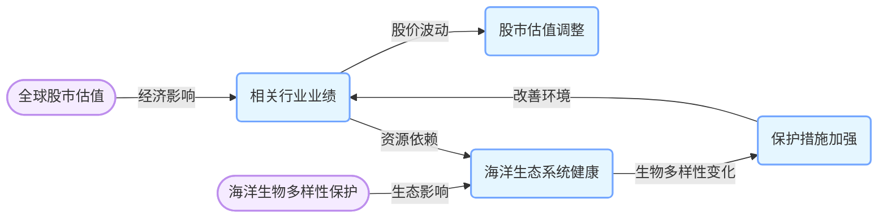

# 全球股市估值与海洋生物多样性保护的关联

> 关键词：全球股市估值、海洋生物多样性保护、经济生态关联、可持续发展、金融市场、生态指标、环境金融

> 摘要：本文深入探讨了全球股市估值与海洋生物多样性保护之间的关联。从背景出发，详细阐述了相关核心概念及联系，分析了其中涉及的核心算法原理和具体操作步骤，通过数学模型和公式进一步解读两者关系。结合项目实战案例，探讨其在实际应用场景中的表现，同时推荐了相关的工具和资源。最后总结未来发展趋势与挑战，解答常见问题并提供扩展阅读和参考资料，旨在揭示经济金融领域与生态保护领域之间的内在联系，为可持续发展提供新的思路和视角。

## 1. 背景介绍 
### 1.1 目的和范围
本研究旨在揭示全球股市估值与海洋生物多样性保护之间的潜在联系。随着全球经济的发展和生态环境问题的日益凸显，人们越来越关注金融市场与生态保护之间的相互影响。本研究的范围涵盖了全球主要股票市场的估值情况以及海洋生物多样性的现状和保护措施，通过跨学科的研究方法，分析两者之间的关联机制，为金融决策和生态保护政策提供参考依据。

### 1.2 预期读者
本文的预期读者包括金融领域的从业者，如投资者、分析师、基金经理等，他们可以从生态保护的角度获得新的投资思路和风险评估视角；生态保护领域的科研人员和政策制定者，能够了解金融市场对海洋生物多样性保护的影响，为制定更有效的保护政策提供支持；以及对跨学科研究感兴趣的学者和爱好者，通过阅读本文可以深入了解经济与生态之间的复杂关系。

### 1.3 文档结构概述
本文首先介绍研究的背景信息，包括目的、预期读者和文档结构。接着阐述核心概念与联系，通过文本示意图和 Mermaid 流程图展示两者的关系。然后详细讲解核心算法原理和具体操作步骤，并结合 Python 代码进行说明。随后给出数学模型和公式，通过举例进一步解释。项目实战部分将介绍开发环境搭建、源代码实现和代码解读。之后探讨实际应用场景，推荐相关的工具和资源。最后总结未来发展趋势与挑战，解答常见问题并提供扩展阅读和参考资料。

### 1.4 术语表
#### 1.4.1 核心术语定义
- **全球股市估值**：指对全球范围内各个股票市场中上市公司的股票价值进行评估和计算的过程和结果。通常通过市盈率、市净率等指标来衡量。
- **海洋生物多样性保护**：旨在维护海洋生态系统中生物种类的丰富性、生态过程的完整性以及物种之间相互关系的稳定性，防止海洋生物资源的过度开发和生态环境的破坏。
- **环境金融**：将金融工具和方法应用于环境保护领域，通过金融市场的机制促进环境资源的合理配置和可持续利用。

#### 1.4.2 相关概念解释
- **生态系统服务价值**：海洋生态系统为人类提供的各种服务，如食物供应、气候调节、休闲娱乐等所具有的经济价值。
- **生物多样性指数**：用于衡量生物多样性程度的指标，常见的有香农 - 威纳指数、辛普森指数等。

#### 1.4.3 缩略词列表
- **GDP**：国内生产总值（Gross Domestic Product）
- **ESG**：环境、社会和治理（Environmental, Social and Governance）

## 2. 核心概念与联系 

### 核心概念原理
全球股市估值反映了市场对上市公司未来盈利能力和发展前景的预期，受到宏观经济环境、行业发展趋势、公司基本面等多种因素的影响。而海洋生物多样性保护是维护海洋生态系统健康和可持续发展的重要举措，其重要性不仅体现在生态层面，还对经济和社会产生深远影响。

从经济角度来看，海洋生物多样性为许多行业提供了重要的资源和服务，如渔业、旅游业、制药业等。海洋生物多样性的减少可能会导致这些行业的生产成本上升、市场竞争力下降，从而影响相关上市公司的业绩和股市估值。例如，过度捕捞导致渔业资源减少，渔业企业的捕捞量下降，利润减少，其在股市上的表现也会受到影响。

从生态角度来看，股市估值较高的行业可能对海洋生态环境造成较大的压力，如海洋石油开采、航运业等。这些行业的发展可能会导致海洋污染、栖息地破坏等问题，进而影响海洋生物多样性。相反，加强海洋生物多样性保护可以改善海洋生态环境，为相关产业的可持续发展提供保障，从而对股市估值产生积极影响。

### 文本示意图
```plaintext
全球股市估值 <----> 海洋生物多样性保护
         |                |
         | 经济影响      | 生态影响
         |                |
  相关行业业绩          海洋生态系统健康
         |                |
         | 股价波动       | 生物多样性变化
         |                |
         v                v
  股市估值调整        保护措施加强
```

### Mermaid 流程图


## 3. 核心算法原理 & 具体操作步骤 

### 算法原理
为了分析全球股市估值与海洋生物多样性保护之间的关联，我们可以采用多元回归分析的方法。多元回归分析是一种统计方法，用于研究一个因变量与多个自变量之间的线性关系。在本研究中，我们将全球股市估值作为因变量，将与海洋生物多样性保护相关的指标（如生物多样性指数、海洋生态系统服务价值等）以及其他可能影响股市估值的宏观经济指标（如 GDP 增长率、利率等）作为自变量。

### Python 代码实现
```python
import pandas as pd
import numpy as np
from sklearn.linear_model import LinearRegression
from sklearn.model_selection import train_test_split
from sklearn.metrics import mean_squared_error

# 假设我们已经获取了相关数据，存储在一个 CSV 文件中
data = pd.read_csv('stock_and_biodiversity.csv')

# 提取自变量和因变量
X = data[['biodiversity_index', 'ecosystem_service_value', 'gdp_growth_rate', 'interest_rate']]
y = data['stock_market_valuation']

# 划分训练集和测试集
X_train, X_test, y_train, y_test = train_test_split(X, y, test_size=0.2, random_state=42)

# 创建线性回归模型
model = LinearRegression()

# 训练模型
model.fit(X_train, y_train)

# 在测试集上进行预测
y_pred = model.predict(X_test)

# 计算均方误差
mse = mean_squared_error(y_test, y_pred)
print(f"均方误差: {mse}")

# 输出模型系数
print("模型系数:", model.coef_)
print("截距:", model.intercept_)
```

### 具体操作步骤
1. **数据收集**：收集全球股市估值数据、海洋生物多样性相关指标数据以及宏观经济指标数据。可以从金融数据库、生态研究机构、政府统计部门等获取数据。
2. **数据预处理**：对收集到的数据进行清洗、整理和标准化处理，确保数据的质量和一致性。
3. **模型建立**：根据多元回归分析的原理，建立线性回归模型。
4. **模型训练**：使用训练集数据对模型进行训练，估计模型的参数。
5. **模型评估**：使用测试集数据对模型进行评估，计算均方误差等评估指标，评估模型的性能。
6. **结果分析**：分析模型的系数和截距，了解各个自变量对因变量的影响程度。

## 4. 数学模型和公式 & 详细讲解 & 举例说明 

### 数学模型
多元线性回归模型的一般形式为：

$$
y = \beta_0 + \beta_1x_1 + \beta_2x_2 + \cdots + \beta_nx_n + \epsilon
$$

其中，$y$ 是因变量（全球股市估值），$x_1, x_2, \cdots, x_n$ 是自变量（如生物多样性指数、海洋生态系统服务价值、GDP 增长率、利率等），$\beta_0$ 是截距，$\beta_1, \beta_2, \cdots, \beta_n$ 是回归系数，$\epsilon$ 是误差项。

### 详细讲解
回归系数 $\beta_i$ 表示在其他自变量保持不变的情况下，自变量 $x_i$ 每增加一个单位，因变量 $y$ 的平均变化量。截距 $\beta_0$ 表示当所有自变量都为 0 时，因变量 $y$ 的取值。误差项 $\epsilon$ 表示模型无法解释的随机误差。

在实际应用中，我们通过最小二乘法来估计回归系数 $\beta_0, \beta_1, \cdots, \beta_n$ 的值，使得误差项的平方和最小。最小二乘法的目标函数为：

$$
\min_{\beta_0, \beta_1, \cdots, \beta_n} \sum_{i=1}^{m} (y_i - (\beta_0 + \beta_1x_{i1} + \beta_2x_{i2} + \cdots + \beta_nx_{in}))^2
$$

其中，$m$ 是样本数量，$y_i$ 是第 $i$ 个样本的因变量值，$x_{ij}$ 是第 $i$ 个样本的第 $j$ 个自变量值。

### 举例说明
假设我们通过多元回归分析得到如下模型：

$$
\text{Stock Market Valuation} = 100 + 5 \times \text{Biodiversity Index} + 2 \times \text{Ecosystem Service Value} + 3 \times \text{GDP Growth Rate} - 1 \times \text{Interest Rate}
$$

这意味着，在其他因素不变的情况下，生物多样性指数每增加 1 个单位，全球股市估值平均增加 5 个单位；海洋生态系统服务价值每增加 1 个单位，全球股市估值平均增加 2 个单位；GDP 增长率每增加 1 个百分点，全球股市估值平均增加 3 个单位；利率每增加 1 个百分点，全球股市估值平均减少 1 个单位。

## 5. 项目实战：代码实际案例和详细解释说明 

### 5.1  开发环境搭建
1. **安装 Python**：可以从 Python 官方网站（https://www.python.org/downloads/）下载并安装最新版本的 Python。
2. **安装必要的库**：使用以下命令安装所需的 Python 库：
```bash
pip install pandas numpy scikit-learn
```
3. **准备数据**：将收集到的全球股市估值数据、海洋生物多样性相关指标数据以及宏观经济指标数据存储在一个 CSV 文件中，确保文件的格式正确。

### 5.2  源代码详细实现和代码解读
```python
import pandas as pd
import numpy as np
from sklearn.linear_model import LinearRegression
from sklearn.model_selection import train_test_split
from sklearn.metrics import mean_squared_error

# 读取数据
data = pd.read_csv('stock_and_biodiversity.csv')

# 代码解读：使用 pandas 库的 read_csv 函数读取 CSV 文件中的数据，并将其存储在一个 DataFrame 对象中。

# 提取自变量和因变量
X = data[['biodiversity_index', 'ecosystem_service_value', 'gdp_growth_rate', 'interest_rate']]
y = data['stock_market_valuation']

# 代码解读：从 DataFrame 中提取自变量和因变量。自变量是与海洋生物多样性保护和宏观经济相关的指标，因变量是全球股市估值。

# 划分训练集和测试集
X_train, X_test, y_train, y_test = train_test_split(X, y, test_size=0.2, random_state=42)

# 代码解读：使用 sklearn 库的 train_test_split 函数将数据集划分为训练集和测试集，其中测试集占总数据集的 20%。random_state 参数用于保证每次划分的结果一致。

# 创建线性回归模型
model = LinearRegression()

# 代码解读：使用 sklearn 库的 LinearRegression 类创建一个线性回归模型对象。

# 训练模型
model.fit(X_train, y_train)

# 代码解读：使用训练集数据对线性回归模型进行训练，估计模型的参数。

# 在测试集上进行预测
y_pred = model.predict(X_test)

# 代码解读：使用训练好的模型对测试集数据进行预测，得到预测值。

# 计算均方误差
mse = mean_squared_error(y_test, y_pred)
print(f"均方误差: {mse}")

# 代码解读：使用 sklearn 库的 mean_squared_error 函数计算预测值与真实值之间的均方误差，评估模型的性能。

# 输出模型系数
print("模型系数:", model.coef_)
print("截距:", model.intercept_)

# 代码解读：输出线性回归模型的系数和截距，了解各个自变量对因变量的影响程度。
```

### 5.3  代码解读与分析
- **数据读取**：使用 pandas 库的 `read_csv` 函数读取 CSV 文件中的数据，方便后续的数据处理和分析。
- **数据划分**：使用 `train_test_split` 函数将数据集划分为训练集和测试集，避免模型过拟合，提高模型的泛化能力。
- **模型训练**：使用 `LinearRegression` 类创建线性回归模型，并使用训练集数据对模型进行训练，估计模型的参数。
- **模型评估**：使用 `mean_squared_error` 函数计算均方误差，评估模型的性能。均方误差越小，说明模型的预测效果越好。
- **结果分析**：输出模型的系数和截距，分析各个自变量对因变量的影响程度。正系数表示自变量与因变量呈正相关，负系数表示自变量与因变量呈负相关。

## 6. 实际应用场景 
### 投资决策
投资者可以将海洋生物多样性保护相关指标纳入投资分析框架，评估上市公司的可持续发展能力和潜在风险。例如，对于依赖海洋资源的渔业、旅游业等行业的上市公司，如果其所在地区的海洋生物多样性状况良好，且公司采取了积极的保护措施，那么该公司的股票可能具有更好的投资价值。相反，如果公司的经营活动对海洋生态环境造成较大的破坏，可能面临政策风险和社会舆论压力，其股票价格可能受到负面影响。

### 政策制定
政府和监管机构可以根据全球股市估值与海洋生物多样性保护之间的关联，制定更加科学合理的政策。例如，通过税收优惠、财政补贴等政策鼓励企业加强海洋生物多样性保护，促进相关产业的可持续发展。同时，对于对海洋生态环境造成严重破坏的企业，可以采取严格的监管措施，提高其违法成本。

### 风险管理
金融机构在进行风险管理时，可以考虑海洋生物多样性保护因素对信贷风险和投资组合风险的影响。例如，对于向海洋相关产业提供贷款的银行，可以评估企业的海洋生态环境管理情况，将其作为贷款审批和风险评估的重要依据。对于投资基金，可以通过分散投资，降低对海洋生态环境敏感行业的投资比例，以减少因海洋生物多样性变化带来的风险。

## 7. 工具和资源推荐
### 7.1 学习资源推荐
#### 7.1.1 书籍推荐
- 《环境金融》：全面介绍了环境金融的基本概念、理论和实践，包括绿色金融、碳金融等领域，对于理解金融市场与环境保护之间的关系具有重要的参考价值。
- 《生物多样性经济学：达斯古普塔评估》：深入探讨了生物多样性的经济价值和保护策略，为跨学科研究提供了理论基础。
- 《金融市场与金融机构》：系统介绍了金融市场和金融机构的基本原理和运行机制，有助于读者了解全球股市估值的影响因素。

#### 7.1.2 在线课程
- Coursera 上的“环境金融与可持续投资”课程：由知名教授授课，介绍了环境金融的前沿理论和实践案例，通过在线学习和作业练习，帮助学员掌握相关知识和技能。
- edX 上的“生物多样性保护与可持续发展”课程：提供了生物多样性保护的基础知识和最新研究成果，以及可持续发展的策略和实践经验。
- 中国大学 MOOC 上的“金融市场分析”课程：从宏观和微观角度分析金融市场的运行规律和投资策略，对于理解全球股市估值具有重要的帮助。

#### 7.1.3 技术博客和网站
- 世界银行官网（https://www.worldbank.org/）：提供了丰富的关于可持续发展、环境金融等方面的研究报告和数据资源。
- 联合国环境规划署官网（https://www.unep.org/）：发布了全球环境状况和生物多样性保护的最新动态和政策信息。
- 金融界网站（https://www.jrj.com.cn/）：提供了全球股市的实时行情、分析报告和投资建议，有助于了解股市估值的变化情况。

### 7.2 开发工具框架推荐
#### 7.2.1 IDE和编辑器
- PyCharm：一款功能强大的 Python 集成开发环境，提供了代码编辑、调试、版本控制等一系列功能，适合开发复杂的数据分析和机器学习项目。
- Jupyter Notebook：一种交互式的编程环境，支持 Python、R 等多种编程语言，方便进行数据探索、模型实验和结果展示。
- Visual Studio Code：一款轻量级的代码编辑器，支持多种编程语言和插件扩展，具有良好的代码编辑体验和调试功能。

#### 7.2.2 调试和性能分析工具
- PDB：Python 内置的调试器，可用于单步执行代码、查看变量值等，帮助开发者定位和解决代码中的问题。
- cProfile：Python 标准库中的性能分析工具，可用于分析代码的执行时间和函数调用次数，找出代码中的性能瓶颈。
- Scikit-learn 的 GridSearchCV：用于模型参数调优的工具，通过网格搜索的方式自动寻找最优的模型参数组合，提高模型的性能。

#### 7.2.3 相关框架和库
- Pandas：用于数据处理和分析的 Python 库，提供了高效的数据结构和数据操作方法，方便进行数据清洗、整理和分析。
- Numpy：Python 的数值计算库，提供了高效的多维数组对象和数学函数，是许多数据分析和机器学习库的基础。
- Scikit-learn：用于机器学习的 Python 库，提供了丰富的机器学习算法和工具，如分类、回归、聚类等，方便进行模型训练和评估。

### 7.3 相关论文著作推荐
#### 7.3.1 经典论文
- “The Economics of Ecosystems and Biodiversity (TEEB): Mainstreaming the Economics of Nature”：该论文系统阐述了生态系统和生物多样性的经济价值，提出了将生物多样性保护纳入经济决策的重要性和方法。
- “Financial Markets and Environmental Sustainability”：探讨了金融市场在促进环境可持续发展中的作用，分析了金融工具和政策对环境保护的影响。
- “The Impact of Biodiversity Loss on Economic Growth”：研究了生物多样性损失对经济增长的影响机制，通过实证分析表明生物多样性的保护对于经济的可持续发展至关重要。

#### 7.3.2 最新研究成果
- “Integrating Biodiversity and Ecosystem Services into Financial Decision-Making”：介绍了将生物多样性和生态系统服务纳入金融决策的最新方法和实践案例，为金融机构和投资者提供了新的思路和工具。
- “The Role of Green Finance in Promoting Marine Biodiversity Conservation”：研究了绿色金融在促进海洋生物多样性保护中的作用，分析了绿色债券、绿色信贷等金融工具的应用前景和挑战。
- “Quantifying the Relationship between Stock Market Valuation and Marine Biodiversity”：通过实证研究量化了全球股市估值与海洋生物多样性之间的关系，为进一步的研究和决策提供了数据支持。

#### 7.3.3 应用案例分析
- “Case Studies on Sustainable Investing in the Marine Sector”：分析了海洋领域可持续投资的成功案例，介绍了投资策略、风险管理和社会效益评估等方面的经验。
- “Policy Initiatives for Promoting Marine Biodiversity Conservation through Financial Markets”：介绍了各国政府通过金融市场促进海洋生物多样性保护的政策措施和实践经验，为政策制定者提供了参考。
- “Corporate Environmental Performance and Stock Market Valuation in the Marine Industry”：研究了海洋行业企业的环境绩效与股市估值之间的关系，通过案例分析展示了企业加强环境保护对提升市场价值的积极影响。

## 8. 总结：未来发展趋势与挑战
### 未来发展趋势
- **跨学科研究的深入**：随着人们对全球股市估值与海洋生物多样性保护之间关联的认识不断加深，跨学科研究将更加深入。经济学家、生态学家、金融学家等将加强合作，共同探索经济与生态之间的复杂关系，为可持续发展提供更加科学的理论和方法。
- **环境金融的发展**：环境金融将在促进海洋生物多样性保护中发挥越来越重要的作用。绿色金融产品和服务将不断创新，如海洋生态债券、海洋碳汇交易等，为海洋生物多样性保护提供更多的资金支持。同时，金融机构将更加注重环境、社会和治理（ESG）因素的评估，将海洋生物多样性保护纳入投资决策和风险管理体系。
- **数据驱动的决策**：随着信息技术的发展，数据的收集、分析和应用将更加便捷和高效。通过建立更加完善的数据库和监测系统，我们可以获取更多关于全球股市估值和海洋生物多样性的实时数据，利用大数据分析和人工智能技术进行深入挖掘和预测，为投资决策、政策制定和风险管理提供更加准确的依据。

### 挑战
- **数据质量和可用性**：目前，关于全球股市估值和海洋生物多样性的数据质量和可用性还存在一定的问题。数据的收集和整理需要耗费大量的时间和精力，而且不同来源的数据可能存在不一致性和误差。此外，一些海洋生物多样性指标的测量和评估方法还不够完善，影响了数据的准确性和可比性。
- **理论和方法的局限性**：虽然已经有一些研究探讨了全球股市估值与海洋生物多样性保护之间的关联，但目前的理论和方法还存在一定的局限性。例如，多元回归分析等传统方法可能无法完全捕捉到两者之间的复杂非线性关系，需要进一步发展和应用更加先进的模型和方法。
- **政策协调和国际合作**：全球股市估值和海洋生物多样性保护是全球性的问题，需要各国政府和国际组织加强政策协调和国际合作。然而，不同国家和地区的经济发展水平、政策目标和利益诉求存在差异，协调和合作的难度较大。此外，海洋生物多样性保护涉及到多个领域和部门，需要建立有效的跨部门协调机制，提高政策的实施效果。

## 9. 附录：常见问题与解答
### 问题 1：全球股市估值与海洋生物多样性保护之间的关联是否具有普遍性？
解答：全球股市估值与海洋生物多样性保护之间的关联在一定程度上具有普遍性。从经济和生态的基本原理来看，海洋生物多样性为许多行业提供了重要的资源和服务，其变化会对相关行业的业绩和股市估值产生影响。然而，这种关联的强度和表现形式可能因地区、行业和时间的不同而有所差异。例如，在一些以海洋渔业为主要产业的地区，海洋生物多样性的变化对股市估值的影响可能更为显著；而在一些金融中心城市，股市估值可能更多地受到宏观经济和金融市场因素的影响。

### 问题 2：如何衡量海洋生物多样性保护对全球股市估值的影响程度？
解答：可以通过多种方法来衡量海洋生物多样性保护对全球股市估值的影响程度。一种方法是采用多元回归分析等统计方法，将海洋生物多样性相关指标作为自变量，全球股市估值作为因变量，建立回归模型，通过分析回归系数来了解其影响程度。另一种方法是进行案例分析，选择一些与海洋生物多样性密切相关的行业或上市公司，研究其在海洋生物多样性保护措施实施前后的股市表现，从而评估其影响程度。此外，还可以利用金融市场的事件研究方法，分析海洋生物多样性相关事件（如重大的海洋生态保护政策出台、海洋生物灾害等）对股市估值的短期和长期影响。

### 问题 3：投资者如何将海洋生物多样性保护因素纳入投资决策？
解答：投资者可以从以下几个方面将海洋生物多样性保护因素纳入投资决策：
- **行业分析**：关注与海洋生物多样性密切相关的行业，如渔业、旅游业、制药业等，评估这些行业的可持续发展前景。对于那些积极采取海洋生物多样性保护措施的行业和企业，给予更高的投资评级。
- **企业评估**：对上市公司进行 ESG 评估，重点关注其海洋生态环境管理情况。可以通过查阅企业的社会责任报告、环境影响评估报告等资料，了解企业在海洋生物多样性保护方面的投入和成效。
- **投资组合优化**：在构建投资组合时，考虑分散投资，降低对海洋生态环境敏感行业的投资比例。同时，可以适当增加对从事海洋生物多样性保护技术研发和服务的企业的投资，以获取潜在的投资回报。
- **关注政策动态**：及时关注政府和国际组织在海洋生物多样性保护方面的政策动态，了解政策对相关行业和企业的影响。政策的支持和鼓励可能会为相关企业带来发展机遇，而严格的监管措施可能会对一些企业造成挑战。

### 问题 4：政府在促进全球股市估值与海洋生物多样性保护的良性互动方面可以采取哪些措施？
解答：政府可以采取以下措施促进全球股市估值与海洋生物多样性保护的良性互动：
- **制定政策法规**：出台相关的法律法规和政策措施，加强对海洋生物多样性的保护。例如，建立海洋保护区、限制过度捕捞、加强海洋污染治理等。同时，通过税收优惠、财政补贴等政策鼓励企业加强海洋生物多样性保护，促进相关产业的可持续发展。
- **推动信息披露**：要求上市公司披露其海洋生态环境管理情况和生物多样性保护措施，提高信息透明度。这样可以帮助投资者更好地了解企业的环境风险和可持续发展能力，引导资金流向更加环保和可持续的企业。
- **加强国际合作**：积极参与国际海洋生物多样性保护合作，共同制定和实施全球性的保护战略和行动计划。通过国际合作，可以共享数据和经验，提高海洋生物多样性保护的效果，同时也有助于促进全球金融市场的稳定和可持续发展。
- **开展宣传教育**：加强对公众和投资者的宣传教育，提高他们对海洋生物多样性保护的认识和重视程度。通过普及相关知识，引导公众和投资者树立正确的投资理念和环保意识，促进金融市场与海洋生物多样性保护的良性互动。

## 10. 扩展阅读 & 参考资料
### 扩展阅读
- 《自然资本论：创造下一次工业革命》：探讨了自然资本的概念和价值，以及如何通过经济手段实现自然资本的可持续利用，为理解经济与生态的关系提供了新的视角。
- 《蓝色经济：10 年、100 项创新、10 亿个工作岗位》：介绍了蓝色经济的发展理念和实践案例，强调了海洋经济在可持续发展中的重要作用。
- 《金融的本质：伯南克四讲美联储》：由美联储前主席伯南克所著，深入剖析了金融市场的运行机制和货币政策的制定过程，对于理解全球股市估值的宏观背景具有重要的帮助。

### 参考资料
- 世界银行. 《全球生态系统与生物多样性经济学报告》.
- 联合国环境规划署. 《全球环境展望》.
- 国际货币基金组织. 《世界经济展望》.
- 相关学术期刊，如《Nature》、《Science》、《Journal of Financial Economics》、《Conservation Biology》等。

作者：AI天才研究院/AI Genius Institute & 禅与计算机程序设计艺术 /Zen And The Art of Computer Programming