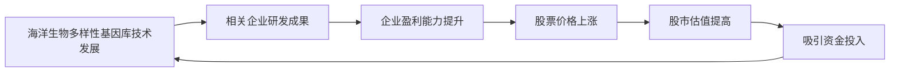

# 全球股市估值与海洋生物多样性基因库技术的关系

> 关键词：全球股市估值、海洋生物多样性基因库技术、金融市场、生物技术、生态经济、投资价值、协同发展

> 摘要：本文旨在深入探讨全球股市估值与海洋生物多样性基因库技术之间的内在关系。通过对两者核心概念、算法原理、数学模型等多方面的分析，结合实际案例和应用场景，揭示它们相互影响、相互促进的联系。研究全球股市估值如何反映海洋生物多样性基因库技术的发展潜力和投资价值，以及该技术的进步又怎样影响股市相关板块的表现。同时，为投资者、科研人员和政策制定者提供有价值的参考，以促进金融市场和生物技术领域的协同发展。

## 1. 背景介绍 
### 1.1 目的和范围
全球股市估值是金融市场的重要指标，反映了投资者对各类资产的预期和信心。而海洋生物多样性基因库技术作为生物技术领域的前沿方向，蕴含着巨大的科学价值和经济潜力。本研究的目的在于全面剖析这两者之间的关系，探究海洋生物多样性基因库技术的发展对全球股市估值的影响，以及股市估值如何引导资源向该技术领域的配置。研究范围涵盖全球主要股票市场、海洋生物多样性基因库技术的研发与应用，以及相关产业链的经济活动。

### 1.2 预期读者
本文预期读者包括金融市场投资者、证券分析师、生物技术科研人员、政策制定者以及对金融与生物技术交叉领域感兴趣的学者和专业人士。通过阅读本文，投资者可以更好地把握与海洋生物多样性基因库技术相关的投资机会，科研人员能够了解技术的市场价值和发展方向，政策制定者可以制定更合理的产业政策，学者则可以深入研究这一跨学科领域的理论和实践问题。

### 1.3 文档结构概述
本文首先介绍相关的背景信息，包括目的、读者和文档结构。接着阐述全球股市估值和海洋生物多样性基因库技术的核心概念与联系，通过文本示意图和 Mermaid 流程图展示其内在逻辑。然后详细讲解核心算法原理和具体操作步骤，结合 Python 源代码进行说明。再介绍相关的数学模型和公式，并举例说明。之后通过项目实战案例，详细解释代码实现和分析。随后探讨实际应用场景，推荐相关的工具和资源。最后总结未来发展趋势与挑战，解答常见问题，并提供扩展阅读和参考资料。

### 1.4 术语表
#### 1.4.1 核心术语定义
- **全球股市估值**：是指对全球范围内股票市场中上市公司的价值进行评估的过程和结果。通常通过各种估值方法，如市盈率、市净率等，来确定股票的合理价格和市场的整体估值水平。
- **海洋生物多样性基因库技术**：是指对海洋生物的基因进行采集、保存、分析和利用的一系列技术手段。旨在保护海洋生物的遗传资源，挖掘其中的潜在价值，如开发新的药物、生物材料等。

#### 1.4.2 相关概念解释
- **金融市场**：是资金融通的市场，包括股票市场、债券市场、外汇市场等。股票市场是金融市场的重要组成部分，其估值反映了投资者对上市公司未来盈利能力和发展前景的预期。
- **生物技术**：是应用生物学、化学和工程学的基本原理，利用生物体（包括微生物、动物细胞和植物细胞）或其组成部分（细胞器和酶）来生产有用物质，或为人类提供某种服务的技术。海洋生物多样性基因库技术是生物技术在海洋领域的具体应用。

#### 1.4.3 缩略词列表
- **P/E**：市盈率（Price-to-Earnings Ratio），是股票价格除以每股收益的比率，用于衡量股票的估值水平。
- **P/B**：市净率（Price-to-Book Ratio），是股票价格除以每股净资产的比率，反映了股票的市场价值与账面价值的关系。

## 2. 核心概念与联系 
### 2.1 全球股市估值的概念与原理
全球股市估值是一个复杂的过程，涉及多个因素和方法。其基本原理是基于对上市公司未来现金流的预期，通过一定的折现率将其折现到当前，从而得到股票的内在价值。常见的估值方法包括相对估值法和绝对估值法。相对估值法通过比较同行业或类似公司的估值指标，如市盈率、市净率等，来确定股票的相对价值。绝对估值法主要包括现金流折现模型（DCF），通过预测公司未来的自由现金流，并以适当的折现率进行折现，计算出公司的内在价值。

### 2.2 海洋生物多样性基因库技术的概念与原理
海洋生物多样性基因库技术主要包括基因采集、保存、分析和利用等环节。基因采集是从海洋生物中提取 DNA 样本的过程，需要采用合适的采样方法和技术，确保样本的质量和代表性。基因保存是将采集到的 DNA 样本进行妥善保存，以防止其降解和损坏。常用的保存方法包括低温冷冻、干燥保存等。基因分析是对保存的 DNA 样本进行测序、注释和功能分析，以了解海洋生物的遗传信息和基因功能。基因利用则是基于基因分析的结果，开发新的药物、生物材料、生物制品等，实现海洋生物遗传资源的经济价值。

### 2.3 两者的联系
全球股市估值与海洋生物多样性基因库技术之间存在着密切的联系。一方面，海洋生物多样性基因库技术的发展为股市相关板块带来了新的投资机会和增长潜力。随着技术的不断进步，相关企业的研发成果可能转化为实际的经济效益，从而提升公司的盈利能力和市场价值，进而影响股市估值。另一方面，股市估值也反映了市场对海洋生物多样性基因库技术的预期和信心。如果市场对该技术的发展前景看好，相关企业的股票价格可能会上涨，估值水平也会提高，从而吸引更多的资金投入到该领域，促进技术的进一步发展。

### 2.4 文本示意图
全球股市估值与海洋生物多样性基因库技术的关系可以用以下文本示意图表示：

海洋生物多样性基因库技术的发展 -> 相关企业研发成果 -> 企业盈利能力提升 -> 股票价格上涨 -> 股市估值提高 -> 吸引资金投入 -> 促进技术进一步发展

### 2.5 Mermaid 流程图


## 3. 核心算法原理 & 具体操作步骤 
### 3.1 全球股市估值算法原理
#### 3.1.1 相对估值法
相对估值法是一种常用的股市估值方法，其基本原理是通过比较同行业或类似公司的估值指标，来确定目标公司的相对价值。以市盈率为例，其计算公式为：

$P/E = \frac{股票价格}{每股收益}$

其中，$P/E$ 表示市盈率，股票价格是当前股票的市场价格，每股收益是公司每股的盈利水平。通过比较目标公司的市盈率与同行业平均市盈率或类似公司的市盈率，可以判断目标公司的估值是否合理。如果目标公司的市盈率低于同行业平均水平，可能被认为是低估的，具有投资价值；反之，则可能被高估。

#### 3.1.2 绝对估值法 - 现金流折现模型（DCF）
现金流折现模型是一种基于公司未来现金流的绝对估值方法。其基本原理是将公司未来的自由现金流以适当的折现率折现到当前，得到公司的内在价值。具体步骤如下：
1. 预测公司未来的自由现金流（FCF）：自由现金流是指公司在满足了所有必要的资本支出和运营成本后剩余的现金流量。可以通过分析公司的历史财务数据、行业发展趋势和市场前景等因素，对未来的自由现金流进行预测。
2. 确定折现率（r）：折现率反映了投资者对投资风险的预期和要求的回报率。通常可以采用加权平均资本成本（WACC）作为折现率，其计算公式为：

$WACC = E/V \times Re + D/V \times Rd \times (1 - T)$

其中，$E$ 表示股权价值，$V$ 表示公司总价值（$V = E + D$，$D$ 表示债务价值），$Re$ 表示股权成本，$Rd$ 表示债务成本，$T$ 表示所得税税率。

3. 计算公司的内在价值（V）：将预测的未来自由现金流按照折现率进行折现，得到公司的内在价值。计算公式为：

$V = \sum_{t=1}^{n} \frac{FCF_t}{(1 + r)^t} + \frac{TV}{(1 + r)^n}$

其中，$FCF_t$ 表示第 $t$ 年的自由现金流，$n$ 表示预测期，$TV$ 表示终值，通常采用永续增长模型计算：

$TV = \frac{FCF_{n+1}}{r - g}$

其中，$FCF_{n+1}$ 表示预测期后第 1 年的自由现金流，$g$ 表示永续增长率。

### 3.2 Python 代码实现
```python
import numpy as np

# 相对估值法 - 市盈率计算
def calculate_pe(stock_price, earnings_per_share):
    """
    计算市盈率
    :param stock_price: 股票价格
    :param earnings_per_share: 每股收益
    :return: 市盈率
    """
    return stock_price / earnings_per_share

# 绝对估值法 - 现金流折现模型（DCF）
def dcf_valuation(fcf, discount_rate, growth_rate, num_years):
    """
    现金流折现模型计算公司内在价值
    :param fcf: 初始自由现金流
    :param discount_rate: 折现率
    :param growth_rate: 永续增长率
    :param num_years: 预测期
    :return: 公司内在价值
    """
    # 预测未来自由现金流
    fcf_forecast = np.zeros(num_years)
    fcf_forecast[0] = fcf
    for i in range(1, num_years):
        fcf_forecast[i] = fcf_forecast[i - 1] * (1 + growth_rate)
    
    # 计算现值
    present_values = np.zeros(num_years)
    for i in range(num_years):
        present_values[i] = fcf_forecast[i] / (1 + discount_rate) ** (i + 1)
    
    # 计算终值
    terminal_value = fcf_forecast[-1] * (1 + growth_rate) / (discount_rate - growth_rate)
    terminal_value_pv = terminal_value / (1 + discount_rate) ** num_years
    
    # 计算公司内在价值
    intrinsic_value = np.sum(present_values) + terminal_value_pv
    
    return intrinsic_value

# 示例
stock_price = 50
earnings_per_share = 5
pe = calculate_pe(stock_price, earnings_per_share)
print(f"市盈率: {pe}")

fcf = 100
discount_rate = 0.1
growth_rate = 0.05
num_years = 10
intrinsic_value = dcf_valuation(fcf, discount_rate, growth_rate, num_years)
print(f"公司内在价值: {intrinsic_value}")
```

### 3.3 海洋生物多样性基因库技术的算法原理与操作步骤
#### 3.3.1 基因采集算法原理与操作步骤
基因采集的关键在于选择合适的采样方法和技术，确保采集到的 DNA 样本具有代表性和高质量。常见的采样方法包括组织采样、细胞采样和环境 DNA 采样等。具体操作步骤如下：
1. 样本选择：根据研究目的和对象，选择合适的海洋生物样本。可以选择不同种类、不同生长阶段、不同生态环境的生物样本，以提高样本的多样性。
2. 采样工具准备：准备好合适的采样工具，如手术刀、镊子、采样瓶等，并进行消毒处理，以防止样本污染。
3. 采样操作：按照不同的采样方法进行操作。例如，组织采样需要小心地从生物体内取出适量的组织样本；细胞采样则需要通过离心、过滤等方法分离出细胞；环境 DNA 采样需要收集海洋环境中的水样、沉积物等。
4. 样本保存：将采集到的样本立即进行保存，防止 DNA 降解。常用的保存方法包括低温冷冻、加入保存液等。

#### 3.3.2 基因保存算法原理与操作步骤
基因保存的主要目的是保持 DNA 样本的完整性和稳定性，防止其降解和损坏。常见的保存方法包括低温冷冻、干燥保存和化学保存等。以低温冷冻为例，具体操作步骤如下：
1. 样本预处理：将采集到的样本进行预处理，如清洗、切碎等，以提高保存效果。
2. 加入保护剂：在样本中加入适量的保护剂，如甘油、二甲基亚砜等，以防止冰晶形成对 DNA 造成损伤。
3. 冷冻保存：将处理后的样本放入低温冰箱或液氮中进行冷冻保存，温度一般控制在 -80℃ 或更低。
4. 定期检查：定期检查样本的保存状态，确保温度稳定，防止样本解冻和污染。

#### 3.3.3 基因分析算法原理与操作步骤
基因分析主要包括测序、注释和功能分析等环节。以二代测序技术为例，具体操作步骤如下：
1. 样本制备：将保存的 DNA 样本进行提取、纯化和片段化处理，以获得适合测序的 DNA 片段。
2. 文库构建：将处理后的 DNA 片段与测序接头连接，构建测序文库。
3. 测序反应：将测序文库放入测序仪中进行测序反应，得到大量的 DNA 序列数据。
4. 数据分析：对测序得到的原始数据进行质量控制、比对、组装和注释等分析，以获得基因的结构和功能信息。

#### 3.3.4 基因利用算法原理与操作步骤
基因利用的主要目标是基于基因分析的结果，开发新的药物、生物材料、生物制品等。具体操作步骤如下：
1. 靶点筛选：根据基因功能信息，筛选出具有潜在药用价值或工业应用价值的基因靶点。
2. 药物设计：基于靶点结构和功能信息，设计出能够与靶点结合的药物分子。
3. 药物研发：通过化学合成、生物发酵等方法制备药物分子，并进行药效学、药代动力学等研究，评估药物的安全性和有效性。
4. 产品开发：将研发成功的药物、生物材料、生物制品等进行产业化开发，推向市场。

## 4. 数学模型和公式 & 详细讲解 & 举例说明 
### 4.1 全球股市估值的数学模型和公式
#### 4.1.1 市盈率模型
市盈率模型是一种简单而常用的股市估值模型，其基本公式为：

$P = EPS \times P/E$

其中，$P$ 表示股票价格，$EPS$ 表示每股收益，$P/E$ 表示市盈率。该模型假设股票价格与每股收益成正比，市盈率反映了市场对公司盈利的预期和估值水平。

例如，某公司的每股收益为 2 元，同行业平均市盈率为 15 倍，则该公司的股票价格理论上应为：

$P = 2 \times 15 = 30$（元）

#### 4.1.2 现金流折现模型（DCF）
现金流折现模型是一种更为复杂和精确的股市估值模型，其基本公式为：

$V = \sum_{t=1}^{n} \frac{FCF_t}{(1 + r)^t} + \frac{TV}{(1 + r)^n}$

其中，$V$ 表示公司的内在价值，$FCF_t$ 表示第 $t$ 年的自由现金流，$r$ 表示折现率，$n$ 表示预测期，$TV$ 表示终值。

例如，某公司的初始自由现金流为 100 万元，预测期为 10 年，折现率为 10%，永续增长率为 5%。则该公司的内在价值计算如下：

1. 预测未来自由现金流：假设每年的自由现金流增长率为 5%，则未来 10 年的自由现金流分别为：

$FCF_1 = 100 \times (1 + 0.05) = 105$（万元）

$FCF_2 = 105 \times (1 + 0.05) = 110.25$（万元）

$\cdots$

$FCF_{10} = 100 \times (1 + 0.05)^{10} \approx 162.89$（万元）

2. 计算现值：将未来 10 年的自由现金流按照折现率进行折现，得到现值分别为：

$PV_1 = \frac{105}{(1 + 0.1)^1} \approx 95.45$（万元）

$PV_2 = \frac{110.25}{(1 + 0.1)^2} \approx 90.91$（万元）

$\cdots$

$PV_{10} = \frac{162.89}{(1 + 0.1)^{10}} \approx 62.09$（万元）

3. 计算终值：采用永续增长模型计算终值：

$TV = \frac{FCF_{11}}{r - g} = \frac{162.89 \times (1 + 0.05)}{0.1 - 0.05} \approx 3420.69$（万元）

终值的现值为：

$PV_{TV} = \frac{3420.69}{(1 + 0.1)^{10}} \approx 1315.09$（万元）

4. 计算公司内在价值：

$V = \sum_{t=1}^{10} PV_t + PV_{TV} \approx 95.45 + 90.91 + \cdots + 62.09 + 1315.09 \approx 2000$（万元）

### 4.2 海洋生物多样性基因库技术的数学模型和公式
#### 4.2.1 基因测序数据处理模型
在基因测序数据处理中，常用的数学模型包括序列比对模型和基因组装模型。以序列比对为例，常用的算法是动态规划算法，其基本原理是通过比较两条序列的相似性，找到最优的比对结果。

设两条序列分别为 $S_1$ 和 $S_2$，长度分别为 $m$ 和 $n$。定义一个二维矩阵 $D$，其中 $D[i][j]$ 表示 $S_1$ 的前 $i$ 个字符和 $S_2$ 的前 $j$ 个字符的最优比对得分。则动态规划算法的递推公式为：

$D[i][j] = \max\{D[i - 1][j - 1] + s(S_1[i - 1], S_2[j - 1]), D[i - 1][j] + d, D[i][j - 1] + d\}$

其中，$s(x, y)$ 表示字符 $x$ 和 $y$ 的匹配得分，$d$ 表示空位罚分。

例如，设 $S_1 = "AGT"$，$S_2 = "ACG"$，匹配得分 $s(x, y)$ 为：当 $x = y$ 时，$s(x, y) = 2$；当 $x \neq y$ 时，$s(x, y) = -1$，空位罚分 $d = -2$。则动态规划矩阵 $D$ 的计算过程如下：

|   |   | A | C | G |
|---|---|---|---|---|
|   | 0 | -2 | -4 | -6 |
| A | -2 | 2 | 0 | -2 |
| G | -4 | 0 | -1 | 1 |
| T | -6 | -2 | -3 | -1 |

最优比对得分 $D[3][3] = 1$，对应的比对结果为：

$S_1: AGT$

$S_2: ACG$

#### 4.2.2 基因功能预测模型
基因功能预测模型通常基于机器学习算法，如支持向量机、神经网络等。以支持向量机为例，其基本原理是通过寻找一个最优的超平面，将不同类别的基因样本分开。

设训练样本集为 $\{(x_1, y_1), (x_2, y_2), \cdots, (x_n, y_n)\}$，其中 $x_i$ 表示基因样本的特征向量，$y_i \in \{-1, +1\}$ 表示样本的类别标签。支持向量机的目标是找到一个超平面 $w^T x + b = 0$，使得不同类别的样本到超平面的间隔最大。

支持向量机的优化问题可以表示为：

$\min_{w, b} \frac{1}{2} \|w\|^2 + C \sum_{i=1}^{n} \xi_i$

s.t. $y_i (w^T x_i + b) \geq 1 - \xi_i$

$\xi_i \geq 0, i = 1, 2, \cdots, n$

其中，$C$ 是惩罚参数，$\xi_i$ 是松弛变量。

通过求解上述优化问题，可以得到最优的超平面参数 $w$ 和 $b$，从而实现基因功能的预测。

## 5. 项目实战：代码实际案例和详细解释说明 
### 5.1  开发环境搭建
#### 5.1.1 全球股市估值分析环境搭建
- **Python 环境**：安装 Python 3.x 版本，可以从官方网站（https://www.python.org/downloads/）下载并安装。
- **数据分析库**：安装 Pandas、Numpy、Matplotlib 等数据分析和可视化库，可以使用以下命令进行安装：

```sh
pip install pandas numpy matplotlib
```
- **金融数据获取库**：安装 yfinance 库，用于获取全球股市数据，可以使用以下命令进行安装：

```sh
pip install yfinance
```

#### 5.1.2 海洋生物多样性基因库技术分析环境搭建
- **Python 环境**：同样安装 Python 3.x 版本。
- **生物信息学库**：安装 Biopython 库，用于处理生物信息学数据，可以使用以下命令进行安装：

```sh
pip install biopython
```
- **机器学习库**：安装 Scikit-learn 库，用于基因功能预测等机器学习任务，可以使用以下命令进行安装：

```sh
pip install scikit-learn
```

### 5.2  源代码详细实现和代码解读
#### 5.2.1 全球股市估值分析代码实现
```python
import yfinance as yf
import pandas as pd
import numpy as np
import matplotlib.pyplot as plt

# 获取股票数据
def get_stock_data(ticker, start_date, end_date):
    """
    获取股票数据
    :param ticker: 股票代码
    :param start_date: 开始日期
    :param end_date: 结束日期
    :return: 股票数据
    """
    data = yf.download(ticker, start=start_date, end=end_date)
    return data

# 计算市盈率
def calculate_pe(stock_data):
    """
    计算市盈率
    :param stock_data: 股票数据
    :return: 市盈率数据
    """
    earnings_per_share = 2  # 假设每股收益为 2 元
    pe = stock_data['Close'] / earnings_per_share
    return pe

# 绘制市盈率曲线
def plot_pe(pe_data):
    """
    绘制市盈率曲线
    :param pe_data: 市盈率数据
    :return: 无
    """
    plt.figure(figsize=(10, 6))
    plt.plot(pe_data.index, pe_data.values)
    plt.xlabel('Date')
    plt.ylabel('P/E Ratio')
    plt.title('Price-to-Earnings Ratio')
    plt.grid(True)
    plt.show()

# 主函数
def main():
    ticker = 'AAPL'  # 苹果公司股票代码
    start_date = '2020-01-01'
    end_date = '2021-01-01'
    
    # 获取股票数据
    stock_data = get_stock_data(ticker, start_date, end_date)
    
    # 计算市盈率
    pe_data = calculate_pe(stock_data)
    
    # 绘制市盈率曲线
    plot_pe(pe_data)

if __name__ == '__main__':
    main()
```
**代码解读**：
- `get_stock_data` 函数：使用 yfinance 库获取指定股票在指定日期范围内的股票数据。
- `calculate_pe` 函数：计算市盈率，假设每股收益为 2 元。
- `plot_pe` 函数：绘制市盈率曲线，使用 Matplotlib 库进行可视化。
- `main` 函数：主函数，调用上述函数完成股票数据获取、市盈率计算和可视化。

#### 5.2.2 海洋生物多样性基因库技术分析代码实现
```python
from Bio import SeqIO
from Bio.Seq import Seq
from sklearn.svm import SVC
from sklearn.model_selection import train_test_split
from sklearn.metrics import accuracy_score

# 读取基因序列数据
def read_sequence_data(file_path):
    """
    读取基因序列数据
    :param file_path: 文件路径
    :return: 基因序列数据
    """
    records = list(SeqIO.parse(file_path, "fasta"))
    sequences = [str(record.seq) for record in records]
    return sequences

# 特征提取
def extract_features(sequences):
    """
    特征提取
    :param sequences: 基因序列数据
    :return: 特征矩阵
    """
    features = []
    for seq in sequences:
        feature = [seq.count('A'), seq.count('C'), seq.count('G'), seq.count('T')]
        features.append(feature)
    return np.array(features)

# 基因功能预测
def gene_function_prediction(features, labels):
    """
    基因功能预测
    :param features: 特征矩阵
    :param labels: 标签向量
    :return: 预测准确率
    """
    X_train, X_test, y_train, y_test = train_test_split(features, labels, test_size=0.2, random_state=42)
    clf = SVC()
    clf.fit(X_train, y_train)
    y_pred = clf.predict(X_test)
    accuracy = accuracy_score(y_test, y_pred)
    return accuracy

# 主函数
def main():
    file_path = 'sequences.fasta'  # 基因序列文件路径
    labels = [1, 0, 1, 0, 1, 0, 1, 0, 1, 0]  # 假设的标签向量
    
    # 读取基因序列数据
    sequences = read_sequence_data(file_path)
    
    # 特征提取
    features = extract_features(sequences)
    
    # 基因功能预测
    accuracy = gene_function_prediction(features, labels)
    print(f"预测准确率: {accuracy}")

if __name__ == '__main__':
    main()
```
**代码解读**：
- `read_sequence_data` 函数：使用 Biopython 库读取基因序列数据。
- `extract_features` 函数：提取基因序列的特征，这里简单地统计了 A、C、G、T 四种碱基的数量。
- `gene_function_prediction` 函数：使用支持向量机进行基因功能预测，将数据分为训练集和测试集，训练模型并计算预测准确率。
- `main` 函数：主函数，调用上述函数完成基因序列数据读取、特征提取和基因功能预测。

### 5.3  代码解读与分析
#### 5.3.1 全球股市估值分析代码分析
- **数据获取**：使用 yfinance 库可以方便地获取全球股市数据，该库提供了简单易用的 API 接口。
- **市盈率计算**：市盈率的计算基于股票价格和每股收益，这里假设每股收益为 2 元，实际应用中需要根据公司的财务报表进行准确计算。
- **可视化**：使用 Matplotlib 库可以将市盈率数据进行可视化，直观地展示市盈率的变化趋势。

#### 5.3.2 海洋生物多样性基因库技术分析代码分析
- **数据读取**：使用 Biopython 库可以读取常见格式的基因序列数据，如 FASTA 格式。
- **特征提取**：特征提取是基因功能预测的关键步骤，这里简单地统计了四种碱基的数量，实际应用中可以使用更复杂的特征提取方法。
- **机器学习模型**：使用支持向量机进行基因功能预测，该模型在处理分类问题时具有较好的性能。

## 6. 实际应用场景 
### 6.1 金融投资领域
在金融投资领域，全球股市估值与海洋生物多样性基因库技术的关系具有重要的应用价值。投资者可以通过分析海洋生物多样性基因库技术相关企业的研发进展、市场前景和财务状况，结合全球股市估值方法，评估相关企业的投资价值。如果某企业在海洋生物多样性基因库技术领域取得了重要的研发成果，可能会提升其盈利能力和市场竞争力，从而吸引投资者的关注，推动其股票价格上涨。投资者可以根据股市估值的变化，及时调整投资组合，获取投资收益。

### 6.2 生物技术研发领域
在生物技术研发领域，全球股市估值可以为海洋生物多样性基因库技术的研发提供资金支持和市场导向。当股市对该技术领域的发展前景看好时，相关企业的股票价格上涨，估值提高，企业可以通过增发股票、债券等方式筹集更多的资金，用于技术研发和创新。同时，股市估值也反映了市场对不同技术方向和研发项目的预期和需求，企业可以根据股市估值的变化，调整研发策略和方向，提高研发效率和成功率。

### 6.3 政策制定领域
在政策制定领域，了解全球股市估值与海洋生物多样性基因库技术的关系有助于政策制定者制定更合理的产业政策和监管措施。政策制定者可以通过观察股市估值的变化，了解市场对海洋生物多样性基因库技术的投资热情和信心，从而制定相应的政策，鼓励和支持该技术的发展。例如，政府可以出台税收优惠、财政补贴等政策，降低企业的研发成本，提高企业的盈利能力，促进技术的创新和应用。同时，政策制定者也可以加强对该领域的监管，规范市场秩序，保护投资者的合法权益。

## 7. 工具和资源推荐
### 7.1 学习资源推荐
#### 7.1.1 书籍推荐
- 《金融市场学》：全面介绍了金融市场的基本概念、理论和实践，对于理解全球股市估值具有重要的参考价值。
- 《生物技术概论》：系统阐述了生物技术的基本原理、方法和应用，有助于了解海洋生物多样性基因库技术的相关知识。
- 《Python 数据分析实战》：详细介绍了 Python 在数据分析领域的应用，包括数据获取、处理、分析和可视化等方面的内容，对于进行全球股市估值和海洋生物多样性基因库技术分析具有重要的帮助。

#### 7.1.2 在线课程
- Coursera 上的“金融市场”课程：由知名教授授课，深入讲解金融市场的理论和实践，提供丰富的案例和练习题。
- edX 上的“生物技术导论”课程：介绍生物技术的基本概念、原理和应用，适合初学者学习。
- Udemy 上的“Python 数据分析与可视化”课程：通过实际项目案例，教授 Python 在数据分析和可视化方面的应用技巧。

#### 7.1.3 技术博客和网站
- 金融界网站：提供全球股市的实时行情、分析报告和财经新闻，是了解金融市场动态的重要渠道。
- 生物技术前沿网站：专注于生物技术领域的最新研究成果和行业动态，有助于了解海洋生物多样性基因库技术的发展趋势。
- 博客园：有许多技术博主分享关于金融分析、生物技术和 Python 编程的经验和心得，可以从中获取有价值的信息。

### 7.2 开发工具框架推荐
#### 7.2.1 IDE和编辑器
- PyCharm：是一款专业的 Python 集成开发环境，提供代码编辑、调试、版本控制等功能，适合进行 Python 编程开发。
- Jupyter Notebook：是一个交互式的开发环境，支持多种编程语言，方便进行数据分析和可视化。
- Visual Studio Code：是一款轻量级的代码编辑器，支持多种编程语言和插件扩展，具有良好的开发体验。

#### 7.2.2 调试和性能分析工具
- PySnooper：是一个简单易用的 Python 调试工具，可以自动记录函数的执行过程和变量的值，方便调试代码。
- cProfile：是 Python 内置的性能分析工具，可以分析代码的运行时间和函数调用次数，帮助优化代码性能。
- Scalene：是一个高性能的 Python 性能分析器，可以实时监测代码的 CPU 和内存使用情况，提供详细的性能分析报告。

#### 7.2.3 相关框架和库
- Pandas：是一个强大的数据分析库，提供了高效的数据结构和数据处理方法，适合进行金融数据和生物信息学数据的分析。
- Numpy：是 Python 的数值计算库，提供了高效的数组操作和数学函数，是许多数据分析和机器学习库的基础。
- Scikit-learn：是一个常用的机器学习库，提供了丰富的机器学习算法和工具，适合进行基因功能预测等机器学习任务。

### 7.3 相关论文著作推荐
#### 7.3.1 经典论文
- “The Pricing of Options and Corporate Liabilities”：由 Fischer Black 和 Myron Scholes 发表的经典论文，提出了著名的 Black-Scholes 期权定价模型，对金融市场的估值理论和实践产生了深远的影响。
- “Molecular Cloning: A Laboratory Manual”：由 Joseph Sambrook、Edward F. Fritsch 和 Tom Maniatis 编写的经典著作，是分子克隆技术的权威指南，对于理解基因操作和生物技术具有重要的参考价值。

#### 7.3.2 最新研究成果
- 关注《Nature》、《Science》、《Cell》等国际顶级学术期刊，这些期刊经常发表关于金融市场和生物技术领域的最新研究成果。
- 参加相关的国际学术会议，如金融市场年会、生物技术研讨会等，了解最新的研究动态和前沿技术。

#### 7.3.3 应用案例分析
- 研究一些成功的金融投资案例和生物技术创新案例，了解全球股市估值与海洋生物多样性基因库技术在实际应用中的具体操作和效果。例如，分析某些海洋生物制药企业的发展历程和股票表现，探讨技术创新与股市估值之间的关系。

## 8. 总结：未来发展趋势与挑战
### 8.1 未来发展趋势
#### 8.1.1 技术融合趋势
未来，全球股市估值与海洋生物多样性基因库技术将呈现出更加紧密的融合趋势。随着人工智能、大数据、区块链等技术的不断发展，这些技术将被广泛应用于金融市场分析和生物技术研发中。例如，利用人工智能算法可以更准确地预测股市估值和基因功能，利用大数据技术可以获取更全面的金融和生物信息，利用区块链技术可以实现生物遗传资源的安全共享和交易。

#### 8.1.2 产业协同发展趋势
海洋生物多样性基因库技术的发展将带动相关产业链的协同发展，包括海洋生物制药、生物材料、生物能源等领域。这些产业的发展将为股市带来新的增长点和投资机会，同时股市的资金支持也将促进这些产业的技术创新和规模扩张。例如，海洋生物制药企业的研发成果将推动药物市场的发展，提高企业的盈利能力，进而提升其股票估值；股市的资金投入将帮助企业扩大生产规模，加速产品上市，实现产业的快速发展。

#### 8.1.3 国际化合作趋势
全球股市估值与海洋生物多样性基因库技术的发展将越来越依赖于国际化合作。海洋生物资源具有全球性分布的特点，各国在海洋生物多样性基因库技术的研发和应用中具有不同的优势和资源。通过国际合作，可以实现资源共享、技术交流和优势互补，加速技术的发展和应用。例如，各国可以共同建立海洋生物多样性基因库，共享基因资源和研究成果；开展跨国研发合作，共同攻克技术难题；加强国际金融市场的合作与协调，促进资本的跨国流动和投资。

### 8.2 挑战
#### 8.2.1 技术难题
海洋生物多样性基因库技术仍面临着许多技术难题，如基因采集的效率和准确性、基因保存的稳定性和长期性、基因分析的复杂性和精度等。这些技术难题的解决需要大量的科研投入和技术创新，需要不断探索和改进现有的技术方法。同时，全球股市估值的准确性也受到多种因素的影响，如市场波动、宏观经济环境、公司财务信息的真实性等，如何提高股市估值的准确性和可靠性也是一个重要的挑战。

#### 8.2.2 伦理和法律问题
海洋生物多样性基因库技术的发展涉及到许多伦理和法律问题，如生物遗传资源的归属和利用、基因隐私的保护、基因编辑的伦理争议等。这些问题需要建立相应的伦理准则和法律法规来规范和约束，以确保技术的发展符合人类的利益和价值观。同时，全球股市的监管也面临着新的挑战，如跨境金融交易的监管、金融科技的监管等，需要加强国际合作和协调，建立统一的监管标准和规则。

#### 8.2.3 市场风险
海洋生物多样性基因库技术的研发和应用具有较高的不确定性和风险，相关企业的研发成果可能无法转化为实际的经济效益，导致企业的盈利能力下降，股票估值降低。同时，全球股市也受到宏观经济环境、政策变化、市场情绪等多种因素的影响，存在较大的市场风险。投资者需要充分认识到这些风险，做好风险评估和管理，以降低投资损失。

## 9. 附录：常见问题与解答
### 9.1 全球股市估值与海洋生物多样性基因库技术有什么具体的联系？
全球股市估值反映了市场对企业未来盈利能力和发展前景的预期。海洋生物多样性基因库技术的发展为相关企业带来了新的发展机遇和增长潜力，如果企业在该技术领域取得重要的研发成果，可能会提升其盈利能力和市场竞争力，从而推动其股票价格上涨，提高股市估值。同时，股市估值也影响着资源向该技术领域的配置，如果市场对该技术的发展前景看好，相关企业的股票估值提高，企业可以筹集更多的资金用于技术研发和创新，促进技术的进一步发展。

### 9.2 如何评估海洋生物多样性基因库技术相关企业的投资价值？
评估海洋生物多样性基因库技术相关企业的投资价值需要综合考虑多个因素。首先，要关注企业的研发实力和技术水平，了解企业在基因采集、保存、分析和利用等方面的技术优势和创新能力。其次，要分析企业的市场前景和商业模式，了解企业的产品或服务是否具有市场需求和竞争力，以及企业的盈利模式和盈利能力。此外，还需要考虑企业的财务状况、管理团队、行业竞争等因素。可以使用全球股市估值方法，如市盈率、市净率、现金流折现模型等，对企业的股票进行估值，判断其投资价值。

### 9.3 海洋生物多样性基因库技术的发展面临哪些风险？
海洋生物多样性基因库技术的发展面临着多种风险。技术方面，存在基因采集效率低、基因保存不稳定、基因分析不准确等技术难题，这些技术难题的解决需要大量的科研投入和时间。伦理和法律方面，涉及生物遗传资源的归属和利用、基因隐私的保护、基因编辑的伦理争议等问题，需要建立相应的伦理准则和法律法规来规范和约束。市场方面，技术的研发和应用具有较高的不确定性，相关企业的研发成果可能无法转化为实际的经济效益，导致企业的盈利能力下降，股票估值降低。此外，还面临着市场竞争、政策变化等风险。

### 9.4 如何提高全球股市估值的准确性？
提高全球股市估值的准确性需要综合考虑多个因素。首先，要获取准确和全面的企业财务信息和市场数据，包括企业的收入、利润、资产负债表等财务指标，以及行业发展趋势、宏观经济环境等市场信息。其次，要选择合适的估值方法，根据企业的特点和市场情况，选择相对估值法或绝对估值法进行估值。同时，要考虑估值方法的局限性和适用范围，结合多种估值方法进行综合评估。此外，还需要对估值结果进行敏感性分析，考虑不同因素对估值结果的影响，以提高估值的准确性和可靠性。

## 10. 扩展阅读 & 参考资料
- [1] Bodie, Z., Kane, A., & Marcus, A. J. (2018). Investments. McGraw-Hill Education.
- [2] Alberts, B., Johnson, A., Lewis, J., Raff, M., Roberts, K., & Walter, P. (2014). Molecular Biology of the Cell. Garland Science.
- [3] McKinney, W. (2017). Python for Data Analysis: Data Wrangling with Pandas, NumPy, and IPython. O'Reilly Media.
- [4] Scikit-learn: Machine Learning in Python, Pedregosa et al., JMLR 12, pp. 2825-2830, 2011.
- [5] The Biopython Project. (2021). Biopython Tutorial and Cookbook.
- [6] Yahoo Finance. (2021). https://finance.yahoo.com/
- [7] Nature. (2021). https://www.nature.com/
- [8] Science. (2021). https://www.science.org/
- [9] Cell. (2021). https://www.cell.com/

作者：AI天才研究院/AI Genius Institute & 禅与计算机程序设计艺术 /Zen And The Art of Computer Programming