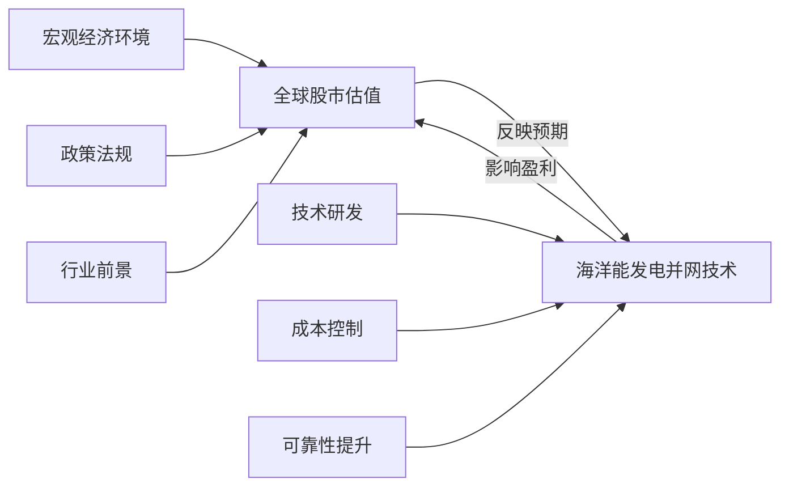

# 全球股市估值与海洋能发电并网技术的关系

> 关键词：全球股市估值、海洋能发电并网技术、金融市场、能源行业、产业关联、经济影响、技术发展趋势

> 摘要：本文旨在深入探讨全球股市估值与海洋能发电并网技术之间的内在联系。通过对相关核心概念的阐述、算法原理的分析、数学模型的构建以及实际案例的研究，揭示了海洋能发电并网技术的发展如何影响全球股市中能源及相关行业的估值，同时股市估值的变化也能反映市场对该技术的预期和信心。文章还介绍了该领域的实际应用场景、推荐了相关的学习资源和开发工具，最后对未来发展趋势与挑战进行了总结，并提供了常见问题解答和扩展阅读参考资料。

## 1. 背景介绍 
### 1.1 目的和范围
本研究的主要目的是探究全球股市估值与海洋能发电并网技术之间的相互关系。具体范围涵盖了全球主要股票市场中与能源行业相关的股票估值，以及海洋能发电并网技术从研发、试验到商业化应用的各个阶段。通过分析两者之间的关联，为投资者、能源企业和政策制定者提供有价值的决策参考。

### 1.2 预期读者
本文预期读者包括金融投资者、能源行业从业者、科研人员、政策制定者以及对全球股市和海洋能发电技术感兴趣的人士。对于投资者，有助于他们更好地把握能源相关股票的投资机会；对于能源行业从业者，可了解股市对技术发展的反馈，指导企业战略规划；科研人员能从金融市场的角度审视技术的发展前景；政策制定者则可依据研究结果制定更合理的产业政策。

### 1.3 文档结构概述
本文首先介绍相关核心概念，包括全球股市估值和海洋能发电并网技术的定义和特点，并阐述它们之间的联系。接着详细讲解核心算法原理和具体操作步骤，通过Python代码进行示例。然后构建数学模型，对两者关系进行量化分析，并举例说明。在项目实战部分，给出代码实际案例并进行详细解释。之后探讨实际应用场景，推荐相关的工具和资源。最后总结未来发展趋势与挑战，解答常见问题并提供扩展阅读参考资料。

### 1.4 术语表
#### 1.4.1 核心术语定义
- **全球股市估值**：指对全球范围内各个股票市场中上市公司股票价值的评估，通常通过市盈率（P/E）、市净率（P/B）等指标来衡量。
- **海洋能发电**：利用海洋所蕴藏的能量进行发电的技术，包括潮汐能、波浪能、海流能、温差能和盐差能等。
- **并网技术**：将发电设备所产生的电能接入电网的技术，确保电能能够安全、稳定、高效地输送到用户端。
- **海洋能发电并网技术**：专门针对海洋能发电设备，实现其与电网连接并稳定供电的技术体系。

#### 1.4.2 相关概念解释
- **市盈率（P/E）**：股票价格除以每股收益的比率，反映了市场对公司未来盈利的预期。较高的市盈率通常表示市场对公司的增长前景较为乐观。
- **市净率（P/B）**：股票价格与每股净资产的比率，用于衡量股票的估值是否合理。市净率较低可能意味着股票被低估。
- **可再生能源补贴**：政府为鼓励可再生能源发展而给予企业的财政支持，包括电价补贴、投资补贴等。

#### 1.4.3 缩略词列表
- **P/E**：Price-to-Earnings Ratio，市盈率
- **P/B**：Price-to-Book Ratio，市净率
- **OTEC**：Ocean Thermal Energy Conversion，海洋温差能转换
- **TEC**：Tidal Energy Converter，潮汐能转换器

## 2. 核心概念与联系 

### 2.1 全球股市估值
全球股市估值是金融市场对上市公司价值的综合评估。它受到多种因素的影响，包括宏观经济环境、公司业绩、行业前景、政策法规等。在能源行业，股市估值反映了市场对能源企业未来盈利能力和发展潜力的预期。例如，当市场预期某能源企业的新技术将带来巨大的商业价值时，其股票估值往往会上升。

### 2.2 海洋能发电并网技术
海洋能发电并网技术是实现海洋能商业化利用的关键环节。它涉及到多个方面的技术难题，如海洋能发电设备的设计与制造、电能的转换与控制、电网的接入与适配等。目前，海洋能发电并网技术仍处于发展阶段，存在成本高、可靠性低等问题，但随着技术的不断进步，其发展前景广阔。

### 2.3 两者的联系
海洋能发电并网技术的发展对全球股市估值有着重要的影响。一方面，技术的突破和进步将提高海洋能发电的效率和可靠性，降低成本，从而增加相关企业的盈利能力，推动其股票估值上升。另一方面，股市估值的变化也能反映市场对海洋能发电并网技术的信心和预期。如果市场对该技术的发展前景看好，相关企业的股票会受到投资者的青睐，估值也会相应提高。

### 2.4 文本示意图
```plaintext
全球股市估值 <-- 宏观经济环境、政策法规、行业前景等
             |
             | 影响
             |
海洋能发电并网技术 <-- 技术研发、成本控制、可靠性提升等
```

### 2.5 Mermaid流程图


## 3. 核心算法原理 & 具体操作步骤 

### 3.1 算法原理
为了分析全球股市估值与海洋能发电并网技术之间的关系，我们可以采用回归分析的方法。回归分析是一种统计方法，用于研究一个或多个自变量与因变量之间的关系。在本研究中，我们将海洋能发电并网技术的发展指标作为自变量，全球股市中能源相关股票的估值指标作为因变量，建立回归模型来分析两者之间的定量关系。

### 3.2 Python源代码实现
```python
import numpy as np
import pandas as pd
import statsmodels.api as sm

# 假设我们有以下数据
# 自变量：海洋能发电并网技术发展指标（例如技术成熟度得分）
x = np.array([1, 2, 3, 4, 5])
# 因变量：能源相关股票的市盈率（P/E）
y = np.array([10, 12, 14, 16, 18])

# 添加常数项
X = sm.add_constant(x)

# 建立线性回归模型
model = sm.OLS(y, X)

# 拟合模型
results = model.fit()

# 输出回归结果
print(results.summary())
```

### 3.3 具体操作步骤
1. **数据收集**：收集全球股市中能源相关股票的估值数据（如市盈率、市净率等）和海洋能发电并网技术的发展指标（如技术成熟度得分、装机容量等）。
2. **数据预处理**：对收集到的数据进行清洗、整理和标准化处理，确保数据的质量和一致性。
3. **模型建立**：根据数据特点选择合适的回归模型，如线性回归、非线性回归等。在本示例中，我们使用线性回归模型。
4. **模型拟合**：使用收集到的数据对建立的模型进行拟合，得到回归系数和统计指标。
5. **结果分析**：分析回归结果，判断海洋能发电并网技术发展指标与股市估值指标之间的关系是否显著，以及回归系数的正负和大小。

## 4. 数学模型和公式 & 详细讲解 & 举例说明 

### 4.1 线性回归模型
线性回归模型是一种最简单、最常用的回归模型，其数学表达式为：
$$y = \beta_0 + \beta_1x_1 + \beta_2x_2 + \cdots + \beta_nx_n + \epsilon$$
其中，$y$ 是因变量，$x_1, x_2, \cdots, x_n$ 是自变量，$\beta_0, \beta_1, \cdots, \beta_n$ 是回归系数，$\epsilon$ 是误差项。

在本研究中，我们假设只有一个自变量 $x$（海洋能发电并网技术发展指标），则线性回归模型可以简化为：
$$y = \beta_0 + \beta_1x + \epsilon$$

### 4.2 回归系数的估计
回归系数 $\beta_0$ 和 $\beta_1$ 的估计通常采用最小二乘法。最小二乘法的目标是使误差项 $\epsilon$ 的平方和最小，即：
$$\min_{\beta_0, \beta_1} \sum_{i=1}^{n} (y_i - \beta_0 - \beta_1x_i)^2$$
通过求解上述优化问题，可以得到回归系数的估计值：
$$\hat{\beta}_1 = \frac{\sum_{i=1}^{n} (x_i - \bar{x})(y_i - \bar{y})}{\sum_{i=1}^{n} (x_i - \bar{x})^2}$$
$$\hat{\beta}_0 = \bar{y} - \hat{\beta}_1\bar{x}$$
其中，$\bar{x}$ 和 $\bar{y}$ 分别是自变量 $x$ 和因变量 $y$ 的均值。

### 4.3 模型评估指标
为了评估回归模型的拟合效果，我们通常使用以下指标：
- **决定系数 $R^2$**：表示回归模型对因变量变异的解释程度，取值范围为 $[0, 1]$。$R^2$ 越接近 1，说明模型的拟合效果越好。
- **调整决定系数 $\bar{R}^2$**：考虑了自变量的个数，对 $R^2$ 进行了调整，避免了因自变量过多而导致的过拟合问题。
- **标准误差 $SE$**：表示回归模型的预测误差的标准差，反映了模型的精度。

### 4.4 举例说明
假设我们通过收集数据得到了以下结果：
- 海洋能发电并网技术发展指标 $x$ 的均值 $\bar{x} = 3$
- 能源相关股票的市盈率 $y$ 的均值 $\bar{y} = 14$
- $\sum_{i=1}^{n} (x_i - \bar{x})(y_i - \bar{y}) = 20$
- $\sum_{i=1}^{n} (x_i - \bar{x})^2 = 10$

则回归系数的估计值为：
$$\hat{\beta}_1 = \frac{20}{10} = 2$$
$$\hat{\beta}_0 = 14 - 2 \times 3 = 8$$

因此，回归模型为：
$$y = 8 + 2x$$

这意味着，海洋能发电并网技术发展指标每增加 1 个单位，能源相关股票的市盈率预计将增加 2 个单位。

## 5. 项目实战：代码实际案例和详细解释说明 

### 5.1 开发环境搭建
为了运行本项目的代码，我们需要搭建以下开发环境：
- **Python**：建议使用 Python 3.7 及以上版本。
- **相关库**：需要安装 `numpy`、`pandas`、`statsmodels` 等库。可以使用以下命令进行安装：
```sh
pip install numpy pandas statsmodels
```

### 5.2 源代码详细实现和代码解读
```python
import numpy as np
import pandas as pd
import statsmodels.api as sm
import matplotlib.pyplot as plt

# 读取数据
data = pd.read_csv('stock_valuation_and_ocean_energy.csv')

# 提取自变量和因变量
x = data['ocean_energy_technology_index']
y = data['stock_pe_ratio']

# 添加常数项
X = sm.add_constant(x)

# 建立线性回归模型
model = sm.OLS(y, X)

# 拟合模型
results = model.fit()

# 输出回归结果
print(results.summary())

# 绘制散点图和回归直线
plt.scatter(x, y, label='Data Points')
plt.plot(x, results.predict(X), color='red', label='Regression Line')
plt.xlabel('Ocean Energy Technology Index')
plt.ylabel('Stock P/E Ratio')
plt.title('Relationship between Ocean Energy Technology and Stock Valuation')
plt.legend()
plt.show()
```

### 代码解读：
1. **数据读取**：使用 `pandas` 库的 `read_csv` 函数读取存储在 CSV 文件中的数据。
2. **自变量和因变量提取**：从数据中提取海洋能发电并网技术发展指标作为自变量 $x$，能源相关股票的市盈率作为因变量 $y$。
3. **添加常数项**：使用 `statsmodels` 库的 `add_constant` 函数为自变量添加常数项，以便进行线性回归分析。
4. **建立线性回归模型**：使用 `statsmodels` 库的 `OLS` 函数建立线性回归模型。
5. **模型拟合**：使用 `fit` 方法对模型进行拟合，得到回归结果。
6. **输出回归结果**：使用 `summary` 方法输出回归结果，包括回归系数、决定系数、标准误差等统计指标。
7. **绘制散点图和回归直线**：使用 `matplotlib` 库绘制自变量和因变量的散点图，并绘制回归直线，直观展示两者之间的关系。

### 5.3 代码解读与分析
通过上述代码，我们可以得到海洋能发电并网技术发展指标与能源相关股票市盈率之间的线性回归模型。回归结果中的统计指标可以帮助我们判断模型的拟合效果和自变量与因变量之间的关系是否显著。例如，如果决定系数 $R^2$ 较高，说明模型对数据的拟合效果较好；如果回归系数 $\beta_1$ 显著不为零，说明海洋能发电并网技术发展指标与能源相关股票市盈率之间存在显著的线性关系。

## 6. 实际应用场景 
### 6.1 投资决策
对于金融投资者来说，了解全球股市估值与海洋能发电并网技术之间的关系可以帮助他们做出更明智的投资决策。如果投资者预期海洋能发电并网技术将取得重大突破，那么他们可以提前布局相关能源企业的股票，以获取潜在的投资收益。

### 6.2 企业战略规划
能源企业可以根据股市估值的变化来调整自身的战略规划。当股市对海洋能发电并网技术的发展前景看好，相关企业的股票估值上升时，企业可以加大在该领域的研发和投资力度，以提升自身的竞争力。

### 6.3 政策制定
政策制定者可以通过分析全球股市估值与海洋能发电并网技术之间的关系，制定更合理的产业政策。例如，如果股市反映出市场对海洋能发电并网技术的信心不足，政府可以出台更多的扶持政策，如加大补贴力度、完善并网标准等，以促进该技术的发展。

### 6.4 技术研发导向
科研机构和企业可以根据股市对海洋能发电并网技术的反馈，调整研发方向和重点。例如，如果股市对某一特定类型的海洋能发电技术（如潮汐能发电）的关注度较高，相关研发机构可以加大在该领域的研发投入，以提高技术的成熟度和商业化应用前景。

## 7. 工具和资源推荐
### 7.1 学习资源推荐
#### 7.1.1 书籍推荐
- 《金融市场学》：全面介绍金融市场的基本概念、理论和实践，有助于读者了解全球股市估值的基本原理和方法。
- 《可再生能源技术与应用》：详细介绍各种可再生能源技术，包括海洋能发电技术的原理、发展现状和应用前景。
- 《计量经济学》：讲解计量经济学的基本理论和方法，为分析全球股市估值与海洋能发电并网技术之间的关系提供理论支持。

#### 7.1.2 在线课程
- Coursera 上的 “Financial Markets”：由耶鲁大学教授 Robert Shiller 主讲，系统介绍金融市场的运行机制和投资策略。
- edX 上的 “Renewable Energy Systems”：提供可再生能源技术的基础知识和最新研究成果。
- Udemy 上的 “Python for Data Science and Machine Learning Bootcamp”：帮助读者掌握 Python 数据分析和机器学习的基本技能，用于处理和分析相关数据。

#### 7.1.3 技术博客和网站
- Seeking Alpha：提供全球股市的分析和评论，包括能源行业的相关信息。
- Renewable Energy World：专注于可再生能源领域的新闻、技术和市场动态。
- IEEE Xplore：提供电气和电子工程领域的学术论文和技术报告，包括海洋能发电并网技术的研究成果。

### 7.2 开发工具框架推荐
#### 7.2.1 IDE和编辑器
- PyCharm：一款功能强大的 Python 集成开发环境，提供代码编辑、调试、版本控制等功能。
- Jupyter Notebook：一种交互式的编程环境，适合进行数据分析和可视化。
- Visual Studio Code：一款轻量级的代码编辑器，支持多种编程语言和插件扩展。

#### 7.2.2 调试和性能分析工具
- pdb：Python 内置的调试器，用于调试 Python 代码。
- cProfile：Python 标准库中的性能分析工具，用于分析代码的运行时间和性能瓶颈。
- Py-Spy：一个跨平台的 Python 性能分析工具，可以实时监测 Python 程序的运行状态。

#### 7.2.3 相关框架和库
- NumPy：用于科学计算的 Python 库，提供高效的数组操作和数学函数。
- Pandas：用于数据处理和分析的 Python 库，提供数据结构和数据分析工具。
- Statsmodels：用于统计建模和计量经济学分析的 Python 库，支持线性回归、时间序列分析等多种模型。

### 7.3 相关论文著作推荐
#### 7.3.1 经典论文
- “The Relationship between Stock Prices and Macroeconomic Variables: Evidence from Emerging Markets”：研究了股市价格与宏观经济变量之间的关系，为分析全球股市估值提供了理论基础。
- “Ocean Energy Technologies: Current Status and Future Prospects”：对海洋能发电技术的发展现状和未来前景进行了全面综述。
- “Grid Integration of Renewable Energy Sources: Challenges and Solutions”：探讨了可再生能源并网技术面临的挑战和解决方案。

#### 7.3.2 最新研究成果
- 关注国际知名学术期刊，如 “Renewable Energy”、“Energy Economics”、“Journal of Financial Economics” 等，获取关于全球股市估值和海洋能发电并网技术的最新研究成果。

#### 7.3.3 应用案例分析
- 国际能源署（IEA）发布的相关报告，提供了全球海洋能发电项目的实际应用案例和分析。
- 金融机构发布的行业研究报告，分析了能源行业股票的估值变化和投资机会。

## 8. 总结：未来发展趋势与挑战
### 8.1 未来发展趋势
- **技术进步加速**：随着科技的不断发展，海洋能发电并网技术将取得更大的突破，发电效率和可靠性将不断提高，成本将进一步降低。
- **市场规模扩大**：在全球应对气候变化和能源转型的背景下，海洋能作为一种清洁、可再生的能源，其市场需求将不断增加，相关企业的市场规模也将随之扩大。
- **金融市场关注度提高**：随着海洋能发电并网技术的发展和市场前景的日益明朗，金融市场对该领域的关注度将不断提高，相关企业的股票估值有望进一步提升。

### 8.2 挑战
- **技术难题待解**：尽管海洋能发电并网技术取得了一定的进展，但仍面临一些技术难题，如海洋环境的复杂性对发电设备的可靠性和耐久性提出了更高的要求，电能的稳定输出和并网控制技术还需要进一步完善。
- **成本居高不下**：目前，海洋能发电的成本仍然较高，主要原因包括设备研发和制造成本、建设和运维成本等。降低成本是实现海洋能商业化大规模应用的关键。
- **政策支持不足**：海洋能发电作为一种新兴的能源产业，需要政府的政策支持来推动其发展。然而，目前一些国家和地区的政策支持力度还不够，缺乏完善的补贴机制和并网标准。
- **市场竞争激烈**：在可再生能源领域，太阳能、风能等技术已经相对成熟，市场份额较大。海洋能发电要在激烈的市场竞争中脱颖而出，需要不断提高自身的竞争力。

## 9. 附录：常见问题与解答
### 9.1 全球股市估值与海洋能发电并网技术之间的关系是否具有普遍性？
全球股市估值与海洋能发电并网技术之间的关系在一定程度上具有普遍性，但也受到不同国家和地区的经济、政策、市场环境等因素的影响。在一些对可再生能源支持力度较大、金融市场较为发达的国家和地区，两者之间的关系可能更为明显。

### 9.2 如何衡量海洋能发电并网技术的发展水平？
可以从多个方面衡量海洋能发电并网技术的发展水平，如技术成熟度、发电效率、设备可靠性、并网稳定性、成本等。此外，还可以参考相关的技术标准和行业规范。

### 9.3 海洋能发电并网技术的发展对能源行业股票估值的影响有多大？
海洋能发电并网技术的发展对能源行业股票估值的影响程度取决于多种因素，如技术突破的程度、市场对该技术的预期、企业在该领域的布局和竞争力等。一般来说，技术的重大突破和市场前景的看好将对相关企业的股票估值产生积极的影响。

### 9.4 投资者应该如何把握全球股市估值与海洋能发电并网技术之间的投资机会？
投资者可以关注海洋能发电并网技术的发展动态，了解相关企业的技术实力、市场份额和发展前景。同时，结合全球股市的估值情况，选择具有投资价值的能源相关股票。此外，还可以关注政策变化和行业趋势，及时调整投资策略。

## 10. 扩展阅读 & 参考资料
### 10.1 扩展阅读
- 《能源转型：从化石能源到可再生能源》
- 《金融科技与投资策略》
- 《海洋能资源开发与利用》

### 10.2 参考资料
- 国际能源署（IEA）发布的相关报告
- 世界银行发布的能源领域研究报告
- 各主要股票市场的官方网站和数据平台

作者：AI天才研究院/AI Genius Institute & 禅与计算机程序设计艺术 /Zen And The Art of Computer Programming