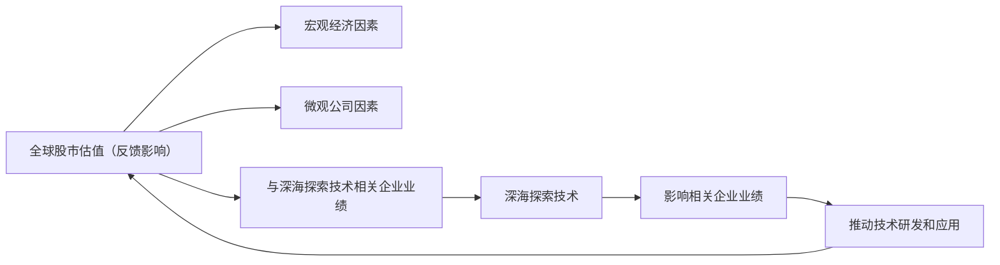

# 全球股市估值与深海探索技术的关系

> 关键词：全球股市估值、深海探索技术、经济影响、技术创新、市场趋势、产业关联、风险评估

> 摘要：本文旨在深入探讨全球股市估值与深海探索技术之间的内在联系。通过对背景信息的介绍，阐述研究的目的、范围和预期读者等内容。详细解析核心概念，包括全球股市估值和深海探索技术的原理及相互联系，并以示意图和流程图呈现。讲解相关核心算法原理，结合 Python 代码说明。运用数学模型和公式进行分析并举例。通过项目实战案例进一步阐释两者关系，分析实际应用场景。同时推荐相关学习资源、开发工具和论文著作。最后总结未来发展趋势与挑战，解答常见问题，并提供扩展阅读和参考资料，全面揭示全球股市估值与深海探索技术之间复杂而微妙的关系。

## 1. 背景介绍 
### 1.1 目的和范围
本研究的目的在于揭示全球股市估值与深海探索技术之间潜在的关联和相互影响机制。随着全球经济的发展和科技的不断进步，深海探索技术逐渐成为一个具有巨大潜力的领域。了解其与全球股市估值的关系，有助于投资者更好地把握市场趋势，企业制定战略决策，政策制定者出台合理的政策。研究范围涵盖了全球主要股票市场的估值情况，以及深海探索技术的发展现状、趋势和相关产业。

### 1.2 预期读者
本文的预期读者包括金融投资者、股票分析师、深海探索技术领域的科研人员和企业管理者、政策制定者以及对经济和科技交叉领域感兴趣的学者和爱好者。对于投资者来说，可以从中获取关于股市投资的新视角和信息；科研人员和企业管理者能了解到技术发展对经济的影响，为技术研发和企业战略提供参考；政策制定者可以根据研究结果制定相关政策，促进深海探索技术产业和股市的健康发展。

### 1.3 文档结构概述
本文首先介绍了研究的背景信息，包括目的、范围、预期读者和文档结构概述。接着阐述核心概念，包括全球股市估值和深海探索技术的定义、原理以及它们之间的联系，并以示意图和流程图进行直观展示。然后讲解核心算法原理，通过 Python 代码详细说明。运用数学模型和公式对两者关系进行分析，并举例说明。通过项目实战案例，包括开发环境搭建、源代码实现和解读，进一步阐释两者关系。分析实际应用场景，推荐相关的学习资源、开发工具和论文著作。最后总结未来发展趋势与挑战，解答常见问题，并提供扩展阅读和参考资料。

### 1.4 术语表
#### 1.4.1 核心术语定义
- **全球股市估值**：是指对全球范围内各个股票市场中上市公司的价值进行评估的过程和结果。通常采用市盈率（P/E）、市净率（P/B）、股息率等指标来衡量。
- **深海探索技术**：是指人类为了了解深海环境、开发深海资源而采用的一系列技术手段，包括深海探测设备、潜水器技术、水下通信技术、深海资源开采技术等。

#### 1.4.2 相关概念解释
- **市盈率（P/E）**：是指股票价格除以每股收益（EPS）的比率，反映了投资者为获取公司每一元盈利所愿意支付的价格。
- **市净率（P/B）**：是指股票价格除以每股净资产的比率，用于评估股票的市场价值相对于其账面价值的高低。
- **股息率**：是指股息与股票价格之间的比率，反映了投资者从股票投资中获得的股息收益。

#### 1.4.3 缩略词列表
- **P/E**：市盈率（Price-to-Earnings Ratio）
- **P/B**：市净率（Price-to-Book Ratio）

## 2. 核心概念与联系 

### 全球股市估值
全球股市估值是一个复杂的过程，受到多种因素的影响。从宏观层面来看，经济增长、通货膨胀、利率水平等因素会影响整个股市的估值。例如，当经济增长强劲时，企业的盈利预期增加，股市估值往往会上升；而通货膨胀和利率上升可能会导致股市估值下降。从微观层面来看，公司的业绩、行业前景、管理水平等因素也会影响个股的估值。

### 深海探索技术
深海探索技术是一个不断发展的领域，其目的是探索深海的奥秘，开发深海资源。深海环境具有高压、低温、黑暗等特点，对技术提出了很高的要求。目前，深海探索技术主要包括深海探测设备，如声纳、雷达等，用于探测深海地形和资源；潜水器技术，如载人潜水器和无人潜水器，用于进行深海采样和观测；水下通信技术，用于实现深海与陆地的信息传输；深海资源开采技术，如深海石油开采、深海矿产开采等。

### 两者的联系
全球股市估值与深海探索技术之间存在着密切的联系。一方面，深海探索技术的发展会影响相关企业的业绩和前景，从而影响股市估值。例如，深海石油开采技术的进步可能会提高石油企业的产量和利润，从而提升其在股市中的估值。另一方面，股市估值的变化也会影响深海探索技术的发展。当股市估值上升时，相关企业可以更容易地筹集资金，用于技术研发和设备更新，从而推动深海探索技术的发展；反之，当股市估值下降时，企业的融资难度增加，可能会影响技术的研发和应用。

### 文本示意图
```plaintext
全球股市估值
        |
        | 受宏观经济因素影响
        | 受微观公司因素影响
        |
        | 与深海探索技术相关企业业绩关联
        |
        V
深海探索技术
        |
        | 影响相关企业业绩
        | 推动技术研发和应用
        |
        V
全球股市估值（反馈影响）
```

### Mermaid 流程图


## 3. 核心算法原理 & 具体操作步骤 

### 核心算法原理
为了分析全球股市估值与深海探索技术之间的关系，我们可以采用多元线性回归模型。多元线性回归模型可以用来描述一个因变量与多个自变量之间的线性关系。在这个问题中，我们可以将全球股市估值作为因变量，将深海探索技术相关的指标（如研发投入、技术成果数量等）以及其他影响股市估值的因素（如经济增长、利率等）作为自变量。

多元线性回归模型的一般形式为：

$y = \beta_0 + \beta_1x_1 + \beta_2x_2 + \cdots + \beta_nx_n + \epsilon$

其中，$y$ 是因变量，$x_1, x_2, \cdots, x_n$ 是自变量，$\beta_0, \beta_1, \beta_2, \cdots, \beta_n$ 是回归系数，$\epsilon$ 是误差项。

### 具体操作步骤
1. **数据收集**：收集全球股市估值的数据，如市盈率、市净率等；收集深海探索技术相关的数据，如研发投入、技术成果数量等；收集其他影响股市估值的因素的数据，如经济增长率、利率等。
2. **数据预处理**：对收集到的数据进行清洗、缺失值处理、异常值处理等，确保数据的质量。
3. **模型建立**：根据多元线性回归模型的原理，建立全球股市估值与深海探索技术及其他影响因素之间的回归模型。
4. **模型训练**：使用收集到的数据对回归模型进行训练，估计回归系数。
5. **模型评估**：使用评估指标（如均方误差、决定系数等）对训练好的模型进行评估，判断模型的拟合效果。
6. **结果分析**：分析回归系数的显著性和正负性，判断深海探索技术及其他因素对全球股市估值的影响程度和方向。

### Python 代码实现
```python
import pandas as pd
import numpy as np
from sklearn.linear_model import LinearRegression
from sklearn.model_selection import train_test_split
from sklearn.metrics import mean_squared_error, r2_score

# 假设我们已经收集到了相关数据，并存储在一个 CSV 文件中
data = pd.read_csv('stock_valuation_and_deep_sea_technology.csv')

# 分离自变量和因变量
X = data.drop('stock_valuation', axis=1)
y = data['stock_valuation']

# 划分训练集和测试集
X_train, X_test, y_train, y_test = train_test_split(X, y, test_size=0.2, random_state=42)

# 建立线性回归模型
model = LinearRegression()

# 训练模型
model.fit(X_train, y_train)

# 预测
y_pred = model.predict(X_test)

# 评估模型
mse = mean_squared_error(y_test, y_pred)
r2 = r2_score(y_test, y_pred)

print(f"均方误差: {mse}")
print(f"决定系数: {r2}")

# 分析回归系数
coefficients = pd.DataFrame({'特征': X.columns, '系数': model.coef_})
print(coefficients)
```

## 4. 数学模型和公式 & 详细讲解 & 举例说明 

### 多元线性回归模型公式
在前面我们已经介绍了多元线性回归模型的一般形式：

$y = \beta_0 + \beta_1x_1 + \beta_2x_2 + \cdots + \beta_nx_n + \epsilon$

其中，$y$ 是因变量，代表全球股市估值；$x_1, x_2, \cdots, x_n$ 是自变量，$x_1$ 可以代表深海探索技术的研发投入，$x_2$ 可以代表经济增长率，$x_3$ 可以代表利率等；$\beta_0, \beta_1, \beta_2, \cdots, \beta_n$ 是回归系数，$\beta_0$ 是截距项，$\beta_1$ 表示当其他自变量不变时，$x_1$ 每增加一个单位，$y$ 的平均变化量；$\epsilon$ 是误差项，代表模型无法解释的随机因素。

### 最小二乘法估计回归系数
为了估计回归系数 $\beta_0, \beta_1, \beta_2, \cdots, \beta_n$，我们通常采用最小二乘法。最小二乘法的目标是使误差项的平方和最小，即：

$S(\beta_0, \beta_1, \cdots, \beta_n) = \sum_{i=1}^{m}(y_i - \hat{y}_i)^2 = \sum_{i=1}^{m}(y_i - (\beta_0 + \beta_1x_{i1} + \beta_2x_{i2} + \cdots + \beta_nx_{in}))^2$

其中，$m$ 是样本数量，$y_i$ 是第 $i$ 个样本的实际值，$\hat{y}_i$ 是第 $i$ 个样本的预测值。

通过对 $S(\beta_0, \beta_1, \cdots, \beta_n)$ 求偏导数并令其等于 0，可以得到回归系数的估计值。

### 决定系数和均方误差
决定系数 $R^2$ 是用来衡量回归模型拟合效果的指标，其计算公式为：

$R^2 = 1 - \frac{\sum_{i=1}^{m}(y_i - \hat{y}_i)^2}{\sum_{i=1}^{m}(y_i - \bar{y})^2}$

其中，$\bar{y}$ 是 $y$ 的平均值。$R^2$ 的取值范围是 $[0, 1]$，$R^2$ 越接近 1，说明模型的拟合效果越好。

均方误差（MSE）是用来衡量预测值与实际值之间的平均误差的指标，其计算公式为：

$MSE = \frac{1}{m}\sum_{i=1}^{m}(y_i - \hat{y}_i)^2$

### 举例说明
假设我们收集了 100 个样本数据，其中包括全球股市估值（$y$）、深海探索技术研发投入（$x_1$）、经济增长率（$x_2$）和利率（$x_3$）。通过最小二乘法估计得到回归系数 $\beta_0 = 10$，$\beta_1 = 0.5$，$\beta_2 = 2$，$\beta_3 = -1$。那么回归方程为：

$y = 10 + 0.5x_1 + 2x_2 - x_3$

如果某个样本的深海探索技术研发投入为 20，经济增长率为 3%，利率为 2%，则预测的全球股市估值为：

$y = 10 + 0.5\times20 + 2\times3 - 2 = 24$

假设通过计算得到决定系数 $R^2 = 0.8$，均方误差 $MSE = 5$。这说明模型的拟合效果较好，预测值与实际值之间的平均误差为 5。

## 5. 项目实战：代码实际案例和详细解释说明 

### 5.1  开发环境搭建
#### 操作系统
可以选择 Windows、Linux 或 macOS 操作系统，这里以 Windows 为例进行说明。

#### Python 安装
从 Python 官方网站（https://www.python.org/downloads/）下载 Python 3.x 版本，并按照安装向导进行安装。安装过程中注意勾选“Add Python to PATH”选项，以便在命令行中可以直接使用 Python 命令。

#### 虚拟环境创建
为了避免不同项目之间的依赖冲突，建议使用虚拟环境。可以使用 `venv` 模块创建虚拟环境，在命令行中执行以下命令：

```sh
python -m venv myenv
```

其中，`myenv` 是虚拟环境的名称，可以根据需要进行修改。

#### 激活虚拟环境
在 Windows 系统中，执行以下命令激活虚拟环境：

```sh
myenv\Scripts\activate
```

#### 安装必要的库
在激活的虚拟环境中，使用 `pip` 命令安装必要的库，包括 `pandas`、`numpy`、`scikit-learn` 等：

```sh
pip install pandas numpy scikit-learn
```

### 5.2  源代码详细实现和代码解读
```python
import pandas as pd
import numpy as np
from sklearn.linear_model import LinearRegression
from sklearn.model_selection import train_test_split
from sklearn.metrics import mean_squared_error, r2_score

# 读取数据
data = pd.read_csv('stock_valuation_and_deep_sea_technology.csv')

# 代码解读：使用 pandas 的 read_csv 函数读取存储在 CSV 文件中的数据，并将其存储在 DataFrame 对象 data 中。

# 分离自变量和因变量
X = data.drop('stock_valuation', axis=1)
y = data['stock_valuation']

# 代码解读：使用 drop 方法从 DataFrame 中删除 'stock_valuation' 列，得到自变量 X；将 'stock_valuation' 列作为因变量 y。

# 划分训练集和测试集
X_train, X_test, y_train, y_test = train_test_split(X, y, test_size=0.2, random_state=42)

# 代码解读：使用 train_test_split 函数将数据集划分为训练集和测试集，其中测试集占总数据集的 20%，random_state 参数用于保证每次划分的结果相同。

# 建立线性回归模型
model = LinearRegression()

# 代码解读：创建一个 LinearRegression 对象，用于建立线性回归模型。

# 训练模型
model.fit(X_train, y_train)

# 代码解读：使用训练集数据对线性回归模型进行训练，估计回归系数。

# 预测
y_pred = model.predict(X_test)

# 代码解读：使用训练好的模型对测试集数据进行预测，得到预测值 y_pred。

# 评估模型
mse = mean_squared_error(y_test, y_pred)
r2 = r2_score(y_test, y_pred)

print(f"均方误差: {mse}")
print(f"决定系数: {r2}")

# 代码解读：使用 mean_squared_error 函数计算均方误差，使用 r2_score 函数计算决定系数，并将结果打印输出。

# 分析回归系数
coefficients = pd.DataFrame({'特征': X.columns, '系数': model.coef_})
print(coefficients)

# 代码解读：将回归系数和对应的特征名称存储在 DataFrame 中，并打印输出，以便分析每个特征对因变量的影响程度。
```

### 5.3  代码解读与分析
- **数据读取**：使用 `pandas` 库的 `read_csv` 函数读取存储在 CSV 文件中的数据，将其转换为 `DataFrame` 对象，方便后续的数据处理和分析。
- **数据划分**：使用 `train_test_split` 函数将数据集划分为训练集和测试集，这是机器学习中常用的方法，用于评估模型的泛化能力。
- **模型建立和训练**：使用 `LinearRegression` 类创建线性回归模型，并使用训练集数据对模型进行训练，估计回归系数。
- **模型预测和评估**：使用训练好的模型对测试集数据进行预测，得到预测值。使用 `mean_squared_error` 和 `r2_score` 函数分别计算均方误差和决定系数，评估模型的拟合效果。
- **回归系数分析**：将回归系数和对应的特征名称存储在 `DataFrame` 中，通过分析回归系数的正负和大小，可以判断每个特征对全球股市估值的影响程度和方向。

## 6. 实际应用场景 
### 投资决策
对于投资者来说，了解全球股市估值与深海探索技术之间的关系可以帮助他们做出更明智的投资决策。如果深海探索技术领域有重大的技术突破或研发投入增加，可能会带动相关企业的业绩增长，从而提升其在股市中的估值。投资者可以根据这些信息，选择投资深海探索技术相关的股票，获取更高的收益。

### 企业战略规划
对于深海探索技术相关的企业来说，股市估值的变化会影响企业的融资能力和市场形象。当股市估值上升时，企业可以更容易地筹集资金，用于技术研发和设备更新，扩大生产规模。企业可以根据股市估值的变化，制定合理的战略规划，如加大研发投入、拓展市场等。

### 政策制定
政策制定者可以根据全球股市估值与深海探索技术之间的关系，制定相关的政策，促进深海探索技术产业的发展和股市的稳定。例如，政府可以出台税收优惠政策，鼓励企业加大对深海探索技术的研发投入；可以加强对股市的监管，防范金融风险。

### 科研方向引导
科研人员可以通过分析全球股市估值与深海探索技术之间的关系，了解市场对深海探索技术的需求和关注点。根据市场需求，调整科研方向，开展更有针对性的研究，提高科研成果的转化率。

## 7. 工具和资源推荐
### 7.1 学习资源推荐
#### 7.1.1 书籍推荐
- 《金融市场学》：介绍了金融市场的基本概念、运行机制和分析方法，对于理解全球股市估值有很大的帮助。
- 《海洋技术概论》：全面介绍了海洋技术的各个领域，包括深海探索技术，适合作为深海探索技术的入门书籍。
- 《Python 数据分析实战》：详细介绍了使用 Python 进行数据分析的方法和技巧，对于处理和分析全球股市估值和深海探索技术相关的数据非常有用。

#### 7.1.2 在线课程
- Coursera 上的“Financial Markets”课程：由耶鲁大学教授 Robert Shiller 主讲，深入讲解了金融市场的理论和实践。
- edX 上的“Ocean Technology and Engineering”课程：介绍了海洋技术的最新发展和应用。
- 慕课网上的“Python 数据分析与挖掘实战”课程：通过实际案例，讲解了如何使用 Python 进行数据分析和挖掘。

#### 7.1.3 技术博客和网站
- Seeking Alpha：提供了全球股市的分析和评论，对于了解股市动态和估值情况有很大的帮助。
- Ocean Technology Foundation：专注于海洋技术的发展和应用，提供了深海探索技术的最新资讯和研究成果。
- Medium 上的“Data Science”板块：有很多关于数据分析和机器学习的文章，对于学习相关技术有很大的启发。

### 7.2 开发工具框架推荐
#### 7.2.1 IDE和编辑器
- PyCharm：是一款专业的 Python 集成开发环境，提供了代码编辑、调试、版本控制等功能，适合开发大型的 Python 项目。
- Jupyter Notebook：是一个交互式的开发环境，支持 Python、R 等多种编程语言，适合进行数据分析和可视化。
- Visual Studio Code：是一款轻量级的代码编辑器，支持多种编程语言，有丰富的插件和扩展，适合快速开发和调试代码。

#### 7.2.2 调试和性能分析工具
- PDB：是 Python 自带的调试工具，可以帮助开发者定位代码中的错误。
- cProfile：是 Python 自带的性能分析工具，可以分析代码的运行时间和函数调用情况，帮助开发者优化代码性能。
- Py-Spy：是一个跨平台的 Python 性能分析工具，可以实时监控 Python 程序的性能，找出性能瓶颈。

#### 7.2.3 相关框架和库
- Pandas：是一个强大的数据分析库，提供了数据结构和数据分析工具，适合处理和分析全球股市估值和深海探索技术相关的数据。
- NumPy：是 Python 的数值计算库，提供了高效的数组和矩阵运算功能，是很多数据分析和机器学习库的基础。
- Scikit-learn：是一个常用的机器学习库，提供了各种机器学习算法和工具，适合建立和训练全球股市估值与深海探索技术之间的回归模型。

### 7.3 相关论文著作推荐
#### 7.3.1 经典论文
- Fama, E. F., & French, K. R. (1992). The cross-section of expected stock returns. Journal of Finance, 47(2), 427-465. 该论文提出了著名的 Fama-French 三因子模型，用于解释股票回报率的差异。
- Merton, R. C. (1973). Theory of rational option pricing. The Bell Journal of Economics and Management Science, 4(1), 141-183. 该论文提出了期权定价的经典理论，对金融市场的定价和风险管理有重要影响。

#### 7.3.2 最新研究成果
- 关于深海探索技术对海洋经济发展影响的研究论文，发表在《Marine Policy》等期刊上。
- 关于全球股市估值与科技创新关系的研究论文，发表在《Journal of Financial Economics》等期刊上。

#### 7.3.3 应用案例分析
- 分析某深海探索技术企业上市前后股市估值变化的案例，以及该企业的技术研发和市场拓展策略。
- 研究某国家或地区出台促进深海探索技术产业发展政策后，相关企业股市估值和产业发展的变化情况。

## 8. 总结：未来发展趋势与挑战
### 未来发展趋势
#### 技术创新推动
随着科技的不断进步，深海探索技术将不断创新和发展。例如，更先进的潜水器技术、更高效的深海资源开采技术等将不断涌现。这些技术创新将提高深海探索的效率和成功率，降低成本，从而推动深海探索技术产业的发展，进而影响全球股市估值。

#### 产业融合加深
深海探索技术产业将与其他产业（如能源、环保、旅游等）深度融合。例如，深海石油开采技术的发展将带动能源产业的发展；深海生态环境监测技术的应用将促进环保产业的发展。产业融合将创造更多的商业机会和价值，对全球股市估值产生积极影响。

#### 国际合作加强
深海探索是一个全球性的挑战，需要各国之间加强合作。未来，国际间在深海探索技术研发、资源开发等方面的合作将不断加强。通过合作，可以共享技术和资源，降低成本和风险，推动深海探索技术的发展，进而影响全球股市估值。

### 挑战
#### 技术难题
深海环境具有高压、低温、黑暗等极端条件，对深海探索技术提出了很高的要求。目前，仍然存在一些技术难题需要解决，如深海通信技术的可靠性、深海资源开采技术的环保性等。解决这些技术难题需要大量的研发投入和时间。

#### 资金短缺
深海探索技术研发和应用需要大量的资金投入。对于一些企业和国家来说，资金短缺可能会限制深海探索技术的发展。如何筹集足够的资金，是深海探索技术产业面临的一个重要挑战。

#### 政策法规不完善
深海探索涉及到资源开发、环境保护等多个方面，需要完善的政策法规来规范和引导。目前，相关的政策法规还不够完善，存在一些空白和漏洞。制定和完善政策法规，是保障深海探索技术产业健康发展的重要前提。

#### 市场风险
全球股市估值受到多种因素的影响，市场风险较大。深海探索技术产业作为一个新兴产业，市场不确定性更高。投资者对深海探索技术相关企业的信心可能会受到市场波动的影响，从而影响股市估值。

## 9. 附录：常见问题与解答
### 1. 全球股市估值与深海探索技术之间的关系一定是正相关吗？
不一定。虽然深海探索技术的发展可能会带动相关企业的业绩增长，从而提升股市估值，但这种关系并不是绝对的。如果深海探索技术的研发投入过大，而短期内无法获得相应的回报，可能会导致企业业绩下滑，股市估值下降。此外，全球股市估值还受到宏观经济因素、市场情绪等多种因素的影响，因此两者之间的关系是复杂的，不一定是正相关。

### 2. 如何衡量深海探索技术对全球股市估值的影响程度？
可以使用多元线性回归模型等统计方法，将全球股市估值作为因变量，将深海探索技术相关的指标（如研发投入、技术成果数量等）以及其他影响股市估值的因素作为自变量，建立回归模型。通过分析回归系数的大小和显著性，可以衡量深海探索技术对全球股市估值的影响程度。

### 3. 深海探索技术相关企业的股市估值是否只受技术因素的影响？
不是。深海探索技术相关企业的股市估值受到多种因素的影响，除了技术因素外，还包括企业的管理水平、市场竞争力、财务状况等。例如，一家技术先进但管理混乱的企业，其股市估值可能并不高。此外，宏观经济环境、行业政策等外部因素也会对企业的股市估值产生影响。

### 4. 对于投资者来说，投资深海探索技术相关股票有哪些风险？
投资深海探索技术相关股票存在以下风险：
- 技术风险：深海探索技术研发难度大，存在技术失败的风险。如果企业的技术研发失败，可能会导致业绩下滑，股市估值下降。
- 市场风险：全球股市估值受到多种因素的影响，市场波动较大。深海探索技术相关股票作为新兴产业的股票，市场不确定性更高，价格波动可能更为剧烈。
- 政策风险：深海探索涉及到资源开发、环境保护等多个方面，政策法规的变化可能会对企业的发展产生重大影响。如果政策法规不利于企业的发展，可能会导致股市估值下降。

### 5. 如何获取全球股市估值和深海探索技术相关的数据？
可以通过以下途径获取相关数据：
- 金融数据提供商：如 Bloomberg、Wind 等，提供全球股市的估值数据和相关信息。
- 政府部门和行业协会：政府部门和行业协会发布的统计数据和报告，可能包含深海探索技术相关的数据。
- 科研机构和学术期刊：科研机构和学术期刊上发表的研究论文，可能会提供深海探索技术的最新研究成果和数据。

## 10. 扩展阅读 & 参考资料
### 扩展阅读
- 《智能时代》：介绍了人工智能、大数据等新兴技术对社会和经济的影响，对于理解科技与经济的关系有很大的帮助。
- 《海洋经济概论》：全面介绍了海洋经济的各个领域，包括深海探索技术产业，适合进一步了解深海探索技术的经济意义。
- 《金融炼金术》：作者 George Soros 提出了反身性理论，对于理解金融市场的运行机制和股市估值有独特的视角。

### 参考资料
- Fama, E. F., & French, K. R. (1992). The cross-section of expected stock returns. Journal of Finance, 47(2), 427-465.
- Merton, R. C. (1973). Theory of rational option pricing. The Bell Journal of Economics and Management Science, 4(1), 141-183.
- Bloomberg 金融数据库
- Wind 金融终端

作者：AI天才研究院/AI Genius Institute & 禅与计算机程序设计艺术 /Zen And The Art of Computer Programming