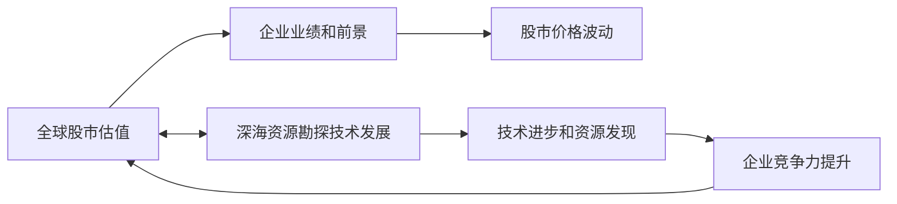

# 全球股市估值与深海资源勘探技术的发展

> 关键词：全球股市估值、深海资源勘探技术、金融市场、资源开发、经济影响

> 摘要：本文旨在深入探讨全球股市估值与深海资源勘探技术发展之间的关联。通过分析股市估值的原理和方法，阐述深海资源勘探技术的现状、核心原理以及发展趋势，揭示两者之间相互影响的机制。同时，结合实际案例和数学模型，探讨深海资源勘探技术对相关企业股市估值的影响，以及股市估值对深海资源勘探技术研发投入和产业发展的反馈作用。此外，还介绍了相关的工具和资源，对未来的发展趋势和挑战进行了总结，并解答了常见问题，为投资者、科研人员和政策制定者提供全面的参考。

## 1. 背景介绍 
### 1.1 目的和范围
本研究的目的是全面分析全球股市估值与深海资源勘探技术发展之间的内在联系。范围涵盖了全球主要金融市场的股市估值情况，以及深海资源勘探技术的各个方面，包括技术原理、发展现状、应用领域和未来趋势。通过对两者关系的研究，旨在为投资者提供决策参考，为科研人员指明研究方向，为政策制定者提供制定相关政策的依据。

### 1.2 预期读者
本文预期读者包括金融投资者、股票分析师、深海资源勘探技术科研人员、海洋资源开发企业管理人员、政策制定者以及对金融市场和深海资源开发感兴趣的一般读者。

### 1.3 文档结构概述
本文首先介绍了研究的背景、目的、预期读者和文档结构，以及相关术语的定义。接着阐述了全球股市估值和深海资源勘探技术的核心概念及其联系，并给出了相应的示意图和流程图。然后详细讲解了核心算法原理和具体操作步骤，包括股市估值算法和深海资源勘探技术中的相关算法。之后介绍了数学模型和公式，并通过具体例子进行说明。在项目实战部分，给出了代码实际案例并进行详细解释。随后分析了实际应用场景，推荐了相关的工具和资源。最后总结了未来发展趋势与挑战，解答了常见问题，并提供了扩展阅读和参考资料。

### 1.4 术语表
#### 1.4.1 核心术语定义
- **全球股市估值**：是指对全球范围内各个股票市场中上市公司股票价值的评估。它是通过各种方法和模型，综合考虑公司的财务状况、盈利能力、市场前景等因素，来确定股票的合理价格。
- **深海资源勘探技术**：是指用于探测、识别和评估深海区域内各种资源（如矿产资源、能源资源、生物资源等）的技术手段和方法。包括地质勘探技术、地球物理勘探技术、海洋生物技术等。
- **市盈率（P/E）**：是指股票价格除以每股收益的比率，反映了投资者为获取公司每一元盈利所愿意支付的价格。
- **市净率（P/B）**：是指股票价格与每股净资产的比率，用于衡量股票的估值是否合理，反映了市场对公司资产质量的评价。

#### 1.4.2 相关概念解释
- **股票市场**：是股票发行和交易的场所，包括证券交易所和场外交易市场。股票市场的主要功能是为企业融资和投资者提供投资机会。
- **深海资源**：是指分布在海洋深处（通常指水深超过 200 米的区域）的各种自然资源，包括石油、天然气、多金属结核、热液硫化物、可燃冰等矿产资源，以及深海生物资源等。
- **资源勘探**：是指通过各种技术手段和方法，对潜在的资源区域进行调查和研究，以确定资源的种类、储量、分布和质量等情况。

#### 1.4.3 缩略词列表
- **P/E**：市盈率（Price-to-Earnings Ratio）
- **P/B**：市净率（Price-to-Book Ratio）
- **ROE**：净资产收益率（Return on Equity）

## 2. 核心概念与联系 

### 全球股市估值的核心概念
全球股市估值是金融领域的重要概念，它反映了市场对上市公司价值的评估。常见的股市估值方法包括市盈率法、市净率法、现金流折现法等。

- **市盈率法**：市盈率是最常用的估值指标之一，其计算公式为 $P/E = \frac{股价}{每股收益}$。市盈率反映了投资者对公司未来盈利的预期。一般来说，市盈率越高，说明市场对公司的未来盈利预期越高，但也可能意味着股票被高估。
- **市净率法**：市净率的计算公式为 $P/B = \frac{股价}{每股净资产}$。市净率衡量了股票价格相对于公司净资产的倍数。市净率较低的股票可能被低估，具有一定的投资价值。
- **现金流折现法**：该方法通过预测公司未来的现金流，并将其折现到当前时刻，来确定公司的内在价值。其基本公式为 $V = \sum_{t=1}^{n} \frac{CF_t}{(1 + r)^t}$，其中 $V$ 为公司的内在价值，$CF_t$ 为第 $t$ 期的现金流，$r$ 为折现率，$n$ 为预测期数。

### 深海资源勘探技术的核心概念
深海资源勘探技术是一门综合性的技术领域，旨在发现和评估深海中的各种资源。主要的勘探技术包括：

- **地质勘探技术**：通过采集深海海底的岩石样本、沉积物样本等，分析其地质构造和成分，以寻找潜在的矿产资源。
- **地球物理勘探技术**：利用地球物理场（如重力场、磁场、电场等）的变化来探测海底的地质结构和资源分布。常见的地球物理勘探方法包括地震勘探、重力勘探、磁力勘探等。
- **海洋生物技术**：用于研究深海生物的种类、分布和生态特征，以及开发深海生物资源的技术。

### 两者的联系
全球股市估值与深海资源勘探技术的发展存在着密切的联系。一方面，深海资源勘探技术的进步会影响相关企业的业绩和前景，从而影响其股市估值。例如，如果一家企业成功研发出更先进的深海资源勘探技术，能够提高资源勘探的效率和准确性，那么该企业的市场竞争力将增强，其股市估值也可能随之提高。另一方面，股市估值也会对深海资源勘探技术的发展产生反馈作用。如果市场对深海资源勘探相关企业的估值较高，企业将更容易获得融资，从而有更多的资金投入到技术研发和资源勘探中，推动深海资源勘探技术的发展。

### 文本示意图
```plaintext
全球股市估值 <-- 影响 --> 深海资源勘探技术发展
    |                      |
    | 企业业绩和前景      | 技术进步和资源发现
    |                      |
    v                      v
股市价格波动             企业竞争力提升
```

### Mermaid 流程图


## 3. 核心算法原理 & 具体操作步骤 

### 股市估值算法原理及 Python 实现

#### 市盈率法
市盈率法是一种简单直观的股市估值方法。下面是使用 Python 实现市盈率法估值的代码示例：

```python
def pe_valuation(price, earnings_per_share):
    """
    计算市盈率并进行简单估值
    :param price: 股票价格
    :param earnings_per_share: 每股收益
    :return: 市盈率
    """
    pe = price / earnings_per_share
    return pe

# 示例数据
stock_price = 50
eps = 2
pe_ratio = pe_valuation(stock_price, eps)
print(f"该股票的市盈率为: {pe_ratio}")
```

#### 市净率法
市净率法也是常用的估值方法之一。以下是使用 Python 实现市净率法估值的代码：

```python
def pb_valuation(price, book_value_per_share):
    """
    计算市净率并进行简单估值
    :param price: 股票价格
    :param book_value_per_share: 每股净资产
    :return: 市净率
    """
    pb = price / book_value_per_share
    return pb

# 示例数据
stock_price = 50
book_value = 10
pb_ratio = pb_valuation(stock_price, book_value)
print(f"该股票的市净率为: {pb_ratio}")
```

#### 现金流折现法
现金流折现法相对复杂，需要预测未来的现金流和确定合适的折现率。以下是一个简化的现金流折现法 Python 实现：

```python
def dcf_valuation(cash_flows, discount_rate):
    """
    现金流折现法估值
    :param cash_flows: 未来各期的现金流列表
    :param discount_rate: 折现率
    :return: 公司的内在价值
    """
    value = 0
    for i, cf in enumerate(cash_flows):
        value += cf / ((1 + discount_rate) ** (i + 1))
    return value

# 示例数据
cash_flows = [100, 120, 150, 180, 200]
discount_rate = 0.1
intrinsic_value = dcf_valuation(cash_flows, discount_rate)
print(f"该公司的内在价值为: {intrinsic_value}")
```

### 深海资源勘探技术中的算法原理及 Python 实现

#### 地震勘探数据处理算法
地震勘探是地球物理勘探的重要方法之一，其数据处理涉及到滤波、反褶积等算法。下面是一个简单的地震信号滤波处理的 Python 示例：

```python
import numpy as np
import matplotlib.pyplot as plt

# 生成模拟地震信号
t = np.linspace(0, 1, 1000)
signal = np.sin(2 * np.pi * 10 * t) + 0.5 * np.sin(2 * np.pi * 50 * t)

# 设计低通滤波器
def lowpass_filter(signal, cutoff_freq, sample_freq):
    """
    低通滤波器
    :param signal: 输入信号
    :param cutoff_freq: 截止频率
    :param sample_freq: 采样频率
    :return: 滤波后的信号
    """
    n = len(signal)
    fft_signal = np.fft.fft(signal)
    frequencies = np.fft.fftfreq(n, 1/sample_freq)
    mask = np.abs(frequencies) < cutoff_freq
    filtered_fft = fft_signal * mask
    filtered_signal = np.fft.ifft(filtered_fft)
    return np.real(filtered_signal)

# 应用低通滤波器
cutoff_freq = 20
sample_freq = 1000
filtered_signal = lowpass_filter(signal, cutoff_freq, sample_freq)

# 绘制原始信号和滤波后的信号
plt.figure(figsize=(12, 6))
plt.subplot(2, 1, 1)
plt.plot(t, signal, label='Original Signal')
plt.title('Original Seismic Signal')
plt.xlabel('Time (s)')
plt.ylabel('Amplitude')
plt.legend()

plt.subplot(2, 1, 2)
plt.plot(t, filtered_signal, label='Filtered Signal', color='orange')
plt.title('Filtered Seismic Signal')
plt.xlabel('Time (s)')
plt.ylabel('Amplitude')
plt.legend()

plt.tight_layout()
plt.show()
```

## 4. 数学模型和公式 & 详细讲解 & 举例说明 

### 股市估值的数学模型和公式

#### 市盈率模型
市盈率模型的基本公式为 $P = E \times P/E$，其中 $P$ 为股票价格，$E$ 为每股收益，$P/E$ 为市盈率。

例如，某公司的每股收益为 3 元，行业平均市盈率为 20 倍，则该公司股票的合理价格为 $P = 3 \times 20 = 60$ 元。

#### 市净率模型
市净率模型的公式为 $P = B \times P/B$，其中 $P$ 为股票价格，$B$ 为每股净资产，$P/B$ 为市净率。

假设某公司的每股净资产为 10 元，市净率为 1.5 倍，则该公司股票的合理价格为 $P = 10 \times 1.5 = 15$ 元。

#### 现金流折现模型
现金流折现模型的公式为 $V = \sum_{t=1}^{n} \frac{CF_t}{(1 + r)^t}$，其中 $V$ 为公司的内在价值，$CF_t$ 为第 $t$ 期的现金流，$r$ 为折现率，$n$ 为预测期数。

例如，某公司未来 5 年的现金流分别为 100 万元、120 万元、150 万元、180 万元、200 万元，折现率为 10%，则该公司的内在价值为：

\[
\begin{align*}
V &= \frac{100}{(1 + 0.1)^1} + \frac{120}{(1 + 0.1)^2} + \frac{150}{(1 + 0.1)^3} + \frac{180}{(1 + 0.1)^4} + \frac{200}{(1 + 0.1)^5}\\
&= \frac{100}{1.1} + \frac{120}{1.21} + \frac{150}{1.331} + \frac{180}{1.4641} + \frac{200}{1.61051}\\
&\approx 90.91 + 99.17 + 112.69 + 122.94 + 124.18\\
&= 549.89 \text{（万元）}
\end{align*}
\]

### 深海资源勘探技术中的数学模型和公式

#### 重力勘探中的重力异常公式
重力异常是重力勘探中的重要参数，其计算公式为 $\Delta g = g_{obs} - g_{theo}$，其中 $\Delta g$ 为重力异常，$g_{obs}$ 为观测重力值，$g_{theo}$ 为理论重力值。

例如，在某一区域观测到的重力值为 $980.5 \text{ mGal}$，理论重力值为 $980.2 \text{ mGal}$，则该区域的重力异常为 $\Delta g = 980.5 - 980.2 = 0.3 \text{ mGal}$。

#### 地震波传播的波动方程
地震波在介质中的传播可以用波动方程来描述，一维波动方程的形式为 $\frac{\partial^2 u}{\partial t^2} = c^2 \frac{\partial^2 u}{\partial x^2}$，其中 $u(x,t)$ 为位移函数，$c$ 为波速。

假设地震波在某一介质中的波速为 $3000 \text{ m/s}$，初始时刻在 $x = 0$ 处有一个脉冲信号，其位移函数为 $u(0,t) = \sin(2\pi f t)$，其中 $f = 10 \text{ Hz}$。通过求解波动方程，可以得到地震波在不同位置和时间的传播情况。

## 5. 项目实战：代码实际案例和详细解释说明 

### 5.1  开发环境搭建
在进行股市估值和深海资源勘探技术相关的项目实战时，需要搭建相应的开发环境。以下是具体的搭建步骤：

#### 安装 Python
首先，需要安装 Python 编程语言。可以从 Python 官方网站（https://www.python.org/downloads/）下载适合自己操作系统的 Python 安装包，并按照安装向导进行安装。

#### 安装必要的 Python 库
在项目中，需要使用一些 Python 库来进行数据处理、数值计算和可视化等操作。常用的库包括：
- **NumPy**：用于数值计算和数组操作。
- **Pandas**：用于数据处理和分析。
- **Matplotlib**：用于数据可视化。
- **Scikit-learn**：用于机器学习和数据分析。

可以使用以下命令来安装这些库：
```sh
pip install numpy pandas matplotlib scikit-learn
```

### 5.2  源代码详细实现和代码解读

#### 股市估值项目实战
以下是一个综合使用市盈率法、市净率法和现金流折现法进行股市估值的 Python 代码示例：

```python
import numpy as np

def pe_valuation(price, earnings_per_share):
    """
    计算市盈率并进行简单估值
    :param price: 股票价格
    :param earnings_per_share: 每股收益
    :return: 市盈率
    """
    pe = price / earnings_per_share
    return pe

def pb_valuation(price, book_value_per_share):
    """
    计算市净率并进行简单估值
    :param price: 股票价格
    :param book_value_per_share: 每股净资产
    :return: 市净率
    """
    pb = price / book_value_per_share
    return pb

def dcf_valuation(cash_flows, discount_rate):
    """
    现金流折现法估值
    :param cash_flows: 未来各期的现金流列表
    :param discount_rate: 折现率
    :return: 公司的内在价值
    """
    value = 0
    for i, cf in enumerate(cash_flows):
        value += cf / ((1 + discount_rate) ** (i + 1))
    return value

# 示例数据
stock_price = 50
eps = 2
book_value = 10
cash_flows = [100, 120, 150, 180, 200]
discount_rate = 0.1

# 计算市盈率
pe_ratio = pe_valuation(stock_price, eps)
print(f"该股票的市盈率为: {pe_ratio}")

# 计算市净率
pb_ratio = pb_valuation(stock_price, book_value)
print(f"该股票的市净率为: {pb_ratio}")

# 计算现金流折现估值
intrinsic_value = dcf_valuation(cash_flows, discount_rate)
print(f"该公司的内在价值为: {intrinsic_value}")
```

**代码解读**：
- `pe_valuation` 函数：该函数接受股票价格和每股收益作为输入，计算并返回市盈率。
- `pb_valuation` 函数：该函数接受股票价格和每股净资产作为输入，计算并返回市净率。
- `dcf_valuation` 函数：该函数接受未来各期的现金流列表和折现率作为输入，使用现金流折现法计算公司的内在价值。
- 主程序部分：定义了示例数据，调用上述三个函数分别计算市盈率、市净率和现金流折现估值，并将结果打印输出。

#### 深海资源勘探技术项目实战
以下是一个简单的地震勘探数据处理项目实战代码示例：

```python
import numpy as np
import matplotlib.pyplot as plt

# 生成模拟地震信号
t = np.linspace(0, 1, 1000)
signal = np.sin(2 * np.pi * 10 * t) + 0.5 * np.sin(2 * np.pi * 50 * t)

# 设计低通滤波器
def lowpass_filter(signal, cutoff_freq, sample_freq):
    """
    低通滤波器
    :param signal: 输入信号
    :param cutoff_freq: 截止频率
    :param sample_freq: 采样频率
    :return: 滤波后的信号
    """
    n = len(signal)
    fft_signal = np.fft.fft(signal)
    frequencies = np.fft.fftfreq(n, 1/sample_freq)
    mask = np.abs(frequencies) < cutoff_freq
    filtered_fft = fft_signal * mask
    filtered_signal = np.fft.ifft(filtered_fft)
    return np.real(filtered_signal)

# 应用低通滤波器
cutoff_freq = 20
sample_freq = 1000
filtered_signal = lowpass_filter(signal, cutoff_freq, sample_freq)

# 绘制原始信号和滤波后的信号
plt.figure(figsize=(12, 6))
plt.subplot(2, 1, 1)
plt.plot(t, signal, label='Original Signal')
plt.title('Original Seismic Signal')
plt.xlabel('Time (s)')
plt.ylabel('Amplitude')
plt.legend()

plt.subplot(2, 1, 2)
plt.plot(t, filtered_signal, label='Filtered Signal', color='orange')
plt.title('Filtered Seismic Signal')
plt.xlabel('Time (s)')
plt.ylabel('Amplitude')
plt.legend()

plt.tight_layout()
plt.show()
```

**代码解读**：
- 生成模拟地震信号：使用 `np.linspace` 生成时间序列，然后使用 `np.sin` 函数生成包含不同频率成分的模拟地震信号。
- `lowpass_filter` 函数：该函数实现了一个简单的低通滤波器。首先对输入信号进行傅里叶变换，然后根据截止频率生成一个掩码，将高于截止频率的频率成分置为零，最后进行逆傅里叶变换得到滤波后的信号。
- 应用低通滤波器：设置截止频率和采样频率，调用 `lowpass_filter` 函数对模拟地震信号进行滤波处理。
- 绘制信号：使用 `matplotlib` 库绘制原始信号和滤波后的信号，以便直观地观察滤波效果。

### 5.3  代码解读与分析

#### 股市估值代码分析
在股市估值代码中，市盈率法和市净率法简单直观，能够快速对股票进行初步估值。但这两种方法也有局限性，市盈率法没有考虑公司的未来增长潜力，市净率法没有考虑公司的盈利能力。现金流折现法相对复杂，但能够更全面地考虑公司的未来现金流和折现率，更准确地评估公司的内在价值。然而，现金流折现法的准确性依赖于对未来现金流和折现率的准确预测，这在实际应用中具有一定的难度。

#### 深海资源勘探技术代码分析
在地震勘探数据处理代码中，低通滤波器的作用是去除地震信号中的高频噪声，保留低频有用信号。通过傅里叶变换将信号从时域转换到频域，然后在频域中进行滤波处理，最后再通过逆傅里叶变换将信号转换回时域。这种方法简单有效，但对于复杂的地震信号处理可能需要更高级的滤波算法和信号处理技术。

## 6. 实际应用场景 
### 金融投资领域
在金融投资领域，全球股市估值与深海资源勘探技术的发展密切相关。投资者可以通过分析深海资源勘探技术相关企业的股市估值，来判断其投资价值。例如，如果一家企业在深海资源勘探技术方面取得了重大突破，其未来的业绩有望大幅增长，那么该企业的股市估值可能会上升，投资者可以考虑买入该企业的股票。相反，如果一家企业在深海资源勘探项目中遭遇失败，其股市估值可能会下降，投资者应及时卖出该企业的股票。

### 资源开发领域
在资源开发领域，深海资源勘探技术的发展对于发现和开发深海资源至关重要。通过先进的勘探技术，可以更准确地确定深海资源的分布和储量，为资源开发企业提供决策依据。同时，股市估值也会影响资源开发企业的融资和投资决策。如果市场对深海资源开发企业的估值较高，企业将更容易获得融资，从而加大对深海资源勘探和开发的投入。

### 科研领域
在科研领域，深海资源勘探技术的研究需要大量的资金和资源支持。股市估值可以为科研机构和企业提供一个衡量技术价值的指标。如果一项深海资源勘探技术具有较高的市场前景和应用价值，相关企业的股市估值可能会上升，从而吸引更多的资金投入到该技术的研究和开发中。同时，科研成果的转化也会影响相关企业的股市估值，促进科研与产业的结合。

## 7. 工具和资源推荐
### 7.1 学习资源推荐
#### 7.1.1 书籍推荐
- 《证券分析》（本杰明·格雷厄姆著）：被誉为投资界的圣经，详细介绍了股票估值的方法和理论。
- 《深海探秘：海洋资源勘探与开发》（某海洋科研团队编著）：系统介绍了深海资源勘探技术的原理、方法和应用。
- 《Python 数据分析实战》（作者：某某）：介绍了使用 Python 进行数据分析的方法和技巧，对于处理股市数据和深海资源勘探数据非常有用。

#### 7.1.2 在线课程
- Coursera 平台上的“金融市场与投资策略”课程：由知名高校教授授课，深入讲解了金融市场的运行机制和投资策略。
- edX 平台上的“海洋科学与资源勘探”课程：介绍了海洋科学的基础知识和深海资源勘探技术。
- 网易云课堂上的“Python 数据分析入门”课程：适合初学者学习 Python 数据分析。

#### 7.1.3 技术博客和网站
- 雪球网：提供丰富的股市资讯和分析，是投资者交流和学习的重要平台。
- 海洋在线：专注于海洋领域的新闻和技术动态，提供深海资源勘探技术的最新信息。
- 博客园：有许多技术博主分享 Python 编程和数据分析的经验和技巧。

### 7.2 开发工具框架推荐
#### 7.2.1 IDE和编辑器
- PyCharm：是一款专业的 Python 集成开发环境，具有代码编辑、调试、版本控制等功能。
- Jupyter Notebook：是一个交互式的开发环境，适合进行数据分析和可视化。
- Visual Studio Code：是一款轻量级的代码编辑器，支持多种编程语言，具有丰富的插件扩展功能。

#### 7.2.2 调试和性能分析工具
- PDB：是 Python 自带的调试工具，可以帮助开发者定位代码中的错误。
- cProfile：是 Python 的性能分析工具，可以分析代码的运行时间和资源消耗情况。
- Memory Profiler：用于分析 Python 程序的内存使用情况。

#### 7.2.3 相关框架和库
- NumPy：用于数值计算和数组操作。
- Pandas：用于数据处理和分析。
- Matplotlib：用于数据可视化。
- Scikit-learn：用于机器学习和数据分析。

### 7.3 相关论文著作推荐
#### 7.3.1 经典论文
- “A Random Walk Down Wall Street”（作者：Burton G. Malkiel）：提出了随机漫步理论，对股票市场的有效性进行了深入探讨。
- “The Theory of Investment Value”（作者：John Burr Williams）：阐述了现金流折现法的基本原理。
- “Deep - Sea Mineral Resources: An Overview of Current Knowledge and Future Prospects”（作者：某海洋科研团队）：对深海矿产资源的现状和未来前景进行了全面综述。

#### 7.3.2 最新研究成果
- 近期发表在《Science》《Nature》等顶级期刊上关于深海资源勘探技术和股市估值模型的研究论文。
- 国际海洋研究机构发布的关于深海资源勘探技术的最新研究报告。

#### 7.3.3 应用案例分析
- 分析一些成功的深海资源勘探项目的案例，了解其技术应用和商业运作模式。
- 研究一些在股市估值方面表现出色的深海资源勘探相关企业的案例，总结其成功经验。

## 8. 总结：未来发展趋势与挑战
### 未来发展趋势
#### 技术创新推动
随着科技的不断进步，深海资源勘探技术将不断创新。例如，人工智能、机器学习等技术将被广泛应用于深海资源勘探数据的处理和分析，提高勘探效率和准确性。同时，新型的勘探设备和工具也将不断涌现，如更先进的水下机器人、传感器等。

#### 资源开发加速
随着全球对资源的需求不断增加，深海资源的开发将加速。深海石油、天然气、多金属结核等资源的开发将成为未来的热点。同时，深海生物资源的开发也将受到越来越多的关注，如深海药物的研发等。

#### 金融市场与技术融合加深
全球股市估值与深海资源勘探技术的发展将更加紧密地结合。金融市场将更加关注深海资源勘探技术相关企业的创新能力和发展前景，为其提供更多的融资支持。同时，深海资源勘探技术的发展也将为金融市场带来新的投资机会。

### 挑战
#### 技术难题
深海环境复杂恶劣，深海资源勘探技术面临着许多技术难题。例如，深海高压、低温、黑暗等环境条件对勘探设备和工具的性能提出了极高的要求。此外，深海资源的分布和赋存状态复杂，准确探测和评估资源储量仍然具有很大的难度。

#### 环境影响
深海资源开发可能会对海洋生态环境造成一定的影响。例如，开采深海矿产资源可能会导致海底地貌改变、海洋生物栖息地破坏等问题。因此，在进行深海资源开发时，需要充分考虑环境影响，采取有效的环境保护措施。

#### 政策法规不完善
目前，关于深海资源勘探和开发的政策法规还不完善。不同国家和地区对深海资源的管辖权和开发权存在争议，缺乏统一的国际规则和标准。这给深海资源勘探和开发带来了一定的不确定性。

## 9. 附录：常见问题与解答
### 股市估值方法的准确性如何？
股市估值方法的准确性受到多种因素的影响，如公司的财务数据质量、行业发展前景、宏观经济环境等。市盈率法和市净率法简单直观，但有一定的局限性，不能完全准确地反映公司的内在价值。现金流折现法相对更准确，但需要对未来现金流和折现率进行准确预测，这在实际应用中具有一定的难度。因此，在进行股市估值时，需要综合使用多种方法，并结合其他因素进行分析。

### 深海资源勘探技术的发展对环境有哪些影响？
深海资源勘探技术的发展本身对环境的影响相对较小，但深海资源开发可能会对海洋生态环境造成一定的影响。例如，开采深海矿产资源可能会导致海底地貌改变、海洋生物栖息地破坏、海洋污染等问题。此外，勘探活动中的噪声、废弃物排放等也可能会对海洋生物产生一定的干扰。因此，在进行深海资源勘探和开发时，需要充分考虑环境影响，采取有效的环境保护措施。

### 如何判断一家深海资源勘探相关企业的股市估值是否合理？
判断一家深海资源勘探相关企业的股市估值是否合理，需要综合考虑多个因素。首先，要分析企业的财务状况，包括盈利能力、资产质量、现金流等。其次，要关注企业的技术实力和创新能力，了解其在深海资源勘探技术方面的优势和发展前景。此外，还需要考虑行业的发展趋势和市场竞争情况。可以使用市盈率、市净率、现金流折现法等估值方法进行初步评估，并与同行业其他企业进行比较。同时，要关注市场情绪和宏观经济环境对股市估值的影响。

## 10. 扩展阅读 & 参考资料
### 扩展阅读
- 《金融炼金术》（乔治·索罗斯著）：深入探讨了金融市场的运行规律和投资者的心理行为。
- 《海洋生态系统与资源保护》（某海洋生态专家编著）：介绍了海洋生态系统的结构和功能，以及如何保护海洋资源。
- 《人工智能在资源勘探中的应用》（某科研团队发表的研究报告）：探讨了人工智能技术在深海资源勘探中的应用前景和挑战。

### 参考资料
- 各大证券交易所的官方网站，获取股市数据和相关信息。
- 国际海洋研究机构的报告和论文，了解深海资源勘探技术的最新发展。
- 金融媒体和财经杂志，如《财经》《证券时报》等，获取金融市场的动态和分析。

作者：AI天才研究院/AI Genius Institute & 禅与计算机程序设计艺术 /Zen And The Art of Computer Programming