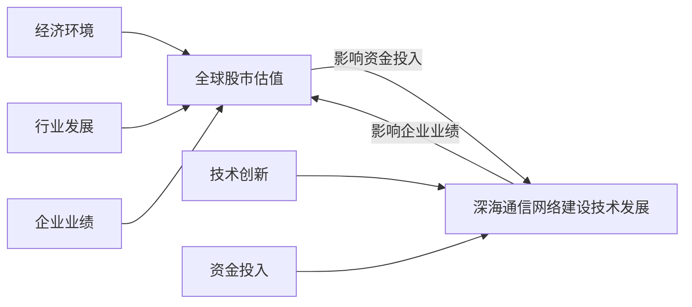

# 全球股市估值与深海通信网络建设技术的发展

> 关键词：全球股市估值、深海通信网络建设技术、金融市场、通信技术、经济影响、发展趋势、技术挑战

> 摘要：本文旨在深入探讨全球股市估值与深海通信网络建设技术发展之间的联系。通过对全球股市估值的原理、影响因素的分析，以及对深海通信网络建设技术的核心概念、算法原理、数学模型等方面的详细阐述，揭示两者之间相互影响的机制。同时，结合项目实战案例，展示深海通信网络建设技术在实际应用中的情况，探讨其在不同场景下的应用价值。此外，还提供了相关的工具和资源推荐，对未来的发展趋势和挑战进行了总结，并解答了常见问题。希望能为金融从业者、通信技术研究者和相关领域的爱好者提供有价值的参考。

## 1. 背景介绍 
### 1.1 目的和范围
本研究的主要目的是全面分析全球股市估值与深海通信网络建设技术发展之间的内在联系。一方面，深入理解全球股市估值的方法和影响因素，包括宏观经济指标、行业发展趋势等对股市的作用；另一方面，详细探究深海通信网络建设技术的原理、发展现状以及面临的挑战。研究范围涵盖全球主要金融市场的股市估值情况，以及深海通信网络建设技术在全球范围内的应用和发展动态。

### 1.2 预期读者
本文预期读者包括金融领域的专业人士，如股票分析师、基金经理、投资顾问等，他们可以从文中了解深海通信网络建设技术发展对股市相关板块的影响，为投资决策提供参考。同时，通信技术领域的研究者、工程师和从业者也能从中获取全球股市对深海通信网络建设技术发展的资金支持和市场反馈等信息。此外，对金融和通信技术交叉领域感兴趣的学生和爱好者也可以通过本文初步了解相关知识。

### 1.3 文档结构概述
本文首先介绍了研究的背景、目的和预期读者，为后续内容奠定基础。接着阐述了全球股市估值和深海通信网络建设技术的核心概念及其相互联系，并通过文本示意图和 Mermaid 流程图进行直观展示。然后详细讲解了核心算法原理和具体操作步骤，给出了相应的 Python 代码示例。在数学模型和公式部分，运用 LaTeX 格式呈现相关公式，并举例说明其应用。通过项目实战案例，展示了深海通信网络建设技术的实际开发过程和代码解读。之后探讨了该技术的实际应用场景，提供了学习、开发工具和相关论文著作等资源推荐。最后总结了未来发展趋势与挑战，解答了常见问题，并列出了扩展阅读和参考资料。

### 1.4 术语表
#### 1.4.1 核心术语定义
- **全球股市估值**：是指对全球范围内各个股票市场上上市公司的股票价值进行评估的过程，通过多种方法和指标来确定股票的合理价格。
- **深海通信网络建设技术**：是指用于在深海环境中构建通信网络的一系列技术，包括海底光缆铺设技术、水下传感器网络技术、深海通信协议等，旨在实现深海与陆地或其他区域之间的信息传输。

#### 1.4.2 相关概念解释
- **市盈率（P/E）**：是股票价格除以每股收益的比率，是衡量股票估值的常用指标之一，反映了投资者为获取公司每一元盈利所愿意支付的价格。
- **海底光缆**：是用绝缘材料包裹的导线，铺设在海底，用于传输光信号，是深海通信网络的重要组成部分。

#### 1.4.3 缩略词列表
- **P/E**：Price-to-Earnings Ratio，市盈率
- **ROE**：Return on Equity，净资产收益率

## 2. 核心概念与联系 

### 全球股市估值核心概念
全球股市估值是金融领域的重要概念，其目的是评估股票的内在价值，为投资者提供投资决策的依据。常见的估值方法包括市盈率法、市净率法、现金流折现法等。市盈率法是通过比较股票价格与每股收益的比率来判断股票的估值水平；市净率法是用股票价格除以每股净资产；现金流折现法是将公司未来的现金流折现到当前，从而得出公司的内在价值。

### 深海通信网络建设技术核心概念
深海通信网络建设技术涉及多个方面，包括海底光缆的铺设、水下传感器网络的构建、深海通信协议的设计等。海底光缆是实现长距离深海通信的主要手段，它具有传输容量大、损耗小等优点。水下传感器网络则可以实时监测深海环境的各种参数，如温度、压力、盐度等。深海通信协议需要适应深海环境的特点，如高水压、低温度、强腐蚀等。

### 两者的联系
深海通信网络建设技术的发展对相关企业的业绩和前景产生影响，进而影响股市中相关板块的估值。例如，随着深海通信网络建设技术的进步，相关企业的市场份额可能扩大，盈利能力增强，从而导致其股票价格上涨，估值提高。反之，股市的表现也会影响深海通信网络建设技术的发展。如果股市繁荣，相关企业可以通过融资获得更多的资金用于技术研发和项目建设；如果股市低迷，企业可能面临资金短缺的问题，从而影响技术的发展速度。

### 文本示意图
```plaintext
全球股市估值 <-- 经济环境、行业发展、企业业绩
                 |
                 | 影响
                 v
深海通信网络建设技术发展 <-- 技术创新、资金投入
```

### Mermaid 流程图


## 3. 核心算法原理 & 具体操作步骤 

### 全球股市估值算法原理及 Python 实现
#### 市盈率法
市盈率法是最常用的股市估值方法之一，其原理是通过计算股票的市盈率，并与同行业或市场平均市盈率进行比较，来判断股票的估值是否合理。计算公式为：

$P/E = \frac{股价}{每股收益}$

以下是使用 Python 实现市盈率计算的代码示例：
```python
def calculate_pe(stock_price, earnings_per_share):
    """
    计算市盈率
    :param stock_price: 股票价格
    :param earnings_per_share: 每股收益
    :return: 市盈率
    """
    if earnings_per_share == 0:
        return float('inf')
    return stock_price / earnings_per_share

# 示例数据
stock_price = 50
earnings_per_share = 5

pe_ratio = calculate_pe(stock_price, earnings_per_share)
print(f"市盈率: {pe_ratio}")
```

#### 现金流折现法
现金流折现法是基于公司未来现金流的现值来评估公司的价值。其基本原理是将公司未来各期的现金流按照一定的折现率折现到当前，然后将这些现值相加得到公司的内在价值。计算公式为：

$V = \sum_{t=1}^{n} \frac{CF_t}{(1 + r)^t}$

其中，$V$ 是公司的内在价值，$CF_t$ 是第 $t$ 期的现金流，$r$ 是折现率，$n$ 是预测期数。

以下是使用 Python 实现现金流折现法的代码示例：
```python
def discounted_cash_flow(cash_flows, discount_rate):
    """
    计算现金流折现价值
    :param cash_flows: 未来各期现金流列表
    :param discount_rate: 折现率
    :return: 现金流折现价值
    """
    present_value = 0
    for t, cf in enumerate(cash_flows, start=1):
        present_value += cf / ((1 + discount_rate) ** t)
    return present_value

# 示例数据
cash_flows = [100, 120, 150, 180]
discount_rate = 0.1

intrinsic_value = discounted_cash_flow(cash_flows, discount_rate)
print(f"公司内在价值: {intrinsic_value}")
```

### 深海通信网络建设技术中的算法原理及 Python 实现
#### 路由算法
在深海通信网络中，路由算法用于确定数据包从源节点到目的节点的最佳路径。一种简单的路由算法是最短路径算法，如 Dijkstra 算法。以下是使用 Python 实现 Dijkstra 算法的代码示例：
```python
import heapq

def dijkstra(graph, start):
    """
    Dijkstra 算法实现
    :param graph: 图的邻接表表示
    :param start: 起始节点
    :return: 最短路径距离字典
    """
    distances = {node: float('inf') for node in graph}
    distances[start] = 0
    priority_queue = [(0, start)]

    while priority_queue:
        current_distance, current_node = heapq.heappop(priority_queue)

        if current_distance > distances[current_node]:
            continue

        for neighbor, weight in graph[current_node].items():
            distance = current_distance + weight

            if distance < distances[neighbor]:
                distances[neighbor] = distance
                heapq.heappush(priority_queue, (distance, neighbor))

    return distances

# 示例图
graph = {
    'A': {'B': 1, 'C': 4},
    'B': {'A': 1, 'C': 2, 'D': 5},
    'C': {'A': 4, 'B': 2, 'D': 1},
    'D': {'B': 5, 'C': 1}
}

start_node = 'A'
shortest_distances = dijkstra(graph, start_node)
print(f"从节点 {start_node} 出发的最短路径距离: {shortest_distances}")
```

## 4. 数学模型和公式 & 详细讲解 & 举例说明 

### 全球股市估值数学模型
#### 戈登增长模型
戈登增长模型是一种常用的股票估值模型，假设公司的股息以固定的增长率 $g$ 增长。其公式为：

$P_0 = \frac{D_1}{r - g}$

其中，$P_0$ 是股票的当前价格，$D_1$ 是下一期的股息，$r$ 是投资者要求的回报率，$g$ 是股息的固定增长率。

**详细讲解**：该模型基于永续年金的概念，认为股票的价值等于未来所有股息的现值之和。由于股息以固定增长率增长，通过数学推导可以得到上述公式。

**举例说明**：假设某公司下一期的股息 $D_1 = 2$ 元，投资者要求的回报率 $r = 0.1$，股息的固定增长率 $g = 0.05$。则该股票的当前价格为：

$P_0 = \frac{2}{0.1 - 0.05} = 40$（元）

### 深海通信网络建设技术数学模型
#### 信号传输损耗模型
在深海通信中，信号传输会受到各种因素的影响，导致信号强度衰减。一种常见的信号传输损耗模型是自由空间路径损耗模型，其公式为：

$L = 20\log_{10}(d) + 20\log_{10}(f) + 32.45$

其中，$L$ 是路径损耗（单位：dB），$d$ 是传输距离（单位：km），$f$ 是信号频率（单位：MHz）。

**详细讲解**：该公式描述了信号在自由空间中传输时，随着传输距离和信号频率的增加，信号强度会逐渐衰减。其中，$20\log_{10}(d)$ 表示距离对损耗的影响，$20\log_{10}(f)$ 表示频率对损耗的影响，$32.45$ 是一个常数。

**举例说明**：假设信号传输距离 $d = 10$ km，信号频率 $f = 200$ MHz。则路径损耗为：

$L = 20\log_{10}(10) + 20\log_{10}(200) + 32.45$

$= 20 + 20\times2.301 + 32.45$

$= 20 + 46.02 + 32.45$

$= 98.47$（dB）

## 5. 项目实战：代码实际案例和详细解释说明 

### 5.1  开发环境搭建
#### 全球股市估值项目
- **操作系统**：Windows、Linux 或 macOS 均可。
- **编程语言**：Python 3.x。
- **开发工具**：推荐使用 Jupyter Notebook 或 PyCharm。
- **所需库**：pandas、numpy、matplotlib 等，可使用以下命令安装：
```bash
pip install pandas numpy matplotlib
```

#### 深海通信网络建设技术模拟项目
- **操作系统**：同样支持 Windows、Linux 或 macOS。
- **编程语言**：Python 3.x。
- **开发工具**：Jupyter Notebook 或 PyCharm。
- **所需库**：networkx、matplotlib 等，安装命令如下：
```bash
pip install networkx matplotlib
```

### 5.2  源代码详细实现和代码解读
#### 全球股市估值项目
以下是一个简单的全球股市估值项目示例，使用市盈率法对多只股票进行估值分析，并绘制可视化图表。
```python
import pandas as pd
import matplotlib.pyplot as plt

# 示例股票数据
data = {
    '股票代码': ['AAPL', 'GOOG', 'MSFT'],
    '股价': [150, 2500, 300],
    '每股收益': [5, 100, 10]
}

df = pd.DataFrame(data)

# 计算市盈率
df['市盈率'] = df['股价'] / df['每股收益']

# 打印结果
print(df)

# 绘制市盈率柱状图
plt.bar(df['股票代码'], df['市盈率'])
plt.xlabel('股票代码')
plt.ylabel('市盈率')
plt.title('股票市盈率分析')
plt.show()
```
**代码解读**：
1. 首先导入 pandas 和 matplotlib 库，用于数据处理和可视化。
2. 定义一个包含股票代码、股价和每股收益的字典，并将其转换为 DataFrame 对象。
3. 计算每只股票的市盈率，并将结果添加到 DataFrame 中。
4. 打印包含市盈率的 DataFrame。
5. 使用 matplotlib 绘制市盈率柱状图，直观展示不同股票的市盈率情况。

#### 深海通信网络建设技术模拟项目
以下是一个使用 networkx 库模拟深海通信网络路由的示例代码。
```python
import networkx as nx
import matplotlib.pyplot as plt

# 创建一个有向图
G = nx.DiGraph()

# 添加节点
nodes = ['A', 'B', 'C', 'D']
G.add_nodes_from(nodes)

# 添加边和权重
edges = [('A', 'B', 1), ('A', 'C', 4), ('B', 'C', 2), ('B', 'D', 5), ('C', 'D', 1)]
G.add_weighted_edges_from(edges)

# 计算最短路径
shortest_path = nx.shortest_path(G, source='A', target='D', weight='weight')
shortest_path_length = nx.shortest_path_length(G, source='A', target='D', weight='weight')

print(f"从节点 A 到节点 D 的最短路径: {shortest_path}")
print(f"最短路径长度: {shortest_path_length}")

# 绘制图形
pos = nx.spring_layout(G)
nx.draw_networkx_nodes(G, pos)
nx.draw_networkx_edges(G, pos)
nx.draw_networkx_labels(G, pos)
nx.draw_networkx_edge_labels(G, pos, edge_labels=nx.get_edge_attributes(G, 'weight'))
plt.title('深海通信网络路由模拟')
plt.show()
```
**代码解读**：
1. 导入 networkx 和 matplotlib 库，用于图的创建和可视化。
2. 创建一个有向图对象 G，并添加节点和带权重的边。
3. 使用 networkx 的 shortest_path 和 shortest_path_length 函数计算从节点 A 到节点 D 的最短路径和最短路径长度。
4. 打印最短路径和最短路径长度。
5. 使用 matplotlib 绘制图，显示节点、边和边的权重。

### 5.3  代码解读与分析
#### 全球股市估值项目
通过该项目，我们可以快速计算多只股票的市盈率，并通过可视化图表直观地比较不同股票的估值水平。市盈率是一个重要的估值指标，但它也有一定的局限性，例如没有考虑公司的未来增长潜力等因素。在实际应用中，还需要结合其他指标和方法进行综合分析。

#### 深海通信网络建设技术模拟项目
该项目使用 networkx 库模拟了深海通信网络中的路由问题。通过计算最短路径，可以优化数据包的传输路径，提高通信效率。在实际的深海通信网络建设中，路由算法需要考虑更多的因素，如节点的能量消耗、网络的可靠性等。

## 6. 实际应用场景 
### 全球股市估值的应用场景
- **投资决策**：投资者可以根据股票的估值情况，判断股票是否被高估或低估，从而决定是否买入、持有或卖出股票。例如，如果某只股票的市盈率远低于同行业平均水平，且公司基本面良好，可能是一个投资机会。
- **行业分析**：通过对不同行业股票估值的比较，可以了解各行业的发展前景和市场预期。例如，新兴行业的股票估值可能较高，反映了市场对其未来增长的预期。
- **宏观经济分析**：股市估值的整体变化可以反映宏观经济的运行状况。当股市估值普遍上升时，可能预示着经济的繁荣；反之，可能表示经济面临下行压力。

### 深海通信网络建设技术的应用场景
- **海洋科研**：深海通信网络可以为海洋科研人员提供实时的数据传输通道，使他们能够远程监测深海环境的各种参数，如海洋温度、盐度、生物活动等，有助于深入了解海洋生态系统和地球气候变化。
- **海洋资源开发**：在深海石油、天然气等资源的开采过程中，深海通信网络可以实现对开采设备的远程监控和控制，提高开采效率和安全性。同时，也可以用于传输海洋资源勘探数据，为资源开发提供决策依据。
- **军事防御**：深海通信网络在军事领域具有重要的应用价值。它可以实现水下舰艇、潜艇之间的通信，以及与陆地指挥中心的实时联系，增强军事作战的指挥和控制能力。

## 7. 工具和资源推荐
### 7.1 学习资源推荐
#### 7.1.1 书籍推荐
- 《证券分析》（Security Analysis）：由本杰明·格雷厄姆（Benjamin Graham）和戴维·多德（David Dodd）所著，是价值投资领域的经典著作，详细介绍了股票估值的方法和原理。
- 《通信原理》：全面阐述了通信技术的基本原理，包括信号传输、调制解调、编码解码等内容，对于理解深海通信网络建设技术有很大帮助。

#### 7.1.2 在线课程
- Coursera 上的“金融市场”（Financial Markets）课程：由耶鲁大学教授罗伯特·席勒（Robert Shiller）主讲，涵盖了金融市场的各个方面，包括股市估值的方法和理论。
- edX 上的“通信系统工程”（Communication Systems Engineering）课程：深入讲解了通信系统的设计和分析方法，适用于学习深海通信网络建设技术的基础知识。

#### 7.1.3 技术博客和网站
- Seeking Alpha：提供全球股市的分析和评论文章，以及股票估值的相关研究报告。
- IEEE Xplore：是电气和电子工程师协会（IEEE）的数字图书馆，包含了大量关于通信技术的研究论文和技术报告，可用于了解深海通信网络建设技术的最新进展。

### 7.2 开发工具框架推荐
#### 7.2.1 IDE和编辑器
- PyCharm：是一款专门为 Python 开发设计的集成开发环境（IDE），具有代码自动完成、调试、版本控制等功能，适合开发全球股市估值和深海通信网络建设技术相关的 Python 项目。
- Jupyter Notebook：是一个交互式的开发环境，支持多种编程语言，尤其适合数据处理和可视化。在股市估值分析和通信网络模拟项目中可以方便地进行代码编写和结果展示。

#### 7.2.2 调试和性能分析工具
- PDB：是 Python 自带的调试工具，可以在代码中设置断点，逐步执行代码，帮助开发者查找和解决问题。
- cProfile：是 Python 的性能分析工具，可以统计代码的运行时间和函数调用次数，帮助开发者优化代码性能。

#### 7.2.3 相关框架和库
- Pandas：是 Python 中用于数据处理和分析的强大库，提供了 DataFrame 等数据结构，方便进行股市数据的处理和分析。
- NetworkX：是 Python 中用于图论和复杂网络分析的库，可以用于模拟深海通信网络的拓扑结构和路由算法。

### 7.3 相关论文著作推荐
#### 7.3.1 经典论文
- Fama, E. F., & French, K. R. (1992). The cross-section of expected stock returns. Journal of Finance, 47(2), 427-465. 该论文提出了著名的 Fama-French 三因子模型，对股票估值和资产定价理论产生了深远影响。
- Shannon, C. E. (1948). A mathematical theory of communication. Bell system technical journal, 27(3), 379-423. 香农的这篇论文奠定了现代通信理论的基础，对于理解深海通信网络建设技术中的信息传输原理至关重要。

#### 7.3.2 最新研究成果
- 关注 IEEE Journal on Selected Areas in Communications、Journal of Financial Economics 等顶级学术期刊，这些期刊会发表关于深海通信网络建设技术和全球股市估值的最新研究成果。

#### 7.3.3 应用案例分析
- 可以查阅一些行业报告和案例分析，如麦肯锡、波士顿咨询等咨询公司发布的关于海洋通信和金融市场的研究报告，了解深海通信网络建设技术和全球股市估值在实际应用中的案例和经验。

## 8. 总结：未来发展趋势与挑战
### 全球股市估值的未来发展趋势与挑战
#### 发展趋势
- **智能化估值**：随着人工智能和机器学习技术的发展，未来股市估值将更加智能化。通过大数据分析和深度学习算法，可以更准确地预测公司的未来业绩和股票价格走势。
- **全球化估值**：全球金融市场的互联互通日益增强，股市估值将更加注重全球视野。投资者需要综合考虑不同国家和地区的经济环境、政策法规等因素，进行更全面的估值分析。

#### 挑战
- **不确定性增加**：全球政治、经济形势的不确定性不断增加，如贸易摩擦、地缘政治冲突等，给股市估值带来了更大的挑战。难以准确预测这些因素对公司业绩和股市的影响。
- **数据质量和隐私问题**：智能化估值依赖于大量的数据，但数据的质量和隐私问题可能会影响估值的准确性和可靠性。同时，如何保护投资者的个人信息和数据安全也是一个重要的问题。

### 深海通信网络建设技术的未来发展趋势与挑战
#### 发展趋势
- **高速大容量通信**：随着海洋科研和资源开发的需求不断增加，深海通信网络将朝着高速大容量的方向发展。未来可能会采用更先进的光通信技术和调制解调技术，提高通信速率和传输容量。
- **智能化网络管理**：引入人工智能和自动化技术，实现深海通信网络的智能化管理。例如，通过智能路由算法自动优化数据包的传输路径，提高网络的可靠性和效率。

#### 挑战
- **恶劣环境挑战**：深海环境具有高水压、低温度、强腐蚀等特点，对通信设备的可靠性和稳定性提出了极高的要求。如何开发适应深海环境的通信设备和材料是一个亟待解决的问题。
- **成本高昂**：深海通信网络建设需要投入大量的资金，包括海底光缆铺设、水下基站建设等。如何降低建设成本和运营成本，提高经济效益，是推广深海通信网络建设技术的关键。

## 9. 附录：常见问题与解答
### 全球股市估值相关问题
#### 问：市盈率为负数代表什么意思？
答：市盈率为负数表示公司当前的每股收益为负数，即公司处于亏损状态。在这种情况下，市盈率指标失去了其原本的意义，不能用于评估公司的估值水平。投资者需要进一步分析公司亏损的原因和未来的盈利前景。

#### 问：不同行业的市盈率是否可以直接比较？
答：不同行业的市盈率不能直接比较。因为不同行业的发展阶段、盈利模式、风险水平等因素存在差异，导致其合理的市盈率范围也不同。例如，新兴行业的市盈率通常较高，而传统行业的市盈率相对较低。在比较市盈率时，应该选择同行业或类似行业的公司进行对比。

### 深海通信网络建设技术相关问题
#### 问：海底光缆容易受到哪些因素的破坏？
答：海底光缆容易受到多种因素的破坏，如海洋生物的啃咬、渔船的拖网作业、地震和海啸等自然灾害。为了保护海底光缆，通常会采取一些防护措施，如使用抗咬光缆、设置明显的标识等。

#### 问：深海通信网络的信号传输延迟如何解决？
答：深海通信网络的信号传输延迟主要是由于信号在海水中的传播速度较慢和传输距离较长导致的。为了减少延迟，可以采用优化路由算法、增加中继设备等方法。同时，也可以研究和应用更高速的通信技术，提高信号的传输速度。

## 10. 扩展阅读 & 参考资料
### 扩展阅读
- 《金融炼金术》（The Alchemy of Finance）：乔治·索罗斯（George Soros）所著，探讨了金融市场的反身性原理，对理解股市估值和市场波动有一定的启发。
- 《海底两万里》（Twenty Thousand Leagues Under the Sea）：儒勒·凡尔纳（Jules Verne）的科幻小说，虽然是虚构作品，但其中对深海世界的想象和描述可以激发读者对深海通信网络建设技术的兴趣。

### 参考资料
- 上海证券交易所、深圳证券交易所、纽约证券交易所等官方网站，获取股市相关数据和信息。
- 国际电信联盟（ITU）、电气和电子工程师协会（IEEE）等组织发布的标准和技术报告，了解通信技术的最新发展动态。

作者：AI天才研究院/AI Genius Institute & 禅与计算机程序设计艺术 /Zen And The Art of Computer Programming