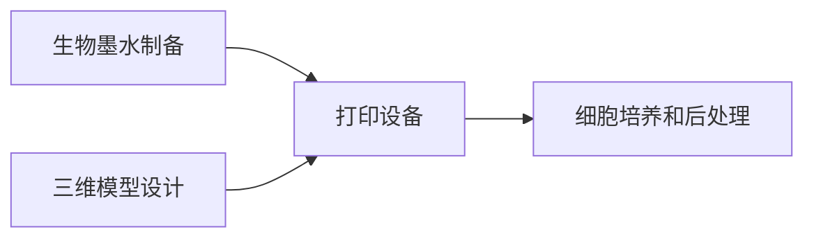

# 全球股市估值与生物印刷技术的关系

> 关键词：全球股市估值、生物印刷技术、市场趋势、行业发展、经济影响

> 摘要：本文旨在深入探讨全球股市估值与生物印刷技术之间的关系。通过对背景知识的介绍，阐述生物印刷技术的核心概念及其与股市估值的潜在联系。详细分析相关核心算法原理和数学模型，结合项目实战案例展示生物印刷技术对股市估值的实际影响。同时，探讨该技术在不同实际应用场景中的表现，推荐相关的学习工具和资源。最后总结生物印刷技术在全球股市中的未来发展趋势与挑战，并对常见问题进行解答，为投资者和技术研究者提供全面的参考。

## 1. 背景介绍 
### 1.1 目的和范围
本研究的目的是全面剖析全球股市估值与生物印刷技术之间的内在联系。通过研究生物印刷技术的发展现状、市场前景以及其在不同行业的应用，分析该技术如何影响全球股市的估值。研究范围涵盖了生物印刷技术的各个方面，包括其技术原理、市场规模、竞争格局等，以及全球主要股市的估值情况。

### 1.2 预期读者
本文预期读者包括金融投资者、股票分析师、生物科技领域的研究者和从业者、政策制定者等。对于投资者来说，了解生物印刷技术与股市估值的关系有助于他们做出更明智的投资决策；对于研究者和从业者，本文可以为他们提供技术发展与市场反馈的相关信息；对于政策制定者，有助于他们制定相关政策以促进生物印刷技术的健康发展和股市的稳定。

### 1.3 文档结构概述
本文首先介绍背景知识，包括研究的目的、预期读者和文档结构。接着阐述生物印刷技术的核心概念及其与股市估值的联系，并用示意图和流程图进行展示。然后详细讲解核心算法原理和具体操作步骤，结合数学模型和公式进行说明。通过项目实战案例展示生物印刷技术对股市估值的实际影响。探讨生物印刷技术的实际应用场景，推荐相关的学习工具和资源。最后总结生物印刷技术在全球股市中的未来发展趋势与挑战，解答常见问题，并提供扩展阅读和参考资料。

### 1.4 术语表
#### 1.4.1 核心术语定义
- **全球股市估值**：指对全球范围内各个股票市场上上市公司的整体价值进行评估的过程和结果。通常通过市盈率、市净率等指标来衡量。
- **生物印刷技术**：是一种利用3D打印原理，以生物材料、细胞等为“墨水”，制造生物组织和器官的技术。
- **市盈率（P/E）**：是指股票价格除以每股收益的比率，反映了市场对公司未来盈利的预期。
- **市净率（P/B）**：是指股票价格与每股净资产的比率，衡量了市场对公司资产价值的认可程度。

#### 1.4.2 相关概念解释
- **股市估值的影响因素**：包括宏观经济环境、行业发展趋势、公司基本面等。生物印刷技术作为新兴技术，其发展也会对股市估值产生影响。
- **生物印刷技术的应用领域**：主要包括组织工程、药物研发、再生医学等。这些领域的发展状况会影响生物印刷技术相关企业的业绩，进而影响股市估值。

#### 1.4.3 缩略词列表
- **P/E**：市盈率（Price-to-Earnings Ratio）
- **P/B**：市净率（Price-to-Book Ratio）
- **3D**：三维（Three-Dimensional）

## 2. 核心概念与联系 

### 生物印刷技术的核心概念
生物印刷技术是一种融合了生物学、材料科学和工程学的前沿技术。它的基本原理是将生物材料（如细胞外基质、生物墨水等）和细胞按照特定的三维结构进行精确打印，从而构建出具有生物学功能的组织和器官。

生物印刷技术的架构可以分为以下几个部分：
1. **生物墨水制备**：生物墨水是生物印刷的关键材料，通常由生物相容性好的聚合物、细胞和生长因子等组成。制备过程需要精确控制墨水的物理和化学性质，以确保细胞的活性和打印的精度。
2. **打印设备**：常用的生物打印设备包括喷墨式打印机、挤出式打印机和激光辅助打印机等。不同的打印设备适用于不同类型的生物墨水和打印需求。
3. **三维模型设计**：通过计算机辅助设计（CAD）软件创建待打印组织或器官的三维模型，然后将模型转化为打印机可以识别的指令。
4. **细胞培养和后处理**：打印完成后，需要将构建物置于适宜的培养环境中，让细胞生长和分化，形成具有功能的组织和器官。

以下是生物印刷技术架构的文本示意图：

生物印刷技术架构
|-- 生物墨水制备
|   |-- 生物材料选择
|   |-- 细胞添加
|   |-- 墨水性质调控
|-- 打印设备
|   |-- 喷墨式打印机
|   |-- 挤出式打印机
|   |-- 激光辅助打印机
|-- 三维模型设计
|   |-- CAD软件建模
|   |-- 模型转化为指令
|-- 细胞培养和后处理
|   |-- 培养环境设置
|   |-- 细胞生长和分化

以下是生物印刷技术流程的Mermaid流程图：



### 生物印刷技术与全球股市估值的联系
生物印刷技术作为一项具有巨大潜力的新兴技术，对全球股市估值产生了多方面的影响。

从行业发展的角度来看，生物印刷技术的发展带动了相关产业链的兴起，包括生物墨水生产企业、打印设备制造商、科研服务机构等。这些企业的业绩增长和市场前景会影响其在股市中的表现，进而影响整个生物科技板块的估值。

从投资者预期的角度来看，生物印刷技术的突破和应用前景会引发投资者对相关企业的关注和追捧。当市场对生物印刷技术的未来发展充满信心时，会提高对相关企业的估值，推动股价上涨；反之，当技术发展遇到瓶颈或市场预期降低时，股市估值也会相应下降。

从宏观经济的角度来看，生物印刷技术的发展可能会带来医疗成本的降低、疾病治疗效果的提升等社会效益，从而对整个经济产生积极影响。这种宏观经济层面的变化也会反映在股市估值上。

## 3. 核心算法原理 & 具体操作步骤 

### 股市估值算法原理
在股市估值中，常用的算法是基于市盈率和市净率的估值方法。以下是使用Python实现的简单市盈率估值算法示例：

```python
def pe_valuation(price_per_share, earnings_per_share):
    """
    计算市盈率估值
    :param price_per_share: 每股价格
    :param earnings_per_share: 每股收益
    :return: 市盈率
    """
    if earnings_per_share == 0:
        return float('inf')
    return price_per_share / earnings_per_share

# 示例数据
price = 50
earnings = 5

pe_ratio = pe_valuation(price, earnings)
print(f"市盈率: {pe_ratio}")
```

### 生物印刷技术影响股市估值的算法思路
生物印刷技术对股市估值的影响可以通过建立一个综合评估模型来量化。该模型可以考虑以下因素：
1. **技术发展阶段**：根据生物印刷技术的成熟度，分为研发阶段、临床验证阶段和商业化阶段。不同阶段对股市估值的影响不同。
2. **市场规模预测**：预测生物印刷技术在不同应用领域的市场规模，市场规模越大，对相关企业的估值越高。
3. **竞争格局**：分析生物印刷技术领域的竞争情况，包括竞争对手的数量、市场份额等。竞争激烈程度会影响企业的盈利能力和估值。

以下是一个简化的生物印刷技术影响股市估值的Python示例代码：

```python
def bioprinting_valuation(tech_stage, market_size, competition):
    """
    生物印刷技术影响的股市估值计算
    :param tech_stage: 技术发展阶段（1: 研发阶段，2: 临床验证阶段，3: 商业化阶段）
    :param market_size: 市场规模预测（单位：亿元）
    :param competition: 竞争格局（1: 竞争激烈，2: 竞争适中，3: 竞争较小）
    :return: 估值调整系数
    """
    stage_factor = {1: 0.5, 2: 0.8, 3: 1.2}
    competition_factor = {1: 0.7, 2: 0.9, 3: 1.1}

    adjustment_factor = stage_factor[tech_stage] * market_size * competition_factor[competition]
    return adjustment_factor

# 示例数据
tech_stage = 2
market_size = 100
competition = 2

adjustment = bioprinting_valuation(tech_stage, market_size, competition)
print(f"估值调整系数: {adjustment}")
```

### 具体操作步骤
1. **数据收集**：收集生物印刷技术相关企业的财务数据（如每股价格、每股收益等）、技术发展阶段信息、市场规模预测数据和竞争格局数据。
2. **计算基础估值**：使用市盈率、市净率等方法计算企业的基础估值。
3. **计算调整系数**：根据上述生物印刷技术影响股市估值的算法，计算估值调整系数。
4. **得到最终估值**：将基础估值乘以调整系数，得到考虑生物印刷技术影响后的最终估值。

## 4. 数学模型和公式 & 详细讲解 & 举例说明 

### 市盈率估值模型
市盈率估值模型的基本公式为：
$$P/E = \frac{P}{E}$$
其中，$P$ 表示每股价格，$E$ 表示每股收益。市盈率反映了市场对公司未来盈利的预期。例如，某公司的每股价格为 $50$ 元，每股收益为 $5$ 元，则其市盈率为：
$$P/E = \frac{50}{5} = 10$$
这意味着投资者愿意为该公司每 $1$ 元的收益支付 $10$ 元的价格。

### 市净率估值模型
市净率估值模型的基本公式为：
$$P/B = \frac{P}{BV}$$
其中，$P$ 表示每股价格，$BV$ 表示每股净资产。市净率衡量了市场对公司资产价值的认可程度。例如，某公司的每股价格为 $30$ 元，每股净资产为 $15$ 元，则其市净率为：
$$P/B = \frac{30}{15} = 2$$
这表示市场对该公司的资产价值给予了 $2$ 倍的溢价。

### 生物印刷技术影响股市估值的数学模型
我们可以建立一个综合考虑技术发展阶段、市场规模和竞争格局的数学模型来评估生物印刷技术对股市估值的影响。假设基础估值为 $V_0$，估值调整系数为 $k$，则考虑生物印刷技术影响后的最终估值 $V$ 为：
$$V = V_0 \times k$$
其中，$k$ 可以通过以下公式计算：
$$k = f(S, M, C)$$
其中，$S$ 表示技术发展阶段，$M$ 表示市场规模，$C$ 表示竞争格局。$f$ 是一个函数，根据前面的Python示例代码，$f$ 可以表示为：
$$f(S, M, C) = s(S) \times M \times c(C)$$
其中，$s(S)$ 是技术发展阶段的影响因子，$c(C)$ 是竞争格局的影响因子。

例如，某生物印刷技术相关企业的基础估值为 $100$ 亿元，技术发展阶段为临床验证阶段（$S = 2$），市场规模预测为 $200$ 亿元，竞争格局为竞争适中（$C = 2$）。根据前面的示例代码，技术发展阶段的影响因子 $s(2) = 0.8$，竞争格局的影响因子 $c(2) = 0.9$，则估值调整系数 $k$ 为：
$$k = 0.8 \times 200 \times 0.9 = 144$$
考虑生物印刷技术影响后的最终估值 $V$ 为：
$$V = 100 \times 144 = 14400$$（亿元）

## 5. 项目实战：代码实际案例和详细解释说明 

### 5.1  开发环境搭建
为了实现上述算法，我们需要搭建一个Python开发环境。以下是具体步骤：
1. **安装Python**：从Python官方网站（https://www.python.org/downloads/）下载并安装Python 3.x版本。
2. **安装开发工具**：推荐使用PyCharm或Jupyter Notebook作为开发工具。可以从官方网站下载并安装。
3. **安装必要的库**：使用以下命令安装必要的Python库：
```sh
pip install numpy pandas matplotlib
```

### 5.2  源代码详细实现和代码解读
以下是一个完整的Python代码示例，用于演示如何计算生物印刷技术相关企业的股市估值：

```python
import numpy as np
import pandas as pd
import matplotlib.pyplot as plt

# 市盈率估值函数
def pe_valuation(price_per_share, earnings_per_share):
    if earnings_per_share == 0:
        return float('inf')
    return price_per_share / earnings_per_share

# 生物印刷技术影响的股市估值计算函数
def bioprinting_valuation(tech_stage, market_size, competition):
    stage_factor = {1: 0.5, 2: 0.8, 3: 1.2}
    competition_factor = {1: 0.7, 2: 0.9, 3: 1.1}

    adjustment_factor = stage_factor[tech_stage] * market_size * competition_factor[competition]
    return adjustment_factor

# 示例数据
data = {
    'company': ['Company A', 'Company B', 'Company C'],
    'price_per_share': [50, 30, 40],
    'earnings_per_share': [5, 3, 4],
    'tech_stage': [2, 1, 3],
    'market_size': [100, 50, 200],
    'competition': [2, 1, 3]
}

df = pd.DataFrame(data)

# 计算市盈率
df['pe_ratio'] = df.apply(lambda row: pe_valuation(row['price_per_share'], row['earnings_per_share']), axis=1)

# 计算估值调整系数
df['adjustment_factor'] = df.apply(lambda row: bioprinting_valuation(row['tech_stage'], row['market_size'], row['competition']), axis=1)

# 计算考虑生物印刷技术影响后的估值
df['adjusted_valuation'] = df['pe_ratio'] * df['adjustment_factor']

print(df)

# 可视化结果
plt.bar(df['company'], df['adjusted_valuation'])
plt.xlabel('Company')
plt.ylabel('Adjusted Valuation')
plt.title('Bioprinting Technology Impact on Stock Valuation')
plt.show()
```

### 代码解读与分析
1. **导入必要的库**：导入`numpy`、`pandas`和`matplotlib`库，用于数据处理和可视化。
2. **定义市盈率估值函数**：`pe_valuation`函数用于计算市盈率。
3. **定义生物印刷技术影响的股市估值计算函数**：`bioprinting_valuation`函数根据技术发展阶段、市场规模和竞争格局计算估值调整系数。
4. **创建示例数据**：使用字典创建一个包含公司信息、财务数据和技术相关数据的DataFrame。
5. **计算市盈率**：使用`apply`方法调用`pe_valuation`函数计算每个公司的市盈率。
6. **计算估值调整系数**：使用`apply`方法调用`bioprinting_valuation`函数计算每个公司的估值调整系数。
7. **计算考虑生物印刷技术影响后的估值**：将市盈率乘以估值调整系数得到最终估值。
8. **可视化结果**：使用`matplotlib`库绘制柱状图，展示每个公司的调整后估值。

通过这个示例，我们可以看到如何使用Python代码计算生物印刷技术相关企业的股市估值，并通过可视化工具直观地展示结果。

## 6. 实际应用场景 
### 医疗行业
生物印刷技术在医疗行业有着广泛的应用前景，包括组织工程、器官移植、药物研发等。在组织工程方面，生物印刷技术可以制造出具有生物活性的组织和器官，用于修复受损组织和器官。这将减少对传统器官移植的依赖，降低医疗成本，提高治疗效果。例如，生物印刷的皮肤组织可以用于烧伤患者的治疗，生物印刷的肝脏组织可以用于药物代谢研究。

在医疗行业的应用会对相关企业的股市估值产生积极影响。随着生物印刷技术在医疗领域的不断突破和应用，投资者对相关企业的信心增强，推动股价上涨。同时，医疗行业的巨大市场需求也为生物印刷技术相关企业带来了广阔的发展空间。

### 食品行业
生物印刷技术在食品行业也有潜在的应用，例如打印人造肉。人造肉是一种通过细胞培养技术制造的肉类替代品，具有环保、健康等优点。生物印刷技术可以精确控制人造肉的结构和口感，提高其品质和生产效率。

食品行业对生物印刷技术的应用也会影响相关企业的股市估值。随着消费者对健康、环保食品的需求增加，人造肉市场前景广阔。生物印刷技术相关企业在食品行业的布局和发展将吸引投资者的关注，提升其股市估值。

### 化妆品行业
在化妆品行业，生物印刷技术可以用于制造个性化的护肤品。通过分析消费者的皮肤状况和需求，生物印刷技术可以定制含有特定活性成分的护肤品，提高护肤效果。

化妆品行业对生物印刷技术的应用也会为相关企业带来新的增长点。个性化护肤品市场具有较高的附加值，生物印刷技术相关企业在该领域的创新和发展将有助于提升其市场竞争力和股市估值。

## 7. 工具和资源推荐
### 7.1 学习资源推荐
#### 7.1.1 书籍推荐
- 《生物3D打印：从基础到应用》：全面介绍了生物3D打印技术的原理、方法和应用，适合初学者和专业人士阅读。
- 《金融市场学》：系统讲解了金融市场的基本概念、运行机制和分析方法，有助于理解股市估值的相关知识。

#### 7.1.2 在线课程
- Coursera上的“生物医学工程：从原理到实践”：该课程涵盖了生物医学工程的多个领域，包括生物印刷技术，由知名高校的教授授课。
- edX上的“金融市场与投资策略”：帮助学习者了解金融市场的运作规律和投资策略，对分析股市估值有很大帮助。

#### 7.1.3 技术博客和网站
- 3D Printing Industry：提供生物印刷技术和3D打印行业的最新资讯、技术发展动态和应用案例。
- Seeking Alpha：专注于金融市场分析和投资研究，有大量关于股市估值和行业分析的文章。

### 7.2 开发工具框架推荐
#### 7.2.1 IDE和编辑器
- PyCharm：功能强大的Python集成开发环境，提供代码编辑、调试、版本控制等功能，适合Python开发者使用。
- Jupyter Notebook：交互式的编程环境，支持Python、R等多种编程语言，方便进行数据分析和可视化。

#### 7.2.2 调试和性能分析工具
- Py-Spy：用于分析Python程序的性能，找出性能瓶颈和热点代码。
- PDB：Python自带的调试工具，可以帮助开发者定位和解决代码中的问题。

#### 7.2.3 相关框架和库
- NumPy：用于科学计算和数值分析的Python库，提供了高效的数组操作和数学函数。
- Pandas：用于数据处理和分析的Python库，提供了灵活的数据结构和数据操作方法。
- Matplotlib：用于数据可视化的Python库，可以绘制各种类型的图表和图形。

### 7.3 相关论文著作推荐
#### 7.3.1 经典论文
- “Bioprinting: A 3D Printing Revolution in Tissue Engineering and Regenerative Medicine”：该论文介绍了生物印刷技术在组织工程和再生医学领域的应用和发展前景。
- “The Impact of Technological Innovation on Stock Market Valuation”：探讨了技术创新对股市估值的影响机制和实证研究。

#### 7.3.2 最新研究成果
- 关注《Nature》、《Science》等顶级学术期刊上关于生物印刷技术和金融市场的最新研究论文，了解该领域的前沿动态。

#### 7.3.3 应用案例分析
- 一些专业的金融研究机构和咨询公司会发布关于生物印刷技术相关企业的应用案例分析报告，可以从中了解该技术在实际市场中的表现和影响。

## 8. 总结：未来发展趋势与挑战
### 未来发展趋势
1. **技术不断创新**：生物印刷技术将不断取得突破，打印精度和效率将进一步提高，打印的组织和器官的功能将更加完善。
2. **应用领域拓展**：除了医疗、食品和化妆品行业，生物印刷技术还将在环保、能源等领域得到应用，市场规模将不断扩大。
3. **与其他技术融合**：生物印刷技术将与人工智能、大数据、基因编辑等技术深度融合，创造出更多的创新应用和商业模式。
4. **产业整合加速**：随着生物印刷技术的发展，行业内的竞争将加剧，产业整合将加速，大型企业将通过并购和合作等方式扩大市场份额。

### 挑战
1. **技术难题**：目前生物印刷技术还面临着一些技术难题，如细胞存活率低、组织血管化困难等，需要进一步的研究和创新来解决。
2. **伦理和法律问题**：生物印刷技术的应用涉及到伦理和法律问题，如人造器官的来源和使用、生物样本的隐私保护等，需要建立相应的伦理和法律规范。
3. **市场接受度**：生物印刷技术的产品和服务在市场上的接受度还需要提高，消费者对人造肉、个性化护肤品等产品的认知和信任度还需要加强。
4. **资金投入**：生物印刷技术的研发和产业化需要大量的资金投入，对于中小企业来说，融资困难是一个重要的挑战。

## 9. 附录：常见问题与解答
### 问题1：生物印刷技术多久能够实现大规模商业化应用？
目前生物印刷技术还处于发展阶段，虽然已经取得了一些重要的进展，但要实现大规模商业化应用还需要一定的时间。预计在未来5-10年内，生物印刷技术在医疗、食品等领域的部分应用可能会实现商业化，但全面的大规模应用可能还需要更长的时间。这取决于技术的突破速度、市场需求的增长、伦理和法律问题的解决等多个因素。

### 问题2：生物印刷技术对股市估值的影响是短期还是长期的？
生物印刷技术对股市估值的影响既有短期的也有长期的。短期来看，技术的突破和重要进展可能会引发投资者的关注和追捧，导致相关企业的股价短期内上涨，对股市估值产生积极影响。长期来看，生物印刷技术的大规模商业化应用将改变相关行业的竞争格局和市场规模，从而对股市估值产生深远的影响。如果生物印刷技术能够成功解决当前面临的技术难题，实现广泛的应用，将为相关企业带来长期的增长动力，推动股市估值的持续提升。

### 问题3：如何评估生物印刷技术相关企业的投资价值？
评估生物印刷技术相关企业的投资价值需要综合考虑多个因素。首先，要关注企业的技术实力和研发能力，包括其在生物印刷技术领域的专利数量、研发团队的水平等。其次，要分析企业的市场前景和商业模式，了解其产品和服务的市场需求、竞争优势以及盈利模式。此外，还需要考虑企业的财务状况、管理团队的能力和经验等因素。可以通过研究企业的财务报表、行业报告、专家分析等方式来获取相关信息，进行全面的评估。

### 问题4：生物印刷技术的发展会对传统行业产生哪些影响？
生物印刷技术的发展将对传统行业产生多方面的影响。在医疗行业，传统的器官移植和药物研发模式可能会受到挑战，生物印刷的组织和器官将成为一种新的治疗选择，药物研发的效率和准确性也将得到提高。在食品行业，人造肉的出现将对传统畜牧业产生冲击，改变肉类市场的格局。在化妆品行业，个性化护肤品的发展将满足消费者的个性化需求，推动传统化妆品行业的转型升级。同时，生物印刷技术的发展也将带动相关产业链的发展，创造新的就业机会和经济增长点。

## 10. 扩展阅读 & 参考资料
### 扩展阅读
- 《科技金融：创新与发展》：深入探讨了科技与金融的融合发展，对于理解生物印刷技术与股市估值的关系有一定的帮助。
- 《生物医学工程前沿》：介绍了生物医学工程领域的最新研究成果和发展趋势，包括生物印刷技术的前沿动态。

### 参考资料
- 相关学术期刊和会议论文，如《Biomaterials》、《Acta Biomaterialia》等。
- 金融数据提供商的报告，如彭博社、路透社等。
- 政府部门和行业协会发布的统计数据和政策文件。

作者：AI天才研究院/AI Genius Institute & 禅与计算机程序设计艺术 /Zen And The Art of Computer Programming