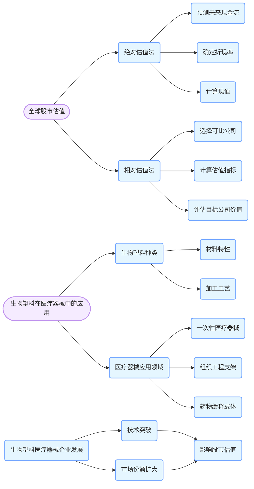

# 全球股市估值与生物塑料在医疗器械中的应用

> 关键词：全球股市估值、生物塑料、医疗器械、金融市场、医疗科技

> 摘要：本文聚焦于全球股市估值以及生物塑料在医疗器械中的应用这两个看似不同但又存在潜在联系的领域。首先对全球股市估值的基本概念、影响因素及常用方法进行深入剖析，同时详细介绍生物塑料的特性、分类以及其在医疗器械领域的应用现状与优势。接着阐述了两者之间可能存在的关联，如生物塑料在医疗器械应用的发展对相关企业股市估值的影响。通过具体的项目实战案例展示生物塑料在医疗器械中的应用开发过程，并分析其对股市的潜在影响。最后探讨了两个领域各自的实际应用场景、推荐了相关的工具和资源，总结了未来的发展趋势与挑战。

## 1. 背景介绍 
### 1.1 目的和范围
本研究旨在全面探讨全球股市估值的原理和方法，同时深入分析生物塑料在医疗器械中的应用现状、前景及相关技术细节。通过将这两个领域相结合，揭示生物塑料在医疗器械行业的发展对全球股市相关板块估值的潜在影响，为投资者、企业决策者和科研人员提供有价值的参考。研究范围涵盖全球主要股票市场的估值体系，以及生物塑料在各类医疗器械中的应用情况，包括材料特性、加工工艺、市场需求等方面。

### 1.2 预期读者
本文的预期读者包括金融领域的投资者、分析师、基金经理，他们可以从生物塑料在医疗器械应用的发展趋势中寻找投资机会；医疗行业的从业者，如医疗器械研发人员、企业管理人员，能了解生物塑料在医疗器械领域的最新进展和应用潜力；科研人员和学生可以从中获取相关领域的研究思路和技术信息。

### 1.3 文档结构概述
本文首先介绍全球股市估值和生物塑料在医疗器械应用的背景知识，包括术语定义和相关概念解释。接着阐述核心概念，通过文本示意图和 Mermaid 流程图展示其原理和架构。详细讲解核心算法原理和具体操作步骤，并用 Python 代码示例说明。然后给出相关的数学模型和公式，并举例说明。通过项目实战案例展示生物塑料在医疗器械中的应用开发过程和代码实现。分析实际应用场景，推荐相关的工具和资源。最后总结未来发展趋势与挑战，提供常见问题解答和扩展阅读参考资料。

### 1.4 术语表
#### 1.4.1 核心术语定义
- **全球股市估值**：对全球范围内各个股票市场上上市公司的股票价值进行评估的过程，旨在确定股票的合理价格，为投资决策提供依据。
- **生物塑料**：以可再生生物质为原料，通过生物合成、化学合成或生物化学合成等方法制成的塑料材料，具有可降解、环保等特点。
- **医疗器械**：单独或者组合使用于人体的仪器、设备、器具、材料或者其他物品，包括所需要的软件，其用于人体体表及体内的作用不是用药理学、免疫学或者代谢的手段获得，但是可能有这些手段参与并起一定的辅助作用。

#### 1.4.2 相关概念解释
- **市盈率（P/E）**：股票价格除以每股收益的比率，是衡量股票估值的常用指标之一，反映了投资者为获取公司每一元盈利所愿意支付的价格。
- **市净率（P/B）**：股票价格与每股净资产的比率，用于评估公司的市场价值相对于其账面价值的高低。
- **可降解生物塑料**：在自然环境中能够被微生物分解为二氧化碳和水等无害物质的生物塑料，有助于减少环境污染。

#### 1.4.3 缩略词列表
- **P/E**：Price-to-Earnings Ratio，市盈率
- **P/B**：Price-to-Book Ratio，市净率
- **FDA**：Food and Drug Administration，美国食品药品监督管理局

## 2. 核心概念与联系 

### 全球股市估值核心概念
全球股市估值是一个复杂的过程，受到多种因素的影响。其核心目标是确定股票的内在价值，以便投资者做出合理的投资决策。常用的估值方法包括绝对估值法和相对估值法。

绝对估值法是通过对公司未来现金流进行折现来计算股票的内在价值，如现金流折现模型（DCF）。其原理是将公司未来各期的现金流按照一定的折现率折现到当前时刻，得到股票的现值。

相对估值法是通过比较同行业其他公司的估值指标来评估目标公司的价值，常用的指标有市盈率（P/E）、市净率（P/B）等。

### 生物塑料在医疗器械中的应用核心概念
生物塑料具有良好的生物相容性、可降解性和机械性能，因此在医疗器械领域具有广泛的应用前景。常见的生物塑料包括聚乳酸（PLA）、聚羟基脂肪酸酯（PHA）等。

在医疗器械中，生物塑料可用于制造一次性医疗器械、组织工程支架、药物缓释载体等。其应用原理是利用生物塑料的特性满足医疗器械的性能要求，如生物相容性可减少人体对器械的免疫反应，可降解性可避免长期留在体内造成的不良影响。

### 两者的联系
生物塑料在医疗器械中的应用发展可能会对相关企业的股市估值产生影响。如果一家企业在生物塑料医疗器械领域取得技术突破或市场份额扩大，其盈利能力和发展前景可能会得到提升，从而导致其股票的估值上升。相反，如果该领域发展遇到瓶颈或竞争加剧，企业的股市估值可能会受到负面影响。

### 文本示意图
```plaintext
全球股市估值
|-- 绝对估值法（如DCF）
|   |-- 预测未来现金流
|   |-- 确定折现率
|   |-- 计算现值
|-- 相对估值法（如P/E、P/B）
|   |-- 选择可比公司
|   |-- 计算估值指标
|   |-- 评估目标公司价值

生物塑料在医疗器械中的应用
|-- 生物塑料种类（如PLA、PHA）
|   |-- 材料特性
|   |-- 加工工艺
|-- 医疗器械应用领域
|   |-- 一次性医疗器械
|   |-- 组织工程支架
|   |-- 药物缓释载体

两者联系
|-- 生物塑料医疗器械企业发展
|   |-- 技术突破
|   |-- 市场份额扩大
|   |-- 影响股市估值
```

### Mermaid 流程图


## 3. 核心算法原理 & 具体操作步骤 

### 全球股市估值核心算法 - 现金流折现模型（DCF）
现金流折现模型是一种常用的绝对估值方法，其基本原理是将公司未来各期的现金流按照一定的折现率折现到当前时刻，得到股票的内在价值。

#### 算法原理
假设公司未来 $n$ 期的现金流分别为 $CF_1, CF_2, \cdots, CF_n$，折现率为 $r$，则股票的内在价值 $V$ 可以表示为：

$$V = \sum_{i=1}^{n} \frac{CF_i}{(1 + r)^i}$$

#### Python 代码实现
```python
def dcf_valuation(cash_flows, discount_rate):
    """
    计算现金流折现模型的股票内在价值
    :param cash_flows: 未来各期的现金流列表
    :param discount_rate: 折现率
    :return: 股票的内在价值
    """
    value = 0
    for i, cf in enumerate(cash_flows):
        value += cf / ((1 + discount_rate) ** (i + 1))
    return value

# 示例数据
cash_flows = [100, 120, 150, 180, 200]
discount_rate = 0.1

# 计算股票内在价值
intrinsic_value = dcf_valuation(cash_flows, discount_rate)
print(f"股票的内在价值为: {intrinsic_value}")
```

#### 具体操作步骤
1. **预测未来现金流**：根据公司的历史财务数据、行业发展趋势和市场竞争情况，预测公司未来各期的现金流。
2. **确定折现率**：折现率反映了投资者对投资风险的要求，通常可以采用资本资产定价模型（CAPM）来确定。
3. **计算现值**：将预测的未来现金流按照确定的折现率折现到当前时刻，得到股票的内在价值。

### 生物塑料在医疗器械中的应用 - 材料选择算法
在选择生物塑料用于医疗器械时，需要考虑多个因素，如材料的生物相容性、机械性能、可降解性等。可以采用多属性决策方法来进行材料选择。

#### 算法原理
假设需要考虑 $m$ 个属性，分别为 $A_1, A_2, \cdots, A_m$，每个属性的权重为 $w_1, w_2, \cdots, w_m$，有 $n$ 种生物塑料可供选择，分别为 $P_1, P_2, \cdots, P_n$，每种生物塑料在每个属性上的得分分别为 $x_{ij}$（$i = 1, 2, \cdots, n$；$j = 1, 2, \cdots, m$）。则每种生物塑料的综合得分 $S_i$ 可以表示为：

$$S_i = \sum_{j=1}^{m} w_j x_{ij}$$

选择综合得分最高的生物塑料作为最优选择。

#### Python 代码实现
```python
import numpy as np

def material_selection(weights, scores):
    """
    生物塑料材料选择算法
    :param weights: 各属性的权重列表
    :param scores: 每种生物塑料在各属性上的得分矩阵
    :return: 最优生物塑料的索引
    """
    scores = np.array(scores)
    weights = np.array(weights)
    scores_sum = np.dot(scores, weights)
    best_index = np.argmax(scores_sum)
    return best_index

# 示例数据
weights = [0.3, 0.3, 0.2, 0.2]  # 各属性的权重
scores = [
    [8, 7, 6, 7],  # 生物塑料1在各属性上的得分
    [7, 8, 7, 6],  # 生物塑料2在各属性上的得分
    [6, 7, 8, 7]   # 生物塑料3在各属性上的得分
]

# 选择最优生物塑料
best_index = material_selection(weights, scores)
print(f"最优生物塑料的索引为: {best_index}")
```

#### 具体操作步骤
1. **确定属性和权重**：根据医疗器械的具体要求，确定需要考虑的属性，并为每个属性分配相应的权重。
2. **评估得分**：对每种生物塑料在每个属性上进行评估，给出相应的得分。
3. **计算综合得分**：根据上述公式计算每种生物塑料的综合得分。
4. **选择最优材料**：选择综合得分最高的生物塑料作为最优选择。

## 4. 数学模型和公式 & 详细讲解 & 举例说明 

### 全球股市估值数学模型

#### 市盈率模型
市盈率（P/E）是最常用的相对估值指标之一，其计算公式为：

$$P/E = \frac{P}{EPS}$$

其中，$P$ 为股票价格，$EPS$ 为每股收益。

该模型的基本思想是，通过比较目标公司的市盈率与同行业其他公司的市盈率，来评估目标公司的股票是否被高估或低估。如果目标公司的市盈率低于同行业平均水平，则认为该股票可能被低估，具有投资价值；反之，则可能被高估。

**举例说明**：假设同行业平均市盈率为 20，某公司的每股收益为 2 元。如果该公司的股票价格为 30 元，则其市盈率为：

$$P/E = \frac{30}{2} = 15$$

由于该公司的市盈率低于同行业平均水平，从市盈率模型的角度来看，该股票可能被低估。

#### 市净率模型
市净率（P/B）也是常用的相对估值指标之一，其计算公式为：

$$P/B = \frac{P}{BVPS}$$

其中，$P$ 为股票价格，$BVPS$ 为每股净资产。

市净率模型的基本思想是，通过比较目标公司的市净率与同行业其他公司的市净率，来评估目标公司的股票是否被高估或低估。一般来说，市净率较低的公司可能具有较高的投资价值。

**举例说明**：假设同行业平均市净率为 2，某公司的每股净资产为 5 元。如果该公司的股票价格为 8 元，则其市净率为：

$$P/B = \frac{8}{5} = 1.6$$

由于该公司的市净率低于同行业平均水平，从市净率模型的角度来看，该股票可能被低估。

### 生物塑料在医疗器械中的应用数学模型

#### 材料降解动力学模型
生物塑料的降解过程可以用动力学模型来描述，常见的模型有一级动力学模型：

$$\frac{dC}{dt} = -kC$$

其中，$C$ 为生物塑料在时间 $t$ 时的浓度，$k$ 为降解速率常数。

对上述方程进行积分，可以得到：

$$C = C_0 e^{-kt}$$

其中，$C_0$ 为生物塑料的初始浓度。

该模型可以用于预测生物塑料在不同时间的降解程度，为医疗器械的设计和使用提供参考。

**举例说明**：假设某生物塑料的初始浓度为 $C_0 = 100$，降解速率常数 $k = 0.01$。则在时间 $t = 10$ 时，生物塑料的浓度为：

$$C = 100 e^{-0.01 \times 10} \approx 90.48$$

这意味着在 10 个时间单位后，生物塑料的浓度约为初始浓度的 90.48%。

#### 药物缓释模型
生物塑料可以作为药物缓释载体，其药物释放过程可以用 Higuchi 模型来描述：

$$Q = k \sqrt{t}$$

其中，$Q$ 为在时间 $t$ 时释放的药物量，$k$ 为释放速率常数。

该模型适用于药物在生物塑料中的扩散控制释放过程。

**举例说明**：假设某药物缓释系统的释放速率常数 $k = 5$。则在时间 $t = 4$ 时，释放的药物量为：

$$Q = 5 \sqrt{4} = 10$$

这意味着在 4 个时间单位后，释放的药物量为 10 个单位。

## 5. 项目实战：代码实际案例和详细解释说明 

### 5.1  开发环境搭建
#### 全球股市估值项目
- **编程语言**：Python 3.x
- **开发环境**：Anaconda 或 PyCharm
- **所需库**：pandas、numpy、matplotlib

#### 生物塑料在医疗器械中的应用项目
- **编程语言**：Python 3.x
- **开发环境**：Anaconda 或 PyCharm
- **所需库**：numpy、scipy、matplotlib

### 5.2  源代码详细实现和代码解读

#### 全球股市估值项目
```python
import pandas as pd
import numpy as np
import matplotlib.pyplot as plt

# 读取股票数据
data = pd.read_csv('stock_data.csv')

# 计算每股收益（EPS）
data['EPS'] = data['Net Income'] / data['Shares Outstanding']

# 计算市盈率（P/E）
data['P/E'] = data['Stock Price'] / data['EPS']

# 绘制市盈率走势图
plt.figure(figsize=(10, 6))
plt.plot(data['Date'], data['P/E'])
plt.title('Price-to-Earnings Ratio Trend')
plt.xlabel('Date')
plt.ylabel('P/E Ratio')
plt.xticks(rotation=45)
plt.show()
```

**代码解读**：
1. **读取股票数据**：使用 `pandas` 库的 `read_csv` 函数读取包含股票数据的 CSV 文件。
2. **计算每股收益（EPS）**：通过将净利润除以发行在外的股份数来计算每股收益。
3. **计算市盈率（P/E）**：将股票价格除以每股收益得到市盈率。
4. **绘制市盈率走势图**：使用 `matplotlib` 库绘制市盈率随时间的变化趋势图。

#### 生物塑料在医疗器械中的应用项目
```python
import numpy as np
import matplotlib.pyplot as plt
from scipy.integrate import odeint

# 定义生物塑料降解动力学模型
def degradation_model(C, t, k):
    return -k * C

# 初始条件
C0 = 100  # 初始浓度
k = 0.01  # 降解速率常数

# 时间点
t = np.linspace(0, 100, 1000)

# 求解微分方程
C = odeint(degradation_model, C0, t, args=(k,))

# 绘制降解曲线
plt.figure(figsize=(10, 6))
plt.plot(t, C)
plt.title('Bioplastic Degradation Curve')
plt.xlabel('Time')
plt.ylabel('Concentration')
plt.show()
```

**代码解读**：
1. **定义生物塑料降解动力学模型**：使用 `odeint` 函数求解一级动力学微分方程。
2. **设置初始条件**：包括初始浓度和降解速率常数。
3. **定义时间点**：使用 `numpy` 库的 `linspace` 函数生成时间点。
4. **求解微分方程**：使用 `odeint` 函数求解生物塑料降解的微分方程。
5. **绘制降解曲线**：使用 `matplotlib` 库绘制生物塑料浓度随时间的变化曲线。

### 5.3  代码解读与分析
#### 全球股市估值项目
通过计算和绘制市盈率走势图，可以直观地观察到股票的估值变化情况。如果市盈率在一段时间内持续上升，可能意味着股票被高估；反之，如果市盈率持续下降，可能意味着股票被低估。这有助于投资者做出投资决策。

#### 生物塑料在医疗器械中的应用项目
通过求解生物塑料降解动力学模型的微分方程并绘制降解曲线，可以预测生物塑料在不同时间的降解程度。这对于医疗器械的设计和使用非常重要，例如可以根据降解曲线确定医疗器械的使用寿命和更换周期。

## 6. 实际应用场景 

### 全球股市估值的实际应用场景
- **投资决策**：投资者可以通过对全球股市估值的分析，选择被低估的股票进行投资，以获取更高的收益。
- **风险管理**：金融机构可以利用股市估值模型来评估投资组合的风险，制定合理的风险管理策略。
- **企业融资**：上市公司可以通过了解自身的股市估值情况，制定合理的融资计划，如增发股票、发行债券等。

### 生物塑料在医疗器械中的应用场景
- **一次性医疗器械**：生物塑料具有可降解性，可用于制造一次性注射器、输液器等医疗器械，减少医疗废弃物对环境的污染。
- **组织工程支架**：生物塑料的生物相容性和可降解性使其成为组织工程支架的理想材料，可用于修复和再生受损组织。
- **药物缓释载体**：生物塑料可以作为药物缓释载体，实现药物的缓慢释放，提高药物的疗效和安全性。

## 7. 工具和资源推荐
### 7.1 学习资源推荐
#### 7.1.1 书籍推荐
- 《证券分析》（Security Analysis）：由本杰明·格雷厄姆（Benjamin Graham）和大卫·多德（David Dodd）所著，是价值投资的经典之作，详细介绍了股票估值的方法和原理。
- 《生物材料科学：材料与生物体相互作用的基础》（Biomaterials Science: An Introduction to Materials in Medicine）：全面介绍了生物材料的基本概念、性能和应用，包括生物塑料在医疗器械中的应用。

#### 7.1.2 在线课程
- Coursera 上的“投资学原理”（Principles of Investing）：由知名教授授课，系统介绍了投资学的基本理论和方法，包括股市估值。
- edX 上的“生物医学工程导论”（Introduction to Biomedical Engineering）：涵盖了生物材料、医疗器械等方面的知识，对生物塑料在医疗器械中的应用有详细讲解。

#### 7.1.3 技术博客和网站
- Seeking Alpha：提供全球股市的分析和评论，有助于投资者了解股市动态和估值情况。
- Biomaterials Science：专注于生物材料领域的研究和应用，发布最新的科研成果和行业资讯。

### 7.2 开发工具框架推荐
#### 7.2.1 IDE和编辑器
- PyCharm：一款专业的 Python 集成开发环境，具有强大的代码编辑、调试和项目管理功能。
- Jupyter Notebook：交互式的编程环境，适合进行数据分析和模型开发，方便代码的展示和分享。

#### 7.2.2 调试和性能分析工具
- pdb：Python 自带的调试工具，可用于调试 Python 代码。
- cProfile：Python 的性能分析工具，可用于分析代码的运行时间和资源消耗情况。

#### 7.2.3 相关框架和库
- pandas：用于数据处理和分析的 Python 库，提供了高效的数据结构和数据操作方法。
- numpy：用于科学计算的 Python 库，提供了强大的数组和矩阵运算功能。
- matplotlib：用于数据可视化的 Python 库，可绘制各种类型的图表。

### 7.3 相关论文著作推荐
#### 7.3.1 经典论文
- Fama, E. F., & French, K. R. (1992). The cross-section of expected stock returns. Journal of Finance, 47(2), 427-465.：提出了著名的 Fama-French 三因子模型，对股市估值和投资组合理论有重要影响。
- Langer, R., & Vacanti, J. P. (1993). Tissue engineering. Science, 260(5110), 920-926.：开创了组织工程领域，为生物塑料在组织工程支架中的应用奠定了基础。

#### 7.3.2 最新研究成果
- 定期关注《Journal of Financial Economics》《Biomaterials》等学术期刊，获取全球股市估值和生物塑料在医疗器械应用领域的最新研究成果。

#### 7.3.3 应用案例分析
- 可以参考一些知名企业的年报和研究报告，了解生物塑料在医疗器械中的实际应用案例和市场前景。

## 8. 总结：未来发展趋势与挑战

### 全球股市估值的未来发展趋势与挑战
#### 发展趋势
- **智能化和自动化**：随着人工智能和机器学习技术的发展，股市估值将越来越多地采用智能化和自动化的方法，提高估值的准确性和效率。
- **全球化和多元化**：全球股市的联系越来越紧密，投资者将更加关注全球市场的估值情况，同时估值方法也将更加多元化。

#### 挑战
- **数据质量和可靠性**：股市估值依赖于大量的历史数据和财务信息，数据的质量和可靠性对估值结果有重要影响。
- **市场不确定性**：全球经济和政治形势的不确定性增加，给股市估值带来了更大的挑战。

### 生物塑料在医疗器械中的应用未来发展趋势与挑战
#### 发展趋势
- **高性能化和多功能化**：未来生物塑料将朝着高性能化和多功能化的方向发展，以满足医疗器械不断提高的性能要求。
- **个性化定制**：随着 3D 打印技术的发展，生物塑料在医疗器械中的应用将实现个性化定制，为患者提供更加精准的治疗方案。

#### 挑战
- **成本问题**：生物塑料的生产成本相对较高，限制了其在医疗器械中的大规模应用。
- **法规和标准**：生物塑料在医疗器械中的应用需要符合严格的法规和标准，这对企业的研发和生产提出了更高的要求。

## 9. 附录：常见问题与解答
### 全球股市估值相关问题
- **问**：市盈率和市净率哪个更重要？
**答**：市盈率和市净率都是常用的股市估值指标，它们各有优缺点，不能简单地说哪个更重要。市盈率主要反映了公司的盈利情况，适用于盈利稳定的公司；市净率主要反映了公司的净资产价值，适用于资产密集型的公司。在实际应用中，应综合考虑这两个指标，并结合其他因素进行分析。

- **问**：现金流折现模型的折现率如何确定？
**答**：折现率可以采用资本资产定价模型（CAPM）来确定，其计算公式为：$r = R_f + \beta (R_m - R_f)$，其中 $R_f$ 为无风险利率，$\beta$ 为股票的贝塔系数，$R_m$ 为市场收益率。无风险利率可以选择国债收益率，贝塔系数可以通过历史数据计算得到，市场收益率可以选择股票市场的平均收益率。

### 生物塑料在医疗器械中的应用相关问题
- **问**：生物塑料在医疗器械中的降解时间如何控制？
**答**：生物塑料的降解时间可以通过选择不同的材料、调整材料的组成和结构、改变加工工艺等方法来控制。例如，选择降解速率较慢的生物塑料，或者在生物塑料中添加一些添加剂来延缓降解过程。

- **问**：生物塑料在医疗器械中的应用需要经过哪些审批流程？
**答**：生物塑料在医疗器械中的应用需要经过严格的审批流程，包括医疗器械的注册和认证。在美国，需要获得美国食品药品监督管理局（FDA）的批准；在中国，需要获得国家药品监督管理局（NMPA）的批准。审批过程包括产品的安全性和有效性评价、临床试验等环节。

## 10. 扩展阅读 & 参考资料
- Brealey, R. A., Myers, S. C., & Allen, F. (2020). Principles of Corporate Finance. McGraw-Hill Education.
- Ratner, B. D., Hoffman, A. S., Schoen, F. J., & Lemons, J. E. (2012). Biomaterials Science: An Introduction to Materials in Medicine. Elsevier.
- 雅虎财经（https://finance.yahoo.com/）
- 生物材料学会官网（https://www.sbm.org/）

作者：AI天才研究院/AI Genius Institute & 禅与计算机程序设计艺术 /Zen And The Art of Computer Programming