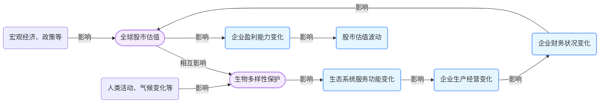

# 全球股市估值与生物多样性保护的关联

> 关键词：全球股市估值、生物多样性保护、生态金融、可持续发展、环境风险、经济影响、市场关联

> 摘要：本文深入探讨了全球股市估值与生物多样性保护之间的关联。首先介绍了研究的背景、目的、预期读者和文档结构等内容。接着阐述了核心概念，包括股市估值和生物多样性保护的原理及它们之间的联系，并给出了相应的文本示意图和 Mermaid 流程图。然后详细讲解了相关的核心算法原理，用 Python 代码进行了说明，同时给出了数学模型和公式并举例。通过项目实战，展示了如何在实际中分析两者的关联，包括开发环境搭建、源代码实现和解读。之后分析了实际应用场景，推荐了相关的学习资源、开发工具框架和论文著作。最后总结了未来发展趋势与挑战，解答了常见问题并提供了扩展阅读和参考资料。旨在揭示股市与生物多样性保护之间复杂而重要的关系，为投资者、政策制定者和环保人士提供有价值的参考。

## 1. 背景介绍 
### 1.1 目的和范围
在当今全球化的经济体系中，股市作为经济的重要组成部分，其估值受到多种因素的影响。同时，生物多样性保护已成为全球关注的焦点，因为它对于生态平衡、人类福祉和可持续发展至关重要。本研究的目的在于深入探究全球股市估值与生物多样性保护之间的内在关联，分析生物多样性的变化如何影响股市估值，以及股市估值的波动对生物多样性保护可能产生的反馈。研究范围涵盖全球主要股市和不同地区的生物多样性状况，通过综合运用金融、生态和统计等多学科的方法进行分析。

### 1.2 预期读者
本文预期读者包括金融投资者、金融分析师、生态学家、环保政策制定者、可持续发展研究人员以及对金融与生态交叉领域感兴趣的人士。对于投资者和分析师而言，了解股市估值与生物多样性保护的关联有助于更好地评估投资风险和发现潜在的投资机会；生态学家和环保政策制定者可以从金融市场的角度获得新的思路来推动生物多样性保护工作；可持续发展研究人员则可以在跨学科研究方面得到有益的启示。

### 1.3 文档结构概述
本文将按照以下结构展开：首先介绍核心概念，明确股市估值和生物多样性保护的定义及它们之间的联系；接着阐述核心算法原理和具体操作步骤，用 Python 代码实现相关算法；然后给出数学模型和公式，并通过具体例子进行详细讲解；之后通过项目实战展示如何应用这些理论和方法进行实际分析；再分析实际应用场景，探讨该关联在不同领域的应用价值；随后推荐相关的工具和资源，包括学习资源、开发工具框架和论文著作；最后总结未来发展趋势与挑战，解答常见问题并提供扩展阅读和参考资料。

### 1.4 术语表
#### 1.4.1 核心术语定义
- **全球股市估值**：指对全球范围内各个股票市场上上市公司股票价值的总体评估，通常通过各种估值指标如市盈率（P/E）、市净率（P/B）等进行衡量，反映了市场对这些公司未来盈利能力和发展前景的预期。
- **生物多样性保护**：是指采取一系列措施来维护和增加地球上生物种类的丰富度和生态系统的完整性，包括保护濒危物种、维护生态栖息地、促进可持续的资源利用等，以确保生物多样性能够持续为人类提供生态服务和经济价值。
- **生态金融**：是将金融手段应用于生态保护和可持续发展领域的一种新兴金融模式，通过金融工具和市场机制来引导资金流向生态友好型项目，实现经济发展与生态保护的双赢。

#### 1.4.2 相关概念解释
- **环境风险**：指由于自然环境变化或人类活动对环境造成的破坏而导致的潜在风险，这些风险可能会对企业的生产经营和财务状况产生不利影响，进而影响股市估值。例如，自然灾害、环境污染、生物多样性丧失等都可能引发环境风险。
- **可持续发展**：强调经济、社会和环境的协调发展，既要满足当代人的需求，又不损害后代人满足其需求的能力。生物多样性保护是可持续发展的重要组成部分，而股市作为经济的重要代表，其发展也应与可持续发展目标相契合。

#### 1.4.3 缩略词列表
- **P/E**：市盈率（Price-to-Earnings Ratio），是指股票价格除以每股收益的比率，用于衡量股票的估值水平。
- **P/B**：市净率（Price-to-Book Ratio），是指股票价格除以每股净资产的比率，反映了市场对公司净资产的估值。
- **ESG**：环境、社会和治理（Environmental, Social, and Governance），是一种关注企业可持续发展和社会责任的投资理念和评价标准。

## 2. 核心概念与联系 

### 2.1 全球股市估值原理
全球股市估值是一个复杂的过程，它受到多种因素的综合影响。从基本原理来看，股市估值主要基于上市公司的基本面和市场预期。基本面因素包括公司的盈利能力、资产质量、现金流状况等。例如，一家盈利能力强、资产负债率低、现金流稳定的公司通常会有较高的估值。市场预期则受到宏观经济环境、行业发展趋势、政策法规等因素的影响。如果市场预期某一行业未来发展前景良好，那么该行业的股票估值往往会上升。

### 2.2 生物多样性保护原理
生物多样性保护的核心原理是维护生态系统的平衡和稳定。生物多样性包括遗传多样性、物种多样性和生态系统多样性三个层次。遗传多样性是物种适应环境变化和进化的基础；物种多样性维持了生态系统的功能和服务，如食物链的稳定、土壤肥力的保持等；生态系统多样性则提供了丰富的生态服务，如水资源调节、气候调节等。保护生物多样性需要采取多种措施，包括建立自然保护区、实施濒危物种保护计划、推广可持续的农业和林业等。

### 2.3 两者之间的联系
全球股市估值与生物多样性保护之间存在着密切的联系。一方面，生物多样性的丧失可能会对股市估值产生负面影响。例如，生物多样性的破坏可能导致生态系统服务功能的下降，如水资源短缺、土壤侵蚀加剧等，这会影响到依赖自然资源的企业的生产经营，进而降低其盈利能力和股市估值。此外，生物多样性丧失还可能引发环境风险，导致企业面临法律诉讼、声誉损失等问题，进一步影响股市估值。

另一方面，股市估值的波动也可能对生物多样性保护产生影响。当股市表现良好时，企业和投资者可能有更多的资金投入到可持续发展项目和生物多样性保护领域；而当股市低迷时，企业可能会削减在环保方面的投入，从而对生物多样性保护产生不利影响。

### 2.4 文本示意图
```plaintext
全球股市估值 <-- 相互影响 --> 生物多样性保护
|                      |
| 受宏观经济、政策等影响 | 受人类活动、气候变化等影响
|                      |
V                      V
企业盈利能力变化      生态系统服务功能变化
|                      |
| 影响股市估值         | 影响企业生产经营
|                      |
V                      V
股市估值波动           企业财务状况变化
```

### 2.5 Mermaid 流程图


## 3. 核心算法原理 & 具体操作步骤 

### 3.1 数据收集与预处理
要分析全球股市估值与生物多样性保护的关联，首先需要收集相关的数据。股市估值数据可以从金融数据提供商如 Bloomberg、Wind 等获取，包括股票价格、市盈率、市净率等指标。生物多样性保护数据可以从国际组织如联合国环境规划署（UNEP）、世界自然保护联盟（IUCN）等发布的报告中获取，包括物种数量、生态系统服务价值等指标。

在收集到数据后，需要进行预处理。这包括数据清洗，去除缺失值、异常值等；数据标准化，将不同量级的数据进行统一处理，以便进行比较和分析。以下是一个使用 Python 进行数据清洗和标准化的示例代码：

```python
import pandas as pd
from sklearn.preprocessing import StandardScaler

# 读取股市估值数据
stock_data = pd.read_csv('stock_valuation.csv')
# 读取生物多样性保护数据
biodiversity_data = pd.read_csv('biodiversity_data.csv')

# 数据清洗：去除缺失值
stock_data = stock_data.dropna()
biodiversity_data = biodiversity_data.dropna()

# 数据标准化
scaler_stock = StandardScaler()
scaler_biodiversity = StandardScaler()

stock_data_scaled = scaler_stock.fit_transform(stock_data)
biodiversity_data_scaled = scaler_biodiversity.fit_transform(biodiversity_data)
```

### 3.2 相关性分析
相关性分析是探究全球股市估值与生物多样性保护关联的重要方法。常用的相关性分析方法包括皮尔逊相关系数、斯皮尔曼相关系数等。皮尔逊相关系数适用于线性关系的分析，而斯皮尔曼相关系数适用于非线性关系的分析。以下是一个使用 Python 计算皮尔逊相关系数的示例代码：

```python
import numpy as np
import pandas as pd

# 假设 stock_data_scaled 和 biodiversity_data_scaled 是标准化后的数据
stock_series = pd.Series(stock_data_scaled[:, 0])
biodiversity_series = pd.Series(biodiversity_data_scaled[:, 0])

# 计算皮尔逊相关系数
correlation = stock_series.corr(biodiversity_series, method='pearson')
print(f"皮尔逊相关系数: {correlation}")
```

### 3.3 回归分析
回归分析可以用于建立全球股市估值与生物多样性保护之间的定量关系。常用的回归分析方法包括线性回归、逻辑回归等。线性回归适用于连续变量的预测，而逻辑回归适用于分类变量的预测。以下是一个使用 Python 进行线性回归分析的示例代码：

```python
from sklearn.linear_model import LinearRegression
from sklearn.model_selection import train_test_split

# 划分训练集和测试集
X_train, X_test, y_train, y_test = train_test_split(biodiversity_data_scaled, stock_data_scaled[:, 0], test_size=0.2, random_state=42)

# 创建线性回归模型
model = LinearRegression()

# 训练模型
model.fit(X_train, y_train)

# 在测试集上进行预测
y_pred = model.predict(X_test)

# 计算模型的 R^2 得分
r2_score = model.score(X_test, y_test)
print(f"模型的 R^2 得分: {r2_score}")
```

### 3.4 具体操作步骤总结
1. 数据收集：从金融数据提供商和国际组织获取全球股市估值和生物多样性保护相关数据。
2. 数据预处理：对收集到的数据进行清洗和标准化处理。
3. 相关性分析：计算股市估值和生物多样性保护数据之间的相关性系数，判断两者之间的关联程度。
4. 回归分析：建立股市估值和生物多样性保护之间的回归模型，预测股市估值的变化。

## 4. 数学模型和公式 & 详细讲解 & 举例说明 

### 4.1 皮尔逊相关系数
皮尔逊相关系数是衡量两个变量之间线性相关程度的统计量，其计算公式为：

$$
r = \frac{\sum_{i=1}^{n}(x_i - \bar{x})(y_i - \bar{y})}{\sqrt{\sum_{i=1}^{n}(x_i - \bar{x})^2 \sum_{i=1}^{n}(y_i - \bar{y})^2}}
$$

其中，$x_i$ 和 $y_i$ 分别是变量 $X$ 和 $Y$ 的第 $i$ 个观测值，$\bar{x}$ 和 $\bar{y}$ 分别是变量 $X$ 和 $Y$ 的均值，$n$ 是观测值的数量。

皮尔逊相关系数的取值范围在 $[-1, 1]$ 之间。当 $r = 1$ 时，表示两个变量之间存在完全正线性相关；当 $r = -1$ 时，表示两个变量之间存在完全负线性相关；当 $r = 0$ 时，表示两个变量之间不存在线性相关关系。

例如，假设我们有以下两组数据：

| $x$ | $y$ |
| --- | --- |
| 1   | 2   |
| 2   | 4   |
| 3   | 6   |
| 4   | 8   |

首先计算均值：

$\bar{x} = \frac{1 + 2 + 3 + 4}{4} = 2.5$

$\bar{y} = \frac{2 + 4 + 6 + 8}{4} = 5$

然后计算分子和分母：

分子：

$\sum_{i=1}^{4}(x_i - \bar{x})(y_i - \bar{y}) = (1 - 2.5)(2 - 5) + (2 - 2.5)(4 - 5) + (3 - 2.5)(6 - 5) + (4 - 2.5)(8 - 5) = 10$

分母：

$\sqrt{\sum_{i=1}^{4}(x_i - \bar{x})^2 \sum_{i=1}^{4}(y_i - \bar{y})^2} = \sqrt{((1 - 2.5)^2 + (2 - 2.5)^2 + (3 - 2.5)^2 + (4 - 2.5)^2) \times ((2 - 5)^2 + (4 - 5)^2 + (6 - 5)^2 + (8 - 5)^2)} = 10$

最后计算皮尔逊相关系数：

$r = \frac{10}{10} = 1$

这表明 $x$ 和 $y$ 之间存在完全正线性相关关系。

### 4.2 线性回归模型
线性回归模型用于建立自变量 $X$ 和因变量 $Y$ 之间的线性关系，其一般形式为：

$$
Y = \beta_0 + \beta_1X_1 + \beta_2X_2 + \cdots + \beta_pX_p + \epsilon
$$

其中，$\beta_0$ 是截距项，$\beta_1, \beta_2, \cdots, \beta_p$ 是回归系数，$X_1, X_2, \cdots, X_p$ 是自变量，$\epsilon$ 是误差项。

线性回归模型的目标是通过最小化误差项的平方和来估计回归系数 $\beta_0, \beta_1, \cdots, \beta_p$。最小二乘法是常用的估计方法，其计算公式为：

$$
\hat{\beta} = (X^TX)^{-1}X^TY
$$

其中，$X$ 是自变量矩阵，$Y$ 是因变量向量，$\hat{\beta}$ 是回归系数的估计值。

例如，假设我们有以下数据：

| $X$ | $Y$ |
| --- | --- |
| 1   | 3   |
| 2   | 5   |
| 3   | 7   |
| 4   | 9   |

首先构建自变量矩阵 $X$ 和因变量向量 $Y$：

$X = \begin{bmatrix}
1 & 1 \\
1 & 2 \\
1 & 3 \\
1 & 4
\end{bmatrix}$

$Y = \begin{bmatrix}
3 \\
5 \\
7 \\
9
\end{bmatrix}$

然后计算 $(X^TX)^{-1}X^TY$：

$X^TX = \begin{bmatrix}
4 & 10 \\
10 & 30
\end{bmatrix}$

$(X^TX)^{-1} = \frac{1}{4 \times 30 - 10 \times 10} \begin{bmatrix}
30 & -10 \\
-10 & 4
\end{bmatrix} = \begin{bmatrix}
0.75 & -0.25 \\
-0.25 & 0.1
\end{bmatrix}$

$X^TY = \begin{bmatrix}
24 \\
70
\end{bmatrix}$

$\hat{\beta} = (X^TX)^{-1}X^TY = \begin{bmatrix}
0.75 & -0.25 \\
-0.25 & 0.1
\end{bmatrix} \begin{bmatrix}
24 \\
70
\end{bmatrix} = \begin{bmatrix}
1 \\
2
\end{bmatrix}$

因此，回归方程为 $Y = 1 + 2X$。

## 5. 项目实战：代码实际案例和详细解释说明 

### 5.1  开发环境搭建
在进行项目实战之前，需要搭建相应的开发环境。以下是具体的步骤：

1. **安装 Python**：从 Python 官方网站（https://www.python.org/downloads/）下载并安装 Python 3.x 版本。
2. **安装必要的库**：使用 pip 命令安装以下必要的库：
```bash
pip install pandas numpy scikit-learn matplotlib
```
3. **准备数据**：从金融数据提供商和国际组织获取全球股市估值和生物多样性保护相关数据，并将其保存为 CSV 文件。

### 5.2  源代码详细实现和代码解读
以下是一个完整的项目实战代码示例：

```python
import pandas as pd
import numpy as np
from sklearn.preprocessing import StandardScaler
from sklearn.linear_model import LinearRegression
from sklearn.model_selection import train_test_split
import matplotlib.pyplot as plt

# 读取股市估值数据
stock_data = pd.read_csv('stock_valuation.csv')
# 读取生物多样性保护数据
biodiversity_data = pd.read_csv('biodiversity_data.csv')

# 数据清洗：去除缺失值
stock_data = stock_data.dropna()
biodiversity_data = biodiversity_data.dropna()

# 数据标准化
scaler_stock = StandardScaler()
scaler_biodiversity = StandardScaler()

stock_data_scaled = scaler_stock.fit_transform(stock_data)
biodiversity_data_scaled = scaler_biodiversity.fit_transform(biodiversity_data)

# 划分训练集和测试集
X_train, X_test, y_train, y_test = train_test_split(biodiversity_data_scaled, stock_data_scaled[:, 0], test_size=0.2, random_state=42)

# 创建线性回归模型
model = LinearRegression()

# 训练模型
model.fit(X_train, y_train)

# 在测试集上进行预测
y_pred = model.predict(X_test)

# 计算模型的 R^2 得分
r2_score = model.score(X_test, y_test)
print(f"模型的 R^2 得分: {r2_score}")

# 绘制预测结果与实际值的对比图
plt.scatter(y_test, y_pred)
plt.xlabel('实际值')
plt.ylabel('预测值')
plt.title('实际值与预测值对比')
plt.show()
```

### 5.3  代码解读与分析
1. **数据读取**：使用 `pandas` 库的 `read_csv` 函数读取股市估值数据和生物多样性保护数据。
2. **数据清洗**：使用 `dropna` 方法去除数据中的缺失值。
3. **数据标准化**：使用 `StandardScaler` 对数据进行标准化处理，使数据具有相同的量级，便于后续分析。
4. **划分训练集和测试集**：使用 `train_test_split` 函数将数据划分为训练集和测试集，比例为 8:2。
5. **模型创建与训练**：创建线性回归模型，并使用训练集数据对模型进行训练。
6. **模型预测**：使用训练好的模型对测试集数据进行预测。
7. **模型评估**：计算模型的 $R^2$ 得分，评估模型的拟合效果。
8. **结果可视化**：使用 `matplotlib` 库绘制预测结果与实际值的对比图，直观展示模型的预测效果。

## 6. 实际应用场景 
### 6.1 投资决策
对于金融投资者来说，了解全球股市估值与生物多样性保护的关联可以帮助他们做出更明智的投资决策。如果生物多样性保护状况良好，可能意味着相关行业的企业面临的环境风险较低，具有更好的发展前景，投资者可以考虑增加对这些企业的投资。相反，如果生物多样性受到严重威胁，投资者可能需要谨慎评估相关企业的投资价值。

### 6.2 政策制定
政策制定者可以根据股市估值与生物多样性保护的关联制定相应的政策。例如，政府可以通过税收优惠、补贴等政策鼓励企业加大在生物多样性保护方面的投入，同时促进股市的可持续发展。此外，政策制定者还可以加强对金融市场的监管，引导资金流向生态友好型项目。

### 6.3 企业战略规划
企业在制定战略规划时，需要考虑生物多样性保护对自身发展的影响。如果企业所在行业与生物多样性密切相关，如农业、林业、渔业等，那么加强生物多样性保护可以降低企业的环境风险，提高企业的竞争力。企业可以通过开展可持续发展项目、加强环境管理等方式来实现生物多样性保护与企业发展的双赢。

### 6.4 生态保护项目融资
了解股市估值与生物多样性保护的关联有助于为生态保护项目融资。金融机构可以开发基于生物多样性保护的金融产品，如绿色债券、生态基金等，吸引投资者的资金。同时，企业也可以通过上市融资等方式筹集资金用于生物多样性保护项目。

## 7. 工具和资源推荐
### 7.1 学习资源推荐
#### 7.1.1 书籍推荐
- 《金融与可持续发展》：本书介绍了金融在可持续发展中的作用，包括如何将环境、社会和治理因素纳入金融决策中，对理解股市估值与生物多样性保护的关联有很大帮助。
- 《生物多样性经济学》：详细阐述了生物多样性的经济价值和保护策略，为从经济角度研究生物多样性保护提供了理论基础。
- 《计量经济学》：计量经济学是研究经济变量之间数量关系的学科，对于分析股市估值与生物多样性保护之间的定量关系非常有用。

#### 7.1.2 在线课程
- Coursera 上的“可持续金融”课程：该课程介绍了可持续金融的基本概念、理论和实践，包括如何评估环境风险和投资可持续项目。
- edX 上的“生物多样性保护与管理”课程：提供了生物多样性保护的最新知识和方法，帮助学习者了解生物多样性保护的重要性和挑战。
- 中国大学 MOOC 上的“计量经济学”课程：系统地讲解了计量经济学的基本原理和方法，适合初学者学习。

#### 7.1.3 技术博客和网站
- 世界银行官网（https://www.worldbank.org/）：提供了大量关于可持续发展和金融的研究报告和数据，对研究股市估值与生物多样性保护的关联有重要参考价值。
- 联合国环境规划署官网（https://www.unep.org/）：发布了生物多样性保护的最新动态和政策文件，是获取生物多样性保护信息的重要来源。
- Towards Data Science（https://towardsdatascience.com/）：一个专注于数据科学和机器学习的技术博客，上面有很多关于数据分析和建模的文章，对项目实战有一定的帮助。

### 7.2 开发工具框架推荐
#### 7.2.1 IDE和编辑器
- PyCharm：一款专业的 Python 集成开发环境，提供了丰富的代码编辑、调试和项目管理功能，适合进行 Python 数据分析和建模。
- Jupyter Notebook：一个交互式的开发环境，支持 Python、R 等多种编程语言，方便进行数据探索和可视化。
- Visual Studio Code：一款轻量级的代码编辑器，支持多种编程语言和插件，具有强大的代码编辑和调试功能。

#### 7.2.2 调试和性能分析工具
- PDB：Python 自带的调试器，可以帮助开发者在代码执行过程中进行调试，查找问题。
- cProfile：Python 标准库中的性能分析工具，可以分析代码的运行时间和函数调用情况，帮助开发者优化代码性能。
- TensorBoard：一个可视化工具，主要用于深度学习模型的训练过程监控和性能分析，也可以用于其他数据分析项目的可视化。

#### 7.2.3 相关框架和库
- Pandas：一个强大的数据分析库，提供了高效的数据结构和数据处理工具，适合进行数据清洗、预处理和分析。
- NumPy：一个用于科学计算的基础库，提供了多维数组和各种数学函数，是许多数据分析和机器学习库的基础。
- Scikit-learn：一个常用的机器学习库，提供了丰富的机器学习算法和工具，如分类、回归、聚类等，适合进行数据分析和建模。

### 7.3 相关论文著作推荐
#### 7.3.1 经典论文
- "The Economics of Ecosystems and Biodiversity (TEEB)"：该论文系统地阐述了生物多样性的经济价值和保护策略，是生物多样性经济学领域的经典之作。
- "Financial Markets and Sustainable Development"：探讨了金融市场在可持续发展中的作用和挑战，对理解股市估值与生物多样性保护的关联有重要启示。
- "Valuing Ecosystem Services: Toward Better Environmental Decision-Making"：介绍了生态系统服务价值评估的方法和应用，为将生物多样性保护纳入经济决策提供了理论支持。

#### 7.3.2 最新研究成果
- "Biodiversity and Financial Markets: A New Perspective"：该研究从新的视角探讨了生物多样性与金融市场的关系，提出了一些新的理论和方法。
- "The Impact of Biodiversity Loss on Stock Market Valuation"：通过实证研究分析了生物多样性丧失对股市估值的影响，为投资者和政策制定者提供了重要的参考。
- "Sustainable Finance and Biodiversity Conservation: Challenges and Opportunities"：讨论了可持续金融在生物多样性保护中的应用和挑战，提出了一些应对策略。

#### 7.3.3 应用案例分析
- "Case Studies on Biodiversity Conservation Financing"：介绍了一些生物多样性保护融资的成功案例，包括绿色债券、生态基金等，为生态保护项目融资提供了实践经验。
- "Corporate Sustainability and Stock Market Performance: Evidence from the Global Market"：通过案例分析研究了企业可持续发展与股市表现的关系，对企业制定可持续发展战略有一定的借鉴意义。
- "Integrating Biodiversity into Investment Decision-Making: A Case Study of the Forestry Sector"：以林业部门为例，介绍了如何将生物多样性因素纳入投资决策中，为投资者提供了具体的操作方法。

## 8. 总结：未来发展趋势与挑战
### 8.1 未来发展趋势
- **生态金融的兴起**：随着人们对生物多样性保护的重视程度不断提高，生态金融将成为未来金融领域的重要发展方向。越来越多的金融机构将开发基于生物多样性保护的金融产品，如绿色债券、生态基金等，以引导资金流向生态友好型项目。
- **企业可持续发展意识的增强**：企业将更加注重自身的可持续发展，将生物多样性保护纳入企业战略规划中。通过加强环境管理、开展可持续发展项目等方式，企业可以降低环境风险，提高企业的竞争力。
- **数据和技术的应用**：随着大数据、人工智能等技术的不断发展，将有更多的数据和技术应用于股市估值与生物多样性保护的研究中。例如，通过数据分析可以更准确地评估生物多样性变化对股市估值的影响，通过人工智能算法可以建立更精准的预测模型。

### 8.2 挑战
- **数据质量和可得性**：目前，全球股市估值和生物多样性保护相关的数据质量和可得性仍然存在一定的问题。数据的准确性、完整性和一致性会影响研究结果的可靠性。因此，需要加强数据收集和管理，提高数据质量。
- **跨学科研究的难度**：股市估值与生物多样性保护的关联涉及金融、生态、统计等多个学科领域，跨学科研究的难度较大。需要不同学科的研究人员加强合作，共同攻克技术难题。
- **政策协调和执行**：为了促进股市估值与生物多样性保护的良性互动，需要政府制定相应的政策并加强协调和执行。然而，政策的制定和执行往往受到各种因素的影响，如利益博弈、政策滞后等，需要政府不断完善政策体系，提高政策的有效性。

## 9. 附录：常见问题与解答
### 9.1 如何获取全球股市估值和生物多样性保护的数据？
全球股市估值数据可以从金融数据提供商如 Bloomberg、Wind 等获取，生物多样性保护数据可以从国际组织如联合国环境规划署（UNEP）、世界自然保护联盟（IUCN）等发布的报告中获取。此外，一些学术数据库和研究机构也可能提供相关的数据。

### 9.2 相关性分析和回归分析有什么区别？
相关性分析主要用于衡量两个变量之间的关联程度，它只关注变量之间的线性或非线性关系，而不考虑因果关系。回归分析则用于建立自变量和因变量之间的定量关系，可以用于预测和解释因变量的变化。回归分析通常需要假设自变量和因变量之间存在因果关系。

### 9.3 如何评估线性回归模型的性能？
常用的评估线性回归模型性能的指标包括 $R^2$ 得分、均方误差（MSE）、均方根误差（RMSE）等。$R^2$ 得分表示模型对数据的拟合程度，取值范围在 $[0, 1]$ 之间，越接近 1 表示拟合效果越好。MSE 和 RMSE 表示模型预测值与实际值之间的误差，值越小表示模型的预测效果越好。

### 9.4 生物多样性保护对股市估值的影响是短期还是长期的？
生物多样性保护对股市估值的影响可能既有短期的也有长期的。在短期内，生物多样性的变化可能会通过影响企业的生产经营和市场预期来影响股市估值。例如，自然灾害、环境污染等突发事件可能会导致相关企业的股价下跌。在长期内，生物多样性的丧失可能会影响生态系统的服务功能，进而影响整个经济的可持续发展，对股市估值产生深远的影响。

## 10. 扩展阅读 & 参考资料
### 10.1 扩展阅读
- 《可持续发展经济学》：进一步深入探讨了可持续发展的经济理论和实践，对理解股市估值与生物多样性保护的关联有更全面的认识。
- 《生态系统服务与人类福祉》：详细介绍了生态系统服务的概念、分类和价值评估方法，有助于从生态系统的角度理解生物多样性保护的重要性。
- 《金融科技与可持续金融》：介绍了金融科技在可持续金融领域的应用，为探索股市估值与生物多样性保护关联的新方法提供了思路。

### 10.2 参考资料
- Bloomberg 官方网站（https://www.bloomberg.com/）
- Wind 金融终端（https://www.wind.com.cn/）
- 联合国环境规划署官方网站（https://www.unep.org/）
- 世界自然保护联盟官方网站（https://www.iucn.org/）
- 《计量经济学》（伍德里奇著）
- 《Python 数据分析实战》（韦斯顿著）

作者：AI天才研究院/AI Genius Institute & 禅与计算机程序设计艺术 /Zen And The Art of Computer Programming