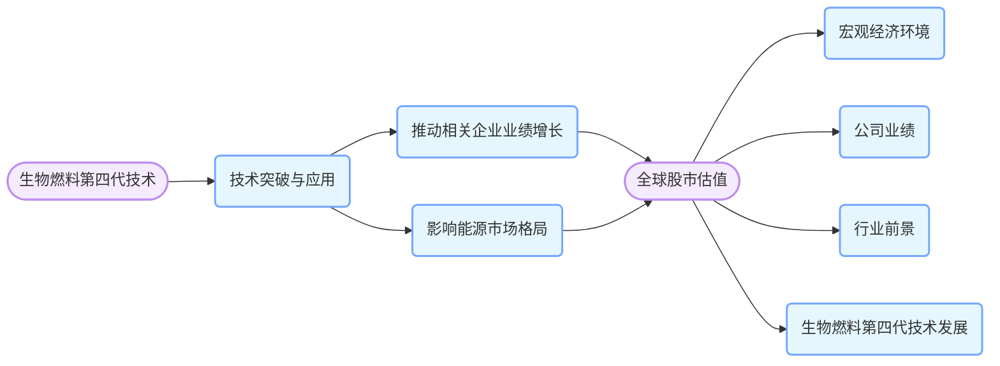

# 全球股市估值与生物燃料第四代技术的关系

> 关键词：全球股市估值、生物燃料第四代技术、能源市场、金融影响、技术发展、市场趋势、行业关联

> 摘要：本文深入探讨了全球股市估值与生物燃料第四代技术之间的关系。首先介绍了研究的背景、目的、预期读者等信息，接着阐述了相关核心概念及其联系。通过详细的算法原理、数学模型和公式分析两者之间可能存在的关联机制。同时给出项目实战案例，解释代码实现过程。还分析了生物燃料第四代技术在实际中的应用场景，推荐了相关的学习工具和资源。最后总结了未来的发展趋势与挑战，并对常见问题进行解答，为投资者、技术研究者和相关从业者提供全面的参考。

## 1. 背景介绍 
### 1.1 目的和范围
本研究旨在深入剖析全球股市估值与生物燃料第四代技术之间的内在联系。随着全球对可持续能源的需求不断增长，生物燃料第四代技术作为一种具有巨大潜力的能源解决方案，其发展态势可能对全球金融市场，特别是股市估值产生重要影响。研究范围涵盖了全球主要股票市场以及生物燃料第四代技术的各个方面，包括技术原理、研发进展、市场应用等。通过对两者关系的研究，帮助投资者更好地理解市场动态，为企业决策提供参考，同时也为政策制定者提供科学依据。

### 1.2 预期读者
本文的预期读者包括金融投资者，他们可以根据研究结果调整投资策略，把握与生物燃料第四代技术相关的投资机会；能源行业从业者，有助于他们了解技术发展对金融市场的影响，从而更好地规划企业发展战略；学术研究人员，为他们进一步深入研究提供理论基础和实证参考；政策制定者，可依据研究结论制定相关的能源政策和金融政策。

### 1.3 文档结构概述
本文首先介绍研究的背景信息，包括目的、预期读者和文档结构。接着阐述核心概念，包括全球股市估值和生物燃料第四代技术的定义、原理及它们之间的联系，并通过示意图和流程图进行直观展示。然后详细讲解核心算法原理和具体操作步骤，运用 Python 代码进行说明。再给出数学模型和公式，并举例说明。之后通过项目实战，展示代码实际案例并进行详细解释。分析生物燃料第四代技术的实际应用场景，推荐相关的工具和资源。最后总结未来发展趋势与挑战，解答常见问题，并提供扩展阅读和参考资料。

### 1.4 术语表
#### 1.4.1 核心术语定义
- **全球股市估值**：指对全球范围内各个股票市场上的上市公司的价值进行评估的过程和结果。它通常通过各种估值方法，如市盈率、市净率等，来衡量股票的相对价值，反映市场对上市公司未来盈利能力和发展前景的预期。
- **生物燃料第四代技术**：是指利用先进的生物技术和工程学方法，将生物质转化为生物燃料的最新一代技术。与前三代生物燃料技术相比，第四代技术具有更高的效率、更低的成本和更小的环境影响，通常涉及基因工程、合成生物学等前沿领域。

#### 1.4.2 相关概念解释
- **生物质**：是指通过光合作用而形成的各种有机体，包括所有的动植物和微生物。生物质能是太阳能以化学能形式贮存在生物质中的能量形式，它直接或间接地来源于绿色植物的光合作用，可转化为常规的固态、液态和气态燃料。
- **股市波动**：指股票市场价格在一定时间内的上下变动情况。股市波动受多种因素影响，包括宏观经济环境、公司业绩、政策法规、市场情绪等。

#### 1.4.3 缩略词列表
- **PE**：市盈率（Price - Earnings Ratio），是指股票价格除以每股收益（EPS）的比率，反映了市场对公司未来盈利的预期。
- **PB**：市净率（Price - Book Ratio），是指股票价格与每股净资产的比率，用于评估股票的投资价值。

## 2. 核心概念与联系 

### 2.1 全球股市估值
全球股市估值是金融市场中的一个重要概念。它是通过对上市公司的财务数据、行业前景、宏观经济环境等多方面因素进行综合分析，来确定股票的合理价格。常见的估值方法有绝对估值法和相对估值法。绝对估值法主要包括现金流折现模型（DCF），它通过预测公司未来的现金流，并将其折现到当前时刻，得到公司的内在价值。相对估值法如市盈率法、市净率法等，是通过与同行业其他公司进行比较，来评估股票的价值。

### 2.2 生物燃料第四代技术
生物燃料第四代技术是生物能源领域的前沿技术。它主要利用基因工程和合成生物学手段，对微生物进行改造，使其能够高效地将生物质转化为生物燃料。例如，通过基因编辑技术可以增强微生物对生物质的分解能力，提高生物燃料的产量和质量。与传统的生物燃料技术相比，第四代技术具有以下优势：
- 原料来源广泛：可以利用各种生物质，包括农业废弃物、林业剩余物等，减少了对粮食作物的依赖。
- 环境友好：生产过程中产生的温室气体排放较低，对环境的负面影响较小。
- 高效节能：能够更高效地将生物质转化为生物燃料，降低生产成本。

### 2.3 两者的联系
生物燃料第四代技术的发展可能会对全球股市估值产生多方面的影响。一方面，技术的突破和商业化应用可能会推动相关企业的业绩增长，从而提高其股票的估值。例如，一家掌握了先进生物燃料第四代技术的公司，可能会获得更多的订单和市场份额，其盈利能力增强，股票价格也会相应上涨。另一方面，生物燃料第四代技术的发展也可能会对能源市场产生影响，进而影响到与能源相关的股票估值。如果生物燃料能够大规模替代传统化石燃料，那么石油、煤炭等传统能源企业的股票估值可能会受到冲击。

### 2.4 文本示意图和 Mermaid 流程图
#### 文本示意图
```plaintext
全球股市估值
    |
    | 受多种因素影响
    |
    +------------------- 宏观经济环境
    |
    +------------------- 公司业绩
    |
    +------------------- 行业前景
    |
    +------------------- 生物燃料第四代技术发展

生物燃料第四代技术
    |
    | 技术突破与应用
    |
    +------------------- 推动相关企业业绩增长
    |
    +------------------- 影响能源市场格局
    |
    +------------------- 反馈影响股市估值
```

#### Mermaid 流程图


## 3. 核心算法原理 & 具体操作步骤 

### 3.1 算法原理
为了分析全球股市估值与生物燃料第四代技术之间的关系，我们可以采用回归分析的方法。回归分析是一种统计方法，用于研究一个因变量与一个或多个自变量之间的关系。在本研究中，我们将全球股市估值作为因变量，生物燃料第四代技术的相关指标（如研发投入、技术专利数量、商业化应用程度等）作为自变量。

### 3.2 Python 代码实现
```python
import numpy as np
import pandas as pd
import statsmodels.api as sm

# 假设我们有以下数据
# 全球股市估值数据
stock_valuation = np.array([100, 110, 120, 130, 140])
# 生物燃料第四代技术研发投入数据
biofuel_rd_investment = np.array([10, 12, 15, 18, 20])

# 将数据转换为 DataFrame
data = pd.DataFrame({
    'stock_valuation': stock_valuation,
    'biofuel_rd_investment': biofuel_rd_investment
})

# 定义自变量和因变量
X = data['biofuel_rd_investment']
y = data['stock_valuation']

# 添加常数项
X = sm.add_constant(X)

# 拟合线性回归模型
model = sm.OLS(y, X).fit()

# 打印回归结果
print(model.summary())
```

### 3.3 具体操作步骤
1. **数据收集**：收集全球股市估值和生物燃料第四代技术的相关数据。可以从金融数据库、行业报告、科研机构等渠道获取数据。
2. **数据预处理**：对收集到的数据进行清洗、整理和转换，确保数据的质量和一致性。例如，处理缺失值、异常值等。
3. **模型建立**：根据回归分析的原理，建立线性回归模型。在 Python 中，可以使用 `statsmodels` 库来实现。
4. **模型拟合**：将预处理后的数据输入到模型中，进行拟合。通过最小二乘法估计模型的参数。
5. **结果分析**：分析模型的回归结果，包括回归系数、显著性水平、拟合优度等。判断生物燃料第四代技术的相关指标对全球股市估值是否有显著影响。

## 4. 数学模型和公式 & 详细讲解 & 举例说明 

### 4.1 数学模型
我们建立的线性回归模型可以表示为：

$$y = \beta_0 + \beta_1x_1 + \epsilon$$

其中，$y$ 表示全球股市估值，$x_1$ 表示生物燃料第四代技术的相关指标（如研发投入），$\beta_0$ 是截距项，$\beta_1$ 是回归系数，$\epsilon$ 是误差项，服从均值为 0，方差为 $\sigma^2$ 的正态分布。

### 4.2 公式详细讲解
- **截距项 $\beta_0$**：表示当生物燃料第四代技术的相关指标为 0 时，全球股市估值的预测值。在实际应用中，它可能没有实际的物理意义，但在数学模型中是必要的。
- **回归系数 $\beta_1$**：表示生物燃料第四代技术的相关指标每增加一个单位，全球股市估值的平均变化量。如果 $\beta_1$ 为正，说明生物燃料第四代技术的发展对全球股市估值有正向影响；如果 $\beta_1$ 为负，则说明有负向影响。
- **误差项 $\epsilon$**：反映了模型无法解释的部分，即除了生物燃料第四代技术的相关指标外，其他因素对全球股市估值的影响。

### 4.3 举例说明
假设通过回归分析得到的模型为：

$$y = 80 + 2x_1$$

这意味着当生物燃料第四代技术的研发投入为 0 时，全球股市估值的预测值为 80。研发投入每增加 1 个单位，全球股市估值平均增加 2 个单位。例如，如果研发投入从 10 增加到 11，那么全球股市估值的预测值将从 $80 + 2\times10 = 100$ 增加到 $80 + 2\times11 = 102$。

## 5. 项目实战：代码实际案例和详细解释说明 

### 5.1  开发环境搭建
为了实现上述的回归分析代码，我们需要搭建以下开发环境：
1. **Python 安装**：从 Python 官方网站（https://www.python.org/downloads/）下载并安装 Python 3.x 版本。
2. **依赖库安装**：使用 `pip` 命令安装所需的依赖库，包括 `numpy`、`pandas` 和 `statsmodels`。

```bash
pip install numpy pandas statsmodels
```

### 5.2  源代码详细实现和代码解读
```python
import numpy as np
import pandas as pd
import statsmodels.api as sm

# 假设我们有以下数据
# 全球股市估值数据
stock_valuation = np.array([100, 110, 120, 130, 140])
# 生物燃料第四代技术研发投入数据
biofuel_rd_investment = np.array([10, 12, 15, 18, 20])

# 将数据转换为 DataFrame
data = pd.DataFrame({
    'stock_valuation': stock_valuation,
    'biofuel_rd_investment': biofuel_rd_investment
})

# 定义自变量和因变量
X = data['biofuel_rd_investment']
y = data['stock_valuation']

# 添加常数项
X = sm.add_constant(X)

# 拟合线性回归模型
model = sm.OLS(y, X).fit()

# 打印回归结果
print(model.summary())
```

#### 代码解读
1. **导入库**：导入 `numpy`、`pandas` 和 `statsmodels.api` 库。`numpy` 用于处理数值计算，`pandas` 用于数据处理和分析，`statsmodels` 用于统计建模。
2. **数据定义**：定义全球股市估值数据和生物燃料第四代技术研发投入数据，并将其转换为 `DataFrame` 格式。
3. **自变量和因变量定义**：将研发投入数据作为自变量 $X$，股市估值数据作为因变量 $y$。
4. **添加常数项**：使用 `sm.add_constant()` 函数为自变量添加常数项，以便进行线性回归分析。
5. **模型拟合**：使用 `sm.OLS()` 函数创建线性回归模型，并使用 `fit()` 方法进行拟合。
6. **结果输出**：使用 `model.summary()` 方法打印回归结果，包括回归系数、显著性水平、拟合优度等信息。

### 5.3  代码解读与分析
回归结果中的主要信息包括：
- **回归系数**：`coef` 列显示了截距项和自变量的回归系数。通过回归系数可以判断生物燃料第四代技术的研发投入对全球股市估值的影响方向和程度。
- **显著性水平**：`P>|t|` 列显示了回归系数的显著性水平。如果显著性水平小于 0.05，则说明回归系数在统计上是显著的，即生物燃料第四代技术的研发投入对全球股市估值有显著影响。
- **拟合优度**：`R-squared` 表示模型的拟合优度，取值范围在 0 到 1 之间。越接近 1，说明模型对数据的拟合效果越好。

## 6. 实际应用场景 
### 6.1 投资决策
投资者可以根据生物燃料第四代技术的发展情况，调整投资组合。如果技术发展前景良好，相关企业的股票可能具有较高的投资价值。例如，投资者可以关注掌握先进生物燃料第四代技术的公司，增加对这些公司的股票投资。同时，也可以考虑减少对传统能源企业股票的投资，以降低投资风险。

### 6.2 企业战略规划
能源企业可以根据生物燃料第四代技术的发展趋势，制定企业战略规划。如果技术有望大规模商业化应用，企业可以加大在该领域的研发投入，提前布局市场。例如，石油公司可以考虑与生物燃料技术企业合作，共同开发生物燃料项目，实现能源结构的多元化。

### 6.3 政策制定
政府可以根据生物燃料第四代技术对全球股市估值的影响，制定相关的政策。如果技术发展对股市有积极影响，政府可以出台支持性政策，如税收优惠、财政补贴等，鼓励企业加大研发投入，推动技术的发展和应用。同时，政府也可以通过政策引导，促进生物燃料市场的健康发展，保障能源安全和环境可持续性。

## 7. 工具和资源推荐
### 7.1 学习资源推荐
#### 7.1.1 书籍推荐
- 《金融市场与金融机构》：这本书全面介绍了金融市场的基本原理和金融机构的运作方式，对于理解全球股市估值有很大帮助。
- 《生物能源技术》：详细介绍了生物能源的各种技术，包括生物燃料第四代技术的原理、发展现状和未来趋势。
- 《计量经济学》：提供了回归分析等统计方法的理论基础和实际应用案例，有助于深入理解本文所使用的分析方法。

#### 7.1.2 在线课程
- Coursera 上的“金融市场”课程：由知名教授授课，系统讲解金融市场的知识和投资策略。
- edX 上的“生物能源工程”课程：介绍生物能源技术的最新进展和应用，包括生物燃料第四代技术。
- Udemy 上的“Python 数据分析”课程：帮助学习者掌握 Python 在数据分析中的应用，为进行相关研究提供技术支持。

#### 7.1.3 技术博客和网站
- Seeking Alpha：提供金融市场的分析和评论，包括对能源行业股票的研究报告。
- Biofuels Digest：专注于生物燃料行业的新闻和资讯，及时报道生物燃料第四代技术的发展动态。
- arXiv：提供大量的学术论文，包括生物能源和金融领域的最新研究成果。

### 7.2 开发工具框架推荐
#### 7.2.1 IDE和编辑器
- PyCharm：一款功能强大的 Python 集成开发环境，提供代码编辑、调试、版本控制等功能。
- Jupyter Notebook：一种交互式的开发环境，适合进行数据分析和可视化，方便展示研究结果。

#### 7.2.2 调试和性能分析工具
- PDB：Python 自带的调试工具，可以帮助开发者定位代码中的错误。
- cProfile：用于分析 Python 代码的性能，找出性能瓶颈。

#### 7.2.3 相关框架和库
- NumPy：用于处理数值计算，提供高效的数组操作功能。
- Pandas：用于数据处理和分析，提供数据结构和数据分析工具。
- Statsmodels：用于统计建模和分析，支持线性回归、时间序列分析等多种统计方法。

### 7.3 相关论文著作推荐
#### 7.3.1 经典论文
- “The Pricing of Options and Corporate Liabilities”：这篇论文提出了著名的 Black - Scholes 期权定价模型，为金融市场的定价理论奠定了基础。
- “Renewable Energy and Economic Growth: A Meta - analysis”：对可再生能源与经济增长之间的关系进行了系统的分析和总结。

#### 7.3.2 最新研究成果
- 一些近期发表在《Nature Energy》、《Science》等顶级学术期刊上的论文，关注生物燃料第四代技术的最新突破和应用前景。

#### 7.3.3 应用案例分析
- 相关行业报告和研究机构发布的关于生物燃料企业的案例分析，介绍企业在技术研发、市场推广等方面的经验和教训。

## 8. 总结：未来发展趋势与挑战
### 8.1 未来发展趋势
- **技术创新加速**：随着基因工程、合成生物学等技术的不断发展，生物燃料第四代技术将不断取得突破，提高生物燃料的产量和质量，降低生产成本。
- **市场需求增长**：全球对可持续能源的需求不断增加，生物燃料作为一种清洁能源，市场前景广阔。生物燃料第四代技术的发展将进一步推动生物燃料市场的扩大。
- **行业融合加深**：生物燃料行业将与金融、化工、农业等行业深度融合。例如，金融机构将加大对生物燃料企业的投资，化工企业将利用生物燃料生产高附加值的化工产品，农业企业将为生物燃料提供原料。

### 8.2 挑战
- **技术瓶颈**：生物燃料第四代技术仍面临一些技术难题，如微生物的稳定性、生物质的预处理等。解决这些技术问题需要大量的研发投入和时间。
- **政策不确定性**：生物燃料行业的发展依赖于政府的政策支持。政策的变化可能会影响企业的投资决策和市场发展。例如，政府对生物燃料补贴政策的调整可能会影响企业的盈利能力。
- **市场竞争激烈**：随着生物燃料市场的扩大，竞争将日益激烈。生物燃料企业需要不断提高技术水平和管理能力，降低成本，以提高市场竞争力。

## 9. 附录：常见问题与解答
### 9.1 生物燃料第四代技术的商业化应用还需要多久？
生物燃料第四代技术的商业化应用时间受到多种因素的影响，包括技术研发进度、政策支持力度、市场需求等。目前，该技术仍处于研发和试验阶段，预计在未来 5 - 10 年内可能会实现部分商业化应用，但要实现大规模的商业化还需要更长的时间。

### 9.2 如何判断生物燃料第四代技术相关企业的投资价值？
可以从以下几个方面判断生物燃料第四代技术相关企业的投资价值：
- **技术实力**：企业是否掌握核心技术，研发团队的实力如何。
- **市场前景**：企业的产品是否有市场需求，市场份额如何。
- **财务状况**：企业的盈利能力、偿债能力等财务指标是否良好。
- **政策支持**：企业是否得到政府的政策支持，政策对企业的发展有何影响。

### 9.3 生物燃料第四代技术的发展会对传统能源企业造成多大的冲击？
生物燃料第四代技术的发展可能会对传统能源企业造成一定的冲击，但冲击的程度取决于生物燃料的市场份额和传统能源企业的应对策略。如果生物燃料能够大规模替代传统化石燃料，那么传统能源企业的市场份额和盈利能力可能会受到较大影响。然而，传统能源企业也可以通过技术创新、多元化发展等方式来应对挑战，降低冲击的影响。

## 10. 扩展阅读 & 参考资料
### 10.1 扩展阅读
- 《低碳经济》：探讨了低碳经济的发展模式和战略，与生物燃料第四代技术的发展密切相关。
- 《能源转型：从化石燃料到可再生能源》：介绍了全球能源转型的趋势和挑战，对理解生物燃料在能源市场中的地位有帮助。

### 10.2 参考资料
- 国际能源署（IEA）发布的相关报告，提供了全球能源市场的统计数据和分析。
- 世界银行的研究报告，涉及能源政策和经济发展的关系。
- 各证券交易所发布的上市公司财务报表和公告，用于获取股市估值相关数据。

作者：AI天才研究院/AI Genius Institute & 禅与计算机程序设计艺术 /Zen And The Art of Computer Programming