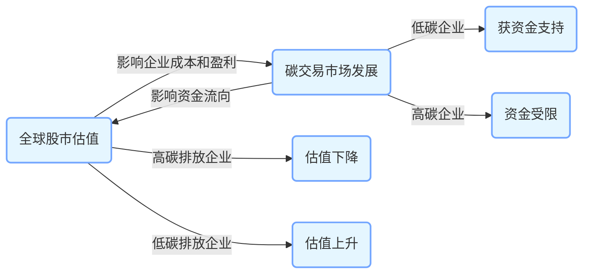

# 全球股市估值与碳交易市场发展的关系

> 关键词：全球股市估值、碳交易市场、市场关联、影响机制、可持续投资

> 摘要：本文旨在深入探讨全球股市估值与碳交易市场发展之间的关系。通过对相关核心概念的阐述、算法原理的分析、数学模型的构建，结合实际项目案例和应用场景，揭示两者之间的内在联系和相互影响机制。同时，提供学习资源、开发工具以及相关论文著作的推荐，最后对未来发展趋势与挑战进行总结，并解答常见问题。这对于投资者、政策制定者以及相关研究人员理解市场动态和做出合理决策具有重要意义。

## 1. 背景介绍 
### 1.1 目的和范围
本研究的主要目的是全面分析全球股市估值与碳交易市场发展之间的关系。具体而言，我们将探究碳交易市场的发展如何影响全球股市的估值，以及股市估值的变化又如何反馈到碳交易市场。研究范围涵盖全球主要的股票市场和碳交易市场，包括但不限于美国、欧洲、中国等地区。通过对不同地区和市场的综合研究，我们可以更全面地了解两者之间的关系在不同经济和政策环境下的表现。

### 1.2 预期读者
本文的预期读者包括金融投资者、政策制定者、研究人员以及对金融市场和环境问题感兴趣的人士。对于投资者来说，了解股市估值与碳交易市场的关系有助于他们优化投资组合，把握投资机会；政策制定者可以根据研究结果制定更合理的经济和环境政策；研究人员可以在此基础上进行更深入的学术研究；而对相关问题感兴趣的人士则可以通过本文获得更深入的市场理解。

### 1.3 文档结构概述
本文将按照以下结构进行组织：首先介绍核心概念，明确全球股市估值和碳交易市场的定义和相关联系；接着阐述核心算法原理和具体操作步骤，通过Python代码进行详细说明；然后构建数学模型并进行详细讲解和举例；之后通过项目实战展示代码的实际应用和详细解释；再分析实际应用场景；推荐相关的学习资源、开发工具和论文著作；最后总结未来发展趋势与挑战，解答常见问题，并提供扩展阅读和参考资料。

### 1.4 术语表
#### 1.4.1 核心术语定义
- **全球股市估值**：指对全球范围内各个股票市场上上市公司股票价值的评估。它通常通过各种估值指标，如市盈率（P/E）、市净率（P/B）等，来衡量股票的相对价值。
- **碳交易市场**：是一个基于市场机制的减排工具，通过设定碳排放总量上限，允许企业在市场上交易碳排放配额。企业可以根据自身的减排成本和需求，在市场上购买或出售碳排放配额，以达到减排目标。

#### 1.4.2 相关概念解释
- **碳排放配额**：是碳交易市场中的一种许可证，代表企业被允许排放的一定数量的温室气体。企业需要根据自身的生产活动获得相应数量的碳排放配额，如果企业的实际排放量超过了配额，就需要在市场上购买额外的配额；反之，如果企业的排放量低于配额，就可以将剩余的配额出售。
- **可持续投资**：是一种考虑环境、社会和治理（ESG）因素的投资策略。投资者在进行投资决策时，不仅关注企业的财务绩效，还会考虑企业在环境保护、社会责任和公司治理等方面的表现。碳交易市场的发展与可持续投资密切相关，因为它可以促使企业减少碳排放，提高环境绩效，从而吸引更多的可持续投资者。

#### 1.4.3 缩略词列表
- **P/E**：市盈率（Price-to-Earnings Ratio），是股票价格与每股收益的比率，用于衡量股票的估值水平。
- **P/B**：市净率（Price-to-Book Ratio），是股票价格与每股净资产的比率，也是常用的股票估值指标之一。
- **ESG**：环境、社会和治理（Environmental, Social, and Governance），是可持续投资中考虑的三个重要因素。

## 2. 核心概念与联系 
### 2.1 全球股市估值的原理
全球股市估值是基于对上市公司未来盈利能力和现金流的预期。投资者通过分析公司的财务报表、行业前景、宏观经济环境等因素，来评估公司的价值，并据此确定股票的价格。常见的估值方法包括绝对估值法和相对估值法。

绝对估值法是通过对公司未来现金流进行折现来计算公司的内在价值。例如，现金流折现模型（DCF）就是一种常用的绝对估值方法，其公式为：

$$V = \sum_{t=1}^{n} \frac{CF_t}{(1 + r)^t}$$

其中，$V$ 表示公司的内在价值，$CF_t$ 表示第 $t$ 期的现金流，$r$ 表示折现率，$n$ 表示预测期数。

相对估值法是通过比较公司与同行业其他公司的估值指标来确定公司的相对价值。例如，市盈率法就是一种常用的相对估值方法，其公式为：

$$P = EPS \times P/E$$

其中，$P$ 表示股票价格，$EPS$ 表示每股收益，$P/E$ 表示市盈率。

### 2.2 碳交易市场的架构
碳交易市场主要由三个部分组成：碳排放配额的设定、交易平台和监管机构。

碳排放配额的设定是碳交易市场的基础。政府或相关机构根据国家或地区的减排目标，确定碳排放总量上限，并将其分配给各个企业。分配方式可以是免费分配、拍卖或混合分配。

交易平台是碳交易市场的核心，它提供了碳排放配额的交易场所。企业可以通过交易平台进行碳排放配额的买卖，以满足自身的减排需求。交易平台通常采用电子交易系统，实现交易的自动化和高效化。

监管机构负责对碳交易市场进行监管，确保市场的公平、公正和透明。监管机构的职责包括制定市场规则、监测市场交易、处罚违规行为等。

### 2.3 两者之间的联系
全球股市估值与碳交易市场发展之间存在着密切的联系。一方面，碳交易市场的发展会影响企业的成本和盈利能力，从而对股市估值产生影响。例如，对于高碳排放企业来说，碳交易市场的建立会增加其碳排放成本，降低其盈利能力，从而导致其股票估值下降；而对于低碳排放企业来说，碳交易市场的发展会为其提供更多的发展机会，提高其盈利能力，从而导致其股票估值上升。

另一方面，股市估值的变化也会影响碳交易市场的发展。如果股市对低碳排放企业的估值较高，会吸引更多的资金流入这些企业，促进其技术创新和发展，从而推动碳交易市场的发展；反之，如果股市对高碳排放企业的估值较高，会导致资金继续流向这些企业，不利于碳减排目标的实现，也会影响碳交易市场的发展。

### 2.4 文本示意图
```plaintext
全球股市估值 <----> 碳交易市场发展
|                      |
| 影响企业盈利能力    | 影响资金流向
|                      |
| 高碳排放企业估值下降 | 低碳企业获资金支持
| 低碳排放企业估值上升 | 高碳企业资金受限
```

### 2.5 Mermaid 流程图


## 3. 核心算法原理 & 具体操作步骤 
### 3.1 相关性分析算法原理
为了分析全球股市估值与碳交易市场发展之间的关系，我们可以使用相关性分析算法。相关性分析是一种统计方法，用于衡量两个变量之间的线性关系强度。常用的相关性分析方法包括皮尔逊相关系数和斯皮尔曼相关系数。

皮尔逊相关系数是一种衡量两个变量之间线性关系强度的统计指标，其计算公式为：

$$r = \frac{\sum_{i=1}^{n} (x_i - \bar{x})(y_i - \bar{y})}{\sqrt{\sum_{i=1}^{n} (x_i - \bar{x})^2 \sum_{i=1}^{n} (y_i - \bar{y})^2}}$$

其中，$r$ 表示皮尔逊相关系数，$x_i$ 和 $y_i$ 分别表示两个变量的第 $i$ 个观测值，$\bar{x}$ 和 $\bar{y}$ 分别表示两个变量的均值，$n$ 表示观测值的数量。

斯皮尔曼相关系数是一种非参数统计指标，用于衡量两个变量之间的单调关系强度。其计算公式为：

$$r_s = 1 - \frac{6 \sum_{i=1}^{n} d_i^2}{n(n^2 - 1)}$$

其中，$r_s$ 表示斯皮尔曼相关系数，$d_i$ 表示两个变量的第 $i$ 个观测值的秩差，$n$ 表示观测值的数量。

### 3.2 Python 代码实现
```python
import pandas as pd
import numpy as np
from scipy.stats import pearsonr, spearmanr

# 假设我们有两个数据集，一个是全球股市估值数据，另一个是碳交易市场发展数据
# 这里我们使用随机生成的数据作为示例
np.random.seed(0)
stock_valuation = pd.Series(np.random.randn(100))
carbon_market_development = pd.Series(np.random.randn(100))

# 计算皮尔逊相关系数和 p 值
pearson_corr, pearson_p = pearsonr(stock_valuation, carbon_market_development)
print(f"皮尔逊相关系数: {pearson_corr}, p 值: {pearson_p}")

# 计算斯皮尔曼相关系数和 p 值
spearman_corr, spearman_p = spearmanr(stock_valuation, carbon_market_development)
print(f"斯皮尔曼相关系数: {spearman_corr}, p 值: {spearman_p}")
```

### 3.3 代码解释
上述代码首先导入了必要的库，包括 `pandas`、`numpy` 和 `scipy.stats`。然后，我们使用 `numpy` 生成了两个随机数据集，分别代表全球股市估值数据和碳交易市场发展数据。接着，我们使用 `pearsonr` 函数计算了皮尔逊相关系数和 p 值，使用 `spearmanr` 函数计算了斯皮尔曼相关系数和 p 值。最后，我们打印出了计算结果。

### 3.4 具体操作步骤
1. 数据收集：收集全球股市估值数据和碳交易市场发展数据。数据可以来自金融数据库、政府报告、研究机构等。
2. 数据预处理：对收集到的数据进行清洗、整理和标准化处理，以确保数据的质量和一致性。
3. 相关性分析：使用上述 Python 代码对处理后的数据进行相关性分析，计算皮尔逊相关系数和斯皮尔曼相关系数。
4. 结果分析：根据计算结果，分析全球股市估值与碳交易市场发展之间的关系。如果相关系数接近 1 或 -1，则表示两者之间存在较强的线性或单调关系；如果相关系数接近 0，则表示两者之间关系较弱。

## 4. 数学模型和公式 & 详细讲解 & 举例说明 
### 4.1 线性回归模型
线性回归模型是一种常用的统计模型，用于描述两个或多个变量之间的线性关系。在分析全球股市估值与碳交易市场发展之间的关系时，我们可以使用简单线性回归模型，其公式为：

$$y = \beta_0 + \beta_1 x + \epsilon$$

其中，$y$ 表示全球股市估值，$x$ 表示碳交易市场发展指标，$\beta_0$ 表示截距，$\beta_1$ 表示斜率，$\epsilon$ 表示误差项。

### 4.2 模型参数估计
为了估计线性回归模型的参数 $\beta_0$ 和 $\beta_1$，我们可以使用最小二乘法。最小二乘法的目标是使误差项的平方和最小，即：

$$\min_{\beta_0, \beta_1} \sum_{i=1}^{n} (y_i - \beta_0 - \beta_1 x_i)^2$$

通过求解上述优化问题，我们可以得到参数的估计值：

$$\hat{\beta}_1 = \frac{\sum_{i=1}^{n} (x_i - \bar{x})(y_i - \bar{y})}{\sum_{i=1}^{n} (x_i - \bar{x})^2}$$

$$\hat{\beta}_0 = \bar{y} - \hat{\beta}_1 \bar{x}$$

其中，$\hat{\beta}_0$ 和 $\hat{\beta}_1$ 分别表示 $\beta_0$ 和 $\beta_1$ 的估计值，$\bar{x}$ 和 $\bar{y}$ 分别表示 $x$ 和 $y$ 的均值。

### 4.3 举例说明
假设我们有以下全球股市估值数据和碳交易市场发展数据：

| 全球股市估值 ($y$) | 碳交易市场发展指标 ($x$) |
| --- | --- |
| 10 | 2 |
| 12 | 3 |
| 15 | 4 |
| 18 | 5 |
| 20 | 6 |

首先，我们计算 $x$ 和 $y$ 的均值：

$$\bar{x} = \frac{2 + 3 + 4 + 5 + 6}{5} = 4$$

$$\bar{y} = \frac{10 + 12 + 15 + 18 + 20}{5} = 15$$

然后，我们计算 $\hat{\beta}_1$：

$$\hat{\beta}_1 = \frac{(2 - 4)(10 - 15) + (3 - 4)(12 - 15) + (4 - 4)(15 - 15) + (5 - 4)(18 - 15) + (6 - 4)(20 - 15)}{(2 - 4)^2 + (3 - 4)^2 + (4 - 4)^2 + (5 - 4)^2 + (6 - 4)^2}$$

$$= \frac{(-2)(-5) + (-1)(-3) + 0 + 1(3) + 2(5)}{4 + 1 + 0 + 1 + 4}$$

$$= \frac{10 + 3 + 0 + 3 + 10}{10}$$

$$= 2.6$$

最后，我们计算 $\hat{\beta}_0$：

$$\hat{\beta}_0 = 15 - 2.6 \times 4 = 4.6$$

因此，线性回归模型为：

$$y = 4.6 + 2.6 x$$

这意味着，当碳交易市场发展指标每增加 1 个单位时，全球股市估值预计将增加 2.6 个单位。

### 4.4 模型评估
为了评估线性回归模型的拟合效果，我们可以使用决定系数（$R^2$）和均方误差（MSE）等指标。

决定系数（$R^2$）表示模型解释的方差占总方差的比例，其计算公式为：

$$R^2 = 1 - \frac{\sum_{i=1}^{n} (y_i - \hat{y}_i)^2}{\sum_{i=1}^{n} (y_i - \bar{y})^2}$$

其中，$\hat{y}_i$ 表示模型的预测值。

均方误差（MSE）表示模型预测值与实际值之间的平均误差平方，其计算公式为：

$$MSE = \frac{1}{n} \sum_{i=1}^{n} (y_i - \hat{y}_i)^2$$

$R^2$ 越接近 1，说明模型的拟合效果越好；MSE 越小，说明模型的预测精度越高。

## 5. 项目实战：代码实际案例和详细解释说明 
### 5.1  开发环境搭建
为了进行本项目实战，我们需要搭建以下开发环境：
1. **Python 环境**：建议使用 Python 3.7 及以上版本。可以从 Python 官方网站（https://www.python.org/downloads/）下载并安装。
2. **数据分析库**：安装 `pandas`、`numpy`、`scikit-learn` 等数据分析库。可以使用 `pip` 命令进行安装：
```sh
pip install pandas numpy scikit-learn
```
3. **可视化库**：安装 `matplotlib`、`seaborn` 等可视化库，用于数据可视化。可以使用 `pip` 命令进行安装：
```sh
pip install matplotlib seaborn
```

### 5.2  源代码详细实现和代码解读
```python
import pandas as pd
import numpy as np
import matplotlib.pyplot as plt
import seaborn as sns
from sklearn.linear_model import LinearRegression
from sklearn.metrics import r2_score, mean_squared_error

# 读取数据
data = pd.read_csv('stock_carbon_data.csv')  # 假设数据存储在 CSV 文件中
stock_valuation = data['stock_valuation']
carbon_market_development = data['carbon_market_development']

# 数据可视化
plt.figure(figsize=(10, 6))
sns.scatterplot(x=carbon_market_development, y=stock_valuation)
plt.xlabel('碳交易市场发展指标')
plt.ylabel('全球股市估值')
plt.title('全球股市估值与碳交易市场发展的散点图')
plt.show()

# 构建线性回归模型
X = carbon_market_development.values.reshape(-1, 1)
y = stock_valuation.values
model = LinearRegression()
model.fit(X, y)

# 模型预测
y_pred = model.predict(X)

# 模型评估
r2 = r2_score(y, y_pred)
mse = mean_squared_error(y, y_pred)
print(f"决定系数 (R^2): {r2}")
print(f"均方误差 (MSE): {mse}")

# 绘制回归直线
plt.figure(figsize=(10, 6))
sns.scatterplot(x=carbon_market_development, y=stock_valuation)
plt.plot(carbon_market_development, y_pred, color='red', linewidth=2)
plt.xlabel('碳交易市场发展指标')
plt.ylabel('全球股市估值')
plt.title('全球股市估值与碳交易市场发展的线性回归')
plt.show()
```

### 5.3  代码解读与分析
1. **数据读取**：使用 `pandas` 库的 `read_csv` 函数读取存储在 CSV 文件中的数据。假设数据文件名为 `stock_carbon_data.csv`，包含两列：`stock_valuation` 表示全球股市估值，`carbon_market_development` 表示碳交易市场发展指标。
2. **数据可视化**：使用 `seaborn` 库的 `scatterplot` 函数绘制全球股市估值与碳交易市场发展指标的散点图，以便直观地观察两者之间的关系。
3. **构建线性回归模型**：使用 `sklearn` 库的 `LinearRegression` 类构建线性回归模型，并使用 `fit` 方法对模型进行训练。
4. **模型预测**：使用训练好的模型对碳交易市场发展指标进行预测，得到全球股市估值的预测值。
5. **模型评估**：使用 `sklearn` 库的 `r2_score` 和 `mean_squared_error` 函数计算模型的决定系数（$R^2$）和均方误差（MSE），评估模型的拟合效果和预测精度。
6. **绘制回归直线**：使用 `matplotlib` 库绘制回归直线，直观地展示线性回归模型的拟合效果。

通过以上代码，我们可以清晰地看到全球股市估值与碳交易市场发展之间的线性关系，并评估模型的拟合效果和预测精度。

## 6. 实际应用场景 
### 6.1 投资决策
对于投资者来说，了解全球股市估值与碳交易市场发展的关系可以帮助他们优化投资组合。例如，投资者可以根据碳交易市场的发展趋势，选择投资低碳排放企业的股票，以获得更好的投资回报。同时，投资者也可以关注高碳排放企业的股票风险，避免因碳交易市场的发展导致其股票估值下降而遭受损失。

### 6.2 政策制定
政策制定者可以根据全球股市估值与碳交易市场发展的关系，制定更合理的经济和环境政策。例如，政府可以通过调整碳排放配额的分配方式和价格，引导企业减少碳排放，促进碳交易市场的发展。同时，政府也可以出台相关政策，鼓励投资者投资低碳排放企业，推动经济的可持续发展。

### 6.3 企业战略规划
企业可以根据全球股市估值与碳交易市场发展的关系，制定更合理的战略规划。例如，高碳排放企业可以加大节能减排的投入，降低碳排放成本，提高企业的竞争力；低碳排放企业可以利用碳交易市场的发展机会，扩大生产规模，提高市场份额。

### 6.4 风险管理
金融机构可以根据全球股市估值与碳交易市场发展的关系，进行风险管理。例如，银行可以对高碳排放企业的贷款进行风险评估，提高贷款利率或减少贷款额度，以降低信贷风险；保险公司可以开发碳风险保险产品，为企业提供碳风险保障。

## 7. 工具和资源推荐
### 7.1 学习资源推荐
#### 7.1.1 书籍推荐
- 《金融市场学》：介绍了金融市场的基本概念、原理和运作机制，对于理解全球股市估值和碳交易市场有很大帮助。
- 《碳排放权交易：理论、实践与政策》：系统地介绍了碳排放权交易的基本理论、实践经验和政策措施，是学习碳交易市场的重要参考书籍。
- 《计量经济学》：介绍了计量经济学的基本方法和应用，对于进行全球股市估值与碳交易市场关系的实证研究非常有用。

#### 7.1.2 在线课程
- Coursera 上的“Financial Markets”课程：由耶鲁大学教授 Robert Shiller 授课，介绍了金融市场的基本概念、理论和实践。
- edX 上的“Carbon Markets and Climate Finance”课程：介绍了碳市场和气候金融的基本概念、原理和实践。
- 中国大学 MOOC 上的“计量经济学”课程：由国内知名高校的教授授课，系统地介绍了计量经济学的基本方法和应用。

#### 7.1.3 技术博客和网站
- 金融界网站（https://www.jrj.com.cn/）：提供了丰富的金融市场资讯和分析，对于了解全球股市估值有很大帮助。
- 碳交易网（https://www.tanjiaoyi.com/）：专注于碳交易市场的资讯和研究，是了解碳交易市场的重要网站。
- Towards Data Science（https://towardsdatascience.com/）：提供了大量的数据科学和机器学习方面的技术文章，对于进行数据分析和建模非常有帮助。

### 7.2 开发工具框架推荐
#### 7.2.1 IDE和编辑器
- PyCharm：是一款专门为 Python 开发设计的集成开发环境（IDE），具有强大的代码编辑、调试和项目管理功能。
- Jupyter Notebook：是一种交互式的开发环境，适合进行数据分析和可视化。用户可以在浏览器中编写和运行代码，并实时查看代码的执行结果。
- Visual Studio Code：是一款轻量级的代码编辑器，支持多种编程语言和开发框架。它具有丰富的插件生态系统，可以满足不同的开发需求。

#### 7.2.2 调试和性能分析工具
- IPython：是 Python 的交互式解释器，提供了强大的调试和分析功能。用户可以在 IPython 中使用 `%debug` 命令进行调试，使用 `%timeit` 命令进行性能分析。
- Py-Spy：是一款用于分析 Python 程序性能的工具。它可以实时监测 Python 程序的 CPU 使用情况、函数调用栈等信息，帮助用户找出性能瓶颈。
- cProfile：是 Python 标准库中的一个性能分析模块。用户可以使用 `cProfile.run()` 函数对 Python 程序进行性能分析，生成详细的性能报告。

#### 7.2.3 相关框架和库
- Pandas：是 Python 中用于数据处理和分析的重要库。它提供了高效的数据结构和数据操作方法，方便用户进行数据清洗、整理和分析。
- Numpy：是 Python 中用于科学计算的基础库。它提供了高效的多维数组对象和数学函数，方便用户进行数值计算和矩阵运算。
- Scikit-learn：是 Python 中用于机器学习的重要库。它提供了丰富的机器学习算法和工具，方便用户进行数据建模和预测。

### 7.3 相关论文著作推荐
#### 7.3.1 经典论文
- “The Pricing of Options and Corporate Liabilities” by Fischer Black and Myron Scholes：提出了著名的 Black-Scholes 期权定价模型，对金融市场的定价理论产生了深远影响。
- “The Efficient Market Hypothesis and Its Critics” by Eugene F. Fama：介绍了有效市场假说的基本概念和理论，并对其进行了深入的讨论和批判。
- “Carbon Pricing and Firm Valuation” by Christian Gollier and Bernard Sinclair-Desgagné：研究了碳定价对企业估值的影响，为理解全球股市估值与碳交易市场发展的关系提供了重要的理论基础。

#### 7.3.2 最新研究成果
- 关注《Journal of Financial Economics》、《Review of Financial Studies》、《Energy Economics》等国际知名学术期刊，及时了解全球股市估值与碳交易市场发展关系的最新研究成果。
- 参加国际学术会议，如美国金融协会（AFA）年会、欧洲金融协会（EFA）年会等，与国内外专家学者交流最新研究进展。

#### 7.3.3 应用案例分析
- 研究国内外碳交易市场的实际运行案例，如欧盟排放交易体系（EU ETS）、中国碳排放权交易市场等，了解碳交易市场的政策制定、市场机制和运行效果。
- 分析国内外企业在应对碳交易市场发展方面的战略和实践案例，如苹果公司的碳中和战略、中国石油化工集团的节能减排措施等，为企业制定合理的战略规划提供参考。

## 8. 总结：未来发展趋势与挑战
### 8.1 未来发展趋势
- **碳交易市场规模扩大**：随着全球对气候变化问题的关注度不断提高，越来越多的国家和地区将建立碳交易市场，碳交易市场的规模将不断扩大。
- **股市估值与碳减排挂钩**：投资者将越来越关注企业的碳减排表现，股市估值将与企业的碳减排挂钩。低碳排放企业的股票估值将得到提升，高碳排放企业的股票估值将面临压力。
- **技术创新推动发展**：随着技术的不断创新，如区块链、人工智能等技术将在碳交易市场和股市中得到广泛应用，提高市场的效率和透明度。
- **国际合作加强**：全球气候变化是一个全球性问题，需要各国共同合作应对。未来，国际间的碳交易市场合作将加强，形成更加统一的全球碳市场。

### 8.2 挑战
- **政策不确定性**：碳交易市场的发展离不开政策的支持和引导，但政策的不确定性可能会影响市场的稳定和发展。例如，政策的调整可能会导致碳排放配额的价格波动，影响企业的成本和盈利能力。
- **数据质量和透明度**：碳交易市场和股市的有效运行需要准确、及时的数据支持。但目前数据质量和透明度仍然存在问题，可能会影响市场的公平性和有效性。
- **市场操纵和监管难度**：随着碳交易市场和股市的发展，市场操纵和违规行为可能会增加。监管机构需要加强监管力度，提高监管效率，防范市场风险。
- **技术应用的挑战**：虽然区块链、人工智能等技术在碳交易市场和股市中有很大的应用潜力，但技术的应用也面临着一些挑战，如技术的安全性、可靠性等问题。

## 9. 附录：常见问题与解答
### 9.1 全球股市估值与碳交易市场发展之间的关系一定是线性的吗？
不一定。虽然我们在本文中使用了线性回归模型来分析两者之间的关系，但实际情况可能更加复杂。两者之间的关系可能是非线性的，受到多种因素的影响，如政策变化、技术创新、市场情绪等。因此，在进行分析时，需要综合考虑多种因素，并尝试使用不同的模型和方法进行分析。

### 9.2 如何判断碳交易市场的发展对股市估值的影响是正向还是负向？
可以通过分析不同行业和企业的碳排放情况以及其在碳交易市场中的表现来判断影响的方向。对于低碳排放企业来说，碳交易市场的发展可能会为其提供更多的发展机会，提高其盈利能力，从而对其股票估值产生正向影响；而对于高碳排放企业来说，碳交易市场的发展可能会增加其碳排放成本，降低其盈利能力，从而对其股票估值产生负向影响。此外，还可以通过实证研究来分析两者之间的关系，计算相关系数和回归系数等指标，以判断影响的方向和强度。

### 9.3 碳交易市场的发展是否会导致股市的波动加剧？
碳交易市场的发展可能会对股市产生一定的影响，但不一定会导致股市的波动加剧。一方面，碳交易市场的发展可能会促使企业调整生产和经营策略，提高资源利用效率，从而增强企业的竞争力和稳定性，有利于股市的稳定发展。另一方面，如果碳交易市场的政策调整频繁、价格波动较大，可能会对企业的成本和盈利能力产生较大影响，从而导致股市的波动加剧。因此，需要合理制定碳交易市场的政策，加强市场监管，以确保市场的稳定运行。

### 9.4 投资者如何利用全球股市估值与碳交易市场发展的关系进行投资？
投资者可以关注碳交易市场的发展趋势和政策变化，选择投资低碳排放企业的股票，以获得更好的投资回报。同时，投资者也可以关注高碳排放企业的股票风险，避免因碳交易市场的发展导致其股票估值下降而遭受损失。此外，投资者还可以利用相关的数据分析工具和模型，对全球股市估值与碳交易市场发展的关系进行深入分析，以制定更合理的投资策略。

## 10. 扩展阅读 & 参考资料
### 10.1 扩展阅读
- 《可持续金融：理论、实践与创新》：介绍了可持续金融的基本概念、理论和实践，对于理解碳交易市场和可持续投资有很大帮助。
- 《气候变化经济学》：研究了气候变化对经济的影响以及应对气候变化的经济政策，为分析全球股市估值与碳交易市场发展的关系提供了更广阔的视角。
- 《金融科技与金融创新》：介绍了金融科技的发展趋势和应用场景，对于了解区块链、人工智能等技术在碳交易市场和股市中的应用有很大帮助。

### 10.2 参考资料
- 各国政府和国际组织发布的相关报告和政策文件，如《巴黎协定》、各国的碳排放权交易政策等。
- 金融数据库和研究机构发布的数据和报告，如彭博社、路透社等金融数据提供商发布的股市估值数据，世界银行、国际能源署等研究机构发布的碳交易市场数据和研究报告。
- 学术期刊和会议论文，如《Journal of Financial Economics》、《Review of Financial Studies》、《Energy Economics》等学术期刊上发表的关于全球股市估值与碳交易市场发展关系的研究论文，以及国际学术会议上的相关报告和交流内容。

作者：AI天才研究院/AI Genius Institute & 禅与计算机程序设计艺术 /Zen And The Art of Computer Programming