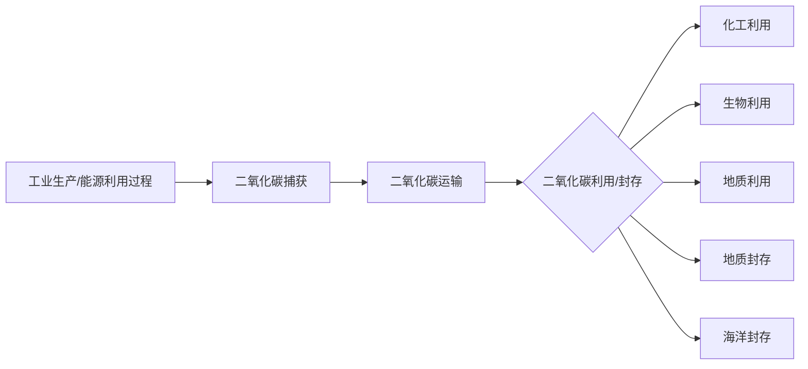

# 全球股市估值与碳捕获与利用技术的经济可行性

> 关键词：全球股市估值、碳捕获与利用技术、经济可行性、金融市场、碳排放、可持续发展

> 摘要：本文深入探讨了全球股市估值与碳捕获与利用（CCUS）技术经济可行性之间的关系。在全球应对气候变化的大背景下，CCUS 技术作为减少碳排放的关键手段备受关注。股市估值反映了市场对企业和行业未来盈利能力的预期，而 CCUS 技术的经济可行性影响着相关企业的价值和发展前景。通过分析两者的联系，有助于投资者更好地评估相关股票的投资价值，也为政策制定者和企业管理者提供决策参考，以推动 CCUS 技术的发展和应用，实现经济与环境的可持续发展。

## 1. 背景介绍 
### 1.1 目的和范围
本研究的主要目的是全面分析全球股市估值与碳捕获与利用技术经济可行性之间的内在联系。具体范围涵盖了全球主要股票市场中与 CCUS 技术相关的企业，包括技术研发、设备制造、项目运营等各个环节的企业。同时，对 CCUS 技术的经济可行性进行多维度评估，涉及技术成本、市场需求、政策支持等因素，以揭示其对股市估值的影响机制。

### 1.2 预期读者
本文预期读者包括金融市场投资者、金融分析师、能源与环境领域的企业管理者、政策制定者以及对气候变化和可持续发展感兴趣的研究人员。投资者可以通过本文了解 CCUS 技术相关股票的投资价值和风险；企业管理者可以根据研究结果制定战略决策，优化资源配置；政策制定者可以获取相关信息，制定更有效的政策来推动 CCUS 技术的发展；研究人员可以将本文作为进一步研究的参考资料。

### 1.3 文档结构概述
本文首先介绍研究的背景和目的，明确预期读者和文档结构。接着阐述全球股市估值和碳捕获与利用技术的核心概念，分析它们之间的联系。然后详细讲解评估 CCUS 技术经济可行性的核心算法原理和具体操作步骤，并给出相关的数学模型和公式。通过项目实战，展示代码实际案例并进行详细解释。之后探讨 CCUS 技术的实际应用场景，推荐相关的工具和资源。最后总结未来发展趋势与挑战，提供常见问题与解答以及扩展阅读和参考资料。

### 1.4 术语表
#### 1.4.1 核心术语定义
- **全球股市估值**：指对全球范围内各个股票市场中上市公司股票价值的评估，通常基于公司的财务状况、盈利能力、市场前景等因素，采用多种估值方法进行计算。
- **碳捕获与利用技术（CCUS）**：是一种将二氧化碳从工业生产、能源利用等过程中捕获并加以利用或封存的技术。包括二氧化碳的捕获、运输、利用和封存等环节。
- **经济可行性**：指项目或技术在经济上的合理性和可持续性，通常通过成本效益分析、投资回报率等指标来评估。

#### 1.4.2 相关概念解释
- **碳排放**：指人类活动向大气中排放的二氧化碳等温室气体的量。碳排放是导致全球气候变化的主要原因之一。
- **可持续发展**：指既满足当代人的需求，又不损害后代人满足其需求的能力的发展模式。在能源和环境领域，可持续发展要求减少碳排放，提高能源效率，推广清洁能源等。
- **金融市场**：指资金融通的市场，包括股票市场、债券市场、期货市场等。金融市场为企业和投资者提供了融资和投资的渠道。

#### 1.4.3 缩略词列表
- **CCUS**：Carbon Capture, Utilization and Storage（碳捕获、利用与封存）
- **ROI**：Return on Investment（投资回报率）
- **NPV**：Net Present Value（净现值）

## 2. 核心概念与联系 
### 2.1 全球股市估值的原理和方法
全球股市估值是金融市场中的重要环节，其目的是确定股票的合理价值，为投资者提供决策依据。常见的估值方法包括：
- **市盈率法（P/E）**：市盈率是指股票价格与每股收益的比率。计算公式为：$P/E=\frac{股价}{每股收益}$。市盈率法假设股票的价值与其盈利水平成正比，通过比较不同公司或行业的市盈率，可以判断股票的相对估值水平。
- **市净率法（P/B）**：市净率是指股票价格与每股净资产的比率。计算公式为：$P/B=\frac{股价}{每股净资产}$。市净率法适用于资产价值较为稳定的公司，通过比较市净率，可以评估股票的估值是否合理。
- **现金流折现法（DCF）**：现金流折现法是一种基于未来现金流的估值方法。其基本原理是将公司未来的现金流按照一定的折现率折现到当前，得到公司的内在价值。计算公式为：$V=\sum_{t=1}^{n}\frac{CF_t}{(1+r)^t}$，其中 $V$ 为公司的内在价值，$CF_t$ 为第 $t$ 期的现金流，$r$ 为折现率，$n$ 为预测期数。

### 2.2 碳捕获与利用技术的原理和架构
碳捕获与利用技术主要包括以下几个环节：
- **二氧化碳捕获**：从工业生产、能源利用等过程中捕获二氧化碳的技术。常见的捕获方法包括燃烧前捕获、燃烧后捕获和富氧燃烧捕获等。
- **二氧化碳运输**：将捕获的二氧化碳从捕获源运输到利用或封存地点的技术。常见的运输方式包括管道运输、公路运输和铁路运输等。
- **二氧化碳利用**：将捕获的二氧化碳转化为有价值的产品或服务的技术。常见的利用方式包括化工利用、生物利用和地质利用等。
- **二氧化碳封存**：将捕获的二氧化碳永久地封存在地下或海洋中的技术。常见的封存地点包括地质封存和海洋封存等。

碳捕获与利用技术的架构可以用以下 Mermaid 流程图表示：


### 2.3 全球股市估值与碳捕获与利用技术的联系
全球股市估值与碳捕获与利用技术之间存在着密切的联系。一方面，CCUS 技术的发展和应用会影响相关企业的财务状况和盈利能力，从而影响其股票估值。例如，随着 CCUS 技术的不断进步和成本的降低，相关企业的市场份额和利润可能会增加，股票估值也会相应提高。另一方面，股市估值的变化也会影响 CCUS 技术的发展。如果市场对 CCUS 技术相关股票的估值较高，会吸引更多的投资者和资金进入该领域，促进技术的研发和应用；反之，如果估值较低，可能会导致资金外流，阻碍技术的发展。

## 3. 核心算法原理 & 具体操作步骤 
### 3.1 评估碳捕获与利用技术经济可行性的算法原理
评估碳捕获与利用技术的经济可行性通常采用成本效益分析的方法。其基本原理是比较项目的成本和收益，计算净现值（NPV）和投资回报率（ROI）等指标，以判断项目是否具有经济可行性。

净现值（NPV）的计算公式为：$NPV=\sum_{t=0}^{n}\frac{CF_t}{(1+r)^t}-I_0$，其中 $CF_t$ 为第 $t$ 期的净现金流，$r$ 为折现率，$I_0$ 为初始投资，$n$ 为项目的寿命期。

投资回报率（ROI）的计算公式为：$ROI=\frac{总收益-总成本}{总成本}\times100\%$。

### 3.2 具体操作步骤
以下是使用 Python 实现评估碳捕获与利用技术经济可行性的具体操作步骤：

```python
# 定义函数计算净现值
def npv(cash_flows, discount_rate, initial_investment):
    npv_value = -initial_investment
    for t in range(len(cash_flows)):
        npv_value += cash_flows[t] / (1 + discount_rate) ** t
    return npv_value

# 定义函数计算投资回报率
def roi(total_revenue, total_cost):
    return (total_revenue - total_cost) / total_cost * 100

# 示例数据
initial_investment = 1000000  # 初始投资
cash_flows = [200000, 300000, 400000, 500000, 600000]  # 每年的净现金流
discount_rate = 0.1  # 折现率
total_revenue = sum(cash_flows)  # 总收益
total_cost = initial_investment  # 总成本

# 计算净现值
npv_value = npv(cash_flows, discount_rate, initial_investment)
print(f"净现值: {npv_value}")

# 计算投资回报率
roi_value = roi(total_revenue, total_cost)
print(f"投资回报率: {roi_value}%")
```

### 3.3 代码解释
- `npv` 函数：该函数接受三个参数：`cash_flows` 表示每年的净现金流，`discount_rate` 表示折现率，`initial_investment` 表示初始投资。函数内部通过循环计算每年净现金流的现值，并减去初始投资，得到净现值。
- `roi` 函数：该函数接受两个参数：`total_revenue` 表示总收益，`total_cost` 表示总成本。函数内部计算总收益与总成本的差值，并除以总成本，得到投资回报率。
- 示例数据：定义了初始投资、每年的净现金流、折现率、总收益和总成本等示例数据。
- 计算净现值和投资回报率：调用 `npv` 函数和 `roi` 函数，计算净现值和投资回报率，并将结果打印输出。

## 4. 数学模型和公式 & 详细讲解 & 举例说明 
### 4.1 净现值（NPV）模型
净现值（NPV）是评估项目经济可行性的重要指标之一。其数学模型为：$NPV=\sum_{t=0}^{n}\frac{CF_t}{(1+r)^t}-I_0$。

详细讲解：
- $CF_t$ 表示第 $t$ 期的净现金流，即该期的现金流入减去现金流出。
- $r$ 表示折现率，反映了资金的时间价值和风险。折现率越高，未来现金流的现值越低。
- $I_0$ 表示初始投资，即项目开始时的一次性投入。
- $n$ 表示项目的寿命期，即项目持续的时间。

举例说明：假设一个碳捕获与利用项目的初始投资为 100 万元，预计未来 5 年的净现金流分别为 20 万元、30 万元、40 万元、50 万元和 60 万元，折现率为 10%。则该项目的净现值为：

$NPV=-100+\frac{20}{(1+0.1)^1}+\frac{30}{(1+0.1)^2}+\frac{40}{(1+0.1)^3}+\frac{50}{(1+0.1)^4}+\frac{60}{(1+0.1)^5}$

$NPV=-100 + 18.18 + 24.79 + 30.05 + 34.15 + 37.26$

$NPV=44.43$（万元）

由于净现值大于 0，说明该项目在经济上是可行的。

### 4.2 投资回报率（ROI）模型
投资回报率（ROI）是另一个评估项目经济可行性的指标。其数学模型为：$ROI=\frac{总收益-总成本}{总成本}\times100\%$。

详细讲解：
- 总收益表示项目在整个寿命期内的所有现金流入之和。
- 总成本表示项目的初始投资和运营成本之和。

举例说明：仍以上述碳捕获与利用项目为例，总收益为 $20 + 30 + 40 + 50 + 60 = 200$ 万元，总成本为 100 万元。则该项目的投资回报率为：

$ROI=\frac{200 - 100}{100}\times100\% = 100\%$

投资回报率为 100%，说明该项目的收益是成本的两倍，具有较高的投资价值。

### 4.3 内部收益率（IRR）模型
内部收益率（IRR）是使项目净现值等于 0 的折现率。其数学模型为：$\sum_{t=0}^{n}\frac{CF_t}{(1+IRR)^t}-I_0 = 0$。

详细讲解：
- IRR 反映了项目的实际收益率。如果 IRR 大于项目的折现率，说明项目在经济上是可行的；反之，则不可行。

举例说明：对于上述碳捕获与利用项目，可以使用 Python 的 `scipy.optimize` 模块中的 `fsolve` 函数来计算内部收益率。

```python
from scipy.optimize import fsolve

# 定义净现值函数
def npv_function(irr):
    cash_flows = [200000, 300000, 400000, 500000, 600000]
    initial_investment = 1000000
    npv_value = -initial_investment
    for t in range(len(cash_flows)):
        npv_value += cash_flows[t] / (1 + irr) ** (t + 1)
    return npv_value

# 计算内部收益率
irr_value = fsolve(npv_function, 0.1)[0]
print(f"内部收益率: {irr_value * 100}%")
```

运行上述代码，得到内部收益率约为 28.65%。由于内部收益率大于折现率 10%，说明该项目在经济上是可行的。

## 5. 项目实战：代码实际案例和详细解释说明 
### 5.1  开发环境搭建
为了实现评估碳捕获与利用技术经济可行性的项目，需要搭建以下开发环境：
- **Python 环境**：建议使用 Python 3.7 及以上版本。可以从 Python 官方网站（https://www.python.org/downloads/）下载并安装。
- **开发工具**：可以使用 PyCharm、VS Code 等集成开发环境（IDE），也可以使用 Jupyter Notebook 进行交互式开发。
- **相关库**：需要安装 `numpy`、`pandas`、`scipy` 等库。可以使用以下命令进行安装：
```sh
pip install numpy pandas scipy
```

### 5.2  源代码详细实现和代码解读
以下是一个完整的 Python 代码示例，用于评估碳捕获与利用项目的经济可行性：

```python
import numpy as np
from scipy.optimize import fsolve

# 定义函数计算净现值
def npv(cash_flows, discount_rate, initial_investment):
    npv_value = -initial_investment
    for t in range(len(cash_flows)):
        npv_value += cash_flows[t] / (1 + discount_rate) ** t
    return npv_value

# 定义函数计算投资回报率
def roi(total_revenue, total_cost):
    return (total_revenue - total_cost) / total_cost * 100

# 定义净现值函数，用于计算内部收益率
def npv_function(irr):
    cash_flows = np.array([200000, 300000, 400000, 500000, 600000])
    initial_investment = 1000000
    npv_value = -initial_investment
    for t in range(len(cash_flows)):
        npv_value += cash_flows[t] / (1 + irr) ** (t + 1)
    return npv_value

# 示例数据
initial_investment = 1000000  # 初始投资
cash_flows = np.array([200000, 300000, 400000, 500000, 600000])  # 每年的净现金流
discount_rate = 0.1  # 折现率
total_revenue = np.sum(cash_flows)  # 总收益
total_cost = initial_investment  # 总成本

# 计算净现值
npv_value = npv(cash_flows, discount_rate, initial_investment)
print(f"净现值: {npv_value}")

# 计算投资回报率
roi_value = roi(total_revenue, total_cost)
print(f"投资回报率: {roi_value}%")

# 计算内部收益率
irr_value = fsolve(npv_function, 0.1)[0]
print(f"内部收益率: {irr_value * 100}%")
```

代码解读：
- `npv` 函数：该函数接受三个参数：`cash_flows` 表示每年的净现金流，`discount_rate` 表示折现率，`initial_investment` 表示初始投资。函数内部通过循环计算每年净现金流的现值，并减去初始投资，得到净现值。
- `roi` 函数：该函数