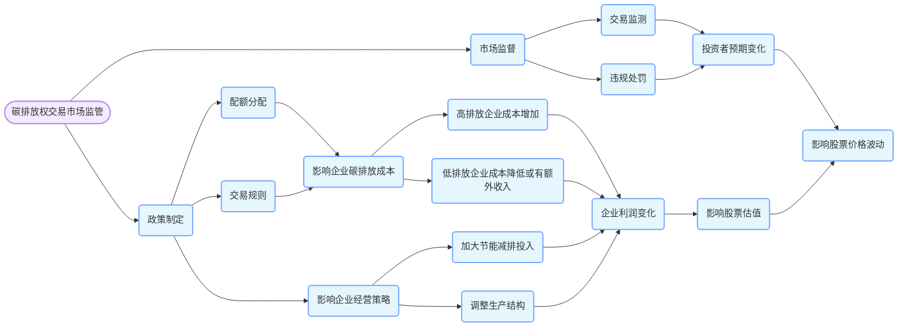

# 全球股市估值与碳排放权交易市场监管的关系

> 关键词：全球股市估值、碳排放权交易市场、市场监管、相关性分析、可持续发展

> 摘要：本文深入探讨了全球股市估值与碳排放权交易市场监管之间的关系。在当今注重可持续发展的时代背景下，碳排放权交易市场逐渐成为应对气候变化的重要经济手段，而其监管政策的实施必然会对企业的运营和财务状况产生影响，进而反映到股市估值上。文章首先介绍了研究的背景、目的和范围，接着阐述了相关的核心概念与联系，分析了核心算法原理和操作步骤，引入数学模型进行详细讲解和举例说明。通过项目实战案例，展示了如何从数据层面探究两者之间的关系。同时，列举了实际应用场景，推荐了相关的学习工具、资源和论文著作。最后，总结了未来发展趋势与挑战，并对常见问题进行了解答。

## 1. 背景介绍 
### 1.1 目的和范围
本研究旨在全面剖析全球股市估值与碳排放权交易市场监管之间的内在联系。随着全球对气候变化问题的关注度不断提高，碳排放权交易市场作为一种市场化的减排机制应运而生。而股市作为经济的重要组成部分，企业的经营状况和发展前景会直接影响其在股市中的估值。我们希望通过研究两者的关系，为投资者、政策制定者和企业管理者提供有价值的参考，以便更好地应对环境政策变化带来的影响。研究范围涵盖全球主要的股票市场和碳排放权交易市场，包括欧洲、美国、中国等地区。

### 1.2 预期读者
本文的预期读者包括金融投资者，他们可以借助研究结果优化投资组合，把握市场趋势；政策制定者能够依据研究结论制定更加科学合理的碳排放权交易市场监管政策和金融市场政策；企业管理者可以了解监管政策对企业股价的潜在影响，从而调整企业的战略规划和运营决策；此外，也适合对环境经济、金融市场等领域感兴趣的学者和研究人员阅读。

### 1.3 文档结构概述
本文将按照以下结构展开：首先介绍研究的背景信息，包括目的、预期读者和文档结构概述等；接着阐述核心概念与联系，通过文本示意图和 Mermaid 流程图展示两者之间的关系；然后详细讲解核心算法原理和具体操作步骤，并使用 Python 代码进行说明；引入数学模型和公式进行分析，并举例说明；通过项目实战案例展示如何运用上述理论进行实际研究；列举实际应用场景；推荐相关的工具和资源；总结未来发展趋势与挑战；解答常见问题；最后提供扩展阅读和参考资料。

### 1.4 术语表
#### 1.4.1 核心术语定义
- **全球股市估值**：指对全球范围内上市公司股票价值的评估，通常通过各种估值方法，如市盈率、市净率等，来衡量股票的相对价值。
- **碳排放权交易市场**：是一种基于市场机制的减排工具，允许企业在一定的碳排放配额内进行排放，如果企业的排放量低于配额，可以将剩余的配额出售；反之，则需要购买额外的配额。
- **市场监管**：政府或相关机构为了维护市场秩序、保护投资者利益、促进市场健康发展而采取的一系列监督和管理措施。

#### 1.4.2 相关概念解释
- **碳排放配额**：政府或管理机构分配给企业的一定时期内的碳排放许可量。
- **碳金融**：与碳排放权交易相关的金融活动，包括碳期货、碳期权等金融衍生品的交易。
- **可持续发展**：既满足当代人的需求，又不损害后代人满足其需求的能力的发展模式。

#### 1.4.3 缩略词列表
- **ETS**：Emissions Trading System，碳排放权交易体系
- **PE**：Price-to-Earnings Ratio，市盈率
- **PB**：Price-to-Book Ratio，市净率

## 2. 核心概念与联系 
### 核心概念原理
全球股市估值是基于企业的财务状况、盈利能力、发展前景等因素对其股票价值进行评估的过程。不同的行业和企业，其估值方法和影响因素也有所不同。而碳排放权交易市场监管则是为了确保碳排放权交易市场的公平、公正、有序运行，通过制定规则、设定配额、监督交易等方式来实现减排目标。

碳排放权交易市场监管政策的实施会对企业的运营成本产生影响。如果企业的碳排放超过配额，就需要购买额外的配额，这将增加企业的成本；反之，如果企业通过节能减排措施降低了碳排放，就可以出售多余的配额，获得额外的收入。这种成本和收入的变化会直接影响企业的利润，进而影响其在股市中的估值。

### 架构的文本示意图
```plaintext
碳排放权交易市场监管
|
|-- 政策制定（配额分配、交易规则等）
|   |
|   |-- 影响企业碳排放成本
|   |   |
|   |   |-- 高排放企业成本增加
|   |   |-- 低排放企业成本降低或有额外收入
|   |
|   |-- 影响企业经营策略
|   |   |
|   |   |-- 加大节能减排投入
|   |   |-- 调整生产结构
|
|-- 市场监督（交易监测、违规处罚等）
|
|-- 与股市估值的关联
    |
    |-- 企业利润变化
    |   |
    |   |-- 影响股票估值（市盈率、市净率等）
    |
    |-- 投资者预期变化
        |
        |-- 影响股票价格波动
```

### Mermaid 流程图


## 3. 核心算法原理 & 具体操作步骤 
### 核心算法原理
为了探究全球股市估值与碳排放权交易市场监管之间的关系，我们可以采用多元线性回归分析的方法。多元线性回归是一种用于分析多个自变量与一个因变量之间线性关系的统计方法。在本研究中，我们将全球股市估值作为因变量，碳排放权交易市场监管的相关指标（如配额分配、交易价格等）以及其他可能影响股市估值的因素（如宏观经济指标、行业发展状况等）作为自变量。

多元线性回归的数学模型可以表示为：

$$Y = \beta_0 + \beta_1X_1 + \beta_2X_2 + \cdots + \beta_nX_n + \epsilon$$

其中，$Y$ 表示因变量（全球股市估值），$X_1, X_2, \cdots, X_n$ 表示自变量（碳排放权交易市场监管指标和其他影响因素），$\beta_0, \beta_1, \beta_2, \cdots, \beta_n$ 是回归系数，$\epsilon$ 是误差项。

### 具体操作步骤
#### 步骤 1：数据收集
收集全球股市估值数据，如主要股票指数的市盈率、市净率等；碳排放权交易市场监管的相关数据，如配额分配数量、交易价格、违规处罚次数等；以及其他可能影响股市估值的宏观经济数据，如 GDP 增长率、通货膨胀率等。

#### 步骤 2：数据预处理
对收集到的数据进行清洗，去除缺失值和异常值；对数据进行标准化处理，使不同变量的数据具有可比性。

#### 步骤 3：模型建立
使用 Python 的 `statsmodels` 库建立多元线性回归模型，并将数据分为训练集和测试集。

#### 步骤 4：模型训练
使用训练集数据对模型进行训练，估计回归系数。

#### 步骤 5：模型评估
使用测试集数据对模型进行评估，计算模型的拟合优度、均方误差等指标，评估模型的性能。

#### 步骤 6：结果分析
分析回归系数的显著性和正负性，判断碳排放权交易市场监管指标对全球股市估值的影响方向和程度。

### Python 代码实现
```python
import pandas as pd
import numpy as np
from sklearn.model_selection import train_test_split
import statsmodels.api as sm

# 步骤 1：数据收集
# 假设我们已经收集到了相关数据，并保存为 CSV 文件
data = pd.read_csv('stock_and_emissions_data.csv')

# 步骤 2：数据预处理
# 去除缺失值
data = data.dropna()

# 分离自变量和因变量
X = data.drop('stock_valuation', axis=1)
y = data['stock_valuation']

# 数据标准化
X = (X - X.mean()) / X.std()

# 步骤 3：模型建立
# 添加常数项
X = sm.add_constant(X)

# 划分训练集和测试集
X_train, X_test, y_train, y_test = train_test_split(X, y, test_size=0.2, random_state=42)

# 步骤 4：模型训练
model = sm.OLS(y_train, X_train)
results = model.fit()

# 步骤 5：模型评估
y_pred = results.predict(X_test)
mse = np.mean((y_pred - y_test) ** 2)
r_squared = results.rsquared

print(f"均方误差: {mse}")
print(f"拟合优度: {r_squared}")

# 步骤 6：结果分析
print(results.summary())
```

## 4. 数学模型和公式 & 详细讲解 & 举例说明 
### 数学模型和公式
在上述多元线性回归模型中，我们使用的核心公式是：

$$Y = \beta_0 + \beta_1X_1 + \beta_2X_2 + \cdots + \beta_nX_n + \epsilon$$

其中，$Y$ 是因变量，代表全球股市估值；$X_i$ 是自变量，$i = 1, 2, \cdots, n$，包括碳排放权交易市场监管指标和其他影响因素；$\beta_0$ 是截距项，表示当所有自变量都为 0 时因变量的取值；$\beta_i$ 是回归系数，表示自变量 $X_i$ 每变化一个单位，因变量 $Y$ 的平均变化量；$\epsilon$ 是误差项，反映了模型无法解释的随机因素。

### 详细讲解
回归系数 $\beta_i$ 的估计是多元线性回归的核心任务之一。通常使用最小二乘法来估计回归系数，即找到一组 $\beta_0, \beta_1, \beta_2, \cdots, \beta_n$，使得误差项 $\epsilon$ 的平方和最小。

误差项 $\epsilon$ 满足以下假设：
1. 均值为 0，即 $E(\epsilon) = 0$。
2. 方差为常数，即 $Var(\epsilon) = \sigma^2$。
3. 不同观测值的误差项之间相互独立，即 $Cov(\epsilon_i, \epsilon_j) = 0$，$i \neq j$。

拟合优度 $R^2$ 是衡量模型拟合效果的重要指标，其计算公式为：

$$R^2 = 1 - \frac{\sum_{i=1}^{n}(y_i - \hat{y}_i)^2}{\sum_{i=1}^{n}(y_i - \bar{y})^2}$$

其中，$y_i$ 是实际观测值，$\hat{y}_i$ 是模型预测值，$\bar{y}$ 是因变量的均值。$R^2$ 的取值范围在 0 到 1 之间，越接近 1 表示模型的拟合效果越好。

### 举例说明
假设我们收集到了以下数据：
| 股市估值（$Y$） | 碳排放配额分配（$X_1$） | GDP 增长率（$X_2$） |
| --- | --- | --- |
| 100 | 10 | 2% |
| 110 | 12 | 2.5% |
| 120 | 15 | 3% |
| 130 | 18 | 3.5% |
| 140 | 20 | 4% |

使用上述数据进行多元线性回归分析，得到回归方程：

$$Y = 50 + 2X_1 + 10X_2$$

这意味着，当碳排放配额分配每增加 1 个单位，股市估值平均增加 2 个单位；当 GDP 增长率每增加 1%，股市估值平均增加 10 个单位。

假设某个国家的碳排放配额分配为 25，GDP 增长率为 4.5%，则根据回归方程预测的股市估值为：

$$Y = 50 + 2 \times 25 + 10 \times 4.5 = 145$$

## 5. 项目实战：代码实际案例和详细解释说明 
### 5.1  开发环境搭建
#### 操作系统
可以选择 Windows、Linux 或 macOS 操作系统。建议使用较新的版本，以确保兼容性和稳定性。

#### Python 安装
首先需要安装 Python 环境，建议使用 Python 3.7 及以上版本。可以从 Python 官方网站（https://www.python.org/downloads/）下载并安装。

#### 第三方库安装
使用 `pip` 命令安装所需的第三方库，包括 `pandas`、`numpy`、`scikit-learn` 和 `statsmodels`。

```sh
pip install pandas numpy scikit-learn statsmodels
```

### 5.2  源代码详细实现和代码解读
```python
import pandas as pd
import numpy as np
from sklearn.model_selection import train_test_split
import statsmodels.api as sm

# 步骤 1：数据收集
# 假设我们已经收集到了相关数据，并保存为 CSV 文件
data = pd.read_csv('stock_and_emissions_data.csv')

# 代码解读：使用 pandas 的 read_csv 函数读取 CSV 文件，将数据存储为 DataFrame 对象。

# 步骤 2：数据预处理
# 去除缺失值
data = data.dropna()

# 代码解读：使用 pandas 的 dropna 函数去除包含缺失值的行。

# 分离自变量和因变量
X = data.drop('stock_valuation', axis=1)
y = data['stock_valuation']

# 代码解读：使用 pandas 的 drop 函数将 'stock_valuation' 列从数据中移除，作为自变量 X；将 'stock_valuation' 列作为因变量 y。

# 数据标准化
X = (X - X.mean()) / X.std()

# 代码解读：对自变量 X 进行标准化处理，使不同变量的数据具有可比性。

# 步骤 3：模型建立
# 添加常数项
X = sm.add_constant(X)

# 代码解读：使用 statsmodels 的 add_constant 函数为自变量 X 添加常数项，以便进行回归分析。

# 划分训练集和测试集
X_train, X_test, y_train, y_test = train_test_split(X, y, test_size=0.2, random_state=42)

# 代码解读：使用 scikit-learn 的 train_test_split 函数将数据划分为训练集和测试集，测试集占比为 20%。

# 步骤 4：模型训练
model = sm.OLS(y_train, X_train)
results = model.fit()

# 代码解读：使用 statsmodels 的 OLS 函数建立普通最小二乘回归模型，并使用 fit 方法进行模型训练。

# 步骤 5：模型评估
y_pred = results.predict(X_test)
mse = np.mean((y_pred - y_test) ** 2)
r_squared = results.rsquared

print(f"均方误差: {mse}")
print(f"拟合优度: {r_squared}")

# 代码解读：使用训练好的模型对测试集进行预测，计算预测值与实际值之间的均方误差和拟合优度，并打印结果。

# 步骤 6：结果分析
print(results.summary())

# 代码解读：使用 summary 方法打印回归分析的详细结果，包括回归系数、显著性水平等信息。
```

### 5.3  代码解读与分析
通过上述代码，我们完成了从数据收集到模型评估和结果分析的整个流程。在数据预处理阶段，去除缺失值和进行数据标准化是为了提高模型的稳定性和准确性。在模型建立阶段，添加常数项是为了考虑截距项的影响。划分训练集和测试集是为了评估模型的泛化能力。

均方误差和拟合优度是评估模型性能的重要指标。均方误差越小，说明模型的预测值与实际值之间的误差越小；拟合优度越接近 1，说明模型对数据的拟合效果越好。

通过分析回归结果的详细信息，我们可以了解各个自变量对因变量的影响程度和显著性。如果某个自变量的回归系数显著不为 0，则说明该自变量对因变量有显著影响。

## 6. 实际应用场景 
### 投资者决策
投资者可以利用全球股市估值与碳排放权交易市场监管之间的关系，优化投资组合。例如，如果预测到碳排放权交易市场监管政策将收紧，高排放行业的企业成本可能会增加，股价可能会下跌，投资者可以减少对这些行业股票的投资；相反，可以增加对低排放行业或在节能减排方面表现优秀的企业股票的投资。

### 政策制定
政策制定者可以根据研究结果，制定更加科学合理的碳排放权交易市场监管政策。如果发现严格的监管政策对股市估值有较大的负面影响，可以考虑采取逐步推进的方式，给予企业一定的适应期；或者通过提供补贴、税收优惠等措施，降低企业的减排成本，减轻对股市的冲击。

### 企业战略规划
企业管理者可以了解碳排放权交易市场监管政策对企业股价的潜在影响，从而调整企业的战略规划。例如，加大节能减排技术的研发投入，降低企业的碳排放，以减少因购买碳排放配额而增加的成本；或者调整生产结构，向低排放行业转型，提高企业的市场竞争力。

### 风险管理
金融机构可以利用两者之间的关系进行风险管理。例如，评估碳排放权交易市场监管政策变化对企业信用风险的影响，调整信贷政策；开发与碳排放相关的金融衍生品，帮助企业和投资者对冲风险。

## 7. 工具和资源推荐
### 7.1 学习资源推荐
#### 7.1.1 书籍推荐
- 《金融市场与金融机构》：这本书全面介绍了金融市场的各种组成部分和金融机构的运作机制，对于理解股市估值和金融市场有很大的帮助。
- 《气候变化经济学》：深入探讨了气候变化问题的经济影响和应对策略，包括碳排放权交易市场的原理和实践。
- 《多元统计分析》：详细讲解了多元线性回归等统计方法的原理和应用，是进行数据分析和建模的重要参考书籍。

#### 7.1.2 在线课程
- Coursera 上的“金融市场”课程：由知名教授授课，系统介绍了金融市场的基本概念、理论和实践。
- edX 上的“气候变化经济学与政策”课程：提供了关于气候变化经济分析和政策制定的专业知识。
- 中国大学 MOOC 上的“应用统计学”课程：帮助学习者掌握统计学的基本方法和应用技巧，为数据分析和建模打下基础。

#### 7.1.3 技术博客和网站
- 雪球网：是国内知名的财经社区，提供了丰富的股市分析和投资经验分享。
- 碳交易网：专注于碳排放权交易市场的信息发布和分析，包括政策动态、市场行情等。
- Towards Data Science：是一个专注于数据科学和机器学习的技术博客，提供了很多实用的数据分析和建模教程。

### 7.2 开发工具框架推荐
#### 7.2.1 IDE和编辑器
- PyCharm：是一款专业的 Python 集成开发环境，具有代码编辑、调试、版本控制等功能，适合开发大型 Python 项目。
- Jupyter Notebook：是一个交互式的开发环境，支持 Python、R 等多种编程语言，适合进行数据分析和模型验证。
- Visual Studio Code：是一款轻量级的代码编辑器，支持多种编程语言和插件扩展，具有良好的用户体验。

#### 7.2.2 调试和性能分析工具
- pdb：是 Python 内置的调试工具，可以帮助开发者定位代码中的错误和问题。
- cProfile：是 Python 的性能分析工具，可以分析代码的运行时间和资源消耗情况，帮助优化代码性能。
- TensorBoard：是 TensorFlow 提供的可视化工具，也可以用于其他机器学习框架的模型可视化和性能分析。

#### 7.2.3 相关框架和库
- pandas：是 Python 中用于数据处理和分析的重要库，提供了 DataFrame 等数据结构和丰富的数据操作方法。
- numpy：是 Python 中用于科学计算的基础库，提供了高效的数组操作和数学函数。
- scikit-learn：是 Python 中常用的机器学习库，提供了各种机器学习算法和工具，包括回归分析、分类、聚类等。

### 7.3 相关论文著作推荐
#### 7.3.1 经典论文
- “The Pricing of Options and Corporate Liabilities” by Fischer Black and Myron Scholes：提出了著名的布莱克 - 斯科尔斯期权定价模型，对金融市场的定价理论产生了深远影响。
- “The Economics of Climate Change: The Stern Review” by Nicholas Stern：全面评估了气候变化的经济影响和应对策略，为全球气候变化政策的制定提供了重要参考。
- “A Contribution to the Theory of Economic Growth” by Robert M. Solow：提出了索洛增长模型，为经济增长理论的发展奠定了基础。

#### 7.3.2 最新研究成果
- 可以关注《Journal of Financial Economics》、《The Review of Financial Studies》、《Energy Economics》等学术期刊，了解全球股市估值和碳排放权交易市场监管领域的最新研究成果。

#### 7.3.3 应用案例分析
- 国际金融公司（IFC）发布的关于碳排放权交易市场的案例研究报告，介绍了不同国家和地区的碳排放权交易市场实践和经验教训。
- 一些大型金融机构发布的关于可持续投资的研究报告，分析了碳排放权交易市场监管对投资决策的影响。

## 8. 总结：未来发展趋势与挑战
### 未来发展趋势
- **监管政策不断完善**：随着全球对气候变化问题的关注度不断提高，碳排放权交易市场的监管政策将不断完善和加强。政府将加大对碳排放的控制力度，提高配额分配的科学性和合理性，加强对市场交易的监管，以确保减排目标的实现。
- **碳金融市场快速发展**：碳金融作为碳排放权交易市场的重要组成部分，将得到快速发展。碳期货、碳期权等金融衍生品将不断涌现，为企业和投资者提供更多的风险管理工具和投资机会。
- **股市估值与碳排放的关联更加紧密**：企业的碳排放情况将越来越受到投资者的关注，碳排放权交易市场监管政策的变化将对股市估值产生更加显著的影响。低排放、高环保的企业将在股市中获得更高的估值，而高排放企业将面临更大的市场压力。
- **国际合作加强**：气候变化是全球性问题，需要各国共同合作应对。未来，国际间的碳排放权交易市场合作将不断加强，形成更加统一的全球碳市场，促进全球减排目标的实现。

### 挑战
- **数据质量和可得性**：准确分析全球股市估值与碳排放权交易市场监管之间的关系需要大量高质量的数据。然而，目前碳排放权交易市场的数据质量和可得性存在一定问题，数据的准确性和完整性有待提高。
- **模型的复杂性和不确定性**：多元线性回归等分析方法虽然可以初步探究两者之间的关系，但实际情况可能更加复杂。存在许多难以量化的因素，如政策的不确定性、企业的创新能力等，这些因素会增加模型的不确定性，影响分析结果的准确性。
- **政策协调难度大**：碳排放权交易市场监管政策涉及多个部门和领域，政策的制定和实施需要各部门之间的协调配合。不同国家和地区的政策差异也会增加国际合作的难度，需要建立更加有效的政策协调机制。
- **企业转型压力大**：严格的碳排放权交易市场监管政策将迫使企业进行节能减排和产业转型。然而，企业在转型过程中面临技术研发、资金投入等诸多困难，转型压力较大。

## 9. 附录：常见问题与解答
### 问题 1：碳排放权交易市场监管政策对所有行业的股市估值影响都一样吗？
答：不一样。不同行业的碳排放强度不同，受到监管政策的影响程度也不同。高排放行业，如钢铁、电力、化工等，受到的影响较大，因为它们需要购买更多的碳排放配额，成本增加较为明显，可能导致股价下跌；而低排放行业，如信息技术、金融等，受到的影响相对较小，甚至可能因为环保优势而获得更高的估值。

### 问题 2：如何判断碳排放权交易市场监管政策的变化趋势？
答：可以关注政府发布的相关政策文件、规划和公告，了解政策的制定和调整方向；关注国际组织和行业协会的研究报告和建议，了解全球碳排放权交易市场的发展趋势；还可以关注碳排放权交易市场的价格波动和交易量变化，这些指标可以反映市场对政策变化的预期。

### 问题 3：企业如何应对碳排放权交易市场监管政策的变化？
答：企业可以采取以下措施应对：加大节能减排技术的研发投入，降低企业的碳排放；优化生产流程，提高能源利用效率；调整生产结构，向低排放行业转型；积极参与碳排放权交易市场，合理管理碳排放配额，降低成本；加强与政府和监管部门的沟通，及时了解政策动态，争取政策支持。

### 问题 4：多元线性回归模型的结果一定准确吗？
答：不一定。多元线性回归模型是一种基于统计假设的分析方法，其结果受到数据质量、模型假设的合理性等多种因素的影响。在实际应用中，需要对模型的结果进行合理的评估和解释，结合实际情况进行分析。同时，可以采用多种分析方法进行验证，提高分析结果的准确性和可靠性。

## 10. 扩展阅读 & 参考资料
### 扩展阅读
- 《可持续金融发展报告》：深入探讨了可持续金融的发展现状和趋势，包括碳排放权交易市场与金融市场的融合。
- 《碳足迹管理与实践》：介绍了企业如何进行碳足迹的计算和管理，以及如何应对碳排放权交易市场的挑战。
- 《气候变化与金融稳定》：分析了气候变化对金融稳定的影响，以及金融机构如何应对气候变化风险。

### 参考资料
- 联合国气候变化框架公约（UNFCCC）官方网站：提供了关于全球气候变化政策和行动的最新信息。
- 国际能源署（IEA）发布的《世界能源展望》报告：对全球能源市场和碳排放情况进行了详细分析和预测。
- 各国证券交易所和碳排放权交易市场的官方网站：提供了相关的市场数据和政策信息。

作者：AI天才研究院/AI Genius Institute & 禅与计算机程序设计艺术 /Zen And The Art of Computer Programming