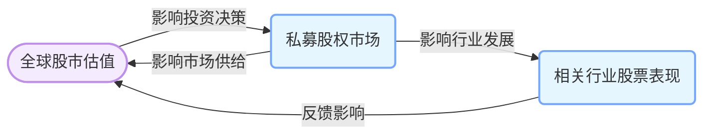

# 全球股市估值与私募股权市场的关系

> 关键词：全球股市估值、私募股权市场、市场联动、投资策略、风险评估、资本流动、市场趋势

> 摘要：本文旨在深入探讨全球股市估值与私募股权市场之间的关系。通过对两者核心概念与联系的剖析、相关算法原理和数学模型的阐述，结合实际项目案例，分析其在不同应用场景中的表现。同时，提供了学习相关知识的工具和资源推荐，总结未来发展趋势与挑战，以期为投资者、市场研究者等提供全面且深入的参考，帮助他们更好地理解这两个市场的内在联系，优化投资决策，降低风险。

## 1. 背景介绍 
### 1.1 目的和范围
全球股市和私募股权市场是金融领域的重要组成部分，它们的发展状况对全球经济有着深远的影响。本研究的目的在于系统地分析全球股市估值与私募股权市场之间的关系，包括它们之间的相互影响机制、联动效应以及在不同经济环境下的表现。研究范围涵盖全球主要的股票市场和私募股权市场，涉及不同国家和地区的市场数据和案例分析。

### 1.2 预期读者
本文预期读者包括金融投资者、市场分析师、学术研究人员、金融从业者以及对金融市场感兴趣的人士。对于投资者来说，了解两者关系有助于优化投资组合，降低风险，提高收益；对于市场分析师和学术研究人员，本文提供了深入研究的理论和实证依据；对于金融从业者，有助于更好地理解市场动态，制定合理的业务策略。

### 1.3 文档结构概述
本文首先介绍了相关的背景知识，包括目的、预期读者和文档结构。接着阐述了全球股市估值与私募股权市场的核心概念与联系，通过文本示意图和 Mermaid 流程图进行直观展示。然后详细讲解了核心算法原理和具体操作步骤，并用 Python 源代码进行说明。之后介绍了相关的数学模型和公式，并举例说明。通过项目实战部分，给出代码实际案例并进行详细解释。随后分析了实际应用场景，推荐了相关的工具和资源。最后总结了未来发展趋势与挑战，提供了常见问题与解答以及扩展阅读和参考资料。

### 1.4 术语表
#### 1.4.1 核心术语定义
- **全球股市估值**：是指对全球范围内各个股票市场上的股票价值进行评估的过程和结果。通常通过各种估值指标，如市盈率（P/E）、市净率（P/B）等，来衡量股票的相对价值。
- **私募股权市场**：是指通过非公开方式募集资金，对非上市企业进行权益性投资，在交易实施过程中附带考虑了将来的退出机制，即通过上市、并购或管理层回购等方式，出售持股获利的市场。

#### 1.4.2 相关概念解释
- **市盈率（P/E）**：是指股票价格除以每股收益（EPS）的比率，反映了投资者为获取公司每一元盈利所愿意支付的价格。
- **市净率（P/B）**：是指每股股价与每股净资产的比率，用于评估股票相对于其账面价值的估值水平。
- **私募股权投资基金**：是私募股权市场的主要参与者，通过募集资金，投资于具有高增长潜力的非上市企业，以获取资本增值收益。

#### 1.4.3 缩略词列表
- **P/E**：市盈率（Price-to-Earnings Ratio）
- **P/B**：市净率（Price-to-Book Ratio）
- **VC**：风险投资（Venture Capital）
- **PE**：私募股权投资（Private Equity）

## 2. 核心概念与联系 

### 核心概念原理
全球股市估值是基于股票的基本面信息和市场预期，通过各种估值模型和指标来评估股票的价值。常见的估值模型包括现金流折现模型（DCF）、相对估值模型等。现金流折现模型是通过预测公司未来的现金流，并将其折现到当前时刻来计算股票的内在价值；相对估值模型则是通过与同行业或类似公司的估值指标进行比较，来评估股票的相对价值。

私募股权市场则是专注于非上市企业的投资。私募股权投资机构通过对企业的尽职调查，评估企业的发展潜力、管理团队、市场前景等因素，选择具有投资价值的企业进行投资。私募股权投资的退出方式主要包括上市、并购、管理层回购等，通过这些方式实现投资的增值和退出。

### 架构的文本示意图
全球股市估值与私募股权市场之间存在着复杂的关系。全球股市的估值水平会影响私募股权市场的投资决策和退出策略。当股市估值较高时，私募股权机构可能会选择通过上市的方式退出投资，以获取更高的收益；当股市估值较低时，私募股权机构可能会更加谨慎地进行投资，或者选择其他退出方式。

同时，私募股权市场的发展也会对全球股市产生影响。私募股权投资的企业在上市后，会增加股市的供给，影响股市的估值水平。此外，私募股权市场的投资活动也会影响相关行业的发展，进而影响股市中相关行业的表现。

### Mermaid 流程图


## 3. 核心算法原理 & 具体操作步骤 

### 算法原理讲解
在分析全球股市估值与私募股权市场的关系时，可以使用回归分析算法。回归分析是一种统计方法，用于研究一个或多个自变量与因变量之间的关系。在本研究中，可以将全球股市估值指标（如市盈率、市净率等）作为自变量，私募股权市场的投资回报率、投资规模等作为因变量，建立回归模型，分析两者之间的数量关系。

### Python 源代码阐述
```python
import pandas as pd
import numpy as np
from sklearn.linear_model import LinearRegression
import matplotlib.pyplot as plt

# 模拟数据
# 假设我们有全球股市的市盈率数据和私募股权市场的投资回报率数据
np.random.seed(0)
stock_pe = np.random.rand(100) * 20  # 市盈率数据
private_equity_return = 0.5 * stock_pe + np.random.randn(100) * 2  # 投资回报率数据

# 创建 DataFrame
data = pd.DataFrame({'Stock_PE': stock_pe, 'Private_Equity_Return': private_equity_return})

# 划分自变量和因变量
X = data[['Stock_PE']]
y = data['Private_Equity_Return']

# 创建线性回归模型
model = LinearRegression()

# 拟合模型
model.fit(X, y)

# 预测
y_pred = model.predict(X)

# 输出回归系数和截距
print('回归系数:', model.coef_[0])
print('截距:', model.intercept_)

# 绘制散点图和回归直线
plt.scatter(X, y, color='blue', label='实际数据')
plt.plot(X, y_pred, color='red', linewidth=2, label='回归直线')
plt.xlabel('全球股市市盈率')
plt.ylabel('私募股权市场投资回报率')
plt.title('全球股市估值与私募股权市场投资回报率的关系')
plt.legend()
plt.show()
```

### 具体操作步骤
1. **数据收集**：收集全球股市的估值数据（如市盈率、市净率等）和私募股权市场的相关数据（如投资回报率、投资规模等）。
2. **数据预处理**：对收集到的数据进行清洗、整理和标准化处理，以确保数据的质量和一致性。
3. **模型建立**：根据研究目的，选择合适的回归模型（如线性回归、多项式回归等），并将自变量和因变量输入模型进行拟合。
4. **模型评估**：使用评估指标（如均方误差、决定系数等）对模型的拟合效果进行评估，判断模型的有效性。
5. **结果分析**：分析回归系数和截距的含义，解释全球股市估值与私募股权市场之间的数量关系。

## 4. 数学模型和公式 & 详细讲解 & 举例说明 

### 数学模型
线性回归模型是一种常用的回归模型，其数学表达式为：
$$y = \beta_0 + \beta_1x_1 + \beta_2x_2 + \cdots + \beta_nx_n + \epsilon$$
其中，$y$ 是因变量，$x_1, x_2, \cdots, x_n$ 是自变量，$\beta_0, \beta_1, \beta_2, \cdots, \beta_n$ 是回归系数，$\epsilon$ 是误差项。

在分析全球股市估值与私募股权市场的关系时，假设我们只考虑全球股市的市盈率（$x$）作为自变量，私募股权市场的投资回报率（$y$）作为因变量，则线性回归模型可以简化为：
$$y = \beta_0 + \beta_1x + \epsilon$$

### 详细讲解
- **回归系数 $\beta_1$**：表示自变量 $x$ 每变化一个单位，因变量 $y$ 的平均变化量。在本研究中，$\beta_1$ 表示全球股市市盈率每变化一个单位，私募股权市场投资回报率的平均变化量。
- **截距 $\beta_0$**：表示当自变量 $x$ 为 0 时，因变量 $y$ 的取值。在实际应用中，截距的含义需要根据具体情况进行解释。
- **误差项 $\epsilon$**：表示模型无法解释的随机误差，反映了实际观测值与模型预测值之间的差异。

### 举例说明
假设通过回归分析得到的回归系数 $\beta_1 = 0.5$，截距 $\beta_0 = 2$，则回归方程为：
$$y = 2 + 0.5x + \epsilon$$
这意味着当全球股市市盈率增加 1 个单位时，私募股权市场投资回报率平均增加 0.5 个单位。当全球股市市盈率为 0 时，私募股权市场投资回报率的预测值为 2（不考虑误差项）。

## 5. 项目实战：代码实际案例和详细解释说明 

### 5.1  开发环境搭建
- **操作系统**：可以选择 Windows、Linux 或 macOS 等常见的操作系统。
- **Python 环境**：安装 Python 3.x 版本，可以从 Python 官方网站（https://www.python.org/downloads/） 下载安装。
- **开发工具**：推荐使用 Jupyter Notebook 或 PyCharm 等开发工具。Jupyter Notebook 可以方便地进行代码的编写、运行和可视化展示；PyCharm 是一款功能强大的 Python 集成开发环境，提供了丰富的代码编辑、调试和项目管理功能。
- **相关库安装**：使用以下命令安装所需的 Python 库：
```sh
pip install pandas numpy scikit-learn matplotlib
```

### 5.2  源代码详细实现和代码解读
```python
import pandas as pd
import numpy as np
from sklearn.linear_model import LinearRegression
import matplotlib.pyplot as plt

# 读取实际数据
# 假设我们从 CSV 文件中读取全球股市市盈率和私募股权市场投资回报率数据
data = pd.read_csv('stock_pe_and_private_equity_return.csv')

# 划分自变量和因变量
X = data[['Stock_PE']]
y = data['Private_Equity_Return']

# 创建线性回归模型
model = LinearRegression()

# 拟合模型
model.fit(X, y)

# 预测
y_pred = model.predict(X)

# 输出回归系数和截距
print('回归系数:', model.coef_[0])
print('截距:', model.intercept_)

# 计算评估指标
from sklearn.metrics import mean_squared_error, r2_score
mse = mean_squared_error(y, y_pred)
r2 = r2_score(y, y_pred)
print('均方误差:', mse)
print('决定系数:', r2)

# 绘制散点图和回归直线
plt.scatter(X, y, color='blue', label='实际数据')
plt.plot(X, y_pred, color='red', linewidth=2, label='回归直线')
plt.xlabel('全球股市市盈率')
plt.ylabel('私募股权市场投资回报率')
plt.title('全球股市估值与私募股权市场投资回报率的关系')
plt.legend()
plt.show()
```
### 代码解读
1. **数据读取**：使用 `pandas` 库的 `read_csv` 函数从 CSV 文件中读取全球股市市盈率和私募股权市场投资回报率数据。
2. **自变量和因变量划分**：将全球股市市盈率数据作为自变量 $X$，私募股权市场投资回报率数据作为因变量 $y$。
3. **模型创建和拟合**：使用 `sklearn` 库的 `LinearRegression` 类创建线性回归模型，并使用 `fit` 方法对模型进行拟合。
4. **预测**：使用拟合好的模型对自变量进行预测，得到因变量的预测值 $y_pred$。
5. **评估指标计算**：使用 `sklearn` 库的 `mean_squared_error` 和 `r2_score` 函数计算均方误差和决定系数，评估模型的拟合效果。
6. **可视化展示**：使用 `matplotlib` 库绘制散点图和回归直线，直观展示全球股市估值与私募股权市场投资回报率的关系。

### 5.3  代码解读与分析
- **均方误差（MSE）**：衡量了模型预测值与实际观测值之间的平均误差平方。均方误差越小，说明模型的预测效果越好。
- **决定系数（$R^2$）**：表示模型对数据的拟合程度，取值范围在 0 到 1 之间。$R^2$ 越接近 1，说明模型对数据的拟合效果越好。

通过对代码的分析，我们可以了解全球股市估值与私募股权市场投资回报率之间的数量关系，以及模型的拟合效果。如果均方误差较大，决定系数较小，可能需要考虑使用其他模型或对数据进行进一步的处理。

## 6. 实际应用场景 
### 投资决策
投资者可以根据全球股市估值与私募股权市场的关系，优化投资组合。当全球股市估值较高时，投资者可以适当减少股票投资，增加私募股权投资；当全球股市估值较低时，投资者可以增加股票投资，减少私募股权投资。

### 风险评估
金融机构和投资者可以通过分析全球股市估值与私募股权市场的关系，评估投资风险。如果两者之间的相关性较强，当股市出现大幅波动时，私募股权市场也可能受到影响，投资者需要采取相应的风险控制措施。

### 市场趋势分析
市场分析师可以通过研究全球股市估值与私募股权市场的关系，预测市场趋势。例如，如果全球股市估值持续上升，可能会吸引更多的私募股权机构通过上市的方式退出投资，从而增加股市的供给，对股市估值产生压力。

### 企业融资决策
企业在进行融资决策时，可以考虑全球股市估值与私募股权市场的情况。当股市估值较高时，企业可以选择通过上市的方式融资；当股市估值较低时，企业可以考虑引入私募股权投资。

## 7. 工具和资源推荐
### 7.1 学习资源推荐
#### 7.1.1 书籍推荐
- 《金融市场与金融机构基础》：这本书全面介绍了金融市场和金融机构的基本概念、原理和运作机制，对于理解全球股市和私募股权市场有很大的帮助。
- 《投资学》：详细阐述了投资的基本理论、方法和策略，包括股票投资、私募股权投资等内容，是投资领域的经典教材。
- 《私募股权投资与创业融资》：专注于私募股权市场的研究，涵盖了私募股权投资的各个环节，如项目筛选、尽职调查、投资估值、退出策略等。

#### 7.1.2 在线课程
- Coursera 上的“Financial Markets”：由耶鲁大学教授 Robert Shiller 授课，讲解了金融市场的基本原理和最新发展。
- edX 上的“Investment Management”：提供了投资管理的全面知识，包括资产配置、股票估值、私募股权投资等内容。
- 中国大学 MOOC 上的“金融市场学”：国内高校的优秀课程，系统介绍了金融市场的相关知识。

#### 7.1.3 技术博客和网站
- Seeking Alpha：提供全球股市和私募股权市场的分析和评论，是投资者获取市场信息的重要来源。
- Bloomberg：全球知名的金融资讯平台，提供实时的金融市场数据、新闻和分析。
- 清科研究中心：专注于私募股权市场的研究，发布私募股权市场的行业报告和数据。

### 7.2 开发工具框架推荐
#### 7.2.1 IDE和编辑器
- Jupyter Notebook：交互式的开发环境，适合进行数据探索、分析和可视化。
- PyCharm：功能强大的 Python 集成开发环境，提供丰富的代码编辑、调试和项目管理功能。
- Visual Studio Code：轻量级的代码编辑器，支持多种编程语言和插件扩展。

#### 7.2.2 调试和性能分析工具
- IPython：增强的 Python 交互式解释器，提供了丰富的调试和分析功能。
- cProfile：Python 内置的性能分析工具，可以帮助开发者找出代码中的性能瓶颈。
- Py-Spy：用于分析 Python 程序性能的工具，提供可视化的性能分析报告。

#### 7.2.3 相关框架和库
- Pandas：用于数据处理和分析的 Python 库，提供了高效的数据结构和数据操作方法。
- NumPy：Python 的数值