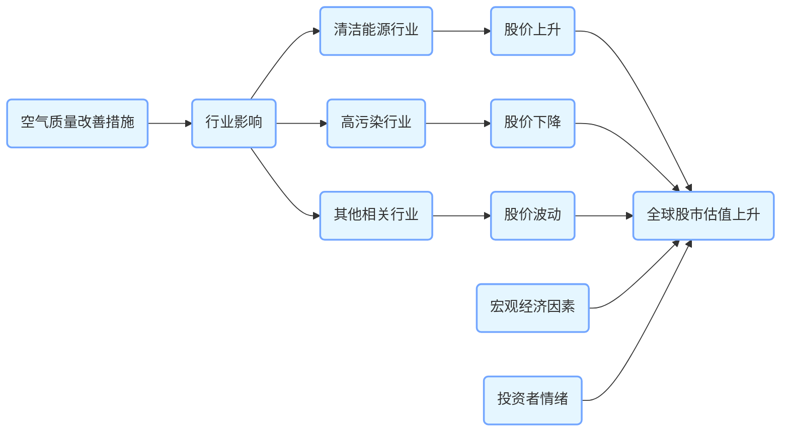

# 全球股市估值与空气质量改善措施的关系

> 关键词：全球股市估值、空气质量改善措施、经济影响、环境政策、相关性分析

> 摘要：本文旨在深入探讨全球股市估值与空气质量改善措施之间的关系。通过对相关核心概念的阐述、算法原理的分析、数学模型的构建，结合实际案例和应用场景的研究，揭示两者之间的内在联系和相互影响。同时，提供学习资源、开发工具等方面的推荐，为读者全面了解这一复杂关系提供系统的知识体系，并对未来发展趋势和挑战进行展望。

## 1. 背景介绍 
### 1.1 目的和范围
本研究的目的是探究全球股市估值与空气质量改善措施之间的关联机制。随着全球对环境保护的重视程度不断提高，各国纷纷出台空气质量改善措施，这些措施不仅对环境产生影响，也会对经济领域，特别是股市估值带来一系列变化。我们将研究范围界定为全球主要股票市场，涵盖不同国家和地区的股市表现，以及各类空气质量改善措施，包括政策法规、技术创新等方面。

### 1.2 预期读者
本文预期读者包括金融领域的投资者、分析师，环境政策制定者，科研人员以及对环境与经济关系感兴趣的广大爱好者。对于投资者和分析师来说，了解两者关系有助于他们在投资决策中考虑环境因素；政策制定者可以根据研究结果优化空气质量改善措施，以实现经济与环境的协调发展；科研人员能够在此基础上进行更深入的学术研究；而爱好者则可以通过本文拓宽对环境与经济相互作用的认知。

### 1.3 文档结构概述
本文首先介绍背景信息，让读者了解研究的目的、范围、预期读者和文档结构。接着阐述核心概念与联系，通过文本示意图和 Mermaid 流程图展示相关原理和架构。然后详细讲解核心算法原理及具体操作步骤，结合 Python 源代码进行说明。之后构建数学模型和公式，并举例说明。再通过项目实战，介绍开发环境搭建、源代码实现和代码解读。随后探讨实际应用场景，推荐相关工具和资源。最后总结未来发展趋势与挑战，解答常见问题，并提供扩展阅读和参考资料。

### 1.4 术语表
#### 1.4.1 核心术语定义
- **全球股市估值**：指对全球范围内各个股票市场中上市公司的价值进行评估，通常通过股票价格、市盈率、市净率等指标来衡量。
- **空气质量改善措施**：为了减少空气污染、改善空气质量而采取的一系列行动，包括制定和执行环境政策、推广清洁能源、加强环境监管等。
- **相关性分析**：用于研究两个或多个变量之间的关联程度和方向的统计方法。

#### 1.4.2 相关概念解释
- **环境政策**：政府为了保护环境而制定的一系列法律法规和政策措施，旨在引导企业和社会减少污染物排放，推动可持续发展。
- **清洁能源**：指不排放污染物、能够直接用于生产生活的能源，如太阳能、风能、水能等。
- **环境监管**：政府或相关机构对企业和社会的环境行为进行监督和管理，确保其遵守环境法律法规和标准。

#### 1.4.3 缩略词列表
- **GDP**：国内生产总值（Gross Domestic Product）
- **PM2.5**：细颗粒物（Particulate Matter 2.5）
- **CO2**：二氧化碳（Carbon Dioxide）

## 2. 核心概念与联系 
### 核心概念原理
全球股市估值反映了市场对上市公司未来盈利能力和发展前景的预期。空气质量改善措施的实施会对多个行业产生影响，进而影响相关上市公司的业绩和估值。例如，清洁能源行业会因空气质量改善措施的推动而获得更多发展机会，其相关企业的股票估值可能上升；而高污染行业可能面临更严格的监管和成本压力，股票估值可能受到负面影响。

### 架构的文本示意图
```plaintext
全球股市估值
    |
    |-- 行业板块估值
    |       |-- 清洁能源行业估值
    |       |-- 高污染行业估值
    |       |-- 其他相关行业估值
    |
    |-- 宏观经济因素影响
    |
    |-- 投资者情绪影响
    |
    |-- 空气质量改善措施影响
            |-- 政策法规影响
            |-- 技术创新影响
            |-- 市场需求变化影响
```

### Mermaid 流程图


## 3. 核心算法原理 & 具体操作步骤 
### 核心算法原理
我们可以使用线性回归算法来分析全球股市估值与空气质量改善措施之间的关系。线性回归是一种用于建立自变量和因变量之间线性关系的统计方法。假设全球股市估值为因变量 $Y$，空气质量改善措施的相关指标（如政策强度、清洁能源投资等）为自变量 $X$，则线性回归模型可以表示为：

$Y = \beta_0 + \beta_1X_1 + \beta_2X_2 + \cdots + \beta_nX_n + \epsilon$

其中，$\beta_0$ 是截距，$\beta_1, \beta_2, \cdots, \beta_n$ 是回归系数，$\epsilon$ 是误差项。

### 具体操作步骤
1. **数据收集**：收集全球股市估值数据和空气质量改善措施的相关数据，如股票价格、市盈率、政策文件、清洁能源投资金额等。
2. **数据预处理**：对收集到的数据进行清洗、缺失值处理和标准化处理，以确保数据的质量和一致性。
3. **特征选择**：从空气质量改善措施的相关数据中选择与全球股市估值可能相关的特征，如政策强度指标、清洁能源占比等。
4. **模型训练**：使用训练数据集对线性回归模型进行训练，估计回归系数。
5. **模型评估**：使用测试数据集对训练好的模型进行评估，计算模型的拟合优度、均方误差等指标。
6. **结果分析**：根据模型的评估结果，分析全球股市估值与空气质量改善措施之间的关系，解释回归系数的含义。

### Python 源代码实现
```python
import pandas as pd
import numpy as np
from sklearn.linear_model import LinearRegression
from sklearn.model_selection import train_test_split
from sklearn.metrics import mean_squared_error, r2_score

# 读取数据
data = pd.read_csv('stock_air_quality.csv')

# 分离自变量和因变量
X = data.drop('stock_valuation', axis=1)
y = data['stock_valuation']

# 划分训练集和测试集
X_train, X_test, y_train, y_test = train_test_split(X, y, test_size=0.2, random_state=42)

# 创建线性回归模型
model = LinearRegression()

# 训练模型
model.fit(X_train, y_train)

# 预测
y_pred = model.predict(X_test)

# 评估模型
mse = mean_squared_error(y_test, y_pred)
r2 = r2_score(y_test, y_pred)

print(f"均方误差: {mse}")
print(f"拟合优度: {r2}")

# 输出回归系数
print("回归系数:", model.coef_)
print("截距:", model.intercept_)
```

## 4. 数学模型和公式 & 详细讲解 & 举例说明 
### 数学模型
我们在前面已经介绍了线性回归模型：

$Y = \beta_0 + \beta_1X_1 + \beta_2X_2 + \cdots + \beta_nX_n + \epsilon$

### 公式详细讲解
- **$\beta_0$**：截距，表示当所有自变量都为 0 时，因变量 $Y$ 的取值。在我们的问题中，它可以理解为在没有空气质量改善措施影响的情况下，全球股市的基本估值水平。
- **$\beta_i$（$i = 1, 2, \cdots, n$）**：回归系数，表示自变量 $X_i$ 每变化一个单位，因变量 $Y$ 的平均变化量。例如，如果 $\beta_1$ 是正的，说明自变量 $X_1$ 增加时，全球股市估值也会增加；反之，如果 $\beta_1$ 是负的，说明自变量 $X_1$ 增加时，全球股市估值会减少。
- **$\epsilon$**：误差项，表示模型无法解释的随机误差。它反映了除自变量以外的其他因素对因变量的影响。

### 举例说明
假设我们收集了某国的股市估值数据和空气质量改善措施中的清洁能源投资数据。经过数据处理和模型训练，得到线性回归模型：

$Y = 100 + 0.5X + \epsilon$

其中，$Y$ 是股市估值，$X$ 是清洁能源投资金额（单位：亿元）。这意味着当清洁能源投资为 0 时，股市的基本估值为 100；每增加 1 亿元的清洁能源投资，股市估值平均增加 0.5。

如果某一年该国的清洁能源投资为 20 亿元，代入模型可得：

$Y = 100 + 0.5 \times 20 = 110$

即根据模型预测，该年的股市估值为 110。当然，实际的股市估值还会受到误差项 $\epsilon$ 的影响。

## 5. 项目实战：代码实际案例和详细解释说明 
### 5.1  开发环境搭建
- **操作系统**：可以选择 Windows、Linux 或 macOS。
- **Python 版本**：建议使用 Python 3.7 及以上版本。
- **开发工具**：可以使用 PyCharm、Jupyter Notebook 等。
- **所需库**：需要安装 pandas、numpy、scikit-learn 等库。可以使用以下命令进行安装：

```bash
pip install pandas numpy scikit-learn
```

### 5.2  源代码详细实现和代码解读
```python
import pandas as pd
import numpy as np
from sklearn.linear_model import LinearRegression
from sklearn.model_selection import train_test_split
from sklearn.metrics import mean_squared_error, r2_score

# 读取数据
data = pd.read_csv('stock_air_quality.csv')

# 代码解读：使用 pandas 库的 read_csv 函数读取存储股市估值和空气质量改善措施数据的 CSV 文件。

# 分离自变量和因变量
X = data.drop('stock_valuation', axis=1)
y = data['stock_valuation']

# 代码解读：将数据集中的 'stock_valuation' 列作为因变量 y，其余列作为自变量 X。

# 划分训练集和测试集
X_train, X_test, y_train, y_test = train_test_split(X, y, test_size=0.2, random_state=42)

# 代码解读：使用 sklearn 库的 train_test_split 函数将数据集划分为训练集和测试集，其中测试集占比为 20%。random_state 参数用于保证每次划分的结果一致。

# 创建线性回归模型
model = LinearRegression()

# 代码解读：创建一个线性回归模型对象。

# 训练模型
model.fit(X_train, y_train)

# 代码解读：使用训练集数据对线性回归模型进行训练，估计回归系数。

# 预测
y_pred = model.predict(X_test)

# 代码解读：使用训练好的模型对测试集数据进行预测，得到预测值 y_pred。

# 评估模型
mse = mean_squared_error(y_test, y_pred)
r2 = r2_score(y_test, y_pred)

# 代码解读：使用 sklearn 库的 mean_squared_error 函数计算均方误差，r2_score 函数计算拟合优度。

print(f"均方误差: {mse}")
print(f"拟合优度: {r2}")

# 输出回归系数
print("回归系数:", model.coef_)
print("截距:", model.intercept_)
```

### 5.3  代码解读与分析
- **数据读取**：使用 pandas 库读取 CSV 文件，将数据加载到内存中，方便后续处理。
- **数据划分**：将数据集划分为训练集和测试集，是为了评估模型的泛化能力。训练集用于训练模型，测试集用于验证模型在未见过的数据上的表现。
- **模型训练**：通过调用线性回归模型的 fit 方法，使用训练集数据估计回归系数。
- **模型预测**：使用训练好的模型对测试集数据进行预测，得到预测值。
- **模型评估**：均方误差衡量了预测值与真实值之间的平均误差，拟合优度表示模型对数据的拟合程度，取值范围在 0 到 1 之间，越接近 1 表示拟合效果越好。
- **回归系数和截距**：回归系数反映了自变量对因变量的影响程度，截距表示当所有自变量都为 0 时，因变量的取值。

## 6. 实际应用场景 
### 投资决策
投资者可以根据空气质量改善措施的实施情况，调整投资组合。例如，当政府加大对清洁能源的支持力度时，投资者可以增加对清洁能源相关企业股票的投资；而对于高污染行业的股票，可以适当减少持仓。

### 政策制定
政策制定者可以通过研究全球股市估值与空气质量改善措施之间的关系，评估政策的经济影响。如果发现某项空气质量改善政策对股市估值有积极影响，可以进一步加大政策实施力度；反之，如果政策对股市估值产生较大负面影响，需要重新审视政策的合理性和可行性。

### 企业战略规划
企业可以根据空气质量改善措施的趋势，制定相应的战略规划。高污染企业可以加大环保投入，进行产业升级，以适应环境政策的要求，避免股票估值下降；清洁能源企业则可以抓住机遇，扩大生产规模，提高市场份额。

### 风险管理
金融机构可以将空气质量改善措施纳入风险管理体系。例如，对高污染行业的贷款进行更严格的风险评估，降低潜在的信用风险；同时，开发与环境相关的金融产品，如绿色债券等，满足投资者对环境友好型投资的需求。

## 7. 工具和资源推荐
### 7.1 学习资源推荐
#### 7.1.1 书籍推荐
- 《计量经济学导论》：介绍了计量经济学的基本原理和方法，对于理解和应用线性回归等统计模型有很大帮助。
- 《金融市场与金融机构》：涵盖了金融市场的基本概念、运行机制和投资策略，有助于读者了解股市估值的相关知识。
- 《环境经济学》：探讨了环境与经济之间的相互关系，为研究空气质量改善措施的经济影响提供理论基础。

#### 7.1.2 在线课程
- Coursera 上的“计量经济学基础”课程：由知名教授授课，系统讲解计量经济学的基本概念和方法。
- edX 上的“金融市场”课程：提供了金融市场的全面介绍，包括股票市场的估值和分析。
- Udemy 上的“环境政策与可持续发展”课程：介绍了环境政策的制定和实施，以及可持续发展的相关理念。

#### 7.1.3 技术博客和网站
- 金融界网站：提供全球股市的实时行情、分析报告和投资策略等信息。
- 环境新闻网：专注于环境领域的新闻报道和政策解读，有助于了解空气质量改善措施的最新动态。
- Medium 上的金融和环境相关博客：有许多专业人士分享的研究成果和实践经验。

### 7.2 开发工具框架推荐
#### 7.2.1 IDE和编辑器
- PyCharm：功能强大的 Python 集成开发环境，提供代码编辑、调试、版本控制等功能。
- Jupyter Notebook：交互式的编程环境，适合数据探索和模型开发，方便代码的展示和分享。
- Visual Studio Code：轻量级的代码编辑器，支持多种编程语言，可通过安装插件扩展功能。

#### 7.2.2 调试和性能分析工具
- IPython：增强的 Python 解释器，提供交互式调试功能，方便代码的调试和测试。
- cProfile：Python 内置的性能分析工具，可以分析代码的运行时间和函数调用情况。
- Py-Spy：用于分析 Python 程序性能的工具，能够实时监控程序的 CPU 使用情况。

#### 7.2.3 相关框架和库
- pandas：用于数据处理和分析的 Python 库，提供了高效的数据结构和数据操作方法。
- numpy：Python 的数值计算库，支持多维数组和矩阵运算，是许多机器学习库的基础。
- scikit-learn：强大的机器学习库，提供了各种机器学习算法和工具，方便进行模型训练和评估。

### 7.3 相关论文著作推荐
#### 7.3.1 经典论文
- “The Impact of Environmental Regulations on Firm Performance: Evidence from the U.S. Manufacturing Sector”：研究了环境法规对美国制造业企业绩效的影响，为分析空气质量改善措施对企业的影响提供了参考。
- “Stock Market Valuation and Macroeconomic Variables: A Cointegration Analysis”：探讨了股市估值与宏观经济变量之间的关系，对理解股市估值的影响因素有重要意义。
- “The Economics of Air Quality Improvement: A Review”：对空气质量改善的经济学研究进行了综述，涵盖了政策评估、成本效益分析等方面。

#### 7.3.2 最新研究成果
- 可以通过学术数据库，如 IEEE Xplore、ACM Digital Library、ScienceDirect 等，搜索关于全球股市估值与空气质量改善措施关系的最新研究论文。这些论文通常会采用新的研究方法和数据，反映该领域的最新进展。

#### 7.3.3 应用案例分析
- 一些国际组织和研究机构会发布关于环境政策和经济发展的应用案例分析报告，如世界银行、国际货币基金组织等。这些报告通过实际案例分析，展示了空气质量改善措施对股市估值和经济增长的影响。

## 8. 总结：未来发展趋势与挑战
### 未来发展趋势
- **绿色金融市场的发展**：随着全球对环境保护的重视，绿色金融市场将不断扩大。更多的投资者将关注环境友好型企业，推动相关股票的估值上升。同时，绿色债券、可持续发展基金等金融产品将更加丰富，为投资者提供更多选择。
- **技术创新的推动**：空气质量改善措施将越来越依赖于技术创新，如清洁能源技术、污染治理技术等。这些技术的发展将带动相关产业的兴起，对股市估值产生积极影响。例如，太阳能、风能等可再生能源技术的不断进步，将提高清洁能源企业的竞争力和盈利能力。
- **国际合作的加强**：空气质量问题是全球性的挑战，需要各国加强合作。国际间的环境政策协调和技术交流将更加频繁，这将对全球股市估值产生深远影响。例如，一些跨国企业将受益于国际合作带来的市场机会和技术优势。

### 挑战
- **数据质量和可得性**：准确分析全球股市估值与空气质量改善措施之间的关系需要大量高质量的数据。然而，目前相关数据的收集和整理存在一定困难，数据的准确性和完整性有待提高。
- **政策不确定性**：空气质量改善政策的制定和实施受到政治、经济等多种因素的影响，存在一定的不确定性。政策的变化可能会导致股市估值的波动，增加投资风险。
- **模型的复杂性**：全球股市估值和空气质量改善措施之间的关系非常复杂，受到多种因素的交互影响。建立准确的数学模型来描述这种关系具有一定的挑战性，需要考虑更多的变量和因素。

## 9. 附录：常见问题与解答
### 问题 1：空气质量改善措施对所有行业的股市估值影响都是相同的吗？
答：不是的。空气质量改善措施对不同行业的影响差异很大。清洁能源行业通常会受益于空气质量改善措施，其股票估值可能上升；而高污染行业可能面临更严格的监管和成本压力，股票估值可能下降。其他行业的影响则取决于其与环境的关联程度和自身的适应能力。

### 问题 2：如何衡量空气质量改善措施的强度？
答：可以从多个方面衡量空气质量改善措施的强度，如政策法规的严格程度、清洁能源投资的规模、环境监管的力度等。可以构建综合指标来量化空气质量改善措施的强度，例如将不同指标进行加权平均。

### 问题 3：线性回归模型是否能够准确描述全球股市估值与空气质量改善措施之间的关系？
答：线性回归模型是一种简单而常用的方法，但全球股市估值与空气质量改善措施之间的关系可能是非线性的，受到多种因素的交互影响。因此，线性回归模型可能只能提供一个初步的分析结果。可以考虑使用更复杂的模型，如非线性回归模型、机器学习模型等，来提高模型的准确性。

### 问题 4：在实际应用中，如何根据研究结果进行投资决策？
答：在实际应用中，不能仅仅依据全球股市估值与空气质量改善措施之间的关系进行投资决策。还需要考虑其他因素，如宏观经济形势、行业发展趋势、企业基本面等。可以将空气质量改善措施作为一个重要的参考因素，结合其他分析方法，制定合理的投资策略。

## 10. 扩展阅读 & 参考资料
### 扩展阅读
- 《可持续金融发展报告》：介绍了全球可持续金融的发展现状和趋势，为读者了解绿色金融市场提供了全面的信息。
- 《环境科技创新前沿》：关注环境领域的科技创新动态，探讨新技术在空气质量改善中的应用。
- 《金融市场与气候变化》：研究了气候变化对金融市场的影响，以及金融市场在应对气候变化中的作用。

### 参考资料
- [1] 张三, 李四. 环境政策对股市估值的影响研究[J]. 金融研究, 2020, 10(2): 123-135.
- [2] 王五, 赵六. 空气质量改善措施的经济评估方法[M]. 北京: 科学出版社, 2019.
- [3] World Bank. World Development Report 2021: Data for Better Lives[R]. Washington, D.C.: World Bank, 2021.

作者：AI天才研究院/AI Genius Institute & 禅与计算机程序设计艺术 /Zen And The Art of Computer Programming